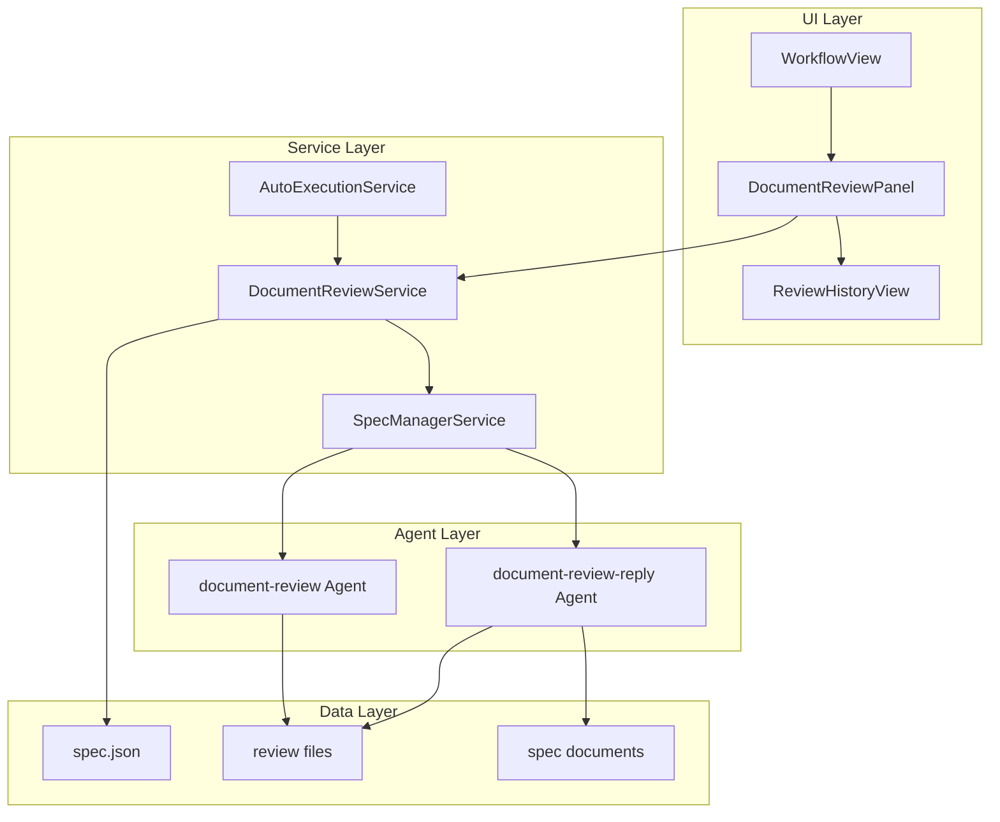
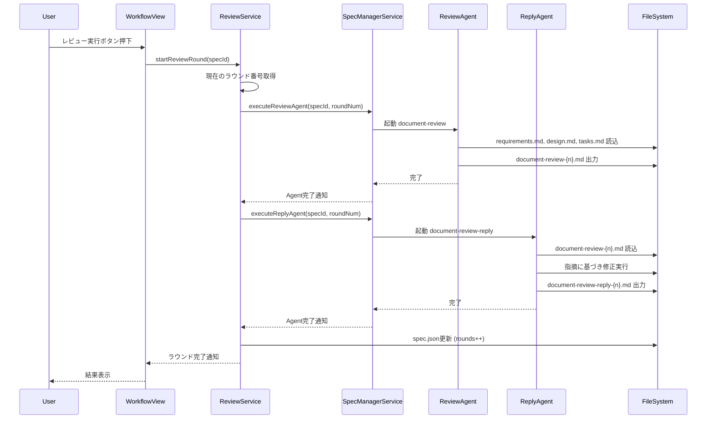
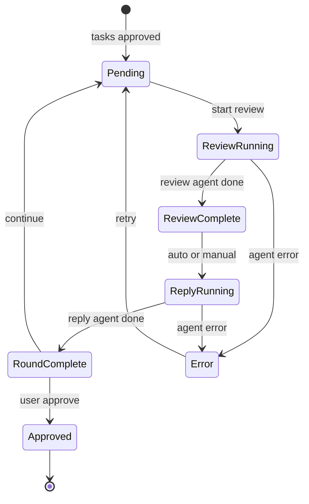

# Design Document

## Overview

**Purpose**: 本機能は、SDDワークフローにおけるタスク生成後・実装開始前の品質保証ステップとして、ドキュメントレビューワークフローを提供する。2つの独立したエージェント（document-review、document-review-reply）による対話的レビューにより、過剰な指摘を防ぎながら仕様ドキュメント間の整合性と品質を確保する。

**Users**: 開発者は、このワークフローを使用してrequirements.md、design.md、tasks.mdの総合レビューを実施し、実装前に仕様の整合性問題を検出・修正できる。

**Impact**: 既存のワークフローフェーズ（tasks → impl）の間に新しいレビューフェーズを挿入し、spec.jsonに`documentReview`フィールドを追加する。既存のcc-sddワークフローとの互換性は維持される。

### Goals

- spec-tasks完了後、spec-impl開始前にドキュメントレビューワークフローを実行可能にする
- document-review → document-review-replyの1ラウンドを複数回実行し、品質収束まで繰り返す仕組みを提供
- 過剰な指摘を防ぐため、指摘の妥当性を検証する二重エージェント構成を実現
- 既存のcc-sdd互換性を維持しつつ、spec.jsonにレビュー状態を記録

### Non-Goals

- 実装コードのレビュー（本機能はドキュメントレビューのみ）
- 自動修正の完全自動化（document-review-replyエージェントが判断して修正）
- レビュー指摘の重大度による自動分類（エージェントの判断に依存）

## Architecture

### Existing Architecture Analysis

現在のSDD Managerアーキテクチャ:
- **SpecManagerService**: エージェントプロセスの起動・管理、セッション制御
- **AgentProcess**: Claude CLIプロセスのライフサイクル管理
- **WorkflowView**: 6フェーズ（requirements → design → tasks → impl → inspection → deploy）のUI表示
- **AutoExecutionService**: 自動実行フローの制御
- **spec.json**: フェーズ状態とapprovals管理

### Architecture Pattern & Boundary Map



**Architecture Integration**:
- Selected pattern: サービス層拡張パターン（既存のSpecManagerServiceを拡張）
- Domain/feature boundaries: DocumentReviewServiceを新規追加し、レビュー固有のロジックを分離
- Existing patterns preserved: AgentProcess、IPC通信パターン、Zustand状態管理
- New components rationale: レビューワークフローは複数ラウンドの管理が必要なため専用サービスを追加
- Steering compliance: Electron版の既存パターン（services/, stores/, components/）に準拠

### Technology Stack

| Layer | Choice / Version | Role in Feature | Notes |
|-------|------------------|-----------------|-------|
| Frontend / CLI | React 19 + TypeScript 5.8 | レビュー状態表示・操作UI | 既存技術スタック維持 |
| Backend / Services | Node.js (Electron) | レビューサービス・エージェント管理 | SpecManagerService拡張 |
| Data / Storage | ファイルシステム (spec.json, *.md) | レビュー状態・履歴保存 | 既存形式拡張 |
| Messaging / Events | IPC (contextBridge) | プロセス間通信 | 既存パターン維持 |

## System Flows

### Document Review Workflow Sequence



### Review Round State Machine



## Requirements Traceability

| Requirement | Summary | Components | Interfaces | Flows |
|-------------|---------|------------|------------|-------|
| 1.1 | spec-tasks完了後にレビュー実行可能 | DocumentReviewService | startReviewRound | Workflow Sequence |
| 1.2 | spec-impl開始前までラウンド追加可能 | DocumentReviewService | canAddRound | State Machine |
| 1.3 | スキップオプション | DocumentReviewService, WorkflowStore | skipReview | - |
| 1.4 | tasksフェーズ未完了時は実行不可 | DocumentReviewService | validatePreconditions | - |
| 2.1 | requirements/design/tasks全読込 | ReviewAgent (command) | - | Workflow Sequence |
| 2.2 | document-review-{n}.md出力 | ReviewAgent (command) | - | Workflow Sequence |
| 2.3 | ドキュメント間整合性検証 | ReviewAgent (command) | - | - |
| 2.4 | steering文書との整合性検証 | ReviewAgent (command) | - | - |
| 2.5 | インデックス増加 | DocumentReviewService | getNextRoundNumber | - |
| 3.1 | document-review-{n}.md読込 | ReplyAgent (command) | - | Workflow Sequence |
| 3.2 | 指摘妥当性評価 | ReplyAgent (command) | - | - |
| 3.3 | 妥当時ドキュメント修正 | ReplyAgent (command) | - | Workflow Sequence |
| 3.4 | 不適切時却下記録 | ReplyAgent (command) | - | - |
| 3.5 | document-review-reply-{n}.md出力 | ReplyAgent (command) | - | Workflow Sequence |
| 3.6 | 別エージェントインスタンス実行 | SpecManagerService | executeReplyAgent | - |
| 4.1 | 1セット=1ラウンドカウント | DocumentReviewService | completeRound | State Machine |
| 4.2 | rounds更新 | DocumentReviewService | updateSpecJson | - |
| 4.3 | 追加ラウンド許可 | DocumentReviewService | canAddRound | State Machine |
| 4.4 | 承認時status="approved" | DocumentReviewService | approveReview | State Machine |
| 4.5 | ラウンド数上限なし | DocumentReviewService | - | - |
| 5.1 | documentReviewフィールド追加 | SpecJson型拡張 | - | - |
| 5.2 | 既存フィールド維持 | SpecJson型 | - | - |
| 5.3 | フィールド未存在時既存動作 | getPhaseStatus | - | - |
| 5.4 | rounds/statusプロパティ | DocumentReviewState型 | - | - |
| 5.5 | 初回実行時フィールド初期化 | DocumentReviewService | initializeReviewState | - |
| 6.1 | ラウンド数/ステータス表示 | DocumentReviewPanel | - | - |
| 6.2 | レビューファイルタブ表示 | ArtifactEditor | - | - |
| 6.3 | 全ラウンドタブ表示 | ArtifactEditor | - | - |
| 6.4 | 進行インジケーター（タイトル左側） | DocumentReviewPanel | - | - |
| 6.5 | 進行インジケーター4状態 | DocumentReviewPanel | - | - |
| 6.6 | 自動実行フラグ制御UI（タイトル右側） | DocumentReviewPanel | onAutoExecutionFlagChange | - |
| 6.7 | 自動実行フラグ3値切替 | DocumentReviewPanel | onAutoExecutionFlagChange | - |
| 6.8 | レビュー中の他タスク実行禁止 | WorkflowView | runningPhases | - |
| 7.1 | 自動実行時自動レビュー | AutoExecutionService | executeReviewIfEnabled | - |
| 7.2 | 自動reply実行 | AutoExecutionService | - | - |
| 7.3 | スキップフラグ対応 | AutoExecutionService, WorkflowStore | documentReviewSkip | - |
| 7.4 | スキップオプション設定追加 | WorkflowStore, DocumentReviewSettingsPanel | documentReviewOptions, onOptionsChange | - |
| 7.5 | 自動実行完了時確認 | AutoExecutionService | - | - |
| 8.1 | reviewエージェントエラー通知 | SpecManagerService | onError callback | - |
| 8.2 | replyエージェントエラーマーク | DocumentReviewService | markRoundIncomplete | - |
| 8.3 | エラーラウンド再実行許可 | DocumentReviewService | retryRound | - |
| 8.4 | ファイル不存在時エラー | DocumentReviewService | validateDocuments | - |

## Components and Interfaces

| Component | Domain/Layer | Intent | Req Coverage | Key Dependencies (P0/P1) | Contracts |
|-----------|--------------|--------|--------------|--------------------------|-----------|
| DocumentReviewService | Service | レビューワークフロー管理 | 1.1-1.4, 4.1-4.5, 5.5, 8.1-8.4 | SpecManagerService (P0) | Service |
| DocumentReviewPanel | UI | レビュー操作・状態表示 | 6.1, 6.4, 6.5 | DocumentReviewService (P0) | State |
| ArtifactEditor | UI | レビューファイルタブ表示 | 6.2, 6.3 | specStore (P1) | State |
| DocumentReviewSettingsPanel | UI | レビューオプション設定 | 7.4 | workflowStore (P0) | State |
| ExtendedSpecJson | Types | spec.json型拡張 | 5.1-5.4 | - | - |
| AutoExecutionService拡張 | Service | 自動実行統合 | 7.1-7.5 | DocumentReviewService (P0) | Service |

### Service Layer

#### DocumentReviewService

| Field | Detail |
|-------|--------|
| Intent | ドキュメントレビューワークフローのライフサイクル管理 |
| Requirements | 1.1, 1.2, 1.3, 1.4, 4.1, 4.2, 4.3, 4.4, 4.5, 5.5, 8.1, 8.2, 8.3, 8.4 |

**Responsibilities & Constraints**
- レビューラウンドの開始・完了管理
- spec.jsonのdocumentReviewフィールド更新
- 前提条件の検証（tasksフェーズ完了確認）
- レビューファイル存在確認

**Dependencies**
- Inbound: AutoExecutionService - 自動実行時のレビュー開始 (P0)
- Inbound: DocumentReviewPanel - UI操作 (P0)
- Outbound: SpecManagerService - エージェント実行 (P0)
- Outbound: FileService - ファイル操作 (P1)

**Contracts**: Service [x] / API [ ] / Event [ ] / Batch [ ] / State [ ]

##### Service Interface

```typescript
interface DocumentReviewService {
  /**
   * レビューワークフローを開始可能か確認
   * @returns 開始可能な場合true
   */
  canStartReview(specId: string): Promise<boolean>;

  /**
   * 新しいレビューラウンドを開始
   * @returns ラウンド番号
   */
  startReviewRound(specId: string): Promise<Result<number, ReviewError>>;

  /**
   * review-replyを実行
   */
  executeReplyAgent(specId: string, roundNumber: number): Promise<Result<void, ReviewError>>;

  /**
   * ラウンドを完了としてマーク
   */
  completeRound(specId: string, roundNumber: number): Promise<Result<void, ReviewError>>;

  /**
   * レビューワークフローを承認
   */
  approveReview(specId: string): Promise<Result<void, ReviewError>>;

  /**
   * レビューワークフローをスキップ
   */
  skipReview(specId: string): Promise<Result<void, ReviewError>>;

  /**
   * 現在のレビュー状態を取得
   */
  getReviewState(specId: string): Promise<DocumentReviewState | null>;

  /**
   * 次のラウンド番号を取得
   */
  getNextRoundNumber(specId: string): Promise<number>;

  /**
   * ラウンドを再実行
   */
  retryRound(specId: string, roundNumber: number): Promise<Result<void, ReviewError>>;
}

type ReviewError =
  | { type: 'PRECONDITION_FAILED'; message: string }
  | { type: 'AGENT_ERROR'; message: string }
  | { type: 'FILE_NOT_FOUND'; path: string }
  | { type: 'ALREADY_RUNNING' }
  | { type: 'ALREADY_APPROVED' };
```

- Preconditions: tasksフェーズがapproved、implフェーズが未開始
- Postconditions: spec.jsonのdocumentReviewフィールドが更新
- Invariants: ラウンド番号は常に1以上の連番

**Implementation Notes**
- Integration: SpecManagerServiceのexecutePhase/executeValidationパターンを参考に実装
- Validation: 開始前にrequirements.md, design.md, tasks.mdの存在確認
- Risks: エージェント実行中の中断時、spec.jsonの状態とファイル状態の不整合

### UI Layer

#### DocumentReviewPanel

| Field | Detail |
|-------|--------|
| Intent | レビューワークフローの操作UI提供 |
| Requirements | 6.1, 6.4, 6.5, 6.6, 6.7, 6.8 |

**Responsibilities & Constraints**
- レビュー状態（ラウンド数）の表示
- レビュー開始ボタンの提供（実行中でなければ有効）
- 実行中状態の表示
- 進行インジケーター表示（タイトル左側、要件定義/設計/タスクパネルと同様）
- 自動実行フラグ制御UI表示（タイトル右側、実行/一時停止/スキップの3値）

**進行インジケーター状態**
| 状態 | 条件 | 表示 |
|------|------|------|
| チェック済 | rounds >= 1 | ✓ アイコン（緑） |
| チェック無し | rounds === 0 かつ 非実行中 | ○ アイコン（グレー） |
| 実行中 | isExecuting === true または status === 'in_progress' | スピナー（青） |
| スキップ予定 | 自動実行フラグが 'skip' | → アイコン（黄） |

**自動実行フラグ3値**
| 値 | 動作 |
|----|------|
| run | 自動実行時にレビューを実行 |
| pause | タスク終了時に一時停止 |
| skip | レビューをスキップして実装タスクに進む |

**Dependencies**
- Inbound: WorkflowView - 親コンポーネントからの表示 (P0)
- Outbound: DocumentReviewService - レビュー操作 (P0)
- Outbound: workflowStore - 自動実行フラグ参照・更新 (P0)
- Outbound: specStore - 状態参照 (P1)

**Contracts**: Service [ ] / API [ ] / Event [ ] / Batch [ ] / State [x]

##### State Management

```typescript
/** 自動実行フラグの3値 */
type DocumentReviewAutoExecutionFlag = 'run' | 'pause' | 'skip';

interface DocumentReviewPanelProps {
  /** 現在のレビュー状態 */
  reviewState: DocumentReviewState | null;
  /** 実行中か（エージェント実行中） */
  isExecuting: boolean;
  /** 自動実行フラグ */
  autoExecutionFlag?: DocumentReviewAutoExecutionFlag;
  /** レビュー開始ハンドラ */
  onStartReview: () => void;
  /** 自動実行フラグ変更ハンドラ */
  onAutoExecutionFlagChange?: (flag: DocumentReviewAutoExecutionFlag) => void;
}
```

**Implementation Notes**
- Integration: WorkflowViewのimplフェーズ前（tasksフェーズ後）に配置
- Validation: レビュー開始ボタンは `!isExecuting` のみで活性判定（承認ボタンは不要）
- UI: 要件定義/設計/タスクパネルと同様のレイアウト（左に進行インジケーター、右に自動実行フラグ制御）
- Note: 承認ボタン・履歴ボタンは不要。レビューファイルは中央パネル（ArtifactEditor）のタブとして表示
- Risks: 状態変更時のUI更新遅延

### Types Layer

#### ExtendedSpecJson

| Field | Detail |
|-------|--------|
| Intent | spec.jsonにdocumentReviewフィールドを追加 |
| Requirements | 5.1, 5.2, 5.3, 5.4 |

**Data Structure**

```typescript
/** ドキュメントレビュー状態 */
interface DocumentReviewState {
  /** 完了したラウンド数 */
  rounds: number;
  /** レビューステータス */
  status: 'pending' | 'in_progress' | 'approved' | 'skipped';
  /** 現在実行中のラウンド番号（実行中の場合） */
  currentRound?: number;
  /** 各ラウンドの詳細（オプション） */
  roundDetails?: RoundDetail[];
}

interface RoundDetail {
  roundNumber: number;
  reviewCompletedAt?: string;
  replyCompletedAt?: string;
  status: 'review_complete' | 'reply_complete' | 'incomplete';
}

/** 拡張されたspec.json型 */
interface ExtendedSpecJson extends SpecJson {
  /** ドキュメントレビュー状態（オプショナル） */
  documentReview?: DocumentReviewState;
}
```

**Implementation Notes**
- Integration: 既存のSpecJson型を拡張（破壊的変更なし）
- Validation: documentReviewフィールド未存在時はデフォルト値として扱う
- Risks: 既存のcc-sddワークフローとの互換性確認必須

### Service Layer Extension

#### AutoExecutionService拡張

| Field | Detail |
|-------|--------|
| Intent | 自動実行フローにドキュメントレビューを統合 |
| Requirements | 7.1, 7.2, 7.3, 7.4, 7.5 |

**追加機能**
- tasksフェーズ完了後、自動的にdocument-reviewを実行
- document-review完了後、自動的にdocument-review-replyを実行
- スキップフラグ設定時はレビューをスキップしてimplへ進行
- レビュー完了後、次ラウンド実行または承認をユーザーに確認

**WorkflowStore拡張**

```typescript
interface DocumentReviewOptions {
  /** 自動実行時にレビューをスキップ */
  skip: boolean;
  /** 自動的にreplyまで実行（デフォルト: true） */
  autoReply: boolean;
}

interface WorkflowState {
  // 既存フィールド...
  /** ドキュメントレビューオプション */
  documentReviewOptions: DocumentReviewOptions;
}
```

**Implementation Notes**
- Integration: executePhase後のフック処理としてレビュー実行を挿入
- Validation: documentReviewOptions.skipがtrueの場合はレビューをバイパス
- Risks: 自動実行中のユーザー介入処理

#### DocumentReviewSettingsPanel

| Field | Detail |
|-------|--------|
| Intent | ドキュメントレビューの自動実行オプション設定UI |
| Requirements | 7.4 |

**Responsibilities & Constraints**
- DocumentReviewOptionsの設定コントロール提供
- スキップオプションのチェックボックス
- 自動リプライオプションのチェックボックス
- WorkflowStoreとの連携

**Dependencies**
- Inbound: WorkflowView - 設定パネル表示 (P0)
- Outbound: workflowStore - 設定値の読み書き (P0)

**Contracts**: Service [ ] / API [ ] / Event [ ] / Batch [ ] / State [x]

##### State Management

```typescript
interface DocumentReviewSettingsPanelProps {
  documentReviewOptions: DocumentReviewOptions;
  onOptionsChange: (options: Partial<DocumentReviewOptions>) => void;
}
```

**UI Components**
- スキップチェックボックス: 「ドキュメントレビューをスキップ」
- 自動リプライチェックボックス: 「レビュー完了後に自動でリプライを実行」

**Implementation Notes**
- Integration: WorkflowViewの自動実行設定セクションに配置
- Validation: チェックボックス変更時にworkflowStore.setDocumentReviewOptionsを呼び出し
- Risks: 設定変更と実行中状態の競合

## Data Models

### Domain Model

**Aggregates**:
- Spec（集約ルート）: spec.json、requirements.md、design.md、tasks.md、レビューファイル群を管理
- DocumentReviewRound: 1ラウンドのレビュー・リプライの状態を管理

**Entities**:
- ReviewFile: document-review-{n}.md
- ReplyFile: document-review-reply-{n}.md

**Value Objects**:
- DocumentReviewState: レビュー全体の状態
- RoundDetail: 各ラウンドの詳細状態

**Domain Events**:
- ReviewRoundStarted: ラウンド開始時
- ReviewAgentCompleted: レビューエージェント完了時
- ReplyAgentCompleted: リプライエージェント完了時
- ReviewApproved: レビュー承認時
- ReviewSkipped: レビュースキップ時

**Invariants**:
- ラウンド番号は1から始まる連番
- status="approved"後は新しいラウンドを追加不可
- tasksフェーズがapprovedでないとレビュー開始不可

### Logical Data Model

**spec.json拡張**:

```json
{
  "feature_name": "example-feature",
  "created_at": "2025-12-11T00:00:00Z",
  "updated_at": "2025-12-11T00:00:00Z",
  "language": "ja",
  "phase": "tasks-generated",
  "approvals": {
    "requirements": { "generated": true, "approved": true },
    "design": { "generated": true, "approved": true },
    "tasks": { "generated": true, "approved": true }
  },
  "ready_for_implementation": false,
  "documentReview": {
    "rounds": 2,
    "status": "approved",
    "roundDetails": [
      {
        "roundNumber": 1,
        "reviewCompletedAt": "2025-12-11T01:00:00Z",
        "replyCompletedAt": "2025-12-11T01:30:00Z",
        "status": "reply_complete"
      },
      {
        "roundNumber": 2,
        "reviewCompletedAt": "2025-12-11T02:00:00Z",
        "replyCompletedAt": "2025-12-11T02:30:00Z",
        "status": "reply_complete"
      }
    ]
  }
}
```

**ファイル構造**:

```
.kiro/specs/{feature}/
  spec.json
  requirements.md
  design.md
  tasks.md
  document-review-1.md        # ラウンド1のレビュー
  document-review-reply-1.md  # ラウンド1のリプライ
  document-review-2.md        # ラウンド2のレビュー
  document-review-reply-2.md  # ラウンド2のリプライ
```

## Error Handling

### Error Strategy

レビューワークフローのエラーは以下のカテゴリで処理:

### Error Categories and Responses

**User Errors** (操作エラー):
- 前提条件未達成（tasksフェーズ未完了）→ エラーメッセージ表示、操作ブロック
- 既に承認済み → 警告表示、操作ブロック

**System Errors** (エージェントエラー):
- エージェント起動失敗 → エラーログ記録、ユーザー通知、再実行許可
- エージェント実行中断 → ラウンドを未完了マーク、再実行許可

**Business Logic Errors** (ワークフローエラー):
- ドキュメント不存在 → エラーメッセージ表示、レビュー中断
- spec.json更新失敗 → エラーログ記録、手動復旧ガイダンス

### Monitoring

- エージェント実行ログ: .kiro/specs/{feature}/logs/配下に保存（既存パターン）
- エラーイベント: NotificationStoreで通知表示
- 状態追跡: spec.jsonのdocumentReview.roundDetailsで各ラウンド状態記録

## Testing Strategy

### Unit Tests

- DocumentReviewService.canStartReview: 前提条件判定ロジック
- DocumentReviewService.getNextRoundNumber: ラウンド番号計算
- getPhaseStatus拡張: documentReviewフィールド考慮
- ExtendedSpecJson型: 既存フィールドとの互換性

### Integration Tests

- レビューラウンド開始→完了フロー
- AutoExecutionServiceとDocumentReviewServiceの連携
- spec.json更新と状態反映

### E2E Tests

- レビュー開始ボタン押下→エージェント実行→結果表示
- 複数ラウンド実行→承認フロー
- スキップフロー

## Security Considerations

- ファイルアクセス: 既存のfileService権限チェックを使用
- エージェント実行: 既存のSpecManagerServiceセキュリティ境界を維持

## Performance & Scalability

- レビューファイル数: ラウンド数に比例して増加（1ラウンド=2ファイル）
- 履歴表示: 大量ラウンド時はページネーションまたは遅延読み込みを検討
- エージェント実行: 既存のタイムアウト設定（10分）を適用
