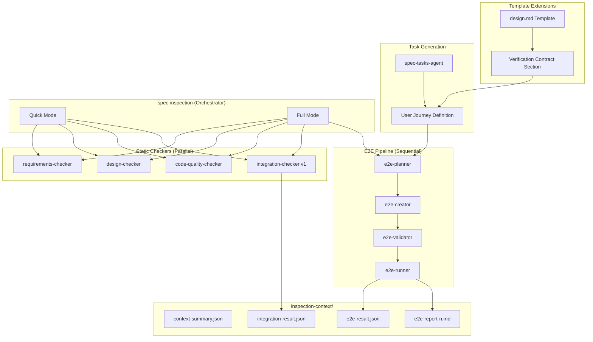
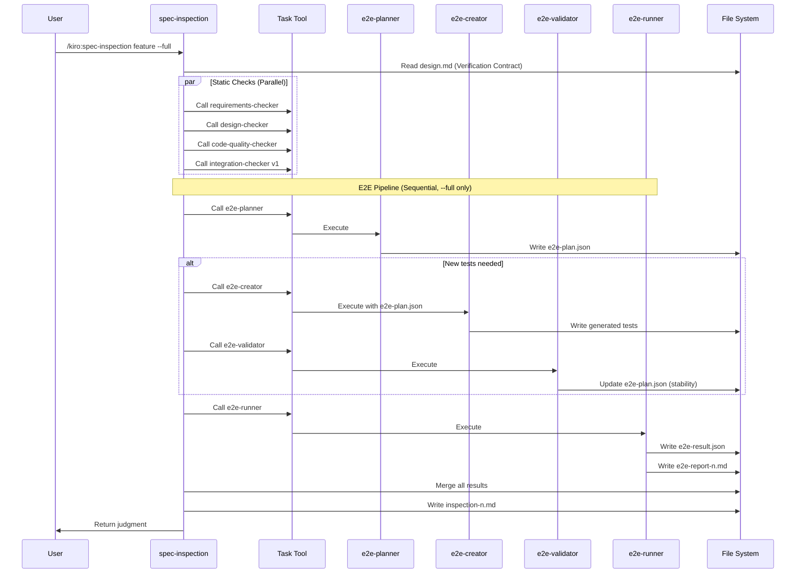
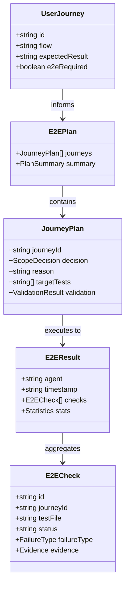

# Design: E2E Workflow Integration

## Overview

**Purpose**: 本機能はE2Eテストを仕様（Design）の一部として定義し、Inspectionで分業体制による検証を必須化する。design.mdにUser Journey / Impact Analysisを追加し、inspection-distributedで実装したintegration-checkerを拡張してE2Eパイプラインを統合する。

**Users**: 開発者がspec-inspectionの--fullモードを実行する際、静的検査に加えてE2Eテストによる動的検証を受けられるようになる。

**Impact**:
- design.mdテンプレートに「Verification Contract」セクションを追加
- spec-tasks-agentがUser JourneyからE2Eタスクを自動生成
- integration-checker v1を拡張してv2（E2Eパイプライン統合）を実装
- 4つの新規E2Eサブエージェント（e2e-planner, e2e-creator, e2e-validator, e2e-runner）を追加

### Goals

- design.mdにVerification Contractセクションを追加し、E2Eテストの根拠を設計段階で明確化
- User JourneyからE2Eテストタスクを自動生成し、一貫性を保証
- integration-checker v2としてE2Eパイプラインを統合し、静的検査と動的検査を一貫した統合検査として実行
- Full Mode（--full）で5つ目の検査カテゴリとしてE2Eを追加

### Non-Goals

- Inspection基盤のサブエージェント分散（inspection-distributedで実装済み）
- requirements-checker, design-checker, code-quality-checker（inspection-distributedで実装済み）
- integration-checker v1の静的検査部分（inspection-distributedで実装済み）
- 既存specのマイグレーション（旧形式のまま動作可能）
- E2E Only Mode（将来の拡張として検討）

## Architecture

### Existing Architecture Analysis

inspection-distributed specで実装された現在のアーキテクチャ:

```
spec-inspection (Orchestrator)
    |
    +-- requirements-checker (parallel)
    +-- design-checker (parallel)
    +-- code-quality-checker (parallel)
    +-- integration-checker v1 (parallel, static only)
```

**課題**:
- 静的検査のみでは統合ミスを検出できないケースがある
- E2Eテストの実行が手動かつ任意
- design.mdに「どう検証するか」の契約がない

### Architecture Pattern & Boundary Map



**Key Decisions**:
- **Template First**: design.mdテンプレートにVerification Contractを追加し、設計段階でE2E根拠を定義
- **Task Auto-Generation**: spec-tasks-agentがUser JourneyからE2Eタスクを自動生成
- **Sequential E2E Pipeline**: E2Eサブエージェントは順次実行（依存関係あり）
- **Mode Separation**: Quick Mode（静的のみ）とFull Mode（静的+E2E）の明確な分離
- **Report Separation**: e2e-report-{n}.mdを独立ファイルとして生成し、inspection-{n}.mdから参照

**Steering Compliance**:
- structure.md: エージェントファイルは`.claude/agents/kiro/`に配置
- design-principles.md: 単一責任の原則に従い、各E2Eサブエージェントは1つのE2Eフェーズに特化
- e2e-testing.md: 既存のE2Eテストパターン（WebdriverIO + wdio-electron-service）を踏襲

### Technology Stack

| Layer | Choice / Version | Role in Feature | Notes |
|-------|------------------|-----------------|-------|
| Agent Runtime | Claude Code + Task tool | サブエージェント呼び出し | 既存パターンを踏襲 |
| E2E Framework | WebdriverIO 9.20+ | E2Eテスト実行 | wdio-electron-service使用 |
| Mock CLI | mock-claude.sh | E2Eテスト生成のモック | 既存インフラ拡張 |
| Data Exchange | JSON | サブエージェント間結果共有 | inspection-distributed準拠 |
| Temporary Storage | `.kiro/specs/{feature}/inspection-context/` | 検査コンテキスト・結果格納 | Spec単位で分離 |

### Command Prompt Architecture

**Execution Model**:
- [x] CLI invocation: Task toolを使用してE2Eサブエージェントを順次呼び出し

**Rationale**: 各E2Eサブエージェントは前段の出力に依存するため、Task toolによる順次呼び出しが必要。並列実行は不可。

**Data Flow**:


**Key Decisions**:
- E2E Pipelineは--fullオプション時のみ実行
- e2e-plannerが実行スコープを決定し、不要なテスト生成をスキップ
- e2e-validatorは新規生成テストのみ検証（既存テストはスキップ）
- e2e-runnerが証拠収集と失敗分類を担当

## Requirements Traceability

| Criterion ID | Summary | Components | Implementation Approach |
|--------------|---------|------------|------------------------|
| 1.1 | design.mdにVerification Contract追加 | design.mdテンプレート | テンプレート拡張 |
| 1.2 | User Journey Definitionサブセクション | design.mdテンプレート | テンプレート拡張 |
| 1.3 | Impact Analysis Contractサブセクション | design.mdテンプレート | 既存セクション統合 |
| 1.4 | spec-design-agentのVC生成改修 | spec-design-agent.md | 既存エージェント改修 |
| 2.1 | User Journey Definition読み取り | spec-tasks-agent.md | 既存エージェント改修 |
| 2.2 | E2E必須フラグ判定 | spec-tasks-agent.md | 既存エージェント改修 |
| 2.3 | E2Eタスク形式生成 | spec-tasks-agent.md | 既存エージェント改修 |
| 2.4 | E2Eタスク配置位置 | spec-tasks-agent.md | 既存エージェント改修 |
| 3.1 | v1全機能維持 | integration-checker.md | 既存機能維持 |
| 3.2 | Full Mode E2E実行 | spec-inspection-agent.md | 既存エージェント改修 |
| 3.3 | E2Eサブエージェント呼び出し | spec-inspection-agent.md | 新規実装 |
| 3.4 | E2E結果をintegration-result.jsonに含む | e2e-runner-agent.md | 新規作成 |
| 3.5 | e2e-report-{n}.md生成 | e2e-runner-agent.md | 新規作成 |
| 4.1 | User Journey抽出 | e2e-planner-agent.md | 新規作成 |
| 4.2 | 既存テストカバレッジ確認 | e2e-planner-agent.md | 新規作成 |
| 4.3 | 実行スコープ決定 | e2e-planner-agent.md | 新規作成 |
| 4.4 | テスト計画書出力 | e2e-planner-agent.md | 新規作成 |
| 5.1 | 計画に基づくテスト生成 | e2e-creator-agent.md | 新規作成 |
| 5.2 | フレームワーク情報参照 | e2e-creator-agent.md | 新規作成 |
| 5.3 | 既存helper活用 | e2e-creator-agent.md | 新規作成 |
| 5.4 | 生成テスト配置 | e2e-creator-agent.md | 新規作成 |
| 5.5 | 生成テストパス出力 | e2e-creator-agent.md | 新規作成 |
| 6.1 | 新規テストのみ実行 | e2e-validator-agent.md | 新規作成 |
| 6.2 | 3回実行検証 | e2e-validator-agent.md | 新規作成 |
| 6.3 | STABLE判定 | e2e-validator-agent.md | 新規作成 |
| 6.4 | FLAKY判定と修正 | e2e-validator-agent.md | 新規作成 |
| 6.5 | 検証結果出力 | e2e-validator-agent.md | 新規作成 |
| 7.1 | 環境確認 | e2e-runner-agent.md | 新規作成 |
| 7.2 | 計画に基づくテスト実行 | e2e-runner-agent.md | 新規作成 |
| 7.3 | 失敗時証拠収集 | e2e-runner-agent.md | 新規作成 |
| 7.4 | 失敗タイプ分類 | e2e-runner-agent.md | 新規作成 |
| 7.5 | e2e-report-{n}.md生成 | e2e-runner-agent.md | 新規作成 |
| 8.1 | 独立ファイル配置 | e2e-runner-agent.md | 新規作成 |
| 8.2 | レポートセクション構成 | e2e-runner-agent.md | 新規作成 |
| 8.3 | inspection-{n}.mdからの参照 | spec-inspection-agent.md | 既存エージェント改修 |
| 9.1 | --fullオプション | spec-inspection-agent.md | 既存エージェント改修 |
| 9.2 | Full Mode実行内容 | spec-inspection-agent.md | 既存エージェント改修 |
| 9.3 | ModeフィールドFull記録 | spec-inspection-agent.md | 既存エージェント改修 |
| 9.4 | User Journey Fail→Critical | spec-inspection-agent.md | 既存エージェント改修 |
| 9.5 | 無関係Fail→Warning | spec-inspection-agent.md | 既存エージェント改修 |
| 10.1 | E2Eフレームワーク自動検出 | generate-inspection-e2e-agent.md | 新規作成 |
| 10.2 | E2E情報解析・抽出 | generate-inspection-e2e-agent.md | 新規作成 |
| 10.3 | inspection-e2e.md生成 | generate-inspection-e2e-agent.md | 新規作成 |
| 10.4 | 既存e2e-testing.mdとの統合 | generate-inspection-e2e-agent.md | 新規作成 |
| 11.1 | Judgment Rationale拡張 | spec-inspection-agent.md | 既存エージェント改修 |
| 11.2 | セマンティック判定理由 | spec-inspection-agent.md | 既存エージェント改修 |

### Coverage Validation Checklist

- [x] Every criterion ID from requirements.md appears in the table above
- [x] Each criterion has specific component names (not generic references)
- [x] Implementation approach distinguishes "reuse existing" vs "new implementation"
- [x] User-facing criteria specify concrete components

## Components and Interfaces

| Component | Domain/Layer | Intent | Req Coverage | Key Dependencies | Contracts |
|-----------|--------------|--------|--------------|------------------|-----------|
| design.md Template | Template | Verification Contract定義 | 1.1-1.3 | - | State |
| spec-design-agent.md | Agent | VC生成 | 1.4 | design.md Template (P0) | Service |
| spec-tasks-agent.md | Agent | E2Eタスク自動生成 | 2.1-2.4 | design.md (P0) | Service |
| spec-inspection-agent.md | Agent | Full Mode対応 | 3.2, 3.3, 8.3, 9.1-9.5, 11.1-11.2 | E2Eサブエージェント (P0) | Service |
| e2e-planner-agent.md | Agent | E2E計画 | 4.1-4.4 | inspection-e2e.md (P1) | Service |
| e2e-creator-agent.md | Agent | E2Eテスト生成 | 5.1-5.5 | e2e-planner (P0) | Service |
| e2e-validator-agent.md | Agent | テスト安定性検証 | 6.1-6.5 | e2e-creator (P0) | Service |
| e2e-runner-agent.md | Agent | E2E実行・レポート | 7.1-7.5, 8.1-8.2, 3.4-3.5 | e2e-validator (P0) | Service |
| generate-inspection-e2e-agent.md | Agent | steering生成 | 10.1-10.4 | e2e-testing.md (P1) | Service |
| E2EPlan | Data Model | テスト計画 | 4.4 | - | State |
| E2EResult | Data Model | テスト結果 | 3.4 | - | State |

### Template Layer

#### design.md Template (Verification Contract Extension)

| Field | Detail |
|-------|--------|
| Intent | design.mdに「どう検証するか」を定義するセクションを追加 |
| Requirements | 1.1, 1.2, 1.3 |

**Template Extension**:

```markdown
## Verification Contract

### User Journey Definition

| Journey ID | 操作フロー | 期待結果 | E2E必須 |
|------------|-----------|---------|---------|
| UJ-001 | ユーザーがSpecを選択しワークフローを実行 | ワークフローが完了しspec.jsonが更新される | Yes |
| UJ-002 | ユーザーが自動実行を開始 | 全フェーズが順次実行される | Yes |

**Guidelines**:
- Journey IDは`UJ-{NNN}`形式で連番
- 操作フローは1-2文で簡潔に
- E2E必須がYesの場合、tasks.mdにE2Eタスクが自動生成される

### Impact Analysis Contract

**既存の「Integration & Deprecation Strategy」セクションをこのサブセクションとして統合**

| 対象ファイル | アクション | 理由 |
|-------------|-----------|------|
| path/to/file.ts | DELETE | 新モジュールに置き換え |
| path/to/other.ts | UPDATE | 新インターフェースに対応 |

**Guidelines**:
- DELETE: 物理削除対象を明示
- UPDATE: 変更が必要なファイルとその理由
- プレースホルダー削除も含む
```

### Agent Layer

#### spec-design-agent.md (Extension)

| Field | Detail |
|-------|--------|
| Intent | design.md生成時にVerification Contractセクションを含める |
| Requirements | 1.4 |

**Extension Details**:
- Step 3で`Verification Contract`セクションを生成
- requirements.mdからUser Journey候補を抽出
- 既存の`Integration & Deprecation Strategy`を`Impact Analysis Contract`に統合

**Contracts**: Service [x]

##### Service Interface

```typescript
interface VerificationContractGenerator {
  extractUserJourneys(requirementsMd: string): UserJourney[];
  extractImpactAnalysis(existingDesign: string): ImpactItem[];
  generateVerificationContract(journeys: UserJourney[], impacts: ImpactItem[]): string;
}

interface UserJourney {
  id: string;           // UJ-NNN format
  flow: string;         // 操作フロー
  expectedResult: string; // 期待結果
  e2eRequired: boolean; // E2E必須フラグ
}
```

- Preconditions: requirements.md承認済み
- Postconditions: design.mdにVerification Contractセクションが含まれる
- Invariants: 既存のdesign.mdセクション構造を維持

#### spec-tasks-agent.md (Extension)

| Field | Detail |
|-------|--------|
| Intent | User JourneyからE2Eテストタスクを自動生成 |
| Requirements | 2.1, 2.2, 2.3, 2.4 |

**Extension Details**:
- Step 2でdesign.mdからUser Journey Definitionを読み取り
- E2E必須フラグがYesのJourneyに対してE2Eタスクを生成
- 生成タスクは「テストタスク」セクションに配置

**Contracts**: Service [x]

##### Service Interface

```typescript
interface E2ETaskGenerator {
  readUserJourneys(designMd: string): UserJourney[];
  generateE2ETasks(journeys: UserJourney[]): Task[];
  insertTasksAtTestSection(tasksMd: string, e2eTasks: Task[]): string;
}

interface Task {
  id: string;           // X.N format
  description: string;  // タスク説明
  details: string[];    // サブ項目
  requirements: string; // UJ-{id}
}
```

- Preconditions: design.md承認済み、User Journey Definition存在
- Postconditions: tasks.mdにE2Eタスクが含まれる
- Invariants: 既存タスク構造を維持

**Generated Task Format**:
```markdown
- [ ] X.1 (P) UJ-001 のE2Eテスト作成
  - ユーザーがSpecを選択しワークフローを実行の検証テスト
  - _Requirements: UJ-001_
```

#### spec-inspection-agent.md (Extension)

| Field | Detail |
|-------|--------|
| Intent | Full Modeを追加し、E2Eパイプラインを統合 |
| Requirements | 3.2, 3.3, 8.3, 9.1-9.5, 11.1, 11.2 |

**Extension Details**:
- `--full`オプションでFull Modeを有効化
- Full Modeでは静的検査後にE2E Pipelineを実行
- inspection-{n}.mdにe2e-report-{n}.mdへの参照を追加
- Judgment Rationaleにe2e結果を含むセマンティック説明を追加

**Contracts**: Service [x]

##### Service Interface

```typescript
interface InspectionOrchestrator {
  // 既存メソッド（inspection-distributed準拠）
  loadContext(feature: string): ContextSummary;
  invokeSubAgents(contextSummaryPath: string): Promise<void>;
  mergeResults(resultPaths: string[]): MergedResult;
  renderJudgment(merged: MergedResult): Judgment;

  // 新規メソッド
  invokeE2EPipeline(feature: string, contextSummaryPath: string): Promise<E2EResult>;
  mergeE2EResults(staticResult: MergedResult, e2eResult: E2EResult): MergedResult;
  generateSemanticRationale(merged: MergedResult, e2eReport: string): string;
}

type InspectionMode = 'Quick' | 'Full';
```

- Preconditions: spec.json存在、tasks.md承認済み
- Postconditions: inspection-{n}.md生成、e2e-report-{n}.md生成（Full Mode時）
- Invariants: Quick Mode時はE2E Pipeline未実行

#### e2e-planner-agent.md

| Field | Detail |
|-------|--------|
| Intent | E2Eテストの計画を自動化し、実行スコープを決定 |
| Requirements | 4.1, 4.2, 4.3, 4.4 |

**Responsibilities & Constraints**:
- design.mdからUser Journey Definitionを抽出
- steering/inspection-e2e.md（またはe2e-testing.md）と照合
- 実行スコープ決定: Create/Execute/Defer
- e2e-plan.jsonを出力

**Dependencies**:
- Inbound: spec-inspection-agent.md - 呼び出し元 (P0)
- External: context-summary.json - 共通コンテキスト (P0)
- External: inspection-e2e.md - E2E情報 (P1)

**Contracts**: Service [x]

##### Service Interface

```typescript
interface E2EPlanner {
  extractUserJourneys(designMd: string): UserJourney[];
  analyzeExistingCoverage(e2eTestingMd: string): TestCoverage;
  determineScopeDecision(journey: UserJourney, coverage: TestCoverage): ScopeDecision;
  generatePlan(journeys: UserJourney[], decisions: ScopeDecision[]): E2EPlan;
}

type ScopeDecision = 'Create' | 'Execute' | 'Defer';

interface E2EPlan {
  journeys: Array<{
    journeyId: string;
    decision: ScopeDecision;
    reason: string;
    targetTests?: string[];
  }>;
  summary: {
    create: number;
    execute: number;
    defer: number;
  };
}
```

- Preconditions: context-summary.json存在、design.md存在
- Postconditions: e2e-plan.json出力
- Invariants: 全User Journeyを評価（スキップ不可）

#### e2e-creator-agent.md

| Field | Detail |
|-------|--------|
| Intent | E2Eテストコードを自動生成 |
| Requirements | 5.1, 5.2, 5.3, 5.4, 5.5 |

**Responsibilities & Constraints**:
- e2e-plannerの計画でCreate判定されたJourneyのテストを生成
- steering/inspection-e2e.mdのフレームワーク情報を参照
- 既存helper関数、fixture、data-testidパターンを活用
- 生成テストを`e2e-wdio/generated/`に配置

**Dependencies**:
- Inbound: spec-inspection-agent.md - 呼び出し元 (P0)
- External: e2e-plan.json - テスト計画 (P0)
- External: inspection-e2e.md - フレームワーク情報 (P0)
- External: e2e-wdio/helpers/ - 既存ヘルパー (P1)

**Contracts**: Service [x]

##### Service Interface

```typescript
interface E2ECreator {
  loadPlan(planPath: string): E2EPlan;
  loadFrameworkInfo(inspectionE2EMd: string): FrameworkInfo;
  analyzeExistingHelpers(helpersDir: string): HelperInfo[];
  generateTest(journey: UserJourney, framework: FrameworkInfo, helpers: HelperInfo[]): GeneratedTest;
  writeTests(tests: GeneratedTest[], outputDir: string): string[];
}

interface GeneratedTest {
  journeyId: string;
  filename: string;
  content: string;
  dependencies: string[];
}

interface FrameworkInfo {
  runner: 'wdio' | 'playwright';
  configPath: string;
  testDir: string;
  fixturePattern: string;
}
```

- Preconditions: e2e-plan.json存在、Create決定あり
- Postconditions: 生成テストファイル配置、e2e-plan.jsonに生成パス追記
- Invariants: 既存テストファイルを上書きしない

#### e2e-validator-agent.md

| Field | Detail |
|-------|--------|
| Intent | AI生成テストの品質を検証し、フレイキーを検出 |
| Requirements | 6.1, 6.2, 6.3, 6.4, 6.5 |

**Responsibilities & Constraints**:
- e2e-creatorが生成した新規テストのみ検証
- 各テストを3回実行
- 3回中3回成功→STABLE、1回でも失敗→FLAKY
- FLAKYテストは修正を試み、それでも不安定なら除外

**Dependencies**:
- Inbound: spec-inspection-agent.md - 呼び出し元 (P0)
- External: e2e-plan.json - 生成テストパス (P0)
- External: wdio.conf.ts - テスト設定 (P1)

**Contracts**: Service [x]

##### Service Interface

```typescript
interface E2EValidator {
  loadGeneratedTests(planPath: string): string[];
  runTestMultipleTimes(testPath: string, times: number): TestRunResult[];
  analyzeStability(results: TestRunResult[]): StabilityResult;
  attemptFix(testPath: string, failurePattern: string): FixResult;
  updatePlanWithValidation(planPath: string, validations: ValidationResult[]): void;
}

type StabilityStatus = 'STABLE' | 'FLAKY' | 'EXCLUDED';

interface ValidationResult {
  testPath: string;
  status: StabilityStatus;
  passCount: number;
  failCount: number;
  failurePattern?: string;
  fixAttempted?: boolean;
}
```

- Preconditions: e2e-plan.json存在、生成テストあり
- Postconditions: e2e-plan.jsonに検証結果追記
- Invariants: 既存テストは検証しない、修正は1回まで

#### e2e-runner-agent.md

| Field | Detail |
|-------|--------|
| Intent | E2Eテストを実行し、証拠を収集してレポートを生成 |
| Requirements | 7.1, 7.2, 7.3, 7.4, 7.5, 8.1, 8.2, 3.4, 3.5 |

**Responsibilities & Constraints**:
- 実行前に環境確認（Electron停止、ポート9222利用可能、ビルド完了）
- e2e-plannerの計画に基づきテストを実行
- 失敗時にスクリーンショット、DOMスナップショット、コンソールログを収集
- 失敗タイプを分類（Critical/Warning/Info）
- e2e-report-{n}.mdを生成

**Dependencies**:
- Inbound: spec-inspection-agent.md - 呼び出し元 (P0)
- External: e2e-plan.json - 実行対象 (P0)
- External: wdio.conf.ts - テスト設定 (P0)

**Contracts**: Service [x]

##### Service Interface

```typescript
interface E2ERunner {
  checkEnvironment(): EnvironmentCheck;
  loadExecutionPlan(planPath: string): ExecutionPlan;
  runTests(plan: ExecutionPlan): TestExecutionResult[];
  collectEvidence(failedTest: TestExecutionResult): Evidence;
  classifyFailure(result: TestExecutionResult, journeyId?: string): FailureType;
  generateReport(results: TestExecutionResult[], reportNumber: number): string;
  generateE2EResult(results: TestExecutionResult[]): E2EResult;
}

type FailureType = 'Critical' | 'Warning' | 'Info';

interface EnvironmentCheck {
  electronStopped: boolean;
  port9222Available: boolean;
  buildComplete: boolean;
  errors: string[];
}

interface Evidence {
  screenshot?: string;
  domSnapshot?: string;
  consoleLogs?: string[];
}

interface E2EResult {
  agent: 'e2e-runner';
  timestamp: string;
  checks: E2ECheck[];
  stats: Statistics;
}
```

- Preconditions: 環境チェックPASS、e2e-plan.json存在
- Postconditions: e2e-result.json出力、e2e-report-{n}.md生成
- Invariants: 環境チェック失敗時は実行しない

#### generate-inspection-e2e-agent.md

| Field | Detail |
|-------|--------|
| Intent | プロジェクト固有のE2E情報をsteering化 |
| Requirements | 10.1, 10.2, 10.3, 10.4 |

**Responsibilities & Constraints**:
- プロジェクトのE2Eフレームワークを自動検出（WebdriverIO/Playwright/その他）
- 設定ファイル、テストディレクトリ、fixture、helper、カバレッジを解析
- steering/inspection-e2e.mdを生成
- 既存e2e-testing.mdとの統合または参照関係を設定

**Dependencies**:
- External: wdio.conf.ts / playwright.config.ts - 設定ファイル (P0)
- External: e2e-wdio/ or tests/e2e/ - テストディレクトリ (P0)
- External: steering/e2e-testing.md - 既存steering (P1)

**Contracts**: Service [x]

##### Service Interface

```typescript
interface InspectionE2EGenerator {
  detectFramework(projectRoot: string): DetectedFramework;
  analyzeTestStructure(testDir: string): TestStructure;
  extractHelpers(helpersDir: string): HelperSummary[];
  extractFixtures(fixturesDir: string): FixtureSummary[];
  generateCoverageSummary(testFiles: string[]): CoverageSummary;
  generateSteeringDoc(analysis: E2EAnalysis): string;
}

interface DetectedFramework {
  type: 'wdio' | 'playwright' | 'other';
  configPath: string;
  version?: string;
}

interface E2EAnalysis {
  framework: DetectedFramework;
  structure: TestStructure;
  helpers: HelperSummary[];
  fixtures: FixtureSummary[];
  coverage: CoverageSummary;
}
```

- Preconditions: E2Eテストディレクトリ存在
- Postconditions: steering/inspection-e2e.md生成
- Invariants: 既存e2e-testing.mdを上書きしない

### Data Models

#### Domain Model



#### Logical Data Model

##### E2EPlan

```typescript
interface E2EPlan {
  journeys: JourneyPlan[];
  summary: {
    create: number;
    execute: number;
    defer: number;
  };
  generatedTests?: GeneratedTestInfo[];
}

interface JourneyPlan {
  journeyId: string;
  decision: 'Create' | 'Execute' | 'Defer';
  reason: string;
  targetTests?: string[];
  validation?: ValidationResult;
}

interface GeneratedTestInfo {
  journeyId: string;
  testPath: string;
  status: 'STABLE' | 'FLAKY' | 'EXCLUDED';
}
```

##### E2EResult

```typescript
interface E2EResult {
  agent: 'e2e-runner';
  timestamp: string;
  mode: 'Full';
  checks: E2ECheck[];
  stats: {
    total: number;
    passed: number;
    failed: number;
    critical: number;
    warning: number;
    info: number;
  };
}

interface E2ECheck {
  id: string;
  journeyId?: string;
  testFile: string;
  status: 'PASS' | 'FAIL';
  failureType?: 'Critical' | 'Warning' | 'Info';
  duration: number;
  evidence?: {
    screenshot?: string;
    domSnapshot?: string;
    consoleLogs?: string[];
  };
}
```

#### Physical Data Model

**inspection-context/ Directory Structure (Extended)**:

```
.kiro/specs/{feature}/inspection-context/
├── context-summary.json        # 共通サマリー
├── requirements-result.json    # requirements-checker出力
├── design-result.json          # design-checker出力
├── code-quality-result.json    # code-quality-checker出力
├── integration-result.json     # integration-checker出力
├── e2e-plan.json              # e2e-planner出力（NEW）
└── e2e-result.json            # e2e-runner出力（NEW）
```

**e2e-report-{n}.md Location**:

```
.kiro/specs/{feature}/
├── inspection-{n}.md           # Inspectionレポート
└── e2e-report-{n}.md          # E2Eレポート（inspection-{n}.mdから参照）
```

**generated tests Location**:

```
e2e-wdio/generated/
└── uj-{NNN}-{feature}.spec.ts  # 生成されたE2Eテスト
```

**NNN抽出ルール**:
- Journey ID `UJ-{NNN}` から数字部分を抽出
- 例: `UJ-001` → `001`, `UJ-012` → `012`, `UJ-123` → `123`
- 3桁ゼロパディングを維持（UJ-1 → 001, UJ-12 → 012）

## Error Handling

### Error Strategy

E2Eパイプラインの各サブエージェントは順次実行され、前段の失敗は後段に影響する。

### Error Categories and Responses

**E2E Pipeline Errors**:
- e2e-planner失敗 → E2E Pipeline全体をスキップ、Warningとして記録
- e2e-creator失敗 → 生成をスキップ、既存テストのみ実行
- e2e-validator失敗 → 検証をスキップ、生成テストをFLAKY扱い
- e2e-runner失敗 → E2E結果なし、Warningとして記録

**Environment Errors**:
- Electron起動中 → e2e-runner実行前に警告、停止を要求
- ポート9222使用中 → e2e-runner実行前に警告、解放を要求
- ビルド未完了 → e2e-runner実行前に警告、ビルドを要求

**Judgment Impact**:
- E2E Pipeline失敗でも静的検査結果でGO/NOGO判定可能
- User Journey Fail → Critical扱い（Requirement 9.4）
- 無関係な既存テストFail → Warning扱い（Requirement 9.5）

### Monitoring

- 各E2Eサブエージェントの実行時間を記録
- e2e-plan.json, e2e-result.jsonの存在確認で進捗を検知
- 失敗時の証拠ファイル（screenshot, dom, logs）を保存

## Testing Strategy

### Unit Tests

本機能はエージェントプロンプトとテンプレートで構成されるため、従来のUnit Testは不要。

### Integration Tests

E2Eパイプラインの検証は、Mock Claude CLIを拡張して行う。

| 検証項目 | Mock CLIサポート |
|----------|-----------------|
| e2e-planner呼び出し | mock-claude.shにinspectionフェーズ追加済み |
| e2e-creator生成 | 生成テストのモック出力を追加 |
| e2e-validator検証 | 検証結果のモック出力を追加 |
| e2e-runner実行 | e2e-result.jsonのモック生成を追加 |

### Manual Verification

| 検証項目 | 方法 |
|----------|------|
| Verification Contract生成 | 実Specでspec-design実行、design.mdにセクション確認 |
| E2Eタスク自動生成 | 実Specでspec-tasks実行、tasks.mdにE2Eタスク確認 |
| Full Mode実行 | 実Specでspec-inspection --full実行、e2e-report確認 |
| 判定ロジック | User Journey Fail時にCritical、無関係Fail時にWarning確認 |

## Design Decisions

### DD-001: Verification Contractセクションの導入

| Field | Detail |
|-------|--------|
| Status | Accepted |
| Context | E2Eテストの根拠が設計段階で明確でなく、テスト作成が後回しになりがち |
| Decision | design.mdにVerification Contractセクションを追加し、User Journey / Impact Analysisを定義 |
| Rationale | 設計段階で「どう検証するか」を契約として定義することで、E2Eの判断基準が明確になる |
| Alternatives Considered | 1. 別ファイル（verification.md）に分離（参照コスト増）、2. requirements.mdに記載（設計情報との分離） |
| Consequences | design.mdテンプレート拡張、spec-design-agent改修が必要 |

### DD-002: E2Eタスク自動生成の実装

| Field | Detail |
|-------|--------|
| Status | Accepted |
| Context | User JourneyとE2Eタスクの一貫性を手動で維持するのは困難 |
| Decision | spec-tasks-agentがUser Journey DefinitionからE2E必須のJourneyに対してタスクを自動生成 |
| Rationale | 自動生成により一貫性が保証され、手動でのE2Eタスク追加忘れを防止 |
| Alternatives Considered | 1. 手動でE2Eタスクを追加（一貫性維持が困難）、2. 別コマンドでE2Eタスク生成（ワークフロー複雑化） |
| Consequences | spec-tasks-agent改修、タスク形式の標準化が必要 |

### DD-003: E2Eパイプラインの4エージェント分離

| Field | Detail |
|-------|--------|
| Status | Accepted |
| Context | E2E処理を単一エージェントで行うと、計画・作成・検証・実行の責務が混在 |
| Decision | 4つのサブエージェント（e2e-planner, e2e-creator, e2e-validator, e2e-runner）に分離 |
| Rationale | 各フェーズの責務を明確化し、品質を担保。特にe2e-validatorでフレイキー検出を独立化 |
| Alternatives Considered | 1. 単一エージェント（責務肥大化）、2. 2エージェント（計画+生成、検証+実行）（検証フェーズが不明確） |
| Consequences | エージェントファイル4つ追加、順次実行による時間増 |

### DD-004: Quick Mode / Full Modeの分離

| Field | Detail |
|-------|--------|
| Status | Accepted |
| Context | 開発中の頻繁な確認では静的検査のみで十分、マージ前の最終確認ではE2Eも必要 |
| Decision | デフォルトでQuick Mode（静的のみ）、--fullオプションでFull Mode（静的+E2E） |
| Rationale | 用途に応じた使い分けが可能になり、開発効率とマージ品質を両立 |
| Alternatives Considered | 1. 常にE2E実行（時間がかかりすぎる）、2. E2E Only Mode（静的検査スキップは危険） |
| Consequences | spec-inspection-agent改修、Mode記録の追加 |

### DD-005: e2e-report-{n}.mdの独立ファイル化

| Field | Detail |
|-------|--------|
| Status | Accepted |
| Context | E2E結果をinspection-{n}.mdに含めると肥大化、かつE2E詳細は参照頻度が異なる |
| Decision | e2e-report-{n}.mdを独立ファイルとして生成し、inspection-{n}.mdから参照 |
| Rationale | レポートのモジュール化により、inspection-{n}.mdの可読性を維持しつつE2E詳細も保持 |
| Alternatives Considered | 1. inspection-{n}.mdに全て含む（肥大化）、2. e2e-result.jsonのみ（可読性低下） |
| Consequences | e2e-runner-agentでレポート生成、spec-inspection-agentで参照リンク生成 |

### DD-006: User Journey Fail→Critical、無関係Fail→Warning

| Field | Detail |
|-------|--------|
| Status | Accepted |
| Context | E2Eテスト失敗時の判定をどうスコープ限定するか |
| Decision | design.mdで宣言されたUser JourneyのテストFailはCritical、それ以外はWarningでGO維持 |
| Rationale | 変更に関連するテストのみを厳格に評価し、無関係な既存テストの不安定さでNOGOになることを防止 |
| Alternatives Considered | 1. 全FailをCritical（無関係な失敗でNOGO）、2. 全FailをWarning（本当の問題を見逃す） |
| Consequences | e2e-runner-agentで失敗分類ロジック実装、User Journey IDとの紐付け必要 |

### DD-007: steering/inspection-e2e.mdとe2e-testing.mdの関係

| Field | Detail |
|-------|--------|
| Status | Accepted |
| Context | Open Question「inspection-e2e.mdと既存のe2e-testing.mdの関係」への回答 |
| Decision | inspection-e2e.mdは自動生成されるE2Eメタデータ、e2e-testing.mdは手動管理のガイドライン。両者は参照関係を持つ |
| Rationale | 役割の明確化。inspection-e2e.mdは機械的に使用、e2e-testing.mdは人間向けガイドライン |
| Alternatives Considered | 1. 統合して1ファイル（役割混在）、2. 完全分離（重複発生） |
| Consequences | generate-inspection-e2e-agentで参照関係を設定 |

## Integration & Deprecation Strategy

### 結合対象ファイル（Wiring Points）

| ファイル | 変更内容 |
|----------|----------|
| `.kiro/settings/templates/specs/design.md` | Verification Contractセクション追加 |
| `.claude/agents/kiro/spec-design.md` | VC生成ロジック追加 |
| `.claude/agents/kiro/spec-tasks.md` | E2Eタスク自動生成ロジック追加 |
| `.claude/agents/kiro/spec-inspection.md` | Full Mode対応、E2E Pipeline呼び出し追加 |

### 削除対象ファイル（Cleanup）

なし（既存ファイルの拡張のみ）

### 新規作成ファイル

| ファイル | 説明 |
|----------|------|
| `.claude/agents/kiro/e2e-planner.md` | E2E計画サブエージェント |
| `.claude/agents/kiro/e2e-creator.md` | E2Eテスト生成サブエージェント |
| `.claude/agents/kiro/e2e-validator.md` | テスト安定性検証サブエージェント |
| `.claude/agents/kiro/e2e-runner.md` | E2E実行・レポートサブエージェント |
| `.claude/agents/kiro/generate-inspection-e2e.md` | steering生成コマンド |
| `e2e-wdio/generated/` | 自動生成E2Eテスト配置ディレクトリ |

### 後方互換性

- design.md既存セクションは維持（Verification Contractは追加セクション）
- spec-inspection既存動作（Quick Mode）は維持
- inspection-{n}.mdフォーマットは後方互換（E2E参照は追加セクション）
- 既存Specは旧形式のまま動作可能

## Interface Changes & Impact Analysis

### spec-design-agent.md 変更

**変更内容**: Verification Contractセクション生成を追加

**既存呼び出し元への影響**: なし（追加セクションのみ）

### spec-tasks-agent.md 変更

**変更内容**: E2Eタスク自動生成を追加

**パラメータ変更**: なし（design.md読み取りは既存処理の拡張）

**既存呼び出し元への影響**: なし（User Journey未定義時はE2Eタスク生成なし）

### spec-inspection-agent.md 変更

**変更内容**:
- `--full`オプション追加
- E2E Pipeline呼び出し追加
- Judgment Rationale拡張

**パラメータ変更**:
- 新規オプション: `--full` (Full Mode有効化)

**既存呼び出し元への影響**: なし（Quick Modeがデフォルト、既存動作維持）

## Integration Test Strategy

### Components
- spec-inspection-agent.md (Orchestrator)
- e2e-planner-agent.md
- e2e-creator-agent.md
- e2e-validator-agent.md
- e2e-runner-agent.md

### Data Flow
```
spec-inspection → e2e-planner → e2e-creator → e2e-validator → e2e-runner
                      ↓              ↓              ↓             ↓
               e2e-plan.json   generated/    e2e-plan.json   e2e-result.json
                                  tests      (updated)       e2e-report.md
```

### Mock Boundaries
- **Mock**: Claude CLI calls (mock-claude.sh)
- **Mock**: E2E test execution (mock results)
- **Real**: File system operations
- **Real**: JSON parsing and generation

### Verification Points
1. e2e-plan.json生成: User Journeyからの計画抽出
2. 生成テストファイル: e2e-wdio/generated/への配置
3. e2e-result.json生成: テスト結果の構造化
4. e2e-report-{n}.md生成: レポートフォーマット
5. inspection-{n}.md更新: E2E参照の追加

### Robustness Strategy
- **Timeout handling**: 各サブエージェントに2分タイムアウト
- **State monitoring**: e2e-plan.jsonの存在でパイプライン進捗を確認
- **Failure isolation**: サブエージェント失敗時も後続処理を継続可能に設計

### Prerequisites
- Mock Claude CLI (mock-claude.sh) の拡張
  - `--full`オプション対応
  - e2e-plan.json, e2e-result.jsonのモック生成
- e2e-wdio/generated/ ディレクトリの.gitignore登録

## Open Questions Resolution

### Q1: steering/inspection-e2e.mdと既存のe2e-testing.mdの関係

**Resolution**: DD-007で決定。inspection-e2e.mdは自動生成されるE2Eメタデータ（フレームワーク、ヘルパー、カバレッジ）、e2e-testing.mdは手動管理のガイドライン。両者は参照関係を持ち、inspection-e2e.mdからe2e-testing.mdを参照する形式。

### Q2: e2e-wdio/generated/の配置と管理

**Resolution**:
- 配置: `e2e-wdio/generated/`
- 管理: .gitignoreに追加（デフォルト）
- レビュー後に正式採用する場合は、手動でe2e-wdio/本体に移動
- ファイル名形式: `uj-{NNN}-{feature}.spec.ts`

### Q3: E2Eテスト実行の排他制御

**Resolution**:
- e2e-runner-agentがEnvironmentCheckで排他制御
- Electron起動中は実行前に警告
- ポート9222使用中は実行前に警告
- 複数Specが同時にE2Eを実行しようとした場合、後発は待機またはスキップ
- スキップ時はWarningとして記録
