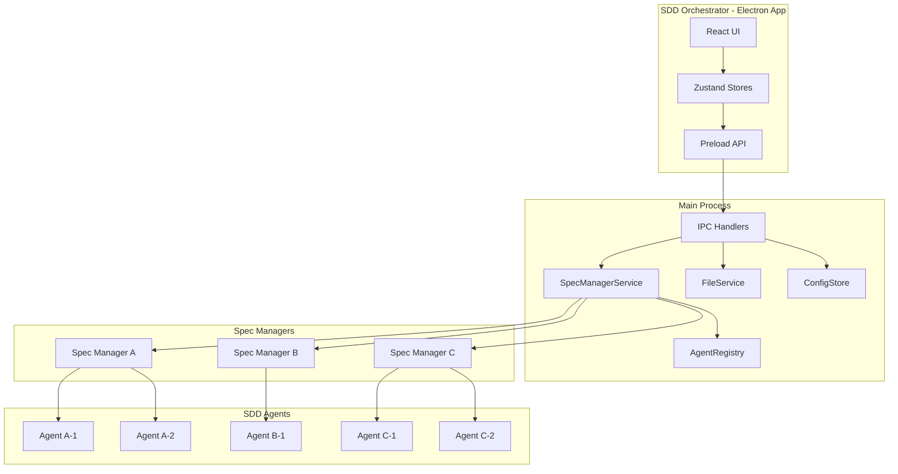
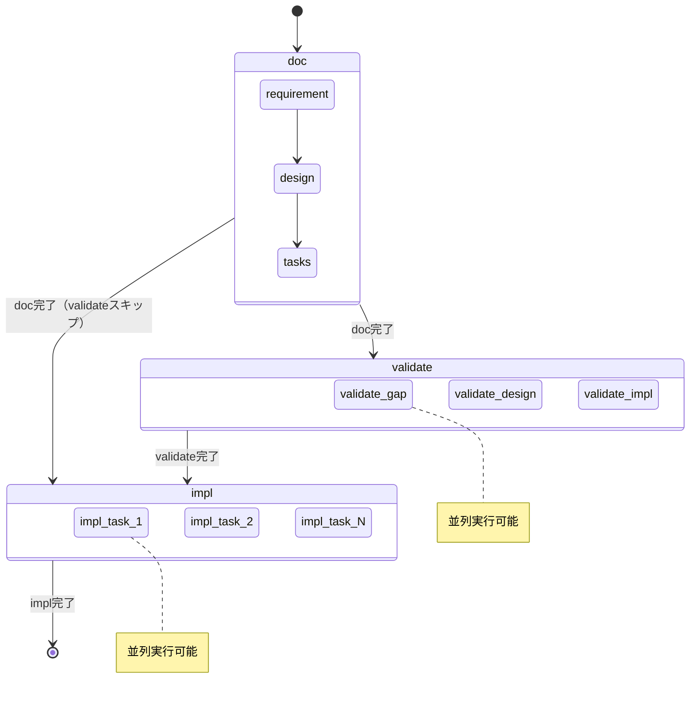
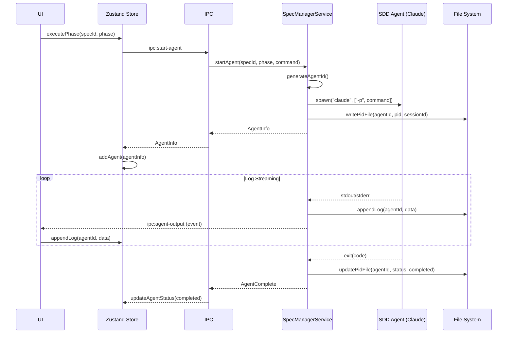
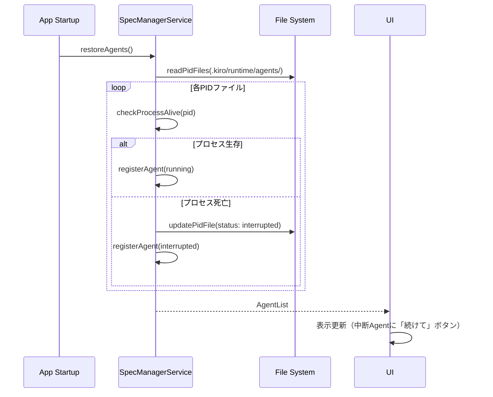
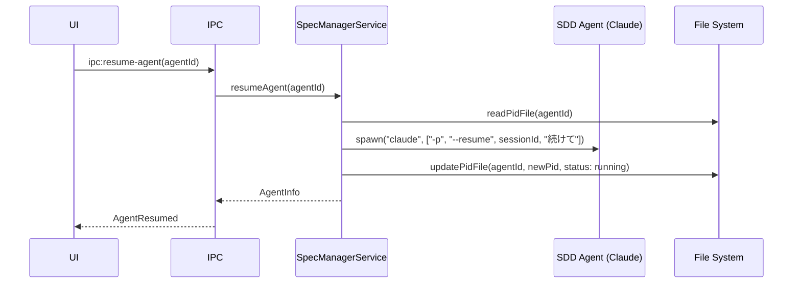

# Technical Design Document

## Overview
**Purpose**: SDD Orchestratorは、Spec-Driven Development（SDD）ワークフローを管理するElectronベースのデスクトップアプリケーションである。3層構造（Orchestrator → Spec Manager → SDD Agent）で複数の仕様を並列管理し、Claude Codeを活用したワークフロー自動化を実現する。

**Users**: SDDワークフローを採用する開発者が、複数仕様の作成・編集・承認フロー・実行を視覚的に管理するために利用する。

**Impact**: 既存の単一プロセス管理から、複数Spec Manager/SDD Agent管理へ拡張し、並列実行・セッション復元機能を追加する。

### Goals
- 複数Spec Managerの並列管理
- SDD Agent（Claude Code）の起動・監視・セッション復元
- Agent単位のログ管理とユーザー入力転送
- hang検出と中断セッションの再開

### Non-Goals
- 複数プロジェクトの同時管理
- モバイルアプリ対応
- Web版の提供

## Architecture

### 3層構造



### 実行グループモデル



### Technology Stack

| Layer | Choice / Version | Role | Notes |
|-------|------------------|------|-------|
| Frontend | React 19.x, TypeScript 5.8.x | UI表示 | 既存維持 |
| State Management | zustand 5.x | アプリケーション状態管理 | Agent状態追加 |
| Desktop Runtime | Electron 32.x | デスクトップ環境 | 既存維持 |
| Process Management | child_process | SDD Agent管理 | spawn/stdin/stdout |
| Config Storage | electron-store 8.x | 設定永続化 | hang閾値追加 |
| Build Tool | Vite 7.x | 開発・ビルド | 既存維持 |

## System Flows

### SDD Agent起動フロー



### セッション復元フロー



### セッション再開フロー



## Components and Interfaces

### Component Summary

| Component | Layer | Intent | Req Coverage |
|-----------|-------|--------|--------------|
| SpecManagerService | Main/Service | Spec Manager群の管理 | 5.1-5.8, 6.1-6.8 |
| AgentRegistry | Main/Service | SDD Agent状態管理 | 5.1-5.8 |
| AgentProcess | Main/Service | 単一SDD Agentのプロセス管理 | 5.1-5.8, 9.1-9.10, 10.1-10.3 |
| useAgentStore | Renderer/Store | Agent状態のUI管理 | 5.1-5.8, 9.1-9.10 |
| AgentListPanel | Renderer/UI | Agent一覧表示 | 5.1-5.2 |
| AgentLogPanel | Renderer/UI | Agent単位ログ表示 | 9.1-9.10 |
| AgentInputPanel | Renderer/UI | Agentへのstdin入力 | 10.1-10.3 |

### SpecManagerService

| Field | Detail |
|-------|--------|
| Intent | 複数Spec Managerの統括管理 |
| Requirements | 5.1-5.8, 6.1-6.8 |

**Responsibilities**
- Spec単位のAgent群管理
- 実行グループ（doc/validate/impl）の排他制御
- Agent起動・停止・復元

**Service Interface**
```typescript
interface SpecManagerServiceInterface {
  // Agent管理
  startAgent(specId: string, phase: string, command: string): Promise<Result<AgentInfo, AgentError>>;
  stopAgent(agentId: string): Promise<Result<void, AgentError>>;
  resumeAgent(agentId: string): Promise<Result<AgentInfo, AgentError>>;

  // Agent一覧
  getAgents(specId: string): AgentInfo[];
  getAllAgents(): Map<string, AgentInfo[]>;

  // セッション復元
  restoreAgents(): Promise<void>;

  // stdin転送
  sendInput(agentId: string, input: string): Result<void, AgentError>;
}

interface AgentInfo {
  readonly agentId: string;
  readonly specId: string;
  readonly phase: string;
  readonly pid: number;
  readonly sessionId: string;
  readonly status: AgentStatus;
  readonly startedAt: string;
  readonly lastActivityAt: string;
}

type AgentStatus = 'running' | 'completed' | 'interrupted' | 'hang' | 'failed';

type AgentError =
  | { type: 'SPAWN_ERROR'; message: string }
  | { type: 'NOT_FOUND'; agentId: string }
  | { type: 'ALREADY_RUNNING'; specId: string; phase: string }
  | { type: 'SESSION_NOT_FOUND'; agentId: string };
```

### AgentRegistry

| Field | Detail |
|-------|--------|
| Intent | SDD Agent状態の集中管理 |
| Requirements | 5.1-5.8 |

**Service Interface**
```typescript
interface AgentRegistryInterface {
  register(agent: AgentInfo): void;
  unregister(agentId: string): void;
  get(agentId: string): AgentInfo | undefined;
  getBySpec(specId: string): AgentInfo[];
  updateStatus(agentId: string, status: AgentStatus): void;
  updateActivity(agentId: string): void;
  checkHangAgents(thresholdMs: number): AgentInfo[];
}
```

### AgentProcess

| Field | Detail |
|-------|--------|
| Intent | 単一SDD Agentのプロセスライフサイクル管理 |
| Requirements | 5.1-5.8, 9.1-9.10, 10.1-10.3 |

**Service Interface**
```typescript
interface AgentProcessInterface {
  readonly agentId: string;
  readonly pid: number;
  readonly sessionId: string;

  // stdin転送
  writeStdin(input: string): void;

  // プロセス制御
  kill(): void;

  // イベント
  onOutput(callback: (stream: 'stdout' | 'stderr', data: string) => void): void;
  onExit(callback: (code: number) => void): void;
}
```

### useAgentStore

| Field | Detail |
|-------|--------|
| Intent | UI層でのAgent状態管理 |
| Requirements | 5.1-5.8, 9.1-9.10 |

**State Interface**
```typescript
interface AgentState {
  agents: Map<string, AgentInfo[]>; // specId -> AgentInfo[]
  selectedAgentId: string | null;
  logs: Map<string, LogEntry[]>; // agentId -> logs
  isLoading: boolean;
}

interface AgentActions {
  loadAgents(): Promise<void>;
  selectAgent(agentId: string): void;
  startAgent(specId: string, phase: string): Promise<void>;
  stopAgent(agentId: string): Promise<void>;
  resumeAgent(agentId: string): Promise<void>;
  sendInput(agentId: string, input: string): Promise<void>;
  appendLog(agentId: string, entry: LogEntry): void;
  clearLogs(agentId: string): void;
}

type AgentStore = AgentState & AgentActions;
```

### Preload API拡張

```typescript
interface ElectronAPI {
  // 既存API...

  // Agent管理（新規）
  startAgent(specId: string, phase: string, command: string): Promise<AgentInfo>;
  stopAgent(agentId: string): Promise<void>;
  resumeAgent(agentId: string): Promise<AgentInfo>;
  getAgents(specId: string): Promise<AgentInfo[]>;
  getAllAgents(): Promise<Record<string, AgentInfo[]>>;
  sendAgentInput(agentId: string, input: string): Promise<void>;
  onAgentOutput(callback: (agentId: string, stream: string, data: string) => void): () => void;
  onAgentStatusChange(callback: (agentId: string, status: AgentStatus) => void): () => void;

  // 設定（拡張）
  getHangThreshold(): Promise<number>;
  setHangThreshold(ms: number): Promise<void>;
}
```

## Data Models

### PIDファイル構造

```
.kiro/runtime/agents/{specId}/{agentId}.json
```

```typescript
interface AgentPidFile {
  agentId: string;
  specId: string;
  phase: string;
  pid: number;
  sessionId: string;        // Claude Code session UUID
  status: AgentStatus;
  startedAt: string;        // ISO 8601
  lastActivityAt: string;   // ISO 8601
  command: string;          // 実行コマンド
}
```

### ログファイル構造

```
.kiro/runtime/logs/{specId}/{agentId}.log
```

JSONL形式:
```jsonl
{"timestamp":"2025-11-26T10:30:00Z","stream":"stdout","data":"Starting requirement generation..."}
{"timestamp":"2025-11-26T10:30:01Z","stream":"stdout","data":"Analyzing project structure..."}
{"timestamp":"2025-11-26T10:30:05Z","stream":"stderr","data":"Warning: ..."}
```

### 設定スキーマ拡張

```typescript
interface AppConfig {
  recentProjects: string[];
  windowBounds: WindowBounds | null;
  hangThresholdMs: number;  // デフォルト: 300000 (5分)
  version: number;
}
```

## Error Handling

### Agent関連エラー

| Error Type | Cause | User Message | Recovery |
|------------|-------|--------------|----------|
| SPAWN_ERROR | Claude CLI起動失敗 | 「Claude Codeの起動に失敗しました」 | Claude CLIインストール確認 |
| SESSION_NOT_FOUND | sessionId無効 | 「セッションが見つかりません。新規実行してください」 | 新規Agent起動 |
| ALREADY_RUNNING | 同一フェーズ実行中 | 「このフェーズは既に実行中です」 | 既存Agent確認 |
| HANG_DETECTED | 応答タイムアウト | 「応答がありません。続行または停止してください」 | resume or kill |

### Hang検出ロジック

```typescript
// 定期チェック（30秒毎）
setInterval(() => {
  const hangAgents = agentRegistry.checkHangAgents(config.hangThresholdMs);
  for (const agent of hangAgents) {
    agentRegistry.updateStatus(agent.agentId, 'hang');
    webContents.send('agent-status-change', agent.agentId, 'hang');
  }
}, 30000);
```

## Testing Strategy

### Unit Tests
- SpecManagerService: Agent起動・停止・復元ロジック
- AgentRegistry: 状態管理・hang検出
- AgentProcess: stdin転送・イベントハンドリング

### Integration Tests
- Agent起動→ログ受信→完了の一連フロー
- セッション復元フロー
- 並列実行時の排他制御

### E2E Tests
- doc実行→validate実行→impl実行のワークフロー
- アプリ再起動→中断Agent表示→再開

## Security Considerations

### Claude CLI実行のセキュリティ
- コマンド許可リスト（/kiro:spec-* のみ）
- 作業ディレクトリの検証
- sessionIdの安全な保存（PIDファイルはプロジェクトローカル）

### stdin入力のサニタイズ
- 制御文字のエスケープ
- 最大入力長制限

## Performance & Scalability

### Target Metrics
- Agent起動: < 2秒
- ログ表示（10000行）: 60fps維持
- 並列Agent数: 最大10

### Optimization
- ログのバッチ更新（16ms debounce）
- PIDファイルの非同期I/O
- Agent状態の効率的なメモリ管理
