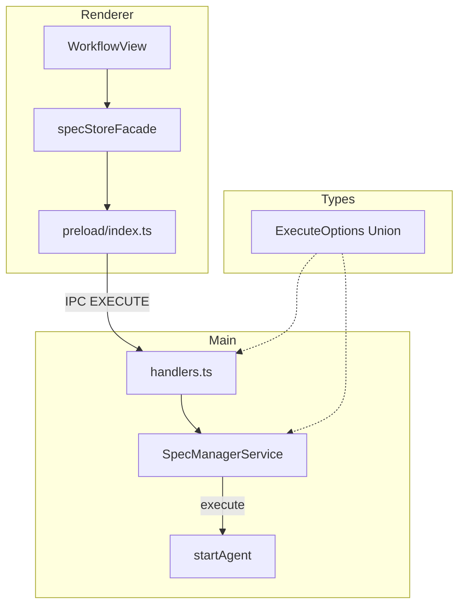
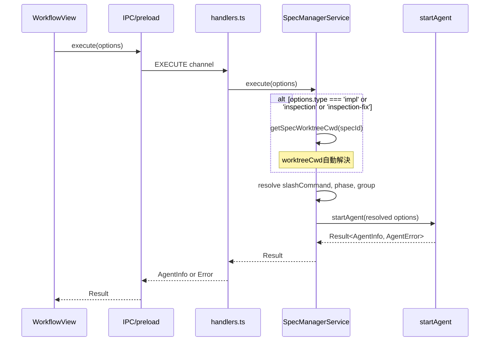
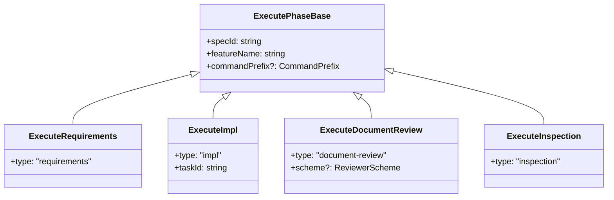

# Design: Execute Method Unification

## Overview

**Purpose**: 本機能は`specManagerService.ts`の`execute*`メソッド群（9個）を統一し、コード重複を排除する。Union型で各フェーズの引数を定義し、単一の`execute`メソッドで処理する。また、`startAgent`内でworktreeCwdを自動解決することで、呼び出し元での渡し忘れを防止する。

**Users**: 開発者がspecManagerServiceを通じてAgent実行を行う際、統一されたAPIを使用できる。

**Impact**: 既存の`executePhase`, `executeTaskImpl`, `executeDocumentReview`等の個別メソッドを削除し、`execute`メソッドに一本化。IPCチャンネルも`EXECUTE`に統一。

### Goals

- コード重複の排除（DRY原則）
- 横断的機能追加時の漏れ防止（SSOT原則）
- worktreeCwd解決漏れの防止（`group === 'impl'`時の自動解決）
- 型安全性の向上（Discriminated Union による引数定義）

### Non-Goals

- `retryWithContinue`メソッドのリファクタリング（sessionIdベースの再開なので別スコープ）
- Bug Workflow関連の`execute*`メソッド（`bugService`に存在する場合は別スコープ）
- `executeSpecManagerPhase`メソッド（Remote UI専用、必要に応じて別途対応）

## Architecture

### Existing Architecture Analysis

現在の`specManagerService.ts`には以下の`execute*`メソッドが存在する：

| メソッド | 用途 | group |
|---------|------|-------|
| `executePhase` | requirements/design/tasks/impl/inspection/deploy | doc/impl |
| `executeTaskImpl` | impl-taskX | impl |
| `executeDocumentReview` | document-review | doc |
| `executeDocumentReviewReply` | document-review-reply | doc |
| `executeDocumentReviewFix` | document-review-fix | doc |
| `executeInspection` | inspection | impl |
| `executeInspectionFix` | inspection-fix | impl |
| `executeSpecMerge` | spec-merge | doc |

**問題点**:
- 各メソッドがほぼ同じパターン（slashCommand構築 → `startAgent`呼び出し）
- worktreeCwd解決が一部メソッドのみで実装（`executeTaskImpl`, `executeInspection`, `executeInspectionFix`）
- IPCチャンネルが`EXECUTE_PHASE`と`EXECUTE_TASK_IMPL`で分離

### Architecture Pattern & Boundary Map



**Architecture Integration**:
- Selected pattern: Discriminated Union型によるオプション定義
- Domain/feature boundaries: Main Process内のサービス層で完結
- Existing patterns preserved: `startAgent`メソッドの呼び出しパターン
- New components rationale: `ExecuteOptions` Union型で型安全性を確保
- Steering compliance: DRY, SSOT, KISS原則に準拠

### Technology Stack

| Layer | Choice / Version | Role in Feature | Notes |
|-------|------------------|-----------------|-------|
| Backend / Services | TypeScript 5.8+ | Union型定義、サービス実装 | Discriminated Union |
| IPC | Electron IPC | チャンネル統一 | `EXECUTE`に一本化 |
| WebSocket | ws | Remote UI対応 | ハンドラ更新 |

## System Flows

### Execute Method Call Flow



**Key Decisions**:
- `options.type`で分岐し、各フェーズのslashCommand、phase名、groupを解決
- `group === 'impl'`の場合のみworktreeCwd自動解決
- document-reviewのschemeオプションでengine切り替え

## Requirements Traceability

| Criterion ID | Summary | Components | Implementation Approach |
|--------------|---------|------------|------------------------|
| 1.1 | 各フェーズの引数を個別interfaceで定義 | `ExecutePhaseBase`, `ExecuteRequirements`, etc. | 新規実装（types/配置） |
| 1.2 | 共通フィールドを`ExecutePhaseBase`として抽出 | `ExecutePhaseBase` | 新規実装 |
| 1.3 | `type`フィールドでフェーズ区別 | Discriminated Union | 新規実装 |
| 1.4 | 全interfaceを`ExecuteOptions`としてUnion化 | `ExecuteOptions` | 新規実装 |
| 1.5 | 型定義は`types/`ディレクトリ配置 | `types/executeOptions.ts` | 新規実装 |
| 2.1 | `execute(options)`メソッド実装 | `SpecManagerService.execute` | 新規実装 |
| 2.2 | `options.type`で分岐 | `execute`メソッド内分岐ロジック | 新規実装 |
| 2.3 | document-reviewのscheme切り替え | `execute`メソッド内分岐 | 既存ロジック移行 |
| 2.4 | 既存execute*メソッド削除 | `SpecManagerService` | 削除 |
| 2.5 | `execute`は`startAgent`呼び出し | `execute` → `startAgent` | 新規実装 |
| 3.1 | `group === 'impl'`時のworktreeCwd自動解決 | `startAgent` | 既存メソッド拡張 |
| 3.2 | 明示的worktreeCwd優先 | `startAgent` | 既存メソッド拡張 |
| 3.3 | docグループはスキップ | `startAgent` | 既存メソッド拡張 |
| 3.4 | 自動解決ログ出力 | `startAgent` | 既存メソッド拡張 |
| 4.1 | `EXECUTE` IPCチャンネル定義 | `channels.ts` | 新規実装 |
| 4.2 | `EXECUTE`ハンドラ実装 | `handlers.ts` | 新規実装 |
| 4.3 | `EXECUTE_PHASE`, `EXECUTE_TASK_IMPL`削除 | `channels.ts`, `handlers.ts` | 削除 |
| 4.4 | `electronAPI.execute`公開 | `preload/index.ts` | 新規実装 |
| 4.5 | 既存API削除 | `preload/index.ts` | 削除 |
| 5.1 | `specStoreFacade`更新 | `specStoreFacade.ts` | 既存修正 |
| 5.2 | `WorkflowView`更新 | `WorkflowView.tsx` | 既存修正 |
| 5.3 | `electron.d.ts`更新 | `electron.d.ts` | 既存修正 |
| 5.4 | 既存呼び出し置き換え | Renderer全体 | 既存修正 |
| 6.1 | WebSocketハンドラ更新 | `webSocketHandler.ts` | 既存修正 |
| 6.2 | `WebSocketApiClient`更新 | `WebSocketApiClient.ts` | 既存修正 |
| 6.3 | Remote UI動作確認 | E2Eテスト | テスト |
| 7.1 | テスト統合 | `specManagerService.test.ts` | 既存修正 |
| 7.2 | 各フェーズタイプテスト | `specManagerService.test.ts` | 新規テスト |
| 7.3 | worktreeCwd自動解決テスト | `specManagerService.test.ts` | 新規テスト |
| 7.4 | IPCハンドラテスト更新 | handlers関連テスト | 既存修正 |
| 7.5 | Rendererテスト更新 | Renderer関連テスト | 既存修正 |

### Coverage Validation Checklist

- [x] Every criterion ID from requirements.md appears in the table above
- [x] Each criterion has specific component names (not generic references)
- [x] Implementation approach distinguishes "reuse existing" vs "new implementation"
- [x] User-facing criteria specify concrete UI components

## Components and Interfaces

| Component | Domain/Layer | Intent | Req Coverage | Key Dependencies (P0) | Contracts |
|-----------|--------------|--------|--------------|----------------------|-----------|
| ExecuteOptions | Types | Union型定義 | 1.1-1.5 | - | State |
| SpecManagerService.execute | Main/Services | 統一実行メソッド | 2.1-2.5 | startAgent (P0) | Service |
| startAgent (拡張) | Main/Services | worktreeCwd自動解決 | 3.1-3.4 | getSpecWorktreeCwd (P0) | Service |
| EXECUTE IPC | Main/IPC | IPCチャンネル | 4.1-4.5 | handlers (P0) | API |
| WebSocketHandler | Main/Services | Remote UI対応 | 6.1-6.3 | execute (P0) | API |

### Types Layer

#### ExecuteOptions (Union Type)

| Field | Detail |
|-------|--------|
| Intent | 各フェーズの実行オプションをDiscriminated Unionで定義 |
| Requirements | 1.1, 1.2, 1.3, 1.4, 1.5 |

**Responsibilities & Constraints**
- 全フェーズの引数を型安全に定義
- `type`フィールドをdiscriminantとして使用
- 共通フィールドは`ExecutePhaseBase`に抽出

**Dependencies**
- Outbound: なし（純粋な型定義）

**Contracts**: State [x]

##### State Management

```typescript
// types/executeOptions.ts

/** 共通フィールド */
interface ExecutePhaseBase {
  specId: string;
  featureName: string;
  commandPrefix?: CommandPrefix;
}

/** Requirements/Design/Tasks/Deploy */
interface ExecuteRequirements extends ExecutePhaseBase {
  type: 'requirements';
}

interface ExecuteDesign extends ExecutePhaseBase {
  type: 'design';
}

interface ExecuteTasks extends ExecutePhaseBase {
  type: 'tasks';
}

interface ExecuteDeploy extends ExecutePhaseBase {
  type: 'deploy';
}

/** Impl */
interface ExecuteImpl extends ExecutePhaseBase {
  type: 'impl';
  taskId: string;
}

/** Document Review */
interface ExecuteDocumentReview extends ExecutePhaseBase {
  type: 'document-review';
  /** Reviewer scheme (default: 'claude-code' - 未指定時は既存実装に準拠) */
  scheme?: ReviewerScheme;
}

interface ExecuteDocumentReviewReply extends ExecutePhaseBase {
  type: 'document-review-reply';
  reviewNumber: number;
  autofix?: boolean;
}

interface ExecuteDocumentReviewFix extends ExecutePhaseBase {
  type: 'document-review-fix';
  reviewNumber: number;
}

/** Inspection */
interface ExecuteInspection extends ExecutePhaseBase {
  type: 'inspection';
}

interface ExecuteInspectionFix extends ExecutePhaseBase {
  type: 'inspection-fix';
  roundNumber: number;
}

/** Spec Merge */
interface ExecuteSpecMerge extends ExecutePhaseBase {
  type: 'spec-merge';
}

/** Union型 */
type ExecuteOptions =
  | ExecuteRequirements
  | ExecuteDesign
  | ExecuteTasks
  | ExecuteDeploy
  | ExecuteImpl
  | ExecuteDocumentReview
  | ExecuteDocumentReviewReply
  | ExecuteDocumentReviewFix
  | ExecuteInspection
  | ExecuteInspectionFix
  | ExecuteSpecMerge;
```

**Implementation Notes**
- Integration: `specManagerService.ts`からimport
- Validation: TypeScriptコンパイラによる型チェック
- Risks: 後方互換性なし（既存API削除のため）

### Main/Services Layer

#### SpecManagerService.execute

| Field | Detail |
|-------|--------|
| Intent | 統一されたAgent実行エントリポイント |
| Requirements | 2.1, 2.2, 2.3, 2.4, 2.5 |

**Responsibilities & Constraints**
- `options.type`でフェーズ種別を判定
- slashCommand、phase名、groupを解決
- `startAgent`を呼び出し

**Dependencies**
- Inbound: handlers.ts — IPC経由で呼び出し (P0)
- Outbound: startAgent — Agent起動 (P0)
- Outbound: getSpecWorktreeCwd — worktree解決 (P0)

**Contracts**: Service [x]

##### Service Interface

```typescript
interface ExecuteResult {
  ok: true;
  value: AgentInfo;
} | {
  ok: false;
  error: AgentError;
}

class SpecManagerService {
  /**
   * 統一されたAgent実行メソッド
   * @param options ExecuteOptions Union型
   * @returns Result<AgentInfo, AgentError>
   */
  async execute(options: ExecuteOptions): Promise<ExecuteResult>;
}
```

- Preconditions: specIdが存在すること
- Postconditions: Agentが起動されること
- Invariants: worktreeCwd解決は`group === 'impl'`の場合のみ実行

**Implementation Notes**
- Integration: 既存の`executePhase`等の実装を統合
- Validation: `options.type`による分岐は網羅的に行う
- Risks: 既存メソッド削除により既存呼び出し元の更新が必要

#### startAgent (拡張)

| Field | Detail |
|-------|--------|
| Intent | worktreeCwd自動解決を追加 |
| Requirements | 3.1, 3.2, 3.3, 3.4 |

**Responsibilities & Constraints**
- `group === 'impl'`かつ`worktreeCwd`未指定時に自動解決
- 明示的な`worktreeCwd`指定を優先
- `doc`グループはスキップ

**Dependencies**
- Inbound: execute — メソッド呼び出し (P0)
- Outbound: getSpecWorktreeCwd — worktree解決 (P0)

**Contracts**: Service [x]

##### Service Interface

```typescript
interface StartAgentOptions {
  specId: string;
  phase: string;
  command: string;
  args: string[];
  group?: ExecutionGroup;  // 'doc' | 'impl'
  sessionId?: string;
  providerType?: ProviderType;
  skipPermissions?: boolean;
  worktreeCwd?: string;  // 明示的指定（オプション）
}

class SpecManagerService {
  /**
   * Agent起動（worktreeCwd自動解決付き）
   *
   * group === 'impl'の場合:
   * - worktreeCwd未指定 → getSpecWorktreeCwd()で自動解決
   * - worktreeCwd指定 → 指定値を優先
   *
   * group === 'doc'の場合:
   * - worktreeCwd解決をスキップ（projectPathを使用）
   */
  async startAgent(options: StartAgentOptions): Promise<Result<AgentInfo, AgentError>>;
}
```

- Preconditions: command, argsが有効であること
- Postconditions: Agentプロセスが起動されること
- Invariants: worktreeCwd自動解決は`group === 'impl'`のみ

**Implementation Notes**
- Integration: 既存`startAgent`の拡張
- Validation: groupチェックによる条件分岐
- Risks: 既存テストへの影響（worktreeCwd自動解決のモック必要）

### Main/IPC Layer

#### EXECUTE IPC Channel

| Field | Detail |
|-------|--------|
| Intent | 統一IPCチャンネル定義 |
| Requirements | 4.1, 4.2, 4.3, 4.4, 4.5 |

**Responsibilities & Constraints**
- `EXECUTE_PHASE`と`EXECUTE_TASK_IMPL`を統合
- `ExecuteOptions`を受け取る

**Dependencies**
- Inbound: preload — IPC invoke (P0)
- Outbound: SpecManagerService.execute — 実行委譲 (P0)

**Contracts**: API [x]

##### API Contract

| Method | Channel | Request | Response | Errors |
|--------|---------|---------|----------|--------|
| invoke | `ipc:execute` | ExecuteOptions | AgentInfo | SPAWN_ERROR, ALREADY_RUNNING, GROUP_CONFLICT |

**Implementation Notes**
- Integration: `handlers.ts`に新規ハンドラ追加
- Validation: `ExecuteOptions`の型チェック
- Risks: 既存チャンネル削除により後方互換性なし

### Remote UI Layer

#### WebSocketHandler Update

| Field | Detail |
|-------|--------|
| Intent | Remote UIからのExecute対応 |
| Requirements | 6.1, 6.2, 6.3 |

**Responsibilities & Constraints**
- `EXECUTE_PHASE`メッセージを`EXECUTE`に変更
- `ExecuteOptions`形式で受信

**Dependencies**
- Inbound: WebSocket client — メッセージ受信 (P0)
- Outbound: workflowController — 実行委譲 (P0)

**Contracts**: API [x]

##### API Contract

| Message Type | Request Payload | Response | Errors |
|--------------|-----------------|----------|--------|
| `EXECUTE` | `{ options: ExecuteOptions }` | `PHASE_STARTED` | `PHASE_ERROR` |

**Implementation Notes**
- Integration: 既存`EXECUTE_PHASE`ハンドラを拡張
- Validation: optionsの型検証
- Risks: Remote UIクライアントの更新が必要

## Data Models

### Domain Model

**ExecuteOptions Union型**が中心となるドメインモデル。各フェーズ種別を`type`フィールドで識別するDiscriminated Union。



### Logical Data Model

**フェーズ種別とgroup/slashCommandのマッピング**:

| type | group | slashCommand (kiro) | worktreeCwd |
|------|-------|---------------------|-------------|
| requirements | doc | /kiro:spec-requirements | 不要 |
| design | doc | /kiro:spec-design | 不要 |
| tasks | doc | /kiro:spec-tasks | 不要 |
| impl | impl | /kiro:spec-impl | 自動解決 |
| deploy | doc | /commit | 不要 |
| document-review | doc | /kiro:document-review | 不要 |
| document-review-reply | doc | /kiro:document-review-reply | 不要 |
| document-review-fix | doc | /kiro:document-review-reply --fix | 不要 |
| inspection | impl | /kiro:spec-inspection | 自動解決 |
| inspection-fix | impl | /kiro:spec-inspection --fix | 自動解決 |
| spec-merge | doc | /kiro:spec-merge | 不要 |

## Error Handling

### Error Strategy

既存の`AgentError`型を継続使用。新しいエラーケースは追加しない。

### Error Categories and Responses

| Error Type | Cause | Response |
|------------|-------|----------|
| SPAWN_ERROR | プロセス起動失敗 | エラーメッセージ表示 |
| ALREADY_RUNNING | 同一フェーズ実行中 | 実行中である旨表示 |
| GROUP_CONFLICT | doc/implグループ競合 | 競合説明表示 |
| NOT_FOUND | Agent未発見 | 再試行促進 |

## Testing Strategy

### Unit Tests

- `execute`メソッドの各`type`分岐テスト
- worktreeCwd自動解決ロジックテスト（impl時のみ解決）
- `startAgent`のworktreeCwd優先度テスト

### Integration Tests

- IPC `EXECUTE`チャンネル経由の実行テスト
- WebSocket `EXECUTE`メッセージ経由の実行テスト
- 既存テストの`executePhase`→`execute`移行

### E2E Tests

- WorkflowViewからの各フェーズ実行
- Remote UIからのフェーズ実行

## Design Decisions

### DD-001: Union型によるオプション定義

| Field | Detail |
|-------|--------|
| Status | Accepted |
| Context | 9個の`execute*`メソッドが類似パターンで存在し、コード重複が発生している |
| Decision | Discriminated Union型（`ExecuteOptions`）を定義し、`execute`メソッドを一本化する |
| Rationale | TypeScriptのDiscriminated Unionにより型安全な分岐が可能。コンパイル時に網羅性チェックが行われる |
| Alternatives Considered | (1) 既存メソッド維持 → 重複排除できず、(2) オーバーロード → 型推論が複雑化 |
| Consequences | 既存メソッド削除により呼び出し元の全面的な更新が必要。後方互換性なし |

### DD-002: startAgentでのworktreeCwd自動解決

| Field | Detail |
|-------|--------|
| Status | Accepted |
| Context | `executeTaskImpl`, `executeInspection`等でworktreeCwd解決が個別実装されており、漏れのリスクがある |
| Decision | `startAgent`内で`group === 'impl'`の場合に自動解決する |
| Rationale | worktreeモードの管理責務はMain Process。呼び出し元が意識する必要をなくすことで漏れを防止 |
| Alternatives Considered | (1) 呼び出し元で解決 → 漏れリスク継続, (2) 全グループで解決 → 不要な処理 |
| Consequences | impl/inspection系は明示的なworktreeCwd指定が不要に。明示的指定がある場合はそちらを優先 |

### DD-003: IPCチャンネル統一（後方互換なし）

| Field | Detail |
|-------|--------|
| Status | Accepted |
| Context | `EXECUTE_PHASE`と`EXECUTE_TASK_IMPL`が別チャンネルで、API分散している |
| Decision | `EXECUTE`一本に統一、後方互換は考慮しない |
| Rationale | Renderer側からUnion型のOptionsを渡す方がシンプル。分岐の複雑さを排除 |
| Alternatives Considered | (1) 両チャンネル維持 → 分散継続, (2) 新チャンネル追加で段階移行 → 複雑化 |
| Consequences | Renderer/Remote UI全体の更新が必要。同時リリース必須 |

### DD-004: 既存メソッドの完全削除（ラッパー残さず）

| Field | Detail |
|-------|--------|
| Status | Accepted |
| Context | 統一後、既存の`executeTaskImpl`等をラッパーとして残すか削除するか |
| Decision | 削除して`execute`に一本化 |
| Rationale | ラッパーを残すと「どちらを呼ぶべきか」の混乱が残る。SSOTで一本化すべき |
| Alternatives Considered | (1) ラッパーとして残す → 混乱継続, (2) deprecatedマーク後に削除 → 段階移行可能だが複雑 |
| Consequences | 一度の変更で全呼び出し元を更新。変更量は大きいがAIなら問題なし |

### DD-005: document-reviewのscheme切り替えをexecute内で分岐

| Field | Detail |
|-------|--------|
| Status | Accepted |
| Context | `executeDocumentReview`は外部コマンド（gemini, debatex）を起動する特殊ケース |
| Decision | `execute`メソッド内で`scheme`オプションにより分岐させる |
| Rationale | 「フェーズを実行する」という責務は同じ。schemeはオプションの一つに過ぎない |
| Alternatives Considered | (1) 別メソッドとして維持 → 統一の恩恵なし |
| Consequences | document-review関連も統一APIに含まれる |
