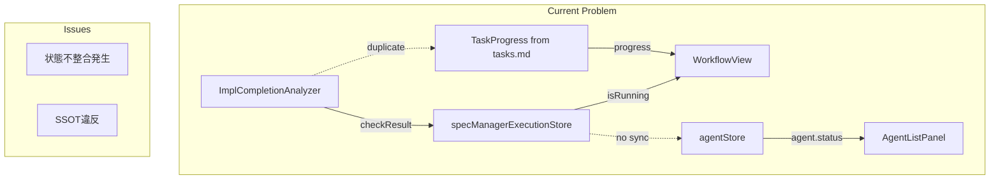
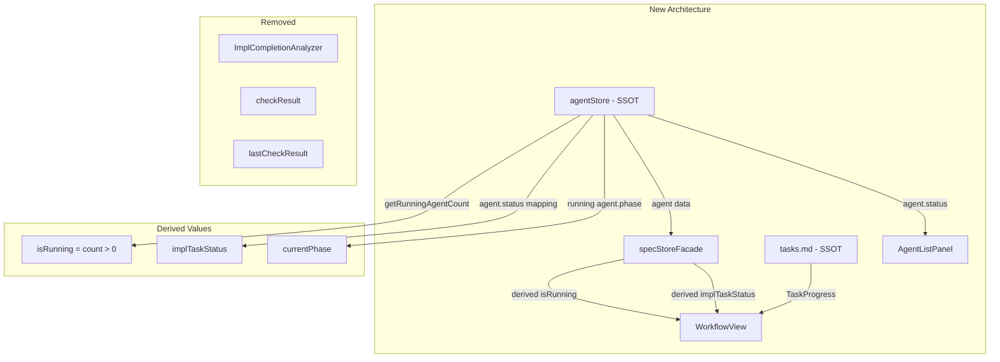
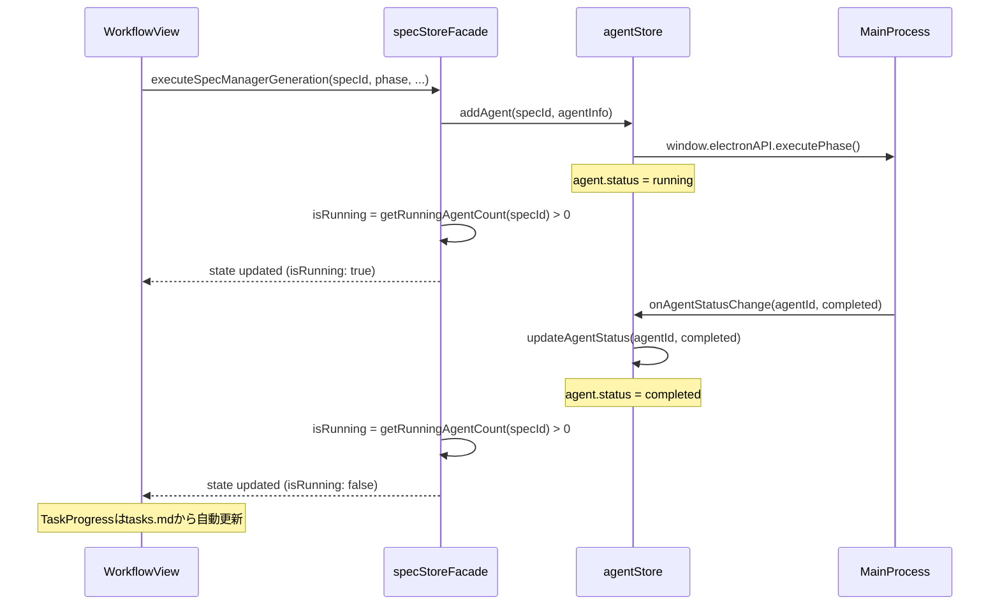
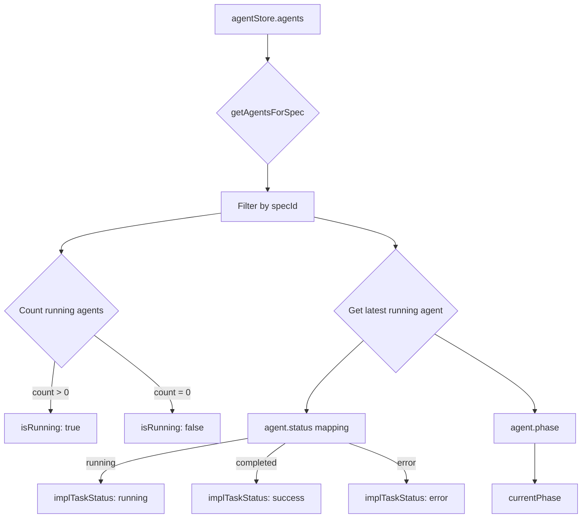
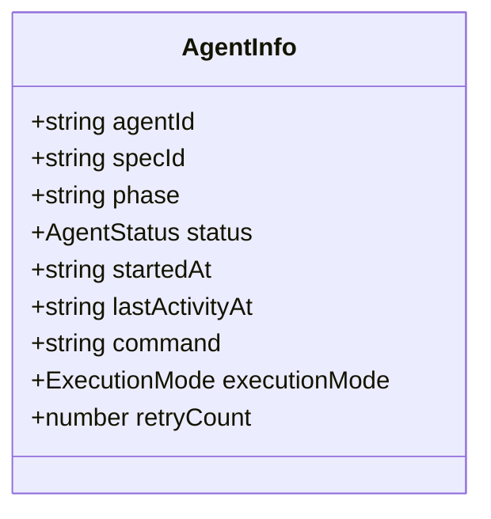

# Design: Execution Store Consolidation

## Overview

**Purpose**: specManagerExecutionStoreとagentStoreで発生している「エージェント実行中」という状態の二重管理（SSOT違反）を解消し、エージェント完了後もUIが「実行中」表示のままになる不整合を構造的に防止する。また、checkResult/ImplCompletionAnalyzerを廃止し、タスク完了状態の管理をtasks.md（TaskProgress）に一本化する。

**Users**: SDD Orchestrator UIを使用する開発者がSpec実行操作を行う際に、正確な実行状態が表示されるようになる。

**Impact**: specManagerExecutionStoreを完全廃止し、agentStoreを実行状態のSSOTとする。checkResult/ImplCompletionAnalyzerを廃止し、Claude APIコストを削減する。

### Goals

- specManagerExecutionStoreを完全廃止し、agentStoreに一元化する
- agentStoreから実行状態（isRunning, implTaskStatus等）を派生値として計算する
- specStoreFacadeの既存インターフェースを維持し、UIコンポーネントへの影響を最小化する
- 複数specの同時実行を適切に管理できるアーキテクチャを実現する
- checkResult/ImplCompletionAnalyzerを廃止し、タスク完了状態をtasks.mdに一本化する

### Non-Goals

- Remote UI側のstore変更（影響なしのため）
- agentStoreの根本的なリファクタリング（肥大化対策は別途）
- 複数spec同時実行時のUI表示改善（現状維持）
- TaskProgressの改善（別specで対応）

## Architecture

### Existing Architecture Analysis

現在の実装には以下の問題がある：

1. **状態の二重管理**: specManagerExecutionStoreとagentStoreの両方で「エージェント実行中」を追跡
2. **同期の欠如**: specManagerExecutionStore.isRunningとagentStore内のagent.statusが独立に管理され、不整合が発生
3. **単一spec制約**: specManagerExecutionStoreは単一のcurrentSpecIdしか保持できず、複数spec同時実行に対応不可
4. **タスク完了状態の二重管理**: checkResult（ログからClaude APIで推測）とTaskProgress（tasks.mdから計算）が並存

**現行アーキテクチャ**:



### Architecture Pattern and Boundary Map

**Derived State Pattern**を採用し、agentStoreをSSOTとして実行状態を一元管理する。タスク完了状態はtasks.md（TaskProgress）のみで管理する。



**Architecture Integration**:

- **Selected pattern**: Derived State Pattern - 単一のデータソース（agentStore）から必要な状態を計算で導出
- **Domain boundaries**: agentStoreはエージェント実行のSSOT、tasks.mdはタスク完了状態のSSOT
- **Existing patterns preserved**: Zustand store pattern, Facade pattern
- **New components rationale**: 新規コンポーネントは不要。既存コンポーネントの内部実装を変更
- **Steering compliance**: SSOT原則、DRY原則に準拠

### Technology Stack

| Layer | Choice / Version | Role in Feature | Notes |
|-------|------------------|-----------------|-------|
| Frontend | Zustand 4.x | 状態管理 | 既存利用 |
| Types | TypeScript 5.8+ | 型定義拡張 | AgentInfo型の拡張 |

## System Flows

### Agent実行開始から完了までのフロー



### 派生値計算フロー



## Requirements Traceability

| Criterion ID | Summary | Components | Implementation Approach |
|--------------|---------|------------|------------------------|
| 1.1 | specManagerExecutionStoreが削除されたとき、agentStoreのみで実行状態を管理 | agentStore, specStoreFacade | specStoreFacadeの派生値計算に移行 |
| 1.2 | specManagerExecutionStore.tsファイルを削除 | specManagerExecutionStore.ts | ファイル削除 |
| 1.3 | specManagerExecutionStore.test.tsファイルを削除 | specManagerExecutionStore.test.ts | ファイル削除 |
| 1.4 | spec/types.tsからSpecManagerExecutionState, SpecManagerExecutionActions型を削除 | spec/types.ts | 型定義削除（派生値計算用に一部維持） |
| 2.1 | AgentInfo型にexecutionModeフィールドを追加 | agentStore.ts | 型定義拡張 |
| 2.2 | AgentInfo型にretryCountフィールドを追加 | agentStore.ts | 型定義拡張 |
| 2.3 | agent作成時にexecutionModeを設定 | specStoreFacade | executeSpecManagerGeneration内で設定 |
| 3.1 | isRunning(specId)をgetRunningAgentCount(specId) > 0から導出 | specStoreFacade | 派生値計算関数を実装 |
| 3.2 | implTaskStatusをagent.statusから導出 | specStoreFacade | ステータスマッピング関数を実装 |
| 3.3 | currentPhaseをrunning agentのphaseから取得 | specStoreFacade | 派生値計算関数を実装 |
| 3.4 | 複数agentが同一specで実行中のとき全てのagentの状態を考慮 | specStoreFacade | 集約関数で対応 |
| 4.1 | useSpecStore()が返すspecManagerExecutionオブジェクトの形状を維持（lastCheckResult除く） | specStoreFacade | インターフェース互換性維持 |
| 4.2 | specManagerExecution.isRunningがagentStoreから派生値を計算して返す | specStoreFacade.getAggregatedState | 新しい派生値計算ロジック |
| 4.3 | specManagerExecution.implTaskStatusがagentStoreから派生値を計算して返す | specStoreFacade.getAggregatedState | 新しい派生値計算ロジック |
| 4.4 | executeSpecManagerGeneration()をagentStore経由で実行 | specStoreFacade | agentStore経由に変更 |
| 4.5 | updateImplTaskStatus()をagentStoreのstatus更新として実装 | specStoreFacade | agentStore.updateAgentStatus経由 |
| 4.6 | clearSpecManagerError()をagentStoreのerrorクリアとして実装 | specStoreFacade | agentStore.clearError経由 |
| 5.1 | onAgentStatusChangeイベント受信時にagentStoreのagent.statusを更新 | agentStore.setupEventListeners | 既存実装を維持 |
| 5.2 | agent.statusがcompletedに変わったときUIが「実行中」表示を解除 | specStoreFacade派生値計算 | 自動的に解決（派生値のため） |
| 5.3 | specManagerExecutionStoreへの連携処理を削除 | agentStore.setupEventListeners | 不要なコードを削除 |
| 6.1 | CheckImplResult型を削除 | spec/types.ts | 型定義削除 |
| 6.2 | ImplCompletionAnalyzer.tsを削除 | main/services | ファイル削除 |
| 6.3 | ImplCompletionAnalyzer.test.tsを削除 | main/services | ファイル削除 |
| 6.4 | handleCheckImplResult()アクションを削除 | specStoreFacade | アクション削除 |
| 6.5 | specManagerExecution.lastCheckResultを削除 | specStoreFacade | フィールド削除 |
| 6.6 | WorkflowViewの「完了したタスク」表示を削除 | WorkflowView.tsx | UI要素削除 |
| 6.7 | タスク完了状態の表示はTaskProgressのみ | WorkflowView.tsx | 既存TaskProgressを維持 |
| 7.1 | specStoreFacade.test.ts更新 | specStoreFacade.test.ts | テスト更新 |
| 7.2 | WorkflowView.specManager.test.ts更新 | WorkflowView.specManager.test.ts | テスト更新 |
| 7.3 | agentStore.test.tsに派生値テスト追加 | agentStore.test.ts | テスト追加 |
| 7.4 | ImplCompletionAnalyzer関連のテストを削除 | implCompletionAnalyzer.test.ts | ファイル削除 |
| 7.5 | 全テスト通過とビルド成功 | 全体 | CI/検証 |

### Coverage Validation Checklist

- [x] Every criterion ID from requirements.md appears in the table above
- [x] Each criterion has specific component names (not generic references)
- [x] Implementation approach distinguishes "reuse existing" vs "new implementation"
- [x] User-facing criteria specify concrete UI components

## Components and Interfaces

### Component Summary

| Component | Domain/Layer | Intent | Req Coverage | Key Dependencies | Contracts |
|-----------|--------------|--------|--------------|------------------|-----------|
| AgentInfo (extended) | renderer/stores | エージェント情報の拡張型定義 | 2.1, 2.2, 2.3 | - | Type |
| specStoreFacade | renderer/stores | 派生値計算と既存インターフェース維持 | 1.1, 3.1-3.4, 4.1-4.6 | agentStore (P0) | Service, State |
| agentStore | renderer/stores | エージェント実行のSSOT | 5.1, 5.2, 5.3 | MainProcess IPC (P0) | Service, State |

### renderer/stores

#### AgentInfo (Extended Type)

| Field | Detail |
|-------|--------|
| Intent | エージェント情報にexecutionMode, retryCountを追加 |
| Requirements | 2.1, 2.2 |

**Responsibilities and Constraints**

- エージェント実行のコンテキスト情報（executionMode）を保持
- リトライ回数（retryCount）を追跡

**Dependencies**

- None (pure type definition)

**Contracts**: Type [ ]

##### Type Definition

```typescript
export interface AgentInfo {
  // Existing fields
  readonly agentId: string;
  readonly specId: string;
  readonly phase: string;
  readonly pid: number;
  readonly sessionId: string;
  readonly status: AgentStatus;
  readonly startedAt: string;
  readonly lastActivityAt: string;
  readonly command: string;

  // New fields (Req 2.1, 2.2)
  executionMode?: 'auto' | 'manual';
  retryCount?: number;
}
```

**Implementation Notes**

- Integration: 既存のAgentInfo型を拡張、後方互換性を維持
- Validation: 新フィールドはすべてoptional
- Risks: なし

#### specStoreFacade (Updated)

| Field | Detail |
|-------|--------|
| Intent | specManagerExecutionStoreを廃止し、agentStoreから派生値を計算。checkResult関連を削除 |
| Requirements | 1.1, 3.1, 3.2, 3.3, 3.4, 4.1, 4.2, 4.3, 4.4, 4.5, 4.6, 6.4, 6.5 |

**Responsibilities and Constraints**

- agentStoreから実行状態の派生値を計算
- 既存のspecManagerExecutionインターフェースを維持（lastCheckResult除く）
- 複数specの同時実行を適切に処理
- handleCheckImplResult()を削除

**Dependencies**

- Inbound: WorkflowView - UI状態取得 (P0)
- Outbound: agentStore - エージェント情報取得・更新 (P0)
- Outbound: window.electronAPI - フェーズ実行 (P0)

**Contracts**: Service [x] / State [x]

##### Service Interface

```typescript
interface SpecStoreFacadeActions {
  // Updated implementation: delegates to agentStore
  executeSpecManagerGeneration(
    specId: string,
    phase: SpecManagerPhase,
    featureName: string,
    taskId: string | undefined,
    executionMode: 'auto' | 'manual'
  ): Promise<void>;

  // DELETED: handleCheckImplResult(result: CheckImplResult): void;

  // Updated implementation: updates agent.status via mapping
  updateImplTaskStatus(status: ImplTaskStatus, retryCount?: number): void;

  // Updated implementation: clears agent error
  clearSpecManagerError(): void;
}
```

##### State Management

```typescript
// Derived value calculation (replaces specManagerExecutionStore subscription)
function getSpecManagerExecution(specId: string | null): SpecManagerExecutionState {
  if (!specId) {
    return DEFAULT_SPEC_MANAGER_EXECUTION_STATE;
  }

  const agentState = useAgentStore.getState();
  const runningAgents = agentState.getAgentsForSpec(specId)
    .filter(a => a.status === 'running');

  const latestRunningAgent = runningAgents
    .sort((a, b) => new Date(b.startedAt).getTime() - new Date(a.startedAt).getTime())[0];

  return {
    isRunning: runningAgents.length > 0,
    currentPhase: latestRunningAgent?.phase as SpecManagerPhase | null,
    currentSpecId: runningAgents.length > 0 ? specId : null,
    // REMOVED: lastCheckResult
    error: agentState.error,
    implTaskStatus: mapAgentStatusToImplTaskStatus(latestRunningAgent?.status),
    retryCount: latestRunningAgent?.retryCount ?? 0,
    executionMode: latestRunningAgent?.executionMode ?? null,
  };
}

// Status mapping function
function mapAgentStatusToImplTaskStatus(status?: AgentStatus): ImplTaskStatus | null {
  if (!status) return null;
  switch (status) {
    case 'running': return 'running';
    case 'completed': return 'success';
    case 'error': return 'error';
    case 'paused': return 'continuing';
    case 'stopped': return 'stalled';
    default: return null;
  }
}
```

**Implementation Notes**

- Integration: specManagerExecutionStoreのsubscribeを削除し、agentStoreのsubscribeのみを使用
- Validation: 派生値計算時にspecIdの存在チェック
- Risks: パフォーマンス - 頻繁な派生値計算。ただし、agentStore更新時のみ計算されるため問題なし

#### agentStore (renderer)

| Field | Detail |
|-------|--------|
| Intent | setupEventListenersからspecManagerExecutionStore連携を削除 |
| Requirements | 5.1, 5.2, 5.3 |

**Responsibilities and Constraints**

- agent.status更新時のイベントハンドリング
- specManagerExecutionStoreへの連携処理を削除

**Dependencies**

- Inbound: specStoreFacade - 派生値計算用データ取得 (P0)
- Outbound: window.electronAPI - IPCイベントリスニング (P0)

**Contracts**: Service [x]

##### Service Interface

```typescript
// Existing interface, no changes needed
interface AgentActions {
  setupEventListeners(): () => void;
  // ... other existing methods
}
```

**Implementation Notes**

- Integration: specManagerExecutionStoreへの連携コードを削除（統合により不要）
- Validation: なし
- Risks: なし

## Data Models

### Domain Model

#### ExecutionContext（一時的なメモリ内状態）



**Entities and Aggregates**:

- AgentInfo: エージェント実行のaggregate root

**Business Rules**:

- executionMode, retryCountはメモリ内のみ（永続化しない）

### Logical Data Model

**Structure Definition**:

- AgentInfoのMap（specId -> AgentInfo[]）構造は既存を維持
- 新フィールドはすべてoptionalでnullable

**Consistency and Integrity**:

- agentStore内でのみ状態管理
- specStoreFacadeは読み取り専用（派生値計算のみ）

## Error Handling

### Error Strategy

agentStore.errorをSSOTとし、specStoreFacadeはこれを参照する。

### Error Categories and Responses

| エラー種別 | 発生源 | 対応 |
|-----------|--------|------|
| Agent起動失敗 | agentStore.startAgent | agentStore.error設定、UIにエラー表示 |
| Agent実行中エラー | onAgentStatusChange | agent.status='error'、派生値でimplTaskStatus='error' |
| IPC通信エラー | window.electronAPI | agentStore.error設定 |

### Monitoring

- 既存のProjectLoggerによるログ出力を継続
- エラー発生時はrendererログに記録

## Testing Strategy

### Unit Tests

| テスト対象 | テスト内容 | 要件 |
|-----------|-----------|------|
| mapAgentStatusToImplTaskStatus | ステータスマッピングの正確性 | 3.2 |
| getSpecManagerExecution | 派生値計算の正確性 | 3.1, 3.2, 3.3, 3.4 |
| executeSpecManagerGeneration | agentStore経由の実行 | 4.4 |

### Integration Tests

| テスト対象 | テスト内容 | 要件 |
|-----------|-----------|------|
| specStoreFacade + agentStore | 派生値の自動更新 | 4.2, 4.3 |
| agentStore.setupEventListeners | イベント処理とUI更新 | 5.1, 5.2 |
| WorkflowView | 統合後のUI動作 | 7.2 |

### Existing Test Updates

| ファイル | 変更内容 | 要件 |
|---------|---------|------|
| specStoreFacade.test.ts | specManagerExecutionStore依存を削除、agentStore経由のテストに変更、checkResult関連テスト削除 | 7.1 |
| WorkflowView.specManager.test.ts | 統合後の動作テストに更新、lastCheckResult関連テスト削除 | 7.2 |
| agentStore.test.ts | 派生値計算のテストを追加 | 7.3 |

### Deleted Tests

| ファイル | 削除理由 | 要件 |
|---------|---------|------|
| implCompletionAnalyzer.test.ts | ImplCompletionAnalyzer廃止に伴い削除 | 7.4 |
| specManagerService.specManager.test.ts内のCheckImplResult関連テスト | checkResult廃止に伴い削除 | 7.4 |

## Design Decisions

### DD-001: specManagerExecutionStoreの完全廃止

| Field | Detail |
|-------|--------|
| Status | Accepted |
| Context | specManagerExecutionStoreとagentStoreで「エージェント実行中」という同じ事実を二重管理しており、状態の不整合が発生している |
| Decision | specManagerExecutionStoreを完全廃止し、agentStoreをSSOTとする |
| Rationale | specManagerExecutionStoreの状態（isRunning, implTaskStatus, currentPhase, currentSpecId）はほぼすべてagentStoreのagent情報から導出可能。独自の状態がほぼなく、2つのStore間で同期が必要になることがSSOT違反の原因となっている |
| Alternatives Considered | (1) specManagerExecutionStoreを維持しつつ派生値をagentStoreから取得する案 - 同期コードが残り複雑性が維持される (2) 両方を残して同期処理を改善する案 - 根本解決にならない |
| Consequences | specStoreFacadeの内部実装変更が必要、テストの更新が必要、UIインターフェースは変更なし |

### DD-002: 派生値計算パターンの採用

| Field | Detail |
|-------|--------|
| Status | Accepted |
| Context | specStoreFacadeは既存のUIインターフェース（specManagerExecution.isRunning等）を維持する必要がある |
| Decision | specStoreFacade.getAggregatedState内で派生値を計算し、既存のインターフェースを維持する |
| Rationale | UIコンポーネントへの影響を最小化できる。Zustandのsubscribeパターンにより、agentStore更新時に自動的に派生値が再計算される |
| Alternatives Considered | (1) UIコンポーネントを直接agentStoreを参照するよう変更 - 変更範囲が大きすぎる (2) 新しいインターフェースを定義 - 後方互換性の問題 |
| Consequences | 派生値計算のオーバーヘッドが発生するが、agentStore更新時のみなので許容範囲 |

### DD-003: AgentInfo型の拡張方式

| Field | Detail |
|-------|--------|
| Status | Accepted |
| Context | executionMode, retryCountをエージェント情報として追跡する必要がある |
| Decision | 既存のAgentInfo型にoptionalフィールドとして追加する |
| Rationale | 後方互換性を維持しつつ、必要な情報を追跡できる。永続化（agent.json）は行わず、メモリ内のみで管理する |
| Alternatives Considered | (1) 新しい型ExecutionContextを定義 - 型の増加と管理の複雑化 (2) 別のMapで管理 - 同期の問題が発生 |
| Consequences | AgentInfo型が若干肥大化するが、すべてoptionalなので影響は軽微 |

### DD-004: checkResult/ImplCompletionAnalyzerの廃止

| Field | Detail |
|-------|--------|
| Status | Accepted |
| Context | checkResult（impl完了結果）はログをClaude APIで解析して「完了したタスク」を推測している。一方、tasks.mdのチェックボックスがタスク完了のSSOTとして既に存在する |
| Decision | checkResultおよびImplCompletionAnalyzerを完全廃止し、タスク完了状態の表示はTaskProgress（tasks.mdから計算）のみとする |
| Rationale | (1) TaskProgressとcheckResultの二重管理はSSOT違反 (2) ログからの推測は信頼性が低い (3) Claude APIコストが不要になる (4) UI表示は既存のプログレスバーで十分 |
| Alternatives Considered | (1) checkResultをagentに移行する案 - 不要な機能を温存するだけ (2) 両方を残す案 - SSOT違反が継続 |
| Consequences | 「完了したタスク: 1.1, 1.2」というUI表示は削除されるが、プログレスバーで同等の情報を提供。Claude API呼び出しが削減されコスト削減 |

## Supporting References

### ファイル変更一覧

**削除ファイル**:

- `src/renderer/stores/spec/specManagerExecutionStore.ts`
- `src/renderer/stores/spec/specManagerExecutionStore.test.ts`
- `src/main/services/implCompletionAnalyzer.ts`
- `src/main/services/implCompletionAnalyzer.test.ts`

**更新ファイル**:

- `src/renderer/stores/agentStore.ts` - AgentInfo型拡張の反映
- `src/renderer/stores/spec/types.ts` - 不要な型削除（CheckImplResult, SpecManagerExecutionState等）
- `src/renderer/stores/spec/specStoreFacade.ts` - 派生値計算ロジック実装、handleCheckImplResult削除
- `src/renderer/stores/spec/specStoreFacade.test.ts` - テスト更新
- `src/renderer/stores/spec/index.ts` - export変更
- `src/renderer/components/WorkflowView.tsx` - lastCheckResult表示削除
- `src/renderer/components/WorkflowView.specManager.test.tsx` - テスト更新
- `src/renderer/stores/agentStore.test.ts` - テスト追加
- `src/main/services/specManagerService.ts` - ImplCompletionAnalyzer参照削除

### Open Questionsの解決

**specStoreFacadeのsubscribe処理（line 340）の移行方法**:

- specManagerExecutionStoreのsubscribeを削除
- agentStoreのsubscribe（既存）のみを使用
- getAggregatedState内で派生値計算を行う
