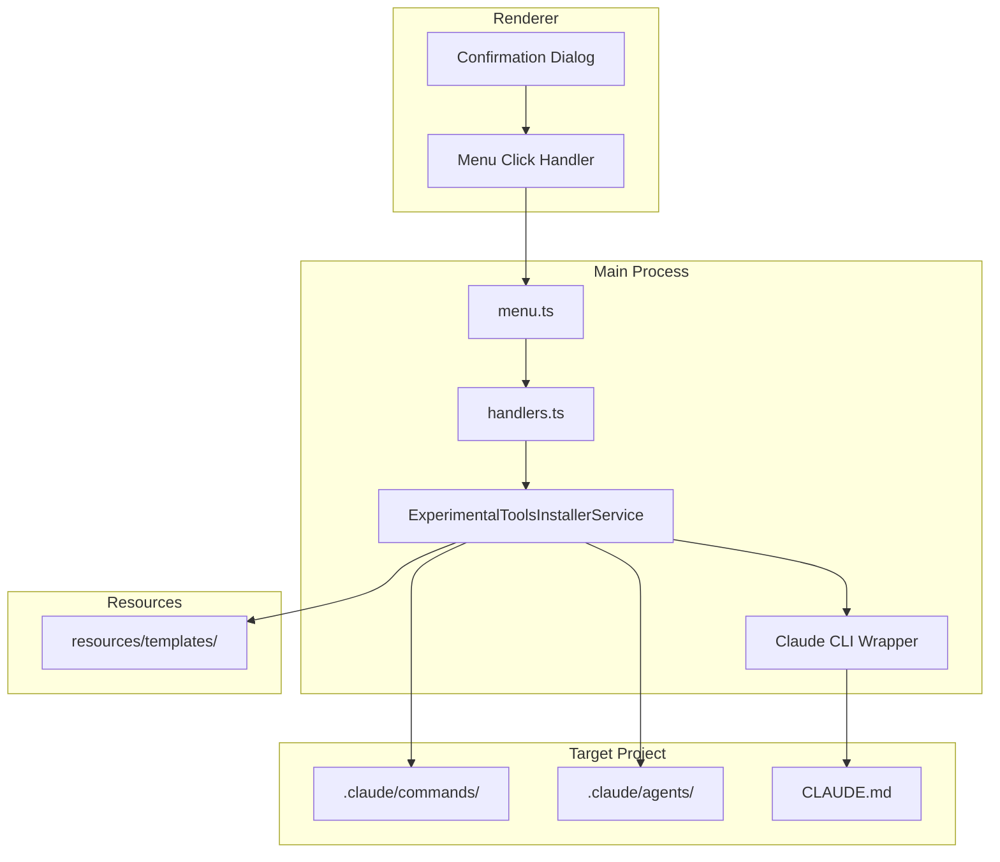
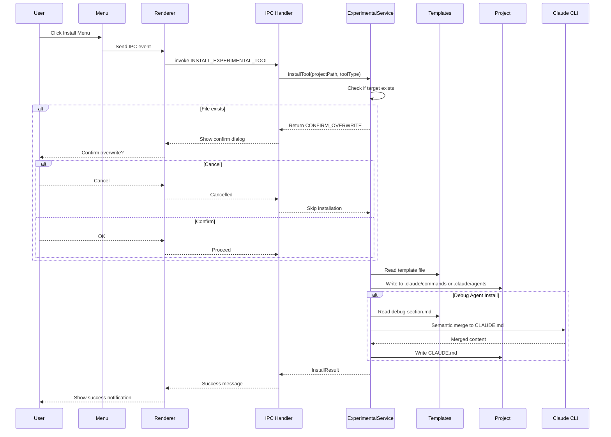

# Technical Design Document

## Overview

**Purpose**: 本機能は、Electron SDD Managerの「ツール」メニューに実験的なslash commands/agentsをプロジェクトにインストールする機能を追加する。開発者がPlanコマンド、Debugエージェント、Commitコマンドといった追加ツールを簡単に導入できるようにする。

**Users**: 開発者は、これらのツールを使用してspec-init前のプランニング、デバッグ作業の効率化、コミット操作の標準化を行う。

**Impact**: 既存の「ツール」メニューに新しいサブメニューを追加し、テンプレートファイルをアプリケーションにバンドルする。

### Goals

- ツールメニューから3つの実験的ツール（Plan、Debug、Commit）をワンクリックでインストール可能にする
- Debugエージェントインストール時にCLAUDE.mdへのセマンティックマージを自動実行する
- `/kiro:steering-debug`コマンドでデバッグ用steeringファイルを自動生成できるようにする
- オフライン環境でもツールをインストールできるようテンプレートをアプリにバンドルする

### Non-Goals

- ツールのアンインストール機能
- インストール前のプレビュー機能
- インストール先パスのカスタマイズ
- 複数ツールの一括インストール機能

## Architecture

### Existing Architecture Analysis

本機能は既存のElectronアプリケーションアーキテクチャを踏襲する:

- **メニュー管理**: `menu.ts`で定義されたツールメニューを拡張
- **IPCパターン**: `channels.ts`でチャンネル定義、`handlers.ts`でハンドラ実装、`preload/index.ts`でrendererへ公開
- **サービス層**: `CommandInstallerService`パターンを参考に新しいインストーラーサービスを作成
- **リソース管理**: `resourcePaths.ts`でテンプレートパスを解決

### Architecture Pattern & Boundary Map



**Architecture Integration**:
- Selected pattern: 既存のService Layerパターンを踏襲
- Domain/feature boundaries: ExperimentalToolsInstallerServiceは単独のサービスとして実装し、既存のCommandInstallerServiceとは独立
- Existing patterns preserved: IPC通信パターン、メニュー構築パターン、リソースパス解決パターン
- New components rationale: 実験的ツール専用のサービスを分離することで、将来の拡張や削除が容易
- Steering compliance: TypeScript strict mode、Zod未使用（シンプルなファイルコピーのため）

### Technology Stack

| Layer | Choice / Version | Role in Feature | Notes |
|-------|------------------|-----------------|-------|
| Frontend / CLI | React 19, Electron 35 | メニューUI、確認ダイアログ | 既存のダイアログパターンを使用 |
| Backend / Services | Node.js 20+, TypeScript 5.8+ | インストーラーサービス、IPC | fs/promises APIを使用 |
| External CLI | claude (Claude Code CLI) | セマンティックマージ | spawn経由で呼び出し |

## System Flows

### Install Tool Flow



## Requirements Traceability

| Requirement | Summary | Components | Interfaces | Flows |
|-------------|---------|------------|------------|-------|
| 1.1, 1.2, 1.3 | ツールメニュー構成 | MenuModule | - | - |
| 2.1, 2.2, 2.3, 2.4 | Planコマンドインストール | ExperimentalToolsInstallerService | installPlanCommand | Install Tool Flow |
| 3.1, 3.2, 3.3, 3.4, 3.5, 3.6 | Debugエージェントインストール | ExperimentalToolsInstallerService, ClaudeCLIWrapper | installDebugAgent | Install Tool Flow |
| 4.1, 4.2, 4.3, 4.4 | Commitコマンドインストール | ExperimentalToolsInstallerService | installCommitCommand | Install Tool Flow |
| 5.1, 5.2, 5.3 | テンプレートバンドル | Resources, resourcePaths | getExperimentalTemplatesPath | - |
| 6.1, 6.2, 6.3, 6.4, 6.5 | steering-debugコマンド | SlashCommand (steering-debug.md) | - | - |
| 7.1, 7.2, 7.3, 7.4 | エラーハンドリング | ExperimentalToolsInstallerService | InstallError型 | - |

## Components and Interfaces

| Component | Domain/Layer | Intent | Req Coverage | Key Dependencies | Contracts |
|-----------|--------------|--------|--------------|------------------|-----------|
| MenuModule Extension | UI/Main | 実験的ツールメニュー項目の追加 | 1.1, 1.2, 1.3 | menu.ts (P0) | - |
| ExperimentalToolsInstallerService | Service/Main | ツールインストールロジック | 2.1-2.4, 3.1-3.6, 4.1-4.4, 7.1-7.4 | fs/promises (P0), resourcePaths (P0) | Service |
| ClaudeCLIWrapper | Service/Main | Claude CLI呼び出し | 3.4, 3.5 | child_process (P0) | Service |
| IPC Channels Extension | IPC | 新規チャンネル定義 | 全体 | channels.ts (P0) | - |
| IPC Handlers Extension | IPC | インストールハンドラ | 全体 | handlers.ts (P0) | - |
| Preload Extension | Preload | Renderer API公開 | 全体 | preload/index.ts (P0) | - |
| steering-debug.md | SlashCommand | デバッグsteering生成 | 6.1-6.5 | - | - |

### Service Layer

#### ExperimentalToolsInstallerService

| Field | Detail |
|-------|--------|
| Intent | 実験的ツール（Plan, Debug, Commit）のインストールロジックを提供 |
| Requirements | 2.1-2.4, 3.1-3.6, 4.1-4.4, 7.1-7.4 |

**Responsibilities & Constraints**
- テンプレートファイルの読み込みとターゲットへのコピー
- 既存ファイルの存在チェックと上書き確認
- Debugエージェントインストール時のセマンティックマージ実行
- ディレクトリの自動作成（.claude/commands, .claude/agents）

**Dependencies**
- Inbound: handlers.ts - IPC経由でのサービス呼び出し (P0)
- Outbound: fs/promises - ファイルシステム操作 (P0)
- Outbound: resourcePaths.ts - テンプレートパス解決 (P0)
- Outbound: ClaudeCLIWrapper - セマンティックマージ (P1)

**Contracts**: Service [x] / API [ ] / Event [ ] / Batch [ ] / State [ ]

##### Service Interface

```typescript
type ToolType = 'plan' | 'debug' | 'commit';

interface InstallOptions {
  readonly force?: boolean; // 上書き確認をスキップ
}

interface InstallResult {
  readonly success: boolean;
  readonly installedFiles: readonly string[];
  readonly skippedFiles: readonly string[];
  readonly overwrittenFiles: readonly string[];
}

type InstallError =
  | { type: 'TEMPLATE_NOT_FOUND'; path: string }
  | { type: 'WRITE_ERROR'; path: string; message: string }
  | { type: 'PERMISSION_DENIED'; path: string }
  | { type: 'MERGE_ERROR'; message: string }
  | { type: 'CLAUDE_CLI_NOT_FOUND' }
  | { type: 'DIRECTORY_CREATE_ERROR'; path: string; message: string };

type Result<T, E> = { ok: true; value: T } | { ok: false; error: E };

interface CheckResult {
  readonly exists: boolean;
  readonly path: string;
}

interface ExperimentalToolsInstallerService {
  /**
   * Planコマンドをインストール
   * @param projectPath プロジェクトルートパス
   * @param options インストールオプション
   */
  installPlanCommand(
    projectPath: string,
    options?: InstallOptions
  ): Promise<Result<InstallResult, InstallError>>;

  /**
   * Debugエージェントをインストール（CLAUDE.mdへのマージ含む）
   * @param projectPath プロジェクトルートパス
   * @param options インストールオプション
   */
  installDebugAgent(
    projectPath: string,
    options?: InstallOptions
  ): Promise<Result<InstallResult, InstallError>>;

  /**
   * Commitコマンドをインストール
   * @param projectPath プロジェクトルートパス
   * @param options インストールオプション
   */
  installCommitCommand(
    projectPath: string,
    options?: InstallOptions
  ): Promise<Result<InstallResult, InstallError>>;

  /**
   * ターゲットファイルの存在を確認
   * @param projectPath プロジェクトルートパス
   * @param toolType ツールタイプ
   */
  checkTargetExists(
    projectPath: string,
    toolType: ToolType
  ): Promise<CheckResult>;
}
```

- Preconditions: projectPathが有効なディレクトリパスであること
- Postconditions: 成功時、指定されたファイルがプロジェクトにコピーされている
- Invariants: テンプレートファイルは読み取り専用、変更されない

**Implementation Notes**
- Integration: 既存のCommandInstallerServiceと同様のパターンで実装
- Validation: projectPathの存在確認はハンドラ層で実施
- Risks: Claude CLIが環境にインストールされていない場合のフォールバック

#### ClaudeCLIWrapper

| Field | Detail |
|-------|--------|
| Intent | Claude CLI（claudeコマンド）の呼び出しをラップ |
| Requirements | 3.4, 3.5 |

**Responsibilities & Constraints**
- Claude CLIのspawn実行
- プロンプト構築とテンプレート埋め込み
- 出力の取得とエラーハンドリング

**Dependencies**
- Outbound: child_process.spawn - プロセス起動 (P0)

**Contracts**: Service [x] / API [ ] / Event [ ] / Batch [ ] / State [ ]

##### Service Interface

```typescript
interface SemanticMergeOptions {
  readonly templateContent: string;
  readonly existingContent?: string;
  readonly targetPath: string;
}

interface SemanticMergeResult {
  readonly mergedContent: string;
  readonly wasCreated: boolean; // 新規作成 or マージ
}

type ClaudeCliError =
  | { type: 'CLI_NOT_FOUND' }
  | { type: 'EXECUTION_FAILED'; exitCode: number; stderr: string }
  | { type: 'TIMEOUT' };

interface ClaudeCLIWrapper {
  /**
   * CLAUDE.mdにデバッグセクションをセマンティックマージ
   * @param projectPath プロジェクトルートパス
   * @param options マージオプション
   */
  semanticMergeDebugSection(
    projectPath: string,
    options: SemanticMergeOptions
  ): Promise<Result<SemanticMergeResult, ClaudeCliError>>;

  /**
   * Claude CLIの存在確認
   */
  isClaudeCliAvailable(): Promise<boolean>;
}
```

- Preconditions: claudeコマンドがPATHに存在すること（isClaudeCliAvailableで事前確認推奨）
- Postconditions: 成功時、マージされた内容が返される
- Invariants: 既存のCLAUDE.mdの内容は保持される（マージ時）

**Implementation Notes**
- Integration: 既存のCommandInstallerService.semanticMergeClaudeMdパターンを参考
- Validation: Claude CLIの存在確認を事前に実施
- Risks: CLIタイムアウト、出力パースエラー

### IPC Layer

#### IPC Channels Extension

以下のチャンネルを`channels.ts`に追加:

```typescript
// Experimental Tools Install
INSTALL_EXPERIMENTAL_PLAN: 'ipc:install-experimental-plan',
INSTALL_EXPERIMENTAL_DEBUG: 'ipc:install-experimental-debug',
INSTALL_EXPERIMENTAL_COMMIT: 'ipc:install-experimental-commit',
CHECK_EXPERIMENTAL_TOOL_EXISTS: 'ipc:check-experimental-tool-exists',

// Menu Events - Experimental Tools
MENU_INSTALL_EXPERIMENTAL_PLAN: 'menu:install-experimental-plan',
MENU_INSTALL_EXPERIMENTAL_DEBUG: 'menu:install-experimental-debug',
MENU_INSTALL_EXPERIMENTAL_COMMIT: 'menu:install-experimental-commit',
```

#### IPC Handlers Extension

`handlers.ts`に以下のハンドラを追加:

```typescript
// Experimental Plan Command Install
ipcMain.handle(
  IPC_CHANNELS.INSTALL_EXPERIMENTAL_PLAN,
  async (_event, projectPath: string, options?: InstallOptions)
): Promise<Result<InstallResult, InstallError>>;

// Experimental Debug Agent Install
ipcMain.handle(
  IPC_CHANNELS.INSTALL_EXPERIMENTAL_DEBUG,
  async (_event, projectPath: string, options?: InstallOptions)
): Promise<Result<InstallResult, InstallError>>;

// Experimental Commit Command Install
ipcMain.handle(
  IPC_CHANNELS.INSTALL_EXPERIMENTAL_COMMIT,
  async (_event, projectPath: string, options?: InstallOptions)
): Promise<Result<InstallResult, InstallError>>;

// Check if experimental tool target exists
ipcMain.handle(
  IPC_CHANNELS.CHECK_EXPERIMENTAL_TOOL_EXISTS,
  async (_event, projectPath: string, toolType: ToolType)
): Promise<CheckResult>;
```

#### Preload Extension

`preload/index.ts`に以下のAPIを追加:

```typescript
// Experimental Tools Install
installExperimentalPlan: (
  projectPath: string,
  options?: InstallOptions
): Promise<Result<InstallResult, InstallError>> =>
  ipcRenderer.invoke(IPC_CHANNELS.INSTALL_EXPERIMENTAL_PLAN, projectPath, options),

installExperimentalDebug: (
  projectPath: string,
  options?: InstallOptions
): Promise<Result<InstallResult, InstallError>> =>
  ipcRenderer.invoke(IPC_CHANNELS.INSTALL_EXPERIMENTAL_DEBUG, projectPath, options),

installExperimentalCommit: (
  projectPath: string,
  options?: InstallOptions
): Promise<Result<InstallResult, InstallError>> =>
  ipcRenderer.invoke(IPC_CHANNELS.INSTALL_EXPERIMENTAL_COMMIT, projectPath, options),

checkExperimentalToolExists: (
  projectPath: string,
  toolType: ToolType
): Promise<CheckResult> =>
  ipcRenderer.invoke(IPC_CHANNELS.CHECK_EXPERIMENTAL_TOOL_EXISTS, projectPath, toolType),

// Menu Events
onMenuInstallExperimentalPlan: (callback: () => void): (() => void) => { ... },
onMenuInstallExperimentalDebug: (callback: () => void): (() => void) => { ... },
onMenuInstallExperimentalCommit: (callback: () => void): (() => void) => { ... },
```

### Menu Layer

#### MenuModule Extension

`menu.ts`のツールメニューに以下のサブメニューを追加:

```typescript
// Tools menu extension
{
  label: 'ツール',
  submenu: [
    // ... existing items ...
    { type: 'separator' },
    {
      label: '実験的ツール',
      submenu: [
        {
          label: 'Planコマンドをインストール (実験的)',
          enabled: currentProjectPathForMenu !== null,
          click: () => {
            const window = BrowserWindow.getFocusedWindow() || BrowserWindow.getAllWindows()[0];
            if (window) {
              window.webContents.send(IPC_CHANNELS.MENU_INSTALL_EXPERIMENTAL_PLAN);
            }
          },
        },
        {
          label: 'Debugエージェントをインストール (実験的)',
          enabled: currentProjectPathForMenu !== null,
          click: () => {
            const window = BrowserWindow.getFocusedWindow() || BrowserWindow.getAllWindows()[0];
            if (window) {
              window.webContents.send(IPC_CHANNELS.MENU_INSTALL_EXPERIMENTAL_DEBUG);
            }
          },
        },
        {
          label: 'Commitコマンドをインストール (実験的)',
          enabled: currentProjectPathForMenu !== null,
          click: () => {
            const window = BrowserWindow.getFocusedWindow() || BrowserWindow.getAllWindows()[0];
            if (window) {
              window.webContents.send(IPC_CHANNELS.MENU_INSTALL_EXPERIMENTAL_COMMIT);
            }
          },
        },
      ],
    },
  ],
}
```

### Slash Command

#### steering-debug.md

| Field | Detail |
|-------|--------|
| Intent | プロジェクト情報を収集してデバッグ用steeringファイルを生成 |
| Requirements | 6.1-6.5 |

**Responsibilities & Constraints**
- プロジェクトの起動方法、MCP設定、E2Eコマンド、ログ参照方法、トラブルシューティングノウハウを収集
- `.kiro/steering/debugging.md`を生成
- 既存ファイルがある場合は上書き確認

**実装場所**: `.claude/commands/kiro/steering-debug.md`

**Contracts**: SlashCommand

```markdown
---
description: Generate debugging steering file for the project
allowed-tools: Read, Write, Glob, Grep, Task
---

# Kiro Steering Debug Generation

## Mission
プロジェクトの情報を収集し、デバッグエージェントに必要な情報を含む`.kiro/steering/debugging.md`を生成する。

## Workflow

### Phase 1: 情報収集
以下の情報を収集:
1. **起動方法**: package.json scripts、Taskfile.yml、README.mdから起動コマンドを特定
2. **MCP設定**: .mcp.jsonまたはCLAUDE.mdからMCP設定を特定
3. **E2Eコマンドラインツール**: テスト関連のコマンドを特定
4. **ログ参照方法**: ログファイルの場所、ログコマンドを特定
5. **トラブルシューティングノウハウ**: 既存のドキュメントから収集

### Phase 2: 不明点の確認
収集した情報に不明点がある場合、ユーザーに質問する。

### Phase 3: ファイル生成
`.kiro/steering/debugging.md`を生成。
既存ファイルがある場合は上書き確認を行う。

## Output Format
生成されるdebugging.mdの構造:
- MCP経由でのログ参照
- MCP経由でのUI操作
- Troubleshooting
- ログ表示コマンド詳細
- テスト時のプロジェクト指定
```

**Implementation Notes**
- Integration: 既存の`/kiro:steering`、`/kiro:steering-custom`パターンに従う
- Validation: ファイル生成前に既存ファイルの存在確認
- Risks: プロジェクト構造が標準的でない場合、情報収集が不完全になる可能性

## Data Models

### Template Structure

テンプレートファイルはElectronアプリのリソースとしてバンドル:

```
electron-sdd-manager/resources/templates/
├── commands/
│   ├── plan.md           # Planコマンドテンプレート
│   └── commit.md         # Commitコマンドテンプレート
├── agents/
│   └── debug.md          # Debugエージェントテンプレート
└── claude-md-snippets/
    └── debug-section.md  # CLAUDE.mdに追加するセクション
```

### debug-section.md の内容

```markdown
## Debugging

デバッグ・動作確認には専用の `debug` agent を使用。

### 自動起動トリガー

以下の状況では `debug` agent の使用を検討：

| トリガー | 用途 |
|----------|------|
| 起動・ビルドコマンド実行後にエラー発生 | 環境問題の診断 |
| MCP electronツール使用時 | UI操作・ログ取得の詳細手順 |
| E2Eテスト失敗時 | テスト失敗の原因調査 |
| 「ログを確認」「デバッグ」等のユーザー指示 | 各種デバッグ作業 |
| アプリが期待通り動作しない | 動作確認・トラブルシューティング |

### 詳細情報

デバッグの詳細手順は `.kiro/steering/debugging.md` を参照。
Agent定義は `.claude/agents/debug.md` にある。
```

## Error Handling

### Error Strategy

各エラータイプに対して具体的なエラーメッセージを提供し、ユーザーが問題を特定・対処できるようにする。

### Error Categories and Responses

**User Errors (4xx相当)**:
- `TEMPLATE_NOT_FOUND`: テンプレートファイルが見つからない → アプリの再インストールを案内
- `PERMISSION_DENIED`: 書き込み権限がない → ディレクトリの権限確認を案内

**System Errors (5xx相当)**:
- `WRITE_ERROR`: ファイル書き込み失敗 → ディスク容量確認、ファイルロック確認を案内
- `DIRECTORY_CREATE_ERROR`: ディレクトリ作成失敗 → 親ディレクトリの権限確認を案内
- `CLAUDE_CLI_NOT_FOUND`: Claude CLIが見つからない → Claude CLIのインストール案内

**External Errors**:
- `MERGE_ERROR`: セマンティックマージ失敗 → 手動でのCLAUDE.md編集を案内
- `EXECUTION_FAILED`: Claude CLI実行失敗 → CLIのバージョン確認、再試行を案内
- `TIMEOUT`: Claude CLI タイムアウト → ネットワーク接続確認、再試行を案内

### Monitoring

- 各インストール操作の成功/失敗をlogger経由でログ出力
- エラー発生時はエラー詳細をログに記録

## Testing Strategy

### Unit Tests

- **ExperimentalToolsInstallerService**:
  - `installPlanCommand`: テンプレートコピー、既存ファイル検出、force上書き
  - `installDebugAgent`: テンプレートコピー、セマンティックマージ呼び出し
  - `installCommitCommand`: テンプレートコピー、既存ファイル検出
  - `checkTargetExists`: 各ツールタイプの存在確認

- **ClaudeCLIWrapper**:
  - `semanticMergeDebugSection`: プロンプト構築、正常出力、エラーハンドリング
  - `isClaudeCliAvailable`: CLI存在確認

### Integration Tests

- メニュークリック → IPC → サービス → ファイル生成のE2Eフロー
- 既存ファイル存在時の上書き確認ダイアログフロー
- Claude CLIが存在しない環境でのフォールバック動作

### E2E Tests

- 各メニュー項目のクリックと成功メッセージ表示
- プロジェクト未選択時のメニュー無効化確認
- 上書き確認ダイアログのキャンセル動作

## Optional Sections

### Security Considerations

- テンプレートファイルはアプリケーションリソースとしてバンドルされ、読み取り専用
- ユーザープロジェクトへの書き込みは明示的なユーザーアクション（メニュークリック）に基づく
- Claude CLI呼び出し時のプロンプトインジェクション対策: ユーザー入力を直接プロンプトに含めない

### Performance & Scalability

- ファイルコピー操作は非同期で実行し、UIをブロックしない
- Claude CLI呼び出しには適切なタイムアウト（30秒）を設定
- 大規模なCLAUDE.mdファイルのマージでもメモリ効率的に処理
