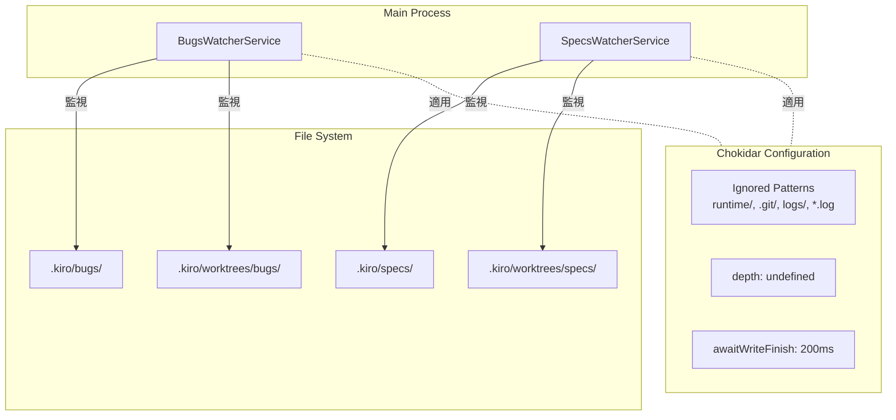
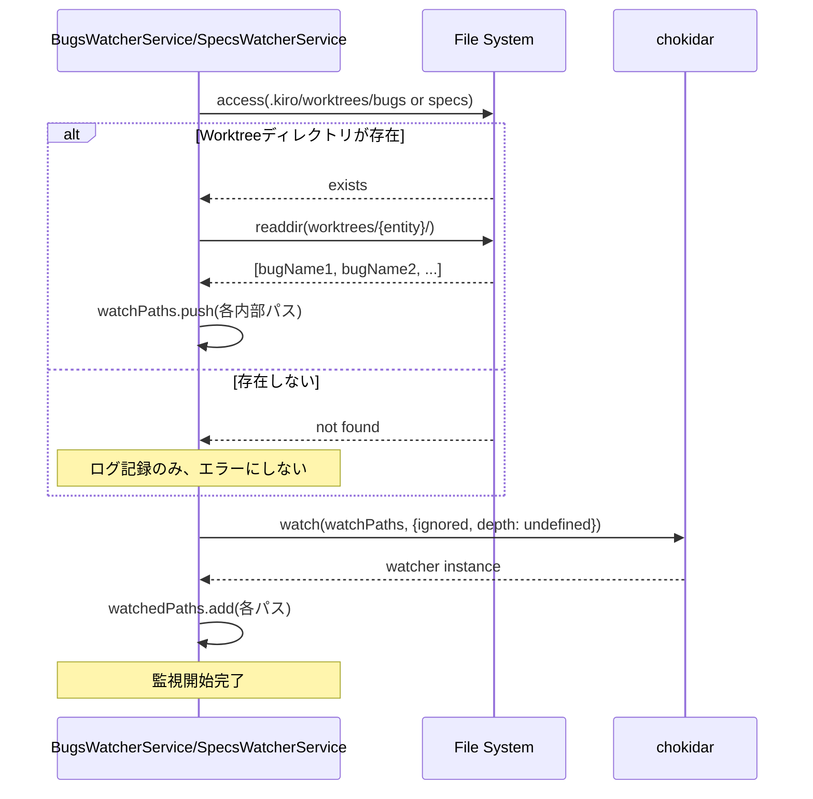
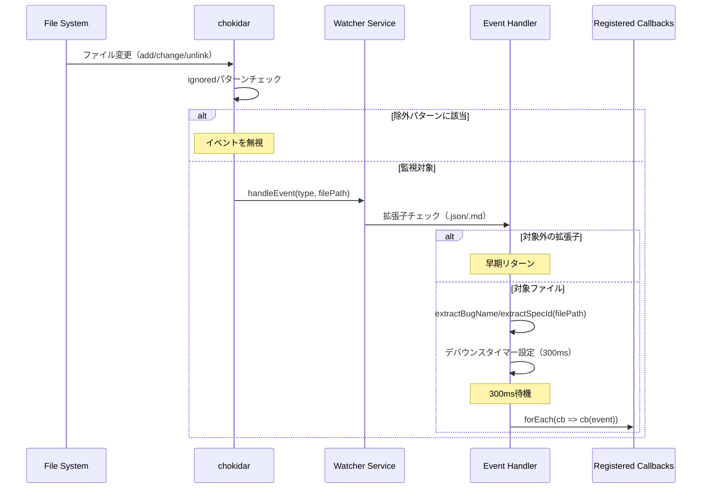

# Design: File Watcher Root Monitoring

## Overview

ファイル監視機構（`BugsWatcherService`, `SpecsWatcherService`）を「個別パス監視 + 動的追加」方式から「ルート監視 + Globフィルタリング」方式に移行する。この変更により、Worktree作成時の500ms待機タイミング依存性を解消し、ファイル変更検知の信頼性と効率性を向上させる。

**Purpose**: Worktree作成時のファイル監視における不安定性を排除し、イベント処理のオーバーヘッドを削減する。

**Users**: SDD Orchestratorアプリケーションのすべてのユーザー。ファイル監視はバックグラウンドで動作するため、ユーザーは変更を意識しないが、Worktree作成後のファイル検知が即座に機能するようになる。

**Impact**:
- 既存の2層監視ロジック（`handleWorktreeAddition`, `handleWorktreeRemoval`, `worktreeAdditionTimers`）を削除
- `chokidar` の監視設定を変更（`depth: 2` → `depth: undefined`）
- 除外パターン（`ignored`）を追加して不要なイベントを削減

### Goals

- Worktree作成時の500ms待機ロジックを完全削除し、タイミング依存性を排除する
- ルート監視方式により、ファイルシステムイベントをリアルタイムで検知する
- 既存の`onChange()`, `start()`, `stop()`インターフェースを維持し、呼び出し側への影響をゼロにする
- E2Eテストですべての既存ワークフローが正常動作することを確認する

### Non-Goals

- `AgentRecordWatcherService`のリファクタリング（既に最適化済み）
- `GitFileWatcherService`のリファクタリング（単一ファイル監視で最適）
- ファイル監視イベントのデバウンス時間の変更（既存の300msを維持）
- `resetWatchPath()`メソッドのリファクタリング（既存の動作を維持）

## Architecture

### Existing Architecture Analysis

**現在の実装パターン（2層監視方式）**:

```
.kiro/bugs/ を監視
.kiro/worktrees/bugs/ を監視（ベースディレクトリのみ、depth: 2）
└─ Worktreeディレクトリ作成検知（addDir イベント）
   └─ 500ms待機タイマー起動
      └─ 内部 .kiro/bugs/{bugName}/ パスを動的に追加監視
```

**課題**:
1. **タイミング依存**: 500ms待機はディレクトリ構造の作成完了を"期待"するだけで、確実性がない
2. **複雑性**: `handleWorktreeAddition()`, `handleWorktreeRemoval()`, `worktreeAdditionTimers` による状態管理
3. **重複監視リスク**: `watchedPaths: Set<string>` で防止しているが、ロジックが複雑
4. **イベントオーバーヘッド**: 監視パス追加・削除のたびにchokidarの内部状態が変更される

**既存の保持すべきパターン**:
- `extractBugName()` / `extractSpecId()` のパス解析ロジック
- デバウンス処理（300ms、ファイルごとに独立）
- `onChange()` コールバック登録パターン
- `watchedPaths: Set<string>` による重複監視防止

### Architecture Pattern & Boundary Map

**選択パターン**: ルート監視 + イベントフィルタリング

**アーキテクチャ統合**:
- **Selected pattern**: ルート監視方式（Root Monitoring with Glob Filtering）
  - 監視対象ディレクトリを初期化時に固定
  - chokidarの`ignored`オプションで不要なパスを除外
  - イベントハンドラで拡張子フィルタリング（`.json`, `.md`のみ）
- **Domain/feature boundaries**:
  - `BugsWatcherService`: `.kiro/bugs/`, `.kiro/worktrees/bugs/` を監視
  - `SpecsWatcherService`: `.kiro/specs/`, `.kiro/worktrees/specs/` を監視
  - 各サービスが独立してルート監視を持ち、責務を分離
- **Existing patterns preserved**:
  - パス解析ロジック（`extractBugName`, `extractSpecId`）
  - デバウンス処理（ファイルパスごとのタイマー管理）
  - コールバック登録・通知パターン
- **New components rationale**: なし（既存サービスの内部ロジック変更のみ）
- **Steering compliance**:
  - DRY: 2層監視ロジックの削除により、重複コードを排除
  - KISS: シンプルなルート監視に統一
  - YAGNI: 不要になった動的パス追加・削除機能を削除



**Key Decisions**:
- ルート監視により、Worktree内部のファイルも自動的に監視対象になるため、動的パス追加が不要
- `ignored`オプションで不要なディレクトリを除外し、OS負荷を軽減
- イベントハンドラで拡張子フィルタリングを行い、処理対象を絞り込む

### Technology Stack

| Layer | Choice / Version | Role in Feature | Notes |
|-------|------------------|-----------------|-------|
| Backend / Services | chokidar (既存) | ファイルシステム監視 | 既存ライブラリをそのまま使用、設定変更のみ |
| Backend / Services | Node.js fs/promises (既存) | ディレクトリ存在確認 | 初期化時の存在確認に使用 |

## System Flows

### ルート監視初期化フロー



**Key Decisions**:
- 初期化時にWorktreeディレクトリの存在確認を行い、存在する場合のみ内部パスを追加
- Worktreeディレクトリが存在しない場合もエラーにせず、ログ記録のみで継続
- すべての監視パスを一度に`chokidar.watch()`に渡すことで、内部最適化を活用

### ファイル変更検知フロー（新方式）



**Key Decisions**:
- `ignored`オプションでOS側の監視を削減（runtime, .git, logs）
- イベントハンドラで拡張子フィルタリングを行い、処理対象を絞り込む
- 既存のデバウンスロジックを維持（ファイルパスごとに独立）

## Requirements Traceability

| Criterion ID | Summary | Components | Implementation Approach |
|--------------|---------|------------|------------------------|
| 1.1 | BugsWatcherService起動時の監視パス設定 | BugsWatcherService | 既存`start()`メソッドを修正。初期監視パスに`.kiro/bugs/`, `.kiro/worktrees/bugs/`を含める |
| 1.2 | SpecsWatcherService起動時の監視パス設定 | SpecsWatcherService | 既存`start()`メソッドを修正。初期監視パスに`.kiro/specs/`, `.kiro/worktrees/specs/`を含める |
| 1.3 | Worktree内ファイル変更の即座検知 | BugsWatcherService, SpecsWatcherService | ルート監視により、Worktree内部ファイルも自動監視対象。`awaitWriteFinish`で書き込み完了検知 |
| 1.4 | handleWorktreeAdditionメソッドの削除 | BugsWatcherService, SpecsWatcherService | メソッド削除、呼び出し箇所を削除 |
| 1.5 | worktreeAdditionTimersの削除 | BugsWatcherService, SpecsWatcherService | プロパティ削除、タイマー管理コードを削除 |
| 2.1 | chokidar初期化時のignored設定 | BugsWatcherService, SpecsWatcherService | `chokidar.watch()`の`ignored`オプションに除外パターンを指定 |
| 2.2 | ファイル変更イベント時の拡張子フィルタリング | BugsWatcherService, SpecsWatcherService | `handleEvent()`内で拡張子チェック、`.json/.md`以外は早期リターン |
| 2.3 | 除外パターンに該当するファイルのイベント無視 | BugsWatcherService, SpecsWatcherService | chokidarの`ignored`オプションで自動除外 |
| 3.1 | .kiro/bugs/{bugName}/...からbugName抽出 | BugsWatcherService | 既存`extractBugName()`を維持 |
| 3.2 | Worktreeパス.kiro/worktrees/bugs/{bugName}/.kiro/bugs/{bugName}/...からbugName抽出 | BugsWatcherService | 既存`extractBugName()`を維持 |
| 3.3 | .kiro/specs/{specId}/...からspecId抽出 | SpecsWatcherService | 既存`extractSpecId()`を維持 |
| 3.4 | Worktreeパス.kiro/worktrees/specs/{specId}/.kiro/specs/{specId}/...からspecId抽出 | SpecsWatcherService | 既存`extractSpecId()`を維持 |
| 4.1 | handleWorktreeAdditionメソッドの削除 | BugsWatcherService, SpecsWatcherService | メソッド本体を削除 |
| 4.2 | handleWorktreeRemovalメソッドの削除 | BugsWatcherService, SpecsWatcherService | メソッド本体を削除 |
| 4.3 | worktreeAdditionTimersプロパティの削除 | BugsWatcherService, SpecsWatcherService | プロパティ定義を削除 |
| 4.4 | worktreeAdditionDebounceMsプロパティの削除 | BugsWatcherService, SpecsWatcherService | プロパティ定義を削除 |
| 4.5 | detectWorktreeAddition呼び出しの削除 | BugsWatcherService, SpecsWatcherService | `handleEvent()`内の呼び出しを削除 |
| 5.1 | ignoreInitial設定 | BugsWatcherService, SpecsWatcherService | 既存設定を維持（`ignoreInitial: true`） |
| 5.2 | persistent設定 | BugsWatcherService, SpecsWatcherService | 既存設定を維持（`persistent: true`） |
| 5.3 | depth設定変更 | BugsWatcherService, SpecsWatcherService | `depth: 2` → `depth: undefined` に変更 |
| 5.4 | awaitWriteFinish設定 | BugsWatcherService, SpecsWatcherService | 既存設定を維持（`awaitWriteFinish: { stabilityThreshold: 200, pollInterval: 100 }`） |
| 6.1 | onChange()インターフェース維持 | BugsWatcherService, SpecsWatcherService | 既存実装を維持 |
| 6.2 | start()インターフェース維持 | BugsWatcherService, SpecsWatcherService | 内部実装のみ変更、シグネチャは維持 |
| 6.3 | stop()インターフェース維持 | BugsWatcherService, SpecsWatcherService | `worktreeAdditionTimers`クリア処理を削除、他は維持 |
| 6.4 | ファイル変更イベント時のコールバック実行 | BugsWatcherService, SpecsWatcherService | 既存実装を維持 |
| 7.1 | spec-workflow.e2e.spec.tsのパス | E2Eテスト | 既存テストを実行、すべてパスすることを確認 |
| 7.2 | bug-workflow.e2e.spec.tsのパス | E2Eテスト | 既存テストを実行、すべてパスすることを確認 |
| 7.3 | Worktree作成後のファイル監視イベント検証 | E2Eテスト | 既存テストで検証（新規テストは不要） |
| 8.1 | start()時の監視パス設定検証 | ユニットテスト | 新規テスト追加：監視パスが正しく設定されることを確認 |
| 8.2 | ファイル変更イベント時のコールバック実行検証 | ユニットテスト | 既存テストを維持 |
| 8.3 | 除外パターンファイルのイベント無視検証 | ユニットテスト | 新規テスト追加：`.log`ファイル等が無視されることを確認 |
| 9.1 | start()時のwatchedPaths追加 | BugsWatcherService, SpecsWatcherService | 既存実装を維持 |
| 9.2 | stop()時のwatchedPathsクリア | BugsWatcherService, SpecsWatcherService | 既存実装を維持 |
| 9.3 | 重複監視防止 | BugsWatcherService, SpecsWatcherService | 既存実装を維持（`watchedPaths.has()`チェック） |
| 10.1 | start()実行時のログ出力 | BugsWatcherService, SpecsWatcherService | 既存ログを維持、監視対象パスを出力 |
| 10.2 | ファイル変更イベント発生時のログ出力 | BugsWatcherService, SpecsWatcherService | 既存ログを維持 |
| 10.3 | 除外パターンによるイベント無視時のログ出力 | BugsWatcherService, SpecsWatcherService | 新規ログ追加（デバッグレベル） |

### Coverage Validation Checklist

- [x] Every criterion ID from requirements.md appears in the table above
- [x] Each criterion has specific component names (not generic references)
- [x] Implementation approach distinguishes "reuse existing" vs "new implementation"
- [x] User-facing criteria specify concrete UI components (N/A - バックグラウンドサービスのため)

## Components and Interfaces

| Component | Domain/Layer | Intent | Req Coverage | Key Dependencies (P0/P1) | Contracts |
|-----------|--------------|--------|--------------|--------------------------|-----------|
| BugsWatcherService | Main Process / File Monitoring | `.kiro/bugs/`および`.kiro/worktrees/bugs/`のファイル変更監視 | 1.1, 1.3, 1.4, 1.5, 2.1-2.3, 3.1-3.2, 4.1-4.5, 5.1-5.4, 6.1-6.4, 9.1-9.3, 10.1-10.3 | chokidar (P0), fs/promises (P0) | Service |
| SpecsWatcherService | Main Process / File Monitoring | `.kiro/specs/`および`.kiro/worktrees/specs/`のファイル変更監視 | 1.2, 1.3, 1.4, 1.5, 2.1-2.3, 3.3-3.4, 4.1-4.5, 5.1-5.4, 6.1-6.4, 9.1-9.3, 10.1-10.3 | chokidar (P0), fs/promises (P0) | Service |

### Main Process / File Monitoring

#### BugsWatcherService

| Field | Detail |
|-------|--------|
| Intent | `.kiro/bugs/`および`.kiro/worktrees/bugs/`のファイル変更を監視し、コールバックに通知する |
| Requirements | 1.1, 1.3, 1.4, 1.5, 2.1-2.3, 3.1-3.2, 4.1-4.5, 5.1-5.4, 6.1-6.4, 9.1-9.3, 10.1-10.3 |

**Responsibilities & Constraints**
- `.kiro/bugs/`および`.kiro/worktrees/bugs/`配下のファイル変更を監視
- 除外パターン（`runtime/`, `.git/`, `logs/`, `*.log`）に該当するファイルを無視
- ファイル変更イベントをデバウンス処理（300ms）後にコールバックに通知
- `watchedPaths: Set<string>`で監視パスを管理し、重複監視を防止

**Dependencies**
- External: chokidar — ファイルシステム監視 (P0)
- External: fs/promises — ディレクトリ存在確認 (P0)
- External: path — パス解析・結合 (P0)

**Contracts**: Service [x]

##### Service Interface

```typescript
interface BugsWatcherService {
  /**
   * ファイル監視を開始する
   * 監視対象: .kiro/bugs/, .kiro/worktrees/bugs/
   * 除外パターン: *\/runtime/**, **\/.git/**, **/logs/**, **\/*.log
   */
  start(): Promise<void>;

  /**
   * ファイル監視を停止する
   * すべてのデバウンスタイマーをクリアし、watcherを閉じる
   */
  stop(): Promise<void>;

  /**
   * ファイル変更イベントのコールバックを登録する
   * @param callback - イベント通知時に呼び出される関数
   */
  onChange(callback: BugsChangeCallback): void;

  /**
   * 登録されたすべてのコールバックをクリアする
   */
  clearCallbacks(): void;

  /**
   * 監視が動作中かを確認する
   * @returns true: 動作中, false: 停止中
   */
  isRunning(): boolean;

  /**
   * Worktree設定に基づく監視パスを取得する
   * （既存メソッド、変更なし）
   */
  getWatchPath(bugId: string, worktreeConfig?: BugWorktreeConfig): string;

  /**
   * 監視パスを新しい場所にリセットする
   * （既存メソッド、変更なし）
   */
  resetWatchPath(bugId: string, newWatchPath: string): Promise<void>;
}

type BugsChangeCallback = (event: BugsChangeEvent) => void;

interface BugsChangeEvent {
  type: 'add' | 'change' | 'unlink' | 'addDir' | 'unlinkDir';
  path: string;
  bugName?: string;
}
```

- Preconditions:
  - `start()`: プロジェクトパスが有効なディレクトリであること
  - `onChange()`: コールバック関数が有効であること
- Postconditions:
  - `start()`: 監視が開始され、ファイル変更イベントが検知されること
  - `stop()`: すべての監視が停止し、タイマーがクリアされること
  - `onChange()`: 登録されたコールバックがファイル変更時に呼び出されること
- Invariants:
  - `watchedPaths`に登録されたパスのみが監視対象
  - 同じパスを重複して監視しない

**Implementation Notes**
- Integration:
  - chokidarの`watch()`に監視対象パスを配列で渡す
  - `ignored`オプションで除外パターンを指定
  - `depth: undefined`に変更して全階層を監視
- Validation:
  - Worktreeディレクトリの存在確認（`access()`）でエラーハンドリング
  - 拡張子フィルタリング（`.json`, `.md`）でイベント処理を絞り込み
- Risks:
  - ルート監視により、監視対象ファイル数が増加する可能性がある
  - `ignored`オプションで除外パターンを適切に設定する必要がある

#### SpecsWatcherService

| Field | Detail |
|-------|--------|
| Intent | `.kiro/specs/`および`.kiro/worktrees/specs/`のファイル変更を監視し、コールバックに通知する |
| Requirements | 1.2, 1.3, 1.4, 1.5, 2.1-2.3, 3.3-3.4, 4.1-4.5, 5.1-5.4, 6.1-6.4, 9.1-9.3, 10.1-10.3 |

**Responsibilities & Constraints**
- `.kiro/specs/`および`.kiro/worktrees/specs/`配下のファイル変更を監視
- 除外パターン（`runtime/`, `.git/`, `logs/`, `*.log`）に該当するファイルを無視
- ファイル変更イベントをデバウンス処理（300ms）後にコールバックに通知
- `watchedPaths: Set<string>`で監視パスを管理し、重複監視を防止
- アーティファクト生成（requirements.md, design.md, tasks.md）を検知し、spec.jsonの`updated_at`を更新

**Dependencies**
- External: chokidar — ファイルシステム監視 (P0)
- External: fs/promises — ディレクトリ存在確認、ファイル読み書き (P0)
- External: path — パス解析・結合 (P0)
- Inbound: FileService — spec.json更新 (P1)

**Contracts**: Service [x]

##### Service Interface

```typescript
interface SpecsWatcherService {
  /**
   * ファイル監視を開始する
   * 監視対象: .kiro/specs/, .kiro/worktrees/specs/
   * 除外パターン: **/runtime/**, **\/.git/**, **/logs/**, **\/*.log
   */
  start(): Promise<void>;

  /**
   * ファイル監視を停止する
   * すべてのデバウンスタイマーをクリアし、watcherを閉じる
   */
  stop(): Promise<void>;

  /**
   * ファイル変更イベントのコールバックを登録する
   * @param callback - イベント通知時に呼び出される関数
   */
  onChange(callback: SpecsChangeCallback): void;

  /**
   * 登録されたすべてのコールバックをクリアする
   */
  clearCallbacks(): void;

  /**
   * 監視が動作中かを確認する
   * @returns true: 動作中, false: 停止中
   */
  isRunning(): boolean;

  /**
   * Worktree設定に基づく監視パスを取得する
   * （既存メソッド、変更なし）
   */
  getWatchPath(specId: string, worktreeConfig?: WorktreeConfig): string;

  /**
   * 監視パスを新しい場所にリセットする
   * （既存メソッド、変更なし）
   */
  resetWatchPath(specId: string, newWatchPath: string): Promise<void>;
}

type SpecsChangeCallback = (event: SpecsChangeEvent) => void;

interface SpecsChangeEvent {
  type: 'add' | 'change' | 'unlink' | 'addDir' | 'unlinkDir';
  path: string;
  specId?: string;
}
```

- Preconditions:
  - `start()`: プロジェクトパスが有効なディレクトリであること
  - `onChange()`: コールバック関数が有効であること
- Postconditions:
  - `start()`: 監視が開始され、ファイル変更イベントが検知されること
  - `stop()`: すべての監視が停止し、タイマーがクリアされること
  - `onChange()`: 登録されたコールバックがファイル変更時に呼び出されること
- Invariants:
  - `watchedPaths`に登録されたパスのみが監視対象
  - 同じパスを重複して監視しない

**Implementation Notes**
- Integration:
  - chokidarの`watch()`に監視対象パスを配列で渡す
  - `ignored`オプションで除外パターンを指定
  - `depth: undefined`に変更して全階層を監視
  - アーティファクト生成検知（`handleArtifactGeneration`）とタスク完了検知（`checkTaskCompletion`）は既存ロジックを維持
- Validation:
  - Worktreeディレクトリの存在確認（`access()`）でエラーハンドリング
  - 拡張子フィルタリング（`.json`, `.md`）でイベント処理を絞り込み
- Risks:
  - ルート監視により、監視対象ファイル数が増加する可能性がある
  - `ignored`オプションで除外パターンを適切に設定する必要がある

## Error Handling

### Error Strategy

ファイル監視機構のエラーは、アプリケーション全体の動作を停止させず、ログに記録して継続動作を優先する。

### Error Categories and Responses

**User Errors** (4xx): N/A（ファイル監視はバックグラウンドプロセス）

**System Errors** (5xx):
- **Worktreeディレクトリが存在しない**: ログに記録し、エラーにせず継続（ディレクトリが後で作成される可能性がある）
- **chokidarの初期化エラー**: ログに記録し、watcherをnullに設定（`isRunning()`でfalseを返す）
- **ファイル変更イベント処理エラー**: ログに記録し、次のイベント処理を継続

**Business Logic Errors** (422): N/A

### Monitoring

- **logger**: すべてのエラーを`logger.error()`に記録
- **デバッグログ**: Worktreeディレクトリの存在確認結果を`logger.debug()`に記録
- **ヘルスチェック**: `isRunning()`メソッドで監視状態を確認可能

## Testing Strategy

### Unit Tests

1. **監視パス設定の検証**（新規）:
   - `start()`呼び出し時、`watchedPaths`に期待されるパスが追加されることを確認
   - Worktreeディレクトリが存在しない場合、エラーにならず継続することを確認

2. **除外パターンの検証**（新規）:
   - `.log`ファイル、`runtime/`配下のファイルが監視対象外になることを確認
   - `.json`, `.md`ファイルのみがイベント処理されることを確認

3. **デバウンス処理の検証**（既存）:
   - 同じファイルへの連続イベントがデバウンスされることを確認
   - 異なるファイルへのイベントが独立して処理されることを確認

4. **stop()時のクリーンアップ検証**（既存）:
   - `stop()`呼び出し時、すべてのタイマーがクリアされることを確認
   - `watchedPaths`がクリアされることを確認

5. **パス解析ロジックの検証**（既存）:
   - `extractBugName()` / `extractSpecId()`が正しくIDを抽出することを確認

### Integration Tests

1. **Worktree作成後のファイル監視**（E2E）:
   - Worktree作成後、内部ファイルの変更が即座に検知されることを確認

2. **アーティファクト生成検知**（E2E）:
   - requirements.md, design.md, tasks.mdの生成が検知され、spec.jsonの`updated_at`が更新されることを確認

3. **タスク完了検知**（E2E）:
   - tasks.mdのすべてのタスクが完了したとき、spec.jsonのphaseが`implementation-complete`に更新されることを確認

### E2E/UI Tests

1. **spec-workflow.e2e.spec.ts**:
   - 既存のSpecワークフローテストがすべてパスすることを確認

2. **bug-workflow.e2e.spec.ts**:
   - 既存のBugワークフローテストがすべてパスすることを確認

## Design Decisions

### DD-001: ルート監視方式の選択

| Field | Detail |
|-------|--------|
| Status | Accepted |
| Context | 既存の2層監視方式（個別パス監視 + 動的追加）は、Worktree作成時の500ms待機に依存しており、タイミング問題が発生していた。 |
| Decision | ルート監視方式（Root Monitoring with Glob Filtering）を採用し、初期化時に監視対象パスを固定する。 |
| Rationale | - Worktree内部のファイルも自動的に監視対象になるため、動的パス追加が不要<br/>- 500ms待機ロジックを削除でき、タイミング依存性を排除<br/>- chokidarの内部最適化を活用し、パフォーマンスを維持 |
| Alternatives Considered | - **短期施策（watchedPaths Set導入）**: 既に実装済みのため不要<br/>- **段階的移行（フラグ切り替え）**: コードの複雑性が増すだけで、メリットが少ない |
| Consequences | - 監視対象ファイル数が増加する可能性があるが、`ignored`オプションで軽減<br/>- 2層監視ロジック（約200行）を削除でき、保守性が向上 |

### DD-002: 除外パターンの設計

| Field | Detail |
|-------|--------|
| Status | Accepted |
| Context | ルート監視方式では、`.kiro/`配下のすべてのファイルが監視対象になるため、不要なイベントを削減する必要がある。 |
| Decision | chokidarの`ignored`オプションで以下のパターンを除外する: `**/runtime/**`, `**/.git/**`, `**/logs/**`, `**/*.log` |
| Rationale | - `.kiro/runtime/`は頻繁に更新されるログ等が含まれるため、監視不要<br/>- `.kiro/steering/`は静的ファイルで変更頻度が低いため、監視不要<br/>- ログファイルは監視対象外にすることで、イベント処理のオーバーヘッドを削減 |
| Alternatives Considered | - **初期監視を広域にして後でフィルタリング**: イベント処理のオーバーヘッドが大きい<br/>- **初期監視範囲を最小限にする**: 採用したアプローチ |
| Consequences | - 監視対象外のファイルが追加される場合、`ignored`オプションを更新する必要がある |

### DD-003: depth設定の変更

| Field | Detail |
|-------|--------|
| Status | Accepted |
| Context | 既存の`depth: 2`設定では、Worktree内部の深い階層にあるファイルが監視対象外になる可能性がある。 |
| Decision | `depth: undefined`に変更し、全階層を監視する。 |
| Rationale | - Worktree内部のファイル構造が変化しても、確実に監視できる<br/>- chokidarのデフォルト動作を利用することで、実装がシンプルになる |
| Alternatives Considered | - **depth: 5等の固定値**: 将来的にディレクトリ構造が変わると対応が必要 |
| Consequences | - 監視対象ファイル数が増加する可能性があるが、`ignored`オプションで軽減 |

### DD-004: 2層監視ロジックの削除

| Field | Detail |
|-------|--------|
| Status | Accepted |
| Context | 既存の2層監視ロジック（`handleWorktreeAddition`, `handleWorktreeRemoval`, `worktreeAdditionTimers`）は、ルート監視方式では不要になる。 |
| Decision | これらのロジックをすべて削除する。 |
| Rationale | - ルート監視により、Worktree内部のファイルも自動的に監視対象になるため、動的パス追加が不要<br/>- コードの複雑性が削減され、保守性が向上<br/>- 500ms待機ロジックも削除でき、タイミング依存性を排除 |
| Alternatives Considered | なし（既存ロジックは完全に不要） |
| Consequences | - 約200行のコードが削除され、保守性が向上<br/>- E2Eテストで既存ワークフローが正常動作することを確認する必要がある |

### DD-005: 既存インターフェースの維持

| Field | Detail |
|-------|--------|
| Status | Accepted |
| Context | `BugsWatcherService`と`SpecsWatcherService`は、MainプロセスとRendererプロセスの複数箇所から使用されている。 |
| Decision | `onChange()`, `start()`, `stop()`, `getWatchPath()`, `resetWatchPath()`のインターフェースを維持する。 |
| Rationale | - 呼び出し側への影響をゼロにすることで、リグレッションリスクを最小化<br/>- 内部実装のみ変更し、外部から見た動作は変わらない |
| Alternatives Considered | なし（インターフェース変更は不要） |
| Consequences | - 既存の呼び出し箇所を変更する必要がない<br/>- E2Eテストで既存ワークフローが正常動作することを確認すれば、回帰テストが完了 |

## Integration & Deprecation Strategy

### 既存ファイルの変更（Wiring Points）

以下のファイルを変更する:

1. **electron-sdd-manager/src/main/services/bugsWatcherService.ts**:
   - `start()`: 監視パスの設定を変更（ルート監視方式に移行）
   - `handleEvent()`: 2層監視ロジック（`handleWorktreeAddition`等の呼び出し）を削除
   - プロパティ削除: `worktreeAdditionTimers`, `worktreeAdditionDebounceMs`
   - メソッド削除: `handleWorktreeAddition()`, `handleWorktreeRemoval()`
   - `stop()`: `worktreeAdditionTimers`クリア処理を削除

2. **electron-sdd-manager/src/main/services/specsWatcherService.ts**:
   - `start()`: 監視パスの設定を変更（ルート監視方式に移行）
   - `handleEvent()`: 2層監視ロジック（`handleWorktreeAddition`等の呼び出し）を削除
   - プロパティ削除: `worktreeAdditionTimers`, `worktreeAdditionDebounceMs`
   - メソッド削除: `handleWorktreeAddition()`, `handleWorktreeRemoval()`
   - `stop()`: `worktreeAdditionTimers`クリア処理を削除

### 削除されるファイル（Cleanup）

なし（既存ファイルの内部実装のみ変更）

### 新規作成されるファイル

なし（既存ファイルの内部実装のみ変更）

### 影響を受けるコンポーネント

以下のコンポーネントは変更不要（インターフェースが維持されるため）:

- `electron-sdd-manager/src/main/main.ts`: サービス初期化コード
- `electron-sdd-manager/src/main/ipc/handlers.ts`: IPCハンドラ
- `electron-sdd-manager/src/renderer/stores/specStore.ts`: Rendererストア
- `electron-sdd-manager/src/renderer/stores/bugStore.ts`: Rendererストア

### リファクタリング方針

- **ファイル置き換え**: なし
- **並行作成**: なし
- **段階的移行**: なし（Worktree環境で一気にリファクタリング → E2Eテスト → merge）

## Interface Changes & Impact Analysis

### インターフェース変更

**変更なし**: `BugsWatcherService`および`SpecsWatcherService`の公開インターフェース（`start()`, `stop()`, `onChange()`, `getWatchPath()`, `resetWatchPath()`）は変更なし。

### 内部メソッドの削除

以下のprivateメソッドを削除:

1. **handleWorktreeAddition(dirPath: string): Promise<void>**
   - 呼び出し箇所: `handleEvent()`内の`addDir`イベント処理
   - 影響: なし（privateメソッドのため）

2. **handleWorktreeRemoval(dirPath: string): void**
   - 呼び出し箇所: `handleEvent()`内の`unlinkDir`イベント処理
   - 影響: なし（privateメソッドのため）

### 呼び出し側の更新

**更新不要**: すべての公開メソッドのシグネチャが維持されるため、呼び出し側の変更は不要。

## Integration Test Strategy

### Components

- `BugsWatcherService`
- `SpecsWatcherService`
- `FileService`（spec.json更新用）

### Data Flow

1. **Worktree作成 → ファイル監視イベント → コールバック通知**:
   - Worktree作成後、内部ファイルの変更が即座に検知されることを確認

2. **アーティファクト生成 → spec.json更新**:
   - requirements.md, design.md, tasks.mdの生成が検知され、spec.jsonの`updated_at`が更新されることを確認

3. **タスク完了 → phase更新**:
   - tasks.mdのすべてのタスクが完了したとき、spec.jsonのphaseが`implementation-complete`に更新されることを確認

### Mock Boundaries

- **Mock**: なし（E2Eテストで実際のファイルシステムを使用）
- **Real Implementation**:
  - `BugsWatcherService`, `SpecsWatcherService`: 実際のサービスを使用
  - `chokidar`: 実際のライブラリを使用
  - ファイルシステム: 実際のファイルシステムを使用

### Verification Points

- **ファイル監視開始**: `start()`呼び出し後、`isRunning()`がtrueを返すこと
- **ファイル変更検知**: ファイル変更後、コールバックが呼び出されること
- **デバウンス処理**: 連続イベントがデバウンスされること
- **除外パターン**: `.log`ファイル等が無視されること
- **監視停止**: `stop()`呼び出し後、`isRunning()`がfalseを返すこと

### Robustness Strategy

- **waitForパターンの使用**: E2Eテストでは、固定sleep時間ではなく、`waitFor`パターンを使用してファイル変更イベントを待機
- **状態遷移の監視**: spec.jsonのphase変更を`waitFor`で監視し、タイミングに依存しないテストを実装
- **タイムアウト設定**: すべての`waitFor`に適切なタイムアウト（例: 3秒）を設定し、無限待機を防止

### Prerequisites

なし（既存のE2Eテストインフラストラクチャを使用）

### 統合テストの実装方法（Task 6.1b）

**テストファイル**: `electron-sdd-manager/e2e-wdio/file-watcher-root-monitoring.e2e.spec.ts`

**実装アプローチ**:
1. **WebdriverIOフレームワーク**: 既存のE2Eテストインフラストラクチャを使用
2. **テスト手順**:
   - プロジェクト選択ヘルパー（`selectProjectViaStore`）でテストプロジェクトを選択
   - Spec作成ダイアログでWorktreeモードのSpecを作成
   - Worktree内部パス（`.kiro/worktrees/specs/{specId}/.kiro/specs/{specId}/test.md`）にファイルを作成
   - `browser.waitUntil()`でspec.jsonの`updated_at`が更新されるまで待機（タイムアウト: 3秒）
   - 除外パターンテスト: `.log`ファイル、`runtime/`配下のファイルを作成し、spec.jsonが更新されないことを確認
3. **検証項目**:
   - ファイル追加後、500ms待機なしで即座にspec.jsonが更新される
   - 除外パターンに該当するファイルは無視される
   - 既存のアーティファクト生成検知（requirements.md, design.md, tasks.md）も正常動作
4. **エラーハンドリング**:
   - ファイル作成エラー、Worktree作成失敗、タイムアウトエラーを適切にハンドリング
   - テスト後のクリーンアップ（Worktree削除、テストファイル削除）
