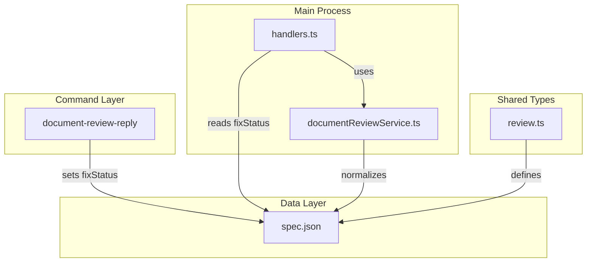
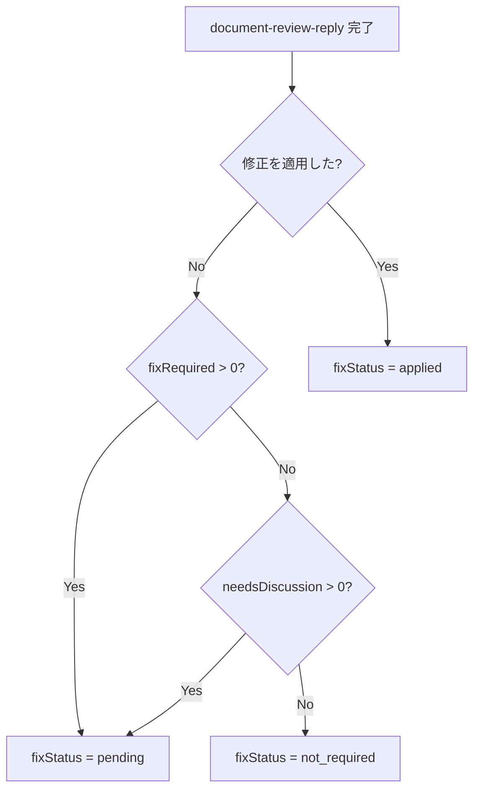
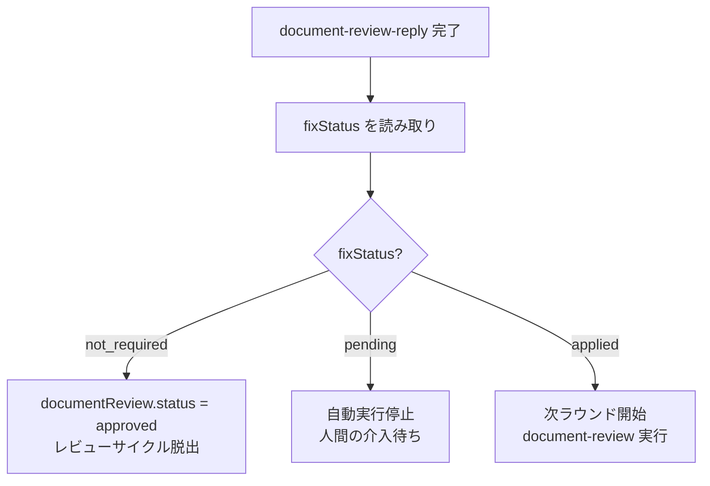
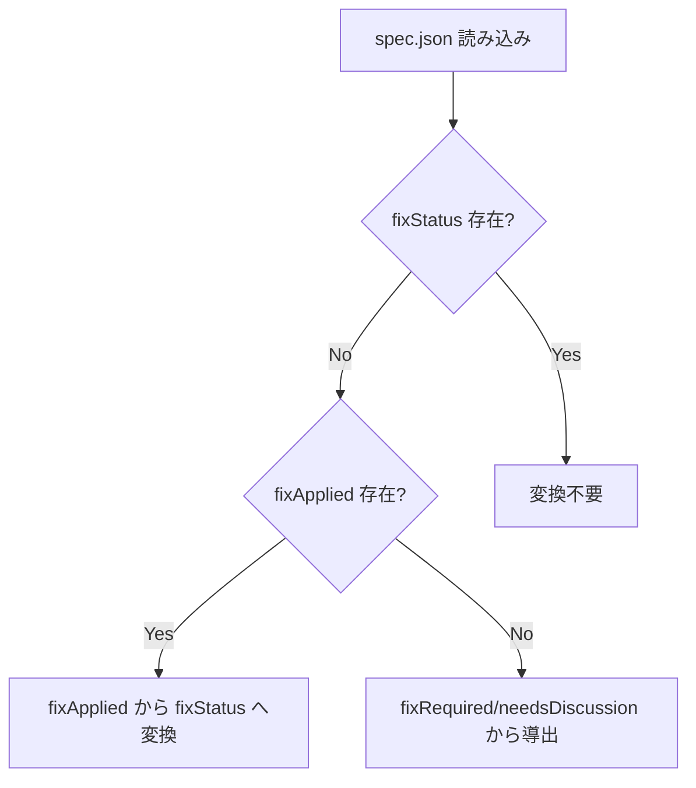

# Design: fix-status-field-migration

## Overview

**Purpose**: `RoundDetail` の `fixApplied: boolean` フィールドを `fixStatus: 'not_required' | 'pending' | 'applied'` の3値フィールドに統合し、Document Review後の次アクション判定を明確化する。

**Users**: 自動実行ループ（Electronハンドラ）、document-review-replyコマンド（Claude）、開発者（型定義参照）

**Impact**: 既存の `fixApplied` フィールドを廃止し、新しい `fixStatus` フィールドに移行。既存データは読み込み時に遅延移行される。

### Goals

- 3つの状態（次プロセスへ進む、停止、再レビュー）を明確に区別
- 自動実行ループの判定ロジックをシンプル化
- 後方互換性の維持（遅延移行による既存データサポート）

### Non-Goals

- `documentReview.status` フィールドの廃止
- 一括移行スクリプトの作成
- UI表示の変更（既存UIは新フィールドを解釈して表示）

## Architecture

### Existing Architecture Analysis

現在の `RoundDetail` インターフェースは以下の構造を持つ：

```typescript
interface RoundDetail {
  roundNumber: number;
  reviewCompletedAt?: string;
  replyCompletedAt?: string;
  status: RoundStatus;
  fixApplied?: boolean;      // 廃止対象
  fixRequired?: number;
  needsDiscussion?: number;
}
```

**現在の問題点**:
- `fixApplied: boolean` では3つの状態を区別できない
- 自動実行ループで `fixRequired`、`needsDiscussion`、`fixApplied` を組み合わせて判定する必要がある
- 判定ロジックが複雑化し、エッジケースでの動作が不明確

### Architecture Pattern & Boundary Map



**Architecture Integration**:
- **Selected pattern**: スキーママイグレーション（遅延移行）
- **Domain boundaries**: 型定義（shared）、サービス（main）、コマンド（commands）
- **Existing patterns preserved**: documentReviewService の normalizeRoundDetail パターン
- **Steering compliance**: DRY（判定ロジックの一元化）、KISS（3値による明示的な状態表現）

### Technology Stack

| Layer | Choice / Version | Role in Feature | Notes |
|-------|------------------|-----------------|-------|
| Types | TypeScript 5.8+ | 型定義 | `FixStatus` 型追加、`RoundDetail` 更新 |
| Services | Node.js (Electron main) | 遅延移行ロジック | `normalizeRoundDetail` 拡張 |
| Commands | Markdown templates | fixStatus 設定ロジック | 3箇所のテンプレート更新 |

## System Flows

### fixStatus 判定フロー



### 自動実行ループの判定フロー



### 遅延移行フロー



## Requirements Traceability

| Criterion ID | Summary | Components | Implementation Approach |
|--------------|---------|------------|------------------------|
| 1.1 | RoundDetail に fixStatus フィールド追加 | `review.ts` | 新規フィールド追加 |
| 1.2 | FixStatus 型定義 | `review.ts` | 新規型定義 |
| 1.3 | fixApplied フィールド削除 | `review.ts` | フィールド削除 |
| 2.1 | 修正適用時に applied 設定 | document-review-reply (3箇所) | テンプレート更新 |
| 2.2 | fixRequired/needsDiscussion > 0 で pending 設定 | document-review-reply (3箇所) | テンプレート更新 |
| 2.3 | fixRequired = 0 AND needsDiscussion = 0 で not_required 設定 | document-review-reply (3箇所) | テンプレート更新 |
| 3.1-3.5 | document-review-reply コマンド更新 | document-review-reply (3箇所) | テンプレート更新 |
| 4.1 | not_required で approved 設定 | `handlers.ts` | 判定ロジック更新 |
| 4.2 | pending で停止 | `handlers.ts` | 判定ロジック更新 |
| 4.3 | applied で新ラウンド開始 | `handlers.ts` | 判定ロジック更新 |
| 4.4 | handlers.ts 判定ロジック更新 | `handlers.ts` | 既存ロジック置換 |
| 5.1 | fixApplied: true → applied 変換 | `documentReviewService.ts` | normalizeRoundDetail 拡張 |
| 5.2 | fixApplied: false + counts > 0 → pending 変換 | `documentReviewService.ts` | normalizeRoundDetail 拡張 |
| 5.3 | fixApplied: undefined + counts = 0 → not_required 変換 | `documentReviewService.ts` | normalizeRoundDetail 拡張 |
| 5.4 | normalizeRoundDetail メソッド実装 | `documentReviewService.ts` | 既存メソッド拡張 |
| 6.1 | FixStatus 型を review.ts に追加 | `review.ts` | 新規型定義 |
| 6.2 | RoundDetail インターフェース更新 | `review.ts` | インターフェース更新 |
| 6.3 | fixApplied フィールド削除 | `review.ts` | フィールド削除 |
| 6.4 | 関連テストファイル更新 | テストファイル | テスト更新 |
| 7.1 | skill-reference.md 更新 | `skill-reference.md` | ドキュメント更新 |
| 7.2 | コマンドテンプレート更新 | document-review-reply (3箇所) | テンプレート更新 |

### Coverage Validation Checklist

- [x] Every criterion ID from requirements.md appears in the table above
- [x] Each criterion has specific component names (not generic references)
- [x] Implementation approach distinguishes reuse existing vs new implementation
- [x] User-facing criteria specify concrete components

## Components and Interfaces

### Component Summary

| Component | Domain/Layer | Intent | Req Coverage | Key Dependencies | Contracts |
|-----------|--------------|--------|--------------|------------------|-----------|
| `FixStatus` type | shared/types | 3値の修正状態を表現 | 1.2, 6.1 | - | Type |
| `RoundDetail` interface | shared/types | ラウンド詳細の型定義 | 1.1, 1.3, 6.2, 6.3 | FixStatus | Type |
| `normalizeRoundDetail` | main/services | 遅延移行ロジック | 5.1-5.4 | RoundDetail | Service |
| `handlers.ts` | main/ipc | 自動実行判定ロジック | 4.1-4.4 | documentReviewService | Service |
| document-review-reply | commands | fixStatus 設定 | 2.1-2.3, 3.1-3.5 | spec.json | Command |

### Shared Types Layer

#### FixStatus Type

| Field | Detail |
|-------|--------|
| Intent | Document Review後の次アクション状態を3値で表現 |
| Requirements | 1.2, 6.1 |

**Type Definition**:

```typescript
/**
 * Fix status for document review rounds
 * - 'not_required': No fixes or discussion needed, proceed to next process
 * - 'pending': Fixes or discussion needed, pause execution
 * - 'applied': Fixes applied, re-review required
 */
export type FixStatus = 'not_required' | 'pending' | 'applied';
```

#### RoundDetail Interface (Updated)

| Field | Detail |
|-------|--------|
| Intent | 1ラウンドの詳細情報を保持 |
| Requirements | 1.1, 1.3, 6.2, 6.3 |

**Updated Interface**:

```typescript
export interface RoundDetail {
  /** Round number (1-indexed) */
  roundNumber: number;
  /** Timestamp when review agent completed */
  reviewCompletedAt?: string;
  /** Timestamp when reply agent completed */
  replyCompletedAt?: string;
  /** Status of this round */
  status: RoundStatus;
  /** Fix status determining next action */
  fixStatus?: FixStatus;
  /** Number of "Fix Required" items in this round's reply */
  fixRequired?: number;
  /** Number of "Needs Discussion" items in this round's reply */
  needsDiscussion?: number;
}
```

**Removed Field**: `fixApplied?: boolean`

### Main Process Layer

#### normalizeRoundDetail Method (Extended)

| Field | Detail |
|-------|--------|
| Intent | 既存データを新スキーマに遅延移行 |
| Requirements | 5.1, 5.2, 5.3, 5.4 |

**Responsibilities & Constraints**:
- `fixApplied` フィールドが存在する場合、`fixStatus` に変換
- `fixStatus` が既に存在する場合は変換しない
- 変換後も `fixRequired`、`needsDiscussion` の値は保持

**Migration Logic**:

```typescript
private normalizeRoundDetail(
  detail: Record<string, unknown>,
  index: number
): RoundDetail | null {
  // ... existing normalization logic ...

  // Legacy migration: fixApplied -> fixStatus
  if (detail.fixStatus === undefined) {
    if (detail.fixApplied === true) {
      normalized.fixStatus = 'applied';
    } else if (
      (normalized.fixRequired ?? 0) > 0 ||
      (normalized.needsDiscussion ?? 0) > 0
    ) {
      normalized.fixStatus = 'pending';
    } else if (
      normalized.fixRequired === 0 &&
      normalized.needsDiscussion === 0
    ) {
      normalized.fixStatus = 'not_required';
    }
  } else {
    normalized.fixStatus = detail.fixStatus as FixStatus;
  }

  return normalized;
}
```

**Dependencies**:
- Inbound: `mergeRoundDetails` - ラウンド詳細のマージ (P0)

**Contracts**: Service [x]

##### Service Interface

```typescript
interface NormalizeRoundDetailService {
  normalizeRoundDetail(
    detail: Record<string, unknown>,
    index: number
  ): RoundDetail | null;
}
```

- Preconditions: `detail` は少なくとも `roundNumber` または `round` または有効な `index` を持つ
- Postconditions: 正規化された `RoundDetail` を返す。無効な場合は `null`
- Invariants: `fixStatus` と `fixApplied` が両方存在する場合、`fixStatus` を優先

#### handlers.ts Auto-Execution Logic (Updated)

| Field | Detail |
|-------|--------|
| Intent | fixStatus に基づいて次アクションを決定 |
| Requirements | 4.1, 4.2, 4.3, 4.4 |

**Updated Logic**:

```typescript
// After document-review-reply completion
const latestRound = roundDetails[roundDetails.length - 1];
const fixStatus = latestRound?.fixStatus;

switch (fixStatus) {
  case 'not_required':
    // Set documentReview.status = 'approved' and exit review cycle
    coordinator.handleDocumentReviewCompleted(specPath, true);
    break;

  case 'pending':
    // Pause execution (waiting for --fix or human intervention)
    coordinator.handleDocumentReviewCompleted(specPath, false);
    break;

  case 'applied':
    // Start new document-review round
    if (currentRoundNumber < MAX_DOCUMENT_REVIEW_ROUNDS) {
      coordinator.continueDocumentReviewLoop(specPath, currentRoundNumber + 1);
    } else {
      coordinator.handleDocumentReviewCompleted(specPath, false);
    }
    break;

  default:
    // Fallback: use legacy logic for undefined fixStatus
    // (handled by normalizeRoundDetail during read)
    break;
}
```

**Dependencies**:
- Inbound: auto-execution loop - Agent完了イベント (P0)
- Outbound: documentReviewService - spec.json読み取り (P0)
- Outbound: AutoExecutionCoordinator - 次アクション実行 (P0)

**Contracts**: Service [x]

### Command Layer

#### document-review-reply Templates (3 locations)

| Field | Detail |
|-------|--------|
| Intent | fixStatus を正しく設定する |
| Requirements | 2.1, 2.2, 2.3, 3.1-3.5 |

**Updated Schema in Templates**:

```json
{
  "roundNumber": n,
  "status": "reply_complete",
  "fixStatus": "not_required | pending | applied",
  "fixRequired": <number>,
  "needsDiscussion": <number>
}
```

**fixStatus Determination Rules**:

| Mode | Condition | fixStatus |
|------|-----------|-----------|
| `--autofix` | 修正を適用した | `applied` |
| `--autofix` | fixRequired = 0, needsDiscussion = 0 | `not_required` |
| `--fix` | 修正を適用した | `applied` |
| Default | fixRequired > 0 OR needsDiscussion > 0 | `pending` |
| Default | fixRequired = 0 AND needsDiscussion = 0 | `not_required` |

**Files to Update**:
1. `.claude/commands/kiro/document-review-reply.md`
2. `electron-sdd-manager/resources/templates/commands/spec-manager/document-review-reply.md`
3. `electron-sdd-manager/resources/templates/commands/document-review/document-review-reply.md`

## Data Models

### Domain Model

**Aggregate**: `DocumentReviewState`

**Entity Changes**:

| Field | Before | After | Migration |
|-------|--------|-------|-----------|
| `fixApplied` | `boolean \| undefined` | 削除 | 遅延移行で `fixStatus` に変換 |
| `fixStatus` | 存在しない | `FixStatus \| undefined` | 新規追加 |

**Invariants**:
- `fixStatus` が設定されている場合、`fixApplied` は無視される
- `fixRequired` と `needsDiscussion` は記録として維持される

### Logical Data Model

**spec.json Structure (documentReview.roundDetails)**:

```json
{
  "documentReview": {
    "status": "pending | in_progress | approved | skipped",
    "currentRound": 1,
    "roundDetails": [
      {
        "roundNumber": 1,
        "status": "reply_complete",
        "reviewCompletedAt": "2026-01-16T00:00:00Z",
        "replyCompletedAt": "2026-01-16T01:00:00Z",
        "fixStatus": "applied",
        "fixRequired": 2,
        "needsDiscussion": 0
      }
    ]
  }
}
```

**Migration Mapping**:

| Legacy State | New fixStatus |
|--------------|---------------|
| `fixApplied: true` | `applied` |
| `fixApplied: false`, counts > 0 | `pending` |
| `fixApplied: undefined`, counts > 0 | `pending` |
| `fixApplied: undefined`, counts = 0 | `not_required` |

## Error Handling

### Error Categories and Responses

**Data Validation Errors**:
- Invalid `fixStatus` value → Log warning, use `pending` as safe default
- Missing `roundNumber` → Skip entry with warning log

**Migration Errors**:
- Conflicting `fixApplied` and `fixStatus` → Prioritize `fixStatus`
- Malformed `roundDetails` → Normalize individual entries, skip invalid ones

### Monitoring

- Log level: `debug` for migration conversions
- Log level: `warn` for skipped invalid entries
- Metric: Count of legacy migrations performed (optional)

## Testing Strategy

### Unit Tests

1. **FixStatus Type Tests** (`review.ts`)
   - Verify type accepts only valid values
   - Verify type inference in RoundDetail

2. **normalizeRoundDetail Tests** (`documentReviewService.test.ts`)
   - `fixApplied: true` → `fixStatus: 'applied'`
   - `fixApplied: false`, counts > 0 → `fixStatus: 'pending'`
   - `fixApplied: undefined`, counts = 0 → `fixStatus: 'not_required'`
   - `fixStatus` already present → preserve original
   - Both `fixApplied` and `fixStatus` present → prioritize `fixStatus`

3. **handlers.ts Decision Logic Tests**
   - `fixStatus: 'not_required'` → approved flow
   - `fixStatus: 'pending'` → pause flow
   - `fixStatus: 'applied'` → continue loop flow
   - `fixStatus: undefined` → fallback behavior

### Integration Tests

1. **End-to-End Document Review Flow**
   - `--autofix` with fixes → `fixStatus: 'applied'` → new round starts
   - No fixes needed → `fixStatus: 'not_required'` → approved
   - Discussion needed → `fixStatus: 'pending'` → paused

2. **Legacy Data Migration**
   - Read spec.json with `fixApplied` → returns normalized `fixStatus`
   - Sync does not overwrite user-set `fixStatus`

### E2E Tests

1. **Auto-Execution Loop** (`auto-execution-document-review.e2e.spec.ts`)
   - Verify loop behavior with new `fixStatus` values
   - Verify backward compatibility with legacy data

## Design Decisions

### DD-001: 3値の fixStatus フィールド採用

| Field | Detail |
|-------|--------|
| Status | Accepted |
| Context | `fixApplied: boolean` では3つの状態（次へ進む、停止、再レビュー）を区別できない |
| Decision | `fixStatus: 'not_required' \| 'pending' \| 'applied'` の3値を採用 |
| Rationale | 状態が明示的になり、自動実行ループの判定ロジックがシンプルになる |
| Alternatives Considered | (1) `fixApplied` + `needsAction` の2フィールド → 冗長、(2) 数値enum → 可読性低下 |
| Consequences | 既存データの移行が必要、テンプレート3箇所の更新が必要 |

### DD-002: 遅延移行パターンの採用

| Field | Detail |
|-------|--------|
| Status | Accepted |
| Context | 既存の `fixApplied` フィールドを持つspec.jsonが存在する |
| Decision | 読み込み時に自動変換する遅延移行を採用 |
| Rationale | 一括移行スクリプトは実行漏れリスクがある。古いspecを開いたときに自然に移行される |
| Alternatives Considered | (1) 一括移行スクリプト → 実行漏れリスク、(2) 両フィールド併存 → 複雑化 |
| Consequences | `normalizeRoundDetail` メソッドの拡張が必要 |

### DD-003: fixRequired/needsDiscussion の維持

| Field | Detail |
|-------|--------|
| Status | Accepted |
| Context | `--autofix` 後に `fixRequired` の値をどうするか |
| Decision | 元の値を維持（記録として） |
| Rationale | 「元々いくつFixが必要だったか」の情報は監査・デバッグに有用 |
| Alternatives Considered | (1) 0にリセット → 履歴情報の喪失 |
| Consequences | fixStatus と counts が独立して存在することになる |

### DD-004: needsDiscussion > 0 を pending 扱い

| Field | Detail |
|-------|--------|
| Status | Accepted |
| Context | `needsDiscussion > 0` の場合、自動実行をどうするか |
| Decision | `pending` 扱いとし、自動実行を停止 |
| Rationale | 議論が必要な項目は人間の判断が必要。自動で進めるべきではない |
| Alternatives Considered | (1) 警告のみで続行 → 議論なしで進む危険性 |
| Consequences | Discussion項目があると自動実行が停止する |

### DD-005: fixStatus 優先の競合解決

| Field | Detail |
|-------|--------|
| Status | Accepted |
| Context | 移行期間中、`fixApplied` と `fixStatus` が両方存在する可能性がある |
| Decision | `fixStatus` が存在する場合は `fixApplied` を無視 |
| Rationale | 新しいスキーマが優先。古いフィールドは後方互換性のみ |
| Alternatives Considered | (1) エラーとする → 厳格すぎる、(2) マージ → 複雑化 |
| Consequences | 両フィールドが存在してもエラーにならない |
