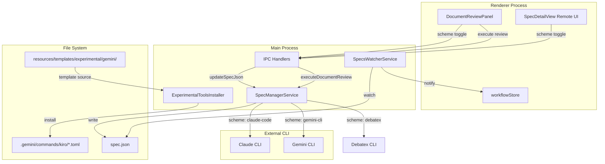
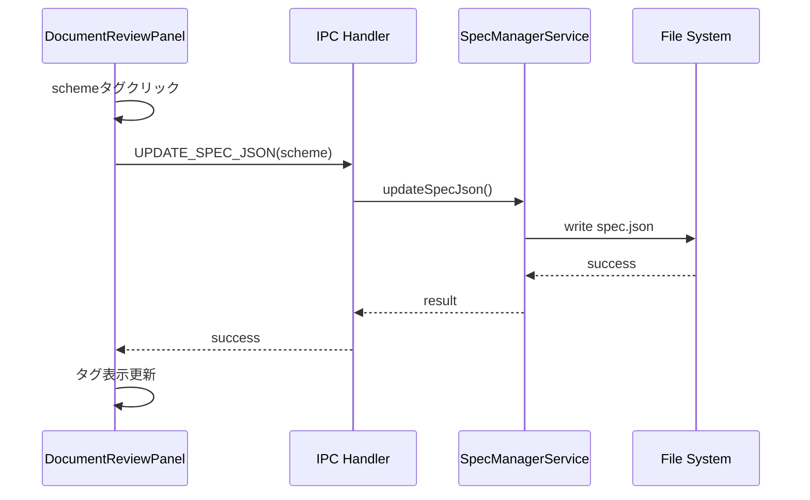
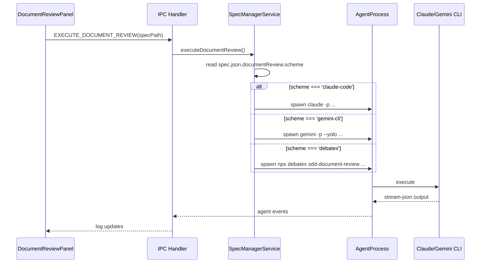

# Technical Design: Gemini CLI Document Review Integration

## Overview

**Purpose**: 本機能はSDD Orchestratorのドキュメントレビューワークフローに Gemini CLI サポートを追加し、ユーザーがClaude CodeとGemini CLIを切り替えてドキュメントレビューを実行できるようにする。

**Users**: プロジェクト開発者がドキュメントレビュー実行時に、プロジェクトやコスト要件に応じてAIツールを選択する。

**Impact**: 既存のDocumentReviewPanelにscheme切り替え機能を追加し、spec.jsonにscheme設定を永続化する。

### Goals
- Gemini CLI Custom CommandsをTOML形式で「実験的ツール」メニューからインストール可能にする
- DocumentReviewPanelでscheme（Claude/Gemini/Debatex）の表示・ドロップダウン選択を実現する
- scheme設定に基づいて適切なCLIを起動してレビューを実行する
- Remote UIでもscheme表示・切り替えを可能にする
- 複数レビューエンジンの拡張性を確保する（エンジン定義の集約）

### Non-Goals
- Gemini CLI / debatexのインストール・セットアップ支援
- Gemini APIキーの管理
- 現在サポートする3エンジン（claude-code, gemini-cli, debatex）以外のCLIツールサポート
- レビュー結果の品質比較・評価機能
- マルチターン実行（Resume機能）のサポート

## Architecture

### Existing Architecture Analysis

**現在のドキュメントレビュー実行フロー**:
1. DocumentReviewPanelで「レビュー開始」ボタンをクリック
2. IPC (`EXECUTE_DOCUMENT_REVIEW`) 経由でmainプロセスに通知
3. SpecManagerServiceが `claude -p /kiro:document-review {feature}` を実行
4. AgentProcessがClaude CLI出力をストリーミング
5. LogParserServiceがJSONL出力をパースしてUI更新

**拡張ポイント**:
- spec.jsonの `documentReview` オブジェクトに `scheme` フィールドを追加
- SpecManagerServiceでschemeに基づいてCLI選択を分岐
- DocumentReviewPanelにschemeタグUIを追加

### Architecture Pattern & Boundary Map



**Architecture Integration**:
- Selected pattern: 既存IPCパターンの拡張
- Domain boundaries: DocumentReview設定はspec.jsonに集約、CLIプロバイダ選択はSpecManagerServiceが担当
- Existing patterns preserved: ExperimentalToolsInstallerパターン、spec.json更新パターン
- New components rationale: GeminiCliProviderを追加してCLI差異を吸収
- Steering compliance: DRY（既存パターン再利用）、SSOT（schemeはspec.jsonのみ）

### Technology Stack

| Layer | Choice / Version | Role in Feature | Notes |
|-------|------------------|-----------------|-------|
| Frontend | React 19 + TypeScript | scheme切り替えUI | 既存DocumentReviewPanel拡張 |
| IPC | Electron IPC | scheme更新・レビュー実行 | 既存チャンネル利用 |
| Backend | Node.js 20 | CLIプロセス起動・管理 | SpecManagerService拡張 |
| CLI | Gemini CLI 0.23+ | レビュー実行 | `--output-format stream-json --yolo` |
| CLI | debatex (npx) | レビュー実行 | `npx debatex sdd-document-review` |
| Template | TOML | Gemini Custom Commands | `@{path}`, `{{args}}` プレースホルダ |

## System Flows

### scheme切り替えフロー



### レビュー実行フロー（scheme分岐）



## Requirements Traceability

| Criterion ID | Summary | Components | Implementation Approach |
|--------------|---------|------------|------------------------|
| 1.1 | 実験的ツールメニューにGemini項目追加 | menu.ts, experimentalToolsInstallerService.ts | 既存メニュー構造に項目追加 |
| 1.2 | document-review.tomlインストール | ExperimentalToolsInstallerService | installGeminiDocumentReview()メソッド新規実装 |
| 1.3 | document-review-reply.tomlインストール | ExperimentalToolsInstallerService | 同上、2ファイル同時インストール |
| 1.4 | .gemini/commands/kiro/ディレクトリ自動作成 | ExperimentalToolsInstallerService | mkdir recursive処理 |
| 1.5 | 既存ファイル上書き確認ダイアログ | IPC Handlers, App.tsx | 既存パターン（force確認）を流用 |
| 1.6 | Forceオプション | ExperimentalToolsInstallerService | InstallOptions.force対応 |
| 1.7 | インストール成功通知 | notificationStore | notify.success()呼び出し |
| 1.8 | インストール失敗通知 | notificationStore | notify.error()呼び出し |
| 2.1 | document-review.tomlテンプレート存在 | resources/templates/experimental/gemini/kiro/ | 新規ファイル作成 |
| 2.2 | document-review-reply.tomlテンプレート存在 | resources/templates/experimental/gemini/kiro/ | 新規ファイル作成 |
| 2.3 | TOML形式準拠 | テンプレートファイル | description, promptフィールド定義 |
| 2.4 | {{args}}でフィーチャー名受け取り | テンプレートファイル | Gemini CLI仕様に準拠 |
| 2.5 | document-review-reply.toml形式 | テンプレートファイル | 同様のTOML形式 |
| 2.6 | 既存document-review.mdと同等機能 | テンプレートファイル | プロンプト内容を移植 |
| 3.1 | spec.jsonにschemeフィールド追加 | documentReview.ts型定義 | DocumentReviewState型拡張 |
| 3.2 | scheme値は'claude-code'または'gemini-cli' | documentReview.ts型定義 | ReviewerScheme型定義 |
| 3.3 | schemeデフォルト値'claude-code' | documentReview.ts, SpecManagerService | 未指定時のフォールバック処理 |
| 3.4 | SpecsWatcherServiceでscheme読み込み | specsWatcherService.ts | 既存spec.json監視ロジックで対応 |
| 3.5 | scheme変更のUI反映 | workflowStore, DocumentReviewPanel | 既存storeイベント経由 |
| 4.1 | schemeタグ表示 | DocumentReviewPanel | ヘッダー領域にタグコンポーネント追加 |
| 4.2 | Claude/Geminiラベル表示 | DocumentReviewPanel | schemeに応じたラベル切り替え |
| 4.3 | タグ色のscheme別区別 | DocumentReviewPanel | Tailwind CSSクラス分岐 |
| 4.4 | デフォルトClaudeタグ表示 | DocumentReviewPanel | scheme未設定時のフォールバック |
| 5.1 | タグクリックでドロップダウン表示・エンジン選択 | DocumentReviewPanel, SchemeSelector | ドロップダウンメニューコンポーネント実装 |
| 5.2 | 切り替え後spec.json即時更新 | IPC Handler, FileService | UPDATE_SPEC_JSON呼び出し |
| 5.3 | 切り替え後タグ表示即時更新 | DocumentReviewPanel | ローカルstate + store同期 |
| 5.4 | エラー時通知とUI復元 | DocumentReviewPanel, notificationStore | try-catch + 状態ロールバック |
| 5.5 | IPC経由でmainプロセスに依頼 | IPC Handler | 既存UPDATE_SPEC_JSONチャンネル利用 |
| 6.1 | scheme: claude-codeでClaude CLI実行 | SpecManagerService, ReviewEngineRegistry | 既存ロジック維持 |
| 6.2 | scheme: gemini-cliでGemini CLI実行 | SpecManagerService, ReviewEngineRegistry | buildGeminiArgs()新規実装 |
| 6.3 | scheme: debatexでdebatex CLI実行 | SpecManagerService, ReviewEngineRegistry | buildDebatexArgs()新規実装 |
| 6.4 | Gemini CLI --yoloフラグ付与 | ReviewEngineRegistry | 引数配列に追加 |
| 6.5 | Gemini CLI --output-format stream-json | ReviewEngineRegistry | 引数配列に追加 |
| 6.6 | Gemini CLI JSONL出力パース | LogParserService | 既存パーサー活用（JSONL形式共通） |
| 6.7 | 各CLI未検出時エラー表示 | SpecManagerService, notificationStore | spawn error処理 |
| 6.8 | scheme未設定時Claude Codeデフォルト | ReviewEngineRegistry | nullish coalescing |
| 7.1 | Remote UIでschemeタグ表示 | SpecDetailView | schemeタグコンポーネント追加 |
| 7.2 | Remote UIでタグクリック切り替え | SpecDetailView | onClickハンドラ実装 |
| 7.3 | API経由でメインプロセスに送信 | WebSocketApiClient | 既存updateSpecJson API利用 |
| 7.4 | 他クライアントへのリアルタイム同期 | webSocketHandler, SpecsWatcherService | 既存同期メカニズム活用 |
| 8.1 | 自動実行時scheme設定尊重 | AutoExecutionCoordinator | schemeをexecuteDocumentReviewに渡す |
| 8.2 | 並列実行時各spec個別scheme尊重 | AutoExecutionCoordinator | spec単位でscheme取得 |
| 8.3 | scheme変更は他specに影響しない | spec.json構造 | spec単位の独立したschemeフィールド |
| 9.1 | 3エンジン定義 | ReviewEngineRegistry | REVIEW_ENGINES定数定義 |
| 9.2 | エンジン設定の集約 | ReviewEngineRegistry | ReviewEngineConfig型でcommand, args, outputFormat等を定義 |
| 9.3 | 新規エンジン追加の最小変更 | ReviewEngineRegistry, documentReview.ts | エンジン定義追加 + 型拡張のみ |
| 9.4 | 動的メニュー生成 | SchemeSelector | REVIEW_ENGINES.keys()からメニュー項目生成 |
| 9.5 | 未知scheme時のフォールバック | ReviewEngineRegistry | getEngine()でDEFAULT_REVIEWER_SCHEMEを返す |

### Coverage Validation Checklist

- [x] Every criterion ID from requirements.md appears in the table above
- [x] Each criterion has specific component names
- [x] Implementation approach distinguishes "reuse existing" vs "new implementation"
- [x] User-facing criteria specify concrete UI components

## Components and Interfaces

| Component | Domain/Layer | Intent | Req Coverage | Key Dependencies | Contracts |
|-----------|--------------|--------|--------------|------------------|-----------|
| ExperimentalToolsInstallerService | Main/Service | Gemini TOMLテンプレートインストール | 1.1-1.8, 2.1-2.6 | fs/promises, resourcePaths | Service |
| DocumentReviewPanel | Renderer/UI | schemeタグ表示・ドロップダウン選択 | 4.1-4.4, 5.1-5.5 | workflowStore, IPC, SchemeSelector | State |
| SchemeSelector | Renderer/UI | エンジン選択ドロップダウンコンポーネント | 5.1, 9.4 | ReviewEngineRegistry | - |
| SpecDetailView | Remote-UI/View | Remote UIでのscheme操作 | 7.1-7.4 | WebSocketApiClient | State |
| SpecManagerService | Main/Service | scheme別CLI起動 | 6.1-6.8, 8.1-8.3 | AgentProcess, ReviewEngineRegistry | Service |
| ReviewEngineRegistry | Shared/Registry | エンジン定義の集約・取得 | 9.1-9.5 | - | - |
| documentReview.ts | Shared/Types | scheme型定義 | 3.1-3.3 | - | - |

### Main Process / Service

#### ExperimentalToolsInstallerService (拡張)

| Field | Detail |
|-------|--------|
| Intent | Gemini CLI用document-reviewコマンドをプロジェクトにインストールする |
| Requirements | 1.1, 1.2, 1.3, 1.4, 1.5, 1.6, 1.7, 1.8, 2.1, 2.2, 2.3, 2.4, 2.5, 2.6 |

**Responsibilities & Constraints**
- Gemini CLIテンプレートファイルをプロジェクトにコピー
- `.gemini/commands/kiro/` ディレクトリの自動作成
- 既存ファイル存在時の上書き制御

**Dependencies**
- Inbound: IPC Handlers - インストールリクエスト受信 (P0)
- Outbound: fs/promises - ファイル書き込み (P0)
- External: resourcePaths - テンプレートパス取得 (P0)

**Contracts**: Service [x]

##### Service Interface
```typescript
interface ExperimentalToolsInstallerService {
  /**
   * Gemini CLI document-review コマンドをインストール
   * @param projectPath - プロジェクトルートパス
   * @param options - インストールオプション (force: boolean)
   * @returns インストール結果またはエラー
   */
  installGeminiDocumentReview(
    projectPath: string,
    options?: InstallOptions
  ): Promise<Result<InstallResult, InstallError>>;

  /**
   * Gemini document-review ファイルの存在確認
   * @param projectPath - プロジェクトルートパス
   * @returns 存在確認結果
   */
  checkGeminiDocumentReviewExists(
    projectPath: string
  ): Promise<CheckResult>;
}
```
- Preconditions: projectPathが有効なディレクトリ、テンプレートファイルが存在
- Postconditions: `.gemini/commands/kiro/document-review.toml` と `document-review-reply.toml` が作成される
- Invariants: 既存ファイルはforceオプションなしでは上書きしない

**Implementation Notes**
- Integration: 既存の `installDebugAgent()` パターンを踏襲
- Validation: テンプレートパス存在確認、書き込み権限確認
- Risks: テンプレートファイル欠損時のエラーハンドリング

#### SpecManagerService (拡張)

| Field | Detail |
|-------|--------|
| Intent | scheme設定に基づいて適切なCLIでドキュメントレビューを実行する |
| Requirements | 6.1, 6.2, 6.3, 6.7, 6.8, 8.1, 8.2, 8.3 |

**Responsibilities & Constraints**
- spec.jsonからscheme設定を読み取り
- ReviewEngineRegistryを使用してCLIコマンド・引数を取得
- CLIプロセスを起動してレビュー実行

**Dependencies**
- Inbound: IPC Handlers - executeDocumentReview呼び出し (P0)
- Outbound: AgentProcess - CLIプロセス起動 (P0)
- Outbound: ReviewEngineRegistry - エンジン設定取得 (P0)
- External: Claude/Gemini/Debatex CLI - レビュー実行 (P0)

**Contracts**: Service [x]

##### Service Interface
```typescript
interface SpecManagerService {
  /**
   * ドキュメントレビューを実行
   * @param specPath - specディレクトリパス
   * @param scheme - 使用するCLI (未指定時はspec.jsonから取得、なければclaude-code)
   */
  executeDocumentReview(
    specPath: string,
    scheme?: ReviewerScheme
  ): Promise<Result<AgentInfo, AgentError>>;
}
```
- Preconditions: specPathが存在、対応するCLIがインストール済み
- Postconditions: レビュー結果ファイルが生成される
- Invariants: scheme未設定時はclaude-codeにフォールバック

**Implementation Notes**
- Integration: 既存の `executeDocumentReview()` を拡張、ReviewEngineRegistryを利用
- Validation: CLI存在確認、spawn error時のエラーメッセージ
- Risks: CLI未インストール環境での適切なエラー表示

### Shared / Registry

#### ReviewEngineRegistry (新規)

| Field | Detail |
|-------|--------|
| Intent | 複数レビューエンジンの設定を集約し、拡張性を提供する |
| Requirements | 9.1, 9.2, 9.3, 9.4, 9.5, 6.4, 6.5 |

**Responsibilities & Constraints**
- 各エンジンの設定（コマンド、引数、出力形式、ラベル、色）を定義
- エンジン定義からコマンド引数を構築
- 未知のscheme値に対するフォールバック処理

**Dependencies**
- Inbound: SpecManagerService - エンジン設定取得 (P0)
- Inbound: SchemeSelector - エンジン一覧取得 (P0)
- Outbound: なし

**Contracts**: Registry [x]

##### Registry Interface
```typescript
/**
 * ドキュメントレビューで使用するCLIスキーム
 */
export type ReviewerScheme = 'claude-code' | 'gemini-cli' | 'debatex';

/**
 * レビューエンジンの設定
 */
export interface ReviewEngineConfig {
  /** 表示ラベル */
  label: string;
  /** タグの色クラス (Tailwind) */
  colorClass: string;
  /** コマンド（文字列または配列） */
  command: string | string[];
  /** 引数構築関数 */
  buildArgs: (featureName: string) => string[];
  /** 出力形式 */
  outputFormat: 'jsonl' | 'text';
}

/**
 * レビューエンジンレジストリ
 */
export const REVIEW_ENGINES: Record<ReviewerScheme, ReviewEngineConfig> = {
  'claude-code': {
    label: 'Claude',
    colorClass: 'bg-blue-100 text-blue-800',
    command: 'claude',
    buildArgs: (featureName) => ['-p', `/kiro:document-review ${featureName}`],
    outputFormat: 'jsonl',
  },
  'gemini-cli': {
    label: 'Gemini',
    colorClass: 'bg-purple-100 text-purple-800',
    command: 'gemini',
    buildArgs: (featureName) => [
      '-p', `/kiro:document-review ${featureName}`,
      '--yolo',
      '--output-format', 'stream-json'
    ],
    outputFormat: 'jsonl',
  },
  'debatex': {
    label: 'Debatex',
    colorClass: 'bg-green-100 text-green-800',
    command: ['npx', 'debatex'],
    buildArgs: (featureName) => ['sdd-document-review', featureName],
    outputFormat: 'text',
  },
};

/**
 * エンジン設定を取得（未知のschemeはデフォルトにフォールバック）
 */
export function getReviewEngine(scheme?: ReviewerScheme): ReviewEngineConfig;

/**
 * 利用可能なエンジン一覧を取得
 */
export function getAvailableEngines(): Array<{
  scheme: ReviewerScheme;
  label: string;
  colorClass: string;
}>;
```
- Preconditions: なし
- Postconditions: 有効なReviewEngineConfigが返される
- Invariants: 未知のschemeはDEFAULT_REVIEWER_SCHEMEにフォールバック

**Implementation Notes**
- Integration: SpecManagerServiceとSchemeSelectorの両方から利用
- Validation: scheme値のバリデーションはgetReviewEngine内で実施
- Risks: 新規エンジン追加時の型定義漏れ（TypeScriptで検出可能）

### Renderer / UI

#### DocumentReviewPanel (拡張)

| Field | Detail |
|-------|--------|
| Intent | schemeタグを表示し、ドロップダウンで切り替えを可能にする |
| Requirements | 4.1, 4.2, 4.3, 4.4, 5.1, 5.2, 5.3, 5.4, 5.5 |

**Responsibilities & Constraints**
- schemeタグのUI表示（ヘッダー領域）
- SchemeSelectorを使用したドロップダウン表示
- エラー時のUIロールバック

**Dependencies**
- Inbound: WorkflowView - コンポーネント呼び出し (P0)
- Outbound: IPC - spec.json更新 (P0)
- Outbound: SchemeSelector - ドロップダウンコンポーネント (P0)
- External: notificationStore - 通知表示 (P1)

**Contracts**: State [x]

##### State Management
```typescript
interface DocumentReviewPanelProps {
  // 既存props...
  /** 現在のscheme設定 */
  scheme?: ReviewerScheme;
  /** scheme変更ハンドラ */
  onSchemeChange?: (scheme: ReviewerScheme) => void;
}

// Internal state
const [optimisticScheme, setOptimisticScheme] = useState<ReviewerScheme>();
const [isSelectorOpen, setIsSelectorOpen] = useState(false);
```
- State model: propsからscheme受け取り、楽観的更新用のローカルstate保持
- Persistence: spec.jsonに永続化（IPC経由）
- Concurrency: 楽観的更新 + エラー時ロールバック

**Implementation Notes**
- Integration: ヘッダー領域の右側（autoExecutionFlagの左）にschemeタグを配置
- Validation: scheme変更時のIPC呼び出し成否確認
- Risks: ネットワーク遅延時のUI同期ずれ

#### SchemeSelector (新規)

| Field | Detail |
|-------|--------|
| Intent | エンジン選択ドロップダウンを提供する再利用可能コンポーネント |
| Requirements | 5.1, 9.4 |

**Responsibilities & Constraints**
- ReviewEngineRegistryからエンジン一覧を取得してメニュー項目を生成
- 現在のschemeを選択状態で表示
- 選択時にonChange コールバックを呼び出し

**Dependencies**
- Inbound: DocumentReviewPanel, SpecDetailView - コンポーネント利用 (P0)
- Outbound: ReviewEngineRegistry - エンジン一覧取得 (P0)

**Contracts**: Component [x]

##### Component Interface
```typescript
interface SchemeSelectorProps {
  /** 現在のscheme */
  currentScheme: ReviewerScheme;
  /** 選択変更時のコールバック */
  onChange: (scheme: ReviewerScheme) => void;
  /** 無効状態 */
  disabled?: boolean;
}
```

**Implementation Notes**
- Integration: DocumentReviewPanelとSpecDetailViewの両方から利用
- Validation: なし（ReviewEngineRegistryがバリデーション済み）
- Risks: なし

#### SpecDetailView (拡張) - Remote UI

| Field | Detail |
|-------|--------|
| Intent | Remote UIでschemeタグを表示・切り替え可能にする |
| Requirements | 7.1, 7.2, 7.3, 7.4 |

**Responsibilities & Constraints**
- schemeタグのUI表示
- WebSocket API経由でのscheme更新

**Dependencies**
- Inbound: App.tsx - ルーティング (P0)
- Outbound: WebSocketApiClient - spec.json更新 (P0)

**Contracts**: State [x]

**Implementation Notes**
- Integration: ヘッダー領域にschemeタグコンポーネントを追加
- Validation: WebSocket接続状態確認
- Risks: 接続断時の操作不可

### Shared / Types

#### documentReview.ts (拡張)

| Field | Detail |
|-------|--------|
| Intent | scheme型定義とデフォルト値を提供する |
| Requirements | 3.1, 3.2, 3.3 |

```typescript
/**
 * ドキュメントレビューで使用するCLIスキーム
 */
export type ReviewerScheme = 'claude-code' | 'gemini-cli' | 'debatex';

/**
 * デフォルトのスキーム
 */
export const DEFAULT_REVIEWER_SCHEME: ReviewerScheme = 'claude-code';

/**
 * Document review state stored in spec.json
 */
export interface DocumentReviewState {
  /** Overall review status */
  status: ReviewStatus;
  /** Current round number if review is in progress */
  currentRound?: number;
  /** Details for each round */
  roundDetails?: RoundDetail[];
  /** Reviewer CLI scheme (default: claude-code) */
  scheme?: ReviewerScheme;
}
```

### Template Files

#### document-review.toml

| Field | Detail |
|-------|--------|
| Intent | Gemini CLI用のdocument-reviewコマンドテンプレート |
| Requirements | 2.1, 2.3, 2.4, 2.6 |

**Location**: `resources/templates/experimental/gemini/kiro/document-review.toml`

```toml
description = "Review spec documents for consistency, gaps, and alignment with steering"

prompt = '''
# Spec Document Review

Review specification documents for consistency, identify contradictions, gaps, and ambiguities, then generate a comprehensive report.

**Output Language**: Follow the language configuration in GEMINI.md or the project's default language.

## Target Feature

{{args}}

## Documents to Review

@{.kiro/specs/{{args}}/requirements.md}
@{.kiro/specs/{{args}}/design.md}
@{.kiro/specs/{{args}}/tasks.md}
@{.kiro/steering/product.md}
@{.kiro/steering/tech.md}
@{.kiro/steering/structure.md}

## Instructions

1. Analyze the spec documents for consistency
2. Check requirements-design-tasks alignment
3. Identify gaps and ambiguities
4. Verify steering compliance
5. Generate report to `.kiro/specs/{{args}}/document-review-{n}.md`

Determine the review number by finding existing document-review-*.md files.
'''
```

#### document-review-reply.toml

| Field | Detail |
|-------|--------|
| Intent | Gemini CLI用のdocument-review-reply コマンドテンプレート |
| Requirements | 2.2, 2.3, 2.5, 2.6 |

**Location**: `resources/templates/experimental/gemini/kiro/document-review-reply.toml`

```toml
description = "Reply to document review issues and classify responses"

prompt = '''
# Document Review Reply

Analyze the latest document review report and generate a structured reply.

## Target Feature

{{args}}

## Review Report

@{.kiro/specs/{{args}}/document-review-*.md}

## Instructions

1. Read the latest document-review-{n}.md file
2. For each issue, provide a response with classification:
   - Fix Required: Issue needs to be fixed
   - Accepted: Acknowledged, will be addressed
   - Deferred: Out of scope for now
   - Needs Discussion: Requires human decision
3. Generate reply to `.kiro/specs/{{args}}/document-review-{n}-reply.md`
'''
```

## Data Models

### Domain Model

**spec.json documentReview オブジェクト拡張**:

```typescript
interface SpecJson {
  // 既存フィールド...
  documentReview?: {
    status: ReviewStatus;
    currentRound?: number;
    roundDetails?: RoundDetail[];
    scheme?: ReviewerScheme;  // 新規追加
  };
}
```

**ビジネスルール**:
- `scheme` 未指定時は `'claude-code'` として扱う
- `scheme` の変更は他のフィールド（status, roundDetails等）に影響しない
- 各specは独立した `scheme` 設定を持つ

### Logical Data Model

**spec.json スキーマ変更**:

| Field | Type | Required | Default | Description |
|-------|------|----------|---------|-------------|
| documentReview.scheme | string | No | 'claude-code' | 'claude-code' \| 'gemini-cli' \| 'debatex' |

**後方互換性**:
- 既存のspec.jsonに `scheme` フィールドがない場合、読み込み時に `'claude-code'` をデフォルト値として扱う
- 明示的にフィールドを追加するのは、ユーザーがschemeを切り替えた時のみ

## Error Handling

### Error Strategy

| Error Type | Detection | Response | Recovery |
|------------|-----------|----------|----------|
| CLI未インストール | spawn ENOENT | エラー通知表示、Claudeへフォールバック提案 | ユーザーがCLIインストール |
| テンプレート欠損 | fs.access失敗 | エラー通知表示 | アプリ再インストール |
| spec.json書き込み失敗 | write error | エラー通知、UI状態ロールバック | 再試行 |
| Rate Limit (Gemini) | API応答 | 警告通知、実行中断 | 時間をおいて再実行 |
| debatex実行エラー | npx exit code | エラー通知表示 | ユーザーがnpm環境確認 |

### Monitoring
- Gemini CLI実行時のエラーはprojectLoggerに記録
- Rate Limitエラーは特別なログレベル（WARN）で記録

## Testing Strategy

### Unit Tests
- `ExperimentalToolsInstallerService.installGeminiDocumentReview()`: テンプレートコピー、ディレクトリ作成、上書き制御
- `ReviewEngineRegistry.getReviewEngine()`: 各schemeに対する正しいconfig取得、未知schemeのフォールバック
- `ReviewEngineRegistry.getAvailableEngines()`: 全エンジン一覧の取得
- `DocumentReviewState` 型ガード: scheme フィールドのバリデーション
- SchemeSelectorコンポーネント: ドロップダウン表示・選択・色分岐

### Integration Tests
- scheme切り替え→spec.json更新→UI反映の一連のフロー
- Gemini CLIインストール→コマンド実行の統合テスト
- Remote UI経由のscheme切り替え
- debatexエンジンでのレビュー実行

### E2E Tests
- 「実験的ツール」メニューからのGeminiコマンドインストール
- DocumentReviewPanelでのschemeドロップダウン選択
- scheme: gemini-cliでのドキュメントレビュー実行
- scheme: debatexでのドキュメントレビュー実行

## Design Decisions

### DD-001: ExperimentalToolsInstallerService の拡張

| Field | Detail |
|-------|--------|
| Status | Accepted |
| Context | Gemini CLIコマンドのインストール機能をどこに実装するか |
| Decision | 既存のExperimentalToolsInstallerServiceにメソッドを追加する |
| Rationale | 「実験的ツール」カテゴリの一貫性を維持し、既存のテンプレート管理・IPC・メニュー統合パターンを再利用できる。コード変更量を最小化しつつ、新機能を追加できる。 |
| Alternatives Considered | 1. 新規GeminiInstallerServiceを作成 - 責務は明確になるが重複コードが発生 |
| Consequences | サービスの責務が若干広がるが、機能の性質（実験的ツール）から許容範囲。将来Geminiコマンドが増えた場合は分離を検討。 |

### DD-002: scheme フィールドの配置

| Field | Detail |
|-------|--------|
| Status | Accepted |
| Context | reviewerのscheme情報をspec.jsonのどこに保持するか |
| Decision | `documentReview.scheme` として既存オブジェクトに追加する |
| Rationale | ドキュメントレビューに関する設定は `documentReview` オブジェクトに集約すべき（関心の分離）。既存の `documentReview.status`, `documentReview.roundDetails` と同じ階層で一貫性を維持。 |
| Alternatives Considered | 1. `reviewerScheme` としてルートレベルに追加 - ドキュメントレビュー以外の用途も想定するなら適切だが、現時点では過剰 2. `autoExecution.documentReviewScheme` に追加 - 自動実行専用の印象を与え、手動実行時の設定として不自然 |
| Consequences | 後方互換性のためデフォルト値処理が必要。型定義の更新時に `scheme?: ReviewerScheme` を追加。 |

### DD-003: ReviewEngineRegistry による拡張性確保

| Field | Detail |
|-------|--------|
| Status | Accepted |
| Context | 複数CLIのコマンド構築方法と拡張性 |
| Decision | ReviewEngineRegistryにエンジン定義を集約し、buildArgs関数を各エンジンに持たせる |
| Rationale | 各CLI（Claude/Gemini/debatex）のフラグ体系が異なるため、エンジン定義オブジェクトに設定を集約。新規エンジン追加時は定義追加と型拡張のみで対応可能。UIメニューも定義から動的生成できる。 |
| Alternatives Considered | 1. 各CLI用の個別buildXxxArgs()関数を作成 - 拡張時にコード変更箇所が分散 2. Strategy Patternでクラス化 - 現時点ではオーバーエンジニアリング |
| Consequences | 設定と実装の分離により拡張性向上。ただし各エンジンの出力形式差異はLogParserService側で別途対応が必要。 |

### DD-004: schemeタグUIとドロップダウン選択

| Field | Detail |
|-------|--------|
| Status | Accepted |
| Context | DocumentReviewPanelでのscheme切り替えUIをどのように実装するか |
| Decision | schemeタグをクリックするとドロップダウンメニューが表示され、エンジン一覧から選択できる |
| Rationale | 2値トグルではなく3つ以上のエンジンをサポートするため、ドロップダウン形式が適切。タグクリックでメニュー表示は直感的で、既存UIパターン（コンテキストメニュー）と一貫性がある。 |
| Alternatives Considered | 1. ラジオボタングループ - スペースを取りすぎる 2. セレクトボックス - タグデザインとの調和が難しい |
| Consequences | SchemeSelectorコンポーネントを新規作成。DocumentReviewPanelとSpecDetailViewで共通利用可能。 |

### DD-005: 各CLI出力形式への対応

| Field | Detail |
|-------|--------|
| Status | Accepted |
| Context | 各CLIの出力形式をどのようにパースするか |
| Decision | 既存のLogParserServiceを活用し、outputFormat設定に応じてパース方式を切り替える |
| Rationale | Claude CLIとGemini CLIは共にJSONL形式で出力するため、基本的なパースロジックは共通。debatexはテキスト出力のため別処理。ReviewEngineConfigのoutputFormatフィールドでパース方式を判定。 |
| Alternatives Considered | 1. 各CLI専用のLogParserServiceを作成 - 重複コードが大量発生 2. 完全な抽象化層を導入 - 現時点ではオーバーエンジニアリング |
| Consequences | outputFormatに応じた条件分岐が必要。将来的にCLIが増えた場合はAdapter Patternへのリファクタリングを検討。 |

### DD-006: debatex エンジンの実行方式

| Field | Detail |
|-------|--------|
| Status | Accepted |
| Context | debatexの実行方式をどうするか |
| Decision | `npx debatex sdd-document-review {featureName}` で実行する |
| Rationale | npx経由で実行することでグローバルインストール不要。debatexはドキュメントレビュー専用CLIとして設計されており、sdd-document-reviewサブコマンドでspec文書をレビューする。 |
| Alternatives Considered | 1. グローバルインストール前提 - ユーザー環境依存が増える 2. プロジェクトローカルインストール前提 - 不要な依存追加 |
| Consequences | npx実行のため初回起動がやや遅い。node_modulesキャッシュがあれば2回目以降は高速。 |
