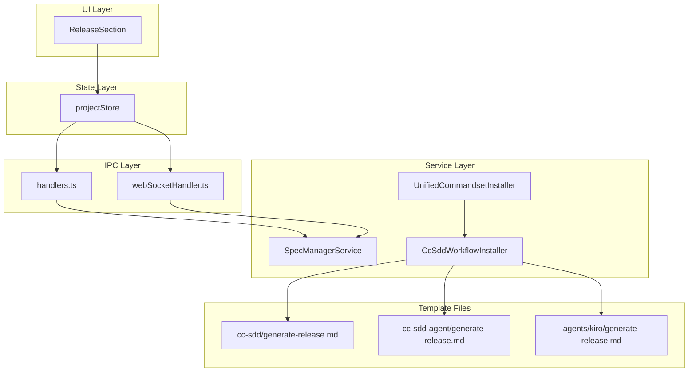

# Design: Generate Release Command

## Overview

**Purpose**: `steering-release` コマンド/エージェントを `generate-release` にリネームし、全プロファイル（cc-sdd, cc-sdd-agent, spec-manager）でインストールされるようにする。これにより命名の一貫性を改善し、release.md 生成機能をすべてのユーザーに提供する。

**Users**: SDD Orchestrator を使用する開発者が、プロファイルに関わらず release.md 生成機能を利用できる。

**Impact**: 既存の `steering-release` コマンドを `generate-release` にリネームし、spec-manager プロファイルにも展開する。UI ラベルや機能自体は変更なし。

### Goals

- `steering-release` を `generate-release` にリネームし、命名の一貫性を確保
- 全プロファイル（cc-sdd, cc-sdd-agent, spec-manager）で generate-release をインストール対象に追加
- 既存の UI（ReleaseSection）と IPC 連携が引き続き正常に動作すること
- ドキュメント（skill-reference.md）の更新

### Non-Goals

- release.md の必須バリデーション化
- ReleaseSection UI の機能追加・変更
- release.md テンプレートの内容変更
- 新規機能の追加（純粋なリネーム+プロファイル追加のみ）

## Architecture

### Existing Architecture Analysis

本機能は既存の `steering-release` 実装を `generate-release` にリネームする純粋なリファクタリングである。以下の既存コンポーネントに変更を加える：

**テンプレートファイル群**:
- `resources/templates/commands/cc-sdd/steering-release.md` → `generate-release.md`
- `resources/templates/commands/cc-sdd-agent/steering-release.md` → `generate-release.md`
- `resources/templates/agents/kiro/steering-release.md` → `generate-release.md`

**IPC/通信レイヤー**:
- `ipc/handlers.ts`: `generateReleaseMd` ハンドラ内の `/kiro:steering-release` を `/kiro:generate-release` に変更
- `webSocketHandler.ts`: コメントのみ更新（機能変更なし）

**ストア**:
- `projectStore.ts`: コメントのみ更新（機能変更なし）

**インストーラー**:
- `ccSddWorkflowInstaller.ts`: `CC_SDD_COMMANDS` に `generate-release` を追加
- `unifiedCommandsetInstaller.ts`: spec-manager 用の installCommandset で generate-release を含める

### Architecture Pattern & Boundary Map



**Architecture Integration**:
- **Selected pattern**: 既存パターン維持（変更なし）
- **Domain/feature boundaries**: コマンドインストーラーの責務範囲内での変更
- **Existing patterns preserved**: IPC 通信、テンプレートベースのコマンドインストール
- **New components rationale**: 新規コンポーネントなし（ファイルリネームのみ）
- **Steering compliance**: DRY 原則に従い、cc-sdd のテンプレートを spec-manager でも共有

### Technology Stack

| Layer | Choice / Version | Role in Feature | Notes |
|-------|------------------|-----------------|-------|
| Templates | Markdown | コマンド/エージェント定義 | ファイル名変更のみ |
| Backend | TypeScript / Node.js | IPC ハンドラ、インストーラー | コード内参照更新 |

## Requirements Traceability

| Criterion ID | Summary | Components | Implementation Approach |
|--------------|---------|------------|------------------------|
| 1.1 | `kiro:steering-release` を `kiro:generate-release` にリネーム | `handlers.ts`, `CC_SDD_COMMANDS` | 既存コードの文字列置換 |
| 1.2 | エージェントファイル `steering-release.md` を `generate-release.md` にリネーム | `resources/templates/agents/kiro/` | ファイルリネーム |
| 1.3 | テンプレートファイルをリネーム | `resources/templates/commands/cc-sdd/`, `resources/templates/commands/cc-sdd-agent/` | ファイルリネーム |
| 1.4 | コード内の参照を更新 | `handlers.ts`, `webSocketHandler.ts`, `projectStore.ts`, `ccSddWorkflowInstaller.ts` | 文字列置換 |
| 1.5 | UI ラベル（ReleaseSection）は変更不要 | `ReleaseSection.tsx` | 変更なし（確認のみ） |
| 2.1 | 全プロファイルでインストール対象に追加 | `ccSddWorkflowInstaller.ts`, `unifiedCommandsetInstaller.ts` | `CC_SDD_COMMANDS` に追加、spec-manager インストールロジック更新 |
| 2.2 | spec-manager 用テンプレートは cc-sdd のものを参照 | `unifiedCommandsetInstaller.ts` | cc-sdd テンプレートを共有 |
| 2.3 | バリデーション必須チェックには追加しない | `projectChecker.ts` | 変更なし（オプショナル維持） |
| 3.1 | `generateReleaseMd` 関数内のコマンドを更新 | `handlers.ts` | `/kiro:steering-release` → `/kiro:generate-release` |
| 3.2 | webSocketHandler の releaseHandlers を更新 | `webSocketHandler.ts` | コメント更新（機能変更なし） |
| 3.3 | 既存 UI が正常に動作すること | `ReleaseSection.tsx`, `projectStore.ts` | 動作確認テスト |
| 4.1 | skill-reference.md を更新 | `.kiro/steering/skill-reference.md` | `steering-release` → `generate-release` |
| 4.2 | CLAUDE.md に言及があれば更新 | `CLAUDE.md` | 確認・必要に応じて更新 |

### Coverage Validation Checklist

- [x] Every criterion ID from requirements.md appears in the table above
- [x] Each criterion has specific component names (not generic references)
- [x] Implementation approach distinguishes "reuse existing" vs "new implementation"
- [x] User-facing criteria specify concrete UI components

## Components and Interfaces

### Component Summary

| Component | Domain/Layer | Intent | Req Coverage | Key Dependencies | Contracts |
|-----------|--------------|--------|--------------|------------------|-----------|
| generate-release.md (cc-sdd) | Template | cc-sdd 用コマンド定義 | 1.3 | - | - |
| generate-release.md (cc-sdd-agent) | Template | cc-sdd-agent 用コマンド定義 | 1.3 | - | - |
| generate-release.md (agent) | Template | エージェント定義 | 1.2 | - | - |
| handlers.ts | IPC | release.md 生成 IPC ハンドラ | 1.1, 1.4, 3.1 | SpecManagerService (P0) | Service |
| webSocketHandler.ts | WebSocket | Remote UI 用 release ハンドラ | 1.4, 3.2 | WorkflowController (P0) | Service |
| ccSddWorkflowInstaller.ts | Service | コマンドインストール | 1.4, 2.1 | - | Service |
| unifiedCommandsetInstaller.ts | Service | プロファイル別インストール | 2.1, 2.2 | CcSddWorkflowInstaller (P0) | Service |
| skill-reference.md | Steering | コマンドリファレンス | 4.1 | - | - |

### IPC Layer

#### handlers.ts - GENERATE_RELEASE_MD Handler

| Field | Detail |
|-------|--------|
| Intent | release.md 生成エージェントを起動する IPC ハンドラ |
| Requirements | 1.1, 1.4, 3.1 |

**Responsibilities & Constraints**
- `/kiro:generate-release` コマンドでエージェントを起動
- specId='' でプロジェクトエージェントとして起動
- 起動結果を Renderer に返却

**Dependencies**
- Inbound: Renderer Process via IPC (P0)
- Outbound: SpecManagerService — エージェント起動 (P0)

**Contracts**: Service [x]

##### Service Interface

```typescript
// handlers.ts 内の既存ハンドラ（変更箇所のみ）
// Line ~2479: slashCommand の値を変更
const slashCommand = '/kiro:generate-release';  // Before: '/kiro:steering-release'
```

**Implementation Notes**
- Integration: 既存の IPC ハンドラ内の文字列を置換
- Validation: 起動結果のエラーハンドリングは既存のまま
- Risks: なし（純粋な文字列置換）

### Service Layer

#### ccSddWorkflowInstaller.ts

| Field | Detail |
|-------|--------|
| Intent | cc-sdd コマンドセットの定義とインストール |
| Requirements | 1.4, 2.1 |

**Responsibilities & Constraints**
- `CC_SDD_COMMANDS` 配列に `generate-release` を追加
- `CC_SDD_AGENTS` 配列に `generate-release` を追加（steering-release から置換）

**Contracts**: Service [x]

##### Service Interface

```typescript
// CC_SDD_COMMANDS に追加
export const CC_SDD_COMMANDS = [
  // ... existing commands ...
  // Steering (3) - steering-verification を追加、steering-release を generate-release にリネーム
  'steering',
  'steering-custom',
  'steering-verification',
  'generate-release',  // NEW: Renamed from steering-release
  // ... rest of commands ...
] as const;

// CC_SDD_AGENTS に追加
export const CC_SDD_AGENTS = [
  // ... existing agents ...
  'steering-verification',
  'generate-release',  // NEW: Renamed from steering-release
  // ... rest of agents ...
] as const;
```

**Implementation Notes**
- Integration: 配列への要素追加と既存要素のリネーム
- Validation: TypeScript の型チェックで整合性を確保
- Risks: なし

#### unifiedCommandsetInstaller.ts

| Field | Detail |
|-------|--------|
| Intent | プロファイル別のコマンドセットインストール |
| Requirements | 2.1, 2.2 |

**Responsibilities & Constraints**
- spec-manager プロファイルで generate-release をインストール対象に含める
- cc-sdd のテンプレートを参照してインストール

**Contracts**: Service [x]

##### Service Interface

```typescript
// installCommandset メソッド内の spec-manager ケース
case 'spec-manager': {
  // ... existing code ...
  // generate-release は cc-sdd-agent テンプレートを使用
  // installCommands の templateProfile パラメータで cc-sdd-agent を指定
}
```

**Implementation Notes**
- Integration: spec-manager インストール時に generate-release コマンドを含める
- Validation: インストール結果で成功/スキップを確認
- Risks: なし（既存パターンの拡張）

### Template Files

#### generate-release.md (Commands)

| Field | Detail |
|-------|--------|
| Intent | release.md 生成用 Slash Command 定義 |
| Requirements | 1.3 |

**Responsibilities & Constraints**
- ファイルリネームのみ（内容変更なし）
- cc-sdd と cc-sdd-agent で同一内容を維持

**Implementation Notes**
- リネーム: `steering-release.md` → `generate-release.md`
- 旧ファイル削除: `steering-release.md` を削除

#### generate-release.md (Agent)

| Field | Detail |
|-------|--------|
| Intent | release.md 生成用エージェント定義 |
| Requirements | 1.2 |

**Responsibilities & Constraints**
- ファイルリネームのみ
- エージェント名を `steering-release-agent` から `generate-release-agent` に変更

**Implementation Notes**
- リネーム: `steering-release.md` → `generate-release.md`
- 内容更新: frontmatter の `name` フィールドを更新
- 旧ファイル削除: `steering-release.md` を削除

## Data Models

本機能はデータモデルの変更を含まない（ファイルリネームとコード参照更新のみ）。

## Error Handling

### Error Strategy

既存のエラーハンドリングを維持。新たなエラーシナリオは発生しない。

### Error Categories and Responses

**User Errors**: なし（コマンド名変更のみでユーザー入力への影響なし）
**System Errors**: なし（既存の IPC エラーハンドリングで対応）

## Testing Strategy

### Unit Tests

1. **ccSddWorkflowInstaller.test.ts**: `CC_SDD_COMMANDS` に `generate-release` が含まれることを確認
2. **unifiedCommandsetInstaller.test.ts**: spec-manager プロファイルで generate-release がインストールされることを確認
3. **projectStore.test.ts**: `generateReleaseMd` が正常に呼び出せることを確認

### Integration Tests

1. **handlers.ts**: `GENERATE_RELEASE_MD` ハンドラが `/kiro:generate-release` でエージェントを起動することを確認
2. **unifiedCommandsetInstaller**: 全プロファイルで generate-release がインストールされることを確認

### E2E/UI Tests

1. **ReleaseSection**: ボタンクリックで release.md 生成が開始されることを確認
2. **ProjectValidationPanel**: ReleaseSection が正常に表示されることを確認

## Design Decisions

### DD-001: コマンド名を `generate-release` に変更

| Field | Detail |
|-------|--------|
| Status | Accepted |
| Context | `steering-release` という名前が実態と乖離している。steering ファイル（`.kiro/steering/`）を作成するのではなく、コマンドファイル（`.claude/commands/`）を作成するため |
| Decision | `kiro:steering-release` を `kiro:generate-release` にリネーム |
| Rationale | `generate-*` は生成系コマンドとして直感的。`steering-verification` は実際に steering ファイルを作成するが、本コマンドはコマンドを生成するため、接頭辞を変更 |
| Alternatives Considered | 1. `create-release`（却下: create は新規作成のニュアンスが強い）<br>2. `release-command`（却下: 既存の命名規則と整合しない） |
| Consequences | 既存ユーザーは新しいコマンド名を使用する必要がある。ただし UI ラベルは変更しないため、GUI ユーザーへの影響は最小限 |

### DD-002: spec-manager 用テンプレートの共有

| Field | Detail |
|-------|--------|
| Status | Accepted |
| Context | spec-manager プロファイル専用のテンプレートを作成するか、cc-sdd と共有するかの選択 |
| Decision | cc-sdd のテンプレートを spec-manager でも参照・コピーして使用 |
| Rationale | 内容は同一であり、テンプレートの重複を避けることで DRY 原則を遵守 |
| Alternatives Considered | 1. spec-manager 専用テンプレート作成（却下: 内容が同一のため重複になる） |
| Consequences | テンプレート更新時は cc-sdd のファイルのみ更新すればよい。保守性向上 |

### DD-003: バリデーション対象への追加見送り

| Field | Detail |
|-------|--------|
| Status | Accepted |
| Context | release.md を必須バリデーションに追加するかどうか |
| Decision | 追加しない（オプショナル維持） |
| Rationale | 既存の steering-release-integration spec の Out of Scope に準拠。release.md はプロジェクト固有のワークフローであり、全プロジェクトで必須とは限らない |
| Alternatives Considered | 1. 必須バリデーションに追加（却下: 既存方針に反する、ユーザーに強制しない） |
| Consequences | ReleaseSection での警告表示のみ。インストール状態チェックには影響しない |

## Integration & Deprecation Strategy

### 既存ファイルの修正（Wiring Points）

| File Path | Modification Type | Description |
|-----------|-------------------|-------------|
| `electron-sdd-manager/src/main/ipc/handlers.ts` | Code Update | `/kiro:steering-release` → `/kiro:generate-release` に変更 |
| `electron-sdd-manager/src/main/services/ccSddWorkflowInstaller.ts` | Code Update | `CC_SDD_COMMANDS`, `CC_SDD_AGENTS` に generate-release を追加 |
| `electron-sdd-manager/src/main/services/unifiedCommandsetInstaller.ts` | Code Update | spec-manager インストールロジックに generate-release を含める |
| `.kiro/steering/skill-reference.md` | Doc Update | `steering-release` → `generate-release` に更新 |

### 既存ファイルの削除（Cleanup）

| File Path | Reason |
|-----------|--------|
| `resources/templates/commands/cc-sdd/steering-release.md` | generate-release.md に置換 |
| `resources/templates/commands/cc-sdd-agent/steering-release.md` | generate-release.md に置換 |
| `resources/templates/agents/kiro/steering-release.md` | generate-release.md に置換 |

### ファイル作成（New Files）

| File Path | Copied From |
|-----------|-------------|
| `resources/templates/commands/cc-sdd/generate-release.md` | steering-release.md をリネーム |
| `resources/templates/commands/cc-sdd-agent/generate-release.md` | steering-release.md をリネーム |
| `resources/templates/agents/kiro/generate-release.md` | steering-release.md をリネーム（name フィールド更新） |

### 変更不要なファイル（Confirmation）

- `electron-sdd-manager/src/shared/components/project/ReleaseSection.tsx`: UI ラベルは「release.md を生成」のまま変更不要
- `electron-sdd-manager/src/main/services/projectChecker.ts`: バリデーション必須チェックには追加しない
- `CLAUDE.md`: `generate-release` への言及なし（更新不要）
