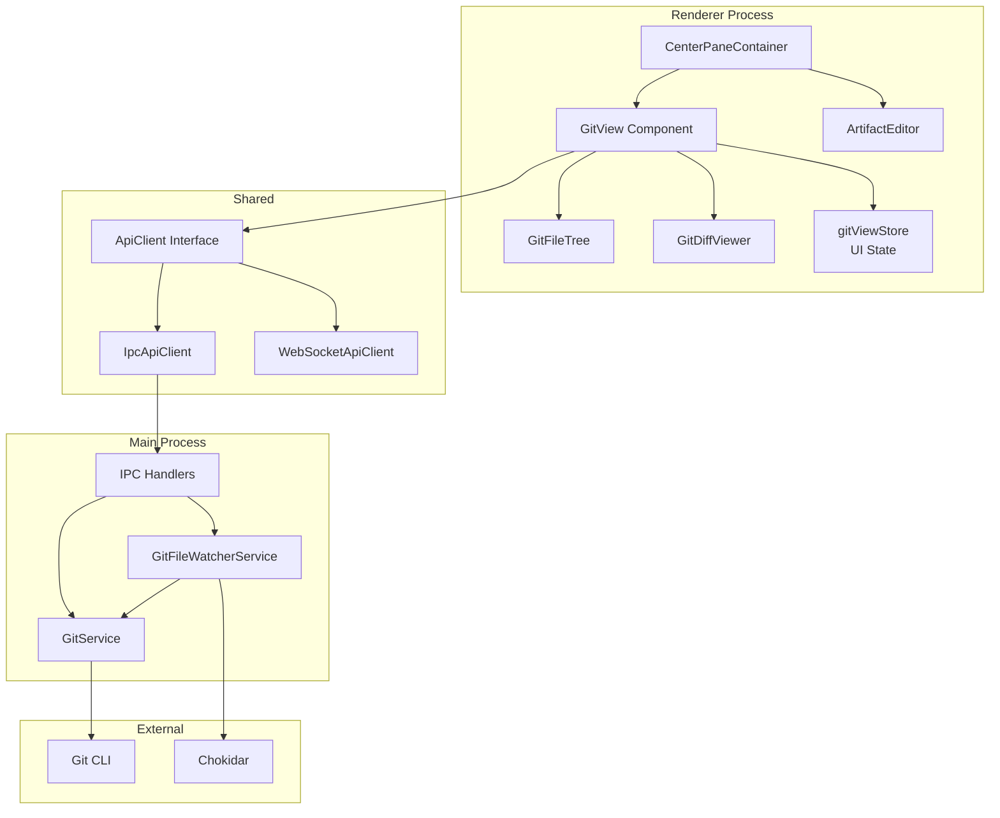
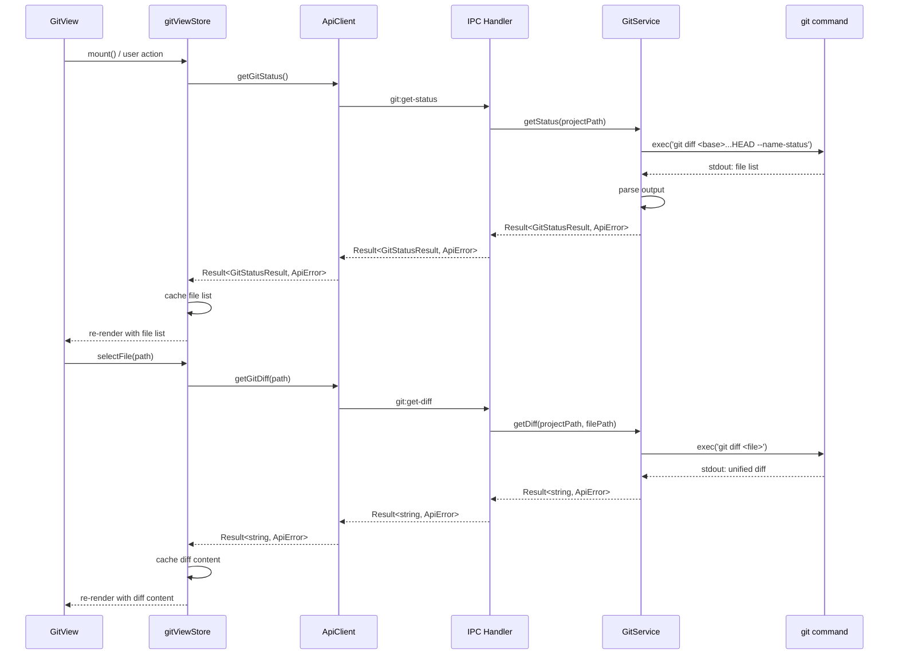
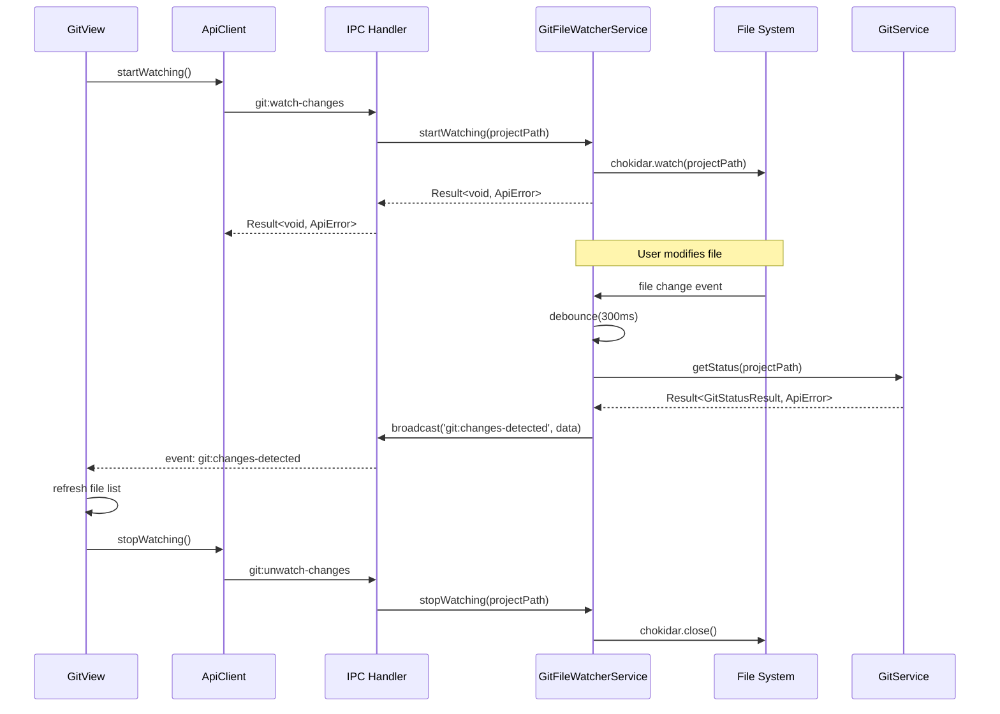
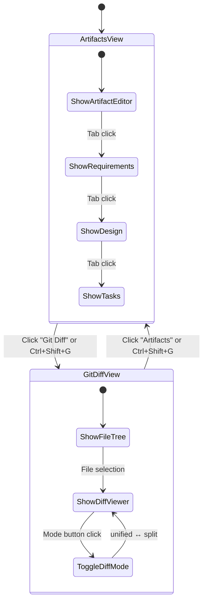

# Design: Git Diff Viewer

## Overview

Git Diff Viewerは、Electronアプリケーション内でgit差分を可視化する機能である。worktreeまたは現在ブランチの変更内容をファイルツリー形式で表示し、シンタックスハイライト付き差分ビューワーで詳細を確認できる。Pull RequestのFiles表示と同等のUXを提供し、コードレビューと変更確認を効率化する。

**ユーザー**: SDD Orchestratorを使用する開発者。worktree環境でのSpec開発時、または通常のブランチ作業時にgit差分を確認する。

**影響**: 既存のSpecPane内部構造を変更する。ArtifactEditorを新設のCenterPaneContainerで包み、GitViewとの排他的切り替えを実現する。既存のレイアウト管理（右ペイン、エージェントリスト）は影響を受けない。

### Goals

- Main Processでgit操作を安全に実行し、Renderer Processにデータを提供する
- File Watch自動監視により、ファイル変更を即座に差分表示に反映する
- シンタックスハイライト付き差分表示（unified/split mode切り替え対応）を実装する
- Remote UI環境でも同等の機能を提供する（WebSocketApiClient経由）
- ArtifactEditorとの排他的切り替えUIを実装する（セグメントボタン + ショートカットキー）

### Non-Goals

- ファイルフィルタリング機能（拡張子、パス名で絞り込み）
- コミット間の差分比較（現状はHEADとの比較のみ）
- 差分から直接ファイル編集する機能
- 差分表示内での検索機能
- 変更行へのコメント機能
- Stageエリアへの追加/削除操作（`git add` / `git reset`）

## Architecture

### Existing Architecture Analysis

SDD Orchestratorは以下のアーキテクチャパターンを採用している：

**Electronプロセス分離モデル**:
- Main Process: Node.js APIへのアクセス、プロセス管理、ファイル監視、IPC
- Renderer Process: React UIコンポーネント、Zustand状態管理、ApiClient経由でのデータ取得

**Domain State vs UI State分離**:
- `shared/stores/`: ビジネスロジック、データモデル（SSOT）
- `renderer/stores/`: UI一時状態（スクロール位置、ダイアログ開閉）

**ApiClient抽象化パターン**:
- `IpcApiClient`: Electron IPC経由（preload + contextBridge）
- `WebSocketApiClient`: WebSocket経由（Remote UI）
- 共有コンポーネント: `shared/components/`でElectron版とRemote UI版の85%以上を共有

**統合点（Integration Points）**:
- SpecPane: 現在ArtifactEditorを直接配置。CenterPaneContainerで包む必要あり
- layoutStore: 右ペイン幅、エージェントリストパネル高さを管理。GitView用の状態追加が必要
- IPC handlers: `main/ipc/handlers.ts`に新規チャンネル追加
- preload: `preload/index.ts`に`window.electronAPI.git.*`追加

**技術的負債への対処**:
- なし（新機能のため既存負債は影響しない）

### Architecture Pattern & Boundary Map

**選択パターン**: Main Process Service + Renderer Store with ApiClient Abstraction

**ドメイン/機能境界**:
- **Main Process Domain**: Git操作、ファイル監視、プロセス間通信
  - `GitService`: git コマンド実行、差分データ取得
  - `GitFileWatcherService`: chokidar による変更検知、debounce処理
- **Renderer Domain**: UI状態管理、ユーザー操作ハンドリング
  - `gitViewStore`: ファイル選択、ツリー展開状態、表示モード
  - `GitView`, `GitFileTree`, `GitDiffViewer`: UI コンポーネント
- **Shared Domain**: プラットフォーム非依存ロジック、API型定義
  - `ApiClient`: IPC/WebSocket抽象化
  - 共有コンポーネント: 将来的にGitView関連を`shared/components/git/`に移行可能

**境界の理由**:
- Electron Process Boundary Rulesに準拠: Node.js APIアクセスはMain、UI状態はRenderer
- Remote UI対応: ApiClient経由でElectron版とWebSocket版の実装を透過的に切り替え
- 並列開発可能性: Main Process Service（Git操作）とRenderer UI（表示）を独立して実装可能

**既存パターンの保持**:
- `shared/stores/`のDomain State管理パターンを継承（git差分データはMainから受信したキャッシュとして保持）
- `ResizeHandle`コンポーネント再利用（既存のSpecPane/BugPaneと同じパターン）
- IPC Result<T, E>型を使用した一貫性のあるエラーハンドリング

**Steeringコンプライアンス**:
- structure.md: Electron Process Boundary Rules遵守（Main Processがステート保持、Rendererはキャッシュ）
- design-principles.md: 根本的解決（場当たり的なRenderer内git実行ではなく、正しいプロセス分離）
- tech.md: Remote UI対応設計（WebSocketApiClient拡張）



### Technology Stack

| Layer | Choice / Version | Role in Feature | Notes |
|-------|------------------|-----------------|-------|
| **Frontend** | React 19 | UI コンポーネント構築 | 既存スタック、変更なし |
| **Frontend** | react-diff-view 3.x | git差分表示コンポーネント | 新規追加。refractor統合が必要 |
| **Frontend** | refractor 4.x | シンタックスハイライト（Prism-based） | 新規追加。react-diff-viewの推奨ライブラリ |
| **Frontend** | Zustand 4.x | gitViewStore状態管理 | 既存スタック、新規store追加 |
| **Backend** | Node.js 20+ (Electron 35) | Main Processランタイム | 既存スタック、変更なし |
| **Backend** | child_process.spawn | git コマンド実行 | Node.js標準モジュール。シェルインジェクション対策のため配列引数使用 |
| **Backend** | chokidar 5.x | ファイルシステム監視 | 既存スタック（SSH機能で使用中）。GitFileWatcherServiceで再利用 |
| **Messaging** | Electron IPC (invoke/handle) | Renderer ↔ Main 通信 | 既存パターン。git操作用の新規チャンネル追加 |
| **Messaging** | WebSocket (ws) | Remote UI通信 | 既存スタック。WebSocketApiClient拡張 |

**技術選定の根拠**:
- **react-diff-view**: GitHub標準の差分表示と同等のUXを提供。refractorとの統合でシンタックスハイライト対応。Web Worker対応で大規模差分のパフォーマンス確保。詳細は`research.md`参照。
- **refractor**: Prismベースの軽量シンタックスハイライトライブラリ。200+言語対応。react-diff-viewの推奨統合ライブラリ。
- **chokidar**: クロスプラットフォーム対応の高性能ファイル監視。プロジェクト内で既に使用中。debounceは独自実装が必要。

## System Flows

### Git差分データ取得フロー



**フロー上の設計決定**:
- Renderer → ApiClient → IPC → Main Service の一方向フロー（逆方向なし）
- Result<T, E>型で一貫性のあるエラーハンドリング
- Rendererはキャッシュのみ保持、真実の情報源はMainのgit実行結果

### File Watch自動更新フロー



**フロー上の設計決定**:
- File Watch開始/停止はGitViewのライフサイクルに連動
- Debounce処理は300ms（連続イベントを集約）
- 変更検知時、MainからRendererへブロードキャスト（複数ウィンドウ対応）
- エラー時もブロードキャストでUI側が適切に処理

### GitView UI切り替えフロー



**状態遷移の設計決定**:
- CenterPaneContainerレベルで排他的切り替え（2つのビューは同時表示されない）
- 切り替え状態はlayoutStoreで永続化
- ショートカットキー（Ctrl+Shift+G）でトグル動作

## Requirements Traceability

| Criterion ID | Summary | Components | Implementation Approach |
|--------------|---------|------------|------------------------|
| 1.1 | worktree/通常ブランチでのgit差分取得 | GitService | 新規実装。`git diff <base>...HEAD --name-status`（worktree）、`git status --porcelain`（通常ブランチ） |
| 1.2 | ファイル選択時の差分取得 | GitService | 新規実装。`git diff <file-path>` で指定ファイルの差分を取得 |
| 1.3 | gitエラーハンドリング | GitService | 新規実装。Result<T, ApiError>型でエラー返却 |
| 1.4 | worktree分岐元ブランチ自動検出 | GitService | 新規実装。`.git/worktrees/{name}/HEAD` パース + `git worktree list` |
| 1.5 | untracked files差分対応 | GitService | 新規実装。`git add -N` + `git diff` または合成diff生成 |
| 2.1 | chokidarでのファイル監視 | GitFileWatcherService | 新規実装。プロジェクトディレクトリを監視 |
| 2.2 | ファイル変更検知時の差分再取得 | GitFileWatcherService | 新規実装。変更検知 → GitService呼び出し → ブロードキャスト |
| 2.3 | 300ms debounce処理 | GitFileWatcherService | 新規実装。カスタムdebounceユーティリティ |
| 2.4 | GitView非表示時の監視停止 | GitView, GitFileWatcherService | 新規実装。unmount時に`stopWatching()`呼び出し |
| 3.1 | IPCチャンネル提供 | IPC Handlers (main/ipc/handlers.ts) | 新規実装。`git:get-status`, `git:get-diff`, `git:watch-changes`, `git:unwatch-changes` |
| 3.2 | preload経由のAPI公開 | preload/index.ts | 新規実装。`window.electronAPI.git.*` |
| 3.3 | Remote UI対応（WebSocketApiClient） | WebSocketApiClient, webSocketHandler.ts | 新規実装。WebSocket経由で同等のAPIを提供 |
| 4.1 | gitViewStore作成 | renderer/stores/gitViewStore.ts | 新規実装。選択ファイル、ツリー展開状態、差分モード、リサイズ位置を管理 |
| 4.2 | git差分データのキャッシュ保持 | gitViewStore | 新規実装。MainからのResult受信後にキャッシュ |
| 5.1 | CenterPaneContainer実装 | renderer/components/CenterPaneContainer.tsx | 新規実装。セグメントボタン + ArtifactEditor/GitView切り替え |
| 5.2 | セグメントボタンデザイン統一 | CenterPaneContainer | 新規実装。既存UIパターンと統一 |
| 5.3 | Ctrl+Shift+G切り替え | CenterPaneContainer | 新規実装。キーボードイベントリスナー |
| 5.4 | 切り替え状態の永続化 | layoutStore | 既存store拡張。viewMode状態追加 |
| 6.1 | GitView 2カラムレイアウト | renderer/components/GitView.tsx | 新規実装。GitFileTree + ResizeHandle + GitDiffViewer |
| 6.2 | 初回表示時のファイル一覧取得 | GitView | 新規実装。mount時に`apiClient.getGitStatus()`呼び出し |
| 6.3 | File Watch通知受信と再取得 | GitView | 新規実装。`git:changes-detected`イベント購読 |
| 6.4 | gitエラー表示 | GitView | 新規実装。Result<T, E>のエラー時に中央表示 |
| 7.1 | GitFileTree階層ツリー表示 | renderer/components/GitFileTree.tsx | 新規実装。ディレクトリ/ファイルノード、ステータスアイコン |
| 7.2 | ファイルノードクリック時の選択 | GitFileTree | 新規実装。`gitViewStore.setSelectedFile(path)` |
| 7.3 | ディレクトリノードの展開/折りたたみ | GitFileTree | 新規実装。展開状態はgitViewStoreで管理 |
| 7.4 | ファイルリスト空時のメッセージ表示 | GitFileTree | 新規実装。条件分岐で"変更がありません"表示 |
| 7.5 | スクロール対応 | GitFileTree | 新規実装。`overflow-y: auto` |
| 8.1 | GitDiffViewer差分表示 | renderer/components/GitDiffViewer.tsx | 新規実装。react-diff-view + refractor統合 |
| 8.2 | ファイル選択時の差分取得 | GitDiffViewer | 新規実装。`apiClient.getGitDiff(filePath)` |
| 8.3 | 差分モード切り替え（unified/split） | GitDiffViewer | 新規実装。`gitViewStore.setDiffMode(mode)` |
| 8.4 | untracked files全行追加表示 | GitDiffViewer | 新規実装。合成diff生成またはMainからの特殊フォーマット |
| 8.5 | バイナリファイル非表示 | GitDiffViewer | 新規実装。バイナリ検知時にメッセージ表示 |
| 8.6 | diffスクロール対応 | GitDiffViewer | 新規実装。`overflow-y: auto` |
| 9.1 | SpecPaneのCenterPaneContainer置き換え | renderer/components/SpecPane.tsx | 既存変更。`<ArtifactEditor />`を`<CenterPaneContainer />`に変更 |
| 9.2 | 既存レイアウト維持 | SpecPane | 既存維持。RightPane構成は変更なし |
| 9.3 | リサイズハンドル状態管理統合 | layoutStore | 既存store拡張。GitFileTree幅の状態追加 |
| 10.1 | shared/api/types.ts型定義追加 | shared/api/types.ts | 既存拡張。git操作のAPI定義追加 |
| 10.2 | WebSocketApiClient実装追加 | shared/api/WebSocketApiClient.ts | 既存拡張。gitメソッド追加 |
| 10.3 | GitView共有コンポーネント化 | shared/components/git/ | 新規実装。Electron/Remote UI共通化 |
| 10.4 | Remote UI環境のWebSocket経由呼び出し | GitView, WebSocketApiClient | 新規実装。ApiClient経由で透過的に切り替え |
| 11.1 | Ctrl+Shift+G切り替え | CenterPaneContainer | 新規実装。グローバルキーボードリスナー |
| 11.2 | GitView内キーボード操作 | GitFileTree, GitDiffViewer | 新規実装。↑/↓/Enter/Spaceキーハンドリング |
| 12.1 | ファイルツリー仮想スクロール最適化 | GitFileTree | 新規実装。react-windowまたは遅延レンダリング（100件超で有効化） |
| 12.2 | File Watch debounce | GitFileWatcherService | 新規実装。300ms debounce |
| 12.3 | 差分取得の遅延ロード | GitDiffViewer | 新規実装。ファイル選択時のみ取得 |

### Coverage Validation Checklist

- [x] Every criterion ID from requirements.md appears in the table above
- [x] Each criterion has specific component names (not generic references)
- [x] Implementation approach distinguishes "reuse existing" vs "new implementation"
- [x] User-facing criteria specify concrete UI components (not just "shared components")

## Components and Interfaces

### Component Summary

| Component | Domain/Layer | Intent | Req Coverage | Key Dependencies (P0/P1) | Contracts |
|-----------|--------------|--------|--------------|--------------------------|-----------|
| GitService | Main Process / Service | git CLIコマンド実行、差分データ取得 | 1.1-1.5 | child_process (P0) | Service |
| GitFileWatcherService | Main Process / Service | chokidarによるファイル監視、debounce処理、変更通知 | 2.1-2.4 | chokidar (P0), GitService (P0) | Service, Event |
| IPC Handlers (git) | Main Process / IPC | Renderer ↔ Main間のgit操作IPC通信 | 3.1-3.3 | GitService (P0), GitFileWatcherService (P0) | API |
| gitViewStore | Renderer / Store | GitViewのUI状態管理（選択ファイル、ツリー展開、差分モード） | 4.1-4.2 | zustand (P0), ApiClient (P0) | State |
| CenterPaneContainer | Renderer / Component | ArtifactEditorとGitViewの排他的切り替えコンテナ | 5.1-5.4 | gitViewStore (P0), ArtifactEditor (P0), GitView (P0) | - |
| GitView | Renderer / Component | git差分表示のメインUIコンポーネント（2カラムレイアウト） | 6.1-6.4 | ApiClient (P0), GitFileTree (P0), GitDiffViewer (P0), ResizeHandle (P1) | - |
| GitFileTree | Renderer / Component | 変更ファイルを階層ツリー構造で表示 | 7.1-7.5 | gitViewStore (P0) | - |
| GitDiffViewer | Renderer / Component | シンタックスハイライト付き差分表示 | 8.1-8.6 | react-diff-view (P0), refractor (P0), ApiClient (P0), gitViewStore (P0) | - |
| WebSocketApiClient (git拡張) | Shared / API | Remote UI用のWebSocket経由git操作 | 10.1-10.4 | ws (P0), shared/api/types (P0) | API |

### Main Process / Service

#### GitService

| Field | Detail |
|-------|--------|
| Intent | git CLIコマンドを実行し、差分データを取得する |
| Requirements | 1.1, 1.2, 1.3, 1.4, 1.5 |

**Responsibilities & Constraints**
- git コマンド（`git diff`, `git status`, `git worktree list`）を安全に実行
- コマンド出力を構造化データにパース
- エラーハンドリング（gitリポジトリでない、gitコマンド未インストール等）
- untracked filesを差分対象に含める（`git add -N`または合成diff生成）
- トランザクション境界: 単一git操作単位（状態を保持しない）

**Dependencies**
- Outbound: child_process.spawn — git コマンド実行 (P0)
- Outbound: fs — `.git/worktrees/` ディレクトリ読み取り (P0)
- Outbound: path — ファイルパス解決 (P0)

**Contracts**: Service [x]

##### Service Interface

```typescript
interface GitService {
  /**
   * プロジェクトのgit差分ステータスを取得
   * worktree環境: git diff <base>...HEAD --name-status
   * 通常ブランチ: git status --porcelain
   */
  getStatus(projectPath: string): Promise<Result<GitStatusResult, ApiError>>;

  /**
   * 指定ファイルの差分を取得
   * git diff <file-path> の出力をunified diff形式で返す
   */
  getDiff(projectPath: string, filePath: string): Promise<Result<string, ApiError>>;

  /**
   * worktreeの分岐元ブランチを検出
   * .git/worktrees/{name}/HEAD をパースして分岐元を特定
   */
  detectBaseBranch(projectPath: string): Promise<Result<string, ApiError>>;
}

interface GitStatusResult {
  /** ファイルパスとステータスのマップ */
  files: GitFileStatus[];
  /** 使用した分岐元ブランチ（worktreeの場合のみ） */
  baseBranch?: string;
  /** 検出モード: 'worktree' | 'normal' */
  mode: 'worktree' | 'normal';
}

interface GitFileStatus {
  /** ファイルパス（プロジェクトルートからの相対パス） */
  path: string;
  /** 変更ステータス: 'A' (Added), 'M' (Modified), 'D' (Deleted), '??' (Untracked) */
  status: 'A' | 'M' | 'D' | '??';
}
```

- **Preconditions**:
  - `projectPath` が存在する有効なディレクトリパス
  - プロジェクトディレクトリ内に `.git` ディレクトリが存在（gitリポジトリ）
- **Postconditions**:
  - 成功時: git差分データを構造化して返却
  - 失敗時: ApiError型でエラー内容を返却（type: 'git_error', 'validation_error', 'system_error'）
- **Invariants**:
  - untracked filesは必ず `status: '??'` で返却される
  - ファイルパスはプロジェクトルートからの相対パスに正規化される

**Implementation Notes**
- **Integration**: IPC Handlers経由でRenderer Processから呼び出される。git コマンド実行は`child_process.spawn`を使用し、シェルインジェクション対策のため配列引数を使用。
- **Validation**: `projectPath`のディレクトリ存在確認、`.git`ディレクトリの存在確認を必須とする。gitコマンド未インストールの場合は適切なエラーメッセージを返却。
- **Untracked Files差分生成フロー**:
  1. Git Version検知:
     - `git --version`で現在のgitバージョンを取得
  2. Git 2.44以上の場合:
     - `git diff --include-untracked`を使用（最も簡潔）
  3. Git 2.30-2.43の場合:
     - `git add -N <file>` + `git diff <file>`を使用（従来型）
  4. エラー時のフォールバック:
     - 手動パッチ生成: ファイル内容を読み取り、全行に`+`プレフィックスを付与したunified diff形式を生成
     - バイナリファイルの場合: "Binary files differ"メッセージを返却
- **Risks**:
  - 大規模リポジトリ（1000+ファイル変更）でのgit diff実行時間がUI応答性に影響する可能性。→ タイムアウト設定（10秒）を導入。
  - worktree環境の分岐元ブランチ検出が特殊なgit構成で失敗する可能性。→ フォールバック処理（`git branch --show-current`）を実装。

#### GitFileWatcherService

| Field | Detail |
|-------|--------|
| Intent | chokidarでプロジェクトディレクトリを監視し、ファイル変更時にgit差分を再取得してブロードキャストする |
| Requirements | 2.1, 2.2, 2.3, 2.4 |

**Responsibilities & Constraints**
- chokidar watcherの開始/停止を管理
- ファイル変更イベントをdebounce処理（300ms）
- 変更検知時にGitServiceを呼び出して差分を再取得
- 全Rendererへ`git:changes-detected`イベントをブロードキャスト
- トランザクション境界: watcher単位（プロジェクトごとに1つのwatcherインスタンス）

**Dependencies**
- Outbound: chokidar — ファイルシステム監視 (P0)
- Outbound: GitService — 変更検知時の差分再取得 (P0)
- Inbound: IPC Handlers — watch開始/停止リクエスト (P0)

**Contracts**: Service [x], Event [x]

##### Service Interface

```typescript
interface GitFileWatcherService {
  /**
   * 指定プロジェクトのファイル監視を開始
   * 既に監視中の場合はエラーを返さず成功を返す（idempotent）
   */
  startWatching(projectPath: string): Promise<Result<void, ApiError>>;

  /**
   * 指定プロジェクトのファイル監視を停止
   * 監視していない場合もエラーを返さず成功を返す（idempotent）
   */
  stopWatching(projectPath: string): Promise<Result<void, ApiError>>;

  /**
   * 現在監視中のプロジェクトパス一覧を取得
   */
  getWatchingProjects(): string[];
}
```

- **Preconditions**:
  - `projectPath` が存在する有効なディレクトリパス
  - chokidar が正常に初期化されている
- **Postconditions**:
  - 成功時: chokidar watcher が起動し、ファイル変更イベントを監視開始
  - 停止時: watcher が正常にクローズされ、リソースが解放される
- **Invariants**:
  - 同一プロジェクトパスに対して複数のwatcherは起動しない（Map管理）
  - 300ms以内の連続イベントは1つに集約される（debounce）

##### Event Contract

- **Published events**:
  - `git:changes-detected` (BroadcastChannel経由): ファイル変更検知時に全Rendererへ送信
    - Payload: `{ projectPath: string, status: GitStatusResult }`
- **Subscribed events**: なし
- **Ordering / delivery guarantees**:
  - debounce処理により、300ms以内の複数変更は最後の1回のみ配信
  - Rendererが複数ある場合、全Rendererに同じイベントがブロードキャストされる

**Implementation Notes**
- **Integration**: IPC Handlers経由で`git:watch-changes`, `git:unwatch-changes`チャンネルから呼び出される。watcherインスタンスは`Map<projectPath, FSWatcher>`で管理。
- **Validation**: 監視対象ディレクトリに`.git/`, `node_modules/`, `.kiro/runtime/`を含めない（chokidarの`ignored`オプション）。
- **Risks**:
  - 大量ファイル一括変更（`git checkout`等）でdebounceが頻繁に発火し、CPU負荷が上昇する可能性。→ debounce時間を状況に応じて調整可能にする。
  - watcherリソースリークの可能性。→ アプリ終了時に全watcherを明示的にクローズ。

### Renderer Process / Store

#### gitViewStore

| Field | Detail |
|-------|--------|
| Intent | GitViewのUI状態（選択ファイル、ツリー展開、差分モード、リサイズ位置）を管理する |
| Requirements | 4.1, 4.2 |

**Responsibilities & Constraints**
- GitView関連のUI状態のみを保持（Domain StateではなくUI State）
- git差分データそのものはMainから受信したキャッシュとして保持
- Renderer Processのメモリ内で完結（Main Processとは非同期）
- トランザクション境界: UI操作単位（ファイル選択、モード切り替え等）

**Dependencies**
- Outbound: ApiClient — git差分データ取得 (P0)
- Inbound: GitView, GitFileTree, GitDiffViewer — 状態参照と更新 (P0)

**Contracts**: State [x]

##### State Management

```typescript
interface GitViewState {
  /** 選択中ファイルパス */
  selectedFilePath: string | null;
  /** ファイルツリーの展開状態（Map<dirPath, boolean>） */
  expandedDirs: Map<string, boolean>;
  /** 差分表示モード: 'unified' | 'split' */
  diffMode: 'unified' | 'split';
  /** リサイズハンドルの位置（ファイルツリー幅, px） */
  fileTreeWidth: number;
  /** キャッシュ: git status結果 */
  cachedStatus: GitStatusResult | null;
  /** キャッシュ: 選択ファイルの差分内容 */
  cachedDiffContent: string | null;
  /** ローディング状態 */
  isLoading: boolean;
  /** エラーメッセージ */
  error: string | null;
}

interface GitViewActions {
  /** ファイルを選択し、差分を取得 */
  selectFile: (apiClient: ApiClient, filePath: string) => Promise<void>;
  /** ディレクトリの展開/折りたたみをトグル */
  toggleDir: (dirPath: string) => void;
  /** 差分表示モードを設定 */
  setDiffMode: (mode: 'unified' | 'split') => void;
  /** ファイルツリー幅を更新 */
  setFileTreeWidth: (width: number) => void;
  /** git statusを取得してキャッシュ */
  refreshStatus: (apiClient: ApiClient) => Promise<void>;
  /** エラーをクリア */
  clearError: () => void;
}
```

- **State model**: Zustand store（immer middleware不使用、immutable更新）
- **Persistence & consistency**:
  - **永続化対象**: リサイズ位置（fileTreeWidth）はgitViewStoreで管理。viewMode（'artifacts' | 'git-diff'）はlayoutStoreで管理し、localStorage経由で永続化
  - **セッション内のみ**: 選択ファイル、ツリー展開状態、差分モード（unified/split）
  - **キャッシュ**: git差分データは常にセッション内のみ（永続化しない）
- **Concurrency strategy**: Renderer単一スレッドのため排他制御不要。ApiClient呼び出しは非同期だが、Zustandの状態更新は同期的に処理される。

**Implementation Notes**
- **Integration**: GitView, GitFileTree, GitDiffViewer各コンポーネントからカスタムフック経由で参照。ApiClient経由でMain Processのgit操作を呼び出し、結果をキャッシュ。
- **Validation**: `selectedFilePath`はcachedStatus内のファイルリストに存在するか検証。存在しない場合はnullにリセット。
- **Risks**:
  - 大規模差分（10,000+行）のキャッシュがメモリを圧迫する可能性。→ キャッシュサイズ上限を設定（5MB）し、超過時は破棄。

### Renderer Process / Component

#### CenterPaneContainer

| Field | Detail |
|-------|--------|
| Intent | ArtifactEditorとGitViewを排他的に切り替えるコンテナコンポーネント |
| Requirements | 5.1, 5.2, 5.3, 5.4 |

**Responsibilities & Constraints**
- セグメントボタン（"Artifacts" | "Git Diff"）による排他的切り替え
- キーボードショートカット（Ctrl+Shift+G）でのトグル動作
- 切り替え状態の永続化（layoutStore経由）
- ArtifactEditorとGitViewの条件分岐レンダリング

**Dependencies**
- Inbound: SpecPane — 親コンポーネントからのprops渡し (P0)
- Outbound: ArtifactEditor — Artifacts表示時にレンダリング (P0)
- Outbound: GitView — Git Diff表示時にレンダリング (P0)
- Outbound: layoutStore — 切り替え状態管理 (P1)

**Implementation Notes**
- **Integration**: SpecPane内で`<ArtifactEditor />`を置き換える形で配置。既存のレイアウト管理（右ペイン、エージェントリスト）は変更しない。
- **Validation**: セグメントボタンの選択状態は必ずどちらか一方がactiveになる（排他的）。
- **Risks**: ショートカットキーが他の機能と競合する可能性。→ Ctrl+Shift+Gは現在未使用を確認済み。

#### GitView

| Field | Detail |
|-------|--------|
| Intent | git差分表示のメインUIコンポーネント（2カラムレイアウト） |
| Requirements | 6.1, 6.2, 6.3, 6.4 |

**Responsibilities & Constraints**
- GitFileTree（左）とGitDiffViewer（右）を配置
- ResizeHandleによるカラム幅調整
- 初回表示時にApiClient経由でgit statusを取得
- File Watch通知（`git:changes-detected`）を購読し、差分を再取得
- エラー発生時の中央表示

**Dependencies**
- Inbound: CenterPaneContainer — 親コンポーネントから表示切り替え (P0)
- Outbound: ApiClient — git操作のAPI呼び出し (P0)
- Outbound: GitFileTree — ファイルツリー表示 (P0)
- Outbound: GitDiffViewer — 差分表示 (P0)
- Outbound: ResizeHandle — カラム幅調整 (P1)
- Outbound: gitViewStore — UI状態管理 (P0)

**Implementation Notes**
- **Integration**: mount時に`apiClient.getGitStatus()`呼び出し、`apiClient.startWatching()`で監視開始。unmount時に`apiClient.stopWatching()`で監視停止。
- **Validation**: ApiClientからのResult<T, E>型を適切に処理。エラー時は`<div className="error">エラーメッセージ</div>`で中央表示。
- **Risks**:
  - mount/unmount頻繁発生時のFile Watch開始/停止コストが懸念。→ Mainプロセス側でwatcher再利用ロジック実装。

#### GitFileTree

| Field | Detail |
|-------|--------|
| Intent | 変更ファイルを階層ツリー構造で表示 |
| Requirements | 7.1, 7.2, 7.3, 7.4, 7.5 |

**Responsibilities & Constraints**
- ディレクトリノード: 折りたたみ可能、子ノード数表示
- ファイルノード: ステータスアイコン（A: 緑+, M: 黄色●, D: 赤-）、ファイル名表示
- ファイル選択時に`gitViewStore.setSelectedFile(path)`呼び出し
- スクロール対応（大量ファイル対応）

**Dependencies**
- Inbound: GitView — 親コンポーネントからファイルリスト渡し (P0)
- Outbound: gitViewStore — ファイル選択、ツリー展開状態管理 (P0)

**Implementation Notes**
- **Integration**: `gitViewStore.cachedStatus.files`からファイルリストを取得し、ディレクトリ階層に変換してレンダリング。選択ファイルはハイライト表示。
- **Validation**: ファイルリストが空の場合、"変更がありません"メッセージを中央表示。
- **Risks**:
  - 100件以上のファイル変更時にレンダリングパフォーマンスが低下する可能性。→ react-windowによる仮想スクロール実装（Requirement 12.1）。

#### GitDiffViewer

| Field | Detail |
|-------|--------|
| Intent | シンタックスハイライト付き差分表示（unified/split mode切り替え対応） |
| Requirements | 8.1, 8.2, 8.3, 8.4, 8.5, 8.6 |

**Responsibilities & Constraints**
- react-diff-view + refractorによる差分レンダリング
- 差分表示モード切り替えボタン（unified/split）
- ファイル選択時にApiClient経由で差分取得
- untracked filesは全行追加表示
- バイナリファイルは"バイナリファイルは表示できません"表示
- スクロール対応

**Dependencies**
- Inbound: GitView — 親コンポーネントから選択ファイル情報 (P0)
- Outbound: react-diff-view — 差分表示コンポーネント (P0)
- Outbound: refractor — シンタックスハイライト (P0)
- Outbound: ApiClient — 差分内容取得 (P0)
- Outbound: gitViewStore — 差分モード管理 (P0)

**Implementation Notes**
- **Integration**: `gitViewStore.selectedFilePath`変更時に`apiClient.getGitDiff(filePath)`呼び出し。取得した差分をreact-diff-viewの`parseDiff()`でパース、refractorの`tokenize()`でシンタックスハイライト適用。
- **Validation**: バイナリファイル検知（差分内容に`Binary files`文字列が含まれる）。untracked filesは`status: '??'`の場合、ファイル全体を読み取って合成diff生成。
- **Risks**:
  - 大規模差分（10,000+行）のtokenization処理でUIブロックが発生する可能性。→ Web Worker対応（react-diff-viewの`withTokenizeWorker` HOC使用）。
  - 言語検知ミスによるシンタックスハイライトエラー。→ 拡張子ベースの言語マッピング（fallbackはplain text）。

### Shared / API

#### ApiClient Extensions (git operations)

| Field | Detail |
|-------|--------|
| Intent | IpcApiClientとWebSocketApiClientにgit操作メソッドを追加し、Electron版とRemote UI版で統一インターフェースを提供 |
| Requirements | 10.1, 10.2, 10.3, 10.4 |

**Responsibilities & Constraints**
- `shared/api/types.ts`にgit操作のAPI定義を追加
- IpcApiClient: preload経由でElectron IPCを呼び出し
- WebSocketApiClient: WebSocket経由でMain Processに送信
- Result<T, E>型で一貫性のあるエラーハンドリング

**Dependencies**
- Outbound: IPC Handlers (Electron) — IpcApiClient経由 (P0)
- Outbound: WebSocket Handlers (Remote UI) — WebSocketApiClient経由 (P0)
- Inbound: GitView, GitDiffViewer — API呼び出し元 (P0)

**Contracts**: API [x]

##### API Contract

| Method | Endpoint | Request | Response | Errors |
|--------|----------|---------|----------|--------|
| getGitStatus | git:get-status (IPC) / ws:git:get-status (WebSocket) | `{ projectPath: string }` | `Result<GitStatusResult, ApiError>` | 400 (invalid path), 500 (git error) |
| getGitDiff | git:get-diff (IPC) / ws:git:get-diff (WebSocket) | `{ projectPath: string, filePath: string }` | `Result<string, ApiError>` | 400 (invalid path), 500 (git error) |
| startWatching | git:watch-changes (IPC) / ws:git:watch-changes (WebSocket) | `{ projectPath: string }` | `Result<void, ApiError>` | 500 (watcher start failure) |
| stopWatching | git:unwatch-changes (IPC) / ws:git:unwatch-changes (WebSocket) | `{ projectPath: string }` | `Result<void, ApiError>` | 500 (watcher stop failure) |

**Implementation Notes**
- **Integration**: `shared/api/types.ts`に`GitApi`インターフェース追加。IpcApiClientとWebSocketApiClientに実装。
- **Validation**: `projectPath`, `filePath`の存在確認、相対パス→絶対パス変換をMain Process側で実施。
- **Risks**:
  - Remote UI環境でのWebSocket接続断によるAPI呼び出し失敗。→ 再接続機構（既存のWebSocketApiClientに実装済み）を活用。

## Data Models

### Domain Model

**Aggregates and transactional boundaries**:
- Git差分データ（GitStatusResult）: Mainプロセスのgit操作が真実の情報源。Rendererはキャッシュとして保持。
- UI状態（gitViewStore）: Renderer Process内で完結。複数ウィンドウ間では同期されない（各ウィンドウが独立したUI状態を持つ）。

**Entities**:
- `GitFileStatus`: ファイルパスと変更ステータスのペア。不変オブジェクト。
- `GitStatusResult`: ファイル一覧、分岐元ブランチ、検出モードを含む集約。

**Value objects**:
- `filePath` (string): プロジェクトルートからの相対パス
- `status` ('A' | 'M' | 'D' | '??'): 変更ステータス
- `diffMode` ('unified' | 'split'): 差分表示モード

**Business rules & invariants**:
- untracked filesは必ず`status: '??'`で表される
- ファイルパスは必ずプロジェクトルートからの相対パスに正規化される
- 差分内容はunified diff形式（git diff出力）に準拠

### Logical Data Model

**Structure Definition**:
```typescript
// Git差分ステータス結果
interface GitStatusResult {
  files: GitFileStatus[];      // 変更ファイル一覧
  baseBranch?: string;         // worktree分岐元ブランチ（worktreeの場合のみ）
  mode: 'worktree' | 'normal'; // 検出モード
}

// ファイル変更ステータス
interface GitFileStatus {
  path: string;                     // ファイルパス（相対パス）
  status: 'A' | 'M' | 'D' | '??';  // 変更ステータス
}

// GitView UI状態
interface GitViewState {
  selectedFilePath: string | null;
  expandedDirs: Map<string, boolean>;
  diffMode: 'unified' | 'split';
  fileTreeWidth: number;
  cachedStatus: GitStatusResult | null;
  cachedDiffContent: string | null;
  isLoading: boolean;
  error: string | null;
}
```

**Cardinality**:
- 1つのプロジェクト : N個のGitFileStatus（0以上）
- 1つのGitView : 1つのGitViewState
- 1つのGitFileStatus : 0または1つの差分内容（選択時のみ取得）

**Natural keys and identifiers**:
- GitFileStatus: `path`が自然キー
- GitViewState: セッション単位で一意（永続化しない）

**Consistency & Integrity**:
- **Transaction boundaries**: git操作単位（`getStatus`, `getDiff`は独立したトランザクション）
- **Cascading rules**: ファイル選択時、前回の差分内容キャッシュは破棄される
- **Temporal aspects**:
  - git差分データは時間経過で陳腐化するため、File Watchによる自動更新が必要
  - UI状態はセッション内のみ有効（ページリロードで破棄）

### Data Contracts & Integration

**API Data Transfer**:
```typescript
// IPC/WebSocket共通のリクエスト型
interface GetGitStatusRequest {
  projectPath: string;
}

interface GetGitDiffRequest {
  projectPath: string;
  filePath: string;
}

// Result型によるレスポンス
type GetGitStatusResponse = Result<GitStatusResult, ApiError>;
type GetGitDiffResponse = Result<string, ApiError>; // unified diff string
```

**Event Schemas**:
```typescript
// File Watch変更通知イベント
interface GitChangesDetectedEvent {
  projectPath: string;
  status: GitStatusResult;
}

// チャンネル名
const EVENT_GIT_CHANGES_DETECTED = 'git:changes-detected';
```

**Schema versioning strategy**:
- 初期バージョン（v1）: 上記スキーマで開始
- 将来的な拡張（Out of Scope）: コミット間差分、ファイルフィルタリング等で追加フィールド

**Cross-Service Data Management**:
- Electron版とRemote UI版でAPIスキーマを共有（`shared/api/types.ts`）
- Main Process → Renderer Processへのイベントブロードキャストは全Rendererに配信
- データ同期は単方向（Main → Renderer）、Rendererからの書き込みはIPC経由でMainに依頼

## Error Handling

### Error Strategy

**User Errors (4xx)**:
- **無効なプロジェクトパス**: "指定されたプロジェクトパスが見つかりません: {path}" → ユーザーにパス確認を促す
- **gitリポジトリでない**: "このプロジェクトはgitリポジトリではありません。" → プロジェクト選択画面に戻る

**System Errors (5xx)**:
- **gitコマンド未インストール**: "gitコマンドが見つかりません。gitをインストールしてください。" → インストールガイドへのリンク表示
- **gitコマンド実行エラー**: "git操作に失敗しました: {error message}" → エラー詳細をログに記録、ユーザーには簡潔なメッセージ
- **chokidar起動失敗**: "ファイル監視の開始に失敗しました。" → 手動更新ボタンを提供

**Business Logic Errors (422)**:
- **差分取得対象外ファイル**: "このファイルの差分は表示できません（バイナリファイル）。" → メッセージ表示のみ、エラー扱いしない
- **detached HEAD状態での分岐元検出失敗**: "分岐元ブランチを自動検出できませんでした。" → コミットSHAを表示、警告レベル

### Error Categories and Responses

| Error Type | Scenario | User Message | System Action |
|------------|----------|--------------|---------------|
| validation_error | 無効なプロジェクトパス | "指定されたパスが見つかりません" | エラーログ記録、UI再選択促進 |
| git_error | gitコマンド未インストール | "gitをインストールしてください" | エラーダイアログ表示、インストールガイドリンク |
| git_error | git diff実行失敗 | "差分取得に失敗しました" | エラーログ記録、再試行ボタン表示 |
| system_error | chokidar起動失敗 | "自動更新を開始できませんでした" | 手動更新ボタン表示、watcher無効化 |
| not_found_error | 選択ファイルが存在しない | "ファイルが見つかりません" | ファイル選択をクリア |

### Monitoring

- **Error tracking**: Main Processの`ProjectLogger`にgit操作エラーを記録（`.kiro/logs/main.log`）
- **Logging**: IPC呼び出し、git コマンド実行、File Watchイベントをデバッグレベルでログ出力
- **Health monitoring**: File Watcher起動状態をMain Processで管理、異常終了時に通知

## Testing Strategy

### Unit Tests

**Main Process Services**:
1. **GitService.getStatus**: worktree/通常ブランチの分岐、untracked files含む、git errorハンドリング
2. **GitService.getDiff**: ファイルパス指定、バイナリファイル検知、untracked files合成diff
3. **GitService.detectBaseBranch**: `.git/worktrees/` パース、detached HEAD検知、フォールバック処理
4. **GitFileWatcherService.startWatching**: watcher起動、重複起動時のidempotent挙動、ignored設定
5. **GitFileWatcherService debounce logic**: 300ms以内の連続イベント集約、最後の1回のみ配信

**Renderer Stores**:
1. **gitViewStore.selectFile**: ApiClient呼び出し、キャッシュ更新、ローディング状態管理
2. **gitViewStore.toggleDir**: 展開状態トグル、Map更新の正確性
3. **gitViewStore.setDiffMode**: モード切り替え、永続化（将来対応）

### Integration Tests

**IPC Communication**:
1. **Renderer → Main git:get-status IPC**: リクエスト送信、レスポンス受信、Result型解析
2. **Renderer → Main git:get-diff IPC**: ファイルパス指定、差分内容取得、エラーハンドリング
3. **File Watch event broadcast**: Main → Renderer `git:changes-detected`イベント配信、複数Renderer対応
4. **ApiClient抽象化**: IpcApiClientとWebSocketApiClientの挙動一致性

**Component Integration**:
1. **GitView mount/unmount lifecycle**: ApiClient呼び出し、File Watch開始/停止
2. **GitFileTree → GitDiffViewer連携**: ファイル選択 → 差分表示更新
3. **CenterPaneContainer切り替え**: セグメントボタン → ArtifactEditor/GitView表示切り替え

### Integration Test Strategy

**Components**: GitView, GitFileTree, GitDiffViewer, gitViewStore, IpcApiClient, GitService, GitFileWatcherService

**Data Flow**:
- Renderer: GitView mount → IpcApiClient.getGitStatus() → IPC Handler → GitService → git CLI → Result返却 → gitViewStore.cachedStatus更新 → GitFileTree再レンダリング
- File Watch: GitFileWatcherService.chokidar event → debounce → GitService.getStatus() → broadcast('git:changes-detected') → GitView受信 → gitViewStore更新 → UI再レンダリング

**Mock Boundaries**:
- **Mock IPC transport**: preloadのcontextBridge経由の通信は実機でテスト、IPC handler内部のGitService呼び出しはモック可
- **Use real GitService with mock git CLI**: `child_process.spawn`をモック化し、git出力を注入
- **Mock chokidar**: ファイル変更イベントを手動トリガー
- **Use real gitViewStore**: Zustand storeは実装を使用（軽量のため）

**Verification Points**:
- gitViewStore.cachedStatusが正しいGitStatusResultで更新されること
- GitFileTreeがファイルリストを正しくレンダリングすること
- ファイル選択後、gitViewStore.cachedDiffContentが差分内容で更新されること
- File Watch通知受信後、GitViewが自動的に差分を再取得すること

**Robustness Strategy**:
- **Async timing**: `waitFor` patterns使用（`@testing-library/react`の`waitFor`）。固定sleepは避ける
- **State transitions**: gitViewStore.isLoadingがfalseになるまで待機してからassertion
- **Event handling**: `git:changes-detected`イベントリスナーの登録を`act()`内で実施

**Prerequisites**:
- `vitest`の`vi.mock()`でNode.js標準モジュール（child_process, chokidar）をモック
- E2Eテストでは実際のgitリポジトリ（テスト用ダミーリポジトリ）を使用

### E2E/UI Tests

**Critical User Paths**:
1. **GitView初回表示**: SpecPane → "Git Diff"タブクリック → ファイルリスト表示
2. **ファイル選択と差分表示**: ファイルツリーでファイルクリック → 右側に差分表示、シンタックスハイライト確認
3. **差分モード切り替え**: unified/splitボタンクリック → 表示形式変更
4. **ファイル変更検知**: テスト中にファイル編集 → 自動的に差分更新
5. **ショートカットキー**: Ctrl+Shift+G → Artifacts/Git Diff切り替え

**Remote UI E2E** (追加):
1. **ブラウザアクセス**: Remote UIで"Git Diff"表示 → WebSocket経由でgit差分取得
2. **File Watch over WebSocket**: ファイル変更 → Remote UIで自動更新

### Performance/Load Tests

1. **大規模ファイル変更**: 1000+ファイル変更時のgit status実行時間（10秒以内）
2. **大規模差分表示**: 10,000+行差分のtokenization処理時間（Web Worker使用時）
3. **File Watch debounce効果**: 100ファイル一括変更時のgit操作回数（debounceで1回に集約）
4. **メモリ使用量**: 大規模差分キャッシュ時のRendererメモリ使用量（5MB上限）

## Design Decisions

### DD-001: react-diff-view + refractor for Syntax Highlighting

| Field | Detail |
|-------|--------|
| Status | Accepted |
| Context | Requirements 8.1-8.2でシンタックスハイライト付き差分表示が必要。unified/split mode切り替え対応も必須。 |
| Decision | react-diff-viewとrefractorを採用 |
| Rationale | GitHub標準の差分表示と同等のUXを提供可能。refractor統合でシンタックスハイライト対応。Web Worker対応で大規模差分のパフォーマンス確保。react-diff-viewerは簡易だが、character-level inline diffが不可。 |
| Alternatives Considered | 1. react-diff-viewer (simpler, PrismJS直接統合) — inline diffが弱い<br/>2. Custom implementation with `diff` library — 開発コスト高 |
| Consequences | **Benefits**: プロフェッショナルな差分表示、拡張性高<br/>**Risks**: refractorの言語パック管理が必要、学習コスト若干高<br/>**Follow-up**: 言語検知ロジックの実装、Web Worker統合検証 |

### DD-002: Main Process Owns Git Operations and File Watching

| Field | Detail |
|-------|--------|
| Status | Accepted |
| Context | Requirements 1-3でgit操作とFile Watchが必要。Electronアーキテクチャ上、どちらのプロセスで実装すべきか決定が必要。 |
| Decision | Main ProcessにGitServiceとGitFileWatcherServiceを配置 |
| Rationale | **Electron best practices**: Node.js API（child_process, chokidar）はMain Processで使用すべき。**State durability**: File WatcherがRenderer crashを生き残る。**Remote UI compatibility**: WebSocket経由で同じgit操作を提供可能。**Security**: git操作をRenderer Processから隔離。 |
| Alternatives Considered | 1. Renderer-side management — セキュリティリスク、state durability欠如<br/>2. Hybrid (git in Main, watch in Renderer) — chokidarがRendererで動作しない |
| Consequences | **Benefits**: 正しいElectronアーキテクチャ、複数ウィンドウ対応、Remote UI対応<br/>**Compromises**: IPC overhead（軽微）<br/>**Follow-up**: IPC通信のパフォーマンス測定 |

### DD-003: Custom Debounce Implementation for Chokidar

| Field | Detail |
|-------|--------|
| Status | Accepted |
| Context | Requirement 2.3で300ms debounceが必要。Chokidar自体にdebounce機能がない。 |
| Decision | Main Process内でカスタムdebounceユーティリティを実装 |
| Rationale | **Simplicity**: 単一目的ユーティリティ（~20行）、外部依存なし。**Control**: イベントタイプ別のdebounce時間調整が可能。**Integration**: 既存のservice patternsと統合しやすい。 |
| Alternatives Considered | 1. chokidar-debounced npm package — 外部依存追加<br/>2. awaitWriteFinishのみ — debounceではなくファイル書き込み完了待ちのみ |
| Consequences | **Benefits**: ゼロ外部依存、実装制御<br/>**Compromises**: ユニットテスト必要<br/>**Follow-up**: タイマーリセット処理の実装、debounce時間のチューニング |

### DD-004: ApiClient Pattern for Remote UI Compatibility

| Field | Detail |
|-------|--------|
| Status | Accepted |
| Context | Requirement 10でRemote UI対応が必要。git操作をWebSocket経由でも提供する必要がある。 |
| Decision | ApiClient抽象化パターンを採用（IpcApiClient / WebSocketApiClient） |
| Rationale | **Consistency**: 既存のspecs/bugs APIと同じパターン。**Code reuse**: GitViewコンポーネントを100%共有可能。**Maintainability**: git操作契約の単一定義。 |
| Alternatives Considered | 1. Dual implementation (Electron専用 + Remote UI専用) — コード重複<br/>2. Remote UI unsupported — 機能制限 |
| Consequences | **Benefits**: コード重複ゼロ、Remote UI完全対応<br/>**Compromises**: WebSocket handler実装必要<br/>**Follow-up**: `shared/api/types.ts`にGitApi定義追加、WebSocket handler実装 |

### DD-005: Segmented Control for Artifacts/Git Diff Toggle

| Field | Detail |
|-------|--------|
| Status | Accepted |
| Context | Requirement 5でArtifactEditorとGitViewの切り替えUIが必要。タブ形式だとArtifactEditor内部タブと二段になり混乱を招く。 |
| Decision | Segmented Control（2-segment: "Artifacts" | "Git Diff"） |
| Rationale | **Visual distinction**: ArtifactEditor内部タブ（requirements/design/tasks）と視覚的に区別可能。**Appropriate for binary choice**: 2択の排他的選択に最適。**Consistency**: 既存のEdit/Previewトグルと統一感。 |
| Alternatives Considered | 1. Tab-based navigation — 内部タブと二段になり混乱<br/>2. Single toggle button — 視覚的明示性が低い |
| Consequences | **Benefits**: UI階層明確、ユーザー混乱を回避<br/>**Compromises**: 将来的な第3ビュー追加時に再設計必要（YAGNIで現時点は無視）<br/>**Follow-up**: SegmentedControlコンポーネントの再利用可能実装 |

## 結合・廃止戦略 (Integration & Deprecation Strategy)

### 既存ファイルの変更（Wiring Points）

以下の既存ファイルを変更し、新機能を統合する：

| ファイルパス | 変更内容 | 理由 |
|------------|---------|------|
| `electron-sdd-manager/src/renderer/components/SpecPane.tsx` | `<ArtifactEditor />`を`<CenterPaneContainer />`に置き換え、CenterPaneContainer内部でArtifactEditorとGitViewを切り替える | GitViewとの排他的切り替えを実現するため |
| `electron-sdd-manager/src/main/ipc/handlers.ts` | `git:get-status`, `git:get-diff`, `git:watch-changes`, `git:unwatch-changes`チャンネルハンドラを追加 | Main Processのgit操作をRenderer Processに公開 |
| `electron-sdd-manager/src/main/ipc/channels.ts` | git操作用のチャンネル名定数を追加 | 型安全なIPC通信のため |
| `electron-sdd-manager/src/preload/index.ts` | `window.electronAPI.git.*` API群を追加 | preload経由でRendererに安全にAPI公開 |
| `electron-sdd-manager/src/shared/api/types.ts` | `GitApi`インターフェース、`GitStatusResult`型、git関連API型定義を追加 | ApiClient抽象化のための型定義 |
| `electron-sdd-manager/src/shared/api/IpcApiClient.ts` | `getGitStatus()`, `getGitDiff()`, `startWatching()`, `stopWatching()`メソッド追加 | Electron版のgit API実装 |
| `electron-sdd-manager/src/shared/api/WebSocketApiClient.ts` | 上記と同じgit APIメソッドをWebSocket経由で実装 | Remote UI版のgit API実装 |
| `electron-sdd-manager/src/main/services/webSocketHandler.ts` | git操作用のWebSocketハンドラ追加（`ws:git:get-status`等） | Remote UIからのgit操作をMainに中継 |
| `electron-sdd-manager/src/renderer/stores/layoutStore.ts` | GitView切り替え状態（`viewMode: 'artifacts' | 'git-diff'`）の状態追加 | UI状態の永続化と復元 |

### 削除すべき既存ファイル（Cleanup）

**なし** — 新機能追加のため、既存ファイルの削除は発生しない。

### ファイル置き換えと並行作成

- **ファイル置き換え**: なし（既存ファイルは変更のみ、削除は発生しない）
- **並行作成**: 以下の新規ファイルを作成
  - `electron-sdd-manager/src/main/services/GitService.ts`
  - `electron-sdd-manager/src/main/services/GitFileWatcherService.ts`
  - `electron-sdd-manager/src/renderer/stores/gitViewStore.ts`
  - `electron-sdd-manager/src/renderer/components/CenterPaneContainer.tsx`
  - `electron-sdd-manager/src/renderer/components/GitView.tsx`
  - `electron-sdd-manager/src/renderer/components/GitFileTree.tsx`
  - `electron-sdd-manager/src/renderer/components/GitDiffViewer.tsx`
  - `electron-sdd-manager/src/shared/components/ui/SegmentedControl.tsx` (再利用可能コンポーネント)

### CenterPaneContainer Propsインターフェース仕様

CenterPaneContainerのpropsインターフェースは以下の通り:

```typescript
interface CenterPaneContainerProps {
  /** 動的タブ情報（document-review, inspection等） */
  dynamicTabs: TabInfo[];
  /** 表示モード: 'artifacts' | 'git-diff' */
  viewMode: 'artifacts' | 'git-diff';
  /** viewMode変更コールバック */
  onViewModeChange: (mode: 'artifacts' | 'git-diff') => void;
}
```

**実装詳細**:
- `dynamicTabs`の生成ロジックはSpecPaneに残す（CenterPaneContainerには移動しない）
- `viewMode`はlayoutStoreで管理し、永続化する
- ResizeHandleの統合は既存のonRightResize, onResizeEndコールバックパターンを維持

### SpecPane変更の影響範囲

**変更対象コンポーネント**: `electron-sdd-manager/src/renderer/components/SpecPane.tsx`

**変更内容**:
1. ArtifactEditor呼び出し箇所の特定:
   - 現在の実装: `<ArtifactEditor dynamicTabs={dynamicTabs} />`
   - 変更後: `<CenterPaneContainer dynamicTabs={dynamicTabs} viewMode={viewMode} onViewModeChange={handleViewModeChange} />`

2. Props引き継ぎ設計:
   - `dynamicTabs`: SpecPaneで生成し、CenterPaneContainerに渡す（変更なし）
   - ResizeHandleコールバック: 既存のonRightResize, onAgentListResize, onResizeEndを維持

3. 既存のeditorStore/layoutStoreとの統合:
   - editorStore: ArtifactEditor内部で使用されるため、CenterPaneContainerは関知しない
   - layoutStore: viewMode状態を追加し、CenterPaneContainerから参照・更新

**影響を受けないコンポーネント**:
- ArtifactEditor内部の実装（タブ切り替え、エディタ状態管理）
- editorStore（ArtifactEditor専用のstate）
- ResizeHandle（既存のコンポーネントを再利用）

### 影響を受けない既存機能

以下の既存機能は影響を受けず、変更不要：

- **AgentListPanel**: 右ペイン構成は変更なし
- **WorkflowView**: 右ペイン下部は変更なし
- **ResizeHandle**: 既存コンポーネントを再利用（変更不要）
- **layoutStore**: 既存のレイアウト状態管理は維持（GitView用の状態を追加するのみ）
- **Bug workflow**: BugPaneは影響を受けない

## インターフェース変更と影響分析 (Interface Changes & Impact Analysis)

### 変更されるインターフェース

#### 1. SpecPane Props拡張

**変更内容**: SpecPaneの内部構造が変更されるが、Propsインターフェースは変更されない。

**影響**: なし（内部実装変更のみ、外部からの利用に影響なし）

#### 2. ApiClient Interface拡張

**Callee (変更側)**:
```typescript
// shared/api/types.ts
interface ApiClient {
  // 既存メソッド...

  // 新規追加メソッド
  getGitStatus(projectPath: string): Promise<Result<GitStatusResult, ApiError>>;
  getGitDiff(projectPath: string, filePath: string): Promise<Result<string, ApiError>>;
  startWatching(projectPath: string): Promise<Result<void, ApiError>>;
  stopWatching(projectPath: string): Promise<Result<void, ApiError>>;
}
```

**Callers (影響を受ける呼び出し元)**:
- **IpcApiClient** (`shared/api/IpcApiClient.ts`) — 新規メソッドを実装する必要がある（新規実装）
- **WebSocketApiClient** (`shared/api/WebSocketApiClient.ts`) — 新規メソッドを実装する必要がある（新規実装）
- **既存の呼び出し元（specs/bugs関連コンポーネント）** — 影響なし（新規メソッドは呼び出さない）

**パラメータ仕様**:
- すべてのパラメータは**必須**（optional不可）
- `projectPath`: 絶対パス文字列（Main Process側でvalidation）
- `filePath`: 相対パス文字列（プロジェクトルートからの相対パス）

**呼び出し元の対応**:
- IpcApiClient: preloadの`window.electronAPI.git.*`を呼び出し
- WebSocketApiClient: `ws:git:get-status`等のメッセージを送信

#### 3. IPC Channels追加

**変更内容**: 新規チャンネル追加（既存チャンネルに影響なし）

**新規チャンネル**:
- `git:get-status`: GitService.getStatus()呼び出し
- `git:get-diff`: GitService.getDiff()呼び出し
- `git:watch-changes`: GitFileWatcherService.startWatching()呼び出し
- `git:unwatch-changes`: GitFileWatcherService.stopWatching()呼び出し
- `git:changes-detected` (event): File Watch通知のブロードキャスト

**影響**: なし（既存チャンネルは変更されない、新規チャンネルのみ追加）

### インターフェース変更まとめ

| インターフェース | 変更タイプ | 必須/Optional | 影響を受けるCallers | 対応内容 |
|----------------|-----------|--------------|-------------------|---------|
| ApiClient.getGitStatus() | 新規追加 | 必須 | IpcApiClient, WebSocketApiClient | 新規実装（メソッド追加） |
| ApiClient.getGitDiff() | 新規追加 | 必須 | IpcApiClient, WebSocketApiClient | 新規実装（メソッド追加） |
| ApiClient.startWatching() | 新規追加 | 必須 | IpcApiClient, WebSocketApiClient | 新規実装（メソッド追加） |
| ApiClient.stopWatching() | 新規追加 | 必須 | IpcApiClient, WebSocketApiClient | 新規実装（メソッド追加） |
| window.electronAPI.git.* | 新規追加 | - | preload/index.ts | 新規公開（4メソッド） |
| IPC channels (git:*) | 新規追加 | - | main/ipc/handlers.ts | 新規ハンドラ追加 |

**重要**: すべての変更は新規追加のみであり、既存のインターフェース変更は発生しない。したがって、既存コードの修正は不要。

## Supporting References

本設計書で参照される詳細情報：

- **react-diff-view APIリファレンス**: `parseDiff()`, `tokenize()`, `markEdits()` の詳細仕様は[GitHub repository](https://github.com/otakustay/react-diff-view)を参照
- **refractor言語パック**: サポート言語一覧と拡張子マッピングは[refractor repository](https://github.com/wooorm/refractor)を参照
- **chokidar API**: `watch()`, `on()`, `close()` の詳細仕様は[chokidar repository](https://github.com/paulmillr/chokidar)を参照
- **Electron IPC Security**: sender validation パターンの実装例は[Electron Security Best Practices](https://www.electronjs.org/docs/latest/tutorial/security)を参照
- **git worktree format**: `.git/worktrees/{name}/HEAD` のファイル形式は[Git Worktree Documentation](https://git-scm.com/docs/git-worktree)を参照

詳細な技術調査結果と代替案の比較は`research.md`を参照。
