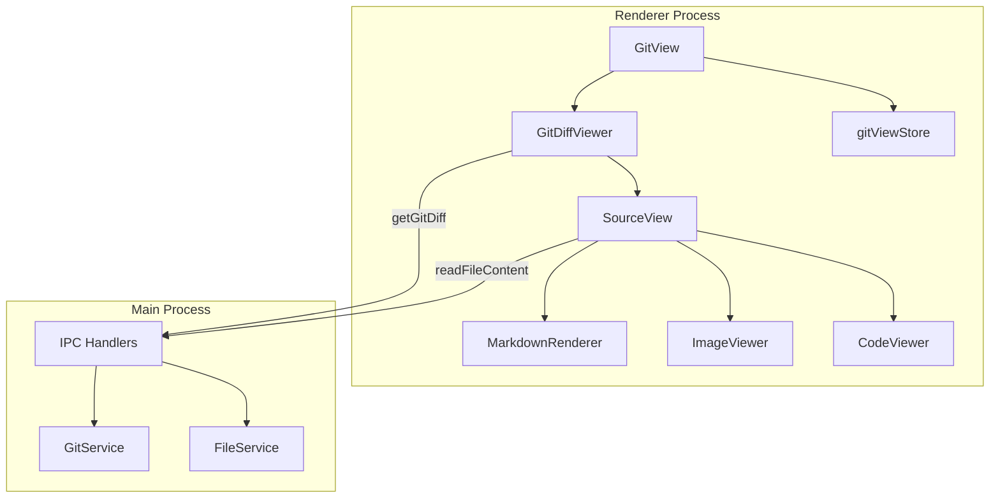
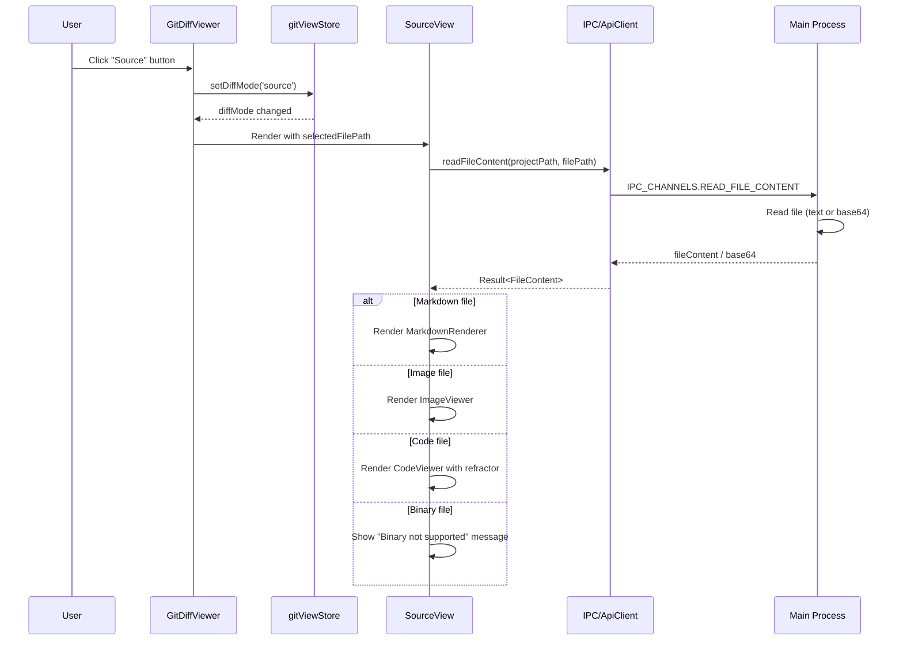

# Design: Git View Source Mode

## Overview

**Purpose**: GitViewコンポーネントに「Source」表示モードを追加し、ファイル全体をシンタックスハイライト付きで閲覧できる機能を提供する。Markdownファイルはレンダリング表示、画像ファイルは拡大縮小可能なビューアーで表示し、変更箇所は背景色でハイライトする。

**Users**: 開発者がGitの差分を確認する際に、差分コンテキストだけでなくファイル全体の構造を把握したいユースケースに対応する。

**Impact**: 既存のGitViewコンポーネント（Unified/Split差分表示）にSourceモードを追加する拡張。GitDiffViewerコンポーネントを拡張し、SourceViewコンポーネントを新規追加する。

### Goals

- 差分表示に加えてファイル全体をシンタックスハイライト付きで表示
- Markdownファイルのレンダリング表示による可読性向上
- 画像ファイルの直接プレビューと拡大縮小操作
- 変更箇所の背景色ハイライトによる差分コンテキストの維持

### Non-Goals

- HEADの内容（変更前）の表示切り替え機能
- 複数ファイルの同時表示
- ファイル編集機能
- 差分のインラインコメント機能
- 画像の差分表示（Before/After比較）

## Architecture

### Existing Architecture Analysis

**現在のGitViewアーキテクチャ**:
- `GitView`: 2カラムレイアウト（GitFileTree + GitDiffViewer）
- `GitDiffViewer`: react-diff-viewを使用したUnified/Split差分表示
- `gitViewStore`: `diffMode: 'unified' | 'split'`で表示モード管理
- `ApiClient.getGitDiff`: 差分取得API（既存）

**拡張ポイント**:
- `gitViewStore.diffMode`を`'unified' | 'split' | 'source'`に拡張
- `GitDiffViewer`にSourceモード分岐を追加
- 新しいIPC API `readFileContent`を追加

### Architecture Pattern & Boundary Map



**Key Decisions**:
- `diffMode`拡張により既存のUnified/Splitモード切替UIを3ボタンに拡張
- SourceViewはGitDiffViewer内の条件分岐で表示（新規コンポーネント）
- ファイル内容取得は新規IPC API経由（セキュリティ境界維持）

### Technology Stack

| Layer | Choice / Version | Role in Feature | Notes |
|-------|------------------|-----------------|-------|
| Frontend | React 19, TypeScript 5.8+ | UI Components | 既存スタック |
| シンタックスハイライト | refractor 4.8.1 | Prism.jsベースのAST生成 | 既存依存、react-refractor連携 |
| Markdownレンダリング | @uiw/react-md-editor 4.0.8 | Markdown表示 | 既存依存、プレビュー機能活用 |
| 画像ズーム | react-zoom-pan-pinch (新規) | ピンチ/パン/ズーム | 軽量、タッチ対応 |
| 状態管理 | Zustand | diffMode拡張 | 既存gitViewStore |

## System Flows

### Source Mode Display Flow



**Key Decisions**:
- ファイル種別判定はSourceView内で拡張子ベースで実施
- 画像はBase64エンコードで転送（Electronセキュリティ要件）
- 差分情報（cachedDiffContent）は変更行ハイライトに使用

## Requirements Traceability

| Criterion ID | Summary | Components | Implementation Approach |
|--------------|---------|------------|------------------------|
| 1.1 | Sourceボタンクリック時にファイル全内容表示 | SourceView, gitViewStore | 新規SourceView + diffMode拡張 |
| 1.2 | 拡張子ベースのシンタックスハイライト | CodeViewer, refractor | refractor既存活用 |
| 1.3 | 行番号表示 | CodeViewer | CSS Grid行番号実装 |
| 1.4 | 変更行の背景色ハイライト | CodeViewer | diff解析 + CSS背景色 |
| 1.5 | 変更行のガターマーク | CodeViewer | ガターマーク列追加 |
| 2.1 | 3ボタン並列表示 | GitDiffViewer | 既存UI拡張 |
| 2.2 | モード切替動作 | GitDiffViewer, gitViewStore | setDiffMode呼び出し |
| 2.3 | アクティブ状態の視覚表示 | GitDiffViewer | 既存スタイル拡張 |
| 2.4 | diffMode状態管理 | gitViewStore | 型拡張 'unified' | 'split' | 'source' |
| 3.1 | Markdown拡張子判定とレンダリング | SourceView, MarkdownRenderer | @uiw/react-md-editor preview |
| 3.2 | コードブロックのシンタックスハイライト | MarkdownRenderer | rehype-prism連携 |
| 3.3 | 既存ライブラリ活用 | MarkdownRenderer | MDEditor.Markdown使用 |
| 3.4 | Markdown内変更行ハイライト | MarkdownRenderer | 制限あり（DOMベース） |
| 4.1 | 画像形式判定とプレビュー表示 | SourceView, ImageViewer | 拡張子判定 + img表示 |
| 4.2 | ピンチ操作による拡大縮小 | ImageViewer | react-zoom-pan-pinch |
| 4.3 | パン操作 | ImageViewer | react-zoom-pan-pinch |
| 4.4 | ホイールズーム | ImageViewer | react-zoom-pan-pinch |
| 4.5 | react-zoom-pan-pinch使用 | ImageViewer | 新規依存追加 |
| 5.1 | readFileContent IPC API | IPC Handlers, FileService | 新規チャンネル追加 |
| 5.2 | 絶対パス受け取りと内容返却 | FileService | fs.readFile使用 |
| 5.3 | ファイル不存在時エラー | FileService | Result型でエラー返却 |
| 5.4 | 画像ファイルBase64エンコード | FileService | Buffer.toString('base64') |
| 6.1 | バイナリファイルメッセージ表示 | SourceView | isBinaryFile判定 |
| 6.2 | 画像バイナリは画像ビューアー表示 | SourceView | 拡張子判定で分岐 |

### Coverage Validation Checklist

- [x] Every criterion ID from requirements.md appears in the table above
- [x] Each criterion has specific component names (not generic references)
- [x] Implementation approach distinguishes "reuse existing" vs "new implementation"
- [x] User-facing criteria specify concrete UI components

## Components and Interfaces

| Component | Domain/Layer | Intent | Req Coverage | Key Dependencies | Contracts |
|-----------|--------------|--------|--------------|-----------------|-----------|
| gitViewStore | Shared/Store | diffMode状態管理拡張 | 2.4 | Zustand (P0) | State |
| GitDiffViewer | Shared/UI | モード切替UI + 条件分岐 | 2.1, 2.2, 2.3 | gitViewStore (P0), SourceView (P0) | - |
| SourceView | Shared/UI | ファイル内容表示分岐 | 1.1, 3.1, 4.1, 6.1, 6.2 | ApiClient (P0) | Service |
| CodeViewer | Shared/UI | シンタックスハイライト表示 | 1.2, 1.3, 1.4, 1.5 | refractor (P0) | - |
| MarkdownRenderer | Shared/UI | Markdownレンダリング | 3.1, 3.2, 3.3, 3.4 | @uiw/react-md-editor (P0) | - |
| ImageViewer | Shared/UI | 画像プレビュー | 4.1-4.5 | react-zoom-pan-pinch (P0) | - |
| IPC Handler | Main/IPC | readFileContent実装 | 5.1-5.4 | FileService (P0) | API |
| FileService | Main/Service | ファイル読み取り | 5.2-5.4 | Node.js fs (P0) | Service |

### Shared/Store

#### gitViewStore (拡張)

| Field | Detail |
|-------|--------|
| Intent | diffMode型を'source'追加で拡張 |
| Requirements | 2.4 |

**Responsibilities & Constraints**
- diffMode型を`'unified' | 'split' | 'source'`に拡張
- 既存のsetDiffModeアクションは変更不要（型拡張のみ）

**Contracts**: State [x]

##### State Management

```typescript
interface GitViewState {
  // ... 既存フィールド
  /** Diff display mode: 'unified' | 'split' | 'source' */
  diffMode: 'unified' | 'split' | 'source';
}
```

### Shared/UI

#### SourceView

| Field | Detail |
|-------|--------|
| Intent | ファイル種別に応じた表示コンポーネント分岐 |
| Requirements | 1.1, 3.1, 4.1, 6.1, 6.2 |

**Responsibilities & Constraints**
- 選択ファイルパスからファイル内容を取得
- 拡張子に基づきCodeViewer/MarkdownRenderer/ImageViewerを切り替え
- 差分情報を受け取り変更行情報を子コンポーネントに伝播

**Dependencies**
- Outbound: ApiClient.readFileContent — ファイル内容取得 (P0)
- Outbound: CodeViewer — コード表示 (P0)
- Outbound: MarkdownRenderer — Markdown表示 (P0)
- Outbound: ImageViewer — 画像表示 (P0)

**Contracts**: Service [x]

##### Service Interface

```typescript
interface SourceViewProps {
  /** Selected file path (relative to project root) */
  filePath: string;
  /** Project path for file content API */
  projectPath: string;
  /** Cached diff content for change line detection */
  diffContent: string | null;
}

/** File content result from IPC */
interface FileContentResult {
  /** File content (text or base64 for images) */
  content: string;
  /** Whether content is base64 encoded */
  isBase64: boolean;
  /** Detected file type */
  fileType: 'code' | 'markdown' | 'image' | 'binary';
}
```

- Preconditions: filePath must be a valid relative path
- Postconditions: Renders appropriate viewer based on file type
- Invariants: Binary files (non-image) always show error message

**Implementation Notes**
- Integration: ApiClient.readFileContent via useEffect
- Validation: File extension determines viewer type
- Risks: Large files may cause performance issues (consider streaming for future)

#### CodeViewer (Summary)

| Intent | Requirements |
|--------|-------------|
| refractorによるシンタックスハイライト + 行番号 + 変更行ハイライト | 1.2, 1.3, 1.4, 1.5 |

- refractor.highlight()でAST生成後、Reactコンポーネントに変換
- CSS Gridで行番号とコード列を配置
- 変更行は背景色とガターマークで表示

#### MarkdownRenderer (Summary)

| Intent | Requirements |
|--------|-------------|
| MDEditor.Markdownを使用したMarkdownレンダリング | 3.1, 3.2, 3.3, 3.4 |

- @uiw/react-md-editorのMarkdownコンポーネントを使用
- 変更行ハイライトはDOM構造上の制約あり（制限事項）

#### ImageViewer (Summary)

| Intent | Requirements |
|--------|-------------|
| react-zoom-pan-pinchによる画像プレビュー | 4.1, 4.2, 4.3, 4.4, 4.5 |

- TransformWrapper/TransformComponent使用
- Base64データをdata URLとして表示

### Main/IPC

#### readFileContent Handler

| Field | Detail |
|-------|--------|
| Intent | ファイル内容読み取りIPC API |
| Requirements | 5.1, 5.2, 5.3, 5.4 |

**Responsibilities & Constraints**
- プロジェクトパスとファイルパスを受け取り内容を返却
- 画像ファイルはBase64エンコード
- ファイル不存在時はエラーを返却

**Dependencies**
- Outbound: FileService — ファイル読み取り (P0)

**Contracts**: API [x]

##### API Contract

| Method | Channel | Request | Response | Errors |
|--------|---------|---------|----------|--------|
| invoke | READ_FILE_CONTENT | `{ projectPath: string, filePath: string }` | `Result<FileContentResult, ApiError>` | FILE_NOT_FOUND, READ_ERROR |

**Implementation Notes**
- Integration: IPC_CHANNELS.READ_FILE_CONTENTを追加
- Validation: パスのセキュリティ検証（プロジェクトパス外へのアクセス禁止）

### Main/Service

#### FileService (拡張)

| Field | Detail |
|-------|--------|
| Intent | readFileContent機能追加 |
| Requirements | 5.2, 5.3, 5.4 |

**Responsibilities & Constraints**
- 絶対パスを構築してファイル読み取り
- 画像拡張子の場合はBase64エンコード
- 存在チェックとエラーハンドリング

**Contracts**: Service [x]

##### Service Interface

```typescript
interface FileService {
  /**
   * Read file content for source view
   * @param projectPath - Project root path
   * @param filePath - Relative file path
   * @returns File content with metadata
   */
  readFileContent(
    projectPath: string,
    filePath: string
  ): Promise<Result<FileContentResult, ApiError>>;
}
```

- Preconditions: projectPath must be valid project root
- Postconditions: Returns file content or error
- Invariants: Never reads files outside projectPath

## Data Models

### Domain Model

**ファイル種別判定ロジック**:

```typescript
/** Supported image extensions */
const IMAGE_EXTENSIONS = ['.svg', '.png', '.jpg', '.jpeg', '.gif', '.webp', '.ico'];

/** Markdown extensions */
const MARKDOWN_EXTENSIONS = ['.md', '.markdown'];

/** Binary detection (simplified - actual uses file header check) */
function detectFileType(filePath: string, content: Buffer): FileType {
  const ext = path.extname(filePath).toLowerCase();

  if (IMAGE_EXTENSIONS.includes(ext)) return 'image';
  if (MARKDOWN_EXTENSIONS.includes(ext)) return 'markdown';
  if (isBinaryContent(content)) return 'binary';
  return 'code';
}
```

### Data Contracts & Integration

**IPC Request/Response**:

```typescript
// Request
interface ReadFileContentRequest {
  projectPath: string;
  filePath: string;
}

// Response
interface FileContentResult {
  content: string;
  isBase64: boolean;
  fileType: 'code' | 'markdown' | 'image' | 'binary';
  language?: string; // For code files, detected from extension
}
```

## Error Handling

### Error Strategy

| Error Type | Handling | User Message |
|------------|----------|--------------|
| File not found | Show error in SourceView | ファイルが見つかりません |
| Read permission denied | Show error in SourceView | ファイルを読み取れません |
| Binary file | Show message (not error) | バイナリファイルは表示できません |
| Large file (>10MB) | Show warning | 大きなファイルのため表示を制限しています |

## Testing Strategy

### Unit Tests
- gitViewStore: diffMode拡張の型チェック、setDiffMode('source')動作
- detectFileType: 各拡張子での正しいファイル種別判定
- CodeViewer: refractorによるハイライト生成、変更行マーク
- FileService.readFileContent: 正常系、ファイル不存在、Base64エンコード

### Integration Tests
- SourceView: モード切替後のファイル内容取得フロー
- IPC: readFileContent往復通信

### E2E Tests
- Sourceモードボタンクリック→ファイル内容表示
- Markdown/画像/コードファイルの種別判定と表示切替
- 画像ズーム/パン操作

## Design Decisions

### DD-001: diffMode型拡張によるSourceモード追加

| Field | Detail |
|-------|--------|
| Status | Accepted |
| Context | 新しいSourceモードを追加する際、既存の2モード構造をどう拡張するか |
| Decision | gitViewStoreのdiffMode型を`'unified' | 'split' | 'source'`に拡張 |
| Rationale | 既存のsetDiffModeアクションと状態管理パターンを再利用でき、変更最小化 |
| Alternatives Considered | 別ストア追加（冗長）、別コンポーネント分岐（UI一貫性低下） |
| Consequences | GitDiffViewer内にSourceモード用の条件分岐が必要 |

### DD-002: SourceView内でのファイル種別分岐

| Field | Detail |
|-------|--------|
| Status | Accepted |
| Context | コード/Markdown/画像/バイナリの4種類のファイルを適切に表示する方法 |
| Decision | SourceView内で拡張子ベースの判定を行い、子コンポーネントに分岐 |
| Rationale | 拡張子ベースの判定は高速で、ほとんどのユースケースで正確。MIMEタイプ検出は追加の複雑性 |
| Alternatives Considered | IPC側でファイル種別判定（追加往復）、Content-Type検出（複雑） |
| Consequences | 拡張子が誤っているファイルは正しく表示されない可能性（許容） |

### DD-003: react-zoom-pan-pinch採用

| Field | Detail |
|-------|--------|
| Status | Accepted |
| Context | 画像のズーム/パン/ピンチ機能を実装するライブラリ選定 |
| Decision | react-zoom-pan-pinchを採用 |
| Rationale | 軽量（~12KB gzip）、タッチ対応、React Virtual DOMとの親和性、豊富なドキュメント |
| Alternatives Considered | react-responsive-pinch-zoom-pan（メンテナンス不活発）、自前実装（コスト） |
| Consequences | 新規依存追加（package.json更新必要） |

### DD-004: 新規IPC API readFileContent追加

| Field | Detail |
|-------|--------|
| Status | Accepted |
| Context | Renderer ProcessからMain Processのファイル内容を取得する方法 |
| Decision | 新しいIPC API `readFileContent`を追加 |
| Rationale | Electronセキュリティモデルに準拠、既存のgetGitDiff APIパターンと一貫性、パス検証可能 |
| Alternatives Considered | 既存getArtifactContent拡張（用途が異なる）、preloadでfs直接公開（セキュリティリスク） |
| Consequences | IPC Handlers、channels.ts、ApiClient、preloadの更新が必要 |

### DD-005: Markdown変更行ハイライトの制限

| Field | Detail |
|-------|--------|
| Status | Accepted |
| Context | Markdownレンダリング後のDOM構造で変更行ハイライトをどう実現するか |
| Decision | 完全な対応は困難として、制限事項とする |
| Rationale | MDEditor.Markdownはレンダリング後のDOMを直接操作する設計ではない。差分行とレンダリング後の行の対応付けが困難 |
| Alternatives Considered | カスタムMarkdownパーサー（コスト大）、DOM操作（脆い） |
| Consequences | Markdownファイルでは変更行ハイライトが表示されない（将来的な改善候補） |

## Integration & Deprecation Strategy

### 結合ポイント（修正が必要な既存ファイル）

| File Path | Change Type | Description |
|-----------|-------------|-------------|
| `electron-sdd-manager/src/shared/stores/gitViewStore.ts` | Modify | diffMode型拡張 |
| `electron-sdd-manager/src/shared/components/git/GitDiffViewer.tsx` | Modify | 3ボタンUI追加、Sourceモード分岐 |
| `electron-sdd-manager/src/shared/api/types.ts` | Modify | readFileContent API型追加 |
| `electron-sdd-manager/src/shared/api/IpcApiClient.ts` | Modify | readFileContent実装追加 |
| `electron-sdd-manager/src/main/ipc/channels.ts` | Modify | READ_FILE_CONTENTチャンネル追加 |
| `electron-sdd-manager/src/main/ipc/handlers.ts` | Modify | readFileContentハンドラ追加 |
| `electron-sdd-manager/src/main/services/fileService.ts` | Modify | readFileContent関数追加 |
| `electron-sdd-manager/src/preload/index.ts` | Modify | readFileContent API公開 |
| `electron-sdd-manager/package.json` | Modify | react-zoom-pan-pinch依存追加 |

### 新規作成ファイル

| File Path | Description |
|-----------|-------------|
| `electron-sdd-manager/src/shared/components/git/SourceView.tsx` | ファイル種別分岐コンポーネント |
| `electron-sdd-manager/src/shared/components/git/CodeViewer.tsx` | シンタックスハイライト表示 |
| `electron-sdd-manager/src/shared/components/git/MarkdownRenderer.tsx` | Markdownレンダリング |
| `electron-sdd-manager/src/shared/components/git/ImageViewer.tsx` | 画像プレビュー |

### 削除対象ファイル

なし（既存ファイルの削除は不要）

## Interface Changes & Impact Analysis

### gitViewStore.diffMode型変更

**変更内容**: `'unified' | 'split'` -> `'unified' | 'split' | 'source'`

**既存Callers（更新不要）**:
- `GitDiffViewer.tsx`: setDiffModeは文字列引数を受け取るため影響なし
- テストファイル: 型アサーションがある場合は更新必要

### ApiClient.readFileContent追加

**変更内容**: 新規オプショナルメソッド追加

**既存Callers**: なし（新規API）

**新規Callers**:
- `SourceView.tsx`: readFileContent呼び出し

## Integration Test Strategy

### IPC通信テスト

**Components**: SourceView, IpcApiClient, IPC Handlers, FileService

**Data Flow**:
1. SourceView -> IpcApiClient.readFileContent()
2. IpcApiClient -> ipcRenderer.invoke(READ_FILE_CONTENT)
3. Main Process Handler -> FileService.readFileContent()
4. Response -> SourceView state update

**Mock Boundaries**:
- Mock: FileService (fs操作)
- Real: IPC transport, Result型処理

**Verification Points**:
- 正常系: ファイル内容が正しく返却される
- エラー系: ファイル不存在時にApiError返却
- Base64: 画像ファイルがisBase64: trueで返却

**Robustness Strategy**:
- `waitFor`パターンでIPC応答待機
- ファイルシステムモックでテスト安定化

**Prerequisites**:
- 既存のIPC統合テストパターン（handlers.test.ts）を参照
