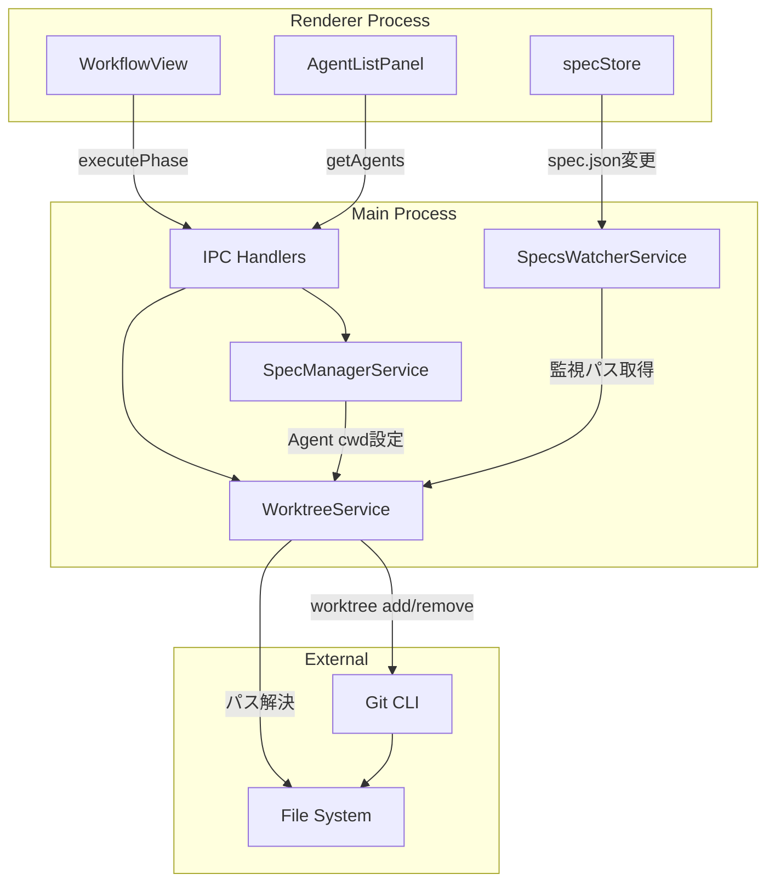
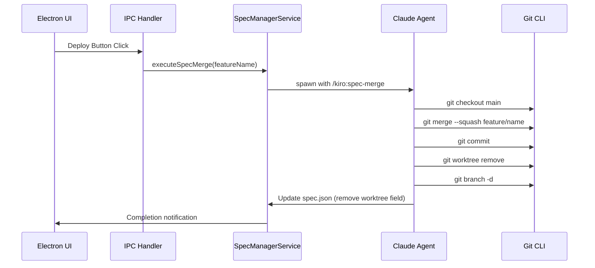
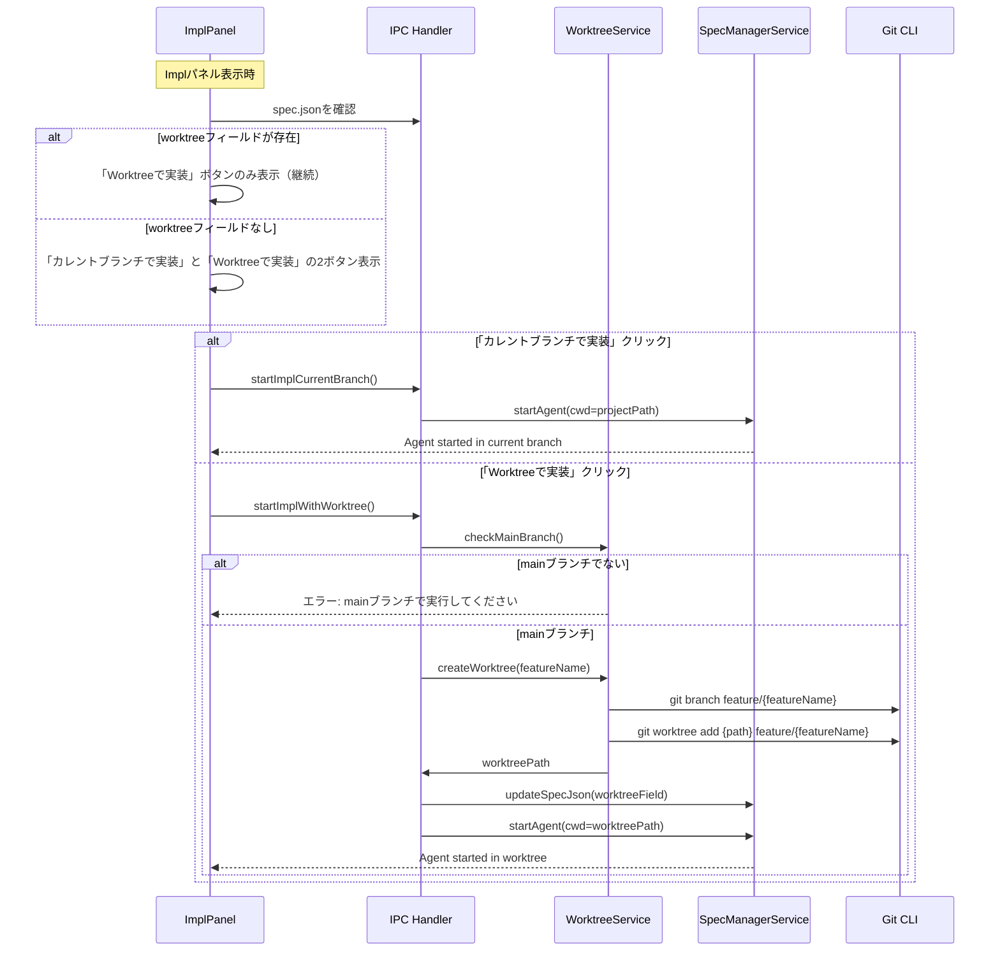
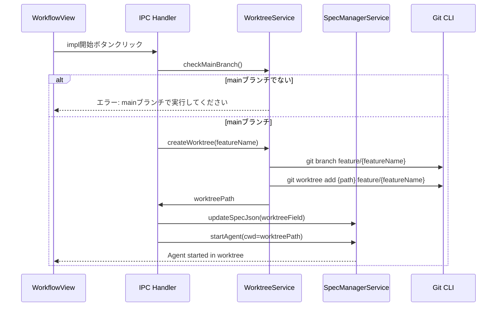
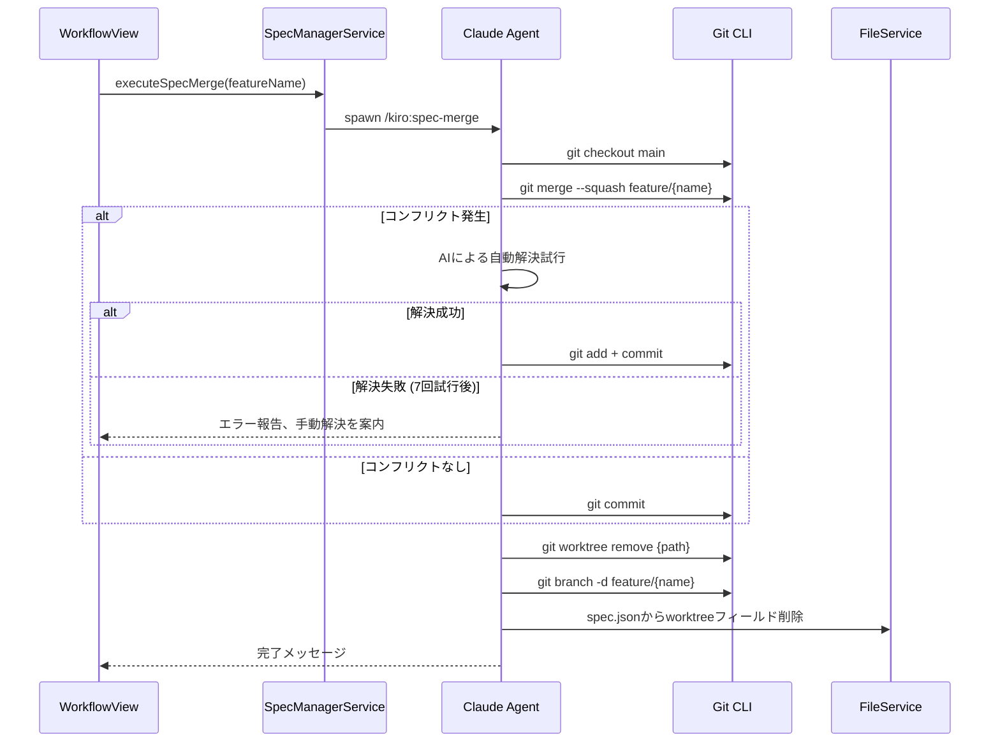
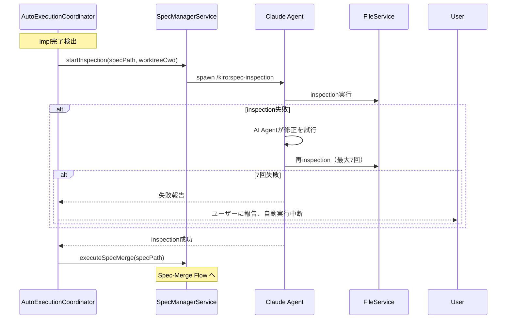
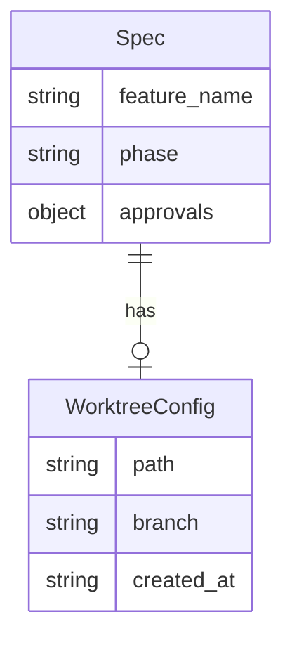

# Design: Git Worktree Support

## Overview

**Purpose**: Git worktree機能を活用し、mainブランチで仕様策定を行いながら、別のworktreeで実装作業を並行して行える機能を提供する。

**Users**: SDDワークフローを使用する開発者が、仕様変更と実装作業の分離、クリーンなブランチ管理を実現するために利用する。

**Impact**: 既存のimplフェーズ実行フローを変更し、worktreeモード時は自動でworktreeを作成・管理する。Deployボタンの動作も条件分岐で変更。

### Goals
- impl開始時にworktreeを自動作成し、分離された作業環境を提供
- worktreeモードの状態をspec.jsonで一元管理
- spec-mergeスキルによるマージ・クリーンアップの自動化
- Agent一覧でのworktree識別表示

### Non-Goals
- 既存worktreeの検出・紐付け機能
- worktree作成場所のカスタマイズ
- ブランチ命名規則のカスタマイズ
- Remote UI対応（初期スコープ外）

## Architecture

### Architecture Pattern & Boundary Map



**Architecture Integration**:
- Selected pattern: サービスレイヤーパターン（WorktreeServiceを新規追加）
- Domain/feature boundaries: worktree操作はWorktreeServiceに集約、他サービスはインタフェース経由で利用
- Existing patterns preserved: IPC handler -> Service -> External のフロー
- New components rationale: git worktree操作の複雑さを隠蔽するためWorktreeServiceを分離
- Steering compliance: DRY（worktreeパス解決を一箇所に集約）、KISS（シンプルなフィールド有無判定）

### Technology Stack

| Layer | Choice / Version | Role in Feature | Notes |
|-------|------------------|-----------------|-------|
| Backend / Services | Node.js child_process | git CLI実行 | 既存spawn patternを活用 |
| Data / Storage | spec.json | worktree状態永続化 | 新規worktreeフィールド追加 |
| Infrastructure / Runtime | Git 2.x+ | worktree操作 | git worktree add/remove/list |

### Command Prompt Architecture (Claude Code features only)

**Execution Model**:
- [x] CLI invocation: External process with file-based data exchange

**Rationale**: spec-mergeスキルはgit操作（merge, worktree remove, branch delete）を含むため、Bash経由のCLI実行が必要。

**Data Flow**:


## System Flows

### Impl Start UI Flow (Impl開始UIの分岐)



### Worktree Creation Flow (impl開始時 - 旧フロー、Requirement 9で置き換え)



### Spec-Merge Flow (Deploy時)



### Auto Execution Flow (inspection → spec-merge)



**トリガー条件**:
- impl完了検出: AgentProcess終了イベント + spec.jsonのphase確認
- 自動実行有効: AutoExecutionOptions.permissions.inspection === true

## Requirements Traceability

| Requirement | Summary | Components | Interfaces | Flows |
|-------------|---------|------------|------------|-------|
| 1.1-1.7 | Worktree自動作成 | WorktreeService, IPC Handler | createWorktree, checkMainBranch | Worktree Creation Flow |
| 2.1-2.3 | spec.jsonのworktreeフィールド | SpecJson型, fileService | SpecJson.worktree | - |
| 3.1-3.2 | Agent起動時のpwd設定 | SpecManagerService | startAgent(cwd) | - |
| 4.1-4.2 | Agent一覧でのworktree識別 | AgentListPanel | AgentInfo.cwd | - |
| 5.1-5.2 | Deployボタンの条件分岐 | WorkflowView | executeSpecMerge | - |
| 6.1-6.5 | 自動実行フロー | AutoExecutionCoordinator拡張 | startAutoExecution, handleInspectionComplete | Auto Execution Flow |
| 7.1-7.8 | spec-mergeスキル | spec-merge skill, WorktreeService | executeSpecMerge, cleanupWorktree | Spec-Merge Flow |
| 8.1-8.2 | 監視パスの切り替え | SpecsWatcherService | getWatchPath | - |
| 9.1-9.9 | Impl開始UIの分岐 | ImplPanel, IPC Handler | startImplWithWorktree, startImplCurrentBranch | Impl Start UI Flow |

## Components and Interfaces

| Component | Domain/Layer | Intent | Req Coverage | Key Dependencies | Contracts |
|-----------|--------------|--------|--------------|------------------|-----------|
| WorktreeService | Main/Service | git worktree操作のラッパー | 1.1-1.7, 7.6-7.7 | Git CLI (P0), FileService (P1) | Service |
| SpecJson.worktree | Types | worktree状態の型定義 | 2.1-2.3 | - | State |
| SpecManagerService拡張 | Main/Service | Agent cwd設定、spec-merge実行 | 3.1-3.2, 7.1-7.5 | WorktreeService (P0), AgentProcess (P0) | Service |
| AgentListPanel拡張 | Renderer/UI | worktree識別表示 | 4.1-4.2 | agentStore (P1) | - |
| WorkflowView拡張 | Renderer/UI | Deployボタン条件分岐 | 5.1-5.2 | specStore (P1), IPC (P0) | - |
| SpecsWatcherService拡張 | Main/Service | 監視パス動的切り替え | 8.1-8.2 | WorktreeService (P1), chokidar (P0) | - |
| IPC Handlers拡張 | Main/IPC | worktree関連IPCチャンネル | 1.1-1.7 | WorktreeService (P0) | API |
| spec-mergeスキル | Skills | マージ・クリーンアップ実行 | 7.1-7.8 | Git CLI (P0) | - |
| AutoExecutionCoordinator拡張 | Main/Service | inspection→spec-merge自動連携 | 6.1-6.5 | SpecManagerService (P0) | Service, Event |

### Main/Service

#### WorktreeService

| Field | Detail |
|-------|--------|
| Intent | git worktree操作の抽象化とパス解決を提供 |
| Requirements | 1.1, 1.3, 1.4, 1.6, 1.7, 7.6, 7.7, 8.1, 8.2 |

**Responsibilities & Constraints**
- git worktree add/remove/listの実行
- worktreeパスの解決（相対パス <-> 絶対パス）
- mainブランチ確認
- worktree存在確認

**Dependencies**
- Outbound: Git CLI - worktree操作 (P0)
- Outbound: FileService - パス存在確認 (P1)
- Outbound: child_process - コマンド実行 (P0)

**Contracts**: Service [x] / API [ ] / Event [ ] / Batch [ ] / State [ ]

##### Service Interface
```typescript
interface WorktreeServiceResult<T> {
  ok: true;
  value: T;
} | {
  ok: false;
  error: WorktreeError;
}

type WorktreeError =
  | { type: 'NOT_ON_MAIN_BRANCH'; currentBranch: string }
  | { type: 'WORKTREE_EXISTS'; path: string }
  | { type: 'BRANCH_EXISTS'; branch: string }
  | { type: 'GIT_ERROR'; message: string }
  | { type: 'PATH_NOT_FOUND'; path: string }
  | { type: 'PATH_VALIDATION_ERROR'; path: string; reason: string }
  | { type: 'INVALID_FEATURE_NAME'; featureName: string; reason: string };

interface WorktreeInfo {
  path: string;           // 相対パス（mainプロジェクトルート基準）
  absolutePath: string;   // 絶対パス
  branch: string;         // feature/{feature-name}
  created_at: string;     // ISO-8601
}

interface WorktreeService {
  /**
   * 現在のブランチがmainかどうかを確認
   */
  isOnMainBranch(): Promise<WorktreeServiceResult<boolean>>;

  /**
   * worktreeを作成
   * @param featureName - spec feature名
   * @returns WorktreeInfo（作成されたworktreeの情報）
   * @throws INVALID_FEATURE_NAME featureNameがgitブランチ名として無効な場合
   *
   * 入力検証:
   * - gitブランチ名として有効な文字のみ許可（英数字、ハイフン、アンダースコア）
   * - 禁止文字: スペース, ~, ^, :, ?, *, [, \, .., @{
   * - 先頭/末尾のドット、連続ドット禁止
   * - 検証失敗時はINVALID_FEATURE_NAMEエラーを返す
   */
  createWorktree(featureName: string): Promise<WorktreeServiceResult<WorktreeInfo>>;

  /**
   * worktreeを削除
   * @param featureName - spec feature名
   */
  removeWorktree(featureName: string): Promise<WorktreeServiceResult<void>>;

  /**
   * worktreeの絶対パスを取得
   * @param relativePath - spec.jsonに保存された相対パス
   * @throws PATH_VALIDATION_ERROR パスがプロジェクト親ディレクトリ外を指す場合
   *
   * セキュリティ検証:
   * - path.resolve + path.normalize でパス正規化
   * - プロジェクトルートの親ディレクトリ内に収まることを検証
   * - シンボリックリンク解決（fs.realpath）
   */
  resolveWorktreePath(relativePath: string): string;

  /**
   * worktreeが存在するか確認
   * @param featureName - spec feature名
   */
  worktreeExists(featureName: string): Promise<boolean>;

  /**
   * 指定されたspecのworktree監視パスを取得
   * @param specId - spec ID
   * @param worktreeConfig - spec.jsonのworktreeフィールド
   */
  getWatchPath(specId: string, worktreeConfig?: WorktreeConfig): string;
}
```
- Preconditions: projectPathが有効なgitリポジトリであること
- Postconditions: git操作の結果がResult型で返される
- Invariants: worktreeパスは常にmainプロジェクトルート基準の相対パス

**Implementation Notes**
- Integration: child_process.execでgitコマンドを実行
- Validation: mainブランチ確認はgit branch --show-currentで実行
- Risks: gitコマンド失敗時のエラーハンドリング

#### SpecManagerService拡張

| Field | Detail |
|-------|--------|
| Intent | Agent起動時のcwd設定とspec-merge実行を追加 |
| Requirements | 3.1, 3.2, 7.1, 7.2, 7.3, 7.4, 7.5 |

**Responsibilities & Constraints**
- worktreeモード時のAgent cwd設定
- spec-mergeコマンドの実行トリガー
- 既存のstartAgent, executePhaseへのworktree対応追加

**Dependencies**
- Inbound: IPC Handlers - executePhase呼び出し (P0)
- Outbound: WorktreeService - パス解決 (P0)
- Outbound: AgentProcess - プロセス起動 (P0)

**Contracts**: Service [x] / API [ ] / Event [ ] / Batch [ ] / State [ ]

##### Service Interface (追加分)
```typescript
// 既存のStartAgentOptionsを拡張
interface StartAgentOptions {
  // ... existing fields ...
  /** worktreeモード時の作業ディレクトリ（絶対パス） */
  worktreeCwd?: string;
}

// 新規メソッド
interface SpecManagerServiceExtension {
  /**
   * spec-mergeを実行
   * @param specId - spec ID
   * @param featureName - feature名
   */
  executeSpecMerge(specId: string, featureName: string): Promise<Result<AgentInfo, AgentError>>;
}
```

**Implementation Notes**
- Integration: startAgentでcwdオプションを活用（worktreeCwd || projectPath）
- Validation: worktreeCwd指定時はパス存在確認
- Risks: worktreeが削除された後のAgent起動失敗

### Types

#### SpecJson.worktree

| Field | Detail |
|-------|--------|
| Intent | worktree状態をspec.jsonで永続化 |
| Requirements | 2.1, 2.2, 2.3 |

**Contracts**: Service [ ] / API [ ] / Event [ ] / Batch [ ] / State [x]

##### State Management
```typescript
interface WorktreeConfig {
  /** mainプロジェクトルート基準の相対パス */
  path: string;
  /** ブランチ名（feature/{feature-name}） */
  branch: string;
  /** 作成日時（ISO-8601） */
  created_at: string;
}

// SpecJson型への追加
interface SpecJson {
  // ... existing fields ...
  /** Worktree configuration (optional) */
  worktree?: WorktreeConfig;
}
```
- State model: worktreeフィールドの有無でモード判定
- Persistence: spec.jsonに保存
- Consistency: フィールド追加/削除は単一操作で実行
- Concurrency strategy: ファイルロック不要（単一プロセスからの更新）

### Main/IPC

#### IPC Handlers拡張

| Field | Detail |
|-------|--------|
| Intent | worktree関連操作のIPCチャンネル提供 |
| Requirements | 1.1, 1.2, 1.3, 1.6 |

**Contracts**: Service [ ] / API [x] / Event [ ] / Batch [ ] / State [ ]

##### API Contract
| Method | Channel | Request | Response | Errors |
|--------|---------|---------|----------|--------|
| invoke | worktree:check-main | `{ projectPath: string }` | `{ isMain: boolean; currentBranch: string }` | GIT_ERROR |
| invoke | worktree:create | `{ projectPath: string; featureName: string }` | `WorktreeInfo` | NOT_ON_MAIN_BRANCH, WORKTREE_EXISTS, GIT_ERROR |
| invoke | worktree:remove | `{ projectPath: string; featureName: string }` | `void` | PATH_NOT_FOUND, GIT_ERROR |
| invoke | worktree:resolve-path | `{ projectPath: string; relativePath: string }` | `{ absolutePath: string }` | - |
| invoke | worktree:impl-start | `{ projectPath: string; featureName: string; useWorktree: boolean }` | `{ success: boolean; worktreeInfo?: WorktreeInfo }` | NOT_ON_MAIN_BRANCH, WORKTREE_EXISTS, GIT_ERROR |

### Renderer/UI

#### AgentListPanel拡張

| Field | Detail |
|-------|--------|
| Intent | worktreeで動作しているAgentの視覚的識別 |
| Requirements | 4.1, 4.2 |

**Implementation Notes**
- Integration: AgentInfo.commandまたはcwdからworktreeパスを判定
- 視覚的インジケーター: アイコンまたはバッジでworktreeモードを表示

#### WorkflowView拡張

| Field | Detail |
|-------|--------|
| Intent | Deployボタンの動作をworktreeモードで分岐 |
| Requirements | 5.1, 5.2 |

**Implementation Notes**
- Integration: specJson.worktreeの有無でボタン動作を分岐
- worktreeなし: `/commit`実行
- worktreeあり: `/kiro:spec-merge {feature-name}`実行

#### ImplPanel拡張

| Field | Detail |
|-------|--------|
| Intent | Impl開始時にカレントブランチとworktreeの選択UIを提供 |
| Requirements | 9.1, 9.2, 9.3, 9.4, 9.5, 9.6, 9.7, 9.8, 9.9 |

**Responsibilities & Constraints**
- 2つのImpl開始ボタンを表示（「カレントブランチで実装」「Worktreeで実装」）
- worktreeフィールド既存時は「Worktreeで実装」のみ表示（継続モード）
- 「Worktreeで実装」選択時はmainブランチ確認を実行
- mainブランチ以外ではworktree作成をエラーとして中断

**Dependencies**
- Outbound: IPC Handler - worktree:impl-start呼び出し (P0)
- Outbound: specStore - spec.jsonのworktreeフィールド参照 (P1)

**Implementation Notes**
- Integration: 既存のImpl開始ボタンを2つのボタンに分岐
- ボタンラベル: 「カレントブランチで実装」「Worktreeで実装」
- worktreeフィールド存在時: 「Worktreeで実装（継続）」のみ表示
- エラー表示: mainブランチ以外でのworktree作成時にトースト通知

### Skills

#### spec-mergeスキル

| Field | Detail |
|-------|--------|
| Intent | worktreeのマージとクリーンアップを自動実行 |
| Requirements | 7.1, 7.2, 7.3, 7.4, 7.5, 7.6, 7.7, 7.8 |

**Responsibilities & Constraints**
- mainブランチにいることの確認
- worktreeブランチのマージ（squash）
- コンフリクト発生時のAI自動解決試行
- worktree削除
- spec.jsonのworktreeフィールド削除

**Implementation Notes**
- allowed-tools: Bash, Read, Write, Edit, Glob
- コンフリクト解決: 最大7回試行、失敗時はユーザーに報告して中断

### Main/Service (追加)

#### AutoExecutionCoordinator拡張

| Field | Detail |
|-------|--------|
| Intent | worktreeモードでのinspection→spec-merge自動連携 |
| Requirements | 6.1, 6.2, 6.3, 6.4, 6.5 |

**Responsibilities & Constraints**
- impl完了検出後のinspection自動開始
- inspection失敗時のAI Agent修正リトライ（最大7回）
- inspection成功後のspec-merge自動実行

**Dependencies**
- Inbound: AgentProcess - impl完了イベント (P0)
- Outbound: SpecManagerService - inspection/spec-merge実行 (P0)

**Contracts**: Service [x] / API [ ] / Event [x] / Batch [ ] / State [ ]

##### Service Interface (worktree対応追加)
```typescript
// 既存AutoExecutionCoordinatorへの拡張
interface AutoExecutionCoordinatorExtension {
  /**
   * worktreeモードでのinspection開始
   * @param specPath spec.jsonのパス
   * @param worktreeCwd worktreeの絶対パス
   */
  startWorktreeInspection(specPath: string, worktreeCwd: string): Promise<void>;

  /**
   * inspection完了ハンドラ（成功時はspec-mergeを自動実行）
   * @param specPath spec.jsonのパス
   * @param success inspectionの成功/失敗
   */
  handleInspectionComplete(specPath: string, success: boolean): Promise<void>;
}
```

##### Event Interface
```typescript
interface AutoExecutionWorktreeEvents {
  'worktree-inspection-started': (specPath: string, worktreeCwd: string) => void;
  'worktree-inspection-retry': (specPath: string, attempt: number, maxAttempts: number) => void;
  'worktree-inspection-failed': (specPath: string, error: string) => void;
  'worktree-merge-started': (specPath: string) => void;
}
```

#### SpecsWatcherService拡張

| Field | Detail |
|-------|--------|
| Intent | worktreeモード時の監視パス動的切り替え |
| Requirements | 8.1, 8.2 |

**Responsibilities & Constraints**
- worktreeフィールド追加時: 監視パスをworktreeに切り替え
- worktreeフィールド削除時: 監視パスをmainプロジェクトに戻す
- spec.json変更を検出して自動で監視パスを再設定

**Dependencies**
- Inbound: FileWatcher - spec.json変更イベント (P0)
- Outbound: WorktreeService - パス解決 (P1)
- Outbound: chokidar - ファイル監視 (P0)

**Contracts**: Service [x] / API [ ] / Event [ ] / Batch [ ] / State [ ]

##### Service Interface (追加)
```typescript
interface SpecsWatcherServiceExtension {
  /**
   * 監視パスを再設定
   * spec.jsonのworktreeフィールド変更時に呼び出される
   * @param specId spec ID
   * @param newWatchPath 新しい監視パス（絶対パス）
   */
  resetWatchPath(specId: string, newWatchPath: string): void;
}
```

**Implementation Notes**
- **トリガー条件**: spec.jsonのworktreeフィールド追加/削除を検出
- **検出方法**: 既存のspec.json監視でworktreeフィールドの変更を検知
- **再初期化フロー**:
  1. 現在のwatcher停止（chokidar.close()）
  2. 新しいパスでwatcher再作成
  3. 監視開始

## Data Models

### Domain Model



- Aggregates: Spec（spec.jsonが集約ルート）
- Entities: WorktreeConfig（Specに属する値オブジェクト）
- Business rules:
  - worktreeフィールドの有無でworktreeモードを判定
  - impl開始時にworktreeフィールドを追加
  - spec-merge完了時にworktreeフィールドを削除

### Logical Data Model

**Structure Definition**:
- WorktreeConfigはspec.jsonのオプショナルフィールド
- pathは相対パス（mainプロジェクトルート基準）
- branchは`feature/{feature-name}`形式

**Consistency & Integrity**:
- Transaction boundaries: spec.json更新は単一操作
- Cascading rules: worktree削除時にspec.jsonのフィールドも削除

## Error Handling

### Error Strategy
- git操作失敗: Result型でエラーを返し、UI層でメッセージ表示
- worktree作成失敗時のロールバック:
  1. ブランチ作成成功 → worktree追加失敗の場合: `git branch -d feature/{name}` でブランチを削除
  2. worktree追加成功 → spec.json更新失敗の場合: `git worktree remove` + `git branch -d` で完全ロールバック
  3. WorktreeService.createWorktreeはtry-catch内で上記ロールバックを自動実行
- spec-merge失敗: コンフリクト解決7回試行後にユーザーに報告

### Error Categories and Responses
**User Errors** (4xx): mainブランチ以外でimpl開始 -> エラーメッセージ表示、impl中断
**System Errors** (5xx): git worktree add失敗 -> エラーメッセージ表示、impl中断
**Business Logic Errors** (422): コンフリクト解決失敗 -> 7回試行後にユーザーへ報告、手動解決を案内

### Monitoring
- ログ出力: WorktreeService操作をlogger.infoで記録
- エラー追跡: gitコマンド失敗をlogger.errorで記録

## Testing Strategy

### Unit Tests
- WorktreeService.isOnMainBranch: mainブランチ判定のモック
- WorktreeService.createWorktree: git worktree addのモック
- WorktreeService.removeWorktree: git worktree removeのモック
- SpecJson.worktree型: 型定義の妥当性

### Integration Tests
- impl開始からworktree作成までのフロー
- spec-merge実行からworktree削除までのフロー
- ファイル監視パスの切り替え

### E2E Tests
- impl開始ボタン押下でworktree作成
- Deployボタン押下でspec-merge実行
- Agent一覧でのworktree識別表示

## Design Decisions

### DD-001: spec.jsonにworktreeフィールドを追加

| Field | Detail |
|-------|--------|
| Status | Accepted |
| Context | worktreeモードの状態管理方法を決定する必要がある |
| Decision | spec.jsonにworktreeフィールドを追加し、フィールドの有無でモード判定 |
| Rationale | SSoT（Single Source of Truth）の原則に従い、既存のspec.json読み込みフローを活用 |
| Alternatives Considered | 1. 別設定ファイル（worktree.json） 2. ブランチ名ベースの動的判定 |
| Consequences | spec.jsonスキーマ変更が必要、後方互換性を維持（オプショナルフィールド） |

### DD-002: 相対パスでworktree.pathを保存

| Field | Detail |
|-------|--------|
| Status | Accepted |
| Context | worktreeパスの保存形式を決定する必要がある |
| Decision | mainプロジェクトルート基準の相対パスで保存 |
| Rationale | プロジェクト移動時の堅牢性、gitリポジトリ内で共有可能 |
| Alternatives Considered | 1. 絶対パス 2. ホームディレクトリ基準のパス |
| Consequences | パス解決時に絶対パス変換が必要、WorktreeService.resolveWorktreePathで対応 |

### DD-003: impl開始時にworktree自動作成

| Field | Detail |
|-------|--------|
| Status | Accepted |
| Context | worktree作成タイミングを決定する必要がある（要件1.1-1.3） |
| Decision | impl開始ボタン押下時に自動作成 |
| Rationale | ユーザー操作の最小化、tasksが承認されていることが保証されている |
| Alternatives Considered | 1. 手動トリガー 2. tasksフェーズ完了時 |
| Consequences | mainブランチ確認ロジックが必要、作成失敗時のエラーハンドリングが必要 |

### DD-004: ブランチ命名規則を固定

| Field | Detail |
|-------|--------|
| Status | Accepted |
| Context | worktree用ブランチの命名規則を決定する必要がある |
| Decision | `feature/{feature-name}` で固定 |
| Rationale | 一般的なgit-flow命名規則に準拠、一貫性の確保、設定項目を増やさない |
| Alternatives Considered | 1. カスタマイズ可能 2. `specs/{feature-name}` |
| Consequences | カスタマイズの柔軟性を犠牲にするが、混乱を避ける |

### DD-005: AIによるコンフリクト自動解決

| Field | Detail |
|-------|--------|
| Status | Accepted |
| Context | spec-merge時のコンフリクト対応方法を決定する必要がある（要件7.4-7.5） |
| Decision | AIによる自動解決を試行、7回失敗後にユーザーに報告 |
| Rationale | ユーザー介入の最小化、AI Agentの能力を最大限活用 |
| Alternatives Considered | 1. 手動解決のみ 2. ユーザーに選択させる |
| Consequences | AI解決の精度に依存、失敗時のフォールバック必要 |

### DD-006: spec-mergeでworktreeクリーンアップを自動実行

| Field | Detail |
|-------|--------|
| Status | Accepted |
| Context | worktree削除のタイミングと方法を決定する必要がある（要件7.6-7.8） |
| Decision | spec-mergeスキル内でマージ成功後に自動削除 |
| Rationale | pwdがmainブランチなので安全に削除可能、ユーザー操作の最小化 |
| Alternatives Considered | 1. 手動削除 2. 確認ダイアログ後に削除 |
| Consequences | やり直しが困難（要再作成）、ロールバック戦略は将来検討 |

### DD-007: Deployボタンの条件分岐

| Field | Detail |
|-------|--------|
| Status | Accepted |
| Context | worktreeモード時のDeployボタン動作を決定する必要がある（要件5.1-5.2） |
| Decision | worktreeフィールドの有無で `/commit` または `/kiro:spec-merge` を実行 |
| Rationale | 既存UIを活用しつつ、worktreeモードに適した動作を提供 |
| Alternatives Considered | 1. 別ボタンを追加 2. 常にspec-merge（worktree判定をスキル内で） |
| Consequences | UI変更は条件分岐のみで最小限、スキル側はworktree前提で実装 |

### DD-008: 監視パスの動的切り替え

| Field | Detail |
|-------|--------|
| Status | Accepted |
| Context | worktreeモード時のファイル監視パスを決定する必要がある（要件8.1-8.2） |
| Decision | WorktreeService.getWatchPathでspec.jsonのworktreeフィールドを参照し動的に切り替え |
| Rationale | worktree内の変更を正しく検出するため |
| Alternatives Considered | 1. 両方を監視 2. 監視を無効化 |
| Consequences | SpecsWatcherServiceの初期化/再初期化ロジックが必要 |

### DD-009: Impl開始UIの2ボタン分岐

| Field | Detail |
|-------|--------|
| Status | Accepted |
| Context | Impl開始時にworktree作成を強制するか、選択制にするかを決定する必要がある（要件9.1-9.9） |
| Decision | 「カレントブランチで実装」と「Worktreeで実装」の2つのボタンを提供し、ユーザーに選択権を付与 |
| Rationale | 既存のカレントブランチ実装ワークフローも継続サポートしつつ、worktree機能を提供。worktreeが既に存在する場合は継続のみ許可 |
| Alternatives Considered | 1. worktree作成を強制（選択肢なし） 2. 設定画面でデフォルト動作を設定 3. トグルスイッチでOn/Off |
| Consequences | UI上に2つのボタンが表示される、worktree既存時は継続ボタンのみ表示
