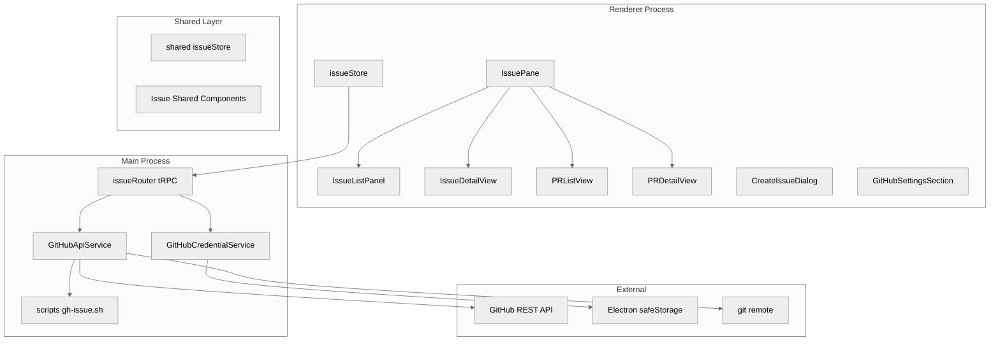
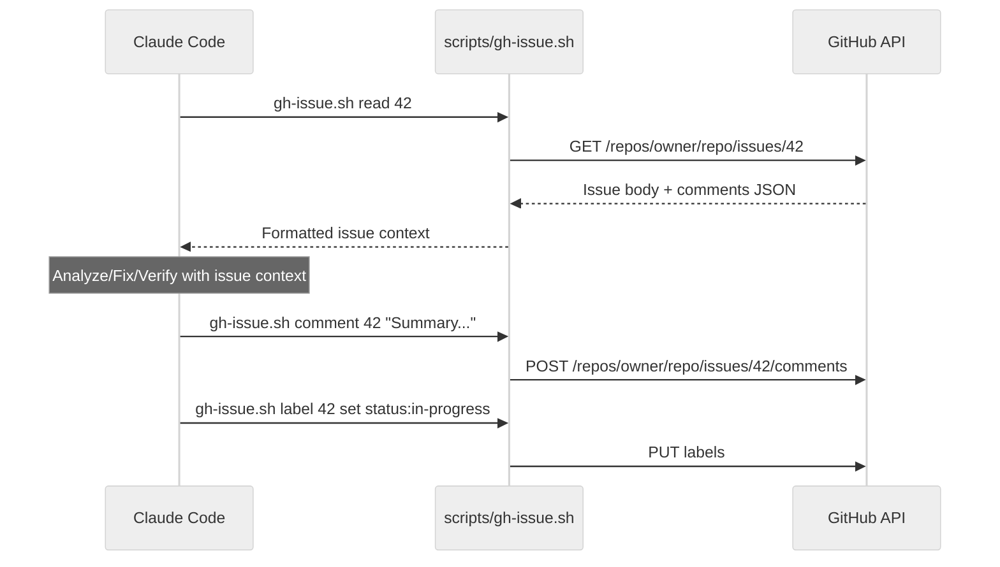
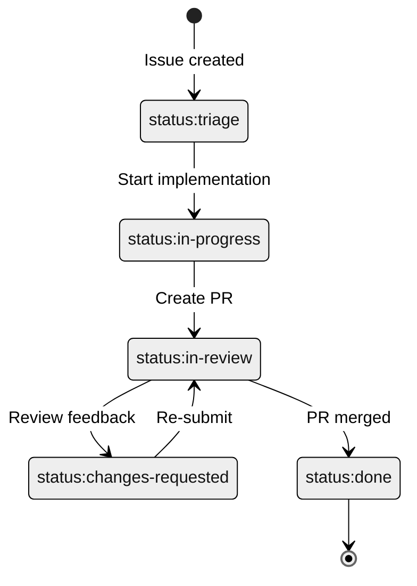
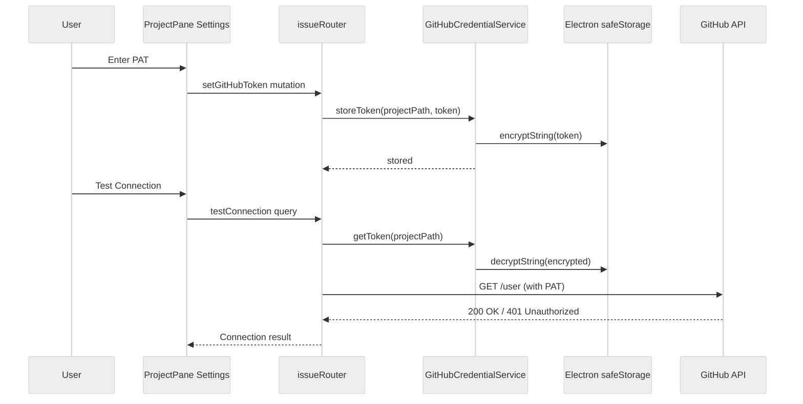
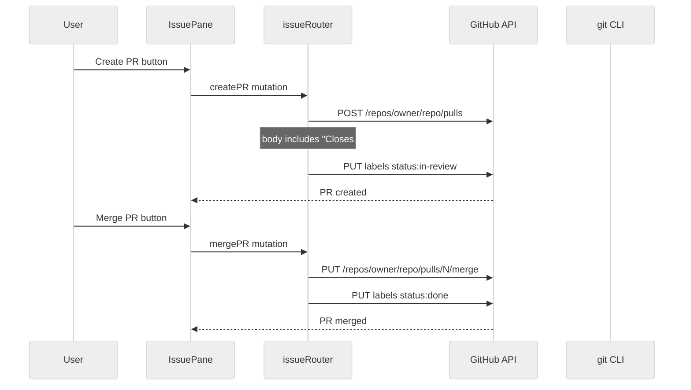
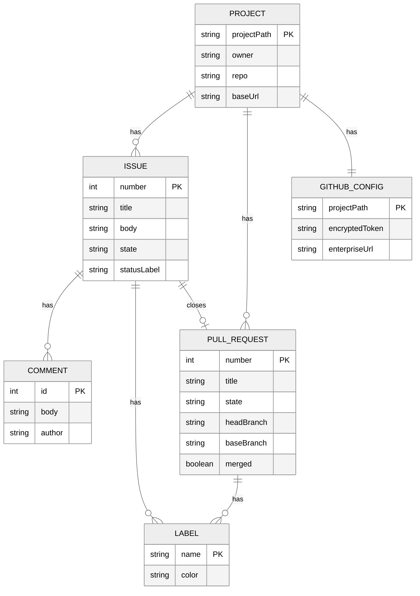

# Design: GitHub Issue Integration

## Overview

**Purpose**: GitHub/GitHub Enterprise上のIssueおよびPull Requestと連携する新しいUIペインを導入し、既存のBugsペインを完全に置き換える。Issue一覧・詳細表示、ブランチ作成、AI実装、PR作成・マージの一気通貫ワークフローを提供する。

**Users**: SDD Orchestratorを使用する開発者が、GitHub Issue起点の開発ワークフロー（トリアージ → 分析 → 修正 → 検証 → PR → マージ）をUI上で可視化・操作する。

**Impact**: 既存のBugワークフロー（UI、Store、tRPC、Service、CLI commands、templates、scripts）を全廃止し、GitHub API（SSOT）ベースのIssue連携に完全移行する。

### Goals

- GitHub APIをSSOTとしたIssue/PRワークフローの実現
- 既存Bugワークフロー関連コード・テンプレートの完全削除
- Slash Commands駆動の実作業 + UIによるGitHub情報可視化のハイブリッド方式
- Electron版・Remote UI両対応

### Non-Goals

- GitHub Projectsとの連携（カンバンボード等）
- PRレビューコメント対応UI
- GitHub Actions / CI設定・管理
- 複数リポジトリの同時管理
- OAuth / GitHub App認証
- Labelカスタマイズ（`status:` プレフィックスは固定）

## Architecture

### Existing Architecture Analysis

現在のBugワークフローは `.kiro/bugs/` ディレクトリをSSOTとするローカルファイルベース。以下のコンポーネントが関連：

- **Renderer**: `BugPane`, `BugList`, `BugWorkflowView`, `BugListItem`, `BugActionButtons`, `CreateBugDialog`, `DocsTabs`（Bugs tab）
- **Stores**: `useSharedBugStore`（shared）, `useBugAutoExecutionStore`（shared）, `bugStore`（renderer）
- **tRPC**: `bugRouter`（12プロシージャ）
- **Services**: `bugService`, `bugWorkflowService`, `bugsWatcherService`, `convertBugWorktreeService`
- **Types**: `bug.ts`, `bugJson.ts`, `bugAutoExecution.ts`
- **CLI**: `bug-create`, `bug-analyze`, `bug-fix`, `bug-verify`, `bug-status`, `bug-merge`
- **Scripts**: `create-bug-worktree.sh`, `merge-bug.sh`
- **Templates**: `.kiro/settings/templates/bugs/`

これらを全廃止し、GitHub API連携の新アーキテクチャに置き換える。

### Architecture Pattern & Boundary Map



**Key Decisions**:

- GitHub REST APIをSSOTとし、ローカルにIssue/PRデータを永続化しない（キャッシュのみ）
- PAT保存にElectron `safeStorage` APIを使用（OSキーチェーン統合）
- `scripts/gh-issue.sh` はSlash Commandsからの直接呼び出し用。UIからのAPI操作は `GitHubApiService`（Node.js `https`/`fetch`）を使用
- 既存tRPCパターン（Context DI, EventBus）を踏襲

### Technology Stack

| Layer | Choice / Version | Role in Feature | Notes |
|-------|------------------|-----------------|-------|
| Frontend | React 19, Zustand | Issue/PR表示・操作UI | 既存パターン踏襲 |
| Backend | Node.js (Electron 35.x) | GitHub API通信、認証管理 | Main Process |
| Data / Storage | Electron safeStorage | PAT暗号化保存 | OSキーチェーン統合 |
| External API | GitHub REST API v3 | Issue/PR/Label CRUD | `gh` CLI非依存、直接HTTP |
| Scripts | Bash (`gh-issue.sh`) | Slash Commands用GitHub操作 | `gh` CLI使用 |

### Command Prompt Architecture

**Execution Model**: CLI invocation

**Rationale**: Issue本文・コメントは大量テキストとなり得る。`gh-issue.sh` 経由でファイルベースのデータ交換を行い、コンテキストウィンドウ効率を確保する。



**Key Decisions**:

- Slash Commands は `gh` CLI を使用（開発者環境に高確率でインストール済み）
- UIからのAPI操作は `GitHubApiService`（Node.js直接HTTP）を使用し、`gh` CLI に依存しない
- この二重経路は意図的：Slash Commandsは開発者のターミナル環境で動作、UIはElectron Main Processで動作

## System Flows

### Issue Workflow（トリアージ → 完了）



**Key Decisions**:

- ステータスはGitHub LabelのSSOT（`status:` プレフィックス固定）
- Label自動更新はSlash Command完了時とUI操作時の両方で実行
- `status:*` Labelが存在しない場合、初回接続時に自動作成

### GitHub Authentication Flow



**Key Decisions**:

- PATはプロジェクト単位で管理（異なるリポジトリで異なるトークンを使用可能）
- `safeStorage` は `app.whenReady()` 後にのみ使用可能（初期化順序に注意）
- GitHub Enterprise対応はカスタムbaseURLで実現（`api.github.com` → `{enterprise-url}/api/v3`）

### PR Creation and Merge Flow



**Key Decisions**:

- PR description に `Closes #{number}` を自動挿入しGitHub側で自動クローズ
- マージ方式はUI上で選択可能（merge, squash, rebase）
- CIステータスの取得は `GET /repos/owner/repo/commits/{sha}/status` で実現

## Requirements Traceability

| Criterion ID | Summary | Components | Implementation Approach |
|--------------|---------|------------|------------------------|
| 1.1 | PAT入力フィールド | GitHubSettingsSection | 新規実装 |
| 1.2 | safeStorage暗号化保存 | GitHubCredentialService | 新規実装 |
| 1.3 | GitHub Enterprise URL対応 | GitHubApiService, GitHubSettingsSection | 新規実装 |
| 1.4 | git remoteからowner/repo自動検出 | GitHubApiService | 新規実装 |
| 1.5 | 無効PAT時のエラー表示 | GitHubSettingsSection, issueRouter | 新規実装 |
| 1.6 | 接続テスト機能 | GitHubSettingsSection, issueRouter | 新規実装 |
| 2.1 | BugsタブをIssuesタブに置換 | DocsTabs, IssuePane | 既存DocsTabs改修 + 新規IssuePane |
| 2.2 | Open Issue一覧表示 | IssueListPanel, issueStore | 新規実装 |
| 2.3 | Label/assignee/milestoneフィルタ | IssueListPanel | 新規実装 |
| 2.4 | Issue詳細表示 | IssueDetailView | 新規実装 |
| 2.5 | status: Label表示 | IssueListItem, IssueDetailView | 新規実装 |
| 2.6 | ポーリング/手動リフレッシュ | issueStore, issueRouter | 新規実装（手動リフレッシュ + 60秒ポーリング） |
| 3.1 | Issue作成UI | CreateIssueDialog | 新規実装 |
| 3.2 | GitHub API経由でIssue作成 | issueRouter, GitHubApiService | 新規実装 |
| 3.3 | status:triage Label自動付与 | GitHubApiService | 新規実装 |
| 3.4 | タイトル・本文・Label・assignee入力 | CreateIssueDialog | 新規実装 |
| 4.1 | 固定Label体系 | GitHubApiService | 新規実装 |
| 4.2 | Label自動更新 | GitHubApiService, issueRouter | 新規実装 |
| 4.3 | Label自動作成 | GitHubApiService | 新規実装（初回接続時） |
| 5.1 | Worktreeモードブランチ作成 | issueRouter, worktreeService | 既存worktreeService拡張 |
| 5.2 | ダイレクトモード | issueRouter | 新規実装（Label更新のみ） |
| 5.3 | 実装モード選択UI | IssueDetailView | 新規実装 |
| 5.4 | ブランチ作成時Label更新 | issueRouter, GitHubApiService | 新規実装 |
| 6.1 | issue-analyze, issue-fix, issue-verify, issue-ask | Slash Command templates | 新規実装 |
| 6.2 | gh-issue.sh経由コンテキスト注入 | Slash Command templates | 新規実装 |
| 6.3 | 実行結果をIssueコメントに投稿 | Slash Command templates, gh-issue.sh | 新規実装 |
| 6.4 | Label自動更新 | Slash Command templates, gh-issue.sh | 新規実装 |
| 6.5 | 旧bug-*コマンド全廃止 | commands/bug/ | 削除 |
| 7.1 | gh-issue.sh単一エントリポイント | scripts/gh-issue.sh | 新規実装 |
| 7.2 | サブコマンド（read, comment, label, list, create） | scripts/gh-issue.sh | 新規実装 |
| 7.3 | PAT取得（環境変数 or safeStorage） | scripts/gh-issue.sh | 新規実装（環境変数 `GITHUB_TOKEN` 優先） |
| 7.4 | GitHub Enterprise URL対応 | scripts/gh-issue.sh | 新規実装 |
| 7.5 | git remote自動検出 | scripts/gh-issue.sh | 新規実装 |
| 8.1 | PR自動作成 | issueRouter, GitHubApiService | 新規実装 |
| 8.2 | PR一覧表示 | PRListView | 新規実装 |
| 8.3 | PR diff・CIステータス表示 | PRDetailView | 新規実装 |
| 8.4 | PRマージUI | PRDetailView, issueRouter | 新規実装 |
| 8.5 | マージ時Label更新 | issueRouter, GitHubApiService | 新規実装 |
| 9.1 | Issueコンテキスト自動注入 | agentProcess（拡張）, issueStore | 既存agentProcess拡張 |
| 9.2 | Agent結果をIssueコメント投稿 | agentProcess（拡張）, GitHubApiService | 既存agentProcess拡張 |
| 9.3 | 既存Agent起動UI使用 | AgentListPanel | 既存UI活用（変更なし） |
| 9.4 | Agent実行中のLabel維持 | agentProcess（拡張） | 既存agentProcess拡張 |
| 10.1 | Rendererコンポーネント削除 | BugPane, BugList, BugWorkflowView, BugListItem | 削除 |
| 10.2 | Store削除 | useSharedBugStore, useBugAutoExecutionStore | 削除 |
| 10.3 | tRPCルーター削除 | bugRouter | 削除 |
| 10.4 | Mainサービス削除 | bugService, bugsWatcherService等 | 削除 |
| 10.5 | CLIコマンド削除 | bug-create, bug-analyze等 | 削除 |
| 10.6 | テンプレート削除 | templates/bugs/ | 削除 |
| 10.7 | スクリプト削除 | create-bug-worktree.sh, merge-bug.sh | 削除 |
| 10.8 | sdd-orchestrator.jsonのbugプリセット削除 | commandsetVersionService | 既存ロジック改修 |
| 10.9 | CLAUDE.md Bug Fixセクション置換 | CLAUDE.md template | テンプレート改修 |
| 10.10 | 型定義削除 | bug.ts, bugJson.ts, bugAutoExecution.ts | 削除 |
| 11.1 | Remote UI Issue一覧・詳細 | DesktopLayout, IssueListPanel | 新規実装（shared components使用） |
| 11.2 | Remote UIフィルタリング | IssueListPanel | 新規実装（shared components使用） |
| 11.3 | Remote UI Issue作成 | CreateIssueDialogRemote | 新規実装 |
| 11.4 | DesktopLayout準拠 | DesktopLayout | 既存レイアウト改修 |
| 11.5 | WebSocketApiClient経由呼び出し | WebSocketApiClient, webSocketHandler | 既存パターン拡張 |
| 12.1 | ProjectPaneにGitHub設定追加 | GitHubSettingsSection, ProjectPane | 新規セクション追加 |
| 12.2 | PAT・Enterprise URL設定UI | GitHubSettingsSection | 新規実装 |
| 12.3 | git remoteからowner/repo自動検出表示 | GitHubSettingsSection | 新規実装 |
| 12.4 | 接続ステータス表示 | GitHubSettingsSection | 新規実装 |

### Coverage Validation Checklist

- [x] Every criterion ID from requirements.md appears in the table above
- [x] Each criterion has specific component names (not generic references)
- [x] Implementation approach distinguishes "reuse existing" vs "new implementation"
- [x] User-facing criteria specify concrete UI components

## Components and Interfaces

| Component | Domain/Layer | Intent | Req Coverage | Key Dependencies | Contracts |
|-----------|--------------|--------|--------------|-----------------|-----------|
| GitHubApiService | Main/Service | GitHub REST API通信 | 1.3, 1.4, 3.2, 4.1-4.3, 7.1-7.5, 8.1, 8.4-8.5 | GitHubCredentialService (P0) | Service |
| GitHubCredentialService | Main/Service | PAT暗号化保存・取得 | 1.1, 1.2, 1.5 | Electron safeStorage (P0) | Service |
| issueRouter | Main/tRPC | Issue/PR tRPCプロシージャ | 2.2-2.6, 3.2-3.3, 5.1-5.4, 8.1-8.5 | GitHubApiService (P0), EventBus (P0) | Service |
| issueStore (shared) | Shared/Store | Issue/PR状態管理 | 2.2, 2.6, 9.1 | issueRouter (P0) | State |
| IssuePane | Shared/UI | Issueペイン統合コンポーネント | 2.1 | IssueListPanel (P0), IssueDetailView (P0), PRListView (P0), PRDetailView (P0) | - |
| IssueListPanel | Shared/UI | Issue一覧表示・フィルタ | 2.2, 2.3, 2.5 | issueStore (P0) | - |
| IssueDetailView | Shared/UI | Issue詳細・操作 | 2.4, 2.5, 5.3 | issueStore (P0) | - |
| PRListView | Shared/UI | PR一覧表示 | 8.2 | issueStore (P0) | - |
| PRDetailView | Shared/UI | PR詳細・diff・マージ | 8.3, 8.4 | issueStore (P0) | - |
| CreateIssueDialog | Renderer/UI | Issue作成ダイアログ（Electron） | 3.1, 3.4 | issueRouter (P0) | - |
| CreateIssueDialogRemote | RemoteUI/UI | Issue作成ダイアログ（Remote） | 11.3 | WebSocketApiClient (P0) | - |
| GitHubSettingsSection | Shared/UI | GitHub認証設定セクション | 1.1, 1.5, 1.6, 12.1-12.4 | issueRouter (P0) | - |
| IssueListItem | Shared/UI | Issue一覧行 | 2.5 | - | - |
| gh-issue.sh | Scripts | GitHub API操作スクリプト | 6.2, 7.1-7.5 | gh CLI (P0) | - |
| issue-analyze.md | Commands | 原因分析コマンド | 6.1 | gh-issue.sh (P0) | - |
| issue-fix.md | Commands | 修正コマンド | 6.1 | gh-issue.sh (P0) | - |
| issue-verify.md | Commands | 検証コマンド | 6.1 | gh-issue.sh (P0) | - |
| issue-ask.md | Commands | 汎用プロンプトコマンド | 6.1 | gh-issue.sh (P0) | - |

### Main Process / Service Layer

#### GitHubApiService

| Field | Detail |
|-------|--------|
| Intent | GitHub REST API v3との通信を担当。Issue/PR/Label CRUDを提供 |
| Requirements | 1.3, 1.4, 3.2, 4.1-4.3, 8.1, 8.4-8.5 |

**Responsibilities & Constraints**

- GitHub REST API v3 への全HTTP通信を一元管理
- owner/repo の自動検出（`git remote get-url origin` のパース）
- GitHub Enterprise対応（カスタムbaseURL）
- `status:*` Labelの自動作成（初回接続時にリポジトリのLabel一覧を確認し、不足分を作成）
- レート制限ヘッダー（`X-RateLimit-Remaining`）の監視
- PAT取得フォールバック: `GitHubCredentialService.getToken()` がnullの場合（safeStorage非対応環境含む）、`GITHUB_TOKEN` 環境変数をフォールバックとして参照

**Dependencies**

- Inbound: issueRouter — Issue/PR/Label操作の委譲先 (P0)
- Outbound: GitHubCredentialService — PAT取得 (P0)
- External: GitHub REST API v3 — データソース (P0)

**Contracts**: Service [x]

##### Service Interface

```typescript
interface GitHubRepoInfo {
  owner: string;
  repo: string;
  baseUrl: string; // "https://api.github.com" or enterprise URL
}

interface GitHubIssue {
  number: number;
  title: string;
  body: string;
  state: "open" | "closed";
  labels: GitHubLabel[];
  assignees: GitHubUser[];
  milestone: GitHubMilestone | null;
  created_at: string;
  updated_at: string;
  comments: number;
  pull_request?: { url: string };
  user: GitHubUser;
}

interface GitHubLabel {
  name: string;
  color: string;
  description: string | null;
}

interface GitHubUser {
  login: string;
  avatar_url: string;
}

interface GitHubMilestone {
  title: string;
  number: number;
}

interface GitHubComment {
  id: number;
  body: string;
  user: GitHubUser;
  created_at: string;
  updated_at: string;
}

interface GitHubPullRequest {
  number: number;
  title: string;
  body: string;
  state: "open" | "closed" | "merged";
  head: { ref: string; sha: string };
  base: { ref: string };
  mergeable: boolean | null;
  merged: boolean;
  labels: GitHubLabel[];
  user: GitHubUser;
  created_at: string;
  updated_at: string;
  diff_url: string;
}

interface PRFile {
  sha: string;
  filename: string;
  status: "added" | "removed" | "modified" | "renamed" | "copied" | "changed" | "unchanged";
  additions: number;
  deletions: number;
  changes: number;
  patch?: string;
}

interface CIStatus {
  state: "pending" | "success" | "failure" | "error";
  statuses: Array<{ context: string; state: string; description: string; target_url: string }>;
}

interface GitHubApiService {
  // Repository
  detectRepoInfo(projectPath: string): Promise<Result<GitHubRepoInfo, GitHubApiError>>;

  // Issues
  listIssues(projectPath: string, filters?: IssueFilters): Promise<Result<GitHubIssue[], GitHubApiError>>;
  getIssue(projectPath: string, number: number): Promise<Result<GitHubIssue, GitHubApiError>>;
  createIssue(projectPath: string, input: CreateIssueInput): Promise<Result<GitHubIssue, GitHubApiError>>;
  getIssueComments(projectPath: string, number: number): Promise<Result<GitHubComment[], GitHubApiError>>;
  addIssueComment(projectPath: string, number: number, body: string): Promise<Result<GitHubComment, GitHubApiError>>;

  // Labels
  setIssueLabels(projectPath: string, number: number, labels: string[]): Promise<Result<GitHubLabel[], GitHubApiError>>;
  updateStatusLabel(projectPath: string, number: number, newStatus: StatusLabel): Promise<Result<void, GitHubApiError>>;
  ensureStatusLabels(projectPath: string): Promise<Result<void, GitHubApiError>>;

  // Pull Requests
  listPullRequests(projectPath: string, filters?: PRFilters): Promise<Result<GitHubPullRequest[], GitHubApiError>>;
  getPullRequest(projectPath: string, number: number): Promise<Result<GitHubPullRequest, GitHubApiError>>;
  createPullRequest(projectPath: string, input: CreatePRInput): Promise<Result<GitHubPullRequest, GitHubApiError>>;
  mergePullRequest(projectPath: string, number: number, method: MergeMethod): Promise<Result<void, GitHubApiError>>;
  getPRCIStatus(projectPath: string, sha: string): Promise<Result<CIStatus, GitHubApiError>>;
  getPRFiles(projectPath: string, number: number): Promise<Result<PRFile[], GitHubApiError>>;

  // Connection
  testConnection(projectPath: string): Promise<Result<GitHubUser, GitHubApiError>>;
}

type StatusLabel = "triage" | "in-progress" | "in-review" | "changes-requested" | "done";
type MergeMethod = "merge" | "squash" | "rebase";

interface IssueFilters {
  state?: "open" | "closed" | "all";
  labels?: string[];
  assignee?: string;
  milestone?: number;
  page?: number;
  per_page?: number; // default 30, max 100
}

interface PRFilters {
  state?: "open" | "closed" | "all";
  head?: string;
  base?: string;
  page?: number;
  per_page?: number; // default 30, max 100
}

interface CreateIssueInput {
  title: string;
  body: string;
  labels?: string[];
  assignees?: string[];
}

interface CreatePRInput {
  title: string;
  body: string;
  head: string;
  base: string;
  issueNumber?: number; // for "Closes #N" in body
}

interface GitHubApiError {
  type: "AUTH_FAILED" | "NOT_FOUND" | "RATE_LIMIT" | "NETWORK_ERROR" | "REPO_DETECT_FAILED" | "VALIDATION_ERROR";
  message: string;
  statusCode?: number;
  retryAfter?: number; // seconds, for rate limit
}
```

- Preconditions: PAT must be configured and valid for the project
- Postconditions: All mutations update GitHub state atomically
- Invariants: owner/repo detection is consistent across calls for the same projectPath

#### GitHubCredentialService

| Field | Detail |
|-------|--------|
| Intent | GitHub PATの暗号化保存・取得を担当 |
| Requirements | 1.1, 1.2 |

**Responsibilities & Constraints**

- Electron `safeStorage` APIを使用したPAT暗号化・復号
- プロジェクトパスをキーとしたトークン管理
- GitHub Enterprise URLの保存・取得
- `app.whenReady()` 後にのみ動作可能

**Dependencies**

- Inbound: GitHubApiService — PAT取得 (P0)
- Inbound: issueRouter — トークン保存・削除 (P0)
- External: Electron safeStorage API — 暗号化基盤 (P0)
- External: electron-store — 暗号化済みトークンの永続化 (P0)

**Contracts**: Service [x]

##### Service Interface

```typescript
interface GitHubCredentialService {
  storeToken(projectPath: string, token: string): void;
  getToken(projectPath: string): string | null;
  removeToken(projectPath: string): void;
  storeEnterpriseUrl(projectPath: string, url: string): void;
  getEnterpriseUrl(projectPath: string): string | null;
  removeEnterpriseUrl(projectPath: string): void;
  hasCredentials(projectPath: string): boolean;
}
```

- Preconditions: `safeStorage.isEncryptionAvailable()` must return true for token storage/retrieval. If false, UI displays a warning and guides user to set `GITHUB_TOKEN` environment variable as fallback（`GitHubApiService` が環境変数を参照）
- Postconditions: Stored tokens are encrypted at rest using OS keychain
- Invariants: Token is never stored in plaintext

#### issueRouter (tRPC)

| Field | Detail |
|-------|--------|
| Intent | Issue/PR関連のtRPCプロシージャを提供 |
| Requirements | 2.2-2.6, 3.2-3.3, 5.1-5.4, 8.1-8.5 |

**Responsibilities & Constraints**

- GitHub API操作のtRPCインターフェース
- Zodスキーマによる入出力バリデーション
- EventBus経由のリアルタイム通知（Issue更新、PR状態変更）
- 既存bugRouterを完全置換

**Dependencies**

- Inbound: Renderer/RemoteUI stores — UI操作 (P0)
- Outbound: GitHubApiService — GitHub API通信 (P0)
- Outbound: GitHubCredentialService — 認証管理 (P0)
- Outbound: EventBus — リアルタイム通知 (P0)
- Outbound: worktreeService — ブランチ/Worktree作成 (P1)

**Contracts**: Service [x] / Event [x]

##### Service Interface

```typescript
// tRPC procedures (Zod-validated)
interface IssueRouterProcedures {
  // Queries
  listIssues: Query<{ projectPath: string; filters?: IssueFilters }, GitHubIssue[]>;
  getIssue: Query<{ projectPath: string; number: number }, GitHubIssue>;
  getIssueComments: Query<{ projectPath: string; number: number }, GitHubComment[]>;
  listPullRequests: Query<{ projectPath: string; filters?: PRFilters }, GitHubPullRequest[]>;
  getPullRequest: Query<{ projectPath: string; number: number }, GitHubPullRequest>;
  getPRCIStatus: Query<{ projectPath: string; sha: string }, CIStatus>;
  getPRFiles: Query<{ projectPath: string; number: number }, PRFile[]>;
  testConnection: Query<{ projectPath: string }, GitHubUser>;
  getConnectionStatus: Query<{ projectPath: string }, ConnectionStatus>;
  detectRepoInfo: Query<{ projectPath: string }, GitHubRepoInfo>;

  // Mutations
  createIssue: Mutation<{ projectPath: string; title: string; body: string; labels?: string[]; assignees?: string[] }, GitHubIssue>;
  addIssueComment: Mutation<{ projectPath: string; number: number; body: string }, GitHubComment>;
  updateStatusLabel: Mutation<{ projectPath: string; number: number; status: StatusLabel }, void>;
  createPullRequest: Mutation<{ projectPath: string; title: string; body: string; head: string; base: string; issueNumber?: number }, GitHubPullRequest>;
  mergePullRequest: Mutation<{ projectPath: string; number: number; method: MergeMethod }, void>;
  startImplementation: Mutation<{ projectPath: string; issueNumber: number; mode: "worktree" | "direct" }, { branch: string }>;

  // Credentials
  setGitHubToken: Mutation<{ projectPath: string; token: string }, void>;
  removeGitHubToken: Mutation<{ projectPath: string }, void>;
  setEnterpriseUrl: Mutation<{ projectPath: string; url: string }, void>;
}

interface ConnectionStatus {
  configured: boolean;
  connected: boolean;
  user: GitHubUser | null;
  repoInfo: GitHubRepoInfo | null;
  error: string | null;
}
```

##### Event Contract

- Published events:
  - `issueListUpdated` — Issue一覧が更新されたとき
  - `issueDetailUpdated` — 個別Issueが更新されたとき
  - `prListUpdated` — PR一覧が更新されたとき
  - `githubConnectionChanged` — 接続状態が変化したとき
- Ordering / delivery: Best-effort, EventBus経由

### Shared / Store Layer

#### issueStore (shared)

| Field | Detail |
|-------|--------|
| Intent | Issue/PR状態のクライアントサイドキャッシュ |
| Requirements | 2.2, 2.6, 9.1 |

**Responsibilities & Constraints**

- GitHub Issue/PR一覧のクライアントサイドキャッシュ（SSOTはGitHub API）
- 選択中Issue/PR状態の管理
- フィルタ状態の管理
- ポーリング制御（60秒間隔、手動リフレッシュ対応）

**Dependencies**

- Inbound: IssuePane, IssueListPanel, IssueDetailView — UI状態参照 (P0)
- Outbound: issueRouter (vanillaClient) — データ取得・更新 (P0)
- Outbound: EventBus (Subscription) — リアルタイム更新通知 (P0)

**Contracts**: State [x]

##### State Management

```typescript
interface IssueStoreState {
  // Data (cache from GitHub API)
  issues: GitHubIssue[];
  pullRequests: GitHubPullRequest[];
  selectedIssueNumber: number | null;
  selectedPRNumber: number | null;
  issueDetail: GitHubIssue | null;
  issueComments: GitHubComment[];
  prDetail: GitHubPullRequest | null;

  // Connection
  connectionStatus: ConnectionStatus;

  // Filters
  filters: IssueFilters;

  // Pagination
  hasMore: boolean; // trueの場合、次ページのIssueが存在する
  currentPage: number; // 現在読み込み済みのページ番号

  // Loading
  isLoading: boolean;
  error: string | null;

  // Actions
  loadIssues: (projectPath: string) => Promise<void>;
  loadMoreIssues: (projectPath: string) => Promise<void>; // 次ページを追加読み込み
  loadPullRequests: (projectPath: string) => Promise<void>;
  selectIssue: (number: number | null) => void;
  selectPR: (number: number | null) => void;
  setFilters: (filters: Partial<IssueFilters>) => void;
  refresh: (projectPath: string) => Promise<void>;
  checkConnection: (projectPath: string) => Promise<void>;
  reset: () => void;
}
```

- Persistence: なし（メモリキャッシュのみ、SSOTはGitHub）
- Concurrency: ポーリングと手動リフレッシュの競合は最新結果を優先

### Scripts

#### scripts/gh-issue.sh

| Field | Detail |
|-------|--------|
| Intent | Slash Commandsから呼び出されるGitHub API操作スクリプト |
| Requirements | 6.2, 7.1-7.5 |

**Responsibilities & Constraints**

- `gh` CLIを使用したGitHub API操作（`gh` CLI依存）
- サブコマンド形式（`read`, `comment`, `label`, `list`, `create`）
- `GITHUB_TOKEN` 環境変数優先、未設定時は `gh auth status` でフォールバック
- GitHub Enterprise対応（`GH_HOST` 環境変数）
- git remoteからowner/repoを自動検出

**Dependencies**

- External: `gh` CLI (P0)
- External: git — remote URL検出 (P0)

**Implementation Notes**

- `gh` CLI未インストール時は明確なエラーメッセージで案内
- 出力フォーマットはMarkdown（Claude Codeが直接読み取り可能）

### UI Components (Summary)

以下のUIコンポーネントは既存パターンに準拠したプレゼンテーションコンポーネントであり、インターフェースは直感的なため詳細ブロックを省略する。

| Component | Location | Notes |
|-----------|----------|-------|
| IssuePane | shared/components/issue/ | BugPaneと同等構造。IssueList + Detail + PR統合 |
| IssueListPanel | shared/components/issue/ | SpecListPanel同等のリスト + フィルタUI。「もっと読み込む」ボタンによるページネーション（per_page: 30、次ページ追加読み込み）対応 |
| IssueListItem | shared/components/issue/ | SpecListItem同等。status: Label色分け表示 |
| IssueDetailView | shared/components/issue/ | Issue本文（Markdown）、コメント、Label、操作ボタン |
| PRListView | shared/components/issue/ | IssueListPanel内のサブタブとして表示 |
| PRDetailView | shared/components/issue/ | ファイル変更リスト + patchベースdiff表示、CIステータス、マージボタン。GitHub API `GET /repos/{owner}/{repo}/pulls/{number}/files` でファイル一覧とpatchを取得し、コードブロックで表示。Syntax highlightingは初期実装ではなし |
| CreateIssueDialog | renderer/components/ | CreateBugDialog同等のモーダルダイアログ |
| CreateIssueDialogRemote | remote-ui/components/ | CreateBugDialogRemote同等 |
| GitHubSettingsSection | shared/components/project/ | ProjectPaneに追加するGitHub設定セクション |
| StatusLabelBadge | shared/components/issue/ | status: Label表示用バッジコンポーネント |

## Data Models

### Domain Model



**Key Points**:

- SSOTはGitHub API。ローカルにはPATの暗号化保存とUIキャッシュのみ
- `GITHUB_CONFIG` は `electron-store` に永続化（暗号化済みトークン + Enterprise URL）
- Issue/PR/Comment/Labelはすべてメモリキャッシュ（ポーリングまたは手動更新）

### Data Contracts

**tRPC Input/Output**: 全プロシージャにZodスキーマを定義。上記Service Interfaceの型定義に準拠。

**WebSocket API**: 既存 `webSocketHandler.ts` のパターンに従い、Issue関連メッセージタイプを追加：
- `GET_ISSUES`, `GET_ISSUE_DETAIL`, `GET_PULL_REQUESTS`, `CREATE_ISSUE`, `GET_GITHUB_CONNECTION_STATUS`

## Error Handling

### Error Strategy

| Error Category | Example | Response |
|---------------|---------|----------|
| AUTH_FAILED | PAT無効/期限切れ | UIにエラー表示 + 再設定促進 |
| RATE_LIMIT | API制限超過 | `retryAfter` 秒後に自動リトライ + UI通知 |
| NOT_FOUND | Issue/PR不存在 | エラーメッセージ表示 |
| NETWORK_ERROR | GitHub到達不可 | オフライン表示 + キャッシュ表示継続 |
| REPO_DETECT_FAILED | git remote未設定 | 設定案内表示 |
| VALIDATION_ERROR | 入力バリデーション失敗 | フィールドレベルエラー |

### Monitoring

- GitHub API レート制限残数のログ出力（ProjectLogger）
- 認証エラー発生時のログ出力
- ネットワークエラーのリトライログ

## Testing Strategy

### Unit Tests

- `GitHubApiService`: API通信のモック、owner/repo検出、エラーハンドリング
- `GitHubCredentialService`: safeStorage暗号化・復号、トークン管理
- `issueStore`: 状態管理、フィルタ、ポーリング制御
- `gh-issue.sh`: サブコマンド解析、出力フォーマット（batsまたは手動テスト）

### Integration Tests

- `issueRouter`: tRPCプロシージャのend-to-end（GitHubApiServiceモック）
- Issue作成 → Label自動付与 → ステータス更新フロー
- PR作成 → マージ → Label更新フロー

### E2E Tests

- Issue一覧表示・フィルタ操作
- Issue作成ダイアログの動作
- GitHub設定画面のPAT入力・接続テスト
- DocsTabs の Issues タブ切り替え

## Integration Test Strategy

### Issue CRUD Flow

- **Components**: issueRouter, GitHubApiService (mocked), issueStore
- **Data Flow**: UI action → tRPC mutation → GitHubApiService → mocked HTTP → EventBus → Store update
- **Mock Boundaries**: GitHubApiServiceのHTTPレイヤーをモック（`fetch` or `https.request`）、tRPC Contextは `createTestContext` を使用
- **Verification Points**: Issue作成後のstore状態、Label更新後のEventBus発火
- **Robustness Strategy**: `waitFor` パターンでEventBus経由の非同期状態更新を待機。固定sleepは使用しない
- **Prerequisites**: `createTestContext` にissueRouter用サービスモックを追加

### Credential Flow

- **Components**: GitHubCredentialService, issueRouter, GitHubSettingsSection
- **Data Flow**: PAT入力 → tRPC mutation → safeStorage encrypt → store → decrypt → API test
- **Mock Boundaries**: Electron `safeStorage` APIをモック。実際の暗号化は行わない
- **Verification Points**: トークン保存後に`hasCredentials`がtrue、接続テスト結果がUIに反映
- **Robustness Strategy**: safeStorage APIの同期的性質により、非同期タイミング問題は発生しない

## Security Considerations

- PATは `safeStorage` で暗号化しOSキーチェーンに保存。メモリ上での保持は最小限
- Renderer ProcessにPATを直接渡さない（Main Process経由でのみAPI呼び出し）
- GitHub Enterprise URLのバリデーション（SSRF防止）
- `gh-issue.sh` はPATを環境変数経由で受け取り、コマンドライン引数には含めない

## Design Decisions

### DD-001: GitHub APIをSSOTとする設計

| Field | Detail |
|-------|--------|
| Status | Accepted |
| Context | Issueワークフロー管理をローカルファイル（旧`.kiro/bugs/`）で行うか、GitHub APIをSSOTとするか |
| Decision | GitHub APIをSSOTとし、ローカルファイルでのIssue状態管理を行わない |
| Rationale | Issueは調査・議論・証跡といった会話型ワークフローであり、GitHubのIssue/PRが最適。ローカルファイルオリジンでは同期問題が発生する |
| Alternatives Considered | (1) ローカルファイルSSOT — 同期問題、(2) ハイブリッド（ローカル+GitHub） — 二重管理の複雑さ |
| Consequences | ネットワーク接続必須、オフライン時はキャッシュ表示のみ。GitHub APIレート制限への対応が必要 |

### DD-002: ハイブリッド操作方式（UI + Slash Commands）

| Field | Detail |
|-------|--------|
| Status | Accepted |
| Context | すべてUI+API経由にするか、Slash Commands駆動を維持するか |
| Decision | UIはGitHub情報の可視化・GitHub固有操作に専念。実作業（分析・修正・検証）はSlash Commandsで行う |
| Rationale | Specワークフローと同じコマンド駆動の体験を維持。各フェーズで人間が判断を挟める |
| Alternatives Considered | (1) 全UI — 既存ワークフローから異質、(2) 全CLI — GitHub情報の可視化が不便 |
| Consequences | `gh` CLIとNode.js HTTP通信の二重経路が存在するが、責務が明確に分離されている |

### DD-003: GitHub LabelベースのステータスIssue管理

| Field | Detail |
|-------|--------|
| Status | Accepted |
| Context | Issue State（Open/Closed）、GitHub Projects、Labelのいずれでステータスを管理するか |
| Decision | `status:` プレフィックス付きGitHub Labelで管理 |
| Rationale | GitHub UIでもSDD Orchestrator UIでも同じステータスが見える（SSOT）。API操作がシンプル |
| Alternatives Considered | (1) Issue State — Open/Closedの2状態のみで不足、(2) GitHub Projects — 要件外の複雑さ |
| Consequences | Label名の衝突リスク（`status:` プレフィックスで軽減）。自動作成機能で初回セットアップを簡素化 |

### DD-004: Electron safeStorage APIによるPAT保存

| Field | Detail |
|-------|--------|
| Status | Accepted |
| Context | PATの安全な保存方法（平文、electron-store暗号化、OS Keychain） |
| Decision | Electron `safeStorage` APIを使用（OS Keychain統合） |
| Rationale | OSレベルの暗号化（macOS: Keychain, Windows: DPAPI, Linux: Secret Service）。electron-storeの独自暗号化よりセキュア |
| Alternatives Considered | (1) electron-store暗号化 — 暗号鍵がアプリ内に存在、(2) node-keytar — 非推奨、(3) 環境変数のみ — 永続化不可 |
| Consequences | `app.whenReady()` 後にのみ使用可能。Linux環境では Secret Service の設定が必要な場合がある |

### DD-005: gh CLI使用（Slash Commands用）とNode.js HTTP（UI用）の二重経路

| Field | Detail |
|-------|--------|
| Status | Accepted |
| Context | GitHub API通信を統一するか、用途別に分けるか |
| Decision | Slash Commandsは `gh` CLI経由、UIからの操作はNode.js直接HTTPを使用 |
| Rationale | Slash CommandsはClaude Codeのターミナル環境で動作し`gh` CLIが自然。UIはElectron Main Processで動作しNode.js HTTPが自然。`gh` CLI未インストール環境でもUIは動作する |
| Alternatives Considered | (1) `gh` CLI統一 — UI側で子プロセス起動が必要、(2) HTTP統一 — Slash Commandsから直接HTTPは複雑 |
| Consequences | `gh` CLI未インストール時はSlash Commandsが使用不可（UIは影響なし）。Open Questionとして残る |

### DD-006: 既存Bugワークフロー全廃止

| Field | Detail |
|-------|--------|
| Status | Accepted |
| Context | 既存Bug機能との共存か完全置換か |
| Decision | UI、Store、tRPC、Service、CLI commands、templates、scriptsすべて削除 |
| Rationale | 使われていない機能を残す理由がない。Issue連携が上位互換。Dead codeは保守負債 |
| Alternatives Considered | (1) 共存 — 二重管理の複雑さ、(2) 段階的移行 — 中間状態の管理コスト |
| Consequences | 大規模な削除作業だが、コードベースの簡素化に貢献。既存のBug関連テストも全削除 |

## Integration & Deprecation Strategy

### 既存ファイルの修正が必要なもの（Wiring Points）

| File | Modification |
|------|-------------|
| `src/main/trpc/router.ts` | `bugRouter` → `issueRouter` に置換 |
| `src/main/trpc/context.ts` | `bugService` 削除、`gitHubApiService` / `gitHubCredentialService` 追加 |
| `src/main/trpc/productionServices.ts` | Bug関連サービス初期化削除、GitHub関連サービス初期化追加 |
| `src/main/trpc/helpers/projectSetup.ts` | Bug初期化ロジック削除 |
| `src/main/trpc/helpers/watcherUtils.ts` | bugsWatcher関連削除 |
| `src/main/trpc/routers/events.ts` | Bug関連Subscription削除、Issue関連Subscription追加 |
| `src/main/trpc/routers/autoExecution.ts` | BugAutoExecution関連プロシージャ削除 |
| `src/main/services/windowManager.ts` | bugStore参照削除 |
| `src/main/services/webSocketHandler.ts` | Bug関連メッセージハンドラ削除、Issue関連追加 |
| `src/main/services/remoteAccessSetup.ts` | bugsWatcher初期化削除 |
| `src/renderer/App.tsx` | `BugPane` → `IssuePane` 置換、BugStore初期化削除 |
| `src/renderer/stores/index.ts` | `useSharedBugStore` 削除、`useIssueStore` 追加 |
| `src/renderer/stores/projectStore.ts` | bugs関連state削除 |
| `src/renderer/stores/agentStore.ts` | bug entityId パターン削除、issue entityId パターン追加 |
| `src/renderer/components/DocsTabs.tsx` | Bugs tab → Issues tab 置換 |
| `src/renderer/components/index.ts` | Bug関連export削除、Issue関連export追加 |
| `src/shared/stores/index.ts` | bugStore / bugAutoExecutionStore export削除、issueStore export追加 |
| `src/shared/api/types.ts` | BugMetadataWithPath等削除、Issue関連型追加 |
| `src/remote-ui/layouts/DesktopLayout.tsx` | BugsView → IssuesView 置換 |
| `src/remote-ui/App.tsx` | Bug関連import削除、Issue関連追加 |
| `CLAUDE.md` (template) | Bug Fix Workflowセクション → Issue Workflow に置換 |
| `.kiro/sdd-orchestrator.json` | `commandsets.bug` エントリ削除 |

### 削除対象ファイル（Cleanup）

| Category | Files |
|----------|-------|
| Renderer Components | `BugPane.tsx`, `BugActionButtons.tsx`, `BugWorkflowView.tsx`, `CreateBugDialog.tsx` + tests |
| Shared Components | `shared/components/bug/BugListContainer.tsx`, `shared/components/bug/BugListItem.tsx` + tests |
| Shared Stores | `shared/stores/bugStore.ts`, `shared/stores/bugAutoExecutionStore.ts` + tests |
| tRPC Routers | `main/trpc/routers/bug.ts` + tests |
| Services | `main/services/bugService.ts`, `main/services/bugWorkflowService.ts`, `main/services/bugsWatcherService.ts`, `main/services/convertBugWorktreeService.ts`, `main/services/bugWorkflowInstaller.ts` + tests |
| Types | `renderer/types/bug.ts`, `renderer/types/bugJson.ts` + tests |
| Remote UI | `remote-ui/views/BugsView.verify-sharing.test.tsx`, `remote-ui/views/BugDetailView.test.tsx`, `remote-ui/components/BugDetailPage.test.tsx`, `CreateBugDialogRemote.tsx` |
| CLI Commands | `resources/templates/commands/bug/bug-create.md`, `bug-analyze.md`, `bug-fix.md`, `bug-verify.md`, `bug-status.md`, `bug-merge.md` |
| Templates | `resources/templates/settings/templates/bugs/` (全ファイル) |
| Scripts | `resources/templates/scripts/create-bug-worktree.sh`, `resources/templates/scripts/merge-bug.sh` |

## Interface Changes & Impact Analysis

### ContextServices変更

**変更内容**: `bugService: BugService | null` を削除し、以下を追加：
- `gitHubApiService?: GitHubApiServiceInterface`
- `gitHubCredentialService?: GitHubCredentialServiceInterface`

**影響を受けるCaller**:
- `src/main/trpc/routers/bug.ts` — 削除（issueRouterに置換）
- `src/main/trpc/helpers/test-helpers.ts` — `createMockServices` にGitHub関連モック追加
- `src/main/trpc/productionServices.ts` — サービス初期化変更
- `src/main/trpc/__tests__/context.test.ts` — テスト更新

### appRouter変更

**変更内容**: `bug: bugRouter` を `issue: issueRouter` に置換

**影響を受けるCaller**:
- Renderer: `trpc.bug.*` → `trpc.issue.*` への全呼び出し変更
- Remote UI: WebSocketハンドラのメッセージタイプ変更
- Tests: bugRouter関連テストの削除、issueRouterテスト新規作成

### DocsTabs activeTab変更

**変更内容**: `DocsTab` 型から `'bugs'` を削除し `'issues'` を追加

**影響を受けるCaller**:
- `src/renderer/App.tsx` — activeTab状態管理
- `src/renderer/components/DocsTabs.tsx` — タブ定義
- `src/remote-ui/layouts/DesktopLayout.tsx` — タブ切り替え
- `src/remote-ui/layouts/MobileLayout.tsx` — ボトムナビゲーション

### agentStore entityIdパターン変更

**変更内容**: `bug:{bugId}` パターンを `issue:{issueNumber}` に置換

**影響を受けるCaller**:
- `src/renderer/stores/agentStore.ts` — カテゴリ判定ロジック
- `src/shared/stores/agentStore.ts` — 同上
- Agent起動UIのentityId設定箇所
