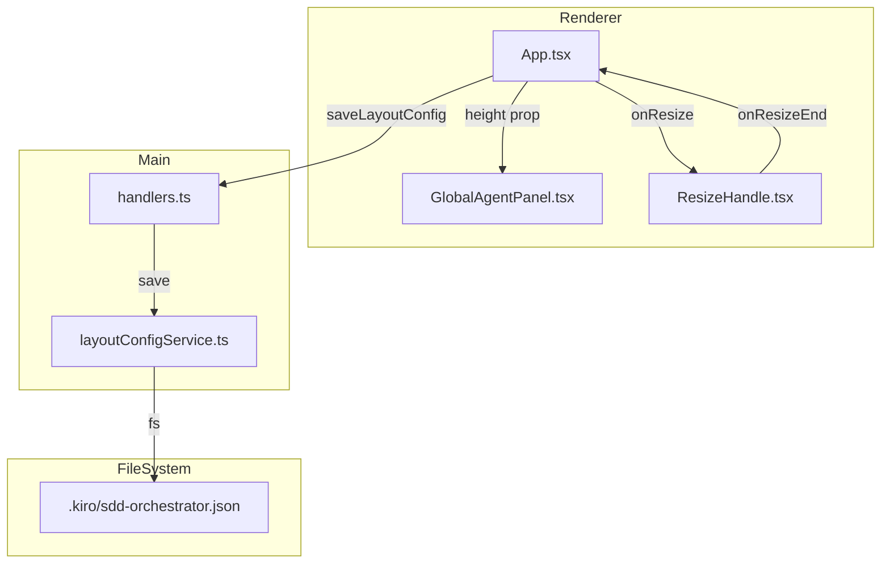

# Design Document

## Overview

**Purpose**: 本機能は、グローバルエージェント欄を常時表示し、リサイズ機能と永続化を追加することで、ユーザビリティを向上させる。

**Users**: SDD Orchestratorユーザーは、グローバルエージェントが0件でもパネルの存在を認識でき、リサイズ設定が自動保存・復元されることで、毎回の手動調整から解放される。

**Impact**: 現在の「0件時に非表示」から「常時表示」へ変更し、既存のレイアウト永続化機能を拡張して`globalAgentPanelHeight`を追加する。

### Goals

- グローバルエージェント欄を件数に関わらず常時表示
- 0件時に適切な空状態メッセージを表示
- リサイズハンドルによるパネル高さの調整機能
- リサイズ位置のプロジェクト単位での永続化
- 既存の`agentListHeight`（右サイドバー用）とは独立した設定値として管理

### Non-Goals

- グローバルエージェントの折りたたみ機能の廃止（既存の折りたたみ機能は維持）
- 複数レイアウトプリセットの管理
- パネルの完全な非表示オプション

## Architecture

### Existing Architecture Analysis

**現在の実装**:
- `GlobalAgentPanel.tsx:79-81`: グローバルエージェントが0件の場合に`return null`で完全非表示
- `App.tsx:533`: `<GlobalAgentPanel />`は左サイドバーの最下部に配置（高さ固定なし）
- `layoutConfigService.ts`: 4つのペインサイズ（`leftPaneWidth`, `rightPaneWidth`, `bottomPaneHeight`, `agentListHeight`）を永続化
- `ResizeHandle.tsx`: 水平・垂直リサイズハンドルコンポーネント（既存）

**尊重すべきパターン**:
- IPC通信: `channels.ts` + `handlers.ts` + `preload/index.ts`
- レイアウト永続化: `layoutConfigService.ts` による設定ファイル管理
- Zustand storeパターン: 状態管理と非同期アクション
- 既存の`agentListHeight`は右サイドバーのAgentListPanel用であり、本機能とは独立

### Architecture Pattern & Boundary Map



**Architecture Integration**:
- Selected pattern: 既存のレイアウト永続化パターンを拡張
- Domain/feature boundaries: `globalAgentPanelHeight`は`LayoutValues`に追加、UIコンポーネントはRendererのみ変更
- Existing patterns preserved: IPC通信パターン、Zodバリデーション、ResizeHandleコンポーネント
- New components rationale: 新規コンポーネントは不要、既存コンポーネントの拡張のみ
- Steering compliance: TypeScript strict mode、単一責任原則

### Technology Stack

| Layer | Choice / Version | Role in Feature | Notes |
|-------|------------------|-----------------|-------|
| Frontend | React 19 + TypeScript | UI変更、状態管理 | 既存パターン継続 |
| Backend | Node.js 20 + Electron 35 | レイアウト永続化 | 既存サービス拡張 |
| Data | JSON file | `.kiro/sdd-orchestrator.json` | スキーマ拡張 |
| Validation | Zod | スキーマバリデーション | 既存パターン継続 |

## Requirements Traceability

| Requirement | Summary | Components | Interfaces | Flows |
|-------------|---------|------------|------------|-------|
| 1.1, 1.2, 1.3 | 常時表示 | GlobalAgentPanel | - | - |
| 2.1, 2.2, 2.3 | 空状態メッセージ | GlobalAgentPanel | - | - |
| 3.1, 3.2, 3.3, 3.4 | リサイズ機能 | App, GlobalAgentPanel, ResizeHandle | onResize | リサイズフロー |
| 4.1, 4.2, 4.3, 4.4, 4.5 | 永続化 | App, layoutConfigService | saveLayoutConfig, loadLayoutConfig | 保存/復元フロー |
| 5.1, 5.2, 5.3 | 既存機能との分離 | layoutConfigService, App | LayoutValues | - |

## Components and Interfaces

| Component | Domain/Layer | Intent | Req Coverage | Key Dependencies | Contracts |
|-----------|--------------|--------|--------------|------------------|-----------|
| GlobalAgentPanel (extension) | Renderer/UI | 常時表示化、空状態メッセージ追加 | 1, 2 | agentStore (P0) | State |
| App.tsx (extension) | Renderer/UI | リサイズハンドル配置、高さ状態管理 | 3, 4, 5 | layoutConfigService (P0) | State |
| layoutConfigService (extension) | Main/Service | globalAgentPanelHeight追加 | 4, 5 | Zod (P0) | Service |

### Renderer / UI

#### GlobalAgentPanel (extension)

| Field | Detail |
|-------|--------|
| Intent | グローバルエージェント欄の常時表示化と空状態メッセージ表示 |
| Requirements | 1.1, 1.2, 1.3, 2.1, 2.2, 2.3 |

**Responsibilities & Constraints**
- グローバルエージェントの件数に関わらずパネルを表示
- 0件時に空状態メッセージを表示
- 既存の折りたたみ機能は維持
- `return null`を削除し、常時レンダリング

**Dependencies**
- Inbound: agentStore - グローバルエージェント一覧取得 (P0)

**Contracts**: Service [ ] / API [ ] / Event [ ] / Batch [ ] / State [x]

##### State Management

現在のPropsインターフェース（変更なし）:
```typescript
interface GlobalAgentPanelProps {
  collapsed?: boolean;
  onCollapsedChange?: (collapsed: boolean) => void;
}
```

**変更内容**:
1. `globalAgents.length === 0`時の`return null`を削除
2. 0件時に空状態メッセージを表示するロジックを追加

```typescript
// 変更前（削除）
if (globalAgents.length === 0) {
  return null;
}

// 変更後（追加）
// 0件時は空状態メッセージを表示
{globalAgents.length === 0 ? (
  <div className="px-4 py-3 text-sm text-gray-500 dark:text-gray-400">
    グローバルエージェントなし
  </div>
) : (
  <ul className="px-2 pb-2 space-y-1">
    {/* 既存のエージェントリスト */}
  </ul>
)}
```

**Implementation Notes**
- Integration: 既存の折りたたみ機能（`isCollapsed`）との共存を維持
- Validation: 空状態メッセージは折りたたみ時も非表示
- Risks: 特になし（既存機能への影響は最小限）

#### App.tsx (extension)

| Field | Detail |
|-------|--------|
| Intent | GlobalAgentPanelのリサイズハンドル配置と高さ状態管理 |
| Requirements | 3.1, 3.2, 3.3, 3.4, 4.1, 4.2, 4.3, 4.4, 4.5, 5.1, 5.2, 5.3 |

**Responsibilities & Constraints**
- `globalAgentPanelHeight`状態の追加と管理
- ResizeHandleコンポーネントの配置
- 最小/最大高さの制限
- レイアウト保存・復元への統合
- レイアウトリセット時のデフォルト値適用

**Dependencies**
- Inbound: layoutConfigService - レイアウト設定の読み書き (P0)
- Inbound: ResizeHandle - リサイズ操作 (P1)

**Contracts**: Service [ ] / API [ ] / Event [ ] / Batch [ ] / State [x]

##### State Management

```typescript
// 追加する定数
const GLOBAL_AGENT_PANEL_MIN = 80;   // 最小高さ
const GLOBAL_AGENT_PANEL_MAX = 300;  // 最大高さ

// DEFAULT_LAYOUT に追加
const DEFAULT_LAYOUT = {
  // ...既存の4プロパティ...
  globalAgentPanelHeight: 120,  // デフォルト高さ
};

// 追加する状態
const [globalAgentPanelHeight, setGlobalAgentPanelHeight] = useState(DEFAULT_LAYOUT.globalAgentPanelHeight);

// 追加するリサイズハンドラー（GlobalAgentPanelは上方向にリサイズ）
const handleGlobalAgentPanelResize = useCallback((delta: number) => {
  setGlobalAgentPanelHeight((prev) =>
    Math.min(GLOBAL_AGENT_PANEL_MAX, Math.max(GLOBAL_AGENT_PANEL_MIN, prev - delta))
  );
}, []);

// saveLayout関数の拡張
const saveLayout = useCallback(async () => {
  if (!currentProject) return;
  try {
    await window.electronAPI.saveLayoutConfig(currentProject, {
      leftPaneWidth,
      rightPaneWidth,
      bottomPaneHeight,
      agentListHeight,
      globalAgentPanelHeight,  // 追加
    });
  } catch (error) {
    console.error('[App] Failed to save layout config:', error);
  }
}, [currentProject, leftPaneWidth, rightPaneWidth, bottomPaneHeight, agentListHeight, globalAgentPanelHeight]);

// loadLayout関数の拡張
const loadLayout = useCallback(async (projectPath: string) => {
  try {
    const config = await window.electronAPI.loadLayoutConfig(projectPath);
    if (config) {
      setLeftPaneWidth(config.leftPaneWidth);
      setRightPaneWidth(config.rightPaneWidth);
      setBottomPaneHeight(config.bottomPaneHeight);
      setAgentListHeight(config.agentListHeight);
      setGlobalAgentPanelHeight(config.globalAgentPanelHeight ?? DEFAULT_LAYOUT.globalAgentPanelHeight);  // 追加
    } else {
      // デフォルト値適用（globalAgentPanelHeight含む）
    }
  } catch (error) {
    console.error('[App] Failed to load layout config:', error);
  }
}, []);

// resetLayout関数の拡張
const resetLayout = useCallback(async () => {
  // ...既存の4プロパティのリセット...
  setGlobalAgentPanelHeight(DEFAULT_LAYOUT.globalAgentPanelHeight);  // 追加
  // ...
}, [currentProject]);
```

**JSXの変更**:
```tsx
{/* 左サイドバー内のGlobalAgentPanel配置 */}
<aside style={{ width: leftPaneWidth }} className="shrink-0 flex flex-col bg-gray-50 dark:bg-gray-900">
  {/* ...既存のコンテンツ... */}

  {/* GlobalAgentPanel用リサイズハンドル */}
  <ResizeHandle direction="vertical" onResize={handleGlobalAgentPanelResize} onResizeEnd={saveLayout} />

  {/* GlobalAgentPanel */}
  <div style={{ height: globalAgentPanelHeight }} className="shrink-0 overflow-hidden">
    <GlobalAgentPanel />
  </div>
</aside>
```

**Implementation Notes**
- Integration: 既存の4つのペインサイズと同様のパターンで実装
- Validation: 最小/最大高さの制限により、パネルが見えなくなることを防止
- Risks: 古い設定ファイル（`globalAgentPanelHeight`がない）からの復元時はデフォルト値を使用

### Main / Service

#### layoutConfigService (extension)

| Field | Detail |
|-------|--------|
| Intent | LayoutValuesスキーマに`globalAgentPanelHeight`を追加 |
| Requirements | 4.1, 4.2, 4.3, 4.4, 5.1, 5.2, 5.3 |

**Responsibilities & Constraints**
- `LayoutValues`型に`globalAgentPanelHeight`プロパティを追加
- Zodスキーマの拡張
- デフォルト値の追加
- 既存の設定ファイルとの後方互換性を維持

**Dependencies**
- Outbound: Zod - スキーマバリデーション (P0)
- Outbound: fs/promises - ファイル読み書き (P0)

**Contracts**: Service [x] / API [ ] / Event [ ] / Batch [ ] / State [ ]

##### Service Interface

```typescript
// LayoutValuesSchemaの拡張
export const LayoutValuesSchema = z.object({
  leftPaneWidth: z.number().min(0),
  rightPaneWidth: z.number().min(0),
  bottomPaneHeight: z.number().min(0),
  agentListHeight: z.number().min(0),
  globalAgentPanelHeight: z.number().min(0).optional(),  // 追加（後方互換のためoptional）
});

export type LayoutValues = z.infer<typeof LayoutValuesSchema>;

// DEFAULT_LAYOUTの拡張
export const DEFAULT_LAYOUT: LayoutValues = {
  leftPaneWidth: 288,
  rightPaneWidth: 320,
  bottomPaneHeight: 192,
  agentListHeight: 160,
  globalAgentPanelHeight: 120,  // 追加
};
```

**後方互換性**:
- `globalAgentPanelHeight`はオプショナルとして定義
- 古い設定ファイルからの読み込み時は`undefined`が返る
- Renderer側でデフォルト値にフォールバック

**Implementation Notes**
- Integration: 既存のスキーマに1プロパティ追加のみ
- Validation: Zodによる型安全性を維持
- Risks: 設定ファイルのバージョンは変更不要（オプショナルプロパティのため）

## Data Models

### Domain Model

**LayoutConfig拡張**:

```typescript
interface LayoutConfig {
  version: 1;
  layout: {
    leftPaneWidth: number;
    rightPaneWidth: number;
    bottomPaneHeight: number;
    agentListHeight: number;         // 右サイドバーのAgentListPanel用
    globalAgentPanelHeight?: number; // 左サイドバーのGlobalAgentPanel用（新規）
  };
}
```

**Business Rules & Invariants**:
- `globalAgentPanelHeight`は80px以上300px以下
- `agentListHeight`と`globalAgentPanelHeight`は独立した設定値
- 旧バージョンの設定ファイルでは`globalAgentPanelHeight`が存在しない可能性あり

### Logical Data Model

**設定ファイル構造（拡張後）**:

```json
{
  "version": 1,
  "layout": {
    "leftPaneWidth": 320,
    "rightPaneWidth": 400,
    "bottomPaneHeight": 250,
    "agentListHeight": 180,
    "globalAgentPanelHeight": 140
  }
}
```

**Consistency & Integrity**:
- `globalAgentPanelHeight`が存在しない場合はデフォルト値（120）を使用
- 保存時は常に5つのプロパティすべてを出力

## Error Handling

### Error Strategy

**Fail-safe approach**: 既存のレイアウト永続化と同様、エラー発生時もUI動作は継続

### Error Categories and Responses

**System Errors**:
- 設定ファイル読み込み失敗 → デフォルト値を使用
- 設定ファイル書き込み失敗 → ログ記録、UIは継続

**Business Logic Errors**:
- `globalAgentPanelHeight`が存在しない → デフォルト値にフォールバック
- 値が範囲外 → 最小/最大値にクランプ

## Testing Strategy

### Unit Tests

- `GlobalAgentPanel.tsx`:
  - 0件時に空状態メッセージが表示される
  - 1件以上でエージェントリストが表示される
  - 折りたたみ時は空状態メッセージも非表示

- `layoutConfigService.ts`:
  - `globalAgentPanelHeight`ありの設定ファイル読み込み
  - `globalAgentPanelHeight`なしの設定ファイル読み込み（後方互換）
  - 5つのプロパティすべてを含む保存

### Integration Tests

- App.tsx:
  - リサイズ操作後に設定ファイルに`globalAgentPanelHeight`が保存される
  - 設定ファイルから`globalAgentPanelHeight`が復元される
  - レイアウトリセットで`globalAgentPanelHeight`がデフォルト値に戻る

### E2E Tests

- GlobalAgentPanelが常に表示される（0件時も）
- リサイズハンドルのドラッグでパネル高さが変更される
- アプリ再起動後にリサイズ位置が復元される
