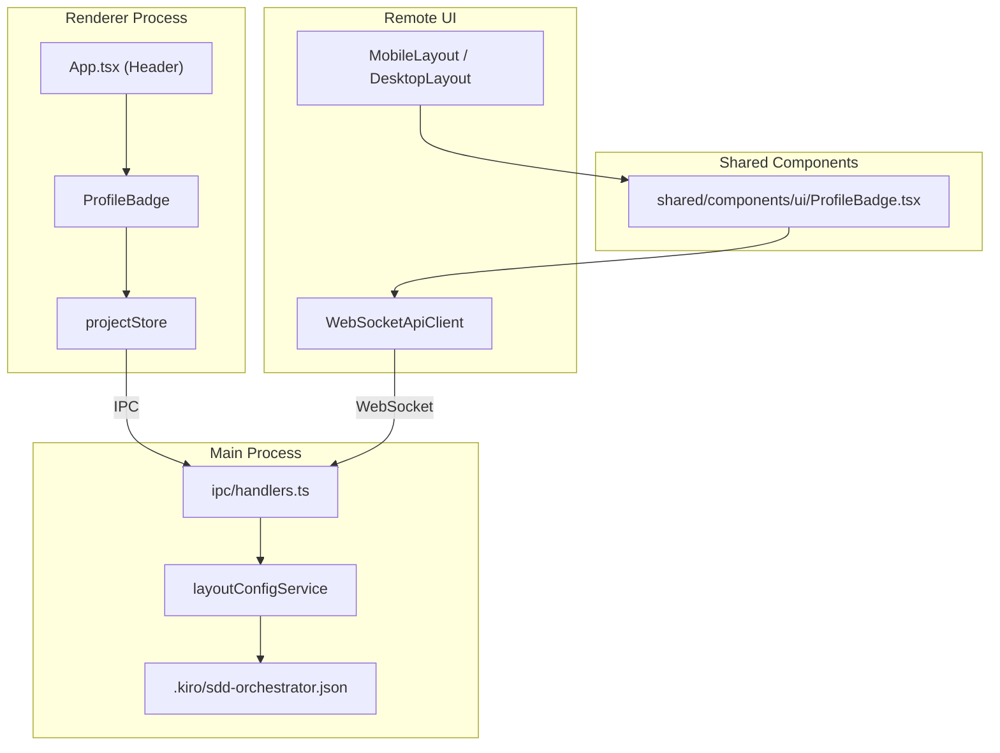
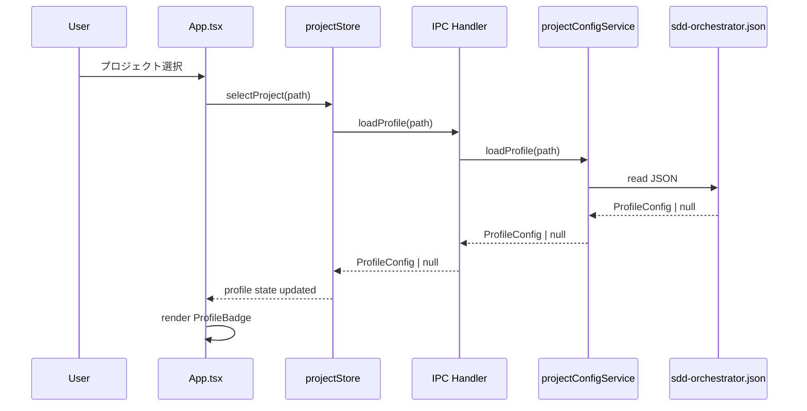
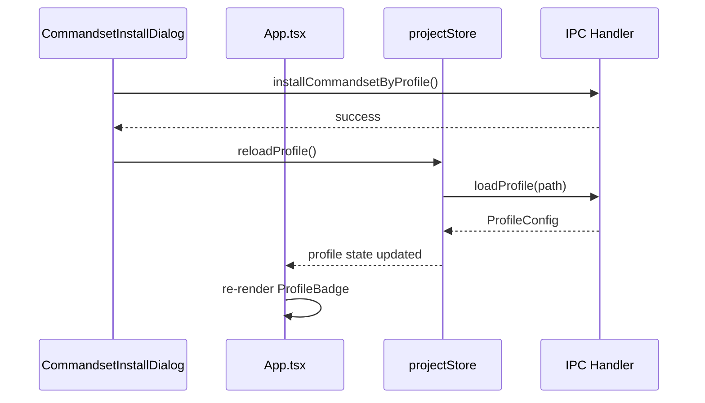

# Design Document: Header Profile Badge

## Overview

**Purpose**: ヘッダーにインストール済みプロファイル（コマンドプリセット）をバッジ表示し、ユーザーが現在のプロジェクトの設定状態を一目で把握できるようにする機能。

**Users**: Electronアプリのメインウィンドウを操作するユーザー、およびRemote UIからモバイルでアクセスするユーザー。

**Impact**: 既存のヘッダー領域にProfileBadgeコンポーネントを追加。`projectConfigService.loadProfile()`をIPC経由で公開し、レンダラープロセスからプロファイル情報を取得可能にする。

### Goals

- プロジェクト名の横にインストール済みプロファイル名（cc-sdd / cc-sdd-agent / spec-manager）をバッジ表示
- 未インストール時は「未インストール」バッジを表示
- Remote UIでも同一の表示を実現
- コマンドセットインストール完了後に自動更新

### Non-Goals

- バッジクリックによるダイアログ表示
- ツールチップ表示
- ファイルウォッチャーによるリアルタイム監視
- プロファイル切り替え機能（既存メニューを使用）

## Architecture

### Existing Architecture Analysis

- **IPC通信パターン**: `channels.ts`でチャンネル定義、`handlers.ts`でIPCMain登録、`preload/index.ts`で`window.electronAPI`に公開
- **プロファイル管理**: `layoutConfigService.ts`の`projectConfigService.loadProfile()`が既に存在
- **共有コンポーネント**: `src/shared/components/`に配置し、Electron版・Remote UI版で共有
- **Remote UI**: `WebSocketApiClient`経由でIPC-like通信を実現

### Architecture Pattern & Boundary Map



**Architecture Integration**:
- **Selected pattern**: 既存IPCパターンの拡張（新規IPCチャンネル追加）
- **Domain boundaries**: プロファイル情報取得はprojectStore経由に集約
- **Existing patterns preserved**: `projectConfigService`, IPC channelsパターン, shared componentsパターン
- **New components rationale**: ProfileBadgeはElectron/Remote UI共有のため`shared/components/ui/`に配置
- **Steering compliance**: DRY（既存サービス再利用）、関心の分離（表示/データ取得の分離）

### Technology Stack

| Layer | Choice / Version | Role in Feature | Notes |
|-------|------------------|-----------------|-------|
| Frontend | React 19 | ProfileBadgeコンポーネント | 既存スタック |
| Styling | Tailwind CSS 4 | アウトラインバッジスタイル | 既存スタック |
| Backend | Electron 35 IPC | プロファイル情報取得API | 既存パターン拡張 |
| Data | Zod | プロファイル情報バリデーション | 既存`ProfileConfigSchema` |

## System Flows

### プロファイル取得フロー



### インストール完了後の更新フロー



## Requirements Traceability

| Criterion ID | Summary | Components | Implementation Approach |
|--------------|---------|------------|------------------------|
| 1.1 | プロファイル情報のIPC公開 | `channels.ts`, `handlers.ts`, `preload/index.ts` | 新規IPCチャンネル `LOAD_PROFILE` 追加 |
| 1.2 | 未インストール時null返却 | `handlers.ts` | 既存`projectConfigService.loadProfile()`を使用 |
| 1.3 | loadProfile IPC公開 | `preload/index.ts` | `window.electronAPI.loadProfile()`追加 |
| 2.1 | インストール済みプロファイルバッジ表示 | `ProfileBadge.tsx`, `App.tsx` | 新規共有コンポーネント作成 |
| 2.2 | 未インストール時「未インストール」表示 | `ProfileBadge.tsx` | profile===null時の分岐 |
| 2.3 | 未選択時バッジ非表示 | `App.tsx` | currentProject存在チェック |
| 2.4 | アウトラインスタイル | `ProfileBadge.tsx` | Tailwind border/rounded-full |
| 2.5 | ダークモード対応 | `ProfileBadge.tsx` | dark: プレフィックス使用 |
| 3.1 | プロジェクト選択時読み込み | `projectStore.ts` | selectProject内でloadProfile呼び出し |
| 3.2 | インストール完了後更新 | `App.tsx`, `projectStore.ts` | onInstall後にreloadProfile |
| 3.3 | 手動リフレッシュ不要 | `projectStore.ts`, `App.tsx` | 自動更新ロジック実装 |
| 4.1 | Remote UIでのバッジ表示 | `MobileLayout.tsx`, `DesktopLayout.tsx` | ProfileBadge配置 |
| 4.2 | 同一スタイリング | `ProfileBadge.tsx` | 共有コンポーネント使用 |
| 4.3 | コンポーネント共有 | `shared/components/ui/ProfileBadge.tsx` | shared配置 |
| 5.1 | ProfileBadgeコンポーネント提供 | `shared/components/ui/ProfileBadge.tsx` | 新規作成 |
| 5.2 | profile name props | `ProfileBadge.tsx` | `profile: ProfileName | null` |
| 5.3 | アウトラインピルスタイル | `ProfileBadge.tsx` | Tailwindクラス |
| 5.4 | null時「未インストール」表示 | `ProfileBadge.tsx` | 条件分岐 |

### Coverage Validation Checklist

- [x] Every criterion ID from requirements.md appears in the table above
- [x] Each criterion has specific component names (not generic references)
- [x] Implementation approach distinguishes "reuse existing" vs "new implementation"
- [x] User-facing criteria specify concrete UI components

## Components and Interfaces

| Component | Domain/Layer | Intent | Req Coverage | Key Dependencies | Contracts |
|-----------|--------------|--------|--------------|-----------------|-----------|
| ProfileBadge | UI/Shared | プロファイル名をバッジ表示 | 2.1-2.5, 4.2, 5.1-5.4 | None | Props |
| IPC:LOAD_PROFILE | IPC/Main | プロファイル情報取得 | 1.1-1.3 | projectConfigService (P0) | API |
| projectStore | State/Renderer | プロファイル状態管理 | 3.1-3.3 | IPC (P0) | State |

### UI Layer

#### ProfileBadge

| Field | Detail |
|-------|--------|
| Intent | プロファイル名（cc-sdd/cc-sdd-agent/spec-manager/未インストール）をアウトラインバッジとして表示 |
| Requirements | 2.1, 2.2, 2.4, 2.5, 4.2, 5.1-5.4 |

**Responsibilities & Constraints**
- プロファイル名またはnullを受け取り、適切なラベルでバッジ表示
- ダークモード対応（dark:プレフィックス）
- Electron版/Remote UI版で共有可能な純粋表示コンポーネント

**Dependencies**
- None (presentational component)

**Contracts**: Props

##### Props Interface

```typescript
import type { ProfileName } from '../../api/types';

export interface ProfileBadgeProps {
  /**
   * インストール済みプロファイル名
   * null の場合は「未インストール」を表示
   */
  profile: ProfileName | null;

  /**
   * 追加CSSクラス
   */
  className?: string;
}
```

**Implementation Notes**
- Integration: `src/shared/components/ui/ProfileBadge.tsx`に配置、既存Buttonパターンに従う
- Validation: profile値は`ProfileName`型でバリデーション済み（upstream）
- Risks: なし（純粋表示コンポーネント）

### IPC Layer

#### IPC:LOAD_PROFILE

| Field | Detail |
|-------|--------|
| Intent | プロジェクトパスからプロファイル情報を取得 |
| Requirements | 1.1, 1.2, 1.3 |

**Responsibilities & Constraints**
- 指定プロジェクトの`.kiro/sdd-orchestrator.json`からprofileフィールドを読み込む
- 未インストールまたはファイル不在時はnullを返却
- 既存`projectConfigService.loadProfile()`を再利用

**Dependencies**
- Outbound: projectConfigService — プロファイル読み込み (P0)

**Contracts**: API

##### API Contract

| Method | Channel | Request | Response | Errors |
|--------|---------|---------|----------|--------|
| invoke | `ipc:load-profile` | `projectPath: string` | `ProfileConfig \| null` | - |

**Implementation Notes**
- Integration: `channels.ts`に`LOAD_PROFILE`追加、`handlers.ts`で`projectConfigService.loadProfile()`呼び出し
- Validation: projectPathの存在確認はservice層で実施
- Risks: なし（既存サービスの薄いラッパー）

### State Layer

#### projectStore Extension

| Field | Detail |
|-------|--------|
| Intent | プロファイル状態の管理と更新トリガー提供 |
| Requirements | 3.1, 3.2, 3.3 |

**Responsibilities & Constraints**
- `profile: ProfileName | null`状態を保持
- `selectProject()`内でプロファイル読み込み
- `reloadProfile()`でプロファイル再読み込み
- インストール完了後の自動更新をサポート

**Dependencies**
- Outbound: IPC:LOAD_PROFILE — プロファイル取得 (P0)

**Contracts**: State

##### State Interface

```typescript
interface ProjectStoreExtension {
  /** インストール済みプロファイル */
  profile: ProfileName | null;

  /** プロファイル再読み込み */
  reloadProfile: () => Promise<void>;
}
```

**Implementation Notes**
- Integration: 既存`projectStore.ts`に状態とアクション追加
- Validation: IPC結果をそのまま状態に反映
- Risks: selectProject内の呼び出し順序に注意（kiroValidation後に実行）

## Data Models

### Domain Model

既存の`ProfileConfig`型を使用：

```typescript
// layoutConfigService.ts より
export interface ProfileConfig {
  name: ProfileName;  // 'cc-sdd' | 'cc-sdd-agent' | 'spec-manager'
  installedAt: string;  // ISO8601 timestamp
}
```

### Logical Data Model

プロファイル情報は`.kiro/sdd-orchestrator.json`に格納済み：

```json
{
  "version": 3,
  "profile": {
    "name": "cc-sdd-agent",
    "installedAt": "2025-01-15T00:00:00.000Z"
  }
}
```

### Data Contracts & Integration

**IPC Response Schema**:
- `ProfileConfig | null`（既存Zodスキーマでバリデーション済み）

**WebSocket API**:
- `loadProfile`メッセージタイプを追加
- Request: `{ type: 'loadProfile', projectPath: string }`
- Response: `{ type: 'loadProfile', data: ProfileConfig | null }`

## Error Handling

### Error Strategy

プロファイル読み込みは軽量操作のため、エラー時はnullを返却し「未インストール」表示にフォールバック。

### Error Categories and Responses

| Category | Scenario | Response |
|----------|----------|----------|
| File Not Found | sdd-orchestrator.json不在 | null返却、「未インストール」表示 |
| Parse Error | JSON構文エラー | null返却、「未インストール」表示 |
| Schema Invalid | profileフィールド不正 | null返却、「未インストール」表示 |

**Rationale**: プロファイル表示は補助情報のため、エラーでUIをブロックしない設計。

## Testing Strategy

### Unit Tests

1. **ProfileBadge.test.tsx**
   - プロファイル名表示（cc-sdd, cc-sdd-agent, spec-manager）
   - null時「未インストール」表示
   - ダークモードクラス適用

2. **projectStore.test.ts**
   - reloadProfile成功時の状態更新
   - selectProject内でのprofile読み込み

### Integration Tests

1. **IPC loadProfile**
   - 正常なprofile返却
   - ファイル不在時のnull返却

2. **App.tsx ProfileBadge連携**
   - プロジェクト選択時のバッジ表示
   - インストール後のバッジ更新

### E2E Tests (Remote UI)

1. **Remote UIでのプロファイルバッジ表示**
   - プロジェクト選択後のバッジ表示確認
   - モバイル/デスクトップ両レイアウトでの表示

## Design Decisions

### DD-001: ProfileBadgeをshared/components/uiに配置

| Field | Detail |
|-------|--------|
| Status | Accepted |
| Context | ProfileBadgeはElectron版とRemote UI両方で使用する必要がある |
| Decision | `src/shared/components/ui/ProfileBadge.tsx`に配置 |
| Rationale | 既存の共有コンポーネントパターン（Button, Card, Modal等）に従う |
| Alternatives Considered | (1) renderer/componentsに配置しRemote UIでimport → Remote UIのビルド依存が複雑化 |
| Consequences | shared/components/ui/index.tsからのエクスポート追加が必要 |

### DD-002: projectStoreでプロファイル状態管理

| Field | Detail |
|-------|--------|
| Status | Accepted |
| Context | プロファイル情報をどこで管理するか。専用store vs 既存store拡張 |
| Decision | 既存`projectStore`に`profile`状態と`reloadProfile()`を追加 |
| Rationale | プロファイルはプロジェクト単位の情報であり、projectStoreの責務に含まれる。新規storeは過剰 |
| Alternatives Considered | (1) 新規profileStore作成 → store間の同期が必要になり複雑化 |
| Consequences | projectStoreの責務が若干増加するが、凝集度は維持される |

### DD-003: アウトラインバッジスタイル

| Field | Detail |
|-------|--------|
| Status | Accepted |
| Context | バッジの視覚スタイルをどうするか |
| Decision | ボーダーのみのアウトライン+ピル型（rounded-full）スタイル |
| Rationale | 控えめながら視認性を確保。ダークモード対応も容易（ボーダー色変更のみ） |
| Alternatives Considered | (1) 塗りつぶしバッジ → ヘッダーで目立ちすぎる, (2) シンプルテキスト → 区切りが不明瞭 |
| Consequences | ダークモードでのボーダー色定義が必要 |

### DD-004: インストール完了後の手動reloadProfile

| Field | Detail |
|-------|--------|
| Status | Accepted |
| Context | プロファイル変更をどのタイミングで検知するか |
| Decision | ファイルウォッチャーは使用せず、インストール完了コールバックで`reloadProfile()`を明示呼び出し |
| Rationale | プロファイル変更は「インストール操作時」のみ発生。過度な監視は不要 |
| Alternatives Considered | (1) sdd-orchestrator.jsonのファイルウォッチャー → 複雑化、リソース消費 |
| Consequences | 外部からファイルを直接編集した場合は即時反映されない（アプリ再起動またはプロジェクト再選択で反映） |

### DD-005: 新規IPCチャンネル vs selectProject拡張

| Field | Detail |
|-------|--------|
| Status | Accepted |
| Context | プロファイル情報を取得するAPIをどう設計するか |
| Decision | 新規IPCチャンネル`LOAD_PROFILE`を追加し、`selectProject`とは独立に取得可能にする |
| Rationale | selectProjectはすでに複雑（kiro検証、specs/bugs読み込み等）。プロファイルは独立取得可能にすることで、必要な場所で個別呼び出し可能 |
| Alternatives Considered | (1) selectProjectの戻り値にprofile追加 → 後方互換性の問題、戻り値肥大化 |
| Consequences | IPC呼び出しが1回増加するが、パフォーマンス影響は無視できるレベル |
