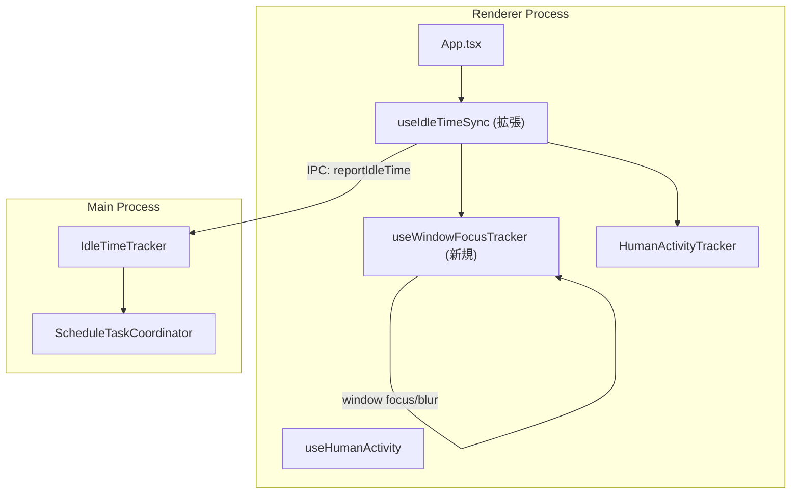
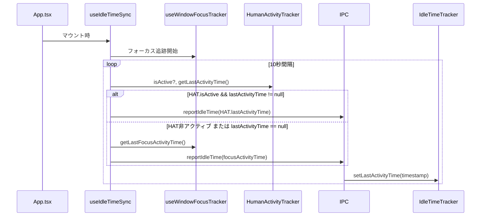

# Design: Idle Time Project-Level Reporting

## Overview

**Purpose**: プロジェクト選択時にウィンドウフォーカス状態に基づくアイドル時間報告を実現し、Spec未選択時でも`waitForIdle: true`のスケジュールタスクが正しく動作するようにする。

**Users**: SDDワークフローを使用する開発者。Spec選択に依存せずにスケジュールタスクのアイドル条件を利用できる。

**Impact**: 既存の`useIdleTimeSync`フックを拡張し、`HumanActivityTracker`と並行してウィンドウフォーカス状態による最終アクティビティ時刻追跡を追加する。App.tsxでのフック呼び出しを有効化する。

### Goals

- プロジェクト選択時にアイドル時間報告を自動開始
- ウィンドウフォーカス状態でアクティビティを検出（Spec追跡のフォールバック）
- 既存のSpec追跡（HumanActivityTracker）との優先度制御
- 10秒間隔での定期同期（既存間隔を維持）

### Non-Goals

- HumanActivityTrackerの内部ロジック変更
- Main Process側のIdleTimeTrackerの変更
- ScheduleTaskCoordinatorの変更
- E2Eテスト（ユニット/統合テストのみ）
- Remote UI対応（Electron固有のウィンドウフォーカスAPIを使用）

## Architecture

### Existing Architecture Analysis

**現在の構成**:
- `useIdleTimeSync`: Renderer側フック。`HumanActivityTracker.isActive`かつ`getLastActivityTime()`が非nullの場合のみ報告
- `HumanActivityTracker`: Spec選択時のみアクティブ化。Spec単位のセッション追跡
- `IdleTimeTracker` (Main): Renderer側から報告された`lastActivityTime`を保持しアイドル時間を計算
- `useHumanActivity`: `HumanActivityTracker`の初期化とフォーカスイベントリスナー設定

**問題点**:
- `useIdleTimeSync`がApp.tsxで呼び出されていない
- `HumanActivityTracker.isActive`がSpec選択時のみtrueになるため、Spec未選択時はアイドル時間が報告されない

### Architecture Pattern & Boundary Map



**Key Decisions**:
- `useWindowFocusTracker`: 新規フックとしてウィンドウフォーカス状態を追跡
- `useIdleTimeSync`拡張: Spec追跡とフォーカス追跡の優先度制御を統合
- 既存IPC/Main Processは変更なし（`IdleTimeTracker.setLastActivityTime`をそのまま使用）

### Technology Stack

| Layer | Choice / Version | Role in Feature | Notes |
|-------|------------------|-----------------|-------|
| Frontend | React 19, TypeScript 5.8+ | フック実装 | 既存スタック |
| IPC | SCHEDULE_TASK_REPORT_IDLE_TIME | アイドル時間報告 | 既存チャネル |

## System Flows

### Idle Time Sync Flow



**Key Decisions**:
- Spec追跡（HAT）を優先し、フォーカス追跡はフォールバック
- プロジェクト未選択時は報告スキップ（既存仕様維持）
- 同期間隔10秒を維持（ScheduleTaskCoordinatorの1分チェックに十分な精度）

### Window Focus Activity Tracking

```mermaid
stateDiagram-v2
    [*] --> Unfocused: 初期化
    Unfocused --> Focused: focus event
    Focused --> Unfocused: blur event

    state Focused {
        [*] --> Active
        Active --> Active: 10秒経過
        note right of Active
            lastActivityTime = Date.now()
            10秒間隔で更新
        end note
    }

    state Unfocused {
        note right of Unfocused
            lastActivityTime保持
            更新しない
        end note
    }
```

**Key Decisions**:
- フォーカス中のみ`lastActivityTime`を更新（10秒間隔）
- フォーカス喪失時は最後の値を保持（アイドル時間計算の基準点）
- フォーカス復帰時に即座に`Date.now()`で更新

## Requirements Traceability

| Criterion ID | Summary | Components | Implementation Approach |
|--------------|---------|------------|------------------------|
| 1.1 | プロジェクト選択時にuseIdleTimeSync有効化 | App.tsx, useIdleTimeSync | App.tsxでフック呼び出し追加 |
| 1.2 | プロジェクト未選択時は報告しない | useIdleTimeSync | projectPath条件分岐追加 |
| 1.3 | プロジェクト変更時も継続 | useIdleTimeSync | フック自体は常にマウント、内部で条件分岐 |
| 2.1 | フォーカス取得時にlastActivityTime記録 | useWindowFocusTracker | focusイベントハンドラ |
| 2.2 | フォーカス喪失時は値保持 | useWindowFocusTracker | blurイベントで更新停止 |
| 2.3 | フォーカス中10秒間隔で更新 | useWindowFocusTracker | setInterval実装 |
| 2.4 | バックグラウンド時のアイドル計算 | useIdleTimeSync, IdleTimeTracker | 最後のフォーカス喪失時刻から計算 |
| 3.1 | HAT.isActive=true優先 | useIdleTimeSync | 条件分岐でHAT優先 |
| 3.2 | HAT非アクティブ時フォールバック | useIdleTimeSync | elseブロックでフォーカス時刻使用 |
| 3.3 | Spec選択時切り替え | useIdleTimeSync | HAT.isActive自動判定 |
| 3.4 | Spec解除時切り替え | useIdleTimeSync | HAT.isActive自動判定 |
| 4.1 | 10秒間隔同期 | useIdleTimeSync | 既存IDLE_SYNC_INTERVAL_MS使用 |
| 4.2 | 既存IPCチャネル使用 | useIdleTimeSync | SCHEDULE_TASK_REPORT_IDLE_TIME |
| 4.3 | エラー時ログ出力と再試行 | useIdleTimeSync | 既存エラーハンドリング維持 |
| 5.1 | Spec追跡優先ロジックテスト | useIdleTimeSync.test.ts | 新規テストケース追加 |
| 5.2 | フォーカス状態テスト | useWindowFocusTracker.test.ts | 新規テストファイル |
| 5.3 | プロジェクト未選択テスト | useIdleTimeSync.test.ts | 新規テストケース追加 |
| 5.4 | 統合テスト（オプション） | 統合テスト | Main Process検証 |

## Components and Interfaces

| Component | Domain/Layer | Intent | Req Coverage | Key Dependencies | Contracts |
|-----------|--------------|--------|--------------|------------------|-----------|
| useWindowFocusTracker | Renderer/Hooks | ウィンドウフォーカス状態追跡 | 2.1, 2.2, 2.3, 2.4 | window events | State |
| useIdleTimeSync (拡張) | Renderer/Hooks | アイドル時間同期 | 1.1, 1.2, 1.3, 3.1-3.4, 4.1-4.3 | HumanActivityTracker, useWindowFocusTracker, IPC | Service |
| App.tsx (修正) | Renderer/Components | フック呼び出し統合 | 1.1, 1.2, 1.3 | useIdleTimeSync, useProjectStore | - |

### Renderer/Hooks

#### useWindowFocusTracker

| Field | Detail |
|-------|--------|
| Intent | ウィンドウフォーカス状態に基づく最終アクティビティ時刻追跡 |
| Requirements | 2.1, 2.2, 2.3, 2.4 |

**Responsibilities & Constraints**
- ウィンドウfocus/blurイベントの監視
- フォーカス中の10秒間隔lastActivityTime更新
- フォーカス喪失時の値保持

**Dependencies**
- Inbound: useIdleTimeSync - アクティビティ時刻取得 (P0)
- External: window.addEventListener - フォーカスイベント (P0)

**Contracts**: State [x]

##### Service Interface

```typescript
interface UseWindowFocusTrackerReturn {
  /** 最終アクティビティ時刻（Unix ms）、未記録の場合null */
  getLastActivityTime(): number | null;
  /** ウィンドウがフォーカス中かどうか */
  isFocused(): boolean;
}

function useWindowFocusTracker(): UseWindowFocusTrackerReturn;
```

- Preconditions: Rendererプロセスで実行
- Postconditions: フォーカス状態に応じたlastActivityTimeを返却
- Invariants: フォーカス中は10秒以内に更新されたlastActivityTime

#### useIdleTimeSync (拡張)

| Field | Detail |
|-------|--------|
| Intent | Spec追跡とフォーカス追跡を統合したアイドル時間報告 |
| Requirements | 1.1, 1.2, 1.3, 3.1, 3.2, 3.3, 3.4, 4.1, 4.2, 4.3 |

**Responsibilities & Constraints**
- プロジェクト選択状態に応じた報告制御
- Spec追跡（HAT）とフォーカス追跡の優先度制御
- 10秒間隔でのIPC報告

**Dependencies**
- Inbound: App.tsx - フック呼び出し (P0)
- Outbound: HumanActivityTracker - Spec追跡時刻取得 (P0)
- Outbound: useWindowFocusTracker - フォーカス追跡時刻取得 (P0)
- Outbound: window.electronAPI.reportIdleTime - IPC報告 (P0)

**Contracts**: Service [x]

##### Service Interface

```typescript
interface UseIdleTimeSyncOptions {
  /** プロジェクトパス。nullの場合は報告スキップ */
  projectPath: string | null;
}

function useIdleTimeSync(options: UseIdleTimeSyncOptions): void;
```

- Preconditions: electronAPIが利用可能
- Postconditions: 10秒間隔でlastActivityTimeをMain Processに報告
- Invariants: Spec追跡がアクティブな場合はSpec追跡の時刻を優先

**Implementation Notes**
- Integration: 既存useIdleTimeSyncを拡張、インタフェース変更（optionsパラメータ追加）
- Validation: projectPathがnullの場合は報告をスキップ
- Risks: なし（既存動作に影響を与えない条件分岐追加のみ）

### Renderer/Components (Summary Only)

| Component | Change | Notes |
|-----------|--------|-------|
| App.tsx | useIdleTimeSync呼び出し追加 | projectPath条件付き |

## Testing Strategy

### Unit Tests

- `useWindowFocusTracker.test.ts`:
  - フォーカス取得時のlastActivityTime更新
  - フォーカス喪失時の値保持
  - フォーカス中の10秒間隔更新
  - クリーンアップ時のイベントリスナー解除

- `useIdleTimeSync.test.ts` (追加):
  - projectPath=null時の報告スキップ
  - HAT.isActive=true時のSpec追跡優先
  - HAT非アクティブ時のフォーカス追跡フォールバック
  - Spec選択/解除時の切り替え

### Integration Tests

- Main Process側でのアイドル時間計算検証（オプション）
- IPC通信の正常性確認

## Verification Contract

### User Journey Definition

| Journey ID | Operation Flow | Expected Result | E2E Required |
|------------|---------------|-----------------|--------------|
| UJ-001 | プロジェクト選択 -> Spec未選択 -> 10秒待機 | Main ProcessでアイドルTimeが報告される | No |
| UJ-002 | Spec選択 -> アクティビティ発生 -> Spec解除 | フォーカス追跡に切り替わる | No |

### Impact Analysis Contract

| Target File | Action | Reason |
|-------------|--------|--------|
| src/renderer/hooks/useIdleTimeSync.ts | UPDATE | optionsパラメータ追加、優先度制御ロジック追加 |
| src/renderer/hooks/useWindowFocusTracker.ts | CREATE | 新規フック |
| src/renderer/hooks/useWindowFocusTracker.test.ts | CREATE | 新規テスト |
| src/renderer/hooks/useIdleTimeSync.test.ts | UPDATE | 新規テストケース追加 |
| src/renderer/hooks/index.ts | UPDATE | useWindowFocusTrackerエクスポート追加 |
| src/renderer/App.tsx | UPDATE | useIdleTimeSync呼び出し追加 |

## Integration Test Strategy

**Components**: useIdleTimeSync, useWindowFocusTracker, IdleTimeTracker (Main)

**Data Flow**: Renderer (focus events) -> useWindowFocusTracker -> useIdleTimeSync -> IPC -> IdleTimeTracker

**Mock Boundaries**:
- Mock: window.electronAPI.reportIdleTime（IPC transport）
- Real: useWindowFocusTracker、useIdleTimeSync（Rendererロジック）
- Real: focus/blurイベント（JSDOMで模擬）

**Verification Points**:
- reportIdleTime呼び出し引数の正確性
- HAT優先度制御の正確性
- projectPath条件分岐の正確性

**Robustness Strategy**:
- Vitestのfake timersを使用してタイミング依存を排除
- `vi.advanceTimersByTimeAsync`で確実にPromise解決を待機

**Prerequisites**:
- 既存テストインフラで十分（追加不要）

## Interface Changes & Impact Analysis

### useIdleTimeSync シグネチャ変更

**変更前**:
```typescript
function useIdleTimeSync(): void;
```

**変更後**:
```typescript
interface UseIdleTimeSyncOptions {
  projectPath: string | null;
}
function useIdleTimeSync(options: UseIdleTimeSyncOptions): void;
```

**影響を受けるCaller**:
- `src/renderer/App.tsx`: 呼び出し追加（新規。既存呼び出しなし）

**対応方針**: 新規呼び出しのため既存Callerへの影響なし

## Design Decisions

### DD-001: ウィンドウフォーカス状態によるアクティビティ追跡

| Field | Detail |
|-------|--------|
| Status | Accepted |
| Context | Spec未選択時にアクティビティを検出する方法が必要 |
| Decision | ウィンドウフォーカス状態（focus/blurイベント）を使用 |
| Rationale | 最もシンプルで確実。マウス/キーボード追跡は過剰でプライバシー懸念あり |
| Alternatives Considered | A) マウス/キーボードイベント追跡 - 過剰な追跡、B) システムアイドル時間API - Electron依存、クロスプラットフォーム課題 |
| Consequences | フォーカス喪失=アイドル開始という単純なモデル。細かいアクティビティは検出しないがスケジューラ用途には十分 |

### DD-002: Spec追跡優先のフォールバック設計

| Field | Detail |
|-------|--------|
| Status | Accepted |
| Context | Spec追跡中とプロジェクトレベル追跡をどう共存させるか |
| Decision | HAT.isActive=trueかつlastActivityTime非nullの場合はSpec追跡を優先 |
| Rationale | Spec追跡はより精密なアクティビティ時刻を持つ。既存機能を維持しつつギャップを埋める |
| Alternatives Considered | A) 両方を常に報告 - 不要な複雑さ、B) フォーカス追跡のみ - 精度低下 |
| Consequences | シンプルな条件分岐で実装可能。Spec追跡の精度を維持 |

### DD-003: useIdleTimeSyncのオプションパラメータ追加

| Field | Detail |
|-------|--------|
| Status | Accepted |
| Context | プロジェクト選択状態をフックに伝える方法 |
| Decision | optionsオブジェクトでprojectPathを受け取る |
| Rationale | 将来の拡張性（追加オプション）を確保。呼び出し側で明示的に制御可能 |
| Alternatives Considered | A) useProjectStoreを直接参照 - 疎結合性の低下、B) enabled booleanフラグ - 情報量不足 |
| Consequences | 呼び出し側（App.tsx）でprojectPathを渡す責務が発生 |
