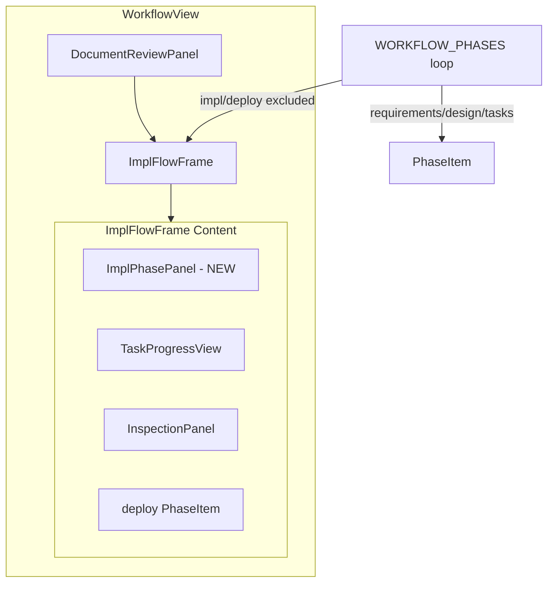
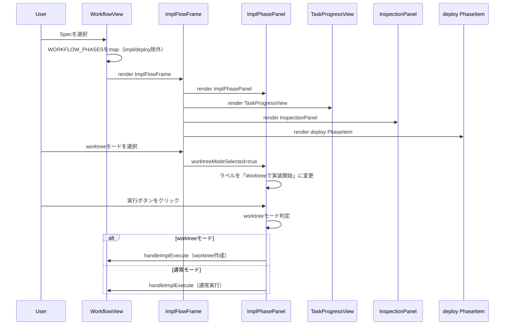

# Design: 実装フローエリア階層構造の修正

## Overview

**Purpose**: WorkflowViewの実装フローエリア（impl, inspection, deploy）の階層構造を整理し、視覚的なグループ化と責務の明確化を実現する。

**Users**: SDD Orchestratorを使用する開発者がワークフローを操作する際、impl/inspection/deployが論理的なグループとして認識できるようになる。

**Impact**: WorkflowView.tsx、ImplFlowFrame.tsx、および関連コンポーネントの構造を変更し、impl PhaseItemの重複ボタン問題を解消する。

### Goals

- ImplFlowFrameから「実装開始」ボタンを削除し、責務を視覚的フレームに限定
- 新規ImplPhasePanelコンポーネントでimpl固有ロジックを集約
- deploy PhaseItemをImplFlowFrame内に配置
- worktreeモードに応じたラベル動的変更

### Non-Goals

- worktreeの自動削除・クリーンアップ機能
- worktreeモードと通常モードの途中切り替え
- 複数worktreeの同時管理
- Remote UIへの対応

## Architecture

### Existing Architecture Analysis

現在のWorkflowView階層構造:

```
WorkflowView
├── WORKFLOW_PHASES.map() → PhaseItem (requirements, design, tasks, impl, deploy)
│   ├── PhaseItem (impl) ← 問題: 実行ボタンあり
│   └── ImplFlowFrame ← 問題: 「実装開始」ボタンあり（重複）
│       ├── TaskProgressView
│       └── InspectionPanel
├── DocumentReviewPanel (tasks後、impl前)
└── deploy PhaseItem ← 問題: ImplFlowFrame外に配置
```

**問題点**:
1. impl PhaseItemの「実行」ボタンとImplFlowFrameの「実装開始」ボタンが重複
2. deploy PhaseItemがImplFlowFrame外にあり、視覚的グループ化ができていない
3. worktree連動ロジックがPhaseItem/ImplFlowFrame両方に分散

### Architecture Pattern & Boundary Map



**Architecture Integration**:
- Selected pattern: コンポジション（children方式）を維持し、新規ImplPhasePanelを追加
- Domain boundaries: ImplPhasePanelがworktree連動ロジックを担当、ImplFlowFrameは枠のみ
- Existing patterns preserved: PhaseItemの汎用性、InspectionPanel/DocumentReviewPanelの独立性
- New components rationale: ImplPhasePanelでimpl固有の複雑なロジックを分離
- Steering compliance: 関心の分離、KISS原則に従う

### Technology Stack

| Layer | Choice / Version | Role in Feature | Notes |
|-------|------------------|-----------------|-------|
| Frontend | React 19 + TypeScript 5.8+ | UIコンポーネント実装 | 既存スタック |
| State | Zustand | worktreeModeSelection管理 | workflowStore使用 |
| Styling | Tailwind CSS 4 | スタイリング | 既存パターン継続 |

## System Flows

### 実装フロー階層構造



## Requirements Traceability

| Criterion ID | Summary | Components | Implementation Approach |
|--------------|---------|------------|------------------------|
| 1.1 | ImplFlowFrameから実装開始ボタン削除 | ImplFlowFrame | 既存コンポーネントを修正 |
| 1.2 | worktreeモードチェックボックスをヘッダーに表示 | ImplFlowFrame | 既存機能維持（変更なし） |
| 1.3 | worktreeモード選択時に紫系背景色 | ImplFlowFrame | 既存機能維持（変更なし） |
| 1.4 | children propsを受け取る | ImplFlowFrame | 既存機能維持（変更なし） |
| 1.5 | 実行関連propsを削除 | ImplFlowFrame | Props型を修正 |
| 2.1 | ImplPhasePanelを新規作成 | ImplPhasePanel | 新規コンポーネント作成 |
| 2.2 | worktreeモード状態を受け取る | ImplPhasePanel | Props定義 |
| 2.3 | worktree未作成時「Worktreeで実装開始」ラベル | ImplPhasePanel | 条件分岐ロジック |
| 2.4 | worktree作成済み時「Worktreeで実装継続」ラベル | ImplPhasePanel | 条件分岐ロジック |
| 2.5 | 通常モード未開始時「実装開始」ラベル | ImplPhasePanel | 条件分岐ロジック |
| 2.6 | 通常モード開始済み時「実装継続」ラベル | ImplPhasePanel | 条件分岐ロジック |
| 2.7 | worktreeモードに応じた処理実行 | ImplPhasePanel | onExecuteハンドラ |
| 2.8 | mainブランチでない場合エラー表示 | ImplPhasePanel | 既存ロジックを移行 |
| 2.9 | ステータス表示（pending/executing/approved） | ImplPhasePanel | PhaseItemと同等のUI |
| 2.10 | worktreeモード時に紫系アクセントカラー | ImplPhasePanel | 条件付きスタイリング |
| 3.1 | ImplFlowFrame内にImplPhasePanel等を配置 | WorkflowView | レンダリング構造変更 |
| 3.2 | WORKFLOW_PHASESからimpl/deploy除外 | WorkflowView | mapループ修正 |
| 3.3 | DocumentReviewPanelはImplFlowFrame外維持 | WorkflowView | 既存配置維持 |
| 3.4 | 矢印コネクタ表示 | WorkflowView | ArrowDownコンポーネント配置 |
| 4.1 | worktreeモード時deployラベル「マージ」 | WorkflowView | 条件分岐ロジック |
| 4.2 | 通常モード時deployラベル「コミット」 | WorkflowView | 既存動作維持 |
| 4.3 | PhaseItemがlabel propsを動的に受け取る | PhaseItem | 既存機能（変更なし） |
| 5.1 | worktreeモード選択→実装開始→ロック | 全体 | 既存機能維持 |
| 5.2 | 通常モード選択→実装開始→deploy完了 | 全体 | 既存機能維持 |
| 5.3 | 自動実行機能が正常動作 | 全体 | 既存機能維持 |
| 5.4 | InspectionPanel機能維持 | InspectionPanel | 既存機能維持 |
| 5.5 | TaskProgressView機能維持 | TaskProgressView | 既存機能維持 |

### Coverage Validation Checklist

- [x] Every criterion ID from requirements.md appears in the table above
- [x] Each criterion has specific component names (not generic references)
- [x] Implementation approach distinguishes "reuse existing" vs "new implementation"
- [x] User-facing criteria specify concrete UI components

## Components and Interfaces

| Component | Domain/Layer | Intent | Req Coverage | Key Dependencies | Contracts |
|-----------|--------------|--------|--------------|------------------|-----------|
| ImplFlowFrame | UI/Workflow | 実装フローの視覚的フレーム（枠のみ） | 1.1-1.5 | WorktreeModeCheckbox (P0) | Props |
| ImplPhasePanel | UI/Workflow | impl固有のworktree連動ロジック | 2.1-2.10 | workflowStore (P0), electronAPI (P0) | Props, State |
| WorkflowView | UI/Workflow | ワークフロー全体の構造管理 | 3.1-3.4, 4.1-4.2 | ImplFlowFrame (P0), ImplPhasePanel (P0) | Props |

### UI / Workflow Layer

#### ImplFlowFrame (修正)

| Field | Detail |
|-------|--------|
| Intent | 実装フロー（impl, inspection, deploy）の視覚的フレームを提供 |
| Requirements | 1.1, 1.2, 1.3, 1.4, 1.5 |

**Responsibilities & Constraints**
- worktreeモードチェックボックスをヘッダーに表示
- worktreeモード選択時に紫系背景色を適用
- children propsを受け取り内部にレンダリング
- 実行ボタン・実行ロジックは持たない（責務外）

**Dependencies**
- Inbound: WorkflowView - フレームとしてレンダリング (P0)
- Outbound: WorktreeModeCheckbox - チェックボックス表示 (P0)

**Contracts**: Props [x]

##### Props Interface (修正後)

```typescript
export interface ImplFlowFrameProps {
  /** Whether worktree mode is selected */
  worktreeModeSelected: boolean;
  /** Callback when worktree mode selection changes */
  onWorktreeModeChange: (selected: boolean) => void;
  /** Whether implementation has started (branch exists in spec.json.worktree) */
  isImplStarted: boolean;
  /** Whether an actual worktree already exists (path exists in spec.json.worktree) */
  hasExistingWorktree: boolean;
  /** Children to render inside the frame */
  children: React.ReactNode;
  /** Additional CSS classes */
  className?: string;
  // 削除: canExecute, isExecuting, onExecute
}
```

**Implementation Notes**
- 既存のImplFlowFrame.tsxから`canExecute`, `isExecuting`, `onExecute` propsと関連ボタンUIを削除
- WorktreeModeCheckboxとchildren renderingは維持

---

#### ImplPhasePanel (新規)

| Field | Detail |
|-------|--------|
| Intent | impl固有のworktree連動ロジックを集約し、PhaseItemと同等のUIを提供 |
| Requirements | 2.1, 2.2, 2.3, 2.4, 2.5, 2.6, 2.7, 2.8, 2.9, 2.10 |

**Responsibilities & Constraints**
- worktreeモード状態に応じたラベル切り替え
- worktree作成/通常モード実行のハンドリング
- mainブランチチェックとエラー表示
- PhaseItemと同等のステータス表示（pending/executing/approved）
- worktreeモード時の紫系アクセントカラー適用

**Dependencies**
- Inbound: WorkflowView/ImplFlowFrame - children として配置 (P0)
- Outbound: workflowStore - worktreeModeSelection取得 (P0)
- External: electronAPI - worktree操作IPC (P0)

**Contracts**: Props [x] / State [x]

##### Props Interface

```typescript
export interface ImplPhasePanelProps {
  /** Whether worktree mode is selected */
  worktreeModeSelected: boolean;
  /** Whether implementation has started */
  isImplStarted: boolean;
  /** Whether an actual worktree exists */
  hasExistingWorktree: boolean;
  /** Current phase status */
  status: PhaseStatus;
  /** Auto execution permission flag */
  autoExecutionPermitted: boolean;
  /** Whether currently executing */
  isExecuting: boolean;
  /** Whether this phase can be executed */
  canExecute: boolean;
  /** Whether this is the current auto execution phase */
  isAutoPhase?: boolean;
  /** Execute button handler */
  onExecute: () => void;
  /** Auto execution permission toggle handler */
  onToggleAutoPermission: () => void;
  /** Additional CSS classes */
  className?: string;
}
```

##### State Management

- worktreeModeSelected: 親コンポーネントから受け取る
- status: spec.jsonから算出（pending/generated/approved）
- isExecuting: runningPhasesから判定

**Implementation Notes**
- PhaseItemのUIパターンを踏襲（進捗アイコン、ラベル、アクションボタン）
- ラベル決定ロジック:
  - worktreeモード + 未作成: 「Worktreeで実装開始」
  - worktreeモード + 作成済み: 「Worktreeで実装継続」
  - 通常モード + 未開始: 「実装開始」
  - 通常モード + 開始済み: 「実装継続」
- worktreeモード時はGitBranchアイコン、通常モードはPlayアイコン

---

#### WorkflowView (修正)

| Field | Detail |
|-------|--------|
| Intent | SDDワークフロー全体の構造とレンダリングを管理 |
| Requirements | 3.1, 3.2, 3.3, 3.4, 4.1, 4.2 |

**Responsibilities & Constraints**
- WORKFLOW_PHASESからimpl/deployを除外してPhaseItemをレンダリング
- ImplFlowFrame内にImplPhasePanel, TaskProgressView, InspectionPanel, deploy PhaseItemを配置
- DocumentReviewPanelはImplFlowFrame外（tasks後）に維持
- worktreeモードに応じたdeployラベル切り替え

**Dependencies**
- Inbound: SpecPane - ワークフロー表示 (P0)
- Outbound: ImplFlowFrame, ImplPhasePanel - 実装フロー (P0)
- Outbound: PhaseItem - 各フェーズ表示 (P0)
- Outbound: specStore, workflowStore - 状態管理 (P0)

**Contracts**: State [x]

##### Key Implementation Changes

```typescript
// 修正前: WORKFLOW_PHASES全てをmap
WORKFLOW_PHASES.map((phase, index) => (
  <PhaseItem phase={phase} ... />
))

// 修正後: impl/deployを除外
const DISPLAY_PHASES = ['requirements', 'design', 'tasks'] as const;

DISPLAY_PHASES.map((phase, index) => (
  <PhaseItem phase={phase} ... />
))

// ImplFlowFrame内でimpl/deployを個別レンダリング
<ImplFlowFrame ...>
  <ImplPhasePanel ... />  {/* NEW */}
  <TaskProgressView ... />
  <InspectionPanel ... />
  <PhaseItem phase="deploy" label={deployLabel} ... />  {/* 移動 */}
</ImplFlowFrame>

// deployラベル決定
const deployLabel = specJson?.worktree?.path ? 'マージ' : 'コミット';
```

**Implementation Notes**
- DISPLAY_PHASES定数を導入してimpl/deployを除外
- ImplFlowFrameのchildren内でImplPhasePanelを最初に配置
- deploy PhaseItemをImplFlowFrame内の最後に配置
- ArrowDownコネクタを各コンポーネント間に配置

## Data Models

### Domain Model

本機能ではデータモデルの変更なし。既存のspec.json構造を使用。

### Logical Data Model

**既存フィールド参照**:
- `spec.json.worktree.path`: worktree作成済み判定
- `spec.json.worktree.branch`: ブランチ名
- `spec.json.phase`: フェーズ状態

## Error Handling

### Error Strategy

ImplPhasePanelは既存のWorktreeモードエラーハンドリングを継承。

### Error Categories and Responses

| エラー | 条件 | 表示 |
|--------|------|------|
| mainブランチチェック失敗 | `checkResult.value.isMain === false` | `notify.error()` でトースト表示 |
| Worktree作成失敗 | `implStartResult.ok === false` | エラータイプに応じたメッセージ表示 |
| 通常モード開始失敗 | `normalResult.ok === false` | `notify.error()` でトースト表示 |

## Testing Strategy

### Unit Tests

1. **ImplFlowFrame.test.tsx**
   - 実行ボタン削除後のレンダリング確認
   - children正常レンダリング確認
   - Props型変更後の動作確認

2. **ImplPhasePanel.test.tsx** (新規)
   - 各条件でのラベル切り替え確認
   - worktreeモード時の紫系スタイル確認
   - ステータス表示確認
   - 実行ボタンハンドラ呼び出し確認

3. **WorkflowView.test.tsx**
   - DISPLAY_PHASES除外確認
   - ImplFlowFrame内のコンポーネント配置確認
   - deployラベル動的変更確認

### Integration Tests

1. **WorkflowView + ImplPhasePanel連携**
   - worktreeモード選択からimpl実行までのフロー
   - 通常モードでのimpl実行フロー

2. **ImplFlowFrame + children連携**
   - ImplPhasePanel, TaskProgressView, InspectionPanel, deployの順序配置

### E2E Tests (既存テスト更新)

1. **worktree-execution.e2e.spec.ts**
   - ImplFlowFrame内のボタン配置変更に対応
   - ImplPhasePanelのセレクタ更新

## Design Decisions

### DD-001: ImplPhasePanelの新規作成

| Field | Detail |
|-------|--------|
| Status | Accepted |
| Context | impl PhaseItemの「実行」ボタンとImplFlowFrameの「実装開始」ボタンが重複しており、worktree連動ロジックが分散している |
| Decision | 新規ImplPhasePanelコンポーネントを作成し、impl固有のworktree連動ロジックを集約 |
| Rationale | PhaseItemの汎用性を維持しつつ、impl固有の複雑なロジック（worktree作成、mainブランチチェック、ラベル切り替え）を1箇所に集約。関心の分離原則に従い、保守性とテスト容易性を向上 |
| Alternatives Considered | 1) PhaseItemに特殊分岐を追加 - PhaseItemの汎用性が損なわれる、2) ImplFlowFrame内でロジック処理 - フレームの責務が肥大化 |
| Consequences | 新規コンポーネント追加によるコード量増加。ただし、責務が明確になり長期的な保守性が向上 |

### DD-002: ImplFlowFrameの責務簡素化

| Field | Detail |
|-------|--------|
| Status | Accepted |
| Context | ImplFlowFrameに「実装開始」ボタンがあり、内部のimpl PhaseItemのボタンと機能が重複 |
| Decision | ImplFlowFrameから実行ボタンを削除し、視覚的フレーム（枠・背景色・チェックボックス）のみを担当 |
| Rationale | 単一責任原則に従い、ImplFlowFrameは「worktreeモードの視覚的表現」に専念。実行ロジックは専用コンポーネント（ImplPhasePanel）に委譲 |
| Alternatives Considered | 1) impl PhaseItemを削除してImplFlowFrameに統合 - 階層構造の一貫性が損なわれる |
| Consequences | Props簡素化により、ImplFlowFrameの利用がシンプルに。ただし、既存テストの更新が必要 |

### DD-003: deploy PhaseItemのImplFlowFrame内配置

| Field | Detail |
|-------|--------|
| Status | Accepted |
| Context | deploy PhaseItemがImplFlowFrame外にあり、実装フロー（impl, inspection, deploy）の視覚的グループ化ができていない |
| Decision | deploy PhaseItemをImplFlowFrame内の最後に配置 |
| Rationale | ユーザーが実装フロー全体を1つのグループとして認識できるようになる。worktreeモード時の紫系背景がdeploy含めて適用され、視覚的一貫性が向上 |
| Alternatives Considered | 1) deploy専用パネルを作成 - YAGNI原則違反、deployは単純なフェーズのため不要 |
| Consequences | WorkflowViewのレンダリング構造変更が必要。WORKFLOW_PHASESのmapからdeploy除外 |

### DD-004: deployラベルの動的変更方式

| Field | Detail |
|-------|--------|
| Status | Accepted |
| Context | worktreeモード時にdeployボタンのラベルを「マージ」に変更する要件 |
| Decision | PhaseItemの既存label propsを活用し、WorkflowViewで条件分岐してラベルを渡す |
| Rationale | PhaseItemは既にlabel propsを動的に受け取る機能があるため、新規実装不要。KISS原則に従いシンプルな解決策を採用 |
| Alternatives Considered | 1) deploy専用パネル作成 - 過剰な抽象化 |
| Consequences | WorkflowViewでのラベル決定ロジック追加のみで対応可能 |

### DD-005: WORKFLOW_PHASESの部分除外方式

| Field | Detail |
|-------|--------|
| Status | Accepted |
| Context | impl/deployをWORKFLOW_PHASESのmapループから除外し、ImplFlowFrame内で個別レンダリングする必要がある |
| Decision | 新定数DISPLAY_PHASES（requirements, design, tasksのみ）を導入し、mapループで使用 |
| Rationale | 既存のWORKFLOW_PHASES定義を変更せず、表示用の別定数を導入することで後方互換性を維持。状態判定ロジック（getPhaseStatus等）への影響を最小化 |
| Alternatives Considered | 1) WORKFLOW_PHASESを直接変更 - ALL_WORKFLOW_PHASESとの整合性問題 |
| Consequences | 定数が増えるが、各定数の用途が明確になる（WORKFLOW_PHASES=ループ用、ALL_WORKFLOW_PHASES=状態判定用、DISPLAY_PHASES=表示用） |
