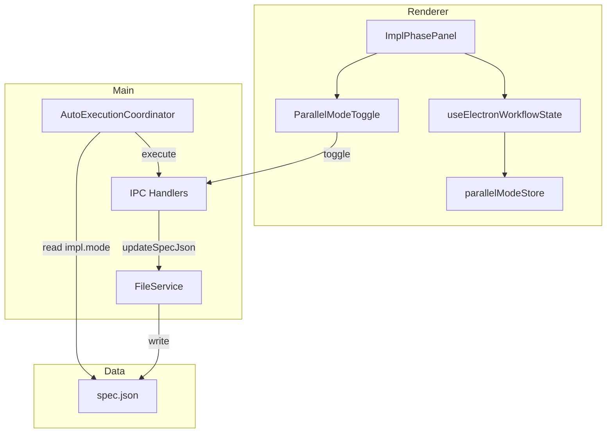
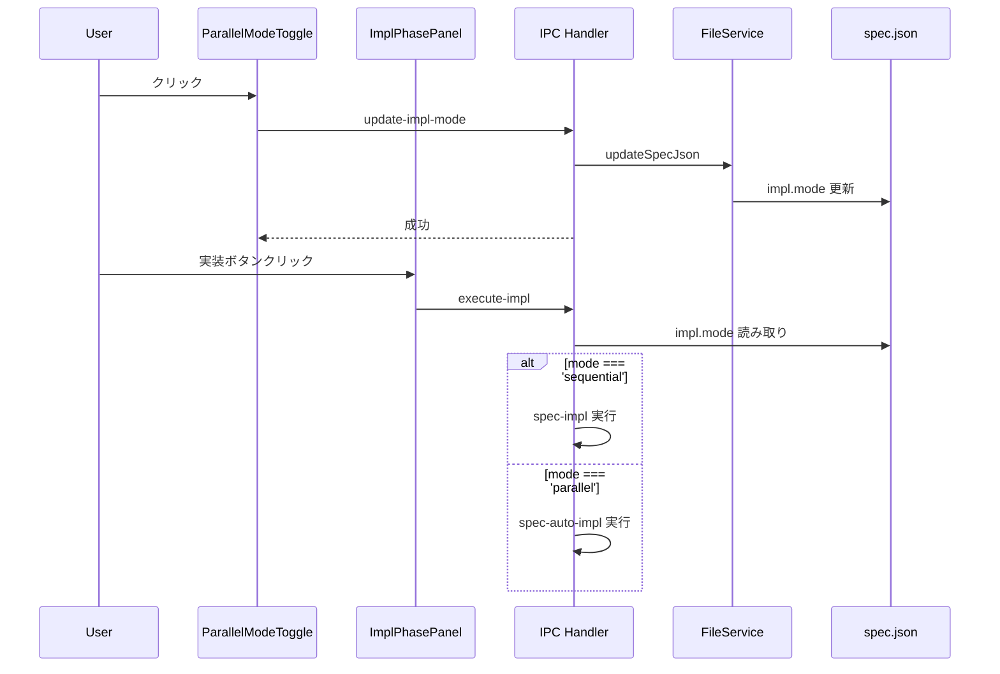
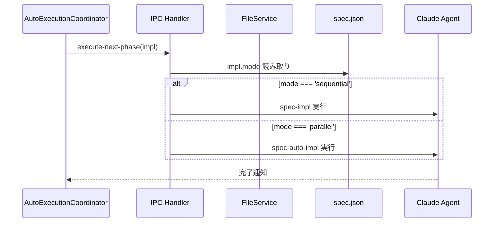
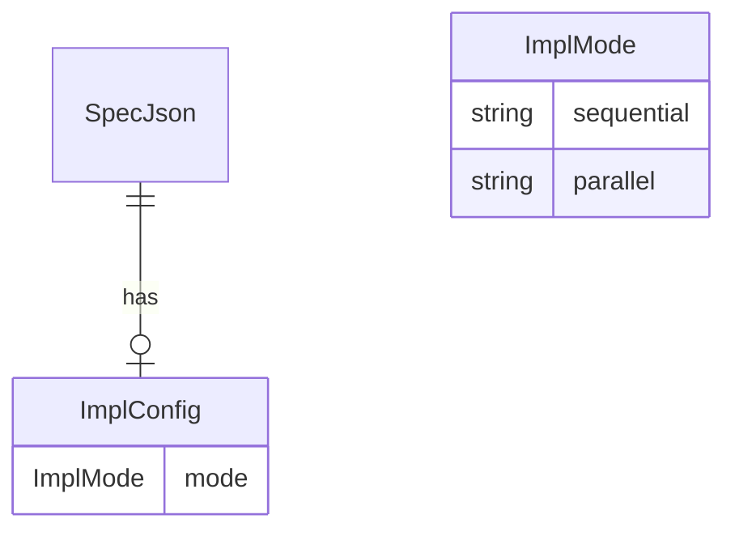

# Design: impl-mode-toggle

## Overview

**Purpose**: 本機能は、実装フェーズの実行モード（Sequential / Parallel）をユーザーが明示的に選択できるUIトグルを提供する。`spec.json` の `impl.mode` フィールドで設定を永続化し、手動実行・自動実行の両方でこの設定を尊重する。

**Users**: Specを使用した機能開発を行う開発者が、実装フェーズの実行方式（`spec-impl` vs `spec-auto-impl`）を制御する際に利用する。

**Impact**: 現在の `ParallelModeToggle` コンポーネントの表示条件と意味付けを変更し、`AutoExecutionCoordinator` の `impl` フェーズ実行ロジックを拡張する。

### Goals

- 実行モードトグルを `(P)` タスクの有無に関係なく常時表示
- `spec.json` に `impl.mode` フィールドを追加し、設定を永続化
- 手動実行・自動実行の両方で `impl.mode` 設定を尊重
- UIアイコンを Sequential / Parallel を示すものに変更

### Non-Goals

- `spec-impl` / `spec-auto-impl` コマンド自体の変更
- タスクの `(P)` マーカーの解釈や並列グルーピングロジックの変更
- `spec.json` の他のフィールドへの影響

## Architecture

### Existing Architecture Analysis

現在のアーキテクチャ:

1. **ParallelModeToggle**: `hasParallelTasks` が true の場合のみレンダリング。並列タスク数を表示。
2. **ImplPhasePanel**: `parallelModeEnabled` と `onExecuteParallel` で並列実行を切り替え。
3. **parallelModeStore**: グローバルな `parallelModeEnabled` 状態を管理（揮発性、永続化なし）。
4. **AutoExecutionCoordinator**: `impl` フェーズで常に `auto-impl` タイプを使用。

変更が必要な点:

- `ParallelModeToggle` の条件付きレンダリング削除
- `spec.json` スキーマに `impl.mode` フィールド追加
- `handlers.ts` の `execute-next-phase` イベントハンドラで `impl.mode` を参照

### Architecture Pattern & Boundary Map



**Architecture Integration**:

- Selected pattern: 既存のElectron IPC + Zustandパターンを維持
- Domain boundaries: UIは `parallelModeStore` を介して状態を管理、永続化は Main Process の `FileService` 経由
- Existing patterns preserved: spec.json 更新の `fileService.updateSpecJson` パターン
- New components rationale: 新規コンポーネントなし、既存コンポーネントの拡張のみ
- Steering compliance: SSOT（spec.json が永続的な真実の情報源）、Main Process でのステート管理原則

### Technology Stack

| Layer | Choice / Version | Role in Feature | Notes |
|-------|------------------|-----------------|-------|
| Frontend | React 19 + TypeScript | UI コンポーネント更新 | 既存スタック |
| State | Zustand | UI状態のキャッシュ | 初期値は spec.json から読み取り |
| Data | spec.json | 永続化 | `impl.mode` フィールド追加 |
| IPC | Electron IPC | Main-Renderer 通信 | 既存チャンネル拡張 |

## System Flows

### 手動実行フロー



### 自動実行フロー



## Requirements Traceability

| Criterion ID | Summary | Components | Implementation Approach |
|--------------|---------|------------|------------------------|
| 1.1 | `spec.json` に `impl` オブジェクト追加 | SpecJson (type), FileService | 型定義拡張 + 既存 updateSpecJson 利用 |
| 1.2 | `impl.mode` が `sequential` / `parallel` を持つ | SpecJson (type) | union type 定義 |
| 1.3 | フィールド未存在時のデフォルト `sequential` | FileService, handlers.ts | 読み取り時のフォールバック処理 |
| 2.1 | トグル常時表示 | ParallelModeToggle | `hasParallelTasks` 条件削除 |
| 2.2 | Single / Parallel アイコン | ParallelModeToggle | lucide-react アイコン変更 |
| 2.3 | 設定状態の視覚化 | ParallelModeToggle | 既存のスタイリング維持 |
| 2.4 | トグルで spec.json 更新 | ParallelModeToggle, IPC Handler | 新規 IPC チャンネル追加 |
| 3.1 | sequential 時 spec-impl 実行 | handlers.ts (startImplPhase) | 既存 execute メソッド利用 |
| 3.2 | parallel 時 spec-auto-impl 実行 | handlers.ts (startImplPhase) | 既存 execute メソッド利用 |
| 3.3 | 未設定時のデフォルト動作 | handlers.ts | フォールバック: spec-impl |
| 4.1 | 自動実行で impl.mode 読み取り | handlers.ts (execute-next-phase) | spec.json 読み取り追加 |
| 4.2 | sequential 時 type: impl 実行 | handlers.ts (execute-next-phase) | 条件分岐追加 |
| 4.3 | parallel 時 type: auto-impl 実行 | handlers.ts (execute-next-phase) | 既存ロジック維持 |
| 4.4 | 未設定時のデフォルト | handlers.ts (execute-next-phase) | フォールバック: type: impl |
| 5.1 | hasParallelTasks 条件削除 | ParallelModeToggle | 条件文削除 |
| 5.2 | アイコン変更 | ParallelModeToggle | User / Users アイコン使用 |
| 5.3 | コンポーネント名維持 | ParallelModeToggle | 変更なし |
| 5.4 | parallelTaskCount props 非表示 | ParallelModeToggle | 表示ロジック削除 |
| 6.1 | Remote UI トグル表示 | remote-ui ImplPhasePanel | 共有コンポーネント経由で自動対応 |
| 6.2 | WebSocket 経由の同期 | webSocketHandler | specJson 変更の既存同期機構利用 |

### Coverage Validation Checklist

- [x] Every criterion ID from requirements.md appears in the table above
- [x] Each criterion has specific component names
- [x] Implementation approach distinguishes reuse existing vs new implementation
- [x] User-facing criteria specify concrete UI components

## Components and Interfaces

### Component Summary

| Component | Domain/Layer | Intent | Req Coverage | Key Dependencies | Contracts |
|-----------|--------------|--------|--------------|------------------|-----------|
| ParallelModeToggle | UI/Shared | 実行モード切替 | 2.1-2.4, 5.1-5.4 | ImplPhasePanel (P1) | Props |
| ImplPhasePanel | UI/Shared | 実装フェーズパネル | 2.1, 3.1-3.3 | WorkflowViewCore (P1) | Props |
| SpecJson | Types | spec.json 型定義 | 1.1-1.3 | FileService (P0) | Type |
| IPC Handler | Main/IPC | impl.mode 更新 | 2.4, 3.1-3.3, 4.1-4.4 | FileService (P0) | Service |
| FileService | Main/Services | spec.json 読み書き | 1.1-1.3 | fs (P0) | Service |

### Types

#### ImplMode

```typescript
/**
 * 実装モード
 * Requirements: 1.2
 */
export type ImplMode = 'sequential' | 'parallel';

/**
 * spec.json の impl フィールド
 * Requirements: 1.1
 */
export interface ImplConfig {
  mode: ImplMode;
}
```

**Responsibilities & Constraints**

- `ImplMode` は `'sequential'` または `'parallel'` のいずれか
- `ImplConfig` は `spec.json` の `impl` フィールドにマップされる
- フィールドが存在しない場合、デフォルト `'sequential'` として扱う

#### SpecJson Extension

```typescript
/**
 * spec.json 拡張（既存 SpecJson に追加）
 * Requirements: 1.1, 1.2
 */
export interface SpecJson {
  // ... 既存フィールド ...

  /**
   * 実装設定（オプショナル、後方互換性のため）
   * impl-mode-toggle: Requirements 1.1, 1.2
   */
  impl?: ImplConfig;
}
```

### Shared Components

#### ParallelModeToggle (Update)

| Field | Detail |
|-------|--------|
| Intent | 実行モード（Sequential / Parallel）の切替トグル |
| Requirements | 2.1, 2.2, 2.3, 2.4, 5.1, 5.2, 5.3, 5.4 |

**Responsibilities & Constraints**

- 常時表示（`hasParallelTasks` 条件を削除）
- Single / Parallel を示すアイコンで状態を表示
- クリックで `impl.mode` を切り替え

**Dependencies**

- Inbound: ImplPhasePanel — 親コンポーネント (P1)
- External: lucide-react — アイコン (P2)

**Contracts**: Props [ x ]

##### Props Interface (Updated)

```typescript
/**
 * ParallelModeToggle Props
 * impl-mode-toggle: Requirements 5.1-5.4
 */
export interface ParallelModeToggleProps {
  /** 現在の実行モード */
  mode: ImplMode;
  /** トグルクリック時のコールバック */
  onToggle: () => void;
  /** 追加の CSS クラス */
  className?: string;
}
```

- Preconditions: `mode` は `'sequential'` または `'parallel'`
- Postconditions: `onToggle` 呼び出しで親が `impl.mode` を更新

**Implementation Notes**

- Integration: 既存の `ImplPhasePanel` 内で使用、props インターフェースを簡素化
- Validation: `mode` の型チェックはコンパイル時に保証
- Risks: 既存テストの更新が必要

#### ImplPhasePanel (Update)

| Field | Detail |
|-------|--------|
| Intent | 実装フェーズの状態表示と実行ボタン |
| Requirements | 2.1, 3.1, 3.2, 3.3 |

**Responsibilities & Constraints**

- `impl.mode` に応じた実行コマンドの選択
- ParallelModeToggle を常時表示

**Dependencies**

- Inbound: WorkflowViewCore — 親コンポーネント (P1)
- Outbound: ParallelModeToggle — 子コンポーネント (P1)
- Outbound: IPC Handler — 実行リクエスト (P0)

**Contracts**: Props [ x ]

##### Props Interface (Updated)

```typescript
/**
 * ImplPhasePanel Props（関連部分のみ）
 * impl-mode-toggle: Requirements 2.1, 3.1-3.3
 */
export interface ImplPhasePanelProps {
  // ... 既存 props ...

  /** 現在の実行モード */
  implMode: ImplMode;
  /** 実行モードトグルのコールバック */
  onToggleImplMode: () => void;

  // 以下は削除または非推奨
  /** @deprecated impl-mode-toggle: Use implMode instead */
  hasParallelTasks?: boolean;
  /** @deprecated impl-mode-toggle: No longer displayed */
  parallelTaskCount?: number;
  /** @deprecated impl-mode-toggle: Use implMode instead */
  parallelModeEnabled?: boolean;
  /** @deprecated impl-mode-toggle: Use onToggleImplMode instead */
  onToggleParallelMode?: () => void;
  /** @deprecated impl-mode-toggle: Merged into onExecute */
  onExecuteParallel?: () => void;
}
```

**Implementation Notes**

- Integration: 実行ボタンクリック時、`implMode` を参照して適切なコマンドを呼び出し
- Validation: 後方互換性のため deprecated props も一時的に受け入れる
- Risks: 段階的な移行が必要

### Main Process

#### IPC Handler Updates

| Field | Detail |
|-------|--------|
| Intent | impl.mode の読み書きと実行コマンドの選択 |
| Requirements | 2.4, 3.1, 3.2, 3.3, 4.1, 4.2, 4.3, 4.4 |

**Responsibilities & Constraints**

- `UPDATE_IMPL_MODE` チャンネルで `impl.mode` を更新
- `execute-next-phase` イベントで `impl.mode` を読み取り、適切なコマンドを実行

**Dependencies**

- Inbound: Renderer — IPC 呼び出し (P0)
- Outbound: FileService — spec.json 更新 (P0)
- Outbound: SpecManagerService — コマンド実行 (P0)

**Contracts**: Service [ x ]

##### IPC Channel

```typescript
/**
 * 新規 IPC チャンネル
 * impl-mode-toggle: Requirements 2.4
 */
export const UPDATE_IMPL_MODE = 'spec:update-impl-mode';

/**
 * チャンネル引数
 */
interface UpdateImplModeArgs {
  specPath: string;
  mode: ImplMode;
}

/**
 * チャンネル戻り値
 */
type UpdateImplModeResult = Result<void, FileError>;
```

##### execute-next-phase Handler (Updated)

```typescript
/**
 * execute-next-phase イベントハンドラの impl フェーズ処理
 * impl-mode-toggle: Requirements 4.1-4.4
 */
// 疑似コード
coordinator.on('execute-next-phase', async (specPath, phase, context) => {
  if (phase === 'impl') {
    // spec.json から impl.mode を読み取り
    const specJson = await readSpecJson(specPath);
    const implMode = specJson.impl?.mode ?? 'sequential'; // デフォルト: sequential

    if (implMode === 'parallel') {
      // 既存: auto-impl 実行
      await service.execute({ type: 'auto-impl', ... });
    } else {
      // 新規: impl 実行
      await service.execute({ type: 'impl', ... });
    }
  }
});
```

**Implementation Notes**

- Integration: 既存の `execute-next-phase` ハンドラに条件分岐を追加
- Validation: `impl.mode` が未定義の場合は `'sequential'` にフォールバック
- Risks: 既存の auto-impl 固定動作を変更するため、テストの更新が必要

#### FileService

既存の `updateSpecJson` メソッドを利用。新規メソッド追加は不要。

```typescript
// 使用例
await fileService.updateSpecJson(specPath, {
  impl: { mode: 'parallel' }
});
```

### Shared Stores

#### parallelModeStore (Update)

| Field | Detail |
|-------|--------|
| Intent | UI 状態のキャッシュ |
| Requirements | 2.3 |

**Responsibilities & Constraints**

- `impl.mode` の UI 状態をキャッシュ
- spec 切り替え時に spec.json から初期化

**Implementation Notes**

- Integration: `useElectronWorkflowState` で spec.json から読み取り、store を初期化
- Validation: spec.json が SSOT、store はキャッシュとして扱う
- Risks: キャッシュと実際の spec.json の不整合に注意

## Data Models

### Domain Model



**Business Rules & Invariants**:

- `impl.mode` が存在しない場合、`'sequential'` として扱う
- `impl.mode` は `'sequential'` または `'parallel'` のみ有効

### Logical Data Model

**Structure Definition**:

```json
{
  "feature_name": "example-feature",
  "impl": {
    "mode": "sequential"
  }
}
```

**Consistency & Integrity**:

- `impl` フィールドはオプショナル（後方互換性）
- `impl.mode` のデフォルト値は `'sequential'`

## Error Handling

### Error Strategy

- `impl.mode` 読み取り失敗: デフォルト `'sequential'` にフォールバック
- `impl.mode` 書き込み失敗: UI に通知、リトライ可能

### Error Categories and Responses

**User Errors (4xx)**: 該当なし（ユーザー入力バリデーションなし）

**System Errors (5xx)**:
- spec.json 読み取り失敗 → デフォルト値使用、ログ記録
- spec.json 書き込み失敗 → UI 通知、リトライ可能

## Testing Strategy

### Unit Tests

1. `ParallelModeToggle`: 常時レンダリング、アイコン表示、トグル動作
2. `ImplPhasePanel`: `implMode` による実行コマンド選択
3. `FileService.updateSpecJson`: `impl.mode` フィールドの更新
4. `handlers.ts`: `execute-next-phase` の条件分岐

### Integration Tests

1. トグル → spec.json 更新 → UI 反映の一連のフロー
2. 自動実行時の `impl.mode` 参照
3. Remote UI での同期

### E2E Tests

1. トグル操作と設定永続化の確認
2. 手動実行ボタンと実行コマンドの対応
3. 自動実行フローでの設定反映

## Design Decisions

### DD-001: spec.json での永続化

| Field | Detail |
|-------|--------|
| Status | Accepted |
| Context | 実行モード設定をどこに保存するか |
| Decision | `spec.json` の `impl.mode` フィールドに保存 |
| Rationale | 自動実行時にも設定を参照する必要があり、Spec 単位での永続化が必要。既存の `autoExecution` フィールドパターンに準拠 |
| Alternatives Considered | (1) Zustand store のみ（揮発性） - 自動実行で参照不可 (2) 別ファイル - 管理が複雑化 |
| Consequences | spec.json スキーマの変更、後方互換性の考慮が必要 |

### DD-002: デフォルト値 'sequential'

| Field | Detail |
|-------|--------|
| Status | Accepted |
| Context | `impl.mode` フィールドが存在しない場合の動作 |
| Decision | デフォルト値として `'sequential'` を使用 |
| Rationale | 従来の `spec-impl` の動作を維持し、意図的に並列実行を選択する形にする。既存 Spec の後方互換性を確保 |
| Alternatives Considered | (1) 'parallel' をデフォルト - 既存動作からの破壊的変更 |
| Consequences | 既存 Spec は従来どおり sequential 実行となる |

### DD-003: hasParallelTasks 条件の削除

| Field | Detail |
|-------|--------|
| Status | Accepted |
| Context | `ParallelModeToggle` の表示条件 |
| Decision | `hasParallelTasks` による条件付きレンダリングを削除し、常時表示 |
| Rationale | 実行コマンドの選択（`spec-impl` vs `spec-auto-impl`）はタスクの `(P)` マーカーとは独立した概念。ユーザーが明示的に選択できるべき |
| Alternatives Considered | (1) 条件維持 - ユーザーの要望に反する |
| Consequences | UI 常時表示、`parallelTaskCount` 表示の削除 |

### DD-004: アイコンの選択

| Field | Detail |
|-------|--------|
| Status | Accepted |
| Context | Sequential / Parallel を示すアイコン |
| Decision | lucide-react の `User`（Sequential）と `Users`（Parallel）を使用 |
| Rationale | 単一 Agent vs 複数 Agent の概念を直感的に表現。既存の lucide-react ライブラリで利用可能 |
| Alternatives Considered | (1) カスタム SVG - 追加の実装コスト (2) Layers アイコン維持 - 意味が不明確 |
| Consequences | アイコン変更による UI の視覚的変化 |

### DD-005: 既存 props の後方互換性

| Field | Detail |
|-------|--------|
| Status | Accepted |
| Context | `ImplPhasePanel` の props インターフェース変更 |
| Decision | 既存 props を `@deprecated` としつつ一時的に維持、新規 props を追加 |
| Rationale | 段階的な移行を可能にし、一度に全ての呼び出し元を更新する必要をなくす |
| Alternatives Considered | (1) 即時削除 - 破壊的変更、テスト失敗 |
| Consequences | 一時的なコード複雑性の増加、将来的なクリーンアップが必要 |

## Integration & Deprecation Strategy

### 結合点（Wiring Points）

以下の既存ファイルに変更を加えて新機能を結合する。

| File Path | Change Type | Description |
|-----------|-------------|-------------|
| `src/renderer/types/index.ts` | Modify | `SpecJson` 型に `impl?: ImplConfig` を追加 |
| `src/shared/components/workflow/ParallelModeToggle.tsx` | Modify | props 変更、常時表示、アイコン変更 |
| `src/shared/components/workflow/ImplPhasePanel.tsx` | Modify | props 追加、実行ロジック更新 |
| `src/shared/stores/parallelModeStore.ts` | Modify | `impl.mode` キャッシュ対応 |
| `src/main/ipc/handlers.ts` | Modify | `execute-next-phase` の条件分岐追加 |
| `src/main/ipc/channels.ts` | Modify | `UPDATE_IMPL_MODE` チャンネル追加 |
| `src/renderer/hooks/useElectronWorkflowState.ts` | Modify | `implMode` 状態の取得・ハンドラ追加 |
| `src/remote-ui/hooks/useRemoteWorkflowState.ts` | Modify | `implMode` 状態の取得・ハンドラ追加 |
| `src/shared/types/workflowState.ts` | Modify | `WorkflowState` に `implMode` 追加 |

### 廃止対象（Deprecation）

本機能では既存ファイルの削除は行わない。

以下の props / フィールドを `@deprecated` としてマークし、将来のリリースで削除予定。

| Location | Item | Replacement |
|----------|------|-------------|
| `ParallelModeToggleProps` | `hasParallelTasks` | 削除（常時表示） |
| `ParallelModeToggleProps` | `parallelTaskCount` | 削除（非表示） |
| `ParallelModeToggleProps` | `parallelModeEnabled` | `mode: ImplMode` |
| `ImplPhasePanelProps` | `hasParallelTasks` | 削除 |
| `ImplPhasePanelProps` | `parallelTaskCount` | 削除 |
| `ImplPhasePanelProps` | `parallelModeEnabled` | `implMode` |
| `ImplPhasePanelProps` | `onToggleParallelMode` | `onToggleImplMode` |
| `ImplPhasePanelProps` | `onExecuteParallel` | `onExecute`（`implMode` 参照） |
