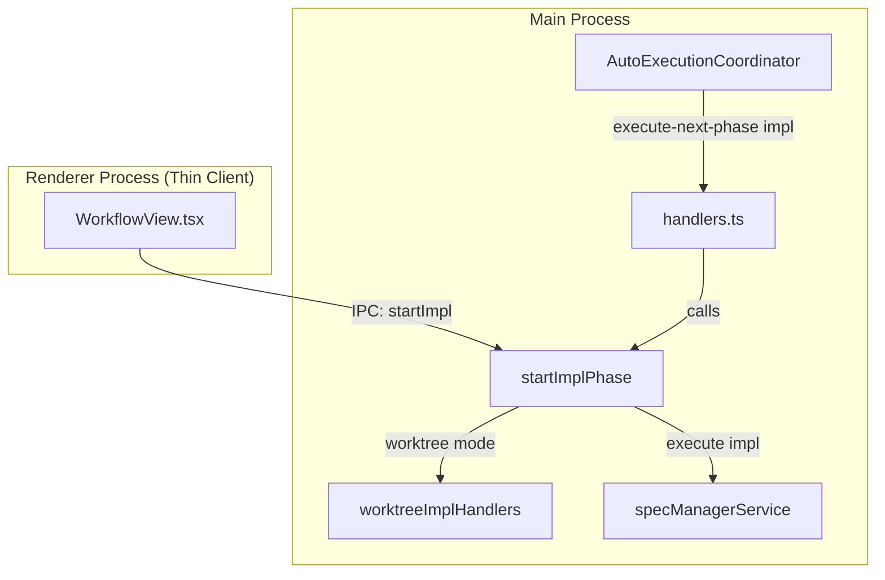
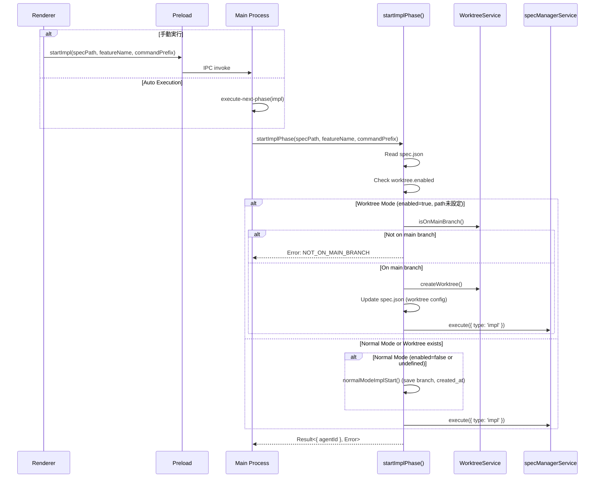

# Design: Impl Start Unification

## Overview

**Purpose**: impl フェーズ開始処理を Main Process の単一関数 `startImplPhase()` に集約し、手動実行と Auto Execution の両方で一貫した動作を保証する。

**Users**: 開発者は SDD Orchestrator を通じて impl フェーズを実行する。手動ボタンクリックでも Auto Execution でも同一のロジックが適用される。

**Impact**: 現在分散している impl 開始ロジック（Renderer の `handleImplExecute()` と Main Process の `execute-next-phase` ハンドラ）を統一し、Auto Execution 時に Worktree 作成がスキップされる構造的問題を解決する。

### Goals

- impl 開始ロジックを Main Process の単一関数に集約（DRY・SSOT 原則）
- 手動実行と Auto Execution で一貫した動作を保証
- Worktree モード時の前提条件チェック（main ブランチ確認）を統一
- Renderer を Thin Client 化し、impl 開始ロジックの重複を排除

### Non-Goals

- Bug ワークフローの Worktree 対応（`bugs-worktree-support` で管理）
- Worktree 作成パスのカスタマイズ
- 複数 Worktree の同時管理
- deploy フェーズの統一（本仕様は impl のみ）

## Architecture

### Existing Architecture Analysis

現在の impl 開始処理は以下の 2 つの経路で実行されている：

1. **手動実行経路（Renderer）**: `WorkflowView.tsx` の `handleImplExecute()` が Worktree チェック・作成を行い、その後 `execute({ type: 'impl' })` を呼び出す
2. **Auto Execution 経路（Main Process）**: `handlers.ts` の `execute-next-phase` イベントハンドラが直接 `execute({ type: 'impl' })` を呼び出す（Worktree 処理なし）

この分散により、Auto Execution 時に Worktree 作成がスキップされる問題が発生している。

**既存コンポーネント**:
- `WorkflowView.tsx`: Renderer 側で impl 開始ロジックを含む
- `handlers.ts`: `execute-next-phase` イベントで impl を実行
- `worktreeImplHandlers.ts`: `handleImplStartWithWorktree()`, `handleImplStartNormalMode()` を提供
- `preload/index.ts`: `worktreeCheckMain`, `worktreeImplStart`, `normalModeImplStart` を公開

### Architecture Pattern & Boundary Map



**Architecture Integration**:
- **Selected pattern**: Main Process 集約 + Thin Client Renderer
- **Domain boundaries**: impl 開始ロジックは Main Process に閉じ込め、Renderer は IPC 呼び出しのみ
- **Existing patterns preserved**: `execute()` API, IPC チャンネル, WorktreeService
- **New components rationale**: `startImplPhase()` 関数を新設し、単一責任で impl 開始を管理
- **Steering compliance**: DRY, SSOT, 関心の分離を遵守

### Technology Stack

| Layer | Choice / Version | Role in Feature | Notes |
|-------|------------------|-----------------|-------|
| Frontend | React 19 + TypeScript 5.8 | Thin Client (IPC 呼び出しのみ) | ロジック削除 |
| Backend | Electron 35 Main Process | impl 開始ロジック集約 | 新規関数追加 |
| IPC | contextBridge + preload | startImpl API 追加 | 新規チャンネル |

## System Flows

### Impl Start Flow (Unified)



**Key Decisions**:
- Worktree モード有効かつ main ブランチでない場合はエラーで停止
- 既存 Worktree がある場合は再作成せず既存を使用
- 通常モードでは現在のブランチ情報を spec.json に保存

## Requirements Traceability

| Criterion ID | Summary | Components | Implementation Approach |
|--------------|---------|------------|------------------------|
| 1.1 | startImplPhase() が worktree.enabled に応じて分岐 | startImplPhase | New implementation |
| 1.2 | startImplPhase() パラメータ定義 | startImplPhase, StartImplParams | New implementation |
| 1.3 | startImplPhase() 戻り値型定義 | startImplPhase, ImplStartResult | New implementation |
| 2.1 | Worktree モード + 非 main ブランチでエラー | startImplPhase | Reuse: isOnMainBranch() |
| 2.2 | Worktree モード + main ブランチで作成・実行 | startImplPhase | Reuse: handleImplStartWithWorktree() |
| 2.3 | Worktree 無効時はブランチチェックスキップ | startImplPhase | New implementation |
| 3.1 | execute-next-phase で startImplPhase 呼び出し | handlers.ts | Modify existing |
| 3.2 | エラー時に coordinator.handleAgentCompleted(failed) | handlers.ts | Modify existing |
| 3.3 | 成功時に coordinator.setCurrentPhase | handlers.ts | Modify existing |
| 4.1 | handleImplExecute が startImpl IPC のみ呼び出し | WorkflowView.tsx | Modify existing (simplify) |
| 4.2 | startImpl IPC パラメータ定義 | preload/index.ts, channels.ts | New implementation |
| 4.3 | IPC エラー時に notify.error() | WorkflowView.tsx | Reuse existing pattern |
| 4.4 | preload.ts に startImpl API 追加 | preload/index.ts | New implementation |
| 5.1 | handleImplExecute から Worktree ロジック削除 | WorkflowView.tsx | Modify existing (delete) |
| 5.2 | handleImplExecute から normalModeImplStart 削除 | WorkflowView.tsx | Modify existing (delete) |
| 5.3 | 既存テストの修正・パス | WorkflowView.test.tsx | Modify existing tests |

### Coverage Validation Checklist

- [x] Every criterion ID from requirements.md appears in the table above
- [x] Each criterion has specific component names (not generic references)
- [x] Implementation approach distinguishes "reuse existing" vs "new implementation"
- [x] User-facing criteria specify concrete UI components

## Components and Interfaces

| Component | Domain/Layer | Intent | Req Coverage | Key Dependencies | Contracts |
|-----------|--------------|--------|--------------|------------------|-----------|
| startImplPhase | Main/Service | impl 開始ロジック統一 | 1.1, 1.2, 1.3, 2.1, 2.2, 2.3 | WorktreeService (P0), specManagerService (P0), fileService (P1) | Service |
| handlers.ts (execute-next-phase) | Main/IPC | Auto Execution 連携 | 3.1, 3.2, 3.3 | startImplPhase (P0), coordinator (P0) | - |
| WorkflowView.tsx | Renderer/UI | Thin Client 化 | 4.1, 4.3, 5.1, 5.2 | preload API (P0) | - |
| preload/index.ts | Preload | startImpl API 追加 | 4.2, 4.4 | IPC_CHANNELS (P0) | API |
| channels.ts | Main/IPC | チャンネル定義 | 4.2 | - | - |

### Main Process / Service Layer

#### startImplPhase

| Field | Detail |
|-------|--------|
| Intent | impl 開始ロジックを単一関数に集約し、Worktree モード判定・作成・impl 実行を一元管理 |
| Requirements | 1.1, 1.2, 1.3, 2.1, 2.2, 2.3 |

**Responsibilities & Constraints**
- spec.json を読み込み worktree.enabled を確認
- Worktree モード有効 + path 未設定時: main ブランチ確認 → Worktree 作成 → impl 実行
- Worktree モード無効時: normalModeImplStart 相当 → impl 実行
- 既存 Worktree がある場合: そのまま impl 実行
- エラー時は Result 型でエラーを返却（例外を投げない）

**Dependencies**
- Inbound: handlers.ts (execute-next-phase), IPC handler (startImpl) — impl 開始トリガー (P0)
- Outbound: WorktreeService — Worktree 操作 (P0)
- Outbound: specManagerService — execute() 呼び出し (P0)
- Outbound: fileService — spec.json 読み書き (P1)

**Contracts**: Service [x]

##### Service Interface

```typescript
interface StartImplParams {
  specPath: string;      // spec.json が存在するディレクトリパス
  featureName: string;   // 機能名（Worktree ブランチ名に使用）
  commandPrefix: string; // コマンドプレフィックス ('kiro' など)
}

type ImplStartErrorType =
  | 'NOT_ON_MAIN_BRANCH'
  | 'WORKTREE_CREATE_FAILED'
  | 'SPEC_JSON_ERROR'
  | 'EXECUTE_FAILED';

interface ImplStartError {
  type: ImplStartErrorType;
  message?: string;
  currentBranch?: string; // NOT_ON_MAIN_BRANCH 時に設定
}

type ImplStartResult =
  | { ok: true; value: { agentId: string } }
  | { ok: false; error: ImplStartError };

function startImplPhase(params: StartImplParams): Promise<ImplStartResult>;
```

- Preconditions:
  - `specPath` に spec.json が存在すること
  - `featureName` が空でないこと
- Postconditions:
  - 成功時: Agent が起動し agentId が返される
  - 失敗時: エラー情報が Result に含まれる
- Invariants:
  - Worktree モード有効時は main ブランチでのみ成功
  - 既存 Worktree がある場合は再作成しない

**Implementation Notes**
- Integration: 既存の `handleImplStartWithWorktree()`, `handleImplStartNormalMode()` を内部で再利用
- Validation: spec.json の worktree.enabled フィールドで分岐判定
- Risks: spec.json 破損時のエラーハンドリングが必要

### Preload / IPC Layer

#### preload/index.ts (startImpl API)

| Field | Detail |
|-------|--------|
| Intent | Renderer から startImplPhase を呼び出すための IPC API |
| Requirements | 4.2, 4.4 |

**Contracts**: API [x]

##### API Contract

```typescript
// preload/index.ts に追加
startImpl: (
  specPath: string,
  featureName: string,
  commandPrefix: string
): Promise<ImplStartResult> =>
  ipcRenderer.invoke(IPC_CHANNELS.START_IMPL, specPath, featureName, commandPrefix);
```

| Method | Endpoint | Request | Response | Errors |
|--------|----------|---------|----------|--------|
| invoke | START_IMPL | (specPath, featureName, commandPrefix) | ImplStartResult | NOT_ON_MAIN_BRANCH, WORKTREE_CREATE_FAILED, SPEC_JSON_ERROR, EXECUTE_FAILED |

**Implementation Notes**
- Integration: 新規チャンネル `START_IMPL` を channels.ts に追加
- Validation: Main Process 側で実施

#### channels.ts

```typescript
// 追加
START_IMPL: 'ipc:start-impl',
```

### Renderer Layer

#### WorkflowView.tsx (handleImplExecute 簡略化)

| Field | Detail |
|-------|--------|
| Intent | impl 開始ボタンクリック時に IPC 呼び出しのみ実行 |
| Requirements | 4.1, 4.3, 5.1, 5.2 |

**現在のコード（削除対象）**:
```typescript
// 削除: worktreeCheckMain, worktreeImplStart, normalModeImplStart 呼び出し
// 約 50 行のロジック
```

**変更後のコード**:
```typescript
const handleImplExecute = useCallback(async () => {
  if (!specDetail) return;

  const specPath = specDetail.metadata.path;
  const featureName = specDetail.metadata.name;

  await wrapExecution(async () => {
    const result = await window.electronAPI.startImpl(
      specPath,
      featureName,
      workflowStore.commandPrefix
    );

    if (!result.ok) {
      let message = 'impl 開始に失敗しました';
      if (result.error.type === 'NOT_ON_MAIN_BRANCH') {
        message = `Worktreeモードはmainブランチでのみ使用できます。現在: ${result.error.currentBranch}`;
      } else if (result.error.message) {
        message = result.error.message;
      }
      notify.error(message);
      return;
    }

    // 成功時は Agent が起動済み（ログ表示等は既存の仕組みで動作）
  });
}, [specDetail, workflowStore.commandPrefix, wrapExecution]);
```

**Implementation Notes**
- Integration: 既存の `wrapExecution` による Optimistic UI は維持
- Validation: Main Process 側で実施
- Risks: 既存テストの修正が必要

### Main Process / IPC Handler

#### handlers.ts (execute-next-phase 修正)

| Field | Detail |
|-------|--------|
| Intent | Auto Execution で impl フェーズ時に startImplPhase を呼び出し |
| Requirements | 3.1, 3.2, 3.3 |

**現在のコード**:
```typescript
coordinator.on('execute-next-phase', async (specPath, phase, context) => {
  // ...
  const result = await service.execute({
    type: phase,
    specId: context.specId,
    featureName: context.featureName,
    commandPrefix: 'kiro',
  });
  // ...
});
```

**変更後のコード**:
```typescript
coordinator.on('execute-next-phase', async (specPath, phase, context) => {
  // ...
  if (phase === 'impl') {
    // impl フェーズは startImplPhase 経由で実行
    // NOTE: Auto Execution では常に 'kiro' プレフィックスを使用
    // SDD Orchestrator 経由の実行は kiro コマンドセットを前提とするため
    const result = await startImplPhase({
      specPath,
      featureName: context.featureName,
      commandPrefix: 'kiro',
    });

    if (result.ok) {
      const agentId = result.value.agentId;
      logger.info('[handlers] execute-next-phase: impl started successfully', { specPath, agentId });
      coordinator.setCurrentPhase(specPath, 'impl', agentId);
      // ... agent completion listener ...
    } else {
      logger.error('[handlers] execute-next-phase: impl start failed', { specPath, error: result.error });
      coordinator.handleAgentCompleted('', specPath, 'failed');
    }
    return;
  }

  // 他のフェーズは既存の処理
  const result = await service.execute({
    type: phase,
    // ...
  });
  // ...
});
```

**Implementation Notes**
- Integration: 既存の agent completion listener パターンを再利用
- Risks: impl 以外のフェーズへの影響がないよう条件分岐を明確に

## Data Models

### spec.json worktree フィールド（既存）

```typescript
interface WorktreeConfig {
  enabled?: boolean;    // Worktree モード有効/無効
  path?: string;        // Worktree 相対パス（作成後に設定）
  branch?: string;      // ブランチ名
  created_at?: string;  // 作成日時
}

interface SpecJson {
  // ... 既存フィールド ...
  worktree?: WorktreeConfig;
}
```

**判定ロジック**:
- `worktree.enabled === true && !worktree.path`: Worktree 作成が必要
- `worktree.enabled === true && worktree.path`: 既存 Worktree を使用
- `worktree.enabled === false` または `worktree` 未定義: 通常モード

## Error Handling

### Error Strategy

`startImplPhase()` は Result 型を使用し、例外を投げない設計とする。

### Error Categories and Responses

| Error Type | 原因 | 対応 |
|------------|------|------|
| NOT_ON_MAIN_BRANCH | Worktree モードで main 以外のブランチ | Auto Execution 停止、ユーザーに main ブランチへの切り替えを促す |
| WORKTREE_CREATE_FAILED | Worktree 作成失敗（既存ブランチ等） | エラーメッセージ表示、ログ出力 |
| SPEC_JSON_ERROR | spec.json 読み書き失敗 | エラーメッセージ表示、ログ出力 |
| EXECUTE_FAILED | execute() 失敗 | エラーメッセージ表示、Auto Execution 停止 |

### Monitoring

- 全エラーを ProjectLogger に出力
- Auto Execution エラー時は `coordinator.handleAgentCompleted(failed)` で状態更新

## Testing Strategy

### Unit Tests

- `startImplPhase()` 関数テスト
  - Worktree モード + main ブランチ: 成功
  - Worktree モード + 非 main ブランチ: NOT_ON_MAIN_BRANCH エラー
  - 通常モード: branch/created_at 保存後に成功
  - 既存 Worktree: 再作成なしで成功

### Integration Tests

- IPC 経由の startImpl 呼び出しテスト
- execute-next-phase(impl) での startImplPhase 呼び出しテスト

### E2E Tests

- 手動 impl 開始ボタンクリック → Agent 起動
- Auto Execution での impl フェーズ実行 → Worktree 作成確認

## Design Decisions

### DD-001: Main Process への impl 開始ロジック集約

| Field | Detail |
|-------|--------|
| Status | Accepted |
| Context | 現在、impl 開始ロジックが Renderer（handleImplExecute）と Main Process（execute-next-phase）に分散しており、Auto Execution 時に Worktree 作成がスキップされる |
| Decision | impl 開始ロジックを Main Process の `startImplPhase()` 関数に集約し、Renderer は IPC 経由で呼び出すのみとする |
| Rationale | DRY・SSOT 原則に基づく最善の設計。ロジックの一元管理により、手動実行と Auto Execution で一貫した動作を保証 |
| Alternatives Considered | Option A: Main Process で Worktree 作成を追加（ロジック重複が残る）、Option C: Renderer 集約（Auto Execution が IPC 経由になり複雑化） |
| Consequences | Renderer のコード削減（約 50 行）、テスト修正が必要、将来の機能追加が容易に |

### DD-002: Thin Client パターンの採用

| Field | Detail |
|-------|--------|
| Status | Accepted |
| Context | Renderer に impl 開始ロジックを残すか、IPC 呼び出しのみにするかを検討 |
| Decision | Renderer は `startImpl` IPC を呼び出すのみとし、全ロジックを Main Process に移動 |
| Rationale | impl 開始ロジックが 1 箇所だけに存在することで混乱を回避。Auto Execution も手動実行も同じ関数を呼ぶことで一貫性を確保 |
| Alternatives Considered | Renderer にロジックを残しつつ Main Process からも呼び出し可能にする（重複が残る） |
| Consequences | Renderer の責務が明確化、デバッグが容易に、IPC 呼び出しのオーバーヘッドは無視可能 |

### DD-003: Worktree 作成の前提条件（main ブランチ必須）

| Field | Detail |
|-------|--------|
| Status | Accepted |
| Context | Worktree モードで impl を開始する際、main ブランチでなければエラーとするか、フォールバックするかを検討 |
| Decision | main ブランチでなければエラーとし、Auto Execution を停止する |
| Rationale | 現在の手動実行と同じ動作を維持。Worktree モードは main ブランチからの分岐を前提としており、異なるブランチからの Worktree 作成は意図しない動作を引き起こす可能性がある |
| Alternatives Considered | 現在のブランチから Worktree を作成する（意図しない動作のリスク）、自動的に main に切り替える（ユーザーの作業を破棄するリスク） |
| Consequences | 明確なエラーメッセージでユーザーに対応を促す、安全側に倒した設計 |

### DD-004: 通常モードの既存動作維持

| Field | Detail |
|-------|--------|
| Status | Accepted |
| Context | `worktree.enabled = false` または未設定の場合の動作を変更するか維持するか |
| Decision | 既存動作を維持（`normalModeImplStart()` で branch、created_at を保存） |
| Rationale | 既存の動作に問題はなく、変更の必要性がない。互換性を維持 |
| Alternatives Considered | 通常モードでも何も保存しない（トレーサビリティ低下）、branch のみ保存（created_at があれば開始時刻がわかる） |
| Consequences | 変更なし、後方互換性維持 |
