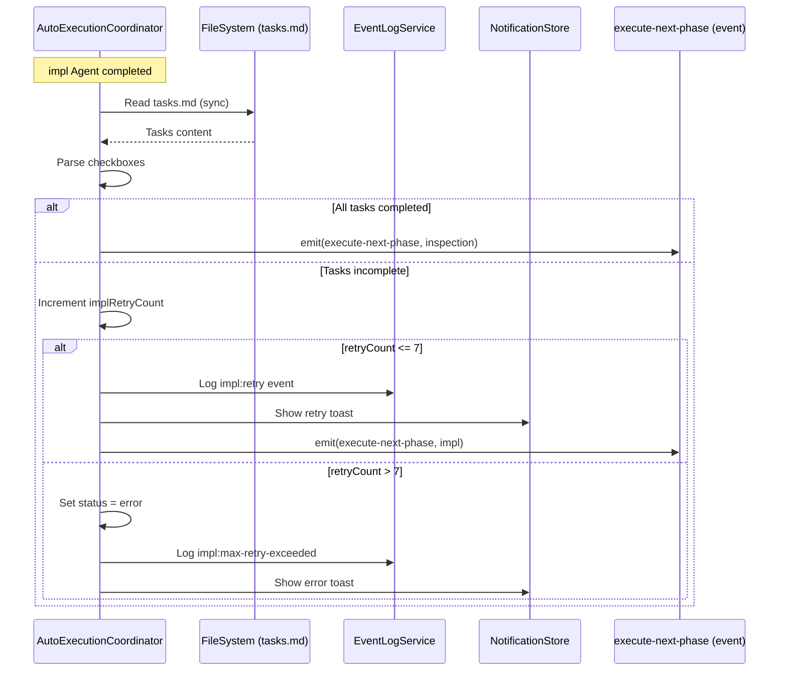

# Design: Impl Task Completion Guard

## Overview

**Purpose**: Impl Agent完了時にtasks.mdの完了度を検証し、未完了タスクがある場合はimplを再実行するガード機構を提供する。これにより自動実行時にtasks完了度100%でないままinspectionフェーズに移行するバグを修正する。

**Users**: 自動実行を使用する開発者。Impl Agentが中途終了した場合でも、自動的にリトライされることでタスク完了を達成できる。

**Impact**: autoExecutionCoordinatorに再実行ロジックを追加し、executionStatesにリトライカウントを追加する。既存のフェーズ遷移ロジックにガード条件を挿入する。

### Goals

- impl Agent完了時にtasks.md完了度を同期的に検証
- 未完了タスクがある場合はimplを自動再実行（最大7回）
- 再実行状況をイベントログとUIトーストで通知
- 7回失敗後はエラー状態に遷移し、明示的なリセットを要求

### Non-Goals

- spec.json.phaseの更新ロジック変更（specsWatcherServiceの責務）
- 未完了タスクのみを引数指定してimplを再実行する機能
- 再実行カウントのspec.jsonへの永続化
- 再実行上限のユーザーカスタマイズ機能

## Architecture

### Existing Architecture Analysis

**修正対象**: `autoExecutionCoordinator.ts`

現在のアーキテクチャ:
- `handleAgentCompleted`メソッドがAgent完了時の処理を担当
- `status === 'completed'`の場合、次フェーズへ遷移を試みる
- `executionStates`はspecPath単位のMap管理
- イベントログは`logAutoExecutionEvent`で記録

**Integration Points**:
- `handleAgentCompleted`: impl Agent完了時のフックポイント
- `executionStates`: リトライカウント追加
- `eventLogService`: リトライイベント記録
- `notificationStore`: UIトースト通知

### Architecture Pattern & Boundary Map



**Key Decisions**:
- tasks.mdパースはautoExecutionCoordinator内で直接実行（specsWatcherServiceのポーリングに依存しない）
- リトライカウントはインメモリ管理（Electron再起動でリセット）
- イベントループを使わず同期的に判定することでタイミング問題を回避

**Architecture Integration**:
- Selected pattern: Guard Condition + Retry Loop（既存のhandleAgentCompletedに条件分岐を追加）
- Domain/feature boundaries: autoExecutionCoordinator内で完結（外部サービスへの依存を最小化）
- Existing patterns preserved: EventEmitter経由のフェーズ実行、EventLogServiceによるログ記録
- New components rationale: TaskCompletionCheckerは不要（単純なパース処理のため既存ユーティリティを活用）
- Steering compliance: DRY（既存のcheckbox正規表現パターンを再利用）、KISS（シンプルな条件分岐）

### Technology Stack

| Layer | Choice / Version | Role in Feature | Notes |
|-------|------------------|-----------------|-------|
| Backend / Services | Node.js / TypeScript | tasks.mdパース、リトライロジック | 既存のfs.readFileSyncを使用 |
| Messaging / Events | EventEmitter | フェーズ実行イベント発火 | execute-next-phaseイベント再利用 |
| Data / Storage | In-memory Map | リトライカウント管理 | executionStatesに追加 |

## System Flows

### Impl Completion Guard Flow

```mermaid
flowchart TD
    A[Impl Agent Completed] --> B{Check tasks.md}
    B -->|Parse checkboxes| C{All [x]?}
    C -->|Yes| D[Proceed to Inspection]
    C -->|No| E{retryCount <= 7?}
    E -->|Yes| F[Increment retryCount]
    F --> G[Log retry event]
    G --> H[Show retry toast]
    H --> I[Re-execute impl]
    I --> A
    E -->|No| J[Set status = error]
    J --> K[Log max-retry event]
    K --> L[Show error toast]
    L --> M[Stop execution]
```

**Key Decisions**:
- tasks.mdパースはspecsWatcherServiceと同じ正規表現パターンを使用（SSOT）
- リトライ時は引数なしでimplを再実行（Agent側で未完了タスクを判断）
- エラー状態からの復帰は明示的なリセット操作が必要

## Requirements Traceability

| Criterion ID | Summary | Components | Implementation Approach |
|--------------|---------|------------|------------------------|
| 1.1 | impl完了時にtasks.md完了度を判定 | AutoExecutionCoordinator.handleAgentCompleted | 新規: parseTasksCompletion呼び出し追加 |
| 1.2 | 全チェックボックス完了なら次フェーズ許可 | AutoExecutionCoordinator.handleAgentCompleted | 既存ロジック維持（条件追加） |
| 1.3 | 未完了なら移行ブロック | AutoExecutionCoordinator.handleAgentCompleted | 新規: ガード条件追加 |
| 2.1 | 未完了時にimpl再実行 | AutoExecutionCoordinator.handleAgentCompleted | 新規: execute-next-phase(impl)発火 |
| 2.2 | 再実行回数をカウント | AutoExecutionState.implRetryCount | 新規: フィールド追加 |
| 2.3 | Electron再起動でカウントリセット | executionStates (Map) | 既存: インメモリ管理 |
| 3.1 | 最大再実行回数7回 | MAX_IMPL_RETRY_COUNT定数 | 新規: 定数定義 |
| 3.2 | 上限到達でエラー状態 | AutoExecutionCoordinator.handleAgentCompleted | 新規: status = 'error'設定 |
| 3.3 | エラー状態中は継続しない | AutoExecutionCoordinator.handleAgentCompleted | 既存: statusチェック |
| 3.4 | リセット操作でエラー解除 | AutoExecutionCoordinator.resetImplRetryCount | 新規: メソッド追加 |
| 4.1 | 再実行をイベントログに記録 | EventLogService | 既存: auto-execution:failイベント（messageでimpl retry識別） |
| 4.2 | 再実行をUIトーストで通知 | NotificationStore.showNotification | 新規: リトライ通知 |
| 4.3 | 上限到達をイベントログに記録 | EventLogService | 既存: auto-execution:failイベント（messageでmax retry識別） |
| 4.4 | 上限到達をUIエラートーストで通知 | NotificationStore.showNotification | 新規: エラー通知 |

### Coverage Validation Checklist

- [x] Every criterion ID from requirements.md appears in the table above
- [x] Each criterion has specific component names (not generic references)
- [x] Implementation approach distinguishes "reuse existing" vs "new implementation"
- [x] User-facing criteria specify concrete UI components

## Components and Interfaces

| Component | Domain/Layer | Intent | Req Coverage | Key Dependencies | Contracts |
|-----------|--------------|--------|--------------|------------------|-----------|
| AutoExecutionCoordinator | Main/Services | impl完了時のタスク完了度検証とリトライ制御 | 1.1-1.3, 2.1-2.3, 3.1-3.4 | EventLogService (P0), NotificationStore (P1) | Service, State |
| AutoExecutionState | Main/Types | リトライカウントを含む状態管理 | 2.2, 2.3 | - | State |

### Main / Services

#### AutoExecutionCoordinator (Extension)

| Field | Detail |
|-------|--------|
| Intent | impl Agent完了時にtasks.md完了度を検証し、未完了の場合はリトライを制御する |
| Requirements | 1.1, 1.2, 1.3, 2.1, 2.2, 2.3, 3.1, 3.2, 3.3, 3.4 |

**Responsibilities & Constraints**
- impl Agentの完了時にtasks.mdを同期的にパースして完了度を判定
- 未完了タスクがある場合はリトライカウントをインクリメントしてimplを再実行
- リトライ上限（7回）到達時はエラー状態に遷移
- リトライカウントはspecPath単位でexecutionStatesに保持

**Dependencies**
- Inbound: AgentLifecycleManager - handleAgentCompleted呼び出し (P0)
- Outbound: EventLogService - リトライイベント記録 (P0)
- Outbound: NotificationStore - UIトースト通知 (P1)
- External: fs (Node.js) - tasks.md読み取り (P0)

**Contracts**: Service [x] / State [x]

##### Service Interface

```typescript
// 定数追加
export const MAX_IMPL_RETRY_COUNT = 7;

// AutoExecutionState型拡張（src/main/services/autoExecutionCoordinator.ts内で定義）
interface AutoExecutionState {
  // ... existing fields ...
  /** Impl phase retry count (reset on Electron restart) */
  implRetryCount?: number;
}

// 新規メソッド
interface AutoExecutionCoordinator {
  /**
   * Reset impl retry count for a spec
   * Called when user explicitly resets error state
   */
  resetImplRetryCount(specPath: string): void;
}
```

- Preconditions: impl Agentが'completed'ステータスで終了していること
- Postconditions: tasks完了度100%の場合のみinspectionフェーズへ遷移
- Invariants: implRetryCount <= MAX_IMPL_RETRY_COUNT

##### State Management

- State model: executionStates MapにimplRetryCountフィールド追加
- Persistence & consistency: インメモリ（Electron再起動でリセット）
- Concurrency strategy: specPath単位のMap管理（既存パターン維持）

**Implementation Notes**
- Integration: handleAgentCompletedメソッド内でcurrentPhase === 'impl'の場合にガード処理を追加
- Validation: tasks.mdパースは既存のcheckbox正規表現パターンを使用
- Risks: tasks.mdのフォーマットが想定外の場合、パース失敗する可能性（フォールバック: 次フェーズへ遷移を許可）

## Data Models

### Domain Model

**TaskCompletion Value Object**:
```typescript
interface TaskCompletionResult {
  readonly total: number;      // 総タスク数
  readonly completed: number;  // 完了タスク数
  readonly isComplete: boolean; // total === completed
}
```

**Business Rules**:
- `isComplete === true`の場合のみinspectionフェーズへの遷移を許可
- total === 0の場合は`isComplete = true`とみなす（タスクなし=完了）

### Data Contracts & Integration

**Event Schema（既存EventType活用方式）**:

リトライイベントは既存の`auto-execution:fail`イベントを活用し、messageフィールドで識別する。
新規EventTypeの追加は影響範囲が大きいため、research.mdの決定に従い既存型を活用する。

```typescript
// リトライ発生時のイベント（auto-execution:fail活用）
const implRetryEvent: AutoExecutionEventData = {
  status: 'failed',
  errorMessage: `Impl retry (${retryCount}/${maxRetries}): ${incompleteTasks} incomplete tasks`
};

// 上限到達時のイベント（auto-execution:fail活用）
const implMaxRetryEvent: AutoExecutionEventData = {
  status: 'failed',
  errorMessage: `Impl max retry exceeded (${retryCount}/${maxRetries})`
};
```

**Note**: messageフィールドに「Impl retry」「Impl max retry exceeded」プレフィックスを含めることで、他のfailイベントと識別可能。

## Error Handling

### Error Strategy

| Error Type | Detection | Response | Recovery |
|------------|-----------|----------|----------|
| tasks.md読み取り失敗 | fs.readFileSyncの例外 | 警告ログ出力、次フェーズへ遷移許可 | フォールバック動作 |
| tasks.mdパース失敗 | 正規表現マッチなし | total=0として扱い、次フェーズ許可 | フォールバック動作 |
| リトライ上限到達 | implRetryCount > 7 | エラー状態、トースト通知 | ユーザーによるリセット操作 |

### Monitoring

- イベントログ: impl:retry, impl:max-retry-exceededイベントを記録
- UIトースト: リトライ発生時とエラー時に通知
- ログレベル: info（リトライ）、error（上限到達）

## Testing Strategy

### Unit Tests

1. **parseTasksCompletion**: 各種checkbox状態のパース正確性
2. **handleAgentCompleted (impl完了時)**: tasks完了/未完了の分岐動作
3. **implRetryCount管理**: インクリメント、上限チェック、リセット
4. **resetImplRetryCount**: カウントリセットと状態復帰

### Integration Tests

1. **impl再実行フロー**: 未完了検出からexecute-next-phase(impl)発火まで
2. **上限到達フロー**: 7回リトライ後のエラー状態遷移
3. **イベントログ統合**: リトライイベントの正確な記録
4. **通知統合**: トースト通知の発火確認

### E2E Tests

1. **正常完了パス**: tasks 100%完了時にinspectionへ遷移
2. **リトライパス**: 1回目未完了、2回目完了でinspectionへ遷移
3. **上限到達パス**: 7回未完了でエラー状態、リセット後に再開可能

## Design Decisions

### DD-001: Tasks完了判定をautoExecutionCoordinator内で直接実行

| Field | Detail |
|-------|--------|
| Status | Accepted |
| Context | tasks.md完了度の判定方法として、specsWatcherServiceのポーリングを活用する案と、autoExecutionCoordinator内で直接パースする案がある |
| Decision | autoExecutionCoordinator内でfs.readFileSyncを使用して同期的にパースする |
| Rationale | specsWatcherServiceはポーリングベース（300msデバウンス）のためタイミング問題がある。Agent完了時に即座に判定する必要があるため、同期的な読み取りが適切 |
| Alternatives Considered | (A) specsWatcherService.checkTaskCompletion()を活用 - タイミング問題のため却下 |
| Consequences | autoExecutionCoordinatorがfsモジュールに直接依存。テスト時はモック必要 |

### DD-002: リトライカウントのインメモリ管理

| Field | Detail |
|-------|--------|
| Status | Accepted |
| Context | リトライカウントの永続化方法として、spec.jsonに保存する案とインメモリで管理する案がある |
| Decision | executionStates MapにimplRetryCountフィールドとしてインメモリ管理 |
| Rationale | Electron再起動は「新しいセッション」として許容可能。永続化するとspec.jsonの汚染や同期問題が発生する |
| Alternatives Considered | (A) spec.jsonに永続化 - ファイル同期の複雑性のため却下 |
| Consequences | Electron再起動でカウントリセット。長時間実行中のリトライ状況は失われる |

### DD-003: 引数なしでimpl再実行

| Field | Detail |
|-------|--------|
| Status | Accepted |
| Context | impl再実行時に未完了タスクのみを引数指定する案と、引数なしで全体を再実行する案がある |
| Decision | 引数なしでimplフェーズ全体を再実行（execute-next-phase(impl)） |
| Rationale | Agent側で未完了タスクを判断する方がシンプル。既存のimpl実行フローと一貫性がある |
| Alternatives Considered | (A) 未完了タスクIDを引数指定 - Agent側の変更が必要で複雑化のため却下 |
| Consequences | Agent側は毎回tasks.mdを読み取り、未完了タスクから実行を継続する既存動作に依存 |

### DD-004: 上限到達時はエラー状態（明示的リセット必要）

| Field | Detail |
|-------|--------|
| Status | Accepted |
| Context | 7回リトライ失敗後の挙動として、一時停止、エラー状態、通知のみ、の選択肢がある |
| Decision | エラー状態に遷移し、ユーザーの明示的なリセット操作を要求 |
| Rationale | 7回失敗は明らかな問題があるため、自動的な継続は危険。ユーザーの介入を強制する |
| Alternatives Considered | (A) 一時停止 - 自動再開の可能性があり不安全、(B) 通知のみ - 問題が見過ごされる |
| Consequences | ユーザーはUIからリセット操作を行う必要がある。resetImplRetryCountメソッドをIPCで公開 |

## Integration & Deprecation Strategy

### Existing Files to Modify (Wiring Points)

| File | Modification |
|------|-------------|
| `src/main/services/autoExecutionCoordinator.ts` | handleAgentCompletedにタスク完了度チェックとリトライロジック追加、AutoExecutionState型にimplRetryCountフィールド追加 |
| `src/main/ipc/autoExecutionHandlers.ts` | resetImplRetryCount IPCハンドラ追加 |
| `src/preload/index.ts` | resetImplRetryCount API公開 |
| `src/renderer/types/electron.d.ts` | resetImplRetryCount型定義追加 |

### Files to Delete (Cleanup)

- No existing files affected

### Remote UI Impact

- **Remote UI対応**: 不要（リトライロジックはMain Process内で完結）
- WebSocketハンドラ追加: 不要
- 通知はshared/stores/notificationStoreを使用するため、Remote UIでも自動的に通知される

## Interface Changes & Impact Analysis

### AutoExecutionState型拡張

**変更内容**: `implRetryCount?: number`フィールド追加

**Callers（更新が必要な箇所）**:
| Caller | 更新内容 | 必須/任意 |
|--------|---------|----------|
| `autoExecutionCoordinator.test.ts` | テストでimplRetryCountフィールドを含むモック作成 | 必須 |
| IPC state-changedイベントリスナー | 新フィールドは任意のため変更不要 | 任意（変更不要） |

**Note**: implRetryCountはオプショナルフィールドのため、既存のCallerは変更不要。テストのみ明示的な対応が必要。

## Integration Test Strategy

### Components

- AutoExecutionCoordinator
- EventLogService
- NotificationStore (shared)
- FileSystem (tasks.md)

### Data Flow

1. Agent完了イベント → AutoExecutionCoordinator.handleAgentCompleted
2. tasks.md読み取り → parseTasksCompletion
3. 未完了判定 → implRetryCountインクリメント
4. イベントログ記録 → EventLogService.logEvent
5. UI通知 → NotificationStore.showNotification
6. impl再実行 → execute-next-phase(impl)イベント発火

### Mock Boundaries

- **Mock**: FileSystem (fs.readFileSync) - tasks.md内容を制御
- **Real**: AutoExecutionCoordinator、EventLogService、NotificationStore

### Verification Points

- implRetryCountが正しくインクリメントされること
- イベントログにimpl:retryが記録されること
- execute-next-phase(impl)イベントが発火されること
- 7回後にstatus === 'error'になること

### Robustness Strategy

- **Async timing**: handleAgentCompletedは同期処理のため、fixed sleepは不要
- **State transitions**: updateStateの戻り値を検証、state-changedイベントのemitを確認
- **Event verification**: EventEmitter.onceでイベント発火を待機

### Prerequisites

- 既存のautoExecutionCoordinator.test.tsのテストヘルパーを活用
- EventLogServiceのモックパターンは既存テストを参照
