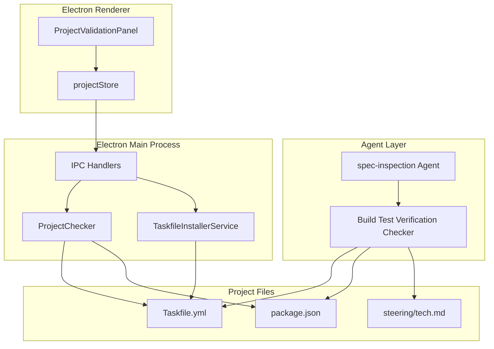
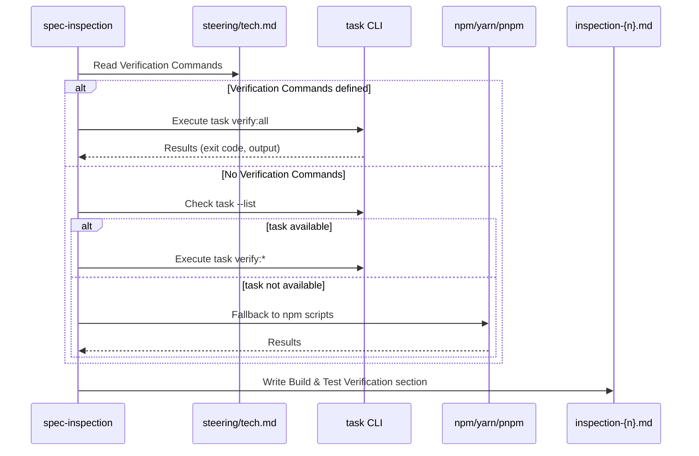
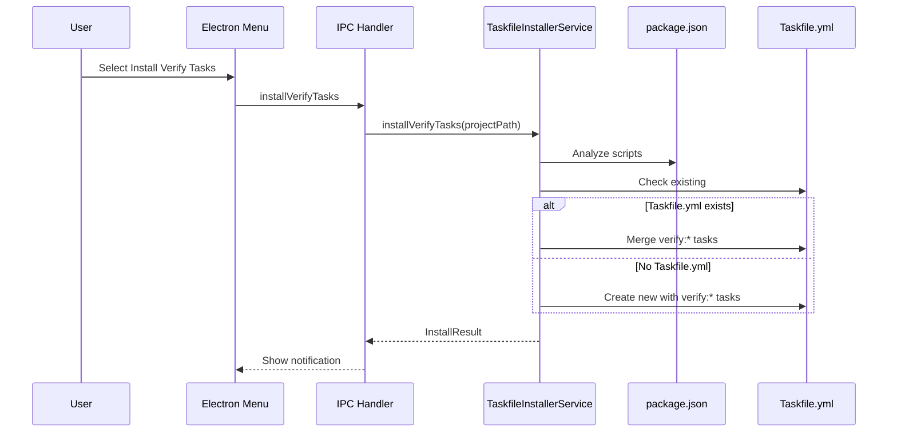

# Design Document - inspection-build-test-verification

## Overview

**Purpose**: spec-inspectionエージェントにビルド・型チェック・lint・ユニットテスト・E2Eテストの検証機能を追加し、実装フェーズ完了後の品質検証を自動化する。

**Users**: 開発者、品質管理担当者、レビュアーが実装完了後の品質検証を自動的に実行し、CI/CDパイプラインとの整合性を確保する。

**Impact**: 既存のspec-inspectionエージェントを拡張し、Build & Test Verificationカテゴリを追加。プロジェクトバリデーションにverify環境確認を追加。Taskfileにverify:*タスク雛形をインストール可能にする。

### Goals

- spec-inspectionにBuild & Test Verificationカテゴリを追加し、ビルド・テスト結果をGO/NOGO判定に組み込む
- steering/tech.mdにVerification Commandsセクションを追加し、プロジェクト共通の検証コマンドを一元管理
- Taskfileのverify:*タスクによる一貫したインターフェースを提供
- taskコマンドがない場合のフォールバック実行をサポート
- verify:*タスク雛形のインストール機能を提供

### Non-Goals

- 検証失敗時の自動修正（--autofixの範囲外）
- CI/CDパイプラインへの直接統合（ローカル実行のみ）
- テストカバレッジ計測・レポート生成
- パフォーマンステストの実行

## Architecture

### Architecture Pattern & Boundary Map



**Architecture Integration**:
- Selected pattern: 既存のspec-inspectionカテゴリパターンを踏襲
- Domain/feature boundaries: Agent層（検証実行）、Electron層（環境確認・インストール）、Project Files（設定・雛形）
- Existing patterns preserved: ProjectChecker、CommandInstallerService、spec-inspectionカテゴリ構造
- New components rationale: TaskfileInstallerServiceは既存パターンに従った雛形インストール担当
- Steering compliance: DRY（既存パターン再利用）、KISS（シンプルな検証フロー）

### Technology Stack

| Layer | Choice / Version | Role in Feature | Notes |
|-------|------------------|-----------------|-------|
| Agent | spec-inspection Agent | 検証実行・レポート生成 | 既存エージェントを拡張 |
| Runtime | Taskfile v3 + task CLI | 検証コマンド抽象化 | ユーザーがインストール |
| Backend | Node.js + Electron | 環境確認・雛形インストール | 既存サービス拡張 |
| Data | YAML (Taskfile.yml) | verify:*タスク定義 | go-task準拠 |

## System Flows

### Build & Test Verification Flow



### Verify Task Template Installation Flow



## Requirements Traceability

| Requirement | Summary | Components | Interfaces | Flows |
|-------------|---------|------------|------------|-------|
| 1.1-1.4 | Steering Verification Commands設定 | spec-inspection Agent | VerificationCommandsConfig | Build & Test Verification Flow |
| 2.1-2.5 | Taskfile verify:*タスク標準化 | TaskfileInstallerService | VerifyTaskTemplate | Verify Task Template Installation Flow |
| 3.1-3.6 | Build & Test Verificationカテゴリ | spec-inspection Agent, BuildTestVerificationChecker | VerificationResult, VerificationStatus | Build & Test Verification Flow |
| 4.1-4.6 | プロジェクトバリデーション強化 | ProjectChecker, ProjectValidationPanel | VerificationEnvironmentCheck | - |
| 5.1-5.6 | verify:*タスク雛形インストール | TaskfileInstallerService | TaskfileInstallerAPI | Verify Task Template Installation Flow |
| 6.1-6.8 | フォールバック実行戦略 | spec-inspection Agent | FallbackExecutionResult | Build & Test Verification Flow |
| 7.1-7.7 | 検査レポート強化 | spec-inspection Agent | BuildTestVerificationReport | Build & Test Verification Flow |

## Components and Interfaces

| Component | Domain/Layer | Intent | Req Coverage | Key Dependencies | Contracts |
|-----------|--------------|--------|--------------|------------------|-----------|
| spec-inspection Agent (拡張) | Agent | Build & Test Verification実行 | 1.1-1.4, 3.1-3.6, 6.1-6.8, 7.1-7.7 | Bash, steering/tech.md (P0) | - |
| TaskfileInstallerService | Electron Main | verify:*タスク雛形インストール | 2.5, 5.1-5.6 | CommandInstallerService (P1) | Service |
| ProjectChecker (拡張) | Electron Main | verify環境確認 | 4.1-4.6 | FileService (P1) | Service |
| ProjectValidationPanel (拡張) | Electron Renderer | verify環境警告表示 | 4.4-4.5 | projectStore (P0) | State |
| projectStore (拡張) | Electron Renderer | verificationCheck状態管理 | 4.6 | IPC (P0) | State |

### Agent Layer

#### spec-inspection Agent (Build & Test Verification拡張)

| Field | Detail |
|-------|--------|
| Intent | ビルド・型チェック・lint・テスト実行結果の検証とレポート生成 |
| Requirements | 1.1-1.4, 3.1-3.6, 6.1-6.8, 7.1-7.7 |
| Execution Group | `impl` |

**Execution Group Configuration**:
spec-inspectionエージェントは`impl`グループに属する。これにより:
- 実装フェーズ（spec-impl）実行中にspec-inspectionは実行されない
- SpecManagerServiceの排他制御機構により並行実行が防止される
- 従来の`validate`グループから`impl`グループへ変更

**Responsibilities & Constraints**
- steering/tech.mdからVerification Commands設定を読み取り
- task verify:*またはフォールバックコマンドを実行
- 各検証項目のPASS/FAIL/SKIP/ERRORステータスを判定
- inspection-{n}.mdにBuild & Test Verificationセクションを追加
- 検証失敗時はCriticalとしてNOGO判定に影響

**Dependencies**
- Inbound: `/kiro:spec-inspection`コマンド実行 (P0)
- Outbound: Bash（コマンド実行）、Read（設定読み取り）、Write（レポート出力）(P0)
- External: task CLI（オプション）、npm/yarn/pnpm（フォールバック）(P2)

**Contracts**: State [ ]

##### Verification Commands Configuration (steering/tech.md)

```markdown
## Verification Commands

プロジェクトの検証コマンド設定。spec-inspectionで使用。

| Category | Command | Description |
|----------|---------|-------------|
| build | task verify:build | ビルド検証 |
| typecheck | task verify:typecheck | 型チェック |
| lint | task verify:lint | lint検証 |
| test | task verify:test | ユニットテスト |
| e2e | task verify:e2e | E2Eテスト |
| all | task verify:all | 全検証実行 |
```

##### Build & Test Verification Report Section

```markdown
### Build & Test Verification

| Category | Status | Command | Duration | Details |
|----------|--------|---------|----------|---------|
| build | PASS | task verify:build | 12.3s | - |
| typecheck | PASS | task verify:typecheck | 8.1s | - |
| lint | FAIL | task verify:lint | 3.2s | 5 errors found |
| test | PASS | task verify:test | 45.2s | 156 tests passed |
| e2e | SKIP | - | - | Not configured |

<details>
<summary>lint エラー詳細</summary>

```
src/components/Example.tsx:10:5 error ...
```

</details>
```

**Implementation Notes**
- Integration: 既存カテゴリ（RequirementsChecker等）と並列に実行
- Validation: Verification Commands未定義の場合はデフォルトを使用
- Risks: 検証コマンドの実行時間が長い場合、進捗ログで対応

### Electron Main Layer

#### TaskfileInstallerService

| Field | Detail |
|-------|--------|
| Intent | verify:*タスク雛形をTaskfile.ymlにインストール |
| Requirements | 2.5, 5.1-5.6 |

**Responsibilities & Constraints**
- package.jsonスクリプトを解析して適切なコマンドを設定
- Taskfile.yml存在時はverify:*タスクのみマージ（既存タスク保持）
- Taskfile.yml未存在時は新規作成
- ユーザー確認後にインストール実行

**Dependencies**
- Inbound: IPC Handler (P0)
- Outbound: FileService (P1)
- External: なし

**Contracts**: Service [x]

##### Service Interface

```typescript
interface TaskfileInstallerService {
  /**
   * verify:*タスク雛形をインストール
   * @param projectPath プロジェクトルートパス
   * @param options インストールオプション
   * @returns インストール結果
   */
  installVerifyTasks(
    projectPath: string,
    options?: InstallVerifyOptions
  ): Promise<Result<InstallVerifyResult, InstallVerifyError>>;

  /**
   * verify:*タスクの存在確認
   * @param projectPath プロジェクトルートパス
   * @returns 確認結果
   */
  checkVerifyTasks(
    projectPath: string
  ): Promise<VerifyTasksCheckResult>;
}

interface InstallVerifyOptions {
  /** 既存タスクを上書きするか */
  readonly force?: boolean;
}

interface InstallVerifyResult {
  /** 新規作成されたタスク */
  readonly installed: readonly string[];
  /** スキップされたタスク（既存） */
  readonly skipped: readonly string[];
  /** Taskfile.ymlが新規作成されたか */
  readonly taskfileCreated: boolean;
}

type InstallVerifyError =
  | { type: 'PERMISSION_DENIED'; path: string }
  | { type: 'INVALID_TASKFILE'; message: string }
  | { type: 'WRITE_ERROR'; path: string; message: string };

interface VerifyTasksCheckResult {
  /** taskコマンドが利用可能か */
  readonly taskAvailable: boolean;
  /** Taskfile.ymlが存在するか */
  readonly taskfileExists: boolean;
  /** 定義済みのverify:*タスク */
  readonly definedTasks: readonly string[];
  /** 未定義のverify:*タスク */
  readonly missingTasks: readonly string[];
}
```

- Preconditions: projectPathが有効なディレクトリ
- Postconditions: Taskfile.ymlにverify:*タスクが追加される
- Invariants: 既存タスクは上書きしない（forceオプション時を除く）

##### verify:*タスク雛形テンプレート

```yaml
# Verification tasks template
# Generated by SDD Orchestrator

version: '3'

tasks:
  verify:build:
    desc: Run build verification
    cmds:
      - npm run build
    preconditions:
      - test -f package.json

  verify:typecheck:
    desc: Run type checking
    cmds:
      - npm run typecheck
    preconditions:
      - test -f package.json

  verify:lint:
    desc: Run linting
    cmds:
      - npm run lint
    preconditions:
      - test -f package.json

  verify:test:
    desc: Run unit tests
    cmds:
      - npm run test:run
    preconditions:
      - test -f package.json

  verify:e2e:
    desc: Run E2E tests
    cmds:
      - npm run test:e2e
    preconditions:
      - test -f package.json

  verify:all:
    desc: Run all verifications
    cmds:
      - task: verify:build
      - task: verify:typecheck
      - task: verify:lint
      - task: verify:test
      - task: verify:e2e
```

**Implementation Notes**
- Integration: CommandInstallerServiceパターンに従う
- Validation: package.jsonスクリプト名を解析してコマンドを自動設定
- Risks: Taskfile.ymlの形式が不正な場合、YAMLパースエラーを明確に報告

#### ProjectChecker (拡張)

| Field | Detail |
|-------|--------|
| Intent | verify環境（taskコマンド、Taskfile.yml、verify:*タスク）の確認 |
| Requirements | 4.1-4.3, 4.6 |

**Responsibilities & Constraints**
- taskコマンドの存在確認（which task）
- Taskfile.ymlの存在確認
- verify:*タスクの定義状況確認
- 結果をVerificationEnvironmentCheck型で返却
- taskコマンド未インストール時のインストール案内URL提供

**taskコマンドインストール案内**:
- 公式ドキュメント: `https://taskfile.dev/installation/`
- macOS (Homebrew): `brew install go-task`
- その他OS: 公式ドキュメント参照

**Dependencies**
- Inbound: IPC Handler (P0)
- Outbound: CommandService（コマンド実行）、FileService（ファイル確認）(P1)
- External: task CLI (P2)

**Contracts**: Service [x]

##### Service Interface Extension

```typescript
interface ProjectChecker {
  // 既存メソッド...

  /**
   * 検証環境を確認
   * @param projectPath プロジェクトルートパス
   * @returns 検証環境確認結果
   */
  checkVerificationEnvironment(
    projectPath: string
  ): Promise<VerificationEnvironmentCheck>;
}

interface VerificationEnvironmentCheck {
  /** taskコマンドが利用可能か */
  readonly taskAvailable: boolean;
  /** Taskfile.ymlが存在するか */
  readonly taskfileExists: boolean;
  /** 定義済みのverify:*タスク */
  readonly verifyTasks: readonly string[];
  /** verify:*タスクが全て定義されているか */
  readonly allVerifyTasksDefined: boolean;
}
```

### Electron Renderer Layer

#### projectStore (拡張)

| Field | Detail |
|-------|--------|
| Intent | verificationCheck状態の管理 |
| Requirements | 4.6 |

**Responsibilities & Constraints**
- VerificationEnvironmentCheck状態の保持
- プロジェクト選択時に自動更新

**Dependencies**
- Inbound: ProjectValidationPanel (P0)
- Outbound: IPC Handler (P0)

**Contracts**: State [x]

##### State Management Extension

```typescript
interface ProjectState {
  // 既存状態...

  /** 検証環境確認結果 */
  verificationCheck: VerificationEnvironmentCheck | null;

  /** 検証環境確認を実行 */
  checkVerificationEnvironment: () => Promise<void>;
}
```

#### ProjectValidationPanel (拡張)

| Field | Detail |
|-------|--------|
| Intent | 検証環境の警告表示とインストール提案 |
| Requirements | 4.4-4.5 |

**Responsibilities & Constraints**
- taskコマンド未インストール時の警告とインストール案内
- verify:*タスク未定義時の雛形インストール提案
- 問題がある場合のみ表示（ノイズ削減）

**Dependencies**
- Inbound: projectStore (P0)
- Outbound: IPC Handler（インストール呼び出し）(P1)

**Contracts**: State [x]

**Implementation Notes**
- Integration: 既存のSpecManagerFilesSectionパターンを踏襲
- Validation: 表示条件は`!verificationCheck.allVerifyTasksDefined`
- Risks: 過度な警告表示によるUXへの影響（問題時のみ表示で対応）

## Data Models

### Type Definition Location

新規型定義の配置場所:

| Type | File Location |
|------|---------------|
| VerificationStatus | `electron-sdd-manager/src/renderer/types/verification.ts` |
| VerificationResult | `electron-sdd-manager/src/renderer/types/verification.ts` |
| VerificationCategory | `electron-sdd-manager/src/renderer/types/verification.ts` |
| BuildTestVerificationSummary | `electron-sdd-manager/src/renderer/types/verification.ts` |
| VerificationEnvironmentCheck | `electron-sdd-manager/src/renderer/types/verification.ts` |

**Re-export**: `electron-sdd-manager/src/renderer/types/index.ts` から上記型をre-exportする。

既存の型定義パターンに従い、検証関連の型は専用ファイル `verification.ts` に集約する。

### Domain Model

#### VerificationStatus (Value Object)

```typescript
type VerificationStatus = 'PASS' | 'FAIL' | 'SKIP' | 'ERROR';

interface VerificationResult {
  /** 検証カテゴリ */
  readonly category: VerificationCategory;
  /** ステータス */
  readonly status: VerificationStatus;
  /** 実行コマンド */
  readonly command: string | null;
  /** 実行時間（秒） */
  readonly duration: number | null;
  /** 詳細（エラー時） */
  readonly details: string | null;
  /** 出力ログ（FAIL/ERROR時） */
  readonly output: string | null;
}

type VerificationCategory = 'build' | 'typecheck' | 'lint' | 'test' | 'e2e';

interface BuildTestVerificationSummary {
  /** 全検証結果 */
  readonly results: readonly VerificationResult[];
  /** 全体ステータス */
  readonly overallStatus: 'PASSED' | 'FAILED';
  /** FAILしたカテゴリ */
  readonly failedCategories: readonly VerificationCategory[];
  /** フォールバックモードか */
  readonly fallbackMode: boolean;
}
```

### Logical Data Model

#### steering/tech.md Verification Commands Format

```markdown
## Verification Commands

| Category | Command | Description |
|----------|---------|-------------|
| build | task verify:build | ビルド検証 |
| typecheck | task verify:typecheck | 型チェック |
| lint | task verify:lint | lint検証 |
| test | task verify:test | ユニットテスト |
| e2e | task verify:e2e | E2Eテスト |
```

パース規則:
- `## Verification Commands`セクションを検索
- Markdownテーブルをパース
- Category列とCommand列を抽出

## Error Handling

### Error Strategy

検証実行時のエラーは適切なステータスで報告し、可能な限り検証を継続する。

### Error Categories and Responses

**User Errors (Verification Failures)**:
- ビルド失敗 → FAIL、エラー出力を詳細に記録
- テスト失敗 → FAIL、失敗テスト一覧を記録
- lint違反 → FAIL、違反箇所を詳細に記録

**System Errors**:
- taskコマンド未インストール → フォールバックモードで実行、警告を出力
- verify:*タスク未定義 → SKIP、雛形インストールを提案
- コマンドタイムアウト → ERROR、タイムアウト時間を記録

**Configuration Errors**:
- Verification Commands未定義 → デフォルトコマンドを使用
- 不正なTaskfile.yml → パースエラーを報告、フォールバック

### Timeout Configuration

検証コマンド実行時のタイムアウト設定:

| Category | Default Timeout | Description |
|----------|-----------------|-------------|
| build | 300秒 (5分) | ビルド処理 |
| typecheck | 300秒 (5分) | 型チェック |
| lint | 300秒 (5分) | lint検証 |
| test | 300秒 (5分) | ユニットテスト |
| e2e | 600秒 (10分) | E2Eテスト（長時間実行のため延長） |

タイムアウト時はERRORステータスとして記録し、タイムアウト時間をdetailsに含める。

### verify:all Failure Policy

verify:allの失敗ポリシー:
- **継続実行**: いずれかのカテゴリが失敗しても、後続の検証を継続実行する
- **実行順序**: build → typecheck → lint → test → e2e
- **最終報告**: 全検証完了後、失敗したカテゴリを一覧表示
- **終了コード**: いずれかが失敗した場合は非ゼロで終了

この方針により、1回の実行で全ての問題を把握可能。

### Monitoring

- 各検証の実行時間をレポートに記録
- FAIL/ERRORカテゴリはCriticalとしてGO/NOGO判定に反映

## Testing Strategy

### Unit Tests

- TaskfileInstallerService.installVerifyTasks: 新規作成/マージ/上書きシナリオ
- TaskfileInstallerService.checkVerifyTasks: 各種存在パターン
- ProjectChecker.checkVerificationEnvironment: task有無/Taskfile有無パターン
- VerificationCommandsパーサー: tech.mdからの設定抽出

### Integration Tests

- IPC経由のverify:*タスクインストールフロー
- プロジェクト選択時のverificationCheck自動更新
- spec-inspectionエージェントのBuild & Test Verification実行（モック）

### E2E Tests

- ProjectValidationPanelでの警告表示確認
- メニューからのverify:*タスクインストール確認
- 検査レポートのBuild & Test Verificationセクション確認

## Optional Sections

### Security Considerations

- 検証コマンドはユーザー定義のため、信頼できるプロジェクトのみで実行
- Taskfile.ymlはプロジェクト所有者が管理

### Performance & Scalability

- verify:allは順次実行（build→typecheck→lint→test→e2e）
- 各検証の実行時間を計測してボトルネックを特定可能
- E2Eテストはオプショナル（時間がかかるため）
