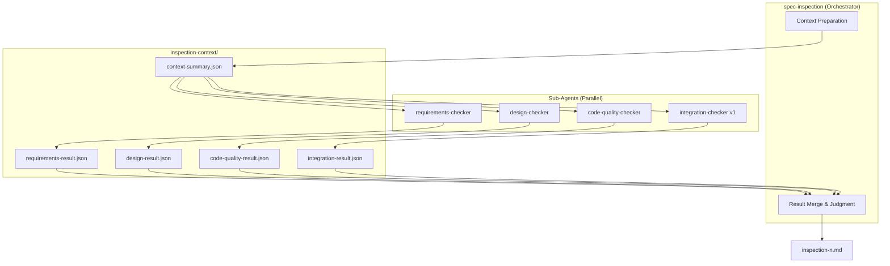
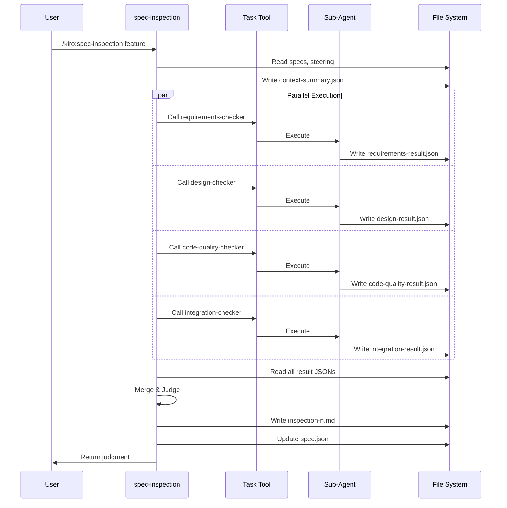
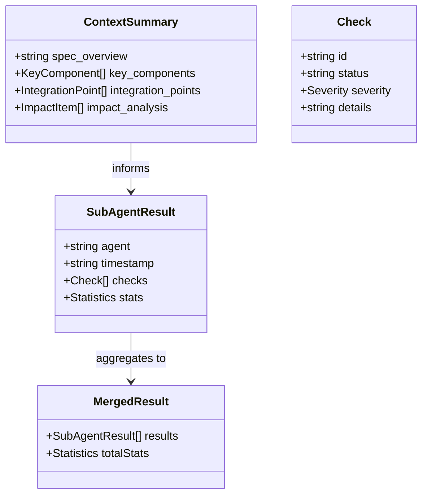

# Design: Inspection Distributed Architecture

## Overview

**Purpose**: 本機能はspec-inspectionの責務肥大化問題を解決し、検査品質を向上させる。

**Users**: 開発者がspec-inspectionを実行する際、各検査カテゴリが専門サブエージェントにより深い分析を受けられるようになる。

**Impact**: 既存のspec-inspection-agent.mdを完全に置き換え、新しい分散アーキテクチャに移行する。単一エージェントによる8カテゴリ検査から、4つのサブエージェント（requirements-checker, design-checker, code-quality-checker, integration-checker v1）への分散構成に変更。

### Goals

- spec-inspectionをオーケストレーターとして再構築し、専門サブエージェントを呼び出す構造に変更
- コンテキスト階層化により、トークン使用量の爆発を防止
- 各サブエージェントが独立したJSON形式の検査結果を返却し、統合可能にする
- Quick Modeとして5分以内の高速フィードバックループを実現

### Non-Goals

- E2Eテスト実行（Spec 2: e2e-workflow で実装予定）
- Full Mode（E2E実行を含む）
- design.mdテンプレート拡張（User Journey, Impact Analysis Contract）
- generate-inspection-e2eコマンド
- 既存specのマイグレーション（旧形式のまま動作可能）

## Architecture

### Existing Architecture Analysis

現在のspec-inspection-agent.mdは単一エージェントで8つの検査カテゴリを実行：

1. Requirements Compliance
2. Design Alignment
3. Task Completion
4. Steering Consistency
5. Design Principles (DRY, SSOT, KISS, YAGNI)
6. Dead Code & Zombie Code Detection
7. Integration Verification
8. Logging Compliance

**課題**:
- 単一エージェントのコンテキストウィンドウに全カテゴリの検査ロジックを詰め込み、注意力分散
- 各カテゴリの検査深度が浅くなる傾向
- 並列実行不可による処理時間の増大

### Architecture Pattern & Boundary Map



**Key Decisions**:
- **Orchestrator-Worker Pattern**: spec-inspectionが調整役となり、各サブエージェントに検査を委譲
- **Context Hierarchy**: 共通コンテキストを1回読み込み、サマリーをサブエージェントに配布（トークン効率化）
- **JSON Contract**: サブエージェント間の情報共有にJSON形式を採用（構造化・パース容易）
- **Parallel Execution**: 依存関係のないサブエージェントは並列実行可能

**Steering Compliance**:
- structure.md: エージェントファイルは`.claude/agents/kiro/`に配置
- design-principles.md: 単一責任の原則に従い、各サブエージェントは1つの検査カテゴリに特化

### Technology Stack

| Layer | Choice / Version | Role in Feature | Notes |
|-------|------------------|-----------------|-------|
| Agent Runtime | Claude Code + Task tool | サブエージェント呼び出し | 既存パターンを踏襲 |
| Data Exchange | JSON | サブエージェント間結果共有 | 構造化データ、パース容易 |
| Temporary Storage | `.kiro/specs/{feature}/inspection-context/` | 検査コンテキスト・結果格納 | Spec単位で分離 |

### Command Prompt Architecture

**Execution Model**:
- [x] CLI invocation: Task toolを使用してサブエージェントを呼び出し

**Rationale**: 各サブエージェントは独立したプロンプトファイルとして定義。Task toolによるサブエージェント呼び出しは既存パターン（spec-inspection → spec-tdd-impl-agent）に準拠。

**Data Flow**:


**Key Decisions**:
- サブエージェントは結果をファイルに書き出し、オーケストレーターがマージ
- 並列呼び出しにより検査時間を短縮
- 各サブエージェントはcontext-summary.jsonと担当カテゴリの詳細ファイルのみを読み込み

## Requirements Traceability

| Criterion ID | Summary | Components | Implementation Approach |
|--------------|---------|------------|------------------------|
| 1.1 | サブエージェント呼び出し構造 | spec-inspection-agent.md | Task tool呼び出しを追加 |
| 1.2 | JSON形式結果返却 | SubAgentResult型, 各checkerエージェント | 新規実装 |
| 1.3 | 結果統合しinspection-{n}.md生成 | spec-inspection-agent.md | 既存レポート生成を拡張 |
| 1.4 | 並列実行 | spec-inspection-agent.md | 複数Task呼び出し |
| 2.1 | 共通コンテキスト1回読み込み | spec-inspection-agent.md | Context Preparation phase |
| 2.2 | context-summary.json生成 | ContextSummary型, spec-inspection-agent.md | 新規実装 |
| 2.3 | サマリー+担当詳細のみ配布 | 各checkerエージェント | 新規実装 |
| 2.4 | inspection-context/配置 | spec-inspection-agent.md | ファイル書き出しロジック追加 |
| 3.1 | 全要件抽出・証拠検索 | requirements-checker-agent.md | 新規作成 |
| 3.2 | Grep使用カバレッジ確認 | requirements-checker-agent.md | 新規作成 |
| 3.3 | PASS/FAIL/PARTIAL判定 | RequirementCheck型 | 新規実装 |
| 3.4 | 未カバー要件Critical報告 | requirements-checker-agent.md | 新規作成 |
| 3.5 | requirements-result.json出力 | requirements-checker-agent.md | 新規作成 |
| 4.1 | コンポーネント存在確認 | design-checker-agent.md | 新規作成 |
| 4.2 | インターフェースシグネチャ検証 | design-checker-agent.md | 新規作成 |
| 4.3 | steering規約確認 | design-checker-agent.md | 新規作成 |
| 4.4 | 設計逸脱Major報告 | design-checker-agent.md | 新規作成 |
| 4.5 | design-result.json出力 | design-checker-agent.md | 新規作成 |
| 5.1 | 設計原則遵守検証 | code-quality-checker-agent.md | 新規作成 |
| 5.2 | 削除宣言残存・プレースホルダー検出 | code-quality-checker-agent.md | 新規作成 |
| 5.3 | Dead Code検出 | code-quality-checker-agent.md | 新規作成 |
| 5.4 | logging.md規約確認 | code-quality-checker-agent.md | 新規作成 |
| 5.5 | code-quality-result.json出力 | code-quality-checker-agent.md | 新規作成 |
| 6.1 | タスク完了確認 | integration-checker-agent.md | 新規作成 |
| 6.2 | import確認 | integration-checker-agent.md | 新規作成 |
| 6.3 | JSX/呼び出し確認 | integration-checker-agent.md | 新規作成 |
| 6.4 | プレースホルダー残存検出 | integration-checker-agent.md | 新規作成 |
| 6.5 | 配線タスク確認 | integration-checker-agent.md | 新規作成 |
| 6.6 | integration-result.json出力 | integration-checker-agent.md | 新規作成 |
| 7.1 | JSON結果マージ | spec-inspection-agent.md | 新規実装 |
| 7.2 | 判定ロジック | spec-inspection-agent.md | 既存ロジック維持 |
| 7.3 | inspection-{n}.md拡張フォーマット | spec-inspection-agent.md | セクション追加 |
| 7.4 | GOでphase更新 | spec-inspection-agent.md | 既存ロジック維持 |
| 7.5 | --fixオプション維持 | spec-inspection-agent.md | 既存機能維持 |
| 8.1 | デフォルトQuick Mode | spec-inspection-agent.md | 新規実装 |
| 8.2 | Quick Mode検査実行 | spec-inspection-agent.md | 新規実装 |
| 8.3 | 5分以内目標 | 全体設計 | 並列実行で達成 |
| 8.4 | Mode記録 | spec-inspection-agent.md | フォーマット拡張 |
| 9.1 | spec-inspection置き換え | spec-inspection-agent.md | 既存ファイル更新 |
| 9.2 | Task tool使用 | spec-inspection-agent.md | 既存パターン適用 |
| 9.3 | 並列呼び出し | spec-inspection-agent.md | 新規実装 |
| 9.4 | --fix/--autofix維持 | spec-inspection-agent.md | 既存機能維持 |
| 9.5 | 後方互換性 | spec-inspection-agent.md | セクション構造維持 |

### Coverage Validation Checklist

- [x] Every criterion ID from requirements.md appears in the table above
- [x] Each criterion has specific component names (not generic references)
- [x] Implementation approach distinguishes "reuse existing" vs "new implementation"
- [x] User-facing criteria specify concrete components

## Components and Interfaces

| Component | Domain/Layer | Intent | Req Coverage | Key Dependencies | Contracts |
|-----------|--------------|--------|--------------|------------------|-----------|
| spec-inspection-agent.md | Agent | Inspection orchestrator | 1.1-1.4, 2.1-2.4, 7.1-7.5, 8.1-8.4, 9.1-9.5 | Task tool, File System | Service |
| requirements-checker-agent.md | Agent | Requirements compliance check | 3.1-3.5 | Grep, Read | Service |
| design-checker-agent.md | Agent | Design alignment check | 4.1-4.5 | Grep, Read | Service |
| code-quality-checker-agent.md | Agent | Code quality check | 5.1-5.5 | Grep, Read, CLAUDE.md | Service |
| integration-checker-agent.md | Agent | Integration check (v1 static) | 6.1-6.6 | Glob, Grep, Read | Service |
| ContextSummary | Data Model | Shared context for sub-agents | 2.2 | - | State |
| SubAgentResult | Data Model | Standardized result format | 1.2, 3.5, 4.5, 5.5, 6.6 | - | State |

### Agent Layer

#### spec-inspection-agent.md (Orchestrator)

| Field | Detail |
|-------|--------|
| Intent | サブエージェントを呼び出し、結果を統合してGO/NOGO判定を行う |
| Requirements | 1.1-1.4, 2.1-2.4, 7.1-7.5, 8.1-8.4, 9.1-9.5 |

**Responsibilities & Constraints**
- Phase 1: Context Preparation - specs, steeringを1回読み込み、context-summary.jsonを生成
- Phase 2: Parallel Sub-Agent Invocation - Task toolで4つのサブエージェントを並列呼び出し
- Phase 3: Result Merge & Judgment - 全結果JSONをマージし、GO/NOGO判定
- Phase 4: Report Generation - inspection-{n}.mdを生成、spec.json更新
- 既存の--fix, --autofixオプションを維持

**Dependencies**
- Outbound: requirements-checker-agent.md - 要件検査委譲 (P0)
- Outbound: design-checker-agent.md - 設計検査委譲 (P0)
- Outbound: code-quality-checker-agent.md - 品質検査委譲 (P0)
- Outbound: integration-checker-agent.md - 統合検査委譲 (P0)
- Outbound: spec-tdd-impl-agent - --fix時の実装委譲 (P1)

**Contracts**: Service [x]

##### Service Interface

```typescript
// spec-inspection-agent execution flow
interface InspectionOrchestrator {
  // Phase 1: Context Preparation
  loadContext(feature: string): ContextSummary;

  // Phase 2: Parallel Sub-Agent Invocation
  invokeSubAgents(contextSummaryPath: string): Promise<void>;

  // Phase 3: Result Merge & Judgment
  mergeResults(resultPaths: string[]): MergedResult;
  renderJudgment(merged: MergedResult): Judgment;

  // Phase 4: Report Generation
  generateReport(feature: string, judgment: Judgment, merged: MergedResult): void;
  updateSpecJson(feature: string, judgment: Judgment): void;
}

type Judgment = 'GO' | 'NOGO';
```

- Preconditions: spec.json存在、tasks.md承認済み
- Postconditions: inspection-{n}.md生成、spec.json.inspection.rounds更新
- Invariants: 既存inspection-{n}.mdは上書きしない（連番付与）

#### requirements-checker-agent.md

| Field | Detail |
|-------|--------|
| Intent | requirements.mdの全要件について実装カバレッジを検査する |
| Requirements | 3.1-3.5 |

**Responsibilities & Constraints**
- requirements.mdの全要件を抽出
- Grepで実装ファイル内の証拠を検索
- 各要件にPASS/FAIL/PARTIAL判定を付与
- 未カバー要件をCritical severityで報告
- requirements-result.jsonを出力

**Dependencies**
- Inbound: spec-inspection-agent.md - 呼び出し元 (P0)
- External: context-summary.json - 共通コンテキスト (P0)

**Contracts**: Service [x]

##### Service Interface

```typescript
interface RequirementsChecker {
  extractRequirements(requirementsMd: string): Requirement[];
  checkCoverage(req: Requirement, implementationFiles: string[]): RequirementCheck;
  generateResult(checks: RequirementCheck[]): SubAgentResult;
}

interface Requirement {
  id: string;         // e.g., "1.1", "2.3"
  description: string;
  acceptanceCriteria: string[];
}

interface RequirementCheck {
  requirementId: string;
  status: 'PASS' | 'FAIL' | 'PARTIAL';
  severity: Severity;
  details: string;
  evidence: string[];  // Grep hit locations
}
```

- Preconditions: context-summary.json存在
- Postconditions: requirements-result.json出力
- Invariants: 全要件を検査（スキップ不可）

#### design-checker-agent.md

| Field | Detail |
|-------|--------|
| Intent | design.mdのコンポーネント/インターフェースと実装の整合性を検査する |
| Requirements | 4.1-4.5 |

**Responsibilities & Constraints**
- design.mdの全コンポーネント/インターフェースを抽出
- 実装ファイルに存在することを確認
- インターフェースシグネチャの一致を検証
- steering/*.md（product, tech, structure）との整合性確認
- 設計からの逸脱をMajor severityで報告
- design-result.jsonを出力

**Dependencies**
- Inbound: spec-inspection-agent.md - 呼び出し元 (P0)
- External: context-summary.json - 共通コンテキスト (P0)
- External: steering/*.md - 規約参照 (P1)

**Contracts**: Service [x]

##### Service Interface

```typescript
interface DesignChecker {
  extractComponents(designMd: string): DesignComponent[];
  checkExistence(component: DesignComponent): DesignCheck;
  checkInterfaceMatch(component: DesignComponent): DesignCheck;
  checkSteeringCompliance(implFiles: string[], steeringDocs: SteeringDoc[]): DesignCheck[];
  generateResult(checks: DesignCheck[]): SubAgentResult;
}

interface DesignComponent {
  name: string;
  type: 'component' | 'service' | 'interface' | 'type';
  expectedPath: string;
  interfaceSignature?: string;
}

interface DesignCheck {
  componentName: string;
  checkType: 'existence' | 'interface' | 'steering';
  status: 'PASS' | 'FAIL';
  severity: Severity;
  details: string;
}
```

- Preconditions: context-summary.json存在、design.md存在
- Postconditions: design-result.json出力
- Invariants: steering 3ファイル（product, tech, structure）を必ず確認

#### code-quality-checker-agent.md

| Field | Detail |
|-------|--------|
| Intent | 設計原則遵守、Dead Code検出、ロギング規約を検査する |
| Requirements | 5.1-5.5 |

**Responsibilities & Constraints**
- CLAUDE.md + steering/design-principles.mdの設計原則（DRY, SSOT, KISS, YAGNI）遵守を検証
- design.mdのIntegration & Deprecation Strategy（またはImpact Analysis）に基づく検出：
  - 削除宣言されたファイルの残存
  - プレースホルダーコメントの残存
  - 未使用のexport
- 新規コンポーネント/サービスが実際に使用されていることを確認（Dead Code検出）
- steering/logging.md規約確認
- code-quality-result.jsonを出力

**Dependencies**
- Inbound: spec-inspection-agent.md - 呼び出し元 (P0)
- External: context-summary.json - 共通コンテキスト (P0)
- External: CLAUDE.md - 設計原則 (P0)
- External: steering/logging.md - ロギング規約 (P1)

**Contracts**: Service [x]

##### Service Interface

```typescript
interface CodeQualityChecker {
  checkDesignPrinciples(implFiles: string[]): QualityCheck[];
  checkImpactAnalysis(designMd: string, implFiles: string[]): QualityCheck[];
  checkDeadCode(designMd: string, implFiles: string[]): QualityCheck[];
  checkLoggingCompliance(implFiles: string[], loggingMd: string): QualityCheck[];
  generateResult(checks: QualityCheck[]): SubAgentResult;
}

interface QualityCheck {
  category: 'principle' | 'impact' | 'dead-code' | 'logging';
  rule: string;          // e.g., "DRY", "deletion-completed", "no-unused-exports"
  status: 'PASS' | 'FAIL';
  severity: Severity;
  details: string;
  location?: string;     // file path if applicable
}
```

- Preconditions: context-summary.json存在
- Postconditions: code-quality-result.json出力
- Invariants: 4原則（DRY, SSOT, KISS, YAGNI）を必ずチェック

#### integration-checker-agent.md (v1: 静的検査)

| Field | Detail |
|-------|--------|
| Intent | タスク完了状況と統合状態を静的に検査する |
| Requirements | 6.1-6.6 |

**Responsibilities & Constraints**
- tasks.mdの全タスクが完了（`[x]`）していることを確認
- 新規コンポーネントがどこかからimportされていることを確認
- 新規コンポーネントがJSX/呼び出しで実際に使用されていることを確認
- プレースホルダーコメント（"TODO", "実装予定", "Task X.X"）の残存を検出
- 配線タスク（import更新）が実際に実行されたことを確認
- integration-result.jsonを出力

**Dependencies**
- Inbound: spec-inspection-agent.md - 呼び出し元 (P0)
- External: context-summary.json - 共通コンテキスト (P0)
- External: tasks.md - タスク一覧 (P0)

**Contracts**: Service [x]

##### Service Interface

```typescript
interface IntegrationChecker {
  checkTaskCompletion(tasksMd: string): IntegrationCheck[];
  checkImports(newComponents: string[]): IntegrationCheck[];
  checkUsage(newComponents: string[]): IntegrationCheck[];
  checkPlaceholders(implFiles: string[]): IntegrationCheck[];
  checkWiringTasks(tasksMd: string, implFiles: string[]): IntegrationCheck[];
  generateResult(checks: IntegrationCheck[]): SubAgentResult;
}

interface IntegrationCheck {
  checkType: 'task-completion' | 'import' | 'usage' | 'placeholder' | 'wiring';
  target: string;        // task ID or component name
  status: 'PASS' | 'FAIL';
  severity: Severity;
  details: string;
}
```

- Preconditions: context-summary.json存在、tasks.md存在
- Postconditions: integration-result.json出力
- Invariants: E2Eは実行しない（v1は静的検査のみ）

### Data Models

#### Domain Model



#### Logical Data Model

##### ContextSummary

共通コンテキストをサブエージェントに配布するためのサマリー。

```typescript
interface ContextSummary {
  spec_overview: string;           // 仕様の要約（1-2文）
  key_components: KeyComponent[];  // 主要コンポーネント一覧
  integration_points: IntegrationPoint[];  // 統合ポイント一覧
  impact_analysis: ImpactItem[];   // design.mdから抽出した削除・更新対象
}

interface KeyComponent {
  name: string;
  type: 'component' | 'service' | 'type' | 'agent';
  path: string;
  requirements: string[];  // covered requirement IDs
}

interface IntegrationPoint {
  source: string;
  target: string;
  type: 'import' | 'call' | 'event' | 'ipc';
}

interface ImpactItem {
  target: string;         // file or component name
  action: 'DELETE' | 'UPDATE' | 'CREATE';
  reason: string;
}
```

##### SubAgentResult

サブエージェントが出力する標準化された結果フォーマット。

```typescript
interface SubAgentResult {
  agent: 'requirements-checker' | 'design-checker' | 'code-quality-checker' | 'integration-checker';
  timestamp: string;      // ISO 8601
  checks: Check[];
  stats: Statistics;
}

interface Check {
  id: string;             // unique check identifier
  category: string;       // agent-specific category
  status: 'PASS' | 'FAIL' | 'PARTIAL';
  severity: Severity;
  details: string;
  evidence?: string[];    // supporting information
}

type Severity = 'Critical' | 'Major' | 'Minor' | 'Info';

interface Statistics {
  total: number;
  passed: number;
  failed: number;
  critical: number;
  major: number;
  minor: number;
  info: number;
}
```

#### Physical Data Model

**inspection-context/ Directory Structure**:

```
.kiro/specs/{feature}/inspection-context/
├── context-summary.json        # 共通サマリー（オーケストレーターが生成）
├── requirements-result.json    # requirements-checker出力
├── design-result.json          # design-checker出力
├── code-quality-result.json    # code-quality-checker出力
└── integration-result.json     # integration-checker出力
```

**配置場所の決定**: `.kiro/specs/{feature}/inspection-context/` に配置。理由：
- Spec単位で分離され、Spec削除時にクリーンアップ容易
- inspection-{n}.mdと同じ場所で管理
- 一時ディレクトリより永続性があり、デバッグに有用

## Error Handling

### Error Strategy

各サブエージェントは独立して実行され、エラー発生時も他のサブエージェントに影響しない。

### Timeout Strategy

各サブエージェントはTask toolのデフォルトタイムアウト（2分）が適用される。タイムアウト超過時は該当カテゴリをスキップし、inspection-{n}.mdのWarningsセクションにエラー情報を記録する。

### Error Categories and Responses

**Sub-Agent Errors**:
- サブエージェント実行失敗 → 該当カテゴリをスキップ、inspection-{n}.mdのWarningsセクションにエラー情報（エージェント名、エラー理由）を記録
- 結果JSON生成失敗 → 空の結果として扱い、inspection-{n}.mdのWarningsセクションに警告を記録

**Context Errors**:
- context-summary.json生成失敗 → 検査中止、エラーレポート

**Judgment Errors**:
- 一部カテゴリ欠落でも判定可能 → 欠落カテゴリをWarningとして記録し、残りで判定

### Monitoring

- 各サブエージェントの実行時間を記録
- 結果JSONの存在確認でサブエージェント完了を検知

## Testing Strategy

### Unit Tests

本機能はエージェントプロンプトのみで構成されるため、従来のUnit Testは不要。

### Integration Tests

エージェント連携の検証は、実際のSpec実行によるE2Eテストで行う（Spec 2: e2e-workflowのスコープ）。

### Manual Verification

| 検証項目 | 方法 |
|----------|------|
| サブエージェント呼び出し | 実Specでspec-inspection実行、inspection-context/配下のJSONファイル確認 |
| 結果統合 | inspection-{n}.mdのSub-Agent Resultsセクション確認 |
| 並列実行 | 実行時間がシーケンシャル実行より短いことを確認 |
| 後方互換性 | 既存Specでspec-inspection実行、エラーなく完了することを確認 |

## Design Decisions

### DD-001: サブエージェント分散アーキテクチャの採用

| Field | Detail |
|-------|--------|
| Status | Accepted |
| Context | 現在のspec-inspectionは単一エージェントで8カテゴリを検査しており、コンテキストウィンドウの圧迫と注意力分散が問題 |
| Decision | 4つの専門サブエージェント（requirements-checker, design-checker, code-quality-checker, integration-checker）に分散 |
| Rationale | 各サブエージェントが1カテゴリに集中することで検査品質が向上。並列実行で時間短縮も期待 |
| Alternatives Considered | 1. 単一エージェントのプロンプト最適化（検査深度の改善が困難）、2. カテゴリ別プロンプトファイル分割のみ（並列実行不可） |
| Consequences | エージェントファイル数増加（4ファイル追加）、Task tool呼び出しオーバーヘッド |

### DD-002: コンテキスト階層化によるトークン効率化

| Field | Detail |
|-------|--------|
| Status | Accepted |
| Context | 5つのエージェント（オーケストレーター+4サブ）が同じコンテキストを読むとトークン使用量が爆発 |
| Decision | オーケストレーターが1回だけ共通コンテキストを読み込み、context-summary.jsonを生成してサブエージェントに配布 |
| Rationale | サブエージェントは「サマリー + 担当カテゴリの詳細ファイル」のみを読み込むことでトークン使用量を抑制 |
| Alternatives Considered | 1. 全エージェントが全ファイルを読む（トークン爆発）、2. 共有メモリ機構の導入（Claude Codeに存在しない） |
| Consequences | context-summary.jsonのスキーマ維持が必要、サマリー品質が検査品質に影響 |

### DD-003: JSON形式によるサブエージェント間結果共有

| Field | Detail |
|-------|--------|
| Status | Accepted |
| Context | サブエージェントの結果をオーケストレーターがマージする必要がある |
| Decision | 各サブエージェントはSubAgentResult型のJSONファイルを出力 |
| Rationale | JSON形式は構造化されており、パースが容易。型定義によりスキーマを明確化 |
| Alternatives Considered | 1. Markdown形式（パース困難）、2. 標準出力での返却（並列実行時の取り扱い複雑） |
| Consequences | JSON生成・パースの実装が必要、スキーマ変更時は全サブエージェント更新が必要 |

### DD-004: inspection-context/のSpec内配置

| Field | Detail |
|-------|--------|
| Status | Accepted |
| Context | サブエージェント結果の保存場所を決定する必要がある（Open Question対応） |
| Decision | `.kiro/specs/{feature}/inspection-context/` に配置。`.gitignore`への追加を推奨 |
| Rationale | Spec単位で分離され管理が容易。Spec削除時にクリーンアップ。デバッグ時に参照可能。一時的な検査結果であり通常はバージョン管理不要 |
| Alternatives Considered | 1. 一時ディレクトリ（デバッグ困難）、2. `.kiro/runtime/`配下（Spec関連性が不明確） |
| Consequences | Specディレクトリにファイルが増加（5ファイル）。`.gitignore`に`**/inspection-context/`の追加を推奨。ただしデバッグ目的でコミットする場合はプロジェクト単位で判断可能 |

### DD-005: Quick Modeをデフォルトとする

| Field | Detail |
|-------|--------|
| Status | Accepted |
| Context | 開発中の頻繁な確認では高速なフィードバックループが重要 |
| Decision | デフォルトでQuick Mode（静的検査のみ）として動作 |
| Rationale | 5分以内の目標を達成しやすく、開発者体験が向上。E2E実行はSpec 2で--fullオプションとして追加予定 |
| Alternatives Considered | 1. Full Modeをデフォルト（時間がかかりすぎる）、2. オプション必須（既存互換性の問題） |
| Consequences | 本Specではeintegration-checker v1として静的検査のみ実装。E2E実行はSpec 2でv2として追加 |

## Integration & Deprecation Strategy

### 結合対象ファイル（Wiring Points）

| ファイル | 変更内容 |
|----------|----------|
| `.claude/agents/kiro/spec-inspection.md` | 完全書き換え（サブエージェント呼び出し構造に変更） |

### 削除対象ファイル（Cleanup）

なし（既存ファイルの置き換えのみ）

### 新規作成ファイル

| ファイル | 説明 |
|----------|------|
| `.claude/agents/kiro/requirements-checker.md` | 要件検査サブエージェント |
| `.claude/agents/kiro/design-checker.md` | 設計検査サブエージェント |
| `.claude/agents/kiro/code-quality-checker.md` | 品質検査サブエージェント |
| `.claude/agents/kiro/integration-checker.md` | 統合検査サブエージェント（v1: 静的検査） |

### 後方互換性

- inspection-{n}.mdのフォーマットは後方互換を維持（セクション追加のみ）
- --fix, --autofixオプションは既存動作を維持
- spec.jsonのinspection.rounds構造は維持

## Interface Changes & Impact Analysis

### spec-inspection-agent.md 変更

**変更内容**: 内部実装をサブエージェント呼び出し構造に完全変更

**外部インターフェース**: 変更なし
- 入力: feature名、オプション（--fix, --autofix）
- 出力: inspection-{n}.md、spec.json更新

**既存呼び出し元への影響**: なし（インターフェース維持）

## Integration Test Strategy

本Specはエージェントプロンプトファイルのみを対象とするため、従来のIntegration Testは不適用。

### 手動検証ポイント

| 検証項目 | データフロー | 検証方法 |
|----------|-------------|----------|
| サブエージェント呼び出し | spec-inspection → Task tool → サブエージェント | 実Specでspec-inspection実行、4つのresult.jsonが生成されることを確認 |
| 結果マージ | 4つのresult.json → inspection-{n}.md | Sub-Agent Resultsセクションに4カテゴリの結果が含まれることを確認 |
| 判定ロジック | マージ結果 → GO/NOGO | Critical/Major数に基づく判定が正しいことを確認 |

### 検証シナリオ

1. **正常ケース**: 全サブエージェントPASS → GO判定
2. **Critical検出**: requirements-checkerがCritical報告 → NOGO判定
3. **Major累積**: 複数サブエージェントでMajor 3件以上 → NOGO判定
4. **サブエージェントエラー**: 1つのサブエージェントが失敗 → 残りで判定、Warning記録
