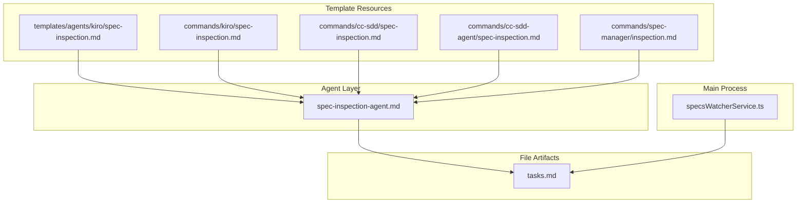
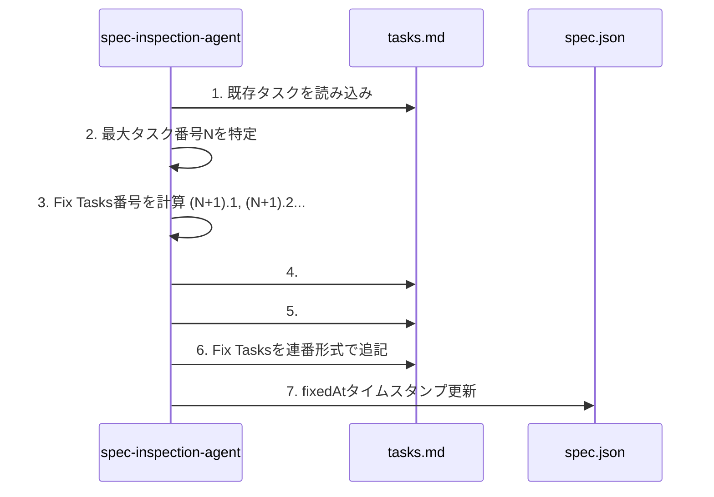

# Design: Inspection Fix Task Format

## Overview

**Purpose**: Fix Tasksのタスク番号体系を連番継続方式に統一し、セクション構造で出自を明確にする。

**Users**: 開発者、SDDワークフロー利用者、spec-inspection agent

**Impact**: 現在の`FIX-N`形式から`N.M`形式への変更。タスク進捗計算の一貫性向上、パーサーへの影響ゼロ。

### Goals

- Fix Tasksが通常タスクと同じ番号体系（`N.M`形式）を使用する
- `## Inspection Fixes`セクションでFix Tasksの出自を明確化
- 既存の`FIX-N`形式との後方互換性を維持
- パーサー変更なしで実装

### Non-Goals

- UIでのFix Tasks視覚的区別（バッジ、背景色、アイコン）
- 既存tasks.mdの`FIX-N`形式から連番形式への自動マイグレーション
- TaskProgressViewでのセクション別折りたたみ表示

## Architecture

### Existing Architecture Analysis

現在のspec-inspection agentは以下の動作を行う：

1. **Fix Tasks生成**: `--fix`モードでNOGO判定時、`FIX-1`, `FIX-2`形式でタスクを生成
2. **tasks.mdへの追記**: セクション構造なしでtasks.md末尾に追加
3. **タスクパーサー**: `/^- \[x\]/gim`と`/^- \[ \]/gm`で完了/未完了タスクをカウント

**影響範囲**:
- `.claude/agents/kiro/spec-inspection.md` (spec-inspection agent定義)
- `electron-sdd-manager/resources/templates/agents/kiro/spec-inspection.md` (テンプレート)
- `electron-sdd-manager/src/main/services/specsWatcherService.ts` (タスク完了検出)

### Architecture Pattern & Boundary Map



**Architecture Integration**:
- 選択パターン: Agent定義ファイルの更新（ドキュメント変更のみ）
- ドメイン境界: Agent定義 / テンプレート / ファイル監視
- 既存パターン維持: タスクパーサーのチェックボックス正規表現は変更なし
- 新規コンポーネント: なし（既存ファイルの更新のみ）
- Steering準拠: YAGNI原則に従いパーサー変更を回避

### Technology Stack

| Layer | Choice / Version | Role in Feature | Notes |
|-------|------------------|-----------------|-------|
| Agent Definition | Markdown (Claude Agent) | Fix Tasks生成ロジック定義 | 複数テンプレートファイル |
| File Monitoring | chokidar | タスク完了検出（変更なし） | 既存の正規表現を維持 |

## System Flows

### Fix Tasks生成フロー



**Key Decisions**:
- 最大番号特定は整数部分のみ（`6.3` → 6）
- 新タスクグループは N+1 から開始
- Appendixセクションがある場合はその前に挿入

## Requirements Traceability

| Criterion ID | Summary | Components | Implementation Approach |
|--------------|---------|------------|------------------------|
| 1.1 | 既存タスクの最大番号の次から連番でタスクIDを付与 | spec-inspection.md | Agent定義ファイルのFix Tasks生成ロジック修正 |
| 1.2 | サブタスクはN.M形式を使用 | spec-inspection.md | 同上 |
| 1.3 | FIX-N形式を使用しない（新規生成時） | spec-inspection.md | 同上 |
| 2.1 | tasks.md末尾に`## Inspection Fixes`セクション追加 | spec-inspection.md | セクション追加ロジック追加 |
| 2.2 | `### Round N (YYYY-MM-DD)`サブセクション作成 | spec-inspection.md | サブセクション生成ロジック追加 |
| 2.3 | 各タスクに関連情報（Task X.Y, Requirement Z.Z）記載 | spec-inspection.md | タスク記述フォーマット更新 |
| 2.4 | Appendixセクションがある場合その前に挿入 | spec-inspection.md | セクション挿入位置判定ロジック追加 |
| 3.1 | 既存パーサーがFIX-N形式を引き続き認識 | specsWatcherService.ts | 変更なし（既存の正規表現を維持） |
| 3.2 | 既存ファイルのFIX-Nは変換しない | - | 設計方針（マイグレーション対象外） |
| 4.1 | --fixモードでtasks.md読み込み、最大番号特定 | spec-inspection.md | Agent定義ファイル修正 |
| 4.2 | N.M形式から最大整数部分Nを取得 | spec-inspection.md | タスク番号解析ロジック追加 |
| 4.3 | 新タスクグループ番号(N+1)から開始 | spec-inspection.md | 同上 |
| 4.4 | Inspection Fixesセクションが存在しない場合`---`後に新規作成 | spec-inspection.md | セクション作成ロジック追加 |
| 4.5 | Appendixセクションがある場合その直前に挿入 | spec-inspection.md | セクション挿入位置判定ロジック追加 |

### Coverage Validation Checklist

- [x] Every criterion ID from requirements.md appears in the table above
- [x] Each criterion has specific component names (not generic references)
- [x] Implementation approach distinguishes "reuse existing" vs "new implementation"
- [x] User-facing criteria specify concrete components

## Components and Interfaces

### Component Summary

| Component | Domain/Layer | Intent | Req Coverage | Key Dependencies | Contracts |
|-----------|--------------|--------|--------------|------------------|-----------|
| spec-inspection.md | Agent Definition | Fix Tasks生成ロジック定義 | 1.1-1.3, 2.1-2.4, 4.1-4.5 | tasks.md (Outbound, P0) | - |
| specsWatcherService.ts | Main Process | タスク完了検出（変更なし） | 3.1 | tasks.md (Inbound, P0) | - |

### Agent Definition Layer

#### spec-inspection.md (Agent Definition)

| Field | Detail |
|-------|--------|
| Intent | Inspectionで検出されたCritical/Major問題のFix Tasks生成 |
| Requirements | 1.1, 1.2, 1.3, 2.1, 2.2, 2.3, 2.4, 4.1, 4.2, 4.3, 4.4, 4.5 |

**Responsibilities & Constraints**
- tasks.mdの既存タスクを読み込み、最大タスク番号を特定
- 新しいFix Tasksを連番継続形式（N+1.M）で生成
- `## Inspection Fixes`セクションを適切な位置に挿入
- `### Round N (YYYY-MM-DD)`形式でラウンド情報を記録
- 各タスクに関連情報（関連タスク、要件）を付記

**Dependencies**
- Outbound: tasks.md - Fix Tasks追記先 (P0)
- Outbound: spec.json - fixedAtタイムスタンプ更新 (P1)

**Implementation Notes**
- タスク番号解析: `/^- \[.\] (\d+)\.(\d+)/gm`で既存タスクIDを抽出
- 最大番号計算: 抽出した整数部分の最大値を取得
- セクション挿入位置: `## Appendix`の直前、なければファイル末尾
- 日付フォーマット: ISO 8601形式（YYYY-MM-DD）

## Data Models

### Task ID Structure

**現行形式（FIX-N）**:
```
FIX-1, FIX-2, FIX-3, ...
```

**新形式（連番継続）**:
```
(既存最大番号 + 1).1, (既存最大番号 + 1).2, ...
例: 既存が6タスクの場合 → 7.1, 7.2, 7.3, ...
```

### tasks.md Section Structure

```markdown
# Implementation Plan

- [x] 1. タスクグループ1
- [x] 1.1 サブタスク1
- [x] 1.2 サブタスク2

- [x] 2. タスクグループ2
...

- [x] 6. タスクグループ6
- [x] 6.1 最後の通常サブタスク

---

## Inspection Fixes

### Round 1 (2026-01-17)

- [ ] 7.1 Fix Task 1
  - 関連: Task 2.3, Requirement 1.2
  - 修正内容の詳細

- [ ] 7.2 Fix Task 2
  - 関連: Task 4.1, Requirement 3.1

### Round 2 (2026-01-18)

- [ ] 8.1 Fix Task from Round 2
  - 関連: Task 7.1, Requirement 2.1

---

## Appendix: Requirements Coverage Matrix

| Criterion ID | Summary | Task(s) |
|--------------|---------|---------|
| ... | ... | ... |
```

## Error Handling

### Error Strategy

| Error Scenario | Response | Severity |
|---------------|----------|----------|
| tasks.mdが存在しない | エラー報告、Fix Tasks生成をスキップ | Critical |
| タスク番号が解析できない | 警告ログ、番号1から開始 | Warning |
| Inspection Fixesセクション解析失敗 | 新規セクション作成 | Info |

## Testing Strategy

### Unit Tests

1. **タスク番号解析テスト**
   - 正常なN.M形式タスクからの最大番号抽出
   - 混在形式（N.M + FIX-N）からの最大番号抽出
   - 空のtasks.mdでの動作確認

2. **セクション挿入位置テスト**
   - Appendixセクションがある場合の挿入位置
   - Appendixセクションがない場合の挿入位置
   - 既存Inspection Fixesセクションへの追記

### Integration Tests

1. **Fix Tasks生成フロー**
   - spec-inspection --fixモードでの連番生成確認
   - 複数ラウンドでの連番継続確認
   - タスク完了検出との整合性確認

2. **後方互換性テスト**
   - 既存FIX-N形式のタスク完了検出
   - 混在形式での進捗計算

## Design Decisions

### DD-001: 連番継続方式の採用

| Field | Detail |
|-------|--------|
| Status | Accepted |
| Context | Fix Tasks専用のID体系（`FIX-1`, `R2-1`）vs 通常タスクとの連番継続（`7.1`, `7.2`）の選択 |
| Decision | 連番継続方式を採用 |
| Rationale | パーサーへの影響ゼロ、進捗計算がシンプル、セクション見出しで出自は十分明確 |
| Alternatives Considered | Fix Tasks専用ID体系 - パーサー変更が必要、進捗計算ロジックの複雑化 |
| Consequences | 既存のタスクパーサー（チェックボックス正規表現）を変更せずに実装可能 |

### DD-002: セクション分離による出自明確化

| Field | Detail |
|-------|--------|
| Status | Accepted |
| Context | UIでのFix Tasks視覚的区別（バッジ、背景色）vs セクション分離のみ |
| Decision | セクション分離のみ（`## Inspection Fixes`セクション配下に配置） |
| Rationale | YAGNI原則、tasks.mdのセクション見出しで十分、必要になれば後から拡張可能 |
| Alternatives Considered | UIバッジ/背景色 - パーサー変更、TaskProgressViewの拡張が必要 |
| Consequences | UIでの視覚的区別なし、将来必要になれば別specで対応 |

### DD-003: Appendixセクション前への挿入

| Field | Detail |
|-------|--------|
| Status | Accepted |
| Context | Inspection FixesセクションとAppendixセクションの配置順序 |
| Decision | Appendixセクションがある場合、その直前にInspection Fixesセクションを挿入 |
| Rationale | Appendixは参照情報、Inspection Fixesは実装タスクなので論理的に前に配置すべき |
| Alternatives Considered | 常にファイル末尾に追加 - Appendixより後ろになり論理構造が崩れる |
| Consequences | セクション挿入位置の判定ロジックが必要 |

### DD-004: 後方互換性の維持（マイグレーションなし）

| Field | Detail |
|-------|--------|
| Status | Accepted |
| Context | 既存の`FIX-N`形式タスクの扱い |
| Decision | 新規生成時のみ連番形式を使用、既存ファイルの`FIX-N`は変換しない |
| Rationale | 既存specの動作を保証、マイグレーションコストを回避 |
| Alternatives Considered | 自動マイグレーション - リスクが高く、価値が低い |
| Consequences | 既存のパーサーは`FIX-N`形式を引き続き認識する必要あり（現状維持） |
