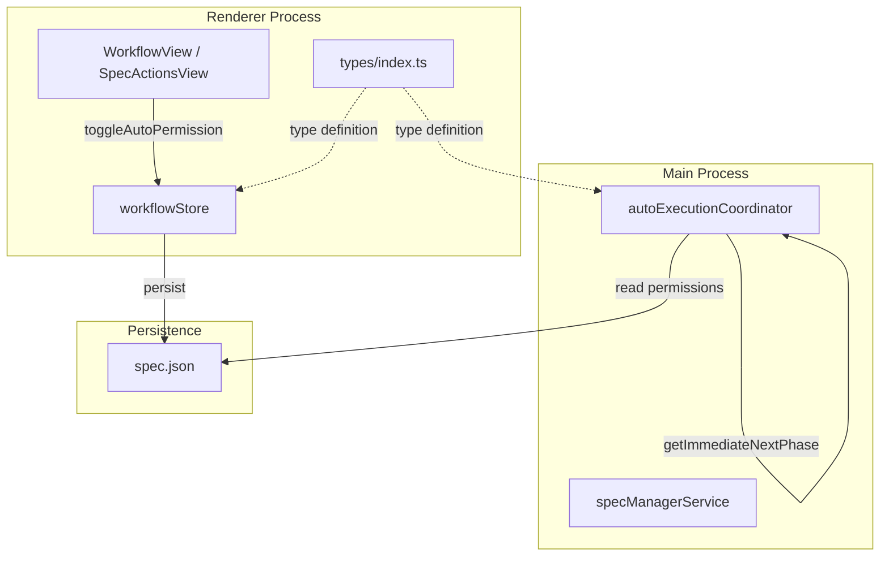
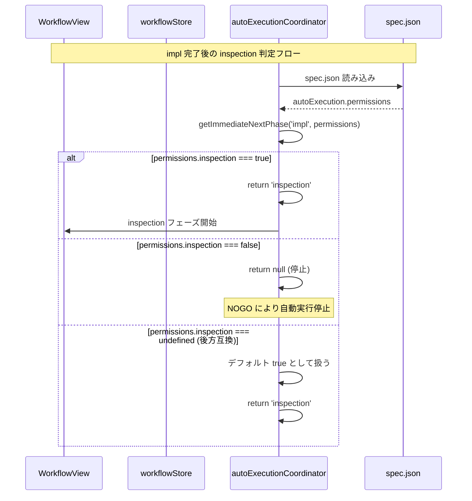
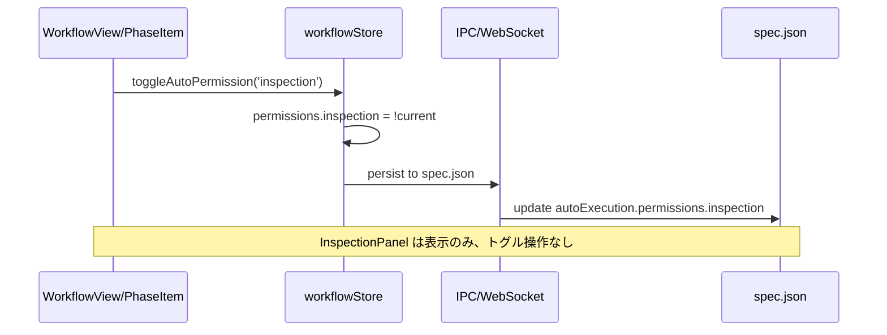

# Design: Inspection Permission Unification

## Overview

**Purpose**: inspection フェーズの自動実行許可設定を統一し、impl 完了後に inspection が正しくトリガーされるようにする。

**Users**: SDD Orchestrator を利用する開発者が、一貫した UI パターンで inspection の GO/NOGO を制御できるようになる。

**Impact**: 現在の `inspectionAutoExecutionFlag` ('run' | 'pause') と `permissions.inspection` (boolean) の二重管理を廃止し、`permissions.inspection` に一本化する。これにより、型定義・デフォルト値・UI・Main Process 判定ロジックの不整合が解消される。

### Goals

- `AutoExecutionPermissions.inspection` を全モジュールで必須フィールドとして統一
- デフォルト値を `true` に統一し、impl 完了後に自動的に inspection が実行される動作を実現
- `inspectionAutoExecutionFlag` 関連の重複コードを削除
- inspection の GO/NOGO 操作を PhaseItem の `toggleAutoPermission` パターンに統一
- 既存 spec.json との後方互換性を維持

### Non-Goals

- Inspection 結果（GO/NOGO 判定）のロジック変更
- InspectionPanel の表示内容（結果表示、Fix ボタン等）の変更
- deploy フェーズの自動実行ロジック変更
- spec.json のマイグレーションスクリプト作成（後方互換性で対応）

## Architecture

### Existing Architecture Analysis

**現状の問題点**:

1. **型定義の不整合**:
   - `renderer/types/index.ts`: `inspection: boolean` (必須)
   - `renderer/stores/workflowStore.ts`: `inspection: boolean` (必須)
   - `renderer/hooks/useAutoExecution.ts`: `inspection` フィールドなし
   - `main/services/autoExecutionCoordinator.ts`: `inspection?: boolean` (オプショナル)

2. **デフォルト値の不整合**:
   - `DEFAULT_SPEC_AUTO_EXECUTION_STATE.permissions.inspection`: `true`
   - `DEFAULT_AUTO_EXECUTION_PERMISSIONS.inspection`: `false`

3. **重複概念**:
   - `permissions.inspection`: boolean 型で GO/NOGO を管理
   - `inspectionAutoExecutionFlag`: 'run' | 'pause' 型で同じ概念を管理
   - `InspectionPanel` が独自の run/pause トグルを表示

**既存パターン**:
- 他フェーズ（requirements, design, tasks, impl, deploy）は `permissions.*` と `toggleAutoPermission()` で統一管理
- PhaseItem コンポーネントが GO/NOGO トグルを提供
- inspection のみ InspectionPanel で別途トグルを表示

### Architecture Pattern & Boundary Map



**Architecture Integration**:
- **Selected pattern**: SSOT (Single Source of Truth) - `permissions.inspection` を唯一の情報源とする
- **Domain boundaries**:
  - Renderer: UI 表示と状態管理（workflowStore）
  - Main Process: 自動実行ロジック（autoExecutionCoordinator）
  - Persistence: spec.json（autoExecution.permissions）
- **Existing patterns preserved**:
  - PhaseItem + toggleAutoPermission パターン
  - spec.json への永続化フロー
- **New components rationale**: 新規コンポーネントなし、既存コードの修正のみ
- **Steering compliance**: DRY（重複削除）、SSOT（単一情報源）、KISS（シンプル化）

### Technology Stack

| Layer | Choice / Version | Role in Feature | Notes |
|-------|------------------|-----------------|-------|
| Frontend | React 19 + TypeScript 5.8 | UI コンポーネント修正 | 型定義変更、InspectionPanel 修正 |
| State Management | Zustand | workflowStore 修正 | inspectionAutoExecutionFlag 削除 |
| Backend | Node.js (Electron 35) | autoExecutionCoordinator 修正 | 型定義統一、後方互換性処理 |
| Data / Storage | spec.json | permissions.inspection 永続化 | inspectionFlag フィールド廃止 |

## System Flows

### Auto Execution Flow (After Unification)



### Permission Toggle Flow



## Requirements Traceability

| Criterion ID | Summary | Components | Implementation Approach |
|--------------|---------|------------|------------------------|
| 1.1 | renderer/types/index.ts で inspection 必須 | AutoExecutionPermissions (types/index.ts) | 既存定義の確認（既に必須） |
| 1.2 | workflowStore.ts で inspection 必須 | AutoExecutionPermissions (workflowStore.ts) | 既存定義の確認（既に必須） |
| 1.3 | useAutoExecution.ts に inspection 追加 | AutoExecutionPermissions (useAutoExecution.ts) | 新規フィールド追加 |
| 1.4 | autoExecutionCoordinator.ts で inspection 必須 | AutoExecutionPermissions (autoExecutionCoordinator.ts) | オプショナルから必須に変更 |
| 1.5 | deploy も必須フィールド化 | AutoExecutionPermissions (全4箇所) | 既存定義の確認・修正 |
| 2.1 | workflowStore デフォルト inspection: true | DEFAULT_AUTO_EXECUTION_PERMISSIONS | デフォルト値変更 |
| 2.2 | types/index.ts デフォルト inspection: true | DEFAULT_SPEC_AUTO_EXECUTION_STATE | 既存確認（既に true） |
| 2.3 | 両者のデフォルト値一致 | 上記2箇所 | 2.1 の修正で達成 |
| 3.1 | inspectionAutoExecutionFlag 削除 | WorkflowState (workflowStore.ts) | フィールド削除 |
| 3.2 | InspectionAutoExecutionFlag 型廃止 | types/index.ts | 型定義削除（InspectionPanel 用に残す場合あり） |
| 3.3 | setInspectionAutoExecutionFlag 削除 | WorkflowActions (workflowStore.ts) | アクション削除 |
| 3.4 | SpecAutoExecutionState から inspectionFlag 削除 | SpecAutoExecutionState (types/index.ts) | フィールド削除 |
| 3.5 | createSpecAutoExecutionState から inspectionFlag 削除 | createSpecAutoExecutionState (types/index.ts) | 処理削除 |
| 3.6 | spec.json 永続化から inspectionFlag 除外 | workflowStore.ts, specManagerService.ts | 永続化ロジック修正 |
| 4.1 | InspectionPanel から run/pause スイッチ削除 | InspectionPanel.tsx | props・UI 削除 |
| 4.2 | inspection GO/NOGO を permissions.inspection で管理 | workflowStore | 既存パターン活用 |
| 4.3 | inspection トグルが toggleAutoPermission 呼び出し | WorkflowView | PhaseItem パターン適用 |
| 4.4 | InspectionPanel は表示のみ | InspectionPanel.tsx | onAutoExecutionFlagChange 削除 |
| 5.1 | getImmediateNextPhase で permissions.inspection 判定 | autoExecutionCoordinator.ts | 既存ロジック活用（修正不要） |
| 5.2 | inspection: false で自動実行停止 | autoExecutionCoordinator.ts | 既存ロジック活用（修正不要） |
| 5.3 | inspection: undefined でデフォルト true | autoExecutionCoordinator.ts | フォールバック処理追加 |
| 6.1 | 既存 spec.json に inspection がない場合 | autoExecutionCoordinator.ts, workflowStore | デフォルト true として動作 |
| 6.2 | inspectionFlag がある場合は無視 | autoExecutionCoordinator.ts | 警告ログ出力のみ |
| 6.3 | inspectionFlag: 'run' を true と解釈 | autoExecutionCoordinator.ts | 移行期間の互換処理 |
| 6.4 | inspectionFlag: 'pause' を false と解釈 | autoExecutionCoordinator.ts | 移行期間の互換処理 |
| 7.1 | Remote UI で inspection 設定変更が同期 | SpecActionsView.tsx, WebSocketHandler | 既存同期機構活用 |
| 7.2 | SpecActionsView で permissions.inspection 参照 | SpecActionsView.tsx | inspectionFlag 参照から変更 |

### Coverage Validation Checklist

- [x] Every criterion ID from requirements.md appears in the table above
- [x] Each criterion has specific component names (not generic references)
- [x] Implementation approach distinguishes "reuse existing" vs "new implementation"
- [x] User-facing criteria specify concrete UI components

## Components and Interfaces

| Component | Domain/Layer | Intent | Req Coverage | Key Dependencies | Contracts |
|-----------|--------------|--------|--------------|------------------|-----------|
| AutoExecutionPermissions | Shared Types | 自動実行許可の型定義 | 1.1-1.5 | - | Type Definition |
| workflowStore | Renderer/State | 許可設定の状態管理 | 2.1, 3.1, 3.3, 4.2 | Zustand (P0) | State |
| SpecAutoExecutionState | Shared Types | spec.json 永続化構造 | 3.4, 3.5 | - | Type Definition |
| InspectionPanel | Shared/UI | Inspection 状態表示 | 4.1, 4.4 | InspectionState (P0) | Props |
| WorkflowView | Renderer/UI | ワークフロー表示・操作 | 4.3 | workflowStore (P0) | - |
| autoExecutionCoordinator | Main/Service | 自動実行フロー制御 | 5.1-5.3, 6.1-6.4 | spec.json (P0) | Service |
| SpecActionsView | Remote UI | Remote UI アクション表示 | 7.1, 7.2 | ApiClient (P0) | - |

### Shared Types

#### AutoExecutionPermissions (Unified)

| Field | Detail |
|-------|--------|
| Intent | 全フェーズの自動実行許可を定義する統一型 |
| Requirements | 1.1, 1.2, 1.3, 1.4, 1.5 |

**Responsibilities & Constraints**
- 6 フェーズすべてを必須フィールドとして定義
- 4 箇所の型定義を同一シグネチャに統一

**Contracts**: Type Definition

```typescript
interface AutoExecutionPermissions {
  readonly requirements: boolean;
  readonly design: boolean;
  readonly tasks: boolean;
  readonly impl: boolean;
  readonly inspection: boolean;  // 必須化
  readonly deploy: boolean;      // 必須化
}
```

**Implementation Notes**
- `renderer/types/index.ts`: 既に必須、変更不要
- `renderer/stores/workflowStore.ts`: 既に必須、変更不要
- `renderer/hooks/useAutoExecution.ts`: `inspection: boolean`, `deploy: boolean` 追加
- `main/services/autoExecutionCoordinator.ts`: `?` を削除して必須化

### Renderer/State

#### workflowStore

| Field | Detail |
|-------|--------|
| Intent | 自動実行許可設定の状態管理とトグル操作を提供 |
| Requirements | 2.1, 3.1, 3.3, 4.2 |

**Responsibilities & Constraints**
- `DEFAULT_AUTO_EXECUTION_PERMISSIONS.inspection` を `true` に変更
- `inspectionAutoExecutionFlag` フィールドを削除
- `setInspectionAutoExecutionFlag` アクションを削除
- 永続化ロジックから `inspectionAutoExecutionFlag` を除外

**Dependencies**
- Outbound: spec.json — 設定永続化 (P0)

**Contracts**: State

##### State Management

```typescript
// 削除するフィールド
interface WorkflowState {
  // inspectionAutoExecutionFlag: InspectionAutoExecutionFlag; // 削除
}

// 削除するアクション
interface WorkflowActions {
  // setInspectionAutoExecutionFlag: (flag) => void; // 削除
}

// 変更するデフォルト値
const DEFAULT_AUTO_EXECUTION_PERMISSIONS: AutoExecutionPermissions = {
  requirements: true,
  design: false,
  tasks: false,
  impl: false,
  inspection: true,  // false → true に変更
  deploy: false,
};
```

**Implementation Notes**
- `toggleAutoPermission('inspection')` は既存実装で対応可能
- 永続化の `partialize` から `inspectionAutoExecutionFlag` を削除
- `toSpecAutoExecutionState` ヘルパーから `inspectionFlag` マッピングを削除

### Shared Types (Persistence)

#### SpecAutoExecutionState

| Field | Detail |
|-------|--------|
| Intent | spec.json の autoExecution フィールドの型定義 |
| Requirements | 3.4, 3.5 |

**Responsibilities & Constraints**
- `inspectionFlag` フィールドを削除
- `createSpecAutoExecutionState` から `inspectionFlag` 処理を削除

**Contracts**: Type Definition

```typescript
interface SpecAutoExecutionState {
  enabled: boolean;
  permissions: AutoExecutionPermissions;
  documentReviewFlag: DocumentReviewFlag;
  // inspectionFlag?: InspectionAutoExecutionFlag; // 削除
}

// createSpecAutoExecutionState の修正
function createSpecAutoExecutionState(partial?: Partial<{
  enabled: boolean;
  permissions: Partial<AutoExecutionPermissions>;
  documentReviewFlag: DocumentReviewFlag;
  // inspectionFlag: InspectionAutoExecutionFlag; // 削除
}>): SpecAutoExecutionState;
```

### Shared/UI

#### InspectionPanel

| Field | Detail |
|-------|--------|
| Intent | Inspection 状態の表示（トグル操作は PhaseItem に委譲） |
| Requirements | 4.1, 4.4 |

**Responsibilities & Constraints**
- `autoExecutionFlag` props を削除
- `onAutoExecutionFlagChange` props を削除
- run/pause トグルボタンを削除
- 状態表示機能のみを残す

**Dependencies**
- Inbound: WorkflowView/SpecActionsView — 表示用 props (P0)

**Contracts**: Props

```typescript
interface InspectionPanelProps {
  inspectionState: InspectionState | null;
  isExecuting: boolean;
  isAutoExecuting?: boolean;
  // autoExecutionFlag?: InspectionAutoExecutionFlag; // 削除
  canExecuteInspection?: boolean;
  onStartInspection: () => void;
  onExecuteFix?: (roundNumber: number) => void;
  // onAutoExecutionFlagChange?: (flag) => void; // 削除
  launching?: boolean;
}
```

**Implementation Notes**
- `getNextAutoExecutionFlag` ヘルパー関数を削除
- `renderAutoExecutionFlagIcon` ヘルパー関数を削除
- トグルボタンの JSX を削除

### Main/Service

#### autoExecutionCoordinator

| Field | Detail |
|-------|--------|
| Intent | 自動実行フローの制御と次フェーズ判定 |
| Requirements | 5.1, 5.2, 5.3, 6.1, 6.2, 6.3, 6.4 |

**Responsibilities & Constraints**
- `AutoExecutionPermissions` 型を必須フィールドに統一
- `getImmediateNextPhase` で `permissions.inspection` を正しく評価（既存ロジックで対応）
- 後方互換性: `permissions.inspection` が undefined の場合は `true` として扱う
- 後方互換性: `inspectionFlag` が存在する場合は `permissions.inspection` に変換

**Dependencies**
- Inbound: IPC — 自動実行開始リクエスト (P0)
- Outbound: spec.json — 設定読み込み (P0)

**Contracts**: Service

##### Service Interface

```typescript
// 型定義の修正（オプショナル→必須）
interface AutoExecutionPermissions {
  readonly requirements: boolean;
  readonly design: boolean;
  readonly tasks: boolean;
  readonly impl: boolean;
  readonly inspection: boolean;  // ? を削除
  readonly deploy: boolean;      // ? を削除
}

// 後方互換性処理（既存の getImmediateNextPhase 内で対応）
private normalizePermissions(raw: Partial<AutoExecutionPermissions>): AutoExecutionPermissions {
  return {
    requirements: raw.requirements ?? true,
    design: raw.design ?? false,
    tasks: raw.tasks ?? false,
    impl: raw.impl ?? false,
    inspection: raw.inspection ?? true,  // undefined → true
    deploy: raw.deploy ?? false,
  };
}
```

**Implementation Notes**
- `getImmediateNextPhase` の既存ロジックは `permissions[nextPhase]` をチェックしており、型が必須になれば正しく動作
- 後方互換性のため、permissions 読み込み時に undefined を true に変換

### Remote UI

#### SpecActionsView

| Field | Detail |
|-------|--------|
| Intent | Remote UI での Spec アクション表示 |
| Requirements | 7.1, 7.2 |

**Responsibilities & Constraints**
- `inspectionFlag` の計算ロジックを `permissions.inspection` 参照に変更
- InspectionPanel への props から `onAutoExecutionFlagChange` を削除

**Dependencies**
- Inbound: ApiClient — spec 詳細取得 (P0)

**Implementation Notes**
- 現状の変換ロジック `inspectionPermission === true ? 'run' : 'pause'` は InspectionPanel が表示専用になれば不要
- inspection の GO/NOGO 表示は PhaseItem 相当のコンポーネントで対応

## Data Models

### Domain Model

**SpecAutoExecution Aggregate**:
- Entity: SpecAutoExecutionState（spec.json に永続化）
- Value Objects: AutoExecutionPermissions, DocumentReviewFlag
- Invariants:
  - `permissions` の全フィールドは boolean
  - `enabled` が true の場合のみ自動実行が動作

### Logical Data Model

**spec.json autoExecution フィールド（変更後）**:

```json
{
  "autoExecution": {
    "enabled": true,
    "permissions": {
      "requirements": true,
      "design": true,
      "tasks": true,
      "impl": true,
      "inspection": true,
      "deploy": false
    },
    "documentReviewFlag": "run"
  }
}
```

**削除されるフィールド**:
- `autoExecution.inspectionFlag`: 廃止（後方互換性のため読み込み時にのみ参照）

## Error Handling

### Error Strategy

- **型エラー**: TypeScript コンパイル時に検出
- **後方互換性エラー**: 旧形式の spec.json 読み込み時にフォールバック処理

### Error Categories and Responses

**User Errors (4xx)**: N/A（内部リファクタリング）

**System Errors (5xx)**: N/A（既存エラーハンドリングを継続）

**Business Logic Errors (422)**:
- `permissions.inspection` が undefined: デフォルト `true` として処理、警告ログ出力
- `inspectionFlag` が存在: 警告ログ出力、`permissions.inspection` に変換して処理

## Testing Strategy

### Unit Tests

1. **workflowStore**: `toggleAutoPermission('inspection')` の動作確認
2. **workflowStore**: `DEFAULT_AUTO_EXECUTION_PERMISSIONS.inspection === true` の確認
3. **createSpecAutoExecutionState**: `inspectionFlag` なしで正しく動作することの確認
4. **autoExecutionCoordinator**: `permissions.inspection: undefined` → `true` として扱う確認

### Integration Tests

1. **spec.json 永続化**: `permissions.inspection` が正しく保存・読み込みされることの確認
2. **後方互換性**: 旧形式 spec.json（`inspectionFlag` あり）の読み込み確認
3. **自動実行フロー**: impl 完了 → inspection トリガーの確認

### E2E Tests

1. **WorkflowView**: inspection フェーズの GO/NOGO トグルが正しく動作
2. **InspectionPanel**: run/pause スイッチが表示されないことの確認
3. **自動実行**: impl 完了後に inspection が自動実行されることの確認

## Design Decisions

### DD-001: inspectionFlag 廃止と permissions.inspection への統一

| Field | Detail |
|-------|--------|
| Status | Accepted |
| Context | inspection の自動実行許可が `inspectionAutoExecutionFlag` ('run' \| 'pause') と `permissions.inspection` (boolean) の2箇所で管理されており、不整合が発生している |
| Decision | `inspectionAutoExecutionFlag` を廃止し、`permissions.inspection` に統一する |
| Rationale | 他フェーズ（requirements, design, tasks, impl, deploy）と同じパターンに統一することで、コードの一貫性と保守性が向上する。DRY・SSOT 原則に従う |
| Alternatives Considered | 1) inspectionFlag を残して permissions.inspection を削除 → 他フェーズとの一貫性が失われる 2) 両方を維持して同期 → 複雑性が増す |
| Consequences | - InspectionPanel の UI 変更が必要 - 後方互換性処理が必要 - テストの更新が必要 |

### DD-002: デフォルト値 true の採用

| Field | Detail |
|-------|--------|
| Status | Accepted |
| Context | inspection のデフォルト値が workflowStore では `false`、types/index.ts では `true` と不整合 |
| Decision | 全箇所で `inspection: true` をデフォルトとする |
| Rationale | impl 完了後に自動的に inspection が実行される動作がユーザーの期待に沿う。手動で GO に切り替える手間を省く |
| Alternatives Considered | デフォルト false → ユーザーが毎回 GO に切り替える必要があり、UX が悪化 |
| Consequences | 既存の inspection: false 設定を持つユーザーには影響なし（明示的に設定されている場合はその値を使用） |

### DD-003: 後方互換性の実現方式

| Field | Detail |
|-------|--------|
| Status | Accepted |
| Context | 既存の spec.json に `inspectionFlag` や `permissions.inspection: undefined` が存在する可能性がある |
| Decision | 読み込み時にフォールバック処理を実装し、旧形式を新形式に変換して処理する |
| Rationale | マイグレーションスクリプトを作成せず、ランタイムで互換性を維持することで、ユーザーの手間を省く |
| Alternatives Considered | マイグレーションスクリプト作成 → ユーザー作業が必要、古い spec.json が残るリスク |
| Consequences | - 後方互換性コードが一定期間残る - 次メジャーバージョンで互換性コードを削除可能 |

### DD-004: InspectionPanel の UI 変更方針

| Field | Detail |
|-------|--------|
| Status | Accepted |
| Context | InspectionPanel に独自の run/pause トグルがあり、PhaseItem の GO/NOGO パターンと重複している |
| Decision | InspectionPanel から run/pause トグルを削除し、表示専用コンポーネントとする。inspection の GO/NOGO 操作は他フェーズと同様に PhaseItem パターンで行う |
| Rationale | UI の一貫性向上、重複コードの削除、ユーザーの学習コスト削減 |
| Alternatives Considered | 1) InspectionPanel 内のトグルを permissions.inspection と連動 → 操作箇所が2つになり混乱を招く |
| Consequences | WorkflowView で inspection 用の PhaseItem または同等の GO/NOGO 表示が必要になる可能性がある |
