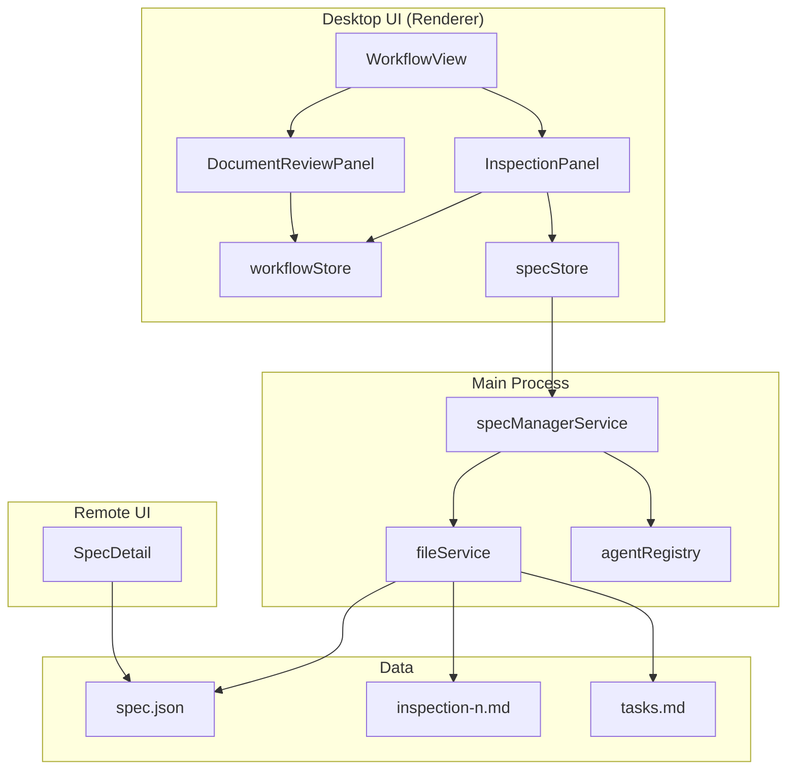
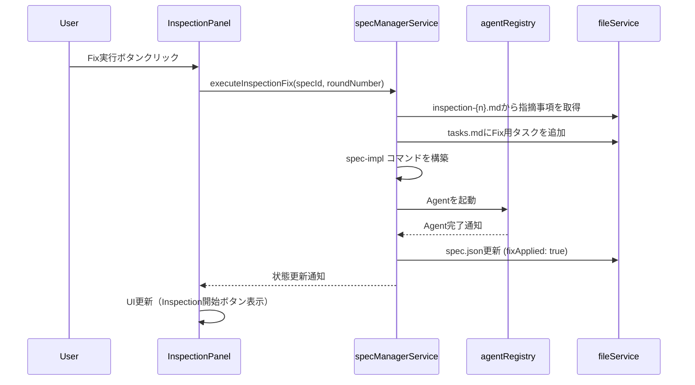
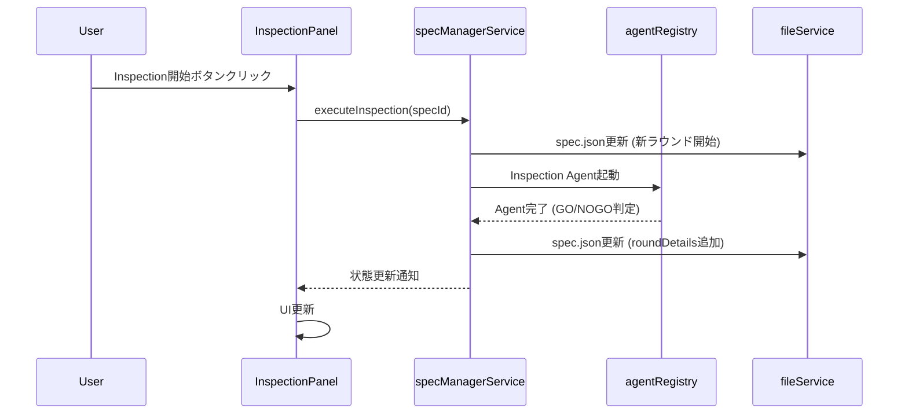

# Design Document: Inspection Workflow UI

## Overview

**Purpose**: この機能は、InspectionワークフローのUI改善を実現し、開発者がGUI上でInspection結果の確認・再実行・Fix適用を効率的に行えるようにする。DocumentReviewPanelと同様のインターフェースパターンを踏襲し、一貫したユーザー体験を提供する。

**Users**: SDD Orchestratorを使用する開発者が、Inspection フェーズの操作・監視・制御を行う際に本機能を利用する。

**Impact**: 現在の単純な `inspection.passed` フラグ管理から、マルチラウンド対応の構造化されたInspection状態管理へ移行する。後方互換性のないspec.json構造変更を含む。

### Goals

- InspectionPanelコンポーネントによるGUI操作の実現
- spec.jsonのinspectionフィールドをマルチラウンド対応の構造に変更
- DocumentReviewPanelと一貫したUIパターンの適用
- Fix実行からの再Inspectionフローの実装
- Remote UIでの新spec.json構造の適切な解釈

### Non-Goals

- Remote UIでのInspection操作（Desktop UI専用）
- Deployフェーズの実装（本機能スコープ外）
- 既存spec.jsonの自動マイグレーション（後方互換なし）
- Inspection結果の詳細表示UI（inspection-{n}.mdのプレビューはArtifactEditorで対応済み）

### Legacy spec.json Handling (Migration Policy)

**方針**: 既存spec.jsonの自動マイグレーションは行わない。

**レガシー構造の判定**:
- `inspection.roundDetails`が存在しない、かつ`inspection.passed`が存在する場合はレガシー構造と判定

**レガシー構造検出時の動作**:
- **Desktop UI**: レガシー`inspection.passed`からInspection状態を推定し、InspectionPanelは「未実行」状態として表示。新規Inspection実行時に新構造へ移行
- **Remote UI**: `getPhaseStatusFromSpec`でレガシー構造をフォールバック処理（下記擬似コード参照）
- **既存ロジックとの共存**: `workflow.ts`の`getPhaseStatus`は既存の`inspection.passed`参照を維持しつつ、新構造が存在する場合は`roundDetails`を優先

```typescript
// レガシー構造検出と互換性処理の擬似コード
function getInspectionStatus(inspection: any): 'pending' | 'approved' {
  if (inspection?.roundDetails?.length > 0) {
    // 新構造: 最新ラウンドのpassed値を使用
    const latestRound = inspection.roundDetails[inspection.roundDetails.length - 1];
    return latestRound.passed ? 'approved' : 'pending';
  } else if (typeof inspection?.passed === 'boolean') {
    // レガシー構造: inspection.passedを直接参照
    return inspection.passed ? 'approved' : 'pending';
  }
  return 'pending';
}
```

## Architecture

### Existing Architecture Analysis

現在のInspection実装は以下の構造:

- **spec.json**: `inspection?: { passed: boolean; inspected_at: string; report_file: string }`
- **WorkflowView**: `getPhaseStatus`で`inspection.passed`を参照しステータス判定
- **specManagerService**: Inspection実行時にspec.jsonを更新
- **Remote UI (SpecDetail)**: `getPhaseStatusFromSpec`で`inspection.passed`を参照

既存のDocumentReviewPanelは以下のパターンを採用:
- 進捗インジケータ（checked/unchecked/executing/skip-scheduled）
- 自動実行フラグ制御（run/pause/skip）
- ラウンド数表示
- アクションボタンの条件付き表示

### Architecture Pattern & Boundary Map



**Architecture Integration**:
- 選択パターン: DocumentReviewPanelと同一のUIパターン（進捗インジケータ、自動実行フラグ、アクションボタン）
- ドメイン境界: InspectionPanelはRendererプロセス内のUIコンポーネントとして実装、状態管理はspecStore経由
- 既存パターンの維持: workflowStore.autoExecutionPermissions、spec.json.autoExecution構造を踏襲
- 新規コンポーネント理由: InspectionPanelはDocumentReviewPanelと類似するがドメインが異なるため分離
- Steering準拠: DRY原則（共通UIパターンの抽出）、関心の分離（Panel単位）

### Technology Stack

| Layer | Choice / Version | Role in Feature | Notes |
|-------|------------------|-----------------|-------|
| Frontend | React 19, TypeScript 5.8+ | InspectionPanel実装 | 既存スタックを踏襲 |
| State | Zustand | specStore拡張、workflowStore連携 | spec.json.inspectionの新構造を反映 |
| Icons | Lucide React | 進捗インジケータ、アクションボタン | 既存アイコンセットを使用 |
| Styling | Tailwind CSS 4 | コンポーネントスタイリング | DocumentReviewPanelと統一 |

## System Flows

### Fix実行フロー



#### Fix用タスクの追加形式

Fix実行時にtasks.mdへ追加するタスクは、既存のspec-implタスク形式と統合して以下の形式を使用する：

```markdown
- [ ] [INSPECTION-FIX-{roundNumber}] {指摘事項のサマリー}
  - 出典: inspection-{roundNumber}.md
  - {具体的な修正内容}
  - _Requirements: 関連する要件ID_
```

**例**:
```markdown
- [ ] [INSPECTION-FIX-1] エラーハンドリングの追加
  - 出典: inspection-1.md
  - specManagerService.startInspection()でファイル読み込み失敗時のエラーハンドリングを追加する
  - _Requirements: 2.5_
```

**実装詳細**:
- `/kiro:spec-inspection --fix`コマンドを呼び出し、コマンド側でinspection-{n}.mdを解析してtasks.mdにタスクを追加する
- DocumentReviewFixフロー（`/kiro:document-review-reply --fix`）と同様のアプローチを採用する

### Inspection再実行フロー



## Requirements Traceability

| Requirement | Summary | Components | Interfaces | Flows |
|-------------|---------|------------|------------|-------|
| 1.1-1.10 | InspectionPanelコンポーネント | InspectionPanel | InspectionPanelProps | - |
| 2.1-2.8 | spec.json Inspection構造 | specStore, specManagerService | InspectionState, RoundDetail | - |
| 3.1-3.5 | WorkflowView統合 | WorkflowView | - | - |
| 4.1-4.5 | Fix実行フロー | InspectionPanel, specManagerService | - | Fix実行フロー |
| 5.1-5.5 | 自動実行フラグ制御 | InspectionPanel, workflowStore | AutoExecutionFlag | - |
| 6.1-6.4 | Remote UI互換性 | SpecDetail (remote-ui) | - | - |
| 7.1-7.4 | 進捗インジケータ表示 | InspectionPanel | ProgressIndicatorState | - |

## Components and Interfaces

| Component | Domain/Layer | Intent | Req Coverage | Key Dependencies | Contracts |
|-----------|--------------|--------|--------------|------------------|-----------|
| InspectionPanel | UI/Renderer | Inspection操作・状態表示 | 1.1-1.10, 5.1-5.5, 7.1-7.4 | workflowStore (P0), specStore (P0) | Props, State |
| InspectionState | Types | Inspection状態の型定義 | 2.1-2.8 | - | Type |
| specManagerService拡張 | Service/Main | Inspection状態管理 | 2.5-2.8, 4.2-4.3 | fileService (P0), agentRegistry (P1) | Service |
| WorkflowView拡張 | UI/Renderer | InspectionPanel統合 | 3.1-3.5 | InspectionPanel (P0) | - |
| SpecDetail拡張 | UI/Remote | 新構造解釈 | 6.1-6.4 | - | - |

### UI Layer

#### InspectionPanel

| Field | Detail |
|-------|--------|
| Intent | Inspection操作UI（進捗表示、アクション実行、自動実行制御） |
| Requirements | 1.1, 1.2, 1.3, 1.4, 1.5, 1.6, 1.7, 1.8, 1.9, 1.10, 5.1, 5.2, 5.3, 5.4, 5.5, 7.1, 7.2, 7.3, 7.4 |

**Responsibilities & Constraints**
- 進捗インジケータの状態計算と表示
- アクションボタン（Inspection開始/Fix実行）の条件付き表示
- 自動実行フラグのトグル制御
- Agent実行中の全アクションボタン無効化

**Dependencies**
- Inbound: WorkflowView - パネル配置 (P0)
- Outbound: workflowStore - 自動実行フラグ更新 (P0)
- Outbound: specStore - specDetail参照 (P0)
- Outbound: window.electronAPI - IPC呼び出し (P0)

**Contracts**: State [x]

##### State Management

```typescript
interface InspectionPanelProps {
  /** Inspection状態（spec.jsonから取得） */
  inspectionState: InspectionState | null;
  /** Agent実行中フラグ */
  isExecuting: boolean;
  /** 自動実行中フラグ */
  isAutoExecuting?: boolean;
  /** 自動実行フラグ（run/pause/skip） */
  autoExecutionFlag?: InspectionAutoExecutionFlag;
  /** Inspection開始ハンドラ */
  onStartInspection: () => void;
  /** Fix実行ハンドラ */
  onExecuteFix?: (roundNumber: number) => void;
  /** 自動実行フラグ変更ハンドラ */
  onAutoExecutionFlagChange?: (flag: InspectionAutoExecutionFlag) => void;
}

/** 自動実行フラグ型（DocumentReviewと同一） */
type InspectionAutoExecutionFlag = 'run' | 'pause' | 'skip';

/** 進捗インジケータ状態 */
type InspectionProgressIndicatorState =
  | 'checked'        // 1ラウンド以上完了
  | 'unchecked'      // 未実行
  | 'executing'      // 実行中
  | 'skip-scheduled'; // スキップ予定
```

**Implementation Notes**
- Integration: DocumentReviewPanelのUI構造・スタイルを踏襲
- Validation: inspectionState.roundDetailsの最新エントリからGO/NOGO判定
- Risks: レガシーspec.json（roundDetailsなし）との互換性処理が必要

### Types Layer

#### InspectionState

| Field | Detail |
|-------|--------|
| Intent | マルチラウンド対応Inspection状態の型定義 |
| Requirements | 2.1, 2.2, 2.3, 2.4 |

**Contracts**: Type [x]

```typescript
/** Inspection状態（spec.jsonに永続化） */
interface InspectionState {
  /** ステータス: pending/in_progress/completed */
  status: 'pending' | 'in_progress' | 'completed';
  /** 完了ラウンド数 */
  rounds: number;
  /** 実行中のラウンド番号（未実行時はnull） */
  currentRound: number | null;
  /** ラウンド詳細配列 */
  roundDetails: InspectionRoundDetail[];
}

/** ラウンド詳細 */
interface InspectionRoundDetail {
  /** ラウンド番号（1始まり） */
  roundNumber: number;
  /** GO判定結果（true=GO, false=NOGO） */
  passed: boolean;
  /** Fix適用済みフラグ（NOGO時のみ） */
  fixApplied?: boolean;
  /** Inspection完了タイムスタンプ */
  completedAt?: string;
}
```

**Implementation Notes**
- Validation: status値の列挙型バリデーション
- Risks: 既存のInspectionState（passed, inspected_at, report_file）との互換性なし

### Service Layer

#### specManagerService拡張

| Field | Detail |
|-------|--------|
| Intent | Inspection状態のspec.json永続化 |
| Requirements | 2.5, 2.6, 2.7, 2.8, 4.2, 4.3 |

**Responsibilities & Constraints**
- Inspection実行時のroundDetails更新
- GO/NOGO判定結果のspec.json反映
- Fix実行完了時のfixApplied更新

**Dependencies**
- Inbound: IPC handlers - Inspection/Fix実行要求 (P0)
- Outbound: fileService - spec.json読み書き (P0)
- Outbound: agentRegistry - Agent起動 (P1)

**Contracts**: Service [x]

##### Service Interface

```typescript
interface SpecManagerServiceInspectionExtension {
  /**
   * Inspectionを開始（新ラウンド）
   * @param specPath spec.jsonのパス
   * @returns 開始したラウンド番号
   */
  startInspection(specPath: string): Promise<number>;

  /**
   * Inspection結果を記録
   * @param specPath spec.jsonのパス
   * @param roundNumber 対象ラウンド番号
   * @param passed GO判定結果
   */
  recordInspectionResult(specPath: string, roundNumber: number, passed: boolean): Promise<void>;

  /**
   * Fix適用完了を記録
   * @param specPath spec.jsonのパス
   * @param roundNumber 対象ラウンド番号
   */
  recordFixApplied(specPath: string, roundNumber: number): Promise<void>;
}
```

- Preconditions: specPathが有効なspec.jsonを指す
- Postconditions: spec.jsonのinspectionフィールドが更新される
- Invariants: roundDetailsは常にroundNumber昇順

### UI Integration

#### WorkflowView拡張

| Field | Detail |
|-------|--------|
| Intent | InspectionPanelのワークフローへの統合 |
| Requirements | 3.1, 3.2, 3.3, 3.4, 3.5 |

**Implementation Notes**
- Integration: implフェーズとdeployフェーズの間にInspectionPanelを配置
- Validation: tasksフェーズ承認済みの場合のみ表示
- Risks: inspection.roundDetailsが存在しない場合のフォールバック処理

```typescript
// WorkflowViewでの配置（擬似コード）
{phase === 'impl' && (
  <>
    {/* TaskProgressView */}
    <TaskProgressView ... />

    {/* InspectionPanel - implの後、deployの前 */}
    {phaseStatuses.tasks === 'approved' && (
      <InspectionPanel
        inspectionState={inspectionState}
        isExecuting={isInspectionExecuting}
        isAutoExecuting={isAutoExecuting}
        autoExecutionFlag={specDetail.autoExecution?.permissions?.inspection ? 'run' : 'pause'}
        onStartInspection={handleStartInspection}
        onExecuteFix={handleExecuteFix}
        onAutoExecutionFlagChange={handleInspectionAutoExecutionFlagChange}
      />
    )}
  </>
)}
```

### Remote UI Compatibility

#### SpecDetail拡張（remote-ui）

| Field | Detail |
|-------|--------|
| Intent | 新spec.json構造の適切な解釈 |
| Requirements | 6.1, 6.2, 6.3, 6.4 |

**Implementation Notes**
- Integration: getPhaseStatusFromSpecを拡張してroundDetails対応
- Validation: roundDetails存在チェックとフォールバック
- Risks: Remote UIはVanilla JS実装のため型安全性が限定的

```javascript
// SpecDetail.getPhaseStatusFromSpec の拡張（擬似コード）
getPhaseStatusFromSpec(spec) {
  // ... existing code ...

  // Inspection phase: 新構造対応
  if (spec.inspection) {
    if (spec.inspection.roundDetails && spec.inspection.roundDetails.length > 0) {
      // 新構造: 最新ラウンドのpassed値を使用
      const latestRound = spec.inspection.roundDetails[spec.inspection.roundDetails.length - 1];
      result.inspection = latestRound.passed ? 'approved' : 'pending';
    } else if (typeof spec.inspection.passed === 'boolean') {
      // レガシー構造: inspection.passedを直接参照
      result.inspection = spec.inspection.passed ? 'approved' : 'pending';
    }
  }

  // ... rest of code ...
}
```

## Data Models

### Domain Model

**Aggregates**:
- **Spec**: spec.jsonで管理される仕様の集約ルート
  - inspectionフィールドがInspection状態を保持

**Entities**:
- **InspectionRound**: 各Inspectionラウンドの実行結果

**Value Objects**:
- **InspectionStatus**: pending/in_progress/completed
- **InspectionAutoExecutionFlag**: run/pause/skip

**Domain Events**:
- InspectionStarted: 新ラウンド開始
- InspectionCompleted: GO/NOGO判定完了
- FixApplied: Fix実行完了

**Invariants**:
- roundDetailsは常にroundNumber昇順
- rounds === roundDetails.length
- currentRoundはnullまたは有効なラウンド番号

### Logical Data Model

**spec.json.inspection 新構造**:

```json
{
  "inspection": {
    "status": "completed",
    "rounds": 2,
    "currentRound": null,
    "roundDetails": [
      {
        "roundNumber": 1,
        "passed": false,
        "fixApplied": true,
        "completedAt": "2025-12-27T12:00:00Z"
      },
      {
        "roundNumber": 2,
        "passed": true,
        "completedAt": "2025-12-27T13:00:00Z"
      }
    ]
  }
}
```

**レガシー構造（参考）**:

```json
{
  "inspection": {
    "passed": true,
    "inspected_at": "2025-12-27T12:00:00Z",
    "report_file": "inspection-1.md"
  }
}
```

### Data Contracts & Integration

**autoExecution.permissions拡張**:

```typescript
interface AutoExecutionPermissions {
  requirements: boolean;
  design: boolean;
  tasks: boolean;
  impl: boolean;
  inspection: boolean; // 既存フィールド
  deploy: boolean;
}
```

既存の`autoExecution.permissions.inspection`フィールドをInspectionPanel自動実行制御に使用。

## Error Handling

### Error Strategy

| エラーケース | 処理方針 | ユーザーフィードバック |
|-------------|---------|---------------------|
| Agent実行中の重複実行 | 操作拒否 | ボタン無効化で事前防止 |
| inspection-{n}.md不存在 | Fix実行不可 | エラートースト表示 |
| spec.json書き込み失敗 | リトライ後エラー | エラートースト＋ログ |
| レガシーspec.json | フォールバック | 旧構造を解釈し動作継続 |

### Error Categories and Responses

**User Errors (4xx)**:
- 不正な操作順序 → UI状態で事前防止

**System Errors (5xx)**:
- ファイルI/Oエラー → リトライ＋エラー通知
- Agent起動失敗 → エラー通知＋ログ

**Business Logic Errors (422)**:
- 前提条件未満（tasks未承認）→ InspectionPanel非表示

### Monitoring

- Agent実行ログ: 既存のagentRegistry経由
- エラーログ: projectLogger経由でプロジェクトログに記録

## Testing Strategy

### Unit Tests

- InspectionPanel: 進捗インジケータ状態計算ロジック
- InspectionPanel: アクションボタン表示条件ロジック
- getPhaseStatus: 新InspectionState構造の判定ロジック
- specManagerService: roundDetails更新ロジック
- Remote UI SpecDetail: 新構造解釈ロジック

### Integration Tests

- WorkflowView + InspectionPanel: 統合表示テスト
- specManagerService: Inspection開始→結果記録→Fix記録フロー
- AutoExecutionService: Inspectionフェーズ自動実行

### E2E Tests

- Inspection開始ボタンクリック→Agent起動→結果反映
- Fix実行ボタンクリック→tasks.md更新→impl実行
- 自動実行フラグトグル→spec.json更新
