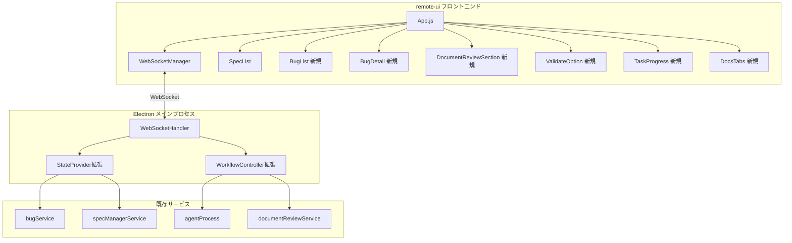
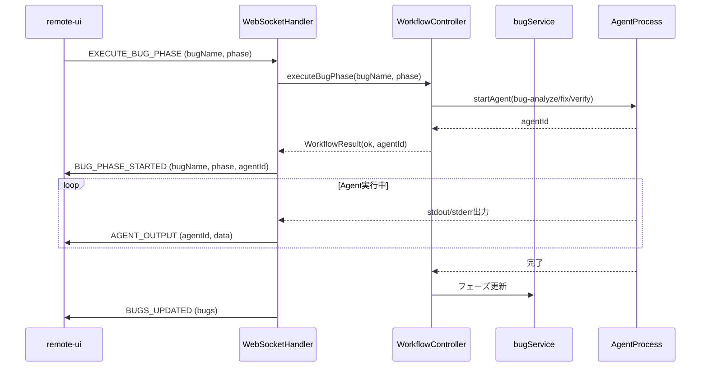
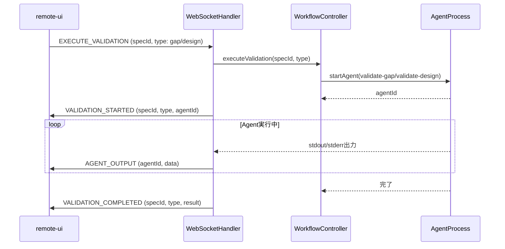
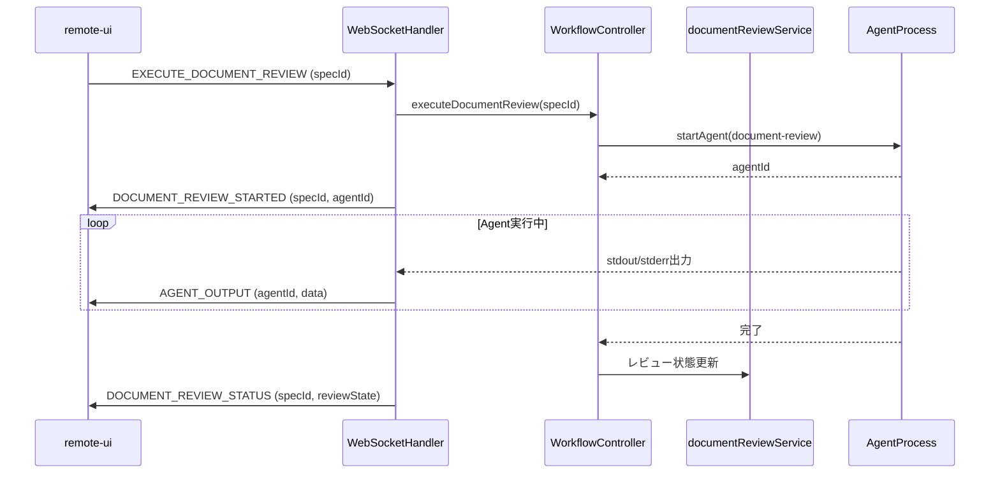

# Design Document

## Overview

**Purpose**: 本機能は、SDD Orchestratorの内部Webサーバー（remote-ui）がElectron版UIと同等の機能を提供できるようにすることで、モバイルリモートアクセスユーザーに完全なSDD/バグワークフロー体験を提供する。

**Users**: リモートからSDD Orchestratorにアクセスするモバイルユーザー、および外出先から開発進捗を監視・操作するチームメンバーがこの機能を利用する。

**Impact**: 現在のremote-uiはSpec管理のみをサポートしているが、本機能によりバグ管理、ドキュメントレビュー、バリデーション、詳細なタスク進捗表示が追加され、Electron版との機能パリティが実現される。

### Goals
- remote-uiでバグ管理ワークフロー（一覧表示、Analyze/Fix/Verify実行）を完全サポート
- ドキュメントレビュー機能の同期（レビュー状態表示、開始操作）
- バリデーション機能（validate-gap/design）のリモート実行
- タスク進捗の詳細表示（チェックリスト形式、プログレスバー）
- WebSocket APIの拡張による双方向リアルタイム通信
- Electron版とremote-ui間のデータ整合性維持

### Non-Goals
- remote-ui専用の独自機能追加（Electron版に存在しない機能）
- オフライン対応（常時接続が前提）
- マルチユーザー認証・権限管理（既存のプライベートIP制限で対応）
- remote-uiのReact/TypeScript移行（既存のVanilla JS構成を維持）

## Architecture

### Existing Architecture Analysis

本機能は既存のremote-uiアーキテクチャを拡張する。現状のパターンと制約は以下の通り：

- **remote-ui技術スタック**: Vanilla JavaScript + Tailwind CSS（CDN）、SPA構成
- **WebSocket通信**: WebSocketHandler（サーバー側）→ WebSocketManager（クライアント側）
- **状態管理**: サーバー側StateProvider/WorkflowControllerインターフェース経由でElectron側の状態にアクセス
- **既存メッセージタイプ**: INIT, SPECS_UPDATED, EXECUTE_PHASE, AGENT_OUTPUT等（Spec管理用）

### Architecture Pattern & Boundary Map



**Architecture Integration**:
- Selected pattern: 既存のPub/Subパターン（WebSocket）を拡張、新規メッセージタイプ追加
- Domain/feature boundaries: バグ管理はBugList/BugDetailコンポーネントに分離、バリデーション/レビューはSpec詳細画面内で表示
- Existing patterns preserved: WebSocketHandler/StateProvider/WorkflowControllerの既存インターフェースを拡張
- New components rationale: Electron版UIコンポーネントをVanilla JSで再実装（モバイル最適化）
- Steering compliance: 単一責任原則、DRY（共通ユーティリティ再利用）

### Technology Stack

| Layer | Choice / Version | Role in Feature | Notes |
|-------|------------------|-----------------|-------|
| Frontend | Vanilla JavaScript ES6+ | remote-ui SPA | 既存構成維持、React不要 |
| Frontend CSS | Tailwind CSS 4 (CDN) | スタイリング | 既存構成維持 |
| Backend | Node.js 20+ / ws | WebSocket通信 | 既存wsライブラリ継続使用 |
| Data | インメモリ状態 | StateProvider経由でアクセス | 永続化は既存サービスに委譲 |

## System Flows

### バグフェーズ実行フロー



### バリデーション実行フロー



### ドキュメントレビュー実行フロー



## Requirements Traceability

| Requirement | Summary | Components | Interfaces | Flows |
|-------------|---------|------------|------------|-------|
| 1.1-1.8 | バグ管理機能の同期 | BugList, BugDetail, WebSocketHandler | GET_BUGS, EXECUTE_BUG_PHASE, BUGS_UPDATED | バグフェーズ実行フロー |
| 2.1-2.6 | ドキュメントレビュー機能 | DocumentReviewSection, WebSocketHandler | EXECUTE_DOCUMENT_REVIEW, DOCUMENT_REVIEW_STATUS | ドキュメントレビュー実行フロー |
| 3.1-3.7 | バリデーション機能 | ValidateOption, WebSocketHandler | EXECUTE_VALIDATION, VALIDATION_STARTED/COMPLETED | バリデーション実行フロー |
| 4.1-4.5 | タスク進捗表示 | TaskProgress, WebSocketHandler | TASK_PROGRESS_UPDATED | - |
| 5.1-5.5 | Spec詳細情報拡充 | SpecList, SpecDetail, StateProvider | INIT, SPEC_CHANGED | - |
| 6.1-6.7 | WebSocket API拡張 | WebSocketHandler, WorkflowController | 全新規メッセージタイプ | 全フロー |
| 7.1-7.7 | UIコンポーネント追加 | BugList, BugDetail, DocsTabs等 | - | - |
| 8.1-8.5 | データ同期の整合性 | StateProvider, WebSocketHandler | SPEC_CHANGED, BUGS_UPDATED等ブロードキャスト | - |

## Components and Interfaces

| Component | Domain/Layer | Intent | Req Coverage | Key Dependencies | Contracts |
|-----------|--------------|--------|--------------|------------------|-----------|
| WebSocketHandler | Backend/Communication | WebSocketメッセージルーティング拡張 | 6.1-6.7, 8.1-8.5 | StateProvider (P0), WorkflowController (P0) | Service, Event |
| StateProvider | Backend/State | 状態取得インターフェース拡張 | 5.1-5.5, 1.1 | bugService (P0), specManagerService (P0) | Service |
| WorkflowController | Backend/Workflow | ワークフロー操作インターフェース拡張 | 6.2-6.4, 1.4-1.6 | agentProcess (P0), documentReviewService (P1) | Service |
| BugList (remote-ui) | Frontend/UI | バグ一覧表示 | 7.1, 1.2 | WSManager (P0) | State |
| BugDetail (remote-ui) | Frontend/UI | バグ詳細・アクションボタン | 7.2, 1.3-1.6 | WSManager (P0) | State |
| DocumentReviewSection (remote-ui) | Frontend/UI | レビュー状態・開始ボタン | 7.3, 2.1-2.5 | WSManager (P0) | State |
| ValidateOption (remote-ui) | Frontend/UI | バリデーション実行ボタン | 7.4, 3.1-3.6 | WSManager (P0) | State |
| TaskProgress (remote-ui) | Frontend/UI | タスク進捗表示 | 7.5, 4.1-4.4 | WSManager (P0) | State |
| DocsTabs (remote-ui) | Frontend/UI | Specs/Bugsタブ切替 | 7.7 | - | State |

### Backend / Communication Layer

#### WebSocketHandler（拡張）

| Field | Detail |
|-------|--------|
| Intent | 新規メッセージタイプの追加とルーティング拡張 |
| Requirements | 6.1-6.7, 8.1-8.5 |

**Responsibilities & Constraints**
- 既存メッセージハンドラに加え、バグ/バリデーション/レビュー関連のハンドラを追加
- 全クライアントへのブロードキャスト機能を既存パターンで維持
- StateProvider/WorkflowControllerインターフェースを通じてのみ状態アクセス

**Dependencies**
- Inbound: remote-ui WebSocketManager — メッセージ受信 (P0)
- Outbound: StateProvider — 状態取得 (P0)
- Outbound: WorkflowController — ワークフロー操作 (P0)

**Contracts**: Service [x] / Event [x]

##### Service Interface（拡張メソッド）

```typescript
// 既存routeMessageに追加するケース
private async routeMessage(client: ClientInfo, message: WebSocketMessage): Promise<void> {
  switch (message.type) {
    // 既存ケース...
    case 'GET_BUGS':
      await this.handleGetBugs(client, message);
      break;
    case 'EXECUTE_BUG_PHASE':
      await this.handleExecuteBugPhase(client, message);
      break;
    case 'EXECUTE_VALIDATION':
      await this.handleExecuteValidation(client, message);
      break;
    case 'EXECUTE_DOCUMENT_REVIEW':
      await this.handleExecuteDocumentReview(client, message);
      break;
  }
}
```

##### Event Contract

**Published events**:
- `INIT`: 接続時の初期状態配信（拡張: `bugs: BugInfo[]`をpayloadに追加）
  - payload: `{ project: string, specs: SpecInfo[], bugs: BugInfo[], logs: LogEntry[] }`
- `BUGS_UPDATED`: バグ一覧更新時にブロードキャスト
- `BUG_PHASE_STARTED`: バグフェーズ実行開始時
- `VALIDATION_STARTED`: バリデーション開始時
- `VALIDATION_COMPLETED`: バリデーション完了時
- `DOCUMENT_REVIEW_STARTED`: ドキュメントレビュー開始時
- `DOCUMENT_REVIEW_STATUS`: ドキュメントレビュー状態更新時
- `TASK_PROGRESS_UPDATED`: タスク進捗更新時（SpecInfo更新時にtaskProgress差分がある場合にブロードキャスト。トリガー: tasks.mdファイルの変更検知またはチェックボックス状態更新）

**Subscribed events**:
- `GET_BUGS`: バグ一覧要求
- `EXECUTE_BUG_PHASE`: バグフェーズ実行要求
- `EXECUTE_VALIDATION`: バリデーション実行要求
- `EXECUTE_DOCUMENT_REVIEW`: ドキュメントレビュー実行要求

**Ordering / delivery guarantees**: メッセージは受信順に処理、ブロードキャストは全接続クライアントに同時送信

**Implementation Notes**
- Integration: 既存handleMessage/routeMessageパターンを踏襲、新規ケースを追加
- Validation: メッセージpayloadのバリデーションは既存パターンを踏襲
- Risks: 同時実行時の状態競合は WorkflowController側で管理

### Backend / State Layer

#### StateProvider（拡張）

| Field | Detail |
|-------|--------|
| Intent | バグ一覧・Spec詳細情報の取得インターフェース拡張 |
| Requirements | 5.1-5.5, 1.1 |

**Responsibilities & Constraints**
- getSpecs()の戻り値にapprovalsとdocumentReview情報を含める
- getBugs()メソッドを追加してバグ一覧を返す
- 既存のgetProjectPath()は変更なし

**Dependencies**
- Outbound: bugService — バグ一覧取得 (P0)
- Outbound: specManagerService — Spec詳細取得 (P0)

**Contracts**: Service [x]

##### Service Interface（拡張）

```typescript
export interface StateProvider {
  getProjectPath(): string;
  getSpecs(): Promise<SpecInfo[]>;
  getBugs(): Promise<BugInfo[]>;  // 新規追加
}

export interface SpecInfo {
  readonly id: string;
  readonly name: string;
  readonly phase: string;
  readonly approvals: ApprovalStatus;  // 追加
  readonly documentReview?: DocumentReviewState;  // 追加
  readonly taskProgress?: TaskProgress;  // 追加
}

export interface BugInfo {
  readonly name: string;
  readonly phase: BugPhase;
  readonly description?: string;
  readonly updatedAt: string;
}

type BugPhase = 'reported' | 'analyzed' | 'fixed' | 'verified';
```

**Implementation Notes**
- Integration: 既存のStateProvider実装クラスを拡張
- Validation: nullチェック、存在しないファイルへのアクセス時はデフォルト値を返す

#### WorkflowController（拡張）

| Field | Detail |
|-------|--------|
| Intent | バグ操作・バリデーション・ドキュメントレビューの実行インターフェース |
| Requirements | 6.2-6.4 |

**Responsibilities & Constraints**
- executeBugPhase()でバグワークフロー（analyze/fix/verify）を実行
- executeValidation()でvalidate-gap/validate-designを実行
- executeDocumentReview()でドキュメントレビューを実行
- 各操作はagentProcess経由でClaude Codeエージェントを起動

**Dependencies**
- Outbound: agentProcess — エージェント起動 (P0)
- Outbound: documentReviewService — レビュー状態管理 (P1)

**Contracts**: Service [x]

##### Service Interface（拡張）

```typescript
export interface WorkflowController {
  // 既存メソッド
  executePhase(specId: string, phase: string): Promise<WorkflowResult<AgentInfo>>;
  stopAgent(agentId: string): Promise<WorkflowResult<void>>;
  resumeAgent(agentId: string): Promise<WorkflowResult<AgentInfo>>;
  autoExecute?(specId: string): Promise<WorkflowResult<AgentInfo>>;
  sendAgentInput?(agentId: string, text: string): Promise<WorkflowResult<void>>;

  // 新規追加
  executeBugPhase(bugName: string, phase: BugAction): Promise<WorkflowResult<AgentInfo>>;
  executeValidation(specId: string, type: ValidationType): Promise<WorkflowResult<AgentInfo>>;
  executeDocumentReview(specId: string): Promise<WorkflowResult<AgentInfo>>;
}

type BugAction = 'analyze' | 'fix' | 'verify';
type ValidationType = 'gap' | 'design';
```

**Implementation Notes**
- Integration: 既存のWorkflowController実装を拡張、Electron側のハンドラと同じロジックを共有
- Risks: 実行中エージェントがある場合の多重起動防止は既存ロジックを活用

### Frontend / UI Layer

#### DocsTabs

| Field | Detail |
|-------|--------|
| Intent | Specs/Bugsの切り替えタブUI |
| Requirements | 7.7 |

**Responsibilities & Constraints**
- タブ切り替えによりSpecListまたはBugListを表示
- 選択状態の視覚的フィードバック

**Dependencies**
- Inbound: App — タブ状態管理 (P0)

**Contracts**: State [x]

##### State Management

```javascript
class DocsTabs {
  constructor() {
    this.activeTab = 'specs'; // 'specs' | 'bugs'
    this.onTabChange = null;  // callback
  }

  setActiveTab(tab) {
    this.activeTab = tab;
    this.render();
    if (this.onTabChange) this.onTabChange(tab);
  }

  render() {
    // タブUI描画、aria-selected属性の管理
  }
}
```

**Implementation Notes**
- Integration: 既存のspec-list-sectionに隣接してバグ用セクションを追加
- Electron版DocsTabsのスタイルを踏襲（Tailwind CSSクラス）

#### BugList

| Field | Detail |
|-------|--------|
| Intent | バグ一覧表示とフェーズフィルター |
| Requirements | 7.1, 1.2 |

**Responsibilities & Constraints**
- バグ一覧をフェーズ別フィルター付きで表示
- 選択されたバグをBugDetailに通知

**Dependencies**
- Inbound: App — バグデータ配列 (P0)
- Outbound: BugDetail — 選択通知 (P1)

**Contracts**: State [x]

##### State Management

```javascript
class BugList {
  constructor() {
    this.bugs = [];
    this.selectedBugName = null;
    this.phaseFilter = 'all'; // 'all' | 'reported' | 'analyzed' | 'fixed' | 'verified'
    this.onSelect = null;     // callback
  }

  update(bugs) {
    this.bugs = bugs || [];
    this.render();
  }

  setFilter(phase) {
    this.phaseFilter = phase;
    this.render();
  }

  getFilteredBugs() {
    if (this.phaseFilter === 'all') return this.bugs;
    return this.bugs.filter(b => b.phase === this.phaseFilter);
  }

  render() {
    // フィルターUI + バグカード一覧を描画
  }
}
```

**Implementation Notes**
- Electron版BugListのUI/UXパターンを踏襲
- モバイル向けタッチターゲットサイズ（44px以上）を確保

#### BugDetail

| Field | Detail |
|-------|--------|
| Intent | バグ詳細表示とアクションボタン（Analyze/Fix/Verify） |
| Requirements | 7.2, 1.3-1.6 |

**Responsibilities & Constraints**
- 選択されたバグの詳細情報（名前、説明、フェーズ）を表示
- 現在のフェーズに応じて有効なアクションボタンを表示
- アクション実行時はWebSocket経由でEXECUTE_BUG_PHASEを送信

**Dependencies**
- Inbound: BugList — 選択されたバグ (P0)
- Outbound: WebSocketManager — フェーズ実行要求 (P0)

**Contracts**: State [x]

##### State Management

```javascript
class BugDetail {
  constructor() {
    this.currentBug = null;
    this.isExecuting = false;
    this.onExecutePhase = null;  // callback(bugName, phase)
  }

  show(bug) {
    this.currentBug = bug;
    this.render();
  }

  setExecuting(executing) {
    this.isExecuting = executing;
    this.render();
  }

  getAvailableActions() {
    // フェーズに応じた次アクションを返す
    const actionMap = {
      'reported': ['analyze'],
      'analyzed': ['fix'],
      'fixed': ['verify'],
      'verified': []
    };
    return actionMap[this.currentBug?.phase] || [];
  }

  render() {
    // バグ詳細 + アクションボタン描画
  }
}
```

**Implementation Notes**
- Electron版BugActionButtonsのロジックを移植
- ローディング状態の表示（スピナー）

#### DocumentReviewSection

| Field | Detail |
|-------|--------|
| Intent | ドキュメントレビュー状態表示と開始ボタン |
| Requirements | 7.3, 2.1-2.5 |

**Responsibilities & Constraints**
- tasksフェーズ完了後のSpec詳細画面に表示
  - **表示条件**: `approvals.tasks.approved === true`（tasksフェーズが承認済みであること）
- 現在のレビュー状態（ラウンド数、ステータス）を表示
- レビュー開始ボタンでEXECUTE_DOCUMENT_REVIEWを送信

**Dependencies**
- Inbound: SpecDetail — Spec詳細データ (P0)
- Outbound: WebSocketManager — レビュー実行要求 (P0)

**Contracts**: State [x]

##### State Management

```javascript
class DocumentReviewSection {
  constructor() {
    this.reviewState = null;  // { rounds, status, currentRound }
    this.isExecuting = false;
    this.onStartReview = null;  // callback(specId)
  }

  update(reviewState) {
    this.reviewState = reviewState;
    this.render();
  }

  setExecuting(executing) {
    this.isExecuting = executing;
    this.render();
  }

  canStartReview() {
    return !this.isExecuting && this.reviewState?.status !== 'in_progress';
  }

  render() {
    // ラウンド数、ステータス、開始ボタンを描画
  }
}
```

**Implementation Notes**
- Electron版DocumentReviewPanelの簡略版（モバイル向け）
- 実行中はスピナー表示、ボタン無効化

#### ValidateOption

| Field | Detail |
|-------|--------|
| Intent | validate-gap/validate-design実行ボタン |
| Requirements | 7.4, 3.1-3.6 |

**Responsibilities & Constraints**
- requirements完了後: validate-gapを表示
- design完了後: validate-designを表示
- 実行ボタンクリックでEXECUTE_VALIDATIONを送信

**Dependencies**
- Inbound: SpecDetail — Spec詳細データ (P0)
- Outbound: WebSocketManager — バリデーション実行要求 (P0)

**Contracts**: State [x]

##### State Management

```javascript
class ValidateOption {
  constructor(type) {
    this.type = type;  // 'gap' | 'design'
    this.isExecuting = false;
    this.onExecute = null;  // callback(specId, type)
  }

  setExecuting(executing) {
    this.isExecuting = executing;
    this.render();
  }

  render() {
    // type に応じたラベルと実行ボタンを描画
  }
}
```

**Implementation Notes**
- Electron版ValidateOptionを簡略化
- 小さなボタンUI（Spec詳細画面のフェーズ間に配置）

#### TaskProgress

| Field | Detail |
|-------|--------|
| Intent | implフェーズのタスク進捗表示 |
| Requirements | 7.5, 4.1-4.4 |

**Responsibilities & Constraints**
- タスク一覧をチェックリスト形式で表示
- 完了/未完了を視覚的に区別
- 全体進捗率をプログレスバーで表示

**Dependencies**
- Inbound: SpecDetail — タスク進捗データ (P0)

**Contracts**: State [x]

##### State Management

```javascript
class TaskProgress {
  constructor() {
    this.tasks = [];      // [{ id, title, status }]
    this.progress = null; // { total, completed, percentage }
  }

  update(tasks, progress) {
    this.tasks = tasks || [];
    this.progress = progress;
    this.render();
  }

  render() {
    // プログレスバー + タスクリストを描画
  }
}
```

**Implementation Notes**
- Electron版TaskProgressViewのUI/UXを踏襲
- モバイルでのスクロール最適化

## Data Models

### Domain Model

#### WebSocketMessage（拡張）

```typescript
interface WebSocketMessage {
  readonly type: string;
  readonly payload?: Record<string, unknown>;
  readonly requestId?: string;
  readonly timestamp: number;
}

// 新規メッセージタイプ（payload構造）
interface GetBugsPayload {} // payloadなし

interface BugsUpdatedPayload {
  bugs: BugInfo[];
}

interface ExecuteBugPhasePayload {
  bugName: string;
  phase: BugAction;  // 'analyze' | 'fix' | 'verify'
}

interface BugPhaseStartedPayload {
  bugName: string;
  phase: BugAction;
  agentId: string;
}

interface ExecuteValidationPayload {
  specId: string;
  type: ValidationType;  // 'gap' | 'design'
}

interface ValidationStartedPayload {
  specId: string;
  type: ValidationType;
  agentId: string;
}

interface ValidationCompletedPayload {
  specId: string;
  type: ValidationType;
  result: { success: boolean; error?: string };
}

interface ExecuteDocumentReviewPayload {
  specId: string;
}

interface DocumentReviewStartedPayload {
  specId: string;
  agentId: string;
}

interface DocumentReviewStatusPayload {
  specId: string;
  reviewState: DocumentReviewState;
}

interface TaskProgressUpdatedPayload {
  specId: string;
  tasks: TaskItem[];
  progress: TaskProgress;
}
```

### Logical Data Model

#### BugInfo

| Attribute | Type | Description |
|-----------|------|-------------|
| name | string | バグ識別子（ディレクトリ名） |
| phase | BugPhase | 現在のフェーズ |
| description | string (optional) | バグ説明 |
| updatedAt | string (ISO8601) | 最終更新日時 |

#### SpecInfo（拡張）

| Attribute | Type | Description |
|-----------|------|-------------|
| id | string | Spec識別子 |
| name | string | feature名 |
| phase | string | 現在のフェーズ |
| approvals | ApprovalStatus | 各フェーズの承認状態 |
| documentReview | DocumentReviewState (optional) | レビュー状態 |
| taskProgress | TaskProgress (optional) | タスク進捗 |

## Error Handling

### Error Strategy

WebSocketHandler内での統一的なエラーハンドリングパターンを維持。

### Error Categories and Responses

**User Errors (4xx相当)**:
- `INVALID_PAYLOAD`: 必須パラメータ欠落 → エラーメッセージ返却
- `BUG_NOT_FOUND`: 指定バグが存在しない → エラーメッセージ返却
- `SPEC_NOT_FOUND`: 指定Specが存在しない → エラーメッセージ返却

**System Errors (5xx相当)**:
- `NO_CONTROLLER`: WorkflowControllerが未設定 → サーバー設定エラー
- `AGENT_START_FAILED`: エージェント起動失敗 → リトライ促すメッセージ

**Business Logic Errors (422相当)**:
- `PHASE_NOT_AVAILABLE`: 現在のフェーズでは実行不可 → 状態確認を促す
- `AGENT_ALREADY_RUNNING`: 既にエージェント実行中 → 待機を促す

### Monitoring

既存のconsole.log/console.errorパターンを継続使用。
remote-ui側ではToast通知でユーザーにフィードバック。

## Testing Strategy

### Unit Tests
- WebSocketHandler新規ハンドラのテスト（handleGetBugs, handleExecuteBugPhase等）
- StateProvider.getBugs()のテスト
- WorkflowController.executeBugPhase/executeValidation/executeDocumentReviewのテスト

### Integration Tests
- WebSocketHandler ↔ StateProvider統合テスト
- WebSocketHandler ↔ WorkflowController統合テスト
- メッセージ往復テスト（GET_BUGS → BUGS_UPDATED）

### E2E/UI Tests
- DocsTabs: タブ切り替えでSpecs/Bugsパネル表示
- BugList: フィルター操作、バグ選択
- BugDetail: アクションボタンクリック → WebSocket送信確認
- ValidateOption: 実行ボタンクリック → WebSocket送信確認
- TaskProgress: プログレスバー表示確認

### Performance/Load
- 同時接続クライアント数テスト（既存上限10クライアント）
- 大量ログ配信時のブロードキャスト性能
