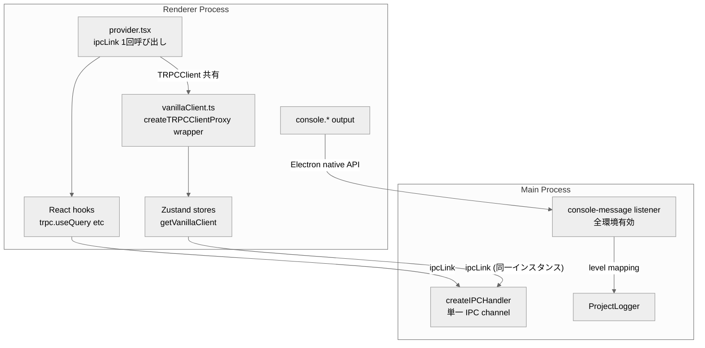
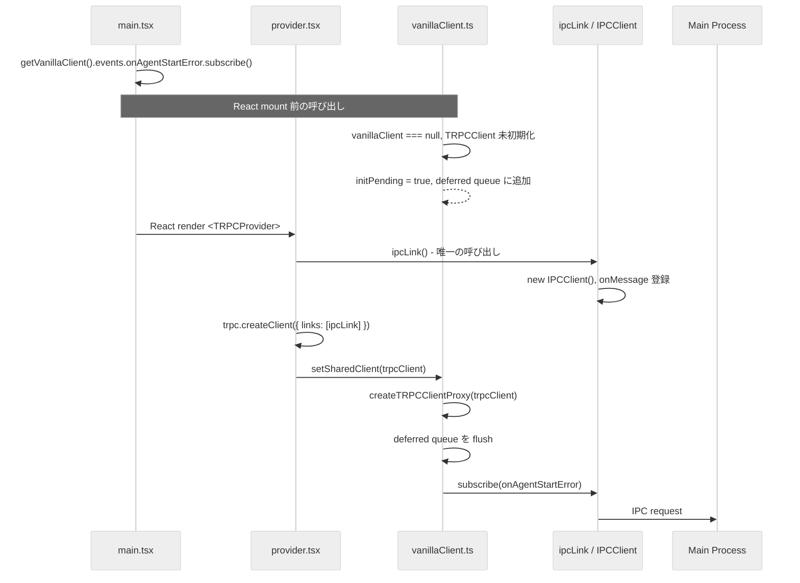
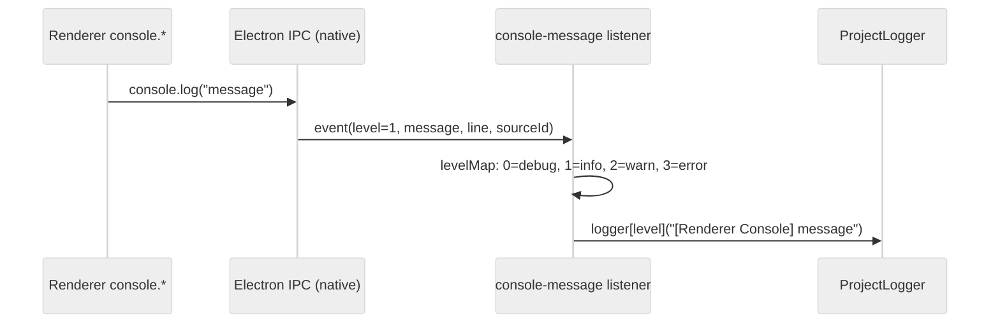

# Design: ipcLink シングルトン統一

## Overview

**Purpose**: `electron-trpc` v0.7.1 の `ipcLink()` が複数回呼ばれることで発生する `requestId` 衝突を解消し、tRPC IPC 通信の信頼性を回復する。併せて Renderer console ログ転送を native `console-message` API に統一する。

**Users**: SDD Orchestrator の全ユーザー。起動時の phantom subscription data とレイアウトリセットが解消される。

**Impact**: `provider.tsx` と `vanillaClient.ts` の2箇所で独立に `ipcLink()` を呼ぶ現在の設計を、単一の `TRPCUntypedClient` インスタンスを共有する方式に変更する。`consoleHook.ts` と `noiseFilter.ts` を廃止し、Main process 側の `console-message` native API に統一する。

### Goals

- `ipcLink()` 呼び出しを1回に限定し、requestId 衝突を根絶する
- `getVanillaClient()` の API シグネチャを維持しつつ内部実装を共有化する
- Renderer console ログ転送を SSOT/KISS 原則に基づき native API に統一する
- steering ドキュメントを実態に合わせて更新する

### Non-Goals

- `rendererLogger.ts` の廃止（notificationStore 依存あり、Out of Scope）
- `misc.logRenderer` tRPC endpoint の廃止
- `electron-trpc` ライブラリ自体の修正
- E2E テストの追加・修正
- Remote UI への影響対応（`ipcLink` 不使用）

## Architecture

### Existing Architecture Analysis

**現在の問題構造**:

- `provider.tsx` が `trpc.createClient({ links: [ipcLink()] })` を呼び出し、React hooks 用の `TRPCUntypedClient` を生成
- `vanillaClient.ts` が `createTRPCProxyClient({ links: [ipcLink()] })` を呼び出し、別の `TRPCUntypedClient` を生成
- 各 `TRPCUntypedClient` は独立した `requestId` カウンタ（`0` から開始）を持つ
- `ipcLink()` は呼び出しごとに新しい `IPCClient` インスタンスを生成し、`electronTRPC.onMessage()` にリスナーを登録
- Main process は単一の IPC チャネルで全レスポンスを送信するため、`requestId` 衝突時にレスポンスが誤った `IPCClient` に配信される

**Renderer console ログ転送の現状**:

- `consoleHook.ts`: Renderer 側の `console.*` を monkey-patch し `getVanillaClient()` 経由で Main に送信（dev/E2E のみ）
- `main/index.ts`: `webContents.on('console-message')` で Electron native キャプチャ（E2E のみ、`isE2ETest` ガード付き）
- 2つの転送経路が併存し、SSOT 違反

### Architecture Pattern & Boundary Map



**Key Decisions**:

- `ipcLink()` を `provider.tsx` の1箇所でのみ呼び出し、生成された `TRPCClient` を `vanillaClient.ts` と共有する
- `createTRPCClientProxy()` を使用して既存の `TRPCClient` から vanilla proxy を生成する（追加の `ipcLink()` 呼び出し不要）
- `console-message` native API を全環境で有効化し、`consoleHook.ts` を廃止する

### Technology Stack

| Layer | Choice / Version | Role in Feature | Notes |
|-------|------------------|-----------------|-------|
| IPC | electron-trpc 0.7.1 | `ipcLink()` IPC transport | Issue #201 のワークアラウンド |
| tRPC Client | @trpc/client 10.45.4 | `createTRPCClientProxy()` で client 共有 | `@deprecated` API だが v10 で唯一の手段 |
| tRPC React | @trpc/react-query 10.45.4 | `trpc.createClient()` で TRPCClient 生成 | |
| Runtime | Electron 35 | `webContents.on('console-message')` | native API |

## System Flows

### ipcLink シングルトン初期化フロー



**Key Decisions**:

- `main.tsx` の `getVanillaClient()` が React mount 前に呼ばれるため、deferred initialization パターンが必要
- `TRPCProvider` のマウント時に `setSharedClient()` を呼び出し、pending operations を flush する
- deferred queue は subscribe のみ対象（query/mutate は mount 後に呼ばれる想定）

### console-message 統一フロー



**Key Decisions**:

- 既存の `isE2ETest` ガードを解除し、全環境で `console-message` リスナーを有効化
- Electron native の `level` パラメータ（0=DEBUG, 1=INFO, 2=WARNING, 3=ERROR）を `logger` メソッドに直接マッピング
- 現在の一律 `logger.info()` を適切なレベル別呼び出しに変更

## Requirements Traceability

| Criterion ID | Summary | Components | Implementation Approach |
|--------------|---------|------------|------------------------|
| 1.1 | `ipcLink()` を1回のみ呼び出す | `provider.tsx`, `vanillaClient.ts` | provider.tsx に集約、vanillaClient.ts から `ipcLink()` 直接呼び出しを除去 |
| 1.2 | `getVanillaClient()` が React client と同じ TRPCClient から proxy を返す | `vanillaClient.ts` | `createTRPCClientProxy()` で共有 TRPCClient をラップ |
| 1.3 | `getVanillaClient()` の API シグネチャ維持 | `vanillaClient.ts` | `CreateTRPCProxyClient<AppRouter>` 型は同一 |
| 1.4 | `ipcLink()` 複数呼び出しの検出 | `vanillaClient.ts` | `ipcLink` import を除去、lint/grep で検証可能 |
| 2.1 | `onMenuOpenProject` が phantom data を受信しない | `provider.tsx`, `vanillaClient.ts` | requestId 衝突解消により自動的に解決 |
| 2.2 | `onMenuResetLayout` が意図しないリセットを起こさない | `provider.tsx`, `vanillaClient.ts` | 同上 |
| 2.3 | EventBus イベント発火まで `onData` が呼ばれない | `provider.tsx`, `vanillaClient.ts` | 同上 |
| 3.1 | 全環境で `console-message` リスナー登録 | `main/index.ts` | `isE2ETest` ガード解除 |
| 3.2 | Renderer console を Main logger に適切レベルで記録 | `main/index.ts` | level mapping 実装 |
| 3.3 | DEBUG (0) を `logger.debug()` で記録 | `main/index.ts` | levelMap + logger 呼び分け |
| 3.4 | INFO (1) を `logger.info()` で記録 | `main/index.ts` | 同上 |
| 3.5 | WARNING (2) を `logger.warn()` で記録 | `main/index.ts` | 同上 |
| 3.6 | ERROR (3) を `logger.error()` で記録 | `main/index.ts` | 同上 |
| 3.7 | `consoleHook.ts` と `noiseFilter.ts` の削除 | ファイル削除 | 新規実装不要 |
| 3.8 | `main.tsx` から `initializeConsoleHook()` 呼び出し削除 | `renderer/main.tsx` | import と呼び出しを除去 |
| 4.1 | `tech.md` の vanillaClient セクション更新 | `.kiro/steering/tech.md` | React client proxy ラッパーとして記述 |
| 4.2 | `ipcLink()` 単一呼び出し方針の記載 | `.kiro/steering/tech.md` | 同上 |
| 4.3 | `logging.md` の Renderer ロギング更新 | `.kiro/steering/logging.md` | consoleHook 廃止と console-message 統一を反映 |
| 5.1 | `build && typecheck` がエラーなく完了 | 全変更ファイル | 型互換性の維持 |
| 5.2 | `getVanillaClient()` 使用テストが変更なしで PASS | `vanillaClient.test.ts` 等 | API シグネチャ維持 |
| 5.3 | `consoleHook.test.ts` と `noiseFilter.test.ts` 削除後にテスト PASS | テストファイル削除 | 削除のみ |
| 5.4 | `rendererLogger` テストが PASS | `rendererLogger.test.ts` | `getVanillaClient()` mock パターン維持 |

### Coverage Validation Checklist

- [x] Every criterion ID from requirements.md appears in the table above
- [x] Each criterion has specific component names (not generic references)
- [x] Implementation approach distinguishes "reuse existing" vs "new implementation"
- [x] User-facing criteria specify concrete UI components (not just "shared components")

## Components and Interfaces

| Component | Domain/Layer | Intent | Req Coverage | Key Dependencies | Contracts |
|-----------|--------------|--------|--------------|------------------|-----------|
| vanillaClient.ts | Shared/tRPC | 共有 TRPCClient の proxy ラッパー | 1.1, 1.2, 1.3, 1.4 | provider.tsx (P0) | Service |
| provider.tsx | Shared/tRPC | ipcLink 単一呼び出し、TRPCClient 生成 | 1.1 | ipcLink (P0), vanillaClient.ts (P0) | Service |
| main/index.ts (console-message) | Main/Lifecycle | Renderer console の native キャプチャ | 3.1-3.6 | logger (P0) | - |
| renderer/main.tsx | Renderer/Entry | consoleHook 呼び出し除去 | 3.8 | - | - |
| consoleHook.ts | Renderer/Utils | 削除対象 | 3.7 | - | - |
| noiseFilter.ts | Renderer/Utils | 削除対象 | 3.7 | - | - |
| tech.md | Steering | vanillaClient 記述更新 | 4.1, 4.2 | - | - |
| logging.md | Steering | Renderer ロギング記述更新 | 4.3 | - | - |

### Shared / tRPC Layer

#### vanillaClient.ts

| Field | Detail |
|-------|--------|
| Intent | React 外からの tRPC 呼び出し用 proxy を、provider.tsx が生成した TRPCClient から作成する |
| Requirements | 1.1, 1.2, 1.3, 1.4 |

**Responsibilities & Constraints**

- `getVanillaClient()` の公開 API シグネチャを維持する（`CreateTRPCProxyClient<AppRouter>` 型）
- `ipcLink()` を直接呼ばず、`setSharedClient()` 経由で渡された TRPCClient を `createTRPCClientProxy()` でラップする
- React mount 前の呼び出し（`main.tsx` の subscription）を deferred queue で処理する

**Dependencies**

- Inbound: 93 ファイルが `getVanillaClient()` を使用 (P0)
- Inbound: `provider.tsx` が `setSharedClient()` を呼び出し (P0)
- External: `@trpc/client` の `createTRPCClientProxy()` (P0)

**Contracts**: Service [x]

##### Service Interface

```typescript
import type { CreateTRPCProxyClient } from '@trpc/client';
import type { AppRouter } from '../../main/trpc/router';

type VanillaClient = CreateTRPCProxyClient<AppRouter>;

/** 共有 TRPCClient から vanilla proxy を生成・設定する */
function setSharedClient(client: TRPCClient<AppRouter>): void;

/** singleton vanilla proxy を返す。TRPCClient 未設定時は deferred proxy を返す */
function getVanillaClient(): VanillaClient;

/** テスト用リセット */
function resetVanillaClient(): void;
```

- Preconditions: `setSharedClient()` が `TRPCProvider` マウント時に呼ばれること
- Postconditions: `setSharedClient()` 呼び出し後、deferred queue が flush される
- Invariants: `ipcLink()` は vanillaClient.ts 内で呼ばれない

#### provider.tsx

| Field | Detail |
|-------|--------|
| Intent | `ipcLink()` を唯一呼び出し、TRPCClient を生成して React context と vanillaClient に提供する |
| Requirements | 1.1 |

**Responsibilities & Constraints**

- `ipcLink()` の唯一の呼び出し箇所
- 生成した `trpcClient` を `setSharedClient()` で vanillaClient に渡す
- Remote UI 環境（`ipcLink` 不可）では従来通り fallback

**Dependencies**

- Outbound: `vanillaClient.ts` の `setSharedClient()` (P0)
- External: `electron-trpc/renderer` の `ipcLink()` (P0)

**Contracts**: Service [x]

##### Service Interface

```typescript
/** TRPCProvider は children を trpc.Provider + QueryClientProvider でラップする */
function TRPCProvider(props: { children: ReactNode }): JSX.Element;
```

- Preconditions: Electron 環境では `electronTRPC` global が preload で公開されていること
- Postconditions: マウント後、`setSharedClient()` が呼ばれ vanillaClient が利用可能になる
- Invariants: `ipcLink()` はこのコンポーネント内でのみ呼ばれる

### Main / Lifecycle (Summary)

**main/index.ts (console-message listener)**: 既存の `isE2ETest` ガード付き `console-message` リスナーを全環境有効化し、`level` パラメータに基づく `logger` メソッド呼び分けに変更する。要件 3.1-3.6。

### Renderer / Entry (Summary)

**renderer/main.tsx**: `initializeConsoleHook()` の import と呼び出しを除去する。要件 3.8。

### Renderer / Utils (削除対象)

**consoleHook.ts, consoleHook.test.ts**: ファイル削除。要件 3.7。

**noiseFilter.ts, noiseFilter.test.ts**: ファイル削除。要件 3.7。

**rendererLogging.integration.test.ts**: consoleHook 関連テストの削除。要件 5.3。

**Implementation Notes**:

- `contextProvider.ts` は `rendererLogger.ts` が依存するため維持する（Out of Scope）
- `rendererLogger.ts` は `getVanillaClient()` 経由で tRPC 通信するため、ipcLink シングルトン化の恩恵を受け正常動作する
- `rendererLogger.ts` の `sendToMain()` は二重の防御パターン（同期 try-catch + Promise `.catch()`）で保護されているため、deferred proxy が `mutate()` でエラーをスローした場合もサイレントに処理され、アプリケーションに影響しない

## Error Handling

### Error Strategy

| Error | Category | Response |
|-------|----------|----------|
| `setSharedClient()` 未呼び出し時の `getVanillaClient()` | Initialization Race | deferred proxy で operations をキューイング |
| Deferred proxy への query/mutate 呼び出し（mount 前） | Initialization Race | `main.tsx` の mount 前呼び出しは subscribe のみ（確認済み）。万一 query/mutate が呼ばれた場合は即座にエラーをスローし、呼び出し元の特定を容易にする |
| Remote UI 環境での `ipcLink()` 失敗 | Expected Fallback | 従来通り tRPC 無効化で children のみ render |
| `console-message` リスナーの例外 | System Error | try-catch で logger.error 出力、クラッシュ防止 |

## Testing Strategy

### Unit Tests

- **vanillaClient.test.ts**: `setSharedClient()` 後に `getVanillaClient()` が正しい proxy を返すことを検証
- **vanillaClient.test.ts**: `setSharedClient()` 前の `getVanillaClient()` が deferred proxy を返し、設定後に flush されることを検証
- **vanillaClient.test.ts**: `resetVanillaClient()` で状態がリセットされることを検証
- **provider.test.tsx**: `TRPCProvider` マウント時に `setSharedClient()` が呼ばれることを検証

### Integration Test Strategy

**Components**: `provider.tsx`, `vanillaClient.ts`, `renderer/main.tsx`

**Data Flow**: `main.tsx` が `getVanillaClient().events.onAgentStartError.subscribe()` を React mount 前に呼び出し -> `TRPCProvider` マウント -> `setSharedClient()` -> deferred subscription が実行される

**Mock Boundaries**: `ipcLink` / `electronTRPC` global をモック。`createTRPCClientProxy` は実装を使用。

**Verification Points**:
- `ipcLink()` が1回のみ呼ばれること（`vi.fn()` で call count 検証）
- deferred queue の subscription が `setSharedClient()` 後に flush されること

**Robustness Strategy**: `waitFor` パターンで deferred flush の完了を検証。固定 sleep は使用しない。

**Prerequisites**: 既存の `vanillaClient.test.ts` のモックパターン（Proxy ベース）を維持しつつ、新しい `setSharedClient()` / deferred パターンのテストを追加する。

### Existing Test Compatibility

- 93 ファイルが `getVanillaClient()` をモック経由で使用。API シグネチャ不変のため変更不要
- `test/setup.ts` の `getVanillaClient` モックパターンは維持
- `consoleHook.test.ts`, `noiseFilter.test.ts`, `rendererLogging.integration.test.ts` は削除

## Design Decisions

### DD-001: TRPCClient 共有方式 - `createTRPCClientProxy()` ラッパー

| Field | Detail |
|-------|--------|
| Status | Accepted |
| Context | `provider.tsx` と `vanillaClient.ts` が独立に `ipcLink()` を呼び、`requestId` 衝突が発生。Open Question として `createTRPCClientProxy` の互換性検証が必要だった |
| Decision | `provider.tsx` の `trpc.createClient()` が返す `TRPCClient` を `createTRPCClientProxy()` でラップし、`getVanillaClient()` から返す |
| API 名の区別 | `@trpc/client` v10.45.4 には類似名の2つの API が存在する。**`createTRPCClientProxy(client)`**: 既存 `TRPCClient` インスタンスを受け取り proxy でラップする（**新設計で使用**）。**`createTRPCProxyClient(opts)`**: クライアントオプション（links 含む）を受け取り新規 TRPCClient + proxy を一括生成する（**現行コードで使用中、除去対象**）。実装時にはこの2つを混同しないこと |
| Rationale | ソースコード検証により、`trpc.createClient()` は内部的に `createTRPCClient()` を呼び `TRPCUntypedClient` を返す。`createTRPCClientProxy()` は `TRPCClient<TRouter>` を受け取り proxy を生成する。型レベルで互換性が確認された。`CreateTRPCProxyClient<AppRouter>` の返り値型は現在の `getVanillaClient()` と同一 |
| Alternatives Considered | (1) `ipcLink()` を shared module 化して単一呼び出しを保証 - `TRPCUntypedClient` の `requestId` は `ipcLink` ではなく client 内部で管理されるため不十分。(2) electron-trpc に PR を送り `requestId` をグローバルカウンタに変更 - 外部依存の変更は不確実で時間がかかる。(3) `getVanillaClient()` を React context 経由に変更 - 93 ファイルの API 変更が必要で非現実的 |
| Consequences | `createTRPCClientProxy` は `@trpc/client` v10 で `@deprecated` / `@internal` マーク。v11 移行時に対応が必要だが、v11 では `createTRPCClient` が公式に proxy を返すため移行は容易。要件 1.1, 1.2, 1.3 |

### DD-002: Deferred Initialization パターン

| Field | Detail |
|-------|--------|
| Status | Accepted |
| Context | `renderer/main.tsx` の `getVanillaClient().events.onAgentStartError.subscribe()` が React mount 前に実行される（line 51）。`TRPCProvider` マウント前には共有 `TRPCClient` が存在しない |
| Decision | `getVanillaClient()` が `TRPCClient` 未設定時に deferred proxy を返し、operations を内部キューに蓄積。`setSharedClient()` 呼び出し時にキューを flush する |
| Rationale | `main.tsx` の実行順序を変更するとエージェントエラー通知の初期化タイミングに影響する。既存の呼び出し順序を維持しつつ、内部的にキューイングで対処する方が安全 |
| Alternatives Considered | (1) `main.tsx` の subscription 呼び出しを `useEffect` に移動 - 既存の動作保証を壊す可能性。(2) `ipcLink()` を provider 外で事前初期化 - provider の責務分離が崩れる |
| Consequences | Deferred proxy の実装複雑度が増すが、外部 API は不変。subscription のみキューイング対象とし、query/mutate は React mount 後に呼ばれる前提。要件 1.2 |

### DD-003: console-message native 方式への統一

| Field | Detail |
|-------|--------|
| Status | Accepted |
| Context | `consoleHook.ts` と `console-message` listener の2経路が併存。`consoleHook` は production build で無効、tRPC (vanillaClient) 依存あり |
| Decision | `console-message` native API に統一。`consoleHook.ts` と `noiseFilter.ts` を削除し、`main/index.ts` の `isE2ETest` ガードを解除して全環境で有効化 |
| Rationale | SSOT/KISS 原則。`console-message` は Electron native API で全環境動作、tRPC 依存なし、monkey-patch 不要。`consoleHook` の vanillaClient 依存を除去することで ipcLink 修正がクリーンになる |
| Alternatives Considered | (1) `consoleHook` のみ残して `console-message` を廃止 - production で無効のため不採用。(2) 両方残す - SSOT 違反が解消されない |
| Consequences | `noiseFilter` のフィルタリング機能（HMR, Vite メッセージ除外）は失われるが、これらは dev 環境のみのノイズであり、全環境での `console-message` では logger レベルで制御可能。要件 3.1-3.8 |

### DD-004: `createTRPCClientProxy` の `@deprecated` 受容

| Field | Detail |
|-------|--------|
| Status | Accepted |
| Context | `createTRPCClientProxy` は `@trpc/client` v10.45.4 で `@deprecated` / `@internal` としてマークされている |
| Decision | v10 環境では `createTRPCClientProxy` を使用する。v11 移行は別 spec で対応する |
| Rationale | (1) `createTRPCProxyClient` は内部的に `createTRPCClientProxy` を呼んでおり、実質的に同じコードパス。(2) v10 で既存 `TRPCClient` をラップする公式 API は存在しない。(3) v11 では `createTRPCClient` が直接 proxy を返すため、移行時にこのラッパーは不要になる |
| Alternatives Considered | v11 への先行移行 - electron-trpc が v11 未サポート（PR #194 は未マージ）のため不可 |
| Consequences | TypeScript で `@deprecated` 警告が出る可能性があるが、機能的な問題はない。要件 1.2 |

## Integration & Deprecation Strategy

### 変更が必要な既存ファイル

| File | Action | Detail |
|------|--------|--------|
| `src/shared/trpc/vanillaClient.ts` | **大幅変更** | `ipcLink()` 直接呼び出しを除去、`setSharedClient()` + deferred proxy パターンに変更 |
| `src/shared/trpc/provider.tsx` | **変更** | `trpcClient` 生成後に `setSharedClient()` を呼び出す処理を追加 |
| `src/renderer/main.tsx` | **変更** | `initializeConsoleHook()` の import と呼び出しを除去 |
| `src/main/index.ts` | **変更** | `isE2ETest` ガード解除、`logger` レベル別呼び分けに変更 |
| `.kiro/steering/tech.md` | **変更** | vanillaClient セクションの記述更新 |
| `.kiro/steering/logging.md` | **変更** | Renderer ロギングアーキテクチャの記述更新 |

### 削除対象ファイル

| File | Reason |
|------|--------|
| `src/renderer/utils/consoleHook.ts` | console-message native 方式に統一 |
| `src/renderer/utils/consoleHook.test.ts` | テスト対象の削除に伴う |
| `src/renderer/utils/noiseFilter.ts` | consoleHook 専用のフィルタ。console-message では不要 |
| `src/renderer/utils/noiseFilter.test.ts` | テスト対象の削除に伴う |
| `src/renderer/utils/rendererLogging.integration.test.ts` | consoleHook 依存のテスト。consoleHook 削除に伴い不要 |

### 維持するファイル

| File | Reason |
|------|--------|
| `src/renderer/utils/rendererLogger.ts` | notificationStore が依存（Out of Scope） |
| `src/renderer/utils/contextProvider.ts` | rendererLogger が依存 |

## Interface Changes & Impact Analysis

### `vanillaClient.ts`: `setSharedClient()` 追加

- **変更種別**: 新規関数追加（既存 API は不変）
- **Callers**: `provider.tsx` の `TRPCProvider` コンポーネント内で `setSharedClient()` を呼び出す
- **既存 Callers への影響**: `getVanillaClient()` の返り値型 `CreateTRPCProxyClient<AppRouter>` は不変。93 ファイルの呼び出し元は変更不要

### `main/index.ts`: `console-message` リスナーの変更

- **変更種別**: 既存コード変更（`isE2ETest` ガード解除 + level mapping）
- **Callers**: Electron 内部イベント（外部呼び出しなし）
- **既存 Callers への影響**: なし

### `renderer/main.tsx`: `initializeConsoleHook()` 呼び出し削除

- **変更種別**: 既存コード削除
- **Callers**: なし（自己完結）
- **既存 Callers への影響**: なし

## Supporting References

`createTRPCClientProxy` のソースコード確認結果は `research.md` に記載。
