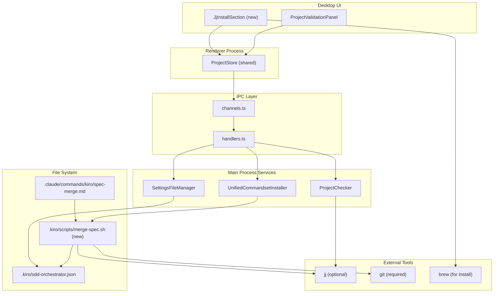
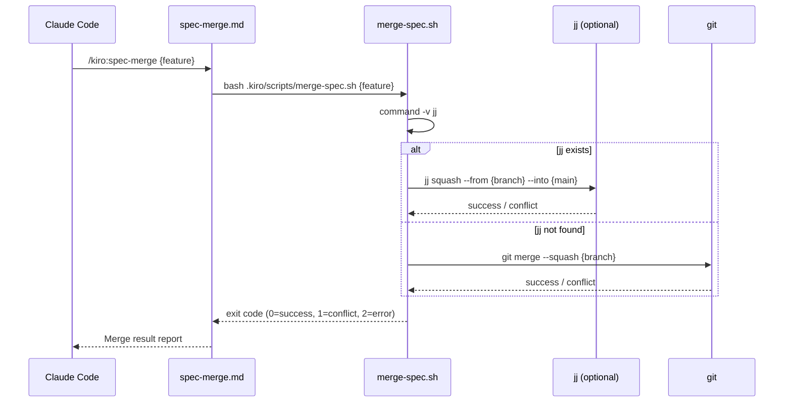
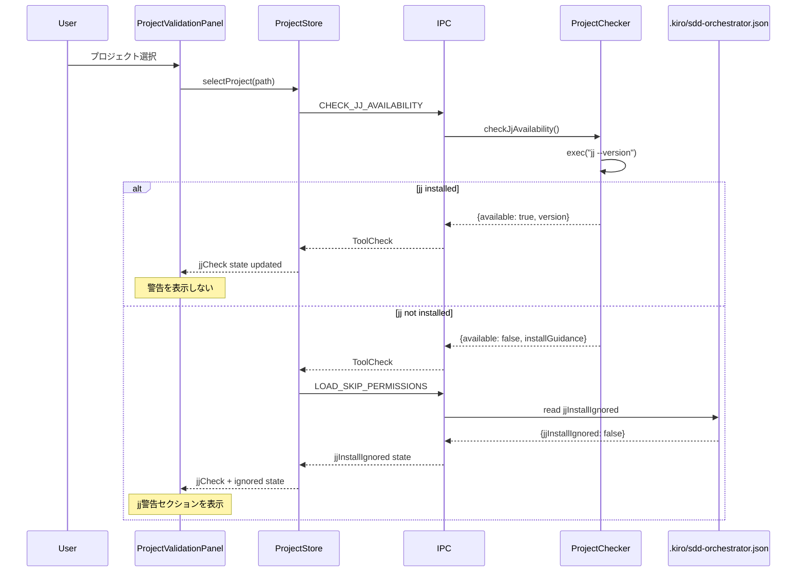
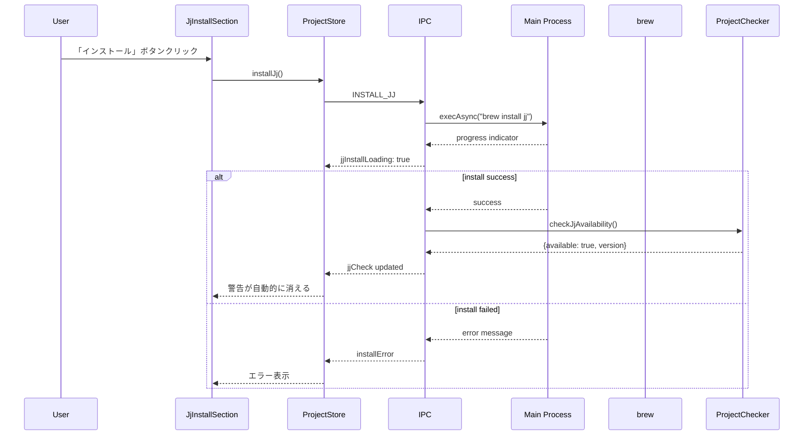
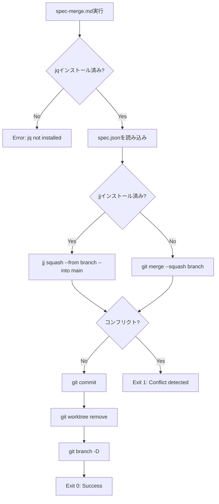

# Design: jj-merge-support

## Overview

この機能は、spec-mergeコマンドにJujutsu (jj)のサポートを追加し、git squash mergeの代替手段を提供する。jjはコンフリクトをファーストクラスとして扱うため、マージ操作が中断されずコンフリクト解消を後回しにできる。jjがインストールされていない環境でも従来のgitフォールバックで動作を継続する。

**Purpose**: jjの優れたコンフリクト処理機能を活用しつつ、既存のgitワークフローとの互換性を維持する。

**Users**: SDD Orchestratorを使用する開発者全員がjjの恩恵を受けられる（インストール済みの場合）。

**Impact**: 既存のspec-mergeワークフローにjj優先・gitフォールバックの判定ロジックを追加し、マージ時の安定性を向上させる。

### Goals

- jjが利用可能な場合は`jj squash`を優先的に使用してマージを実行
- jjが存在しない環境では従来のgit mergeにフォールバック
- プロジェクト選択時にjjの存在チェックを実行し、インストール推奨UIを表示
- マージスクリプトを`.kiro/scripts/merge-spec.sh`に切り出し、トークン消費を削減

### Non-Goals

- Windows環境でのjjインストールサポート（Homebrew前提のため）
- jj専用ワークフロー（megamerge等）の統合
- jj設定ファイル（~/.jjconfig.toml）の自動生成
- Remote UIからのjjインストール機能（Desktop UIのみ対応）
- jjとgit以外のバージョン管理システムのサポート

## Architecture

### Existing Architecture Analysis

現在のマージワークフローは、spec-merge.mdコマンド内でgit mergeコマンドを直接実行している。この設計は以下の課題を持つ：

- 条件分岐ロジック（jj検出、フォールバック処理）をプロンプト内に直接記述するとトークンを無駄に消費
- 実行の度に同じ判定ロジックを再評価するため不安定
- スクリプト化されていないため、メンテナンスが困難

既存のworktree関連スクリプト（`update-spec-for-deploy.sh`, `create-spec-worktree.sh`）は、`.kiro/scripts/`配下に配置され、commandsetインストール時にテンプレートからコピーされる。この設計パターンを踏襲する。

### Architecture Pattern & Boundary Map



**Architecture Integration**:
- Selected pattern: Layered architecture（UI層 → IPC層 → Service層 → File System/External Tools）
- Domain/feature boundaries:
  - UI層：jj警告の表示とインストール操作
  - Service層：jj存在チェック、設定の永続化
  - Script層：マージ実行時のjj/git判定とフォールバック
- Existing patterns preserved:
  - ProjectCheckerによるツールチェックパターン（jqチェックと同様）
  - SettingsFileManagerによる設定永続化パターン
  - UnifiedCommandsetInstallerによるスクリプトテンプレート配置パターン
- New components rationale:
  - `checkJjAvailability()`: 既存のcheckJqAvailability()と同じパターンで実装
  - `merge-spec.sh`: マージロジックをスクリプト化し、トークン消費を削減
  - `JjInstallSection`: ProjectValidationPanelに統合される新セクション
- Steering compliance:
  - DRY原則: 既存のProjectCheckerパターンを再利用
  - SSOT: .kiro/sdd-orchestrator.jsonに設定を集約

### Technology Stack

| Layer | Choice / Version | Role in Feature | Notes |
|-------|------------------|-----------------|-------|
| Frontend / CLI | React 19, TypeScript 5.8+ | jj警告UI、インストールボタン | ProjectValidationPanelを拡張 |
| Backend / Services | Node.js 20+, Electron 35 | jjチェック、インストール実行、設定管理 | ProjectChecker, SettingsFileManagerを使用 |
| Data / Storage | `.kiro/sdd-orchestrator.json` | jjInstallIgnoredフラグの永続化 | 既存の設定ファイルに新フィールド追加 |
| Infrastructure / Runtime | Bash, Homebrew | マージスクリプト、jjインストール | merge-spec.sh内でjj/git判定 |
| External Tools | jj (optional), git (required) | worktreeマージ実行 | jj優先、gitフォールバック |

### Command Prompt Architecture

この機能は`.claude/commands/`定義を修正する。

**Execution Model**: CLI invocation with script delegation

**Rationale**: マージ判定ロジックをスクリプト化することで、Claude Codeが毎回条件分岐を評価する必要がなくなり、トークン効率が向上する。スクリプトは安定した実行環境（bash）で動作し、jq依存も明示的にチェックできる。

**Data Flow**:


## System Flows

### jj Installation Check Flow



### jj Installation Flow



### Merge Script Execution Flow



## Requirements Traceability

| Criterion ID | Summary | Components | Implementation Approach |
|--------------|---------|------------|------------------------|
| 1.1 | jjコマンド存在確認 | `.kiro/scripts/merge-spec.sh` | 新規スクリプト実装：`command -v jj` |
| 1.2 | jj存在時にjj squashでマージ | `.kiro/scripts/merge-spec.sh` | 新規スクリプト実装：条件分岐でjj squash実行 |
| 1.3 | jj不在時にgit merge --squash | `.kiro/scripts/merge-spec.sh` | 新規スクリプト実装：フォールバックロジック |
| 1.4 | マージ後にworktree削除 | `.kiro/scripts/merge-spec.sh` | 新規スクリプト実装：`git worktree remove` |
| 1.5 | マージ後にfeatureブランチ削除 | `.kiro/scripts/merge-spec.sh` | 新規スクリプト実装：`git branch -D` |
| 2.1 | spec-merge.mdからスクリプト呼び出し | `spec-merge.md` | 既存コマンド修正：Step 3でスクリプト呼び出し |
| 2.2 | 成功時にStep 6へ進む | `spec-merge.md` | 既存コマンド修正：exit code 0の分岐処理 |
| 2.3 | コンフリクト時にStep 4へ進む | `spec-merge.md` | 既存コマンド修正：exit code 1の分岐処理 |
| 2.4 | エラー時にメッセージ表示 | `spec-merge.md` | 既存コマンド修正：exit code 2の分岐処理 |
| 3.1 | プロジェクト選択時にjjチェック | `ProjectChecker.checkJjAvailability()` | 新規メソッド実装：jq同様のパターン |
| 3.2 | jj不在時に警告セクション表示 | `ProjectValidationPanel`, `JjInstallSection` | 新規コンポーネント：既存のPermissionsCheckSectionパターン |
| 3.3 | インストール・無視ボタン提供 | `JjInstallSection` | 新規コンポーネント：UI実装 |
| 3.4 | jjInstallIgnored時に警告非表示 | `ProjectValidationPanel` | 既存コンポーネント修正：条件分岐追加 |
| 3.5 | 再読み込み時にjjチェック再実行 | `ProjectStore.selectProject()` | 既存ストア修正：チェックロジック追加 |
| 4.1 | インストールボタンでbrew install jj実行 | `ProjectStore.installJj()`, IPC handler | 新規メソッド実装：IPCでMainプロセスに委譲 |
| 4.2 | インストール中にスピナー表示 | `JjInstallSection` | 新規コンポーネント：ローディング状態管理 |
| 4.3 | インストール成功時にjjチェック再実行 | IPC handler | 新規実装：install完了後にcheckJjAvailability呼び出し |
| 4.4 | インストール失敗時にエラー表示 | `JjInstallSection` | 新規コンポーネント：エラー状態管理 |
| 4.5 | 他操作中もインストール継続 | Main Process | 既存パターン活用：非同期実行 |
| 5.1 | 無視ボタンでjjInstallIgnored=true設定 | `ProjectStore.ignoreJjInstall()`, `SettingsFileManager` | 新規メソッド実装：設定永続化 |
| 5.2 | jjInstallIgnored=trueで警告非表示 | `ProjectValidationPanel` | 既存コンポーネント修正：条件分岐追加 |
| 5.3 | 手動でfalseに変更時に警告再表示 | 自動（設定ファイル監視） | 既存パターン活用：ファイル変更検知 |
| 6.1 | jqコマンド不在時にエラー | `merge-spec.sh` | 新規スクリプト実装：`command -v jq` |
| 6.2 | spec.json不在時にエラー | `merge-spec.sh` | 新規スクリプト実装：`[ -f spec.json ]` |
| 6.3 | コンフリクト時にexit 1 | `merge-spec.sh` | 新規スクリプト実装：終了コード |
| 6.4 | worktree削除失敗時に警告 | `merge-spec.sh` | 新規スクリプト実装：エラーハンドリング |
| 6.5 | ブランチ削除失敗時に警告 | `merge-spec.sh` | 新規スクリプト実装：エラーハンドリング |
| 7.1 | jj --versionで存在確認 | `ProjectChecker.checkJjAvailability()` | 新規メソッド実装：jq同様のパターン |
| 7.2 | jj存在時にToolCheckオブジェクト（available: true）返却 | `ProjectChecker.checkJjAvailability()` | 新規メソッド実装：型定義準拠 |
| 7.3 | jj不在時にToolCheckオブジェクト（available: false）返却 | `ProjectChecker.checkJjAvailability()` | 新規メソッド実装：型定義準拠 |
| 7.4 | checkJqAvailability()同様の実装パターン | `ProjectChecker.checkJjAvailability()` | 新規メソッド実装：既存コードを参考 |
| 8.1 | jjチェックIPCハンドラ追加 | IPC handlers | 新規実装：CHECK_JJ_AVAILABILITY |
| 8.2 | jjインストールIPCハンドラ追加 | IPC handlers | 新規実装：INSTALL_JJ |
| 8.3 | jj無視設定IPCハンドラ追加 | IPC handlers | 新規実装：IGNORE_JJ_INSTALL |
| 8.4 | permissions関連ハンドラと同様の命名規則 | IPC handlers | 新規実装：ネーミング統一 |
| 9.1 | プロジェクト選択時にjjチェック結果取得 | `ProjectStore.selectProject()` | 既存ストア修正：IPC呼び出し追加 |
| 9.2 | jjCheckフィールド更新 | `ProjectStore` | 既存ストア修正：state追加 |
| 9.3 | jjInstallLoadingフィールド管理 | `ProjectStore` | 既存ストア修正：state追加 |
| 9.4 | jjInstallIgnored時にjjチェックスキップ | `ProjectStore.selectProject()` | 既存ストア修正：条件分岐 |
| 10.1 | jjCheck.available=falseかつjjInstallIgnored=falseで表示 | `ProjectValidationPanel` | 既存コンポーネント修正：条件分岐 |
| 10.2 | 「jjがインストールされていません」メッセージ | `JjInstallSection` | 新規コンポーネント：テキスト表示 |
| 10.3 | 「インストール (brew)」「無視」ボタン表示 | `JjInstallSection` | 新規コンポーネント：ボタン実装 |
| 10.4 | jjCheck.available=trueでセクション非表示 | `ProjectValidationPanel` | 既存コンポーネント修正：条件分岐 |
| 10.5 | jjInstallIgnored=trueでセクション非表示 | `ProjectValidationPanel` | 既存コンポーネント修正：条件分岐 |
| 11.1 | commandsetインストール時にスクリプトコピー | `UnifiedCommandsetInstaller` | 既存サービス修正：テンプレートコピー処理追加 |
| 11.2 | スクリプトに実行権限付与 | `UnifiedCommandsetInstaller` | 既存サービス修正：chmod +x実行 |
| 11.3 | .kiro/scripts/ディレクトリ自動作成 | `UnifiedCommandsetInstaller` | 既存サービス修正：mkdir -p相当 |
| 11.4 | 既存スクリプト上書き | `UnifiedCommandsetInstaller` | 既存サービス修正：上書きモード |

### Coverage Validation Checklist

- [x] Every criterion ID from requirements.md appears in the table above
- [x] Each criterion has specific component names (not generic references)
- [x] Implementation approach distinguishes "reuse existing" vs "new implementation"
- [x] User-facing criteria specify concrete UI components (not just "shared components")

## Components and Interfaces

| Component | Domain/Layer | Intent | Req Coverage | Key Dependencies (P0/P1) | Contracts |
|-----------|--------------|--------|--------------|--------------------------|-----------|
| merge-spec.sh | Script/Infrastructure | jj/git判定とマージ実行 | 1.1-1.5, 6.1-6.5 | jq (P0), jj (P1), git (P0) | Bash Script |
| ProjectChecker.checkJjAvailability() | Service/Main | jjツール存在チェック | 3.1, 7.1-7.4 | Node.js child_process (P0) | Service Interface |
| JjInstallSection | UI/Renderer | jj警告とインストールUI | 3.2, 3.3, 4.2, 4.4, 10.2, 10.3 | ProjectStore (P0) | React Component |
| ProjectValidationPanel (修正) | UI/Renderer | jjセクション表示制御 | 3.2, 3.4, 10.1, 10.4, 10.5 | ProjectStore (P0) | React Component |
| ProjectStore (修正) | State/Renderer | jjチェック状態管理 | 3.5, 4.1, 9.1-9.4 | IPC (P0) | State Management |
| SettingsFileManager (修正) | Service/Main | jjInstallIgnored永続化 | 5.1-5.3 | FileSystem (P0) | Service Interface |
| UnifiedCommandsetInstaller (修正) | Service/Main | スクリプトテンプレート配置 | 11.1-11.4 | FileSystem (P0) | Service Interface |
| spec-merge.md (修正) | Command/Prompt | スクリプト呼び出し | 2.1-2.4 | Bash (P0) | Command Prompt |
| IPC handlers (新規) | IPC/Main | jj関連のIPC通信 | 8.1-8.4 | ProjectChecker (P0), SettingsFileManager (P0) | IPC Contract |

### Scripts / Infrastructure

#### merge-spec.sh

| Field | Detail |
|-------|--------|
| Intent | worktreeブランチのマージをjj優先・gitフォールバックで実行 |
| Requirements | 1.1, 1.2, 1.3, 1.4, 1.5, 6.1, 6.2, 6.3, 6.4, 6.5 |

**Responsibilities & Constraints**
- jqコマンドの存在チェック（必須依存）
- jjコマンドの存在チェック（オプション依存）
- jj存在時：`jj squash --from <branch> --into <main>`でマージ
- jj不在時：`git merge --squash <branch>`でマージ
- マージ成功後：worktree削除、ブランチ削除
- spec.jsonは事前にworktree内で更新済み（`update-spec-for-deploy.sh`が実行済み前提）

**Dependencies**
- Inbound: `spec-merge.md` — スクリプト呼び出し (P0)
- External: `jq` — JSON処理（必須） (P0)
- External: `jj` — マージ実行（オプション） (P1)
- External: `git` — フォールバックマージ、worktree管理 (P0)

**Contracts**: Bash Script [x]

##### Bash Script Interface

**Input**:
- `$1`: feature-name (required)
- 環境: `.kiro/specs/{feature}/spec.json`が存在すること
- 環境: worktreeブランチが存在すること

**Output**:
- Exit Code:
  - `0`: 成功（マージ完了、worktree削除、ブランチ削除）
  - `1`: コンフリクト検出（マージ中断、worktree削除せず）
  - `2`: エラー（jq不在、spec.json不在、引数不足）

**Side Effects**:
- spec.jsonの`worktree`フィールド削除、`phase`を`deploy-complete`に設定（`update-spec-for-deploy.sh`が実行済み）
- worktreeディレクトリ削除
- featureブランチ削除

**Error Handling**:
- jq不在：エラーメッセージ表示（stderr）、exit 2
- spec.json不在：エラーメッセージ表示（stderr）、exit 2
- コンフリクト発生：エラーメッセージ表示（stderr）、exit 1
- worktree削除失敗：警告表示（stderr）、処理継続
- ブランチ削除失敗：警告表示（stderr）、処理継続

**Log Output**:
- 正常ログ（マージ成功メッセージ、進行状況）: stdout
- エラーメッセージ: stderr
- bashスクリプトの標準的な慣習に従う

**Implementation Notes**
- Integration: commandsetインストール時に`electron-sdd-manager/resources/templates/scripts/merge-spec.sh`から`.kiro/scripts/merge-spec.sh`へコピー
- Validation: jqコマンドのバージョンチェックは不要（存在チェックのみ）
- Risks: jjとgitのマージセマンティクスの違いによる予期しない動作（jjはコンフリクトをコミットに含める可能性）

### Services / Main Process

#### ProjectChecker.checkJjAvailability()

| Field | Detail |
|-------|--------|
| Intent | jjコマンドの存在とバージョンを確認 |
| Requirements | 3.1, 7.1, 7.2, 7.3, 7.4 |

**Responsibilities & Constraints**
- `jj --version`を実行してjjの存在を確認
- 成功時：バージョン情報を抽出してToolCheckオブジェクトを返却
- 失敗時：installGuidanceを含むToolCheckオブジェクトを返却
- 既存のcheckJqAvailability()と同様の実装パターンを使用

**Dependencies**
- Inbound: IPC handlers — IPCリクエスト処理 (P0)
- External: Node.js `child_process.exec` — コマンド実行 (P0)

**Contracts**: Service Interface [x]

##### Service Interface

```typescript
async checkJjAvailability(): Promise<ToolCheck> {
  // Implementation: execAsync('jj --version')
  // Success: { name: 'jj', available: true, version: string }
  // Failure: { name: 'jj', available: false, installGuidance: 'brew install jj' }
}
```

- Preconditions: なし（常時呼び出し可能）
- Postconditions: ToolCheckオブジェクトを返却
- Invariants: `name`フィールドは常に`'jj'`

**Implementation Notes**
- Integration: ProjectCheckerクラスに新メソッドとして追加（既存のcheckJqAvailability()の隣）
- Validation: バージョン文字列のパースは不要（stdout.trim()をそのまま使用）
- Risks: jjの異常終了時にバージョン情報を取得できない可能性（エラーハンドリングで対応）

#### SettingsFileManager (修正)

| Field | Detail |
|-------|--------|
| Intent | .kiro/sdd-orchestrator.jsonにjjInstallIgnoredフィールドを永続化 |
| Requirements | 5.1, 5.2, 5.3 |

**Responsibilities & Constraints**
- 既存の設定ファイル読み書きロジックを拡張
- `settings.jjInstallIgnored`フィールドの追加・更新
- 既存フィールドとの競合を避ける（設定ファイル全体をマージ）

**Dependencies**
- Inbound: IPC handlers — 設定更新リクエスト (P0)
- Outbound: FileSystem — `.kiro/sdd-orchestrator.json`読み書き (P0)

**Contracts**: Service Interface [x]

##### Service Interface

```typescript
interface ProjectSettings {
  jjInstallIgnored?: boolean;
  // existing fields...
}

async setJjInstallIgnored(projectPath: string, ignored: boolean): Promise<Result<void, Error>> {
  // Implementation: Read config, update settings.jjInstallIgnored, write back
}

async getJjInstallIgnored(projectPath: string): Promise<Result<boolean, Error>> {
  // Implementation: Read config, return settings.jjInstallIgnored || false
}
```

- Preconditions: projectPathが有効なプロジェクトルート
- Postconditions: `.kiro/sdd-orchestrator.json`が更新される
- Invariants: 既存の設定フィールドは保持される

**Implementation Notes**
- Integration: 既存のloadSettings/saveSettings内部ロジックを活用
- Validation: jjInstallIgnoredフィールドの型チェック（Zodスキーマ追加）
- Risks: 同時書き込みによる設定ファイル破損（ファイルロック不要、Electronはシングルスレッド）

#### UnifiedCommandsetInstaller (修正)

| Field | Detail |
|-------|--------|
| Intent | commandsetインストール時にmerge-spec.shテンプレートをコピー |
| Requirements | 11.1, 11.2, 11.3, 11.4 |

**Responsibilities & Constraints**
- 既存のスクリプトコピーロジック（update-spec-for-deploy.sh等）と同じパターンを使用
- `.kiro/scripts/`ディレクトリが存在しない場合は自動作成
- コピー後に`chmod +x`で実行権限を付与
- 既存ファイルは上書き（バージョンアップ対応）

**Dependencies**
- Inbound: IPC handlers — commandsetインストールリクエスト (P0)
- Outbound: FileSystem — テンプレートコピー、権限変更 (P0)

**Contracts**: Service Interface [x]

##### Service Interface

```typescript
async installScripts(projectPath: string, profile: ProfileName): Promise<Result<InstallResult, InstallError>> {
  // Implementation:
  // 1. mkdir -p .kiro/scripts
  // 2. Copy merge-spec.sh from resources/templates/scripts/
  // 3. chmod +x .kiro/scripts/merge-spec.sh
  // 4. Return InstallResult with installed file list
}
```

- Preconditions: projectPathが有効、resourcesディレクトリが存在
- Postconditions: `.kiro/scripts/merge-spec.sh`が実行権限付きで配置される
- Invariants: 既存の他スクリプトは変更されない

**Implementation Notes**
- Integration: 既存のinstallCommandset()内部でinstallScripts()を呼び出す
- Validation: テンプレートファイルの存在チェック（template_not_foundエラー）
- Risks: 権限変更失敗時のフォールバック（エラーログのみ、致命的エラーにはしない）

### UI Components / Renderer

#### JjInstallSection (新規)

| Field | Detail |
|-------|--------|
| Intent | jj未インストール時の警告とインストール・無視操作UI |
| Requirements | 3.2, 3.3, 4.2, 4.4, 10.2, 10.3 |

**Responsibilities & Constraints**
- jjCheck.available === false かつ jjInstallIgnored === false の場合のみ表示
- 「jjがインストールされていません」メッセージ表示
- 「インストール (brew)」ボタン：`ProjectStore.installJj()`を呼び出し
- 「無視」ボタン：`ProjectStore.ignoreJjInstall()`を呼び出し
- インストール中はスピナー表示、成功時は自動的に非表示、失敗時はエラー表示

**Dependencies**
- Inbound: ProjectValidationPanel — レンダリング (P0)
- Outbound: ProjectStore — 状態参照とアクション実行 (P0)

**Contracts**: React Component [x]

##### React Component Interface

```typescript
interface JjInstallSectionProps {
  jjCheck: ToolCheck;
  jjInstallLoading: boolean;
  jjInstallError: string | null;
  onInstall: () => void;
  onIgnore: () => void;
}

export function JjInstallSection({
  jjCheck,
  jjInstallLoading,
  jjInstallError,
  onInstall,
  onIgnore,
}: JjInstallSectionProps): JSX.Element | null {
  // Render logic
}
```

**Implementation Notes**
- Integration: ProjectValidationPanel内で条件付きレンダリング（PermissionsCheckSectionと同じパターン）
- Validation: jjCheck.availableがtrueの場合はnullを返却（早期リターン）
- Risks: brewインストール失敗時のユーザー混乱（エラーメッセージで「手動でbrew install jjを実行してください」と案内）

**Error Messages**:
- インストール失敗時: "Homebrewのインストールに失敗しました。手動で `brew install jj` を実行してください。エラー: {stderr}"
- stderrの内容を含めることで、ユーザーがエラー原因を把握できる

#### ProjectValidationPanel (修正)

| Field | Detail |
|-------|--------|
| Intent | jjセクションの表示制御を追加 |
| Requirements | 3.2, 3.4, 10.1, 10.4, 10.5 |

**Responsibilities & Constraints**
- 既存の検証セクション（kiro, spec-manager, permissions）に加えてjjセクションを追加
- jjCheck.available === false かつ jjInstallIgnored === false の場合のみJjInstallSectionをレンダリング
- それ以外の場合は何も表示しない（ノイズ削減）

**Dependencies**
- Inbound: App.tsx — レンダリング (P0)
- Outbound: ProjectStore — 状態参照 (P0)
- Outbound: JjInstallSection — 条件付きレンダリング (P1)

**Contracts**: React Component [x]

##### React Component Interface

```typescript
// 既存のProjectValidationPanelPropsに追加
// Props: useProjectStore()から取得
const {
  jjCheck,
  jjInstallIgnored,
  jjInstallLoading,
  installJj,
  ignoreJjInstall,
} = useProjectStore();

// Render logic:
// if (!jjCheck?.available && !jjInstallIgnored) {
//   return <JjInstallSection ... />;
// }
```

**Implementation Notes**
- Integration: 既存のPermissionsCheckSectionの直後にjjセクションを配置
- Validation: jjCheckがnullの場合はセクションを表示しない（プロジェクト未選択時）
- Risks: 複数の検証セクションが同時表示され、UIが混雑する可能性（各セクションを折りたたみ可能にする将来改善案）

### State Management / Renderer

#### ProjectStore (修正)

| Field | Detail |
|-------|--------|
| Intent | jjチェック状態とインストール操作の管理 |
| Requirements | 3.5, 4.1, 9.1, 9.2, 9.3, 9.4 |

**Responsibilities & Constraints**
- プロジェクト選択時にjjチェックを実行（jjInstallIgnored === trueの場合はスキップ）
- jjCheck: ToolCheck | nullフィールドを追加
- jjInstallLoading: booleanフィールドを追加
- installJj(): IPCでbrew install jj実行、完了後にjjチェック再実行
- ignoreJjInstall(): IPCでjjInstallIgnored=true設定

**Dependencies**
- Inbound: UI Components — 状態参照とアクション実行 (P0)
- Outbound: IPC — jjチェック、インストール、設定更新 (P0)

**Contracts**: State Management [x]

##### State Management

```typescript
interface ProjectStoreState {
  // existing fields...
  jjCheck: ToolCheck | null;
  jjInstallIgnored: boolean;
  jjInstallLoading: boolean;
  jjInstallError: string | null;
}

interface ProjectStoreActions {
  // existing actions...
  installJj: () => Promise<void>;
  ignoreJjInstall: () => Promise<void>;
}

// Implementation:
// selectProject(path) {
//   const ignored = await IPC.LOAD_SKIP_PERMISSIONS(path, 'jj');
//   if (!ignored) {
//     const check = await IPC.CHECK_JJ_AVAILABILITY();
//     set({ jjCheck: check, jjInstallIgnored: ignored });
//   }
// }
```

- State model: Zustandストア（shared/stores/projectStore.ts）
- Persistence & consistency: jjInstallIgnoredは.kiro/sdd-orchestrator.jsonに永続化
- Concurrency strategy: 非同期アクション（async/await）、状態更新は同期的

**Implementation Notes**
- Integration: 既存のpermissionsCheckと同様のパターンで実装
- Validation: jjInstallLoadingとjjCheckの同期（ローディング中はjjCheckを更新しない）
- Risks: プロジェクト切り替え時のjjチェック重複実行（selectProjectのdebounceで対応済み）

### IPC Layer / Main Process

#### IPC handlers (新規)

| Field | Detail |
|-------|--------|
| Intent | Renderer↔Main間のjj関連通信を処理 |
| Requirements | 8.1, 8.2, 8.3, 8.4 |

**Responsibilities & Constraints**
- CHECK_JJ_AVAILABILITY: ProjectChecker.checkJjAvailability()を呼び出し
- INSTALL_JJ: `brew install jj`を実行、完了後にjjチェック再実行
- IGNORE_JJ_INSTALL: SettingsFileManager.setJjInstallIgnored()を呼び出し
- 既存のpermissions関連ハンドラと同様のネーミング規則を使用

**Dependencies**
- Inbound: IPC channels — Rendererからのリクエスト (P0)
- Outbound: ProjectChecker — jjチェック実行 (P0)
- Outbound: SettingsFileManager — 設定永続化 (P0)
- External: brew — jjインストール実行 (P1)

**Contracts**: IPC Contract [x]

##### IPC Contract

| Channel | Request | Response | Errors |
|---------|---------|----------|--------|
| CHECK_JJ_AVAILABILITY | void | ToolCheck | なし（常に成功） |
| INSTALL_JJ | void | { success: true } \| { success: false, error: string } | brew実行エラー |
| IGNORE_JJ_INSTALL | { projectPath: string, ignored: boolean } | { success: true } \| { success: false, error: string } | ファイル書き込みエラー |

**Implementation Notes**
- Integration: `electron-sdd-manager/src/main/ipc/handlers.ts`に追加
- Validation: リクエストパラメータのZodバリデーション
- Risks: brewインストール中のタイムアウト（長時間実行のため、タイムアウトは設定しない）

### Command Prompts / Claude Code

#### spec-merge.md (修正)

| Field | Detail |
|-------|--------|
| Intent | マージロジックをスクリプトに委譲し、トークン消費を削減 |
| Requirements | 2.1, 2.2, 2.3, 2.4 |

**Responsibilities & Constraints**
- Step 3（Perform Merge）でスクリプト呼び出し：`bash .kiro/scripts/merge-spec.sh {feature}`
- exit code 0（成功）：Step 6（Report Success）へ進む
- exit code 1（コンフリクト）：Step 4（Conflict Resolution）へ進む
- exit code 2以上（エラー）：エラーメッセージを表示して停止

**Dependencies**
- Inbound: Claude Code — コマンド実行 (P0)
- Outbound: merge-spec.sh — スクリプト呼び出し (P0)

**Contracts**: Command Prompt [x]

##### Command Prompt Interface

**Input**:
- `$1`: feature-name

**Output**:
- Markdown formatted report
- Sections: Merge Summary, Conflict Resolution, Cleanup, spec.json Update

**Execution Flow**:
```markdown
### Step 3: Perform Merge

1. Call merge script:
   ```bash
   bash .kiro/scripts/merge-spec.sh {feature}
   ```
2. Check exit code:
   - 0: Success → go to Step 6
   - 1: Conflict → go to Step 4
   - 2+: Error → display error message and stop
```

**Implementation Notes**
- Integration: 既存のStep 3を完全に置き換え（条件分岐ロジックをスクリプトに移動）
- Validation: スクリプトの存在チェック（ファイルが見つからない場合はエラー）
- Risks: スクリプトの権限不足（実行権限がない場合のエラーハンドリング）

## Data Models

### Domain Model

**Aggregate: Project Settings**
- Root Entity: `.kiro/sdd-orchestrator.json`
- Value Object: `settings.jjInstallIgnored`（boolean型）

**Business Rules**:
- jjInstallIgnored === trueの場合、jj警告UIを表示しない
- プロジェクトごとに独立した設定値を持つ

**Domain Events**:
- jjInstallIgnoredChanged: 無視設定が変更された時
- jjInstalled: jjが正常にインストールされた時

### Logical Data Model

**Structure Definition**:

`.kiro/sdd-orchestrator.json`:
```typescript
interface SddOrchestratorConfig {
  // existing fields...
  settings: {
    // existing settings...
    jjInstallIgnored?: boolean; // optional, defaults to false
  };
}
```

**Consistency & Integrity**:
- Transaction boundaries: ファイル単位（1つのファイル書き込み = 1トランザクション）
- Referential integrity: なし（独立したフラグ）
- Temporal aspects: updated_at等のタイムスタンプは既存フィールドで管理

### Data Contracts & Integration

**API Data Transfer**:

IPC Request (IGNORE_JJ_INSTALL):
```typescript
{
  projectPath: string;
  ignored: boolean;
}
```

IPC Response (CHECK_JJ_AVAILABILITY):
```typescript
interface ToolCheck {
  name: 'jj';
  available: boolean;
  version?: string; // if available
  installGuidance?: string; // if not available
}
```

**Schema Versioning Strategy**:
- Backward compatibility: jjInstallIgnoredフィールドがない既存プロジェクトはfalseとして扱う
- Forward compatibility: 新フィールド追加のみ（既存フィールドは変更しない）

## Error Handling

### Error Strategy

**User Errors**:
- jj未インストール → 警告UI表示、インストールガイダンス提供
- スクリプト実行権限不足 → エラーメッセージで権限変更コマンド案内

**System Errors**:
- brewインストール失敗 → エラーメッセージ表示、手動インストール案内
- 設定ファイル書き込み失敗 → エラーログ、ユーザーに再試行を促す

**Business Logic Errors**:
- マージコンフリクト → exit code 1で通知、spec-merge.mdのStep 4へ

### Error Categories and Responses

**Tool Availability Errors**:
- jq not found → merge-spec.sh exit 2、エラーメッセージ「brew install jq」
- jj not found → gitフォールバック、警告なし（正常動作）

**Installation Errors**:
- brew command not found → エラーメッセージ「Homebrewがインストールされていません」
- brew install jj failed → エラーメッセージとstderr出力表示

**Configuration Errors**:
- .kiro/sdd-orchestrator.json write failed → エラーログ、ユーザーに手動編集案内

### Monitoring

- ログ出力: ProjectLoggerを使用してjjチェック結果をログ記録
- エラートラッキング: brewインストールエラーはメインログに記録
- ヘルスモニタリング: jjチェック失敗率（将来的にメトリクス追加検討）

## Testing Strategy

### Unit Tests

- **ProjectChecker.checkJjAvailability()**:
  - jj存在時にToolCheck（available: true）を返却
  - jj不在時にToolCheck（available: false）を返却
- **SettingsFileManager.setJjInstallIgnored()**:
  - 設定ファイルに正しくフィールドを追加
  - 既存フィールドを保持
- **merge-spec.sh**:
  - jq不在時にexit 2
  - jj存在時にjj squash実行
  - jj不在時にgit merge実行

### Integration Tests

- **jjインストールフロー**:
  - 「インストール」ボタン → brew install jj → jjチェック再実行 → 警告消失
- **無視設定フロー**:
  - 「無視」ボタン → .kiro/sdd-orchestrator.json更新 → 警告非表示
- **スクリプト呼び出し**:
  - spec-merge.mdからmerge-spec.sh呼び出し → 成功・コンフリクト・エラーの分岐処理

### E2E/UI Tests

- **jj警告表示**:
  - jj未インストールプロジェクト選択 → 警告セクション表示
  - jjインストール済みプロジェクト選択 → 警告セクション非表示
- **jjインストール**:
  - 「インストール」ボタンクリック → スピナー表示 → 完了時に警告消失
- **無視設定永続化**:
  - 「無視」ボタンクリック → プロジェクト再選択時に警告非表示

## Optional Sections

### Performance & Scalability

**Target Metrics**:
- jjチェック実行時間: 100ms未満（`jj --version`のコマンド実行）
- brewインストール実行時間: 5-30秒（ネットワーク依存、タイムアウトなし）

**Optimization Techniques**:
- jjチェック結果のキャッシュ（プロジェクト選択中は再チェックしない）
- jjInstallIgnored === trueの場合はjjチェックをスキップ

## Design Decisions

### DD-001: マージロジックのスクリプト化

| Field | Detail |
|-------|--------|
| Status | Accepted |
| Context | spec-merge.mdコマンド内でjj/gitの条件分岐を直接記述すると、毎回同じロジックを再評価しトークンを無駄に消費する |
| Decision | マージロジックを`.kiro/scripts/merge-spec.sh`に切り出し、spec-merge.mdからスクリプトを呼び出す |
| Rationale | スクリプト化により、Claude Codeは単純にスクリプトを実行しexit codeで分岐するだけで済む。トークン消費削減と実行安定性の両立が可能 |
| Alternatives Considered | (1) spec-merge.md内で条件分岐を直接実行：トークン消費が大きい (2) Main ProcessでjjチェックしてRendererに結果を渡す：IPC往復が増える |
| Consequences | スクリプトファイルの管理が必要になるが、commandsetインストール時に自動配置されるため運用負荷は低い |

### DD-002: jjとgitの優先順位

| Field | Detail |
|-------|--------|
| Status | Accepted |
| Context | jjはgitより優れたコンフリクト処理機能を持つが、全ユーザーがインストールしているわけではない |
| Decision | jj優先・gitフォールバック方式を採用。jjが存在する場合は`jj squash`を使用し、存在しない場合は従来の`git merge --squash`を使用 |
| Rationale | jjの恩恵を受けられるユーザーには最良のUXを提供しつつ、jjを使わないユーザーも影響を受けない。段階的な移行が可能 |
| Alternatives Considered | (1) jj必須化：既存ユーザーへの影響が大きい (2) git専用継続：jjの利点を活かせない (3) ユーザー選択制：設定管理が複雑 |
| Consequences | jjとgitのマージセマンティクスの違いにより、まれに予期しない動作が発生する可能性（jjはコンフリクトをコミットに含める） |

### DD-003: jjインストール推奨UIの配置

| Field | Detail |
|-------|--------|
| Status | Accepted |
| Context | jjのインストールを促すUIをどこに配置するか。常時表示するとノイズになる |
| Decision | ProjectValidationPanel内に新セクションとして配置。jq未インストール警告やpermissions警告と同じタイミングで表示 |
| Rationale | 既存のバリデーション警告と同じ場所に配置することで、ユーザーは「プロジェクトセットアップ時にチェックすべき項目」としてまとめて確認できる。無視機能により、不要なユーザーには表示しない |
| Alternatives Considered | (1) 独立したモーダルダイアログ：侵襲的で嫌われる (2) 設定画面に隠す：気づかれない (3) 常時表示：ノイズ |
| Consequences | ProjectValidationPanelが検証項目で混雑する可能性。将来的に折りたたみ機能を追加する必要があるかもしれない |

### DD-004: jjInstallIgnoredの保存場所

| Field | Detail |
|-------|--------|
| Status | Accepted |
| Context | ユーザーが「無視」ボタンを押した時、その設定をどこに保存するか |
| Decision | `.kiro/sdd-orchestrator.json`の`settings.jjInstallIgnored`フィールドに保存 |
| Rationale | 既存のプロジェクト設定ファイルと統一。プロジェクトごとの設定として適切。Electronのuser dataストアではなくプロジェクト内に保存することで、チーム内で設定を共有可能 |
| Alternatives Considered | (1) Electronのuser dataストア：プロジェクト横断的になりチーム共有不可 (2) 新規ファイル作成：ファイル増加、管理負荷 |
| Consequences | `.kiro/sdd-orchestrator.json`がない古いプロジェクトでは初回作成が必要（既存の設定管理で対応済み） |

### DD-005: jjとgit worktreeの互換性

| Field | Detail |
|-------|--------|
| Status | Accepted |
| Context | jjはgit worktreeを直接サポートしていない。git worktreeで作成されたブランチをjjでマージする方法 |
| Decision | `jj squash --from <feature-branch> --into <main-branch>`を使用。jjはgit互換であり、gitブランチに対しても操作可能 |
| Rationale | jjはgitリポジトリを直接操作できるため、git worktreeで作成されたブランチもjjでマージ可能。実際にjjコミュニティでも同様のワークフローが使用されている（参考: [A Better Merge Workflow with Jujutsu](https://ofcr.se/jujutsu-merge-workflow)） |
| Alternatives Considered | (1) jj workspace使用：既存のgit worktreeワークフローを破棄することになる (2) gitのみ使用：jjの利点を活かせない |
| Consequences | jjとgitの混在によるセマンティクスの違いに注意が必要。jjはコンフリクトを「ファーストクラス」として扱うため、gitと異なる動作をする場合がある |

### DD-006: Homebrewパッケージ名の確認

| Field | Detail |
|-------|--------|
| Status | Accepted |
| Context | jujutsuのHomebrewパッケージ名が`jj`か`jj-cli`か不明確 |
| Decision | `jj`（Homebrew公式パッケージ名）を使用。`brew install jj`でインストール可能 |
| Rationale | [Homebrew Formulae](https://formulae.brew.sh/formula/jj)で確認したところ、公式パッケージ名は`jj`。`jj-cli`はCargoでのクレート名 |
| Alternatives Considered | (1) `jj-cli`使用：Homebrewでは存在しない (2) 両方試す：不要な複雑性 |
| Consequences | なし（正式なパッケージ名を使用） |

## 結合・廃止戦略 (Integration & Deprecation Strategy)

### 既存ファイルの修正（Wiring Points）

以下のファイルは新機能を統合するために修正が必要：

| ファイル | 修正内容 | 理由 |
|----------|----------|------|
| `electron-sdd-manager/src/main/services/projectChecker.ts` | `checkJjAvailability()`メソッド追加 | jjコマンド存在チェック機能を提供 |
| `electron-sdd-manager/src/main/services/settingsFileManager.ts` | `setJjInstallIgnored()`、`getJjInstallIgnored()`メソッド追加 | jjInstallIgnored設定の永続化 |
| `electron-sdd-manager/src/main/services/unifiedCommandsetInstaller.ts` | `installScripts()`メソッド拡張（merge-spec.shコピー処理追加） | commandsetインストール時にスクリプト配置 |
| `electron-sdd-manager/src/main/ipc/channels.ts` | `CHECK_JJ_AVAILABILITY`, `INSTALL_JJ`, `IGNORE_JJ_INSTALL`チャンネル定義追加 | IPC通信チャンネル定義 |
| `electron-sdd-manager/src/main/ipc/handlers.ts` | 上記3チャンネルのハンドラ実装追加 | Renderer↔Main間のjj関連通信処理 |
| `electron-sdd-manager/src/preload/index.ts` | preload APIにjj関連メソッド公開 | Rendererからjj関連IPC呼び出しを可能にする |
| `electron-sdd-manager/src/renderer/components/ProjectValidationPanel.tsx` | jjセクションの条件付きレンダリング追加 | jj警告UIの表示制御 |
| `electron-sdd-manager/src/shared/stores/projectStore.ts` | `jjCheck`, `jjInstallIgnored`, `jjInstallLoading`, `installJj()`, `ignoreJjInstall()`追加 | jj関連の状態管理とアクション |
| `electron-sdd-manager/resources/templates/commands/cc-sdd-agent/spec-merge.md` | Step 3のマージ処理をスクリプト呼び出しに変更 | マージロジックのスクリプト委譲 |
| `electron-sdd-manager/resources/templates/commands/cc-sdd/spec-merge.md` | cc-sdd-agentと同様の修正 | cc-sddプロファイルでも同じスクリプトを使用 |

### 新規ファイル（Creation）

以下のファイルは新規作成：

| ファイル | 用途 | 配置タイミング |
|----------|------|--------------|
| `electron-sdd-manager/resources/templates/scripts/merge-spec.sh` | マージスクリプトのテンプレート | 開発時（実装フェーズ） |
| `electron-sdd-manager/src/renderer/components/JjInstallSection.tsx` | jj警告UIコンポーネント | 開発時（実装フェーズ） |
| `.kiro/scripts/merge-spec.sh` (プロジェクト側) | マージスクリプトの実体 | commandsetインストール時に自動コピー |

### 削除ファイル（Cleanup）

**削除対象ファイル: なし**

この機能は既存機能の拡張であり、ファイル削除は発生しない。

## インターフェース変更と影響分析 (Interface Changes & Impact Analysis)

### 修正対象メソッドシグネチャ

#### UnifiedCommandsetInstaller.installCommandsetByProfile()

**変更内容**: 内部でinstallScripts()を呼び出すロジックを追加（シグネチャ変更なし）

**Callers（影響を受ける呼び出し元）**:
- `electron-sdd-manager/src/main/ipc/installHandlers.ts`: `INSTALL_COMMANDSET_BY_PROFILE`ハンドラ
  - **対応**: なし（シグネチャ変更なし、内部実装のみ変更）

### 新規追加メソッド

以下のメソッドは新規追加のため、既存コードへの影響なし：

- `ProjectChecker.checkJjAvailability()`
- `SettingsFileManager.setJjInstallIgnored()`
- `SettingsFileManager.getJjInstallIgnored()`
- `ProjectStore.installJj()`
- `ProjectStore.ignoreJjInstall()`

### IPC API追加

以下のIPCチャンネルは新規追加：

- `CHECK_JJ_AVAILABILITY` (新規)
- `INSTALL_JJ` (新規)
- `IGNORE_JJ_INSTALL` (新規)

**Callersへの影響**: なし（新規APIのため）

### Preload API追加

`window.electronAPI`に以下のメソッドを追加：

```typescript
// preload/index.ts implementation pattern
const electronAPI = {
  checkJjAvailability: (): Promise<ToolCheck> =>
    ipcRenderer.invoke(IPC_CHANNELS.CHECK_JJ_AVAILABILITY),
  installJj: (): Promise<{ success: boolean; error?: string }> =>
    ipcRenderer.invoke(IPC_CHANNELS.INSTALL_JJ),
  ignoreJjInstall: (projectPath: string, ignored: boolean): Promise<{ success: boolean; error?: string }> =>
    ipcRenderer.invoke(IPC_CHANNELS.IGNORE_JJ_INSTALL, projectPath, ignored),
};
contextBridge.exposeInMainWorld('electronAPI', electronAPI);
```

**Callersへの影響**: なし（新規APIのため）

**実装パターン**:
- `ipcRenderer.invoke()`を使用してIPCチャンネルを呼び出す
- 戻り値はPromiseで非同期処理
- contextBridgeで安全にRendererに公開

## Integration Test Strategy

この機能は以下のクロス境界通信を含むため、統合テストが必要：

### Components

- **UI Layer**: ProjectValidationPanel, JjInstallSection
- **State Layer**: ProjectStore (Zustand)
- **IPC Layer**: channels.ts, handlers.ts, preload/index.ts
- **Service Layer**: ProjectChecker, SettingsFileManager
- **File System**: .kiro/sdd-orchestrator.json
- **External Tools**: jj, brew

### Data Flow

1. **jjチェックフロー**:
   - UI: プロジェクト選択
   - Store: `selectProject()` → IPC: `CHECK_JJ_AVAILABILITY`
   - Main: `ProjectChecker.checkJjAvailability()` → exec("jj --version")
   - IPC response → Store state update → UI re-render

2. **jjインストールフロー**:
   - UI: 「インストール」ボタン
   - Store: `installJj()` → IPC: `INSTALL_JJ`
   - Main: exec("brew install jj") → `checkJjAvailability()`
   - IPC response → Store state update → UI re-render

3. **無視設定フロー**:
   - UI: 「無視」ボタン
   - Store: `ignoreJjInstall()` → IPC: `IGNORE_JJ_INSTALL`
   - Main: `SettingsFileManager.setJjInstallIgnored()` → file write
   - IPC response → Store state update → UI re-render

### Mock Boundaries

- **Mock IPC transport**: Rendererテスト時はIPC呼び出しをモック、Mainテスト時は実際のサービスを使用
- **Mock external commands**: `exec("jj --version")`と`exec("brew install jj")`をモック（実際のインストールは実行しない）
- **Use real Store**: ProjectStoreは実際のZustandストアを使用（状態遷移をテスト）
- **Use real SettingsFileManager**: 実際のファイル読み書きをテスト（tmpディレクトリを使用）

### Verification Points

- **jjチェック成功**: `jjCheck.available === true`, `jjCheck.version`が存在
- **jjチェック失敗**: `jjCheck.available === false`, `jjCheck.installGuidance`が存在
- **インストール開始**: `jjInstallLoading === true`
- **インストール成功**: `jjCheck.available === true`, `jjInstallLoading === false`
- **無視設定反映**: `.kiro/sdd-orchestrator.json`に`settings.jjInstallIgnored: true`が書き込まれる
- **UI表示制御**: `jjInstallIgnored === true`時に警告セクションが非表示

### Robustness Strategy

- **Async timing handling**: `waitFor`パターンを使用（固定sleepを避ける）
  - 例: `await waitFor(() => expect(jjInstallLoading).toBe(false))`
- **State transition monitoring**: Zustandストアの状態変化をsubscribeして監視
  - 例: `store.subscribe((state) => { if (!state.jjInstallLoading) resolve(); })`
- **Avoid flaky tests**:
  - IPC応答を待つ際は`Promise.race([ipcCall, timeout(5000)])`で最大待機時間を設定
  - ファイル書き込み後は`fs.access()`で存在確認してから次のステップへ進む

### Prerequisites

以下のテストインフラが必要：

- **IPC Mock Helper**: `vitest-electron`または手動でIPCモックを作成
- **Temporary File Manager**: テスト用の一時ディレクトリ作成・削除ヘルパー
- **Command Mock Utility**: `child_process.exec`をモックするユーティリティ（既存のexecAsyncテストパターンを活用）
- **Store Test Helper**: Zustandストアのリセットとsubscribeヘルパー

## Supporting References

### External Dependency Research

**Jujutsu (jj) Overview**:
- Official website: https://jj-vcs.github.io/jj/
- GitHub repository: https://github.com/jj-vcs/jj
- Homebrew formula: https://formulae.brew.sh/formula/jj

**Key findings**:
- jjはgit互換のバージョン管理システム
- コンフリクトをファーストクラスとして扱い、操作が中断されない
- `jj squash`でgitブランチに対してもマージ可能
- Homebrewパッケージ名は`jj`（`jj-cli`ではない）

**Git worktree compatibility**:
- jjはgit worktreeを直接サポートしないが、gitブランチに対して操作可能
- `jj squash --from <branch> --into <main>`でworktreeブランチをマージできる
- 参考: [Git compatibility - Jujutsu docs](https://jj-vcs.github.io/jj/latest/git-compatibility/)

---

## Sources

- [Jujutsu (jj), a git compatible VCS - Tony Finn](https://tonyfinn.com/blog/jj/)
- [Git compatibility - Jujutsu docs](https://jj-vcs.github.io/jj/latest/git-compatibility/)
- [GitHub - jj-vcs/jj: A Git-compatible VCS that is both simple and powerful](https://github.com/jj-vcs/jj)
- [A Better Merge Workflow with Jujutsu | ofcrse by Benjamin Tan](https://ofcr.se/jujutsu-merge-workflow)
- [Jujutsu vs Git Worktrees: Key Differences · GitHub](https://gist.github.com/ruvnet/60e5749c934077c7040ab32b542539d0)
- [Installation and setup - Jujutsu docs](https://jj-vcs.github.io/jj/latest/install-and-setup/)
- [jj — Homebrew Formulae](https://formulae.brew.sh/formula/jj)
