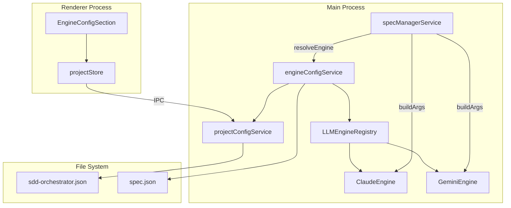
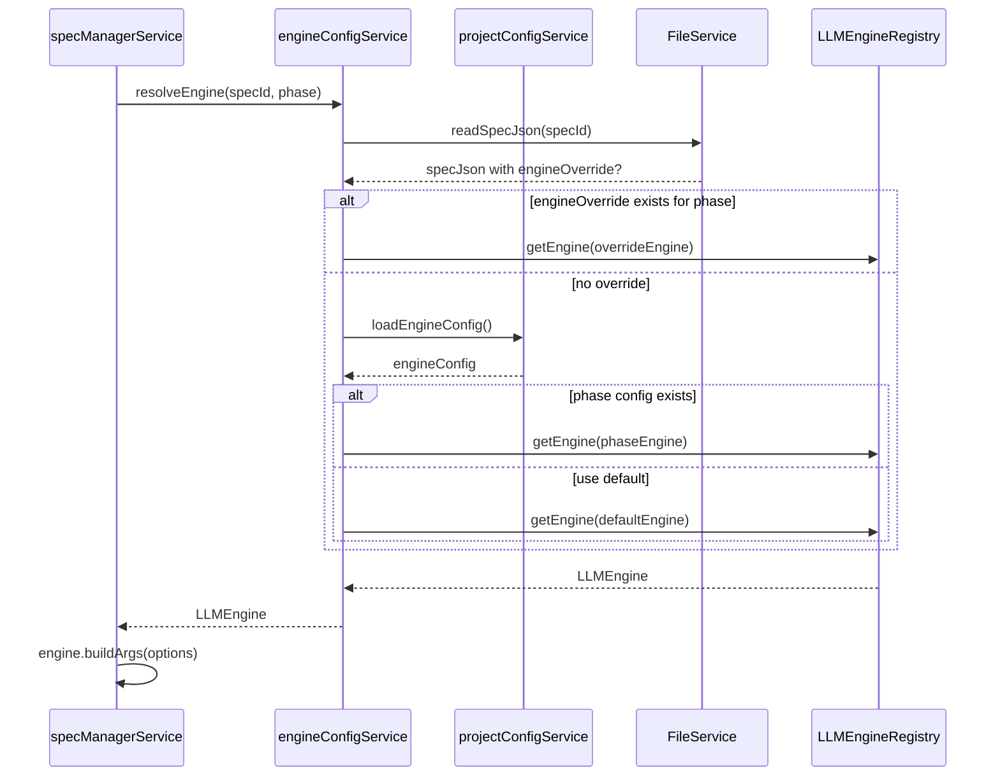
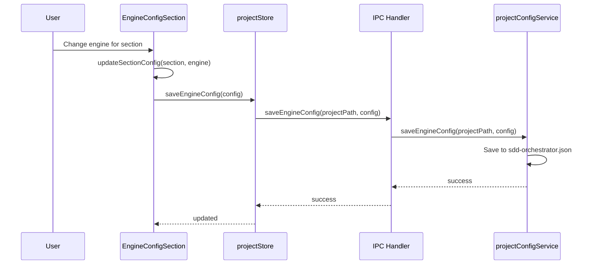
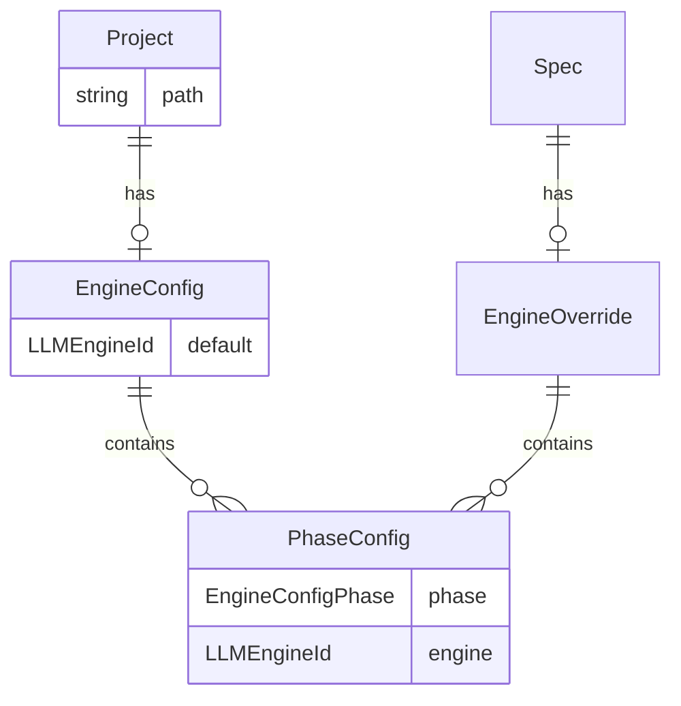

# Design: LLM Engine Abstraction

## Overview

**Purpose**: LLM Engineレジストリと抽象化レイヤーを提供し、Claude CLI以外のLLM CLI（Gemini CLI等）を統一的なインターフェースで利用可能にする。

**Users**: SDD Orchestratorを使用する開発者が、プロジェクト単位または Spec 単位で異なる LLM エンジンを選択できるようになる。

**Impact**: 現在ハードコードされている Claude CLI への依存を抽象化し、新しい LLM エンジンの追加を容易にする。既存の `reviewEngineRegistry` パターンを参考にしつつ、SDD ワークフローのフェーズ実行に特化した設計を行う。

### Goals

- Claude CLI と Gemini CLI の両方をサポートする統一的なエンジンインターフェースを提供
- プロジェクト設定（`.kiro/sdd-orchestrator.json`）でデフォルトエンジンを設定可能に
- `spec.json` の `engineOverride` フィールドで Spec 単位のオーバーライドをサポート
- 3セクション（生成/検査/実装）のUI でエンジン設定を変更可能に
- 既存のワークフローとの後方互換性を維持

### Non-Goals

- Codex CLI のサポート（将来の拡張として検討）
- Phase 単位のUI設定（内部データは Phase 単位だが、UI は 3 セクションのみ）
- `allowedTools` / `disallowedTools` のUI設定
- `debatex` 等の非 LLM ツールのこの抽象化への統合（`reviewEngineRegistry` で管理）
- Remote UI 対応（本機能は Desktop UI のみ）

## Architecture

### Existing Architecture Analysis

#### 現在のパターンと制約

- **specManagerService.ts**: SDD ワークフローのフェーズ実行を管理。`buildClaudeArgs()` 関数で Claude CLI 専用の引数を構築
- **reviewEngineRegistry.ts**: Document Review エンジン（claude-code, gemini-cli, debatex）の登録・管理。既存の抽象化パターン
- **layoutConfigService.ts（projectConfigService）**: `.kiro/sdd-orchestrator.json` の読み書き。version 3 スキーマで `settings` セクションを管理
- **agentProcess.ts**: `getClaudeCommand()` で Claude CLI コマンドをハードコード

#### 統合ポイント

- `specManagerService.execute()`: 各フェーズでコマンドとargsを構築し`startAgent()`を呼び出す
- `buildClaudeArgs()`: Claude CLI 専用の引数構築関数
- `projectConfigService`: プロジェクト設定の永続化

### Architecture Pattern & Boundary Map



**Architecture Integration**:

- **Selected pattern**: Registry + Strategy パターン。既存の `reviewEngineRegistry` と同様のパターンを採用
- **Domain/feature boundaries**: LLM Engine 抽象化は `shared/registry/llmEngineRegistry.ts` に配置。Document Review 用の `reviewEngineRegistry` とは別レイヤーとして分離
- **Existing patterns preserved**: `projectConfigService` の設定管理パターン、`specManagerService` のフェーズ実行パターン
- **New components rationale**:
  - `LLMEngineRegistry`: エンジン登録・取得の SSOT
  - `engineConfigService`: 設定解決ロジック（プロジェクト + Spec オーバーライド）
  - `EngineConfigSection`: 設定 UI コンポーネント
- **Steering compliance**: DRY（既存パターンの再利用）、KISS（シンプルな Registry + Strategy）、関心の分離（レイヤー分離）

### Technology Stack

| Layer | Choice / Version | Role in Feature | Notes |
|-------|------------------|-----------------|-------|
| Registry | TypeScript | エンジン定義・インターフェース | `reviewEngineRegistry` と同様のパターン |
| Service | TypeScript | 設定解決・引数構築 | Main process |
| UI | React + Tailwind | 設定 UI | 既存の `ProjectSettingsDialog` パターンを拡張 |
| Storage | JSON | 設定永続化 | `.kiro/sdd-orchestrator.json` の `settings.engineConfig` |

## System Flows

### Engine Resolution Flow



**Key Decisions**:

- 優先順位: `spec.json.engineOverride` > `sdd-orchestrator.json.settings.engineConfig.{phase}` > `default` > `claude`
- `engineConfigService` が解決ロジックを担当し、`specManagerService` はエンジンを使用するのみ

### Settings UI Flow



## Requirements Traceability

| Criterion ID | Summary | Components | Implementation Approach |
|--------------|---------|------------|------------------------|
| 1.1 | LLMEngine インターフェース定義 | `LLMEngineRegistry` | 新規実装 |
| 1.2 | LLMEngineRegistry 実装 | `LLMEngineRegistry` | 新規実装（`reviewEngineRegistry` パターン流用） |
| 1.3 | エンジン追加時のバリデーション | `LLMEngineRegistry.register()` | 新規実装 |
| 1.4 | Claude/Gemini エンジン定義 | `LLM_ENGINES` 定数 | 新規実装 |
| 2.1 | BuildArgsOptions 定義 | `BuildArgsOptions` 型 | 新規実装 |
| 2.2 | Claude skipPermissions フラグ | `ClaudeEngine.buildArgs()` | 既存 `buildClaudeArgs()` を移行 |
| 2.3 | Gemini --yolo フラグ | `GeminiEngine.buildArgs()` | 新規実装 |
| 2.4 | output-format stream-json | 両エンジン `buildArgs()` | Claude: 既存移行、Gemini: 新規 |
| 2.5 | 未サポートオプションの無視 | 各エンジン `buildArgs()` | 新規実装 |
| 3.1 | ParsedOutput 構造定義 | `ParsedOutput` 型 | 新規実装 |
| 3.2 | Claude JSONL パース | `ClaudeEngine.parseOutput()` | 既存 `logParserService` を参照 |
| 3.3 | Gemini stream-json パース | `GeminiEngine.parseOutput()` | 新規実装（Claude と同一フォーマットを想定） |
| 3.4 | 正規化レイヤー | `LLMEngineRegistry.normalizeOutput()` | 新規実装（必要に応じて） |
| 3.5 | パースエラーハンドリング | 各エンジン `parseOutput()` | 新規実装 |
| 4.1 | engineConfig 保存場所 | `projectConfigService` | 既存拡張 |
| 4.2 | engineConfig 構造 | `EngineConfigSchema` | 新規実装 |
| 4.3 | フェーズ未設定時のフォールバック | `engineConfigService.resolveEngine()` | 新規実装 |
| 4.4 | デフォルト claude | `engineConfigService` | 新規実装 |
| 5.1 | spec.json engineOverride 定義 | `SpecJson` 型拡張 | 既存型拡張 |
| 5.2 | engineOverride 優先 | `engineConfigService.resolveEngine()` | 新規実装 |
| 5.3 | オーバーライド未設定時のフォールバック | `engineConfigService.resolveEngine()` | 新規実装 |
| 6.1 | 設定パネル UI | `EngineConfigSection` | 新規実装 |
| 6.2 | 3セクション表示 | `EngineConfigSection` | 新規実装 |
| 6.3 | セクション別エンジン選択 | `EngineConfigSection` | 新規実装 |
| 6.4 | デフォルトドロップダウン | `EngineConfigSection` | 新規実装 |
| 6.5 | デフォルトを使用オプション | `EngineConfigSection` | 新規実装 |
| 6.6 | セクション変更時の自動更新 | `EngineConfigSection` | 新規実装 |
| 7.1 | startAgent エンジン解決 | `specManagerService.startAgent()` | 既存修正 |
| 7.2 | LLMEngineRegistry 使用 | `specManagerService` | 既存修正 |
| 7.3 | 後方互換性 | `specManagerService` | 既存動作維持 |
| 7.4 | エンジン使用ログ | `specManagerService.startAgent()` | 既存拡張 |

### Coverage Validation Checklist

- [x] Every criterion ID from requirements.md appears in the table above
- [x] Each criterion has specific component names (not generic references)
- [x] Implementation approach distinguishes "reuse existing" vs "new implementation"
- [x] User-facing criteria specify concrete UI components

## Components and Interfaces

| Component | Domain/Layer | Intent | Req Coverage | Key Dependencies | Contracts |
|-----------|--------------|--------|--------------|------------------|-----------|
| LLMEngineRegistry | Shared/Registry | エンジン登録・取得の SSOT | 1.1-1.4 | - | Service |
| ClaudeEngine | Shared/Registry | Claude CLI エンジン定義 | 2.1-2.5, 3.1-3.2 | LLMEngineRegistry (P0) | - |
| GeminiEngine | Shared/Registry | Gemini CLI エンジン定義 | 2.1-2.5, 3.3-3.5 | LLMEngineRegistry (P0) | - |
| engineConfigService | Main/Services | エンジン設定解決 | 4.1-4.4, 5.1-5.3, 7.1-7.4 | projectConfigService (P0), FileService (P0) | Service |
| EngineConfigSection | Renderer/Components | エンジン設定 UI | 6.1-6.6 | projectStore (P0) | State |
| EngineConfigSchema | Shared/Types | 設定スキーマ | 4.2, 5.1 | Zod (P0) | - |

### Shared / Registry Layer

#### LLMEngineRegistry

| Field | Detail |
|-------|--------|
| Intent | LLM CLI エンジンの登録・取得を管理する SSOT |
| Requirements | 1.1, 1.2, 1.3, 1.4 |

**Responsibilities & Constraints**

- 登録済みエンジンの管理（Map ベース）
- エンジン ID によるエンジン取得
- 未登録エンジンへのフォールバック（`claude`）

**Dependencies**

- External: なし

**Contracts**: Service [x]

##### Service Interface

```typescript
/**
 * LLM Engine ID
 * Requirement: 1.4
 */
export type LLMEngineId = 'claude' | 'gemini';

/**
 * Build arguments options
 * Requirement: 2.1
 */
export interface BuildArgsOptions {
  /** 実行するプロンプト文字列 */
  prompt: string;
  /** 自動承認モードの有効/無効 */
  skipPermissions?: boolean;
  /** 出力形式（デフォルト: 'stream-json'） */
  outputFormat?: 'stream-json' | 'json';
  /** 許可するツールのリスト（オプション） */
  allowedTools?: string[];
  /** 禁止するツールのリスト（オプション） */
  disallowedTools?: string[];
}

/**
 * Parsed output structure
 * Requirement: 3.1
 */
export interface ParsedOutput {
  /** 結果タイプ */
  type: 'success' | 'error' | 'max_turns' | 'interrupted';
  /** セッション ID */
  sessionId?: string;
  /** 統計情報 */
  stats?: {
    numTurns: number;
    durationMs: number;
    totalCostUsd: number;
  };
  /** エラーメッセージ（type が error の場合） */
  errorMessage?: string;
}

/**
 * LLM Engine interface
 * Requirement: 1.1
 */
export interface LLMEngine {
  /** エンジン識別子 */
  readonly id: LLMEngineId;
  /** 表示名 */
  readonly label: string;
  /** 実行コマンド */
  readonly command: string;
  /** コマンドライン引数を構築する関数 */
  buildArgs(options: BuildArgsOptions): string[];
  /** 出力をパースする関数 */
  parseOutput(data: string): ParsedOutput;
}

/**
 * LLM Engine Registry
 * Requirement: 1.2
 */
export const LLM_ENGINES: Record<LLMEngineId, LLMEngine>;

/**
 * Get engine by ID with fallback to claude
 * Requirement: 1.2
 */
export function getLLMEngine(id?: LLMEngineId): LLMEngine;

/**
 * Get list of available engines
 */
export function getAvailableLLMEngines(): Array<{
  id: LLMEngineId;
  label: string;
}>;

/**
 * Default engine ID
 */
export const DEFAULT_LLM_ENGINE: LLMEngineId = 'claude';
```

- Preconditions: なし
- Postconditions: 常に有効な `LLMEngine` を返す
- Invariants: 未登録 ID は `claude` にフォールバック

**Implementation Notes**

- Integration: `reviewEngineRegistry` と同様のパターンで実装
- Validation: 型システムによる静的検証
- Risks: Gemini CLI の `stream-json` 出力形式が Claude と異なる可能性（Open Question）

#### ClaudeEngine / GeminiEngine

| Field | Detail |
|-------|--------|
| Intent | 各 LLM CLI のエンジン定義 |
| Requirements | 2.1-2.5, 3.1-3.5 |

**Implementation Notes**

- Claude: 既存の `buildClaudeArgs()` ロジックを移植
- Gemini: `--yolo`, `--output-format stream-json` を追加

```typescript
// Claude Engine buildArgs 例
const CLAUDE_ENGINE: LLMEngine = {
  id: 'claude',
  label: 'Claude',
  command: 'claude',
  buildArgs: (options) => {
    const args = ['-p', '--verbose', '--output-format', 'stream-json'];
    if (options.skipPermissions) {
      args.push('--dangerously-skip-permissions');
    }
    args.push('--disallowedTools=AskUserQuestion');
    if (options.allowedTools?.length) {
      args.push(`--allowedTools=${options.allowedTools.join(',')}`);
    }
    args.push(options.prompt);
    return args;
  },
  parseOutput: (data) => {
    // 既存の logParserService パターンを使用
  },
};

// Gemini Engine buildArgs 例
const GEMINI_ENGINE: LLMEngine = {
  id: 'gemini',
  label: 'Gemini',
  command: 'gemini',
  buildArgs: (options) => {
    const args = ['-p', '--output-format', 'stream-json'];
    if (options.skipPermissions) {
      args.push('--yolo');
    }
    args.push(options.prompt);
    return args;
  },
  parseOutput: (data) => {
    // Claude と同一フォーマットを想定
  },
};
```

### Main / Services Layer

#### engineConfigService

| Field | Detail |
|-------|--------|
| Intent | プロジェクト設定と spec.json からエンジン設定を解決 |
| Requirements | 4.1-4.4, 5.1-5.3, 7.1-7.4 |

**Responsibilities & Constraints**

- エンジン解決の優先順位ロジック実装
- `sdd-orchestrator.json` と `spec.json` の読み込み

**Dependencies**

- Inbound: specManagerService — エンジン解決リクエスト (P0)
- Outbound: projectConfigService — プロジェクト設定読み込み (P0)
- Outbound: FileService — spec.json 読み込み (P0)

**Contracts**: Service [x]

##### Service Interface

```typescript
/**
 * Workflow phase for engine configuration
 */
export type EngineConfigPhase =
  | 'plan'
  | 'requirements'
  | 'design'
  | 'tasks'
  | 'document-review'
  | 'document-review-reply'
  | 'inspection'
  | 'impl';

/**
 * Engine configuration stored in sdd-orchestrator.json
 * Requirement: 4.2
 */
export interface EngineConfig {
  default?: LLMEngineId;
  plan?: LLMEngineId;
  requirements?: LLMEngineId;
  design?: LLMEngineId;
  tasks?: LLMEngineId;
  'document-review'?: LLMEngineId;
  'document-review-reply'?: LLMEngineId;
  inspection?: LLMEngineId;
  impl?: LLMEngineId;
}

/**
 * Engine configuration service
 */
export const engineConfigService = {
  /**
   * Resolve engine for a specific phase
   * Priority: spec.json.engineOverride > engineConfig.{phase} > default > 'claude'
   * Requirement: 7.1
   */
  async resolveEngine(
    projectPath: string,
    specId: string,
    phase: EngineConfigPhase
  ): Promise<LLMEngine>;

  /**
   * Load engine configuration from project
   * Requirement: 4.1
   */
  async loadEngineConfig(projectPath: string): Promise<EngineConfig>;

  /**
   * Save engine configuration to project
   * Requirement: 4.1
   */
  async saveEngineConfig(projectPath: string, config: EngineConfig): Promise<void>;
};
```

- Preconditions: `projectPath` は有効なプロジェクトパス
- Postconditions: 常に有効な `LLMEngine` を返す
- Invariants: 設定不整合時は `claude` にフォールバック

**Implementation Notes**

- Integration: `projectConfigService.loadProjectConfigV3()` を使用して設定を読み込み
- Validation: Zod スキーマでランタイム検証
- Risks: spec.json 読み込みエラー時のフォールバック動作

### Renderer / Components Layer

#### EngineConfigSection

| Field | Detail |
|-------|--------|
| Intent | エンジン設定 UI（3 セクション表示） |
| Requirements | 6.1-6.6 |

**Responsibilities & Constraints**

- 3 セクション（生成/検査/実装）の表示
- セクション単位のエンジン選択
- デフォルトエンジン選択

**Dependencies**

- Inbound: ProjectSettingsDialog — 親コンポーネント (P0)
- Outbound: projectStore — 設定保存 (P0)

**Contracts**: State [x]

##### State Management

```typescript
/**
 * Section configuration for UI
 * Requirement: 6.2
 */
export type EngineSection = 'generation' | 'inspection' | 'implementation';

/**
 * Section to phases mapping
 */
export const SECTION_PHASES: Record<EngineSection, EngineConfigPhase[]> = {
  generation: ['plan', 'requirements', 'design', 'tasks'],
  inspection: ['document-review', 'document-review-reply', 'inspection'],
  implementation: ['impl'],
};

/**
 * UI state for engine configuration
 */
interface EngineConfigUIState {
  default: LLMEngineId;
  generation: LLMEngineId | 'default';
  inspection: LLMEngineId | 'default';
  implementation: LLMEngineId | 'default';
}
```

**Implementation Notes**

- Integration: `ProjectSettingsDialog` 内に新セクションとして追加
- Validation: セクション変更時に対応するすべてのフェーズを更新
- Risks: UI と内部データの変換ロジックの複雑さ

## Data Models

### Domain Model



**Business Rules & Invariants**

- `EngineConfig.default` が未設定の場合は `claude` を使用
- `EngineOverride` は `spec.json` 内に格納
- `EngineConfig` は `sdd-orchestrator.json` 内に格納

### Logical Data Model

#### sdd-orchestrator.json 構造（version 3 拡張）

```typescript
/**
 * Engine configuration schema extension
 * Requirement: 4.2
 */
export const EngineConfigSchema = z.object({
  default: z.enum(['claude', 'gemini']).optional(),
  plan: z.enum(['claude', 'gemini']).optional(),
  requirements: z.enum(['claude', 'gemini']).optional(),
  design: z.enum(['claude', 'gemini']).optional(),
  tasks: z.enum(['claude', 'gemini']).optional(),
  'document-review': z.enum(['claude', 'gemini']).optional(),
  'document-review-reply': z.enum(['claude', 'gemini']).optional(),
  inspection: z.enum(['claude', 'gemini']).optional(),
  impl: z.enum(['claude', 'gemini']).optional(),
});

/**
 * Extended ProjectConfigV3 schema
 */
export const ProjectConfigSchemaV3Extended = ProjectConfigSchemaV3.extend({
  settings: ProjectSettingsSchema.extend({
    engineConfig: EngineConfigSchema.optional(),
  }).optional(),
});
```

**JSON 例**:

```json
{
  "version": 3,
  "settings": {
    "skipPermissions": true,
    "engineConfig": {
      "default": "claude",
      "plan": "claude",
      "requirements": "claude",
      "design": "claude",
      "tasks": "claude",
      "document-review": "claude",
      "document-review-reply": "claude",
      "inspection": "claude",
      "impl": "claude"
    }
  }
}
```

#### spec.json 拡張

```typescript
/**
 * Engine override in spec.json
 * Requirement: 5.1
 */
export interface SpecJsonEngineOverride {
  plan?: LLMEngineId;
  requirements?: LLMEngineId;
  design?: LLMEngineId;
  tasks?: LLMEngineId;
  'document-review'?: LLMEngineId;
  'document-review-reply'?: LLMEngineId;
  inspection?: LLMEngineId;
  impl?: LLMEngineId;
}
```

**JSON 例**:

```json
{
  "feature_name": "my-feature",
  "engineOverride": {
    "plan": "gemini",
    "requirements": "gemini",
    "design": "gemini",
    "tasks": "gemini"
  }
}
```

## Error Handling

### Error Strategy

| Error Type | Strategy | User Feedback |
|------------|----------|---------------|
| 設定読み込みエラー | フォールバック to claude | ログ出力のみ（サイレント） |
| 不明なエンジン ID | フォールバック to claude | 警告ログ |
| Gemini CLI 未インストール | エージェント起動失敗 | エラーダイアログ |
| 出力パースエラー | graceful degradation | ログ出力、UI には部分結果 |

### Monitoring

- `[engineConfigService]` プレフィックスでログ出力
- エンジン解決結果を `startAgent` ログに含める（Requirement 7.4）

## Testing Strategy

### Unit Tests

- `llmEngineRegistry.test.ts`: エンジン登録・取得・buildArgs・parseOutput
- `engineConfigService.test.ts`: 優先順位解決ロジック、フォールバック
- `EngineConfigSection.test.tsx`: UI 状態管理、セクション↔フェーズ変換

### Integration Tests

- `specManagerService.integration.test.ts`: execute() でのエンジン解決統合
- `projectConfigService.integration.test.ts`: engineConfig 永続化

### E2E Tests（将来）

- 設定変更→エージェント実行フローの検証

## Design Decisions

### DD-001: reviewEngineRegistry との分離

| Field | Detail |
|-------|--------|
| Status | Accepted |
| Context | 既存の `reviewEngineRegistry` は Document Review 専用で `debatex` 等の非 LLM ツールも含む。LLM Engine 抽象化をどこに配置するか |
| Decision | 新規 `llmEngineRegistry` を作成し、`reviewEngineRegistry` とは別レイヤーとして管理 |
| Rationale | Document Review は非 LLM ツール（debatex）も含むため、LLM 専用の抽象化とは責務が異なる。関心の分離を維持 |
| Alternatives Considered | 1. `reviewEngineRegistry` を拡張 → 責務混在、2. 統合レジストリ → 複雑化 |
| Consequences | コード重複の可能性があるが、責務が明確。将来的に `reviewEngineRegistry` が LLM Engine を使用する形に移行可能 |

### DD-002: UI は 3 セクション、内部データは Phase 単位

| Field | Detail |
|-------|--------|
| Status | Accepted |
| Context | ユーザーに見せる設定粒度と、内部保存の粒度をどうするか |
| Decision | UI では 3 セクション（生成/検査/実装）で表示し、内部データは全 Phase 個別で保存 |
| Rationale | UI のシンプルさを保ちつつ、将来の Phase 単位設定への拡張性を確保。Requirements での Decision を踏襲 |
| Alternatives Considered | 1. UI も Phase 単位 → 複雑すぎる、2. 内部もセクション単位 → 拡張性低下 |
| Consequences | UI ↔ 内部データの変換ロジックが必要だが、将来の拡張に対応可能 |

### DD-003: skipPermissions のエンジン別自動変換

| Field | Detail |
|-------|--------|
| Status | Accepted |
| Context | `skipPermissions` 設定をエンジン別にどう扱うか |
| Decision | グローバル設定とし、各エンジンの対応オプションに自動変換（Claude: `--dangerously-skip-permissions`, Gemini: `--yolo`） |
| Rationale | ユーザーは「自動承認したい」という意図を持っており、その実現方法はエンジン依存の実装詳細。Requirements での Decision を踏襲 |
| Alternatives Considered | エンジン別に個別設定 → ユーザー体験が複雑化 |
| Consequences | 新エンジン追加時に対応フラグの調査が必要 |

### DD-004: Gemini CLI stream-json 出力形式の互換性

| Field | Detail |
|-------|--------|
| Status | Accepted（要実機検証） |
| Context | Gemini CLI の `--output-format stream-json` が Claude CLI と同一形式か |
| Decision | Claude CLI と同一フォーマット（JSONL）を想定して設計。差異が判明した場合は正規化レイヤーを追加 |
| Rationale | [公式ドキュメント](https://geminicli.com/docs/cli/headless/)によると JSONL 形式。実機検証で確認後、必要に応じて対応 |
| Alternatives Considered | 1. 事前に正規化レイヤー実装 → YAGNI 違反、2. 形式調査完了まで待機 → 開発遅延 |
| Consequences | 実機検証で差異が判明した場合、`parseOutput()` の修正が必要 |

## Integration & Deprecation Strategy（結合・廃止戦略）

### 既存ファイルの修正（Wiring Points）

| File | Modification |
|------|-------------|
| `electron-sdd-manager/src/main/services/specManagerService.ts` | `execute()` で `engineConfigService.resolveEngine()` を呼び出し、取得したエンジンの `buildArgs()` を使用 |
| `electron-sdd-manager/src/main/services/layoutConfigService.ts` | `ProjectConfigSchemaV3` に `settings.engineConfig` を追加 |
| `electron-sdd-manager/src/preload/index.ts` | `loadEngineConfig`, `saveEngineConfig` IPC ハンドラを追加 |
| `electron-sdd-manager/src/main/ipc/handlers.ts` | エンジン設定関連の IPC ハンドラを追加 |
| `electron-sdd-manager/src/renderer/components/ProjectSettingsDialog.tsx` | `EngineConfigSection` を追加 |
| `electron-sdd-manager/src/renderer/types/electron.d.ts` | IPC 型定義を追加 |

### 新規ファイル

| File | Purpose |
|------|---------|
| `electron-sdd-manager/src/shared/registry/llmEngineRegistry.ts` | LLM Engine レジストリ |
| `electron-sdd-manager/src/shared/registry/llmEngineRegistry.test.ts` | レジストリテスト |
| `electron-sdd-manager/src/main/services/engineConfigService.ts` | エンジン設定解決サービス |
| `electron-sdd-manager/src/main/services/engineConfigService.test.ts` | サービステスト |
| `electron-sdd-manager/src/renderer/components/EngineConfigSection.tsx` | 設定 UI コンポーネント |
| `electron-sdd-manager/src/renderer/components/EngineConfigSection.test.tsx` | UI テスト |

### 廃止予定

なし。既存の `buildClaudeArgs()` は互換性のため残し、`CLAUDE_ENGINE.buildArgs()` から呼び出す形式に移行。

## Integration Test Strategy

### Components

- `specManagerService`: エージェント起動・管理
- `engineConfigService`: エンジン設定解決
- `projectConfigService`: プロジェクト設定読み書き
- `FileService`: spec.json 読み書き
- `LLMEngineRegistry`: エンジン取得

### Data Flow

```
specManagerService.execute(phase)
  → engineConfigService.resolveEngine(specId, phase)
    → FileService.readSpecJson() // spec.json の engineOverride 確認
    → projectConfigService.loadEngineConfig() // sdd-orchestrator.json の設定
    → LLMEngineRegistry.getLLMEngine(engineId)
  → engine.buildArgs(options)
  → startAgent(command, args)
```

### Mock Boundaries

| Layer | Mock Strategy |
|-------|---------------|
| FileService | Mock（spec.json 読み込み） |
| projectConfigService | Mock（sdd-orchestrator.json 読み込み） |
| agentProcess | Mock（実際のプロセス起動を防止） |
| LLMEngineRegistry | Real（レジストリ自体は軽量） |
| engineConfigService | Real（統合対象） |

### Verification Points

1. `engineConfigService.resolveEngine()` が正しい優先順位で解決
2. `specManagerService.execute()` が解決されたエンジンの `buildArgs()` を使用
3. ログに使用エンジン情報が出力（Requirement 7.4）

### Robustness Strategy

- `waitFor` パターンで非同期設定読み込みを待機
- ファイルシステム操作は tmpdir でテスト isolation

### Prerequisites

- `vi.mock()` で FileService, projectConfigService をモック
- テスト用の spec.json, sdd-orchestrator.json テンプレート

## Supporting References

### Gemini CLI Documentation

- [Headless mode | Gemini CLI](https://geminicli.com/docs/cli/headless/) - `--output-format stream-json` の仕様
- [Add stream-json output format - Issue #8203](https://github.com/google-gemini/gemini-cli/issues/8203) - 機能追加の経緯

### 既存パターン参照

- `electron-sdd-manager/src/shared/registry/reviewEngineRegistry.ts` - エンジンレジストリパターン
- `electron-sdd-manager/src/main/services/layoutConfigService.ts` - プロジェクト設定永続化パターン
- `electron-sdd-manager/src/renderer/components/ProjectSettingsDialog.tsx` - 設定 UI パターン
