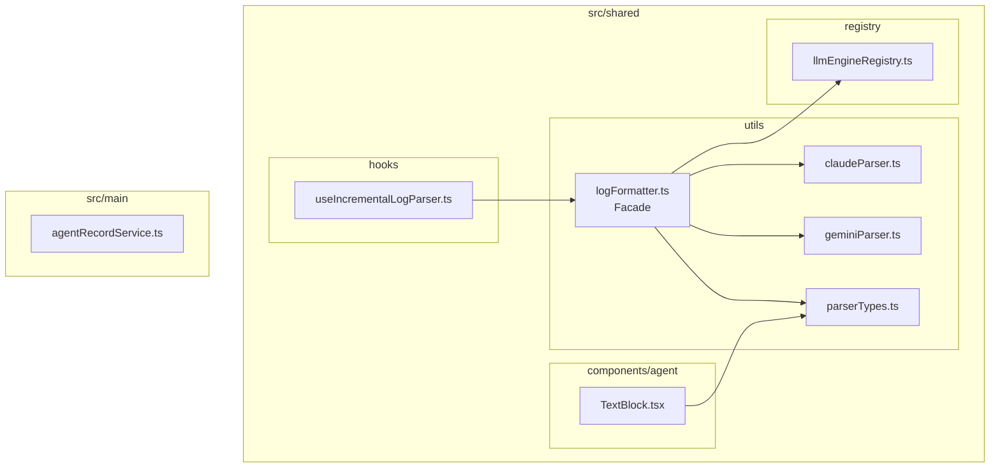
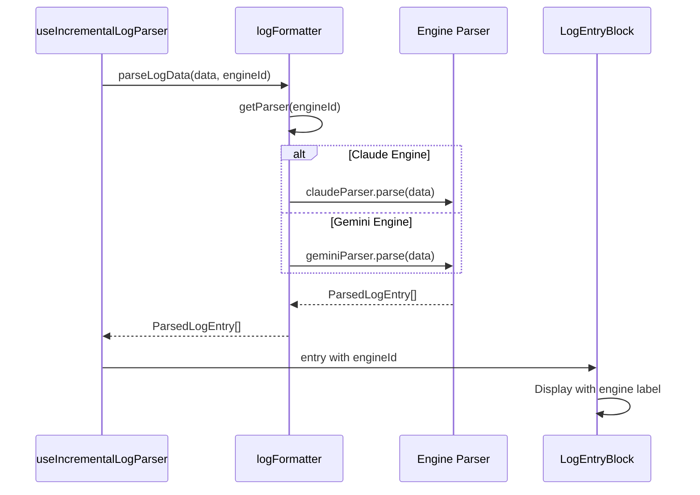
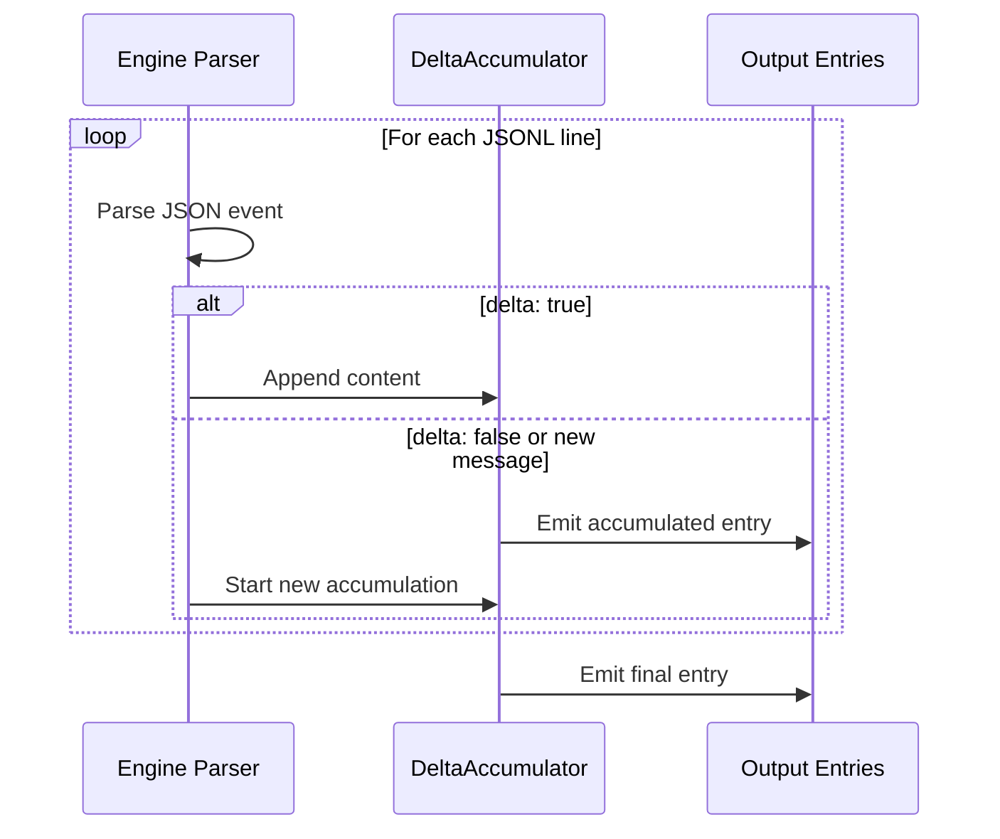

# Design: LLM Stream Log Parser

## Overview

**Purpose**: 本機能は、複数のLLMエンジン（Claude CLI / Gemini CLI）からのストリームログ出力を統一フォーマット（`ParsedLogEntry`）に変換するパーサーを提供する。

**Users**: SDD Orchestratorユーザーが、どのLLMエンジンを使用していても一貫したログ表示体験を得られるようにする。

**Impact**: 現在のClaude CLI専用の `logFormatter.ts` をエンジン抽象化レイヤーでラップし、エンジン別パーサー戦略を導入する。

### Goals

- Claude CLI と Gemini CLI のストリームログを統一フォーマットで表示
- エンジン固有のログ構造差異を吸収（ネスト構造 vs フラット構造）
- ストリーミング断片（delta）の統合による可読性向上
- UI表示名の動的化（エンジン名表示）
- 将来のエンジン追加に対応可能な拡張ポイント

### Non-Goals

- Claude/Gemini以外のLLMエンジン対応（YAGNIにより除外）
- ログ永続化形式の変更
- リアルタイムストリーミング最適化（パフォーマンス改善）
- 既存ログファイル（engineId未記録）のマイグレーション

## Architecture

### Existing Architecture Analysis

現在のログパース処理:
- `src/shared/utils/logFormatter.ts`: Claude CLI専用パーサー、`parseLogData()`関数
- `src/shared/hooks/useIncrementalLogParser.ts`: インクリメンタルパース処理、`parseLogData()`を呼び出し
- `src/shared/registry/llmEngineRegistry.ts`: LLMエンジン抽象化（コマンド引数生成用）、`LLMEngineId`型定義
- `src/main/services/agentRecordService.ts`: AgentRecord管理（現状`engineId`フィールドなし）

**課題**:
- `parseLogData()`がClaude CLI出力構造をハードコード
- Gemini CLIのフラット形式（`delta`フラグ、`tool_name`等）を正しくパースできない
- TextBlockコンポーネントで"Claude"がハードコード

### Architecture Pattern & Boundary Map



**Architecture Integration**:
- **Selected pattern**: Strategy Pattern - エンジン別パーサーを戦略として分離
- **Domain boundaries**: パース処理は`shared/utils/`に集約、UI表示は`shared/components/`
- **Existing patterns preserved**: `LLMEngineId`型を再利用、`ParsedLogEntry`型を拡張
- **New components rationale**:
  - `claudeParser.ts`: 既存ロジック分離
  - `geminiParser.ts`: Gemini CLI対応
  - `parserTypes.ts`: 型定義共通化
- **Steering compliance**: DRY（共通型）、KISS（シンプルなファサード）、関心の分離

### Technology Stack

| Layer | Choice / Version | Role in Feature | Notes |
|-------|------------------|-----------------|-------|
| Frontend | React 19, TypeScript 5.8+ | UI表示（TextBlock） | 既存スタック継続 |
| Shared Utils | TypeScript | パーサー実装 | `shared/utils/`配置 |
| Data / Types | TypeScript | 型定義 | `ParsedLogEntry`拡張 |
| State | Zustand | AgentRecord管理 | `engineId`追加 |

## System Flows

### ログパース処理フロー



### delta統合フロー



## Requirements Traceability

| Criterion ID | Summary | Components | Implementation Approach |
|--------------|---------|------------|------------------------|
| 1.1 | Claude CLIパーサー | claudeParser.ts | 既存ロジック分離 |
| 1.2 | Gemini CLIパーサー | geminiParser.ts | 新規実装 |
| 1.3 | 拡張ポイント | LogStreamParser interface | 新規実装 |
| 1.4 | イベントタイプ対応 | claudeParser, geminiParser | 各パーサーで対応 |
| 2.1 | engineId記録 | AgentRecord, agentRecordService | 型拡張、書き込み時追加 |
| 2.2 | engineIdによるパーサー選択 | logFormatter.parseLogData() | ファサードで分岐 |
| 2.3 | engineId未指定時のデフォルト | logFormatter | Claude パーサーにフォールバック |
| 3.1 | delta統合 | DeltaAccumulator | 各パーサー内で実装 |
| 3.2 | Claude/Gemini両対応 | claudeParser, geminiParser | 各パーサーで対応 |
| 3.3 | 実装困難時の段階的対応 | 設計上考慮 | Phase分割可能 |
| 4.1 | エンジンラベル表示 | TextBlock.tsx | engineId参照で表示名取得 |
| 4.2 | ラベルマッピング | LLM_ENGINES | 既存レジストリ活用 |
| 4.3 | ParsedLogEntry.engineId | parserTypes.ts | オプショナルフィールド追加 |
| 5.1 | Claudeネスト構造対応 | claudeParser.ts | 既存ロジック維持 |
| 5.2 | Geminiフラット構造対応 | geminiParser.ts | 新規実装 |
| 5.3 | Geminiフィールドマッピング | geminiParser.ts | tool_name->name等 |
| 5.4 | Gemini initイベント対応 | geminiParser.ts | type:"init"処理 |
| 5.5 | Gemini stats抽出 | geminiParser.ts | resultイベント処理 |

### Coverage Validation Checklist

- [x] Every criterion ID from requirements.md appears in the table above
- [x] Each criterion has specific component names (not generic references)
- [x] Implementation approach distinguishes "reuse existing" vs "new implementation"
- [x] User-facing criteria specify concrete UI components

## Components and Interfaces

| Component | Domain/Layer | Intent | Req Coverage | Key Dependencies | Contracts |
|-----------|--------------|--------|--------------|------------------|-----------|
| parserTypes.ts | Shared/Utils | 型定義 | 1.3, 4.3 | - | Types |
| claudeParser.ts | Shared/Utils | Claude CLI パース | 1.1, 1.4, 3.1, 5.1 | parserTypes | Service |
| geminiParser.ts | Shared/Utils | Gemini CLI パース | 1.2, 1.4, 3.1, 5.2-5.5 | parserTypes | Service |
| logFormatter.ts | Shared/Utils | パーサーファサード | 2.2, 2.3 | claudeParser, geminiParser, llmEngineRegistry | Service |
| useIncrementalLogParser.ts | Shared/Hooks | インクリメンタルパース | 2.2 | logFormatter | Hook |
| AgentRecord | Main/Services | エージェント記録 | 2.1 | - | State |
| TextBlock.tsx | Shared/Components | テキスト表示 | 4.1, 4.2 | llmEngineRegistry | UI |

### Shared / Utils

#### parserTypes.ts

| Field | Detail |
|-------|--------|
| Intent | パーサー共通型定義とインタフェース |
| Requirements | 1.3, 4.3 |

**Responsibilities & Constraints**
- `ParsedLogEntry`型の拡張定義（`engineId`追加）
- `LogStreamParser`インタフェース定義
- `DeltaAccumulator`型定義

**Dependencies**
- Inbound: claudeParser, geminiParser, logFormatter, TextBlock (P0)
- External: LLMEngineId from llmEngineRegistry (P0)

**Contracts**: Service [x]

##### Service Interface

```typescript
import type { LLMEngineId } from '@shared/registry';

/**
 * Extended ParsedLogEntry with engineId support
 * Requirements: 4.3
 */
export interface ParsedLogEntry {
  id: string;
  type: 'system' | 'assistant' | 'tool_use' | 'tool_result' | 'result' | 'text' | 'error' | 'input';
  timestamp?: number;
  /** LLM engine that produced this entry */
  engineId?: LLMEngineId;
  session?: {
    cwd?: string;
    model?: string;
    version?: string;
  };
  tool?: {
    name: string;
    toolUseId?: string;
    input?: Record<string, unknown>;
  };
  toolResult?: {
    toolUseId: string;
    content: string;
    isError: boolean;
  };
  text?: {
    content: string;
    role: 'assistant' | 'user';
  };
  result?: {
    content: string;
    isError: boolean;
    costUsd?: number;
    durationMs?: number;
    numTurns?: number;
    inputTokens?: number;
    outputTokens?: number;
  };
}

/**
 * Log stream parser interface for engine-specific implementations
 * Requirements: 1.3
 */
export interface LogStreamParser {
  /** Parse a single JSONL line */
  parseLine(jsonLine: string): ParsedLogEntry[];
  /** Parse multiple JSONL lines with delta accumulation */
  parseData(data: string): ParsedLogEntry[];
}

/**
 * Delta accumulator for streaming fragment consolidation
 * Requirements: 3.1
 */
export interface DeltaAccumulator {
  currentMessageId: string | null;
  accumulatedContent: string;
  role: 'assistant' | 'user';
}
```

#### claudeParser.ts

| Field | Detail |
|-------|--------|
| Intent | Claude CLI stream-json出力のパース処理 |
| Requirements | 1.1, 1.4, 3.1, 5.1 |

**Responsibilities & Constraints**
- Claude CLIのネスト構造を解析
- delta統合（複数assistant messageの結合）
- 既存`parseClaudeEvent`ロジックを分離

**Dependencies**
- Inbound: logFormatter (P0)
- External: parserTypes (P0)

**Contracts**: Service [x]

##### Service Interface

```typescript
import type { LogStreamParser, ParsedLogEntry } from './parserTypes';

/**
 * Claude CLI stream-json parser
 * Handles nested structure: {"type":"assistant","message":{"content":[...]}}
 */
export const claudeParser: LogStreamParser = {
  parseLine(jsonLine: string): ParsedLogEntry[];
  parseData(data: string): ParsedLogEntry[];
};
```

**Implementation Notes**
- 既存`parseClaudeEvent`関数をリファクタリングして移動
- `engineId: 'claude'`を各エントリに付与
- delta統合: Claudeでは`assistant`イベントが複数回送信される場合の結合

#### geminiParser.ts

| Field | Detail |
|-------|--------|
| Intent | Gemini CLI stream-json出力のパース処理 |
| Requirements | 1.2, 1.4, 3.1, 5.2, 5.3, 5.4, 5.5 |

**Responsibilities & Constraints**
- Gemini CLIのフラット構造を解析
- `delta: true`フラグによる断片統合
- フィールド名マッピング（tool_name -> name等）

**Dependencies**
- Inbound: logFormatter (P0)
- External: parserTypes (P0)

**Contracts**: Service [x]

##### Service Interface

```typescript
import type { LogStreamParser, ParsedLogEntry } from './parserTypes';

/**
 * Gemini CLI stream-json parser
 * Handles flat structure: {"type":"message","role":"assistant","content":"...","delta":true}
 */
export const geminiParser: LogStreamParser = {
  parseLine(jsonLine: string): ParsedLogEntry[];
  parseData(data: string): ParsedLogEntry[];
};

/**
 * Gemini event type definitions
 */
interface GeminiEvent {
  type: 'init' | 'message' | 'tool_use' | 'tool_result' | 'error' | 'result';
  timestamp?: string;
  session_id?: string;
  model?: string;
  role?: 'user' | 'assistant';
  content?: string;
  delta?: boolean;
  tool_name?: string;
  tool_id?: string;
  parameters?: Record<string, unknown>;
  output?: string;
  status?: string;
  stats?: {
    total_tokens?: number;
    input_tokens?: number;
    output_tokens?: number;
    duration_ms?: number;
    tool_calls?: number;
  };
}
```

**Implementation Notes**
- フィールドマッピング:
  - `tool_name` -> `tool.name`
  - `tool_id` -> `tool.toolUseId`
  - `parameters` -> `tool.input`
  - `output` -> `toolResult.content`
- `type: 'init'` -> `type: 'system'`にマッピング
- `delta: true`の場合、同一roleの連続メッセージを統合
- `engineId: 'gemini'`を各エントリに付与

#### logFormatter.ts (修正)

| Field | Detail |
|-------|--------|
| Intent | パーサーファサード、エンジン選択と委譲 |
| Requirements | 2.2, 2.3 |

**Responsibilities & Constraints**
- `engineId`に基づくパーサー選択
- 後方互換性維持（engineId未指定時はClaude）
- 既存の`getColorClass`等は変更なし

**Dependencies**
- Inbound: useIncrementalLogParser (P0)
- Outbound: claudeParser, geminiParser (P0)
- External: llmEngineRegistry (P0)

**Contracts**: Service [x]

##### Service Interface

```typescript
import type { LLMEngineId } from '@shared/registry';
import type { ParsedLogEntry } from './parserTypes';

/**
 * Parse raw log data with engine-specific parser
 * Requirements: 2.2, 2.3
 * @param data - Raw JSONL data
 * @param engineId - LLM engine ID (defaults to 'claude' for backward compatibility)
 */
export function parseLogData(data: string, engineId?: LLMEngineId): ParsedLogEntry[];

// Existing exports maintained for backward compatibility
export function getColorClass(
  type: ParsedLogEntry['type'],
  variant: 'text' | 'bg' | 'border' = 'text'
): string;

export type { ParsedLogEntry };
```

### Shared / Hooks

#### useIncrementalLogParser.ts (修正)

| Field | Detail |
|-------|--------|
| Intent | インクリメンタルログパース、engineId伝達 |
| Requirements | 2.2 |

**Responsibilities & Constraints**
- `engineId`パラメータ追加
- `parseLogData`呼び出し時に`engineId`を渡す

**Dependencies**
- Inbound: LogEntryBlock consumers (P0)
- Outbound: logFormatter.parseLogData (P0)

**Contracts**: Hook [x]

##### Hook Interface

```typescript
import type { ParsedLogEntry } from '@shared/utils/logFormatter';
import type { LogEntry } from '@shared/api/types';
import type { LLMEngineId } from '@shared/registry';

/**
 * Incrementally parse logs with engine-specific parser
 * @param logs - Array of log entries
 * @param command - Optional command to show as first entry
 * @param engineId - LLM engine ID for parser selection
 */
export function useIncrementalLogParser(
  logs: LogEntry[],
  command?: string,
  engineId?: LLMEngineId
): ParsedLogEntry[];
```

### Main / Services

#### AgentRecord (型拡張)

| Field | Detail |
|-------|--------|
| Intent | エージェント記録にengineId追加 |
| Requirements | 2.1 |

**Contracts**: State [x]

##### State Management

```typescript
import type { LLMEngineId } from '@shared/registry';

export interface AgentRecord {
  agentId: string;
  specId: string;
  phase: string;
  pid: number;
  sessionId: string;
  status: AgentStatus;
  startedAt: string;
  lastActivityAt: string;
  command: string;
  cwd?: string;
  prompt?: string;
  /** LLM engine used for this agent. Defaults to 'claude' if not specified. */
  engineId?: LLMEngineId;
}
```

**Implementation Notes**
- `engineId`はオプショナル（後方互換性）
- 未指定時は`'claude'`としてデフォルト処理
- Agent起動時に`specManagerService`で設定

### Shared / Components

#### TextBlock.tsx (修正)

| Field | Detail |
|-------|--------|
| Intent | アシスタント表示名の動的化 |
| Requirements | 4.1, 4.2 |

**Responsibilities & Constraints**
- `engineId`に基づくラベル表示
- LLM_ENGINESレジストリからラベル取得
- 未指定時は"Claude"表示（後方互換）

**Dependencies**
- External: llmEngineRegistry.getLLMEngine (P1)

**Contracts**: UI [x]

##### Props Interface

```typescript
import type { LLMEngineId } from '@shared/registry';

export interface TextBlockProps {
  text: {
    content: string;
    role: 'assistant' | 'user';
  };
  /** LLM engine ID for assistant label */
  engineId?: LLMEngineId;
  foldThreshold?: number;
  defaultExpanded?: boolean;
}
```

**Implementation Notes**
- `engineId`からラベル取得: `getLLMEngine(engineId).label`
- assistant表示: "Claude" or "Gemini"

## Data Models

### Domain Model

**Aggregates**:
- `ParsedLogEntry`: ログエントリの統一表現
- `AgentRecord`: エージェント実行記録

**Value Objects**:
- `LLMEngineId`: エンジン識別子 (`'claude' | 'gemini'`)

**Business Rules**:
- engineId未指定時は'claude'にフォールバック
- delta統合は同一role内でのみ適用

### Logical Data Model

**ParsedLogEntry拡張**:
```
ParsedLogEntry
├── id: string (required)
├── type: enum (required)
├── timestamp: number (optional)
├── engineId: LLMEngineId (optional, NEW)
├── session: object (optional)
├── tool: object (optional)
├── toolResult: object (optional)
├── text: object (optional)
└── result: object (optional)
```

**AgentRecord拡張**:
```
AgentRecord
├── ... (existing fields)
└── engineId: LLMEngineId (optional, NEW)
```

## Error Handling

### Error Strategy

- **Parse Failure**: 無効なJSONLはスキップ、テキストとしてフォールバック表示
- **Unknown Event Type**: 未知のイベントタイプは無視（graceful degradation）
- **Missing Fields**: オプショナルフィールドの欠落は許容

### Error Categories and Responses

**User Errors**: なし（ログ表示は受動的）

**System Errors**:
- JSON parse error -> テキストエントリとしてフォールバック（既存動作維持）
- Unknown engine ID -> Claude パーサーにフォールバック

## Testing Strategy

### Unit Tests

| Target | Description | Req |
|--------|-------------|-----|
| claudeParser.parseLine | 各イベントタイプのパース | 1.1, 5.1 |
| claudeParser.parseData | delta統合 | 3.1 |
| geminiParser.parseLine | フラット構造パース | 1.2, 5.2-5.5 |
| geminiParser.parseData | delta統合 | 3.1 |
| logFormatter.parseLogData | エンジン選択とフォールバック | 2.2, 2.3 |

### Integration Tests

| Target | Description | Req |
|--------|-------------|-----|
| useIncrementalLogParser + logFormatter | engineId伝達 | 2.2 |
| TextBlock + engineId | ラベル表示 | 4.1, 4.2 |
| AgentRecord write/read | engineId永続化 | 2.1 |

## Integration Test Strategy

本設計ではクロス境界通信（IPC、イベント、ストア同期）は発生しない。パーサーとUIコンポーネントはすべて`shared/`内で完結する。

**Components**: logFormatter, useIncrementalLogParser, TextBlock
**Data Flow**: Hook -> Facade -> Parser -> UI Component
**Mock Boundaries**: 不要（全てsync関数）
**Verification Points**: `ParsedLogEntry.engineId`の伝達、TextBlockのラベル表示

## Design Decisions

### DD-001: Strategy Patternによるパーサー分離

| Field | Detail |
|-------|--------|
| Status | Accepted |
| Context | Claude CLIとGemini CLIで異なるログ形式を処理する必要がある |
| Decision | 各エンジン用のパーサーを別モジュールとして実装し、ファサードで切り替える |
| Rationale | 関心の分離により各パーサーの独立したテスト・拡張が可能。将来のエンジン追加時も影響範囲が限定される |
| Alternatives Considered | (A) if-else分岐で処理 - 可読性低下、(B) 継承ベース - TypeScriptでは冗長 |
| Consequences | ファイル数増加（3ファイル）、インポートパス変更が必要 |

### DD-002: engineIdのオプショナル設計

| Field | Detail |
|-------|--------|
| Status | Accepted |
| Context | 既存のAgentRecordとParsedLogEntryとの後方互換性が必要 |
| Decision | `engineId`をオプショナルフィールドとして追加、未指定時は`'claude'`にデフォルト |
| Rationale | 既存データの破壊的変更を避け、段階的移行を可能にする。Requirements 2.3も満たす |
| Alternatives Considered | (A) 必須フィールド - マイグレーション必要、(B) 別型定義 - 型の重複 |
| Consequences | 呼び出し側でのnullチェックが必要だが、既存コードへの影響最小 |

### DD-003: delta統合の実装方針

| Field | Detail |
|-------|--------|
| Status | Accepted |
| Context | ストリーミングメッセージ断片（delta: true）を統合する必要がある（Req 3.1） |
| Decision | 各パーサーの`parseData`メソッド内で`DeltaAccumulator`を使用して統合 |
| Rationale | パーサー内で完結することでファサードの複雑化を防ぐ。Gemini/Claude両方で同じパターンを適用可能 |
| Alternatives Considered | (A) ファサードで統合 - エンジン差異の吸収が困難、(B) UI層で統合 - 責務違反 |
| Consequences | 各パーサーでの実装重複（DRY軽度違反）だが、エンジン固有ロジックとして許容 |

### DD-004: parserTypes.tsへの型定義分離

| Field | Detail |
|-------|--------|
| Status | Accepted |
| Context | `ParsedLogEntry`型を複数モジュールから参照する必要がある |
| Decision | 共通型を`parserTypes.ts`に分離し、各パーサーとUIコンポーネントから参照 |
| Rationale | 循環参照の回避、型定義のSSSOT化 |
| Alternatives Considered | (A) logFormatter内に維持 - パーサー間の循環参照リスク |
| Consequences | インポートパス変更が必要だが、既存の再エクスポートで後方互換維持可能 |

## Integration & Deprecation Strategy

### 変更が必要な既存ファイル（Wiring Points）

| File | Modification | Impact |
|------|--------------|--------|
| `src/shared/utils/logFormatter.ts` | parseLogData引数追加、内部ロジック分離 | High |
| `src/shared/hooks/useIncrementalLogParser.ts` | engineId引数追加 | Medium |
| `src/shared/components/agent/TextBlock.tsx` | engineIdプロップ追加、ラベル動的化 | Medium |
| `src/main/services/agentRecordService.ts` | AgentRecord型拡張 | Low |
| `src/main/services/specManagerService.ts` | Agent起動時engineId設定 | Low |
| `src/shared/utils/index.ts` | 新パーサーモジュールのエクスポート追加 | Low |

### 新規作成ファイル

| File | Purpose |
|------|---------|
| `src/shared/utils/parserTypes.ts` | 共通型定義 |
| `src/shared/utils/claudeParser.ts` | Claude CLIパーサー |
| `src/shared/utils/geminiParser.ts` | Gemini CLIパーサー |

### 削除対象ファイル

なし（既存機能は維持、リファクタリングのみ）

### 後方互換性

- `parseLogData(data)`の既存呼び出しは`parseLogData(data, undefined)`として動作
- `ParsedLogEntry`の既存フィールドは変更なし
- `TextBlock`の既存プロップは変更なし

## Supporting References

- [Gemini CLI Headless Mode Documentation](https://geminicli.com/docs/cli/headless/) - stream-jsonフォーマット仕様
- 既存実装: `src/shared/utils/logFormatter.ts` - 現在のClaude CLIパーサー
- 既存実装: `src/shared/registry/llmEngineRegistry.ts` - LLMEngineId型定義
