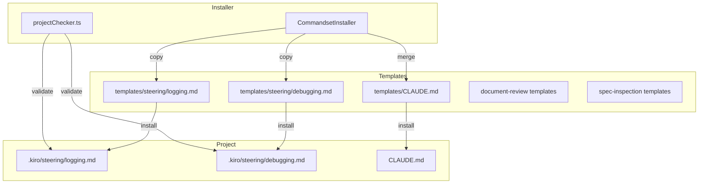

# 設計書: Logging Steering Guideline

## Overview

**目的**: この機能は、document-reviewおよびspec-inspectionにおいて「適切なロギング設計/実装」をチェックできるよう、ロギング観点のsteeringガイドライン（logging.md）を追加する。

**利用者**: AIアシスタント（Claude Code等）、開発者、レビュー担当者が、ロギング設計/実装の観点・ガイドラインを一箇所で参照し、仕様レビューや実装検査時に活用する。

**影響**: 既存のSDD Orchestratorワークフローにロギング観点を統合し、デバッグ効率を向上させる。

### Goals
- ロギングに関する設計/実装の観点・ガイドラインを集約したlogging.mdを作成
- document-reviewとspec-inspectionにLogging観点を追加
- コマンドセットインストーラーへのテンプレート統合
- debugging.mdへのデバッグ原則追加
- プロジェクトバリデーションへのsteering追加

### Non-Goals
- ログローテーション・保持期間の観点定義（プロジェクト固有）
- セキュリティ観点（機密情報のマスキング等）の詳細定義（プロジェクト固有）
- 特定のログライブラリの推奨

## Architecture

### 既存アーキテクチャとの統合

この機能は既存のSDD Orchestratorアーキテクチャに以下のパターンで統合する：

1. **Steeringファイルパターン**: `.kiro/steering/`配下に配置されるプロジェクトメモリ
2. **テンプレート配布パターン**: `electron-sdd-manager/resources/templates/`からコマンドセットインストール時にコピー
3. **コマンドテンプレート更新パターン**: 各プロファイル用のdocument-review/spec-inspectionテンプレートを更新
4. **バリデーションパターン**: `projectChecker.ts`のREQUIRED_SETTINGSに追加



### Technology Stack

| Layer | Choice / Version | Role in Feature | Notes |
|-------|------------------|-----------------|-------|
| Backend | TypeScript / Node.js 20+ | projectChecker.ts更新 | 既存サービス拡張 |
| Templates | Markdown | steering/command テンプレート | 言語/フレームワーク非依存 |

## Requirements Traceability

| Requirement | Summary | Components | Interfaces | Flows |
|-------------|---------|------------|------------|-------|
| 1.1-1.6 | logging.mdファイル作成 | LoggingGuideline | - | - |
| 2.1-2.3 | インストーラー配布用テンプレート | InstallerTemplate, CommandsetInstaller | - | Install Flow |
| 3.1-3.3 | CLAUDE.mdへのlogging.md説明追加 | ClaudeMdTemplate | - | Merge Flow |
| 4.1-4.2 | document-reviewへのLogging観点追加 | DocumentReviewTemplates | - | - |
| 5.1-5.4 | spec-inspectionへのLoggingChecker追加 | SpecInspectionTemplates | LoggingChecker | Inspection Flow |
| 6.1-6.4 | debugging.mdへのデバッグ原則追加 | DebuggingGuideline | - | - |
| 7.1-7.4 | プロジェクトバリデーションへのsteering追加 | ProjectChecker | checkSettings | Validation Flow |

## Components and Interfaces

### コンポーネントサマリー

| Component | Domain/Layer | Intent | Req Coverage | Key Dependencies | Contracts |
|-----------|--------------|--------|--------------|------------------|-----------|
| LoggingGuideline | Steering | ロギング設計/実装ガイドライン定義 | 1.1-1.6 | - | - |
| DebuggingGuideline | Steering | デバッグ原則と手順の分離 | 6.1-6.4 | LoggingGuideline (参照) | - |
| InstallerTemplate | Templates | テンプレートファイル配布 | 2.1-2.3 | - | - |
| ClaudeMdTemplate | Templates | CLAUDE.mdのSteering説明 | 3.1-3.3 | - | - |
| DocumentReviewTemplates | Commands | Logging観点追加 | 4.1-4.2 | LoggingGuideline (参照) | - |
| SpecInspectionTemplates | Agents | LoggingChecker追加 | 5.1-5.4 | LoggingGuideline (参照) | Service |
| ProjectChecker | Service | steeringファイル存在確認 | 7.1-7.4 | FileSystem | Service |

### Steering Layer

#### LoggingGuideline

| Field | Detail |
|-------|--------|
| Intent | ロギングに関する設計/実装の観点・ガイドラインを言語/フレームワーク非依存で定義 |
| Requirements | 1.1, 1.2, 1.3, 1.4, 1.5, 1.6 |

**Responsibilities & Constraints**
- ログレベル対応（debug/info/warning/error）の定義
- ログフォーマット（日時、ログレベル、内容）のガイドライン
- ログ場所のsteering/CLAUDE.md言及指針
- 過剰なログ実装の回避指針
- 開発/本番でのログ出力先分離の推奨
- 調査に必要な変数のログ出力の推奨
- 言語/フレームワーク非依存の観点のみ（具体的なライブラリ選定はプロジェクトに委ねる）

**ファイル構造**
```markdown
# Logging Guideline

## 必須観点 (Critical)

### ログレベル対応
- debug: 開発時のデバッグ情報
- info: 正常系の動作記録
- warning: 潜在的な問題の警告
- error: エラー発生時の詳細

### ログフォーマット
推奨フォーマット例:
- `[YYYY-MM-DD HH:mm:ss.SSS] [LEVEL] [component] message`
- 構造化ログ（JSON lines）も選択肢として有効

### ログ場所の言及
- steering/debugging.mdまたはCLAUDE.mdにログ保存場所を記載
- 開発環境と本番環境の区別

### 過剰なログの回避
- ループ内での過剰なログ出力を避ける
- 機密情報をログに含めない

## 推奨観点 (Warning)

### 開発/本番ログ出力先分離
- 開発中: プロジェクト配下のディレクトリ
- 本番: システム標準のログディレクトリ

### ログレベル指定手段
- CLI引数、環境変数、設定ファイルのいずれかで指定可能

### 調査用変数のログ出力
- エラー発生時のコンテキスト情報
- リクエスト/レスポンスの識別子
```

**Implementation Notes**
- 既存のdebugging.mdと役割分離: logging.mdは観点・ガイドライン、debugging.mdはプロジェクト固有の場所・手順

#### DebuggingGuideline

| Field | Detail |
|-------|--------|
| Intent | デバッグ時の行動指針を明確化し、推測ではなくログ参照によるデバッグを促進 |
| Requirements | 6.1, 6.2, 6.3, 6.4 |

**Responsibilities & Constraints**
- 「デバッグの原則」セクション追加
- 「推測ではなくログを確認する」原則の明記
- logging.mdへの参照を含める

**追加セクション構造**
```markdown
## デバッグの原則

### ログファースト原則
- 推測ではなくログを確認する
- エラー発生時は必ずログを参照してから調査を開始
- ロギング観点の詳細は `.kiro/steering/logging.md` を参照
```

### Templates Layer

#### InstallerTemplate

| Field | Detail |
|-------|--------|
| Intent | コマンドセットインストール時にlogging.mdとdebugging.mdを自動配布 |
| Requirements | 2.1, 2.2, 2.3 |

**配置場所**
- `electron-sdd-manager/resources/templates/settings/templates/steering/logging.md`
- `electron-sdd-manager/resources/templates/settings/templates/steering/debugging.md`

**インストール設定**
- `CC_SDD_SETTINGS`（ccSddWorkflowInstaller.ts）に以下を追加:
  - `templates/steering/logging.md`
  - `templates/steering/debugging.md`

**Constraints**
- テンプレート内容は`.kiro/steering/`版と同一

#### ClaudeMdTemplate

| Field | Detail |
|-------|--------|
| Intent | AIアシスタントがsteeringファイルの役割を把握できるようCLAUDE.mdにlogging.md説明を追加 |
| Requirements | 3.1, 3.2, 3.3 |

**更新箇所**
- `electron-sdd-manager/resources/templates/CLAUDE.md`のSteering Configurationセクション

**追加内容**
```markdown
- **`logging.md`**: ロギング設計/実装の観点・ガイドライン
```

**Dependencies**
- セマンティックマージにより既存プロジェクトのCLAUDE.mdにも反映

#### DocumentReviewTemplates

| Field | Detail |
|-------|--------|
| Intent | 仕様レビュー時にロギング観点を明示的にチェック |
| Requirements | 4.1, 4.2 |

**更新対象ファイル**
- `electron-sdd-manager/resources/templates/commands/document-review/document-review.md`
- `electron-sdd-manager/resources/templates/commands/spec-manager/document-review.md`
- `.claude/commands/kiro/document-review.md`（このプロジェクト用）

**更新箇所**: 「Technical Considerations」セクション

**追加内容**
```markdown
- Logging (see steering/logging.md)
```

#### SpecInspectionTemplates

| Field | Detail |
|-------|--------|
| Intent | 実装検査時にロギング実装の品質をチェック |
| Requirements | 5.1, 5.2, 5.3, 5.4 |

**更新対象ファイル**
- `electron-sdd-manager/resources/templates/agents/kiro/spec-inspection.md`
- `electron-sdd-manager/resources/templates/commands/cc-sdd/spec-inspection.md`
- `electron-sdd-manager/resources/templates/commands/cc-sdd-agent/spec-inspection.md`
- `electron-sdd-manager/resources/templates/commands/spec-manager/inspection.md`
- `electron-sdd-manager/resources/templates/commands/kiro/spec-inspection.md`
- `.claude/agents/kiro/spec-inspection.md`（このプロジェクト用）

**Contracts**: Service

##### LoggingChecker Interface

```typescript
interface LoggingCheckerResult {
  category: 'LoggingChecker';
  findings: LoggingFinding[];
}

interface LoggingFinding {
  requirement: 'ログレベル対応' | 'ログフォーマット' | 'ログ場所言及' | '過剰ログ回避' | 'ログ出力先分離' | 'ログレベル指定' | '調査用変数';
  status: 'PASS' | 'FAIL' | 'N/A';
  severity: 'Critical' | 'Major' | 'Minor' | 'Info';
  details: string;
}
```

**検証ロジック**

| 観点 | 必須/推奨 | 違反時の重大度 | 検証方法 |
|------|----------|--------------|---------|
| ログレベル対応 | 必須 | Critical | ログ出力コードでdebug/info/warn/errorの使用確認 |
| ログフォーマット | 必須 | Major | ログ設定でフォーマット定義の確認 |
| ログ場所言及 | 必須 | Major | debugging.mdまたはCLAUDE.mdにログ場所記載確認 |
| 過剰ログ回避 | 必須 | Minor | ループ内の過剰ログ検出 |
| ログ出力先分離 | 推奨 | Minor | 開発/本番で異なるログパス設定の確認 |
| ログレベル指定 | 推奨 | Info | CLI/環境変数/設定でのレベル指定機能確認 |
| 調査用変数 | 推奨 | Info | エラーログにコンテキスト情報が含まれるか確認 |

**追加セクション構造**
```markdown
#### 2.8 Logging Compliance (LoggingChecker)
Check adherence to steering/logging.md guidelines:
- **Required**: Log level support, log format, log location mention, excessive log avoidance
- **Recommended**: Dev/prod log separation, log level specification, investigation variables
- Flag required violations as Critical/Major
- Flag recommended violations as Minor/Info
```

### Service Layer

#### ProjectChecker

| Field | Detail |
|-------|--------|
| Intent | プロジェクトバリデーション時にlogging.mdとdebugging.mdの存在を確認 |
| Requirements | 7.1, 7.2, 7.3, 7.4 |

**Dependencies**
- Outbound: FileSystem — ファイル存在確認 (P0)

**Contracts**: Service

##### REQUIRED_SETTINGS更新

```typescript
export const REQUIRED_SETTINGS = [
  // ... existing settings ...

  // Steering templates (追加)
  'templates/steering/logging.md',
  'templates/steering/debugging.md',
] as const;
```

**Validation Logic**
- `checkSettings()`メソッドで上記ファイルの存在をチェック
- 不足時は`missing`配列に追加して報告

**Implementation Notes**
- 既存の`checkSettings()`ロジックを変更する必要なし（REQUIRED_SETTINGSへの追加のみ）
- `templates/steering/`ディレクトリにファイルを配置することでバリデーション対象となる

## Data Models

### ファイル構造

```
electron-sdd-manager/resources/templates/
├── settings/templates/steering/        # Settings installer templates (CC_SDD_SETTINGS経由でインストール)
│   ├── logging.md                      # NEW: 1.1-1.6, 2.1-2.3, 7.4
│   ├── debugging.md                    # NEW: 6.1-6.4, 7.4
│   ├── product.md
│   ├── structure.md
│   └── tech.md
├── CLAUDE.md                           # UPDATE: 3.1-3.3
├── commands/
│   ├── document-review/
│   │   └── document-review.md          # UPDATE: 4.1-4.2
│   ├── spec-manager/
│   │   ├── document-review.md          # UPDATE: 4.2
│   │   └── inspection.md               # UPDATE: 5.4
│   ├── cc-sdd/
│   │   └── spec-inspection.md          # UPDATE: 5.4
│   ├── cc-sdd-agent/
│   │   └── spec-inspection.md          # UPDATE: 5.4
│   └── kiro/
│       └── spec-inspection.md          # UPDATE: 5.4
└── agents/kiro/
    └── spec-inspection.md              # UPDATE: 5.4
```

### インストールフロー

1. `CC_SDD_SETTINGS`に`templates/steering/logging.md`と`templates/steering/debugging.md`を追加
2. `installSettings()`が`templates/settings/`配下から`.kiro/settings/`へコピー
3. `REQUIRED_SETTINGS`が`.kiro/settings/`配下の存在をバリデーション

**関連ファイル**:
- `electron-sdd-manager/src/main/services/ccSddWorkflowInstaller.ts`: `CC_SDD_SETTINGS`定義、`installSettings()`
- `electron-sdd-manager/src/main/services/projectChecker.ts`: `REQUIRED_SETTINGS`定義、`checkSettings()`

## Error Handling

### Error Strategy

- **ファイル不足**: バリデーション時にmissing項目として報告、インストール推奨メッセージ表示
- **テンプレート破損**: インストーラーがコピー失敗時にエラーログ出力、手動復旧案内

### Monitoring

- 既存のprojectChecker.tsのログ出力パターンに従う
- バリデーション結果はUI上で確認可能

## Testing Strategy

### Unit Tests

1. **REQUIRED_SETTINGS定義テスト**: `projectChecker.test.ts`に`templates/steering/logging.md`と`templates/steering/debugging.md`が含まれることを検証
2. **checkSettings動作テスト**: 新規追加ファイルの存在/不在による結果変化を検証

### Integration Tests

1. **インストールフローテスト**: コマンドセットインストール後にlogging.mdとdebugging.mdがプロジェクトにコピーされることを検証
2. **バリデーションフローテスト**: ファイル不足時にmissingとして報告されることを検証

### E2E Tests (if applicable)

1. **プロジェクト選択後のバリデーション表示**: ファイル不足時にUIで警告が表示されることを確認

## Design Decisions

### DD-001: logging.mdとdebugging.mdの役割分離

| Field | Detail |
|-------|--------|
| Status | Accepted |
| Context | 既存のdebugging.mdがありながら、新規にlogging.mdを追加する必要がある。両者の役割をどう分けるか |
| Decision | logging.mdは設計/実装の「観点・ガイドライン」、debugging.mdはプロジェクト固有の「場所・手順」 |
| Rationale | 関心の分離により、logging.mdは全プロジェクト共通テンプレートとして再利用可能になる。debugging.mdは各プロジェクトのログ場所やトラブルシューティング手順など固有情報を保持 |
| Alternatives Considered | 1. debugging.mdにロギングガイドラインを統合 → 再利用性低下、既存構造との不整合 2. logging.mdのみ新設しdebugging.md廃止 → 既存プロジェクトとの互換性問題 |
| Consequences | 両ファイルの参照関係を明示する必要あり。debugging.mdからlogging.mdへの参照を含める |

### DD-002: 必須/推奨観点の分類基準

| Field | Detail |
|-------|--------|
| Status | Accepted |
| Context | どの観点を必須（Critical/Major）、どの観点を推奨（Minor/Info）とすべきか |
| Decision | 必須: ログレベル対応、ログフォーマット、ログ場所言及、過剰ログ回避。推奨: ログ出力先分離、ログレベル指定、調査用変数 |
| Rationale | 必須項目はAIアシスタントがログから調査を行う「前提条件」。推奨項目は運用上望ましいが、プロジェクト種別や規模により不要な場合もある |
| Alternatives Considered | 全項目を必須 → 小規模プロジェクトには過剰。全項目を推奨 → 重要な観点が見落とされるリスク |
| Consequences | LoggingCheckerは必須観点違反をCritical/Major、推奨観点違反をMinor/Infoとして報告 |

### DD-003: テンプレート配置場所の決定

| Field | Detail |
|-------|--------|
| Status | Accepted (Revised) |
| Context | logging.mdとdebugging.mdのテンプレートをどこに配置するか |
| Decision | `templates/settings/templates/steering/`に配置。`CC_SDD_SETTINGS`配列に`templates/steering/logging.md`と`templates/steering/debugging.md`を追加することで、`installSettings()`により`.kiro/settings/templates/steering/`にコピーされ、`REQUIRED_SETTINGS`によるバリデーション対象となる |
| Rationale | 既存のテンプレート配布パターン（`CC_SDD_SETTINGS` → `installSettings()` → `.kiro/settings/`）に従う。`templates/steering/`ディレクトリ（直接コピー用）は現行アーキテクチャに存在しないため採用しない |
| Alternatives Considered | 1. `templates/steering/`を新規作成し直接コピーロジックを追加 → 既存パターンから逸脱、複雑化 2. 2箇所配置 → 同期管理の負荷が高い |
| Consequences | 既存パターンとの一貫性を維持。`CC_SDD_SETTINGS`への追加のみで自動的にインストール・バリデーション対象となる |

### DD-004: LoggingCheckerの検証方法

| Field | Detail |
|-------|--------|
| Status | Accepted |
| Context | LoggingCheckerがどのように実装のロギング品質を検証するか |
| Decision | LLMのセマンティック理解を活用し、コード解析とsteering/debugging.mdの内容確認を組み合わせる |
| Rationale | 静的解析のみでは「ログフォーマットが適切か」「過剰ログか」の判断が困難。既存のspec-inspectionが採用するLLMベースの検証パターンに従う |
| Alternatives Considered | 静的解析ツール（ESLint等）のルール追加 → 言語/フレームワーク依存となり、本機能の「言語非依存」方針に反する |
| Consequences | 検証結果はLLMの判断に依存するため、一定の曖昧さが残る。ただし、既存のspec-inspection全体と同様の信頼性 |

### DD-005: CLAUDE.mdへの説明追加方法

| Field | Detail |
|-------|--------|
| Status | Accepted |
| Context | CLAUDE.mdテンプレートにlogging.mdの説明をどのように追加するか |
| Decision | Steering Configurationセクションに「**`logging.md`**: ロギング設計/実装の観点・ガイドライン」を追加 |
| Rationale | 既存のproduct.md, tech.md, structure.mdと同じフォーマットで追加することで一貫性を維持 |
| Alternatives Considered | 別セクションを新設 → 既存構造との整合性が低下 |
| Consequences | セマンティックマージにより既存プロジェクトへの反映が必要。マージ競合の可能性は低い（追加のみ） |
