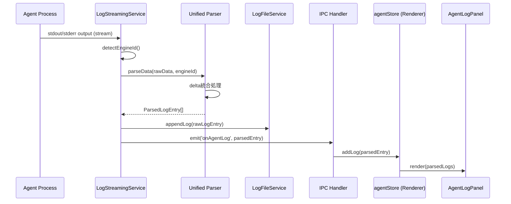
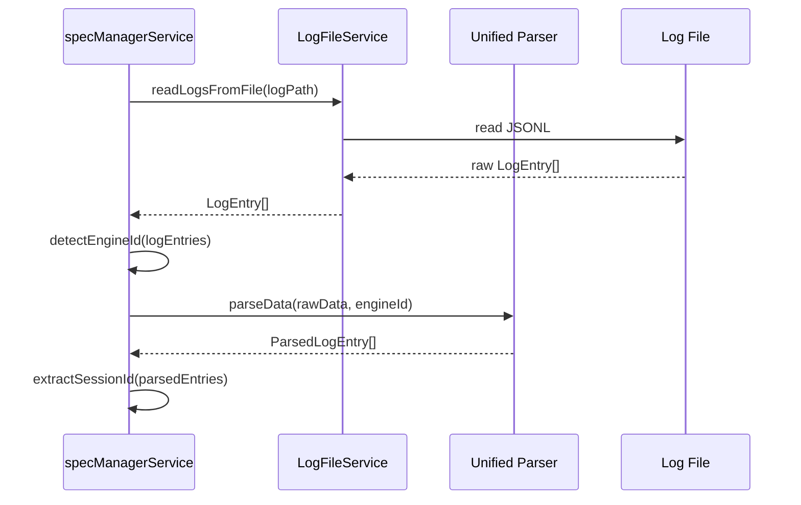

# Design: Main Process Log Parser

## Overview

本機能は、LLMエンジン（Claude CLI / Gemini CLI）のログパース責務をUI層（Renderer process）からMain processに移動し、データ正規化アーキテクチャを整合させる。現在、`useIncrementalLogParser`フックがRenderer processで`LogEntry`（LLM固有の生ログ）を`ParsedLogEntry`（統一フォーマット）に変換しているが、これはMain processの責務である「データ正規化」に該当する。また、`specManagerService.parseAndUpdateSessionId`や`logParserService.getLastAssistantMessage`がClaude専用の条件分岐を持ち、Gemini対応が不完全である問題も解決する。

**Purpose**: Main processでのログパース集約により、UI層をLLM固有フォーマットから分離し、新LLMエンジン追加時の変更範囲を最小化する。

**Users**: Electronアプリ利用者およびRemote UI利用者。エージェント実行ログの表示体験は変わらないが、内部アーキテクチャが整合される。

**Impact**: IPC/WebSocket APIが`LogEntry`から`ParsedLogEntry`に変更される（破壊的変更）。UI層のパース処理が削除され、Main processでの一元的なパース処理に置き換わる。

### Goals

- Main processでLLMログをパースし、統一`ParsedLogEntry`形式でUIに送信
- delta統合（ストリーミング断片結合）をMain processで実施
- IPC/WebSocket APIを`ParsedLogEntry`型に変更
- UI層（`useIncrementalLogParser`, `AgentLogPanel`）を簡略化
- `specManagerService`と`logParserService`のClaude専用コードを統一パーサーで置き換え
- ログファイル形式（生データJSONL）は互換性のため維持

### Non-Goals

- 他のLLMエンジン（Claude/Gemini以外）の対応
- ログファイル形式の変更（パース済みデータ保存への移行）
- パフォーマンス最適化（現状で十分、必要に応じて将来対応）
- 古いログファイルのマイグレーション

## Architecture

### 既存アーキテクチャ分析

**現在のログパース責務配置**:

```
[Agent Process] → raw LogEntry → [LogFileService (Main)] → file write
                              ↓
                       [IPC: onAgentLog]
                              ↓
                  [agentStore (Renderer)] → LogEntry[]保存
                              ↓
              [useIncrementalLogParser (Renderer)] → parseLogData()
                              ↓
                       ParsedLogEntry[]
                              ↓
                    [AgentLogPanel] → UI表示
```

**問題点**:
1. **データ正規化責務のRenderer流出**: Main processの責務（データ正規化）がRenderer processに漏出
2. **LLM固有フォーマット認識**: UI層が`claudeParser`/`geminiParser`を直接認識
3. **Claude専用コードの散在**: `specManagerService.parseAndUpdateSessionId`, `logParserService.getLastAssistantMessage`がClaude専用条件分岐を持つ
4. **Remote UI対応の重複**: Remote UI側でも同じパース処理が必要

**既存ドメイン境界**:
- **Main process**: データ永続化、プロセス管理、IPC/WebSocketハンドラ
- **Renderer process**: UI表示、ユーザーインタラクション
- **Shared層**: プラットフォーム非依存のロジック（パーサー、型定義）

### Architecture Pattern & Boundary Map

**選択パターン**: Layered Architecture with Service Layer
- **Presentation Layer** (Renderer): UIコンポーネント、stores
- **Service Layer** (Main): ビジネスロジック、データ正規化
- **Data Layer** (Main): ファイルI/O、永続化

**新しいログパース責務配置**:

```mermaid
graph TB
    Agent[Agent Process] -->|raw output| LogService[LogStreamingService<br/>Main process]
    LogService -->|engineId取得| MetaService[AgentRecordService]
    LogService -->|parseData| Parser[Unified Parser<br/>claudeParser/geminiParser]
    Parser -->|ParsedLogEntry[]| LogService
    LogService -->|raw LogEntry| FileService[LogFileService]
    LogService -->|ParsedLogEntry| IPCHandler[IPC Handler]
    LogService -->|ParsedLogEntry| WSHandler[WebSocket Handler]
    IPCHandler -->|IPC: onAgentLog| RendererStore[agentStore Renderer]
    WSHandler -->|WS: agent-log| RemoteStore[agentStore Remote UI]
    RendererStore --> UI[AgentLogPanel]
    RemoteStore --> RemoteUI[Remote AgentLogPanel]

    SpecService[specManagerService] -->|read & parse| FileService
    SpecService -->|parseData| Parser
    LogParserService[logParserService] -->|read & parse| FileService
    LogParserService -->|parseData| Parser
```

**アーキテクチャ統合**:
- **Selected pattern**: Service Layer Pattern - Main processにビジネスロジックを集約
- **Domain/feature boundaries**: LogStreamingService（ストリーム処理）とLogParserService（ファイル読み込み）の責務分離
- **Existing patterns preserved**: LogFileServiceの生データ保存、ApiClient抽象化パターン
- **New components rationale**: LogStreamingServiceは既存AgentRecordServiceのログストリーミング処理を拡張し、パース処理を追加
- **Steering compliance**: structure.md "Electron Process Boundary Rules" に準拠、データ正規化責務をMainに配置

### Technology Stack

| Layer | Choice / Version | Role in Feature | Notes |
|-------|------------------|-----------------|-------|
| Backend / Services | Node.js 20+ | Main processでのログパース処理 | 既存Electronアーキテクチャ |
| Data / Messaging | IPC (contextBridge) | Parsed logのRenderer送信 | 既存IPCチャンネル`onAgentLog`の型変更 |
| Data / Messaging | WebSocket (ws) | Parsed logのRemote UI送信 | 既存WebSocketイベント`agent-log`の型変更 |
| Shared / Utils | TypeScript 5.8+ | LLMパーサー実装 | 既存`claudeParser.ts`, `geminiParser.ts`を再利用 |

## System Flows

### Main Process Log Parsing Flow



**フロー決定事項**:
- **engineId取得**: AgentRecordからメタデータ読み込み、未設定時はClaude（後方互換）
- **delta統合**: parseData()内部でDeltaAccumulatorを使用し、完全なメッセージに統合
- **二重書き込み**: FileServiceには生データ、IPCにはパース済みデータを送信

### specManagerService Session ID Parsing Flow



**統合ポイント**: 既存のClaude専用`session_id`抽出ロジックを統一パーサーに置き換え。

## Requirements Traceability

| Criterion ID | Summary | Components | Implementation Approach |
|--------------|---------|------------|------------------------|
| 1.1 | Main processでのログパース | LogStreamingService, Unified Parser | 新規実装（既存AgentRecordServiceを拡張） |
| 1.2 | 既存パーサー利用 | claudeParser, geminiParser | 再利用（shared/utils/） |
| 1.3 | engineId自動選択 | LogStreamingService.detectEngineId() | 新規実装 |
| 1.4 | 未設定時Claudeデフォルト | LogStreamingService.detectEngineId() | フォールバック実装 |
| 2.1 | delta統合 | claudeParser.parseData(), geminiParser.parseData() | 既存機能利用 |
| 2.2 | Claude/Gemini対応 | Unified Parser (engineId dispatch) | 新規統合ロジック |
| 2.3 | IPC経由で送信 | LogStreamingService → IPC Handler | 既存IPCチャンネル拡張 |
| 3.1 | onAgentLog型変更 | IPC channels, IpcApiClient | 型定義変更 |
| 3.2 | agent-log型変更 | WebSocket handler, WebSocketApiClient | 型定義変更 |
| 3.3 | API型定義更新 | shared/api/types.ts | ParsedLogEntry export |
| 3.4 | 後方互換性不要 | - | 破壊的変更許容 |
| 4.1 | agentStore型変更 | shared/stores/agentStore.ts | logs: Map<string, ParsedLogEntry[]> |
| 4.2 | addLog引数変更 | agentStore.addLog(ParsedLogEntry) | 型シグネチャ変更 |
| 4.3 | パースロジック削除 | agentStore | useIncrementalLogParser呼び出し削除 |
| 5.1 | useIncrementalLogParser非推奨化 | shared/hooks/ | Deprecation comment追加 |
| 5.2 | AgentLogPanel簡略化 | shared/components/agent/AgentLogPanel.tsx | パース処理削除 |
| 5.3 | LogEntryBlock互換性 | LogEntryBlock.tsx | 変更不要（既にParsedLogEntry対応） |
| 6.1 | parseAndUpdateSessionId修正 | specManagerService.ts | 統一パーサー利用 |
| 6.2 | getLastAssistantMessage修正 | logParserService.ts | 統一パーサー利用 |
| 6.3 | 他Claude専用コード | Main process全体 | Grep検索で洗い出し |
| 7.1 | LogFileService維持 | logFileService.ts | 変更不要 |
| 7.2 | JSONL形式維持 | Log file format | 変更不要 |
| 7.3 | 読み込み時パース | logParserService, specManagerService | parseData()呼び出し追加 |

### Coverage Validation Checklist

- [x] Every criterion ID from requirements.md appears in the table above
- [x] Each criterion has specific component names
- [x] Implementation approach distinguishes "reuse existing" vs "new implementation"
- [x] User-facing criteria specify concrete UI components

## Components and Interfaces

### Component Summary

| Component | Domain/Layer | Intent | Req Coverage | Key Dependencies (P0/P1) | Contracts |
|-----------|--------------|--------|--------------|--------------------------|-----------|
| LogStreamingService | Main/Services | Agent出力のパース・配信 | 1.1, 1.3, 1.4, 2.3 | AgentRecordService (P0), Unified Parser (P0) | Service, Event |
| Unified Parser Facade | Main/Utils | engineId別パーサー選択 | 1.2, 1.3, 2.2 | claudeParser (P0), geminiParser (P0) | Service |
| IpcApiClient | Renderer/API | IPCラッパー | 3.1 | Electron IPC (P0) | API |
| WebSocketApiClient | Remote UI/API | WebSocketラッパー | 3.2 | ws (P0) | API |
| agentStore (shared) | Shared/Stores | Agent状態管理 | 4.1, 4.2, 4.3 | ApiClient (P0) | State |
| AgentLogPanel | Shared/Components | ログUI表示 | 5.2 | agentStore (P0), LogEntryBlock (P1) | UI |
| specManagerService | Main/Services | Spec管理・セッション解析 | 6.1 | Unified Parser (P0), LogFileService (P0) | Service |
| logParserService | Main/Services | ログファイル解析 | 6.2, 7.3 | Unified Parser (P0), LogFileService (P0) | Service |

### Main Process / Services

#### LogStreamingService

| Field | Detail |
|-------|--------|
| Intent | Agent stdout/stderrをパースし、ParsedLogEntryをIPC/WebSocketで配信 |
| Requirements | 1.1, 1.3, 1.4, 2.1, 2.3 |

**Responsibilities & Constraints**
- Agent出力のリアルタイムパース処理
- engineId自動検出（AgentRecordメタデータ参照）
- delta統合済みログエントリの配信
- 生ログの並行保存（LogFileService経由）

**Dependencies**
- Inbound: AgentProcess (stdout/stderr stream) — Agent出力受信 (P0)
- Outbound: AgentRecordService — engineId取得 (P0)
- Outbound: Unified Parser — ログパース (P0)
- Outbound: LogFileService — 生ログ保存 (P0)
- Outbound: IPC Handler — Rendererへの配信 (P0)
- Outbound: WebSocket Handler — Remote UIへの配信 (P1)

**Contracts**: Service [x] / Event [x]

##### Service Interface

```typescript
interface LogStreamingService {
  /**
   * Agent出力をパースしてログエントリを配信
   * @param agentId - エージェントID
   * @param stream - stdout/stderr識別子
   * @param data - 生ログデータ
   * @returns void（非同期でIPC/WebSocketに配信）
   */
  processLogOutput(agentId: string, stream: 'stdout' | 'stderr', data: string): Promise<void>;

  /**
   * engineIdを自動検出
   * @param agentId - エージェントID
   * @returns LLMEngineId または undefined（フォールバック: 'claude'）
   */
  detectEngineId(agentId: string): Promise<LLMEngineId | undefined>;
}
```

- **Preconditions**: agentIdが有効なAgentRecordに対応
- **Postconditions**: ParsedLogEntryがIPC/WebSocketで配信される
- **Invariants**: 生ログは必ずLogFileServiceに保存される

##### Event Contract

- **Published events**: `onAgentLog(agentId: string, log: ParsedLogEntry)`
- **Subscribed events**: Agent process出力イベント（Node.js stream events）
- **Ordering / delivery guarantees**: ログ順序保証（streamイベント順）

**Implementation Notes**
- **Integration**: 既存AgentRecordServiceのログストリーミング処理に統合
- **Validation**: engineId未設定時はwarningログ出力、Claudeにフォールバック
- **Risks**: 大量ログ時のIPC overhead増加（将来的にバッチ送信検討）

#### Unified Parser Facade

| Field | Detail |
|-------|--------|
| Intent | engineIdに基づいて適切なパーサーを選択し、統一的なパース処理を提供 |
| Requirements | 1.2, 1.3, 2.2 |

**Responsibilities & Constraints**
- engineId → Parser実装のマッピング
- 存在しないengineIdへのフォールバック
- パース失敗時のエラーハンドリング

**Dependencies**
- Outbound: claudeParser — Claudeログパース (P0)
- Outbound: geminiParser — Geminiログパース (P0)

**Contracts**: Service [x]

##### Service Interface

```typescript
interface UnifiedParser {
  /**
   * engineId別にログデータをパース
   * @param data - 生ログデータ（複数行JSONL可）
   * @param engineId - LLMエンジン識別子
   * @returns ParsedLogEntry[]（delta統合済み）
   */
  parseData(data: string, engineId?: LLMEngineId): ParsedLogEntry[];

  /**
   * 単一行のパース
   * @param line - JSONLの1行
   * @param engineId - LLMエンジン識別子
   * @returns ParsedLogEntry[]（1行から0〜N個のエントリ生成可）
   */
  parseLine(line: string, engineId?: LLMEngineId): ParsedLogEntry[];
}
```

- **Preconditions**: データが有効なJSONL形式
- **Postconditions**: ParsedLogEntry[]が返される、delta統合済み
- **Invariants**: パース失敗時は空配列またはraw textエントリを返す

**Implementation Notes**
- **Integration**: Main processの複数箇所（LogStreamingService, specManagerService, logParserService）から呼び出される
- **Validation**: engineId不正時はwarningログ、Claudeパーサーにフォールバック
- **Risks**: 新LLMエンジン追加時の拡張ポイント明確化

### Shared / API Layer

#### IpcApiClient

| Field | Detail |
|-------|--------|
| Intent | Electron IPC経由のAPI通信を抽象化 |
| Requirements | 3.1 |

**型定義変更のみ**: `onAgentLog`リスナーの型を`ParsedLogEntry`に変更。実装ロジック変更なし。

##### API Contract

| Method | Endpoint | Request | Response | Errors |
|--------|----------|---------|----------|--------|
| onAgentLog | IPC Event | - | `(agentId: string, log: ParsedLogEntry) => void` | - |

**Implementation Notes**
- **Integration**: preload/index.ts の contextBridge 定義更新
- **Validation**: 型チェックのみ（Zodスキーマ不要、内部API）
- **Risks**: 既存Rendererコードでの型エラー検出が必要

#### WebSocketApiClient

| Field | Detail |
|-------|--------|
| Intent | WebSocket経由のAPI通信を抽象化 |
| Requirements | 3.2 |

**型定義変更のみ**: `agent-log`イベントの型を`ParsedLogEntry`に変更。

##### API Contract

| Method | Endpoint | Request | Response | Errors |
|--------|----------|---------|----------|--------|
| agent-log | WebSocket Event | - | `{ agentId: string, log: ParsedLogEntry }` | - |

**Implementation Notes**
- **Integration**: webSocketHandler.ts のイベントペイロード型更新
- **Validation**: JSON.stringify/parseで自動シリアライズ
- **Risks**: Remote UIとのバージョン不整合（同時デプロイ必須）

### Shared / Stores

#### agentStore

| Field | Detail |
|-------|--------|
| Intent | Agent状態とログの統一管理 |
| Requirements | 4.1, 4.2, 4.3 |

**型変更**: `logs: Map<string, ParsedLogEntry[]>`に変更、パース処理削除。

##### State Management

```typescript
interface SharedAgentState {
  logs: Map<string, ParsedLogEntry[]>; // 型変更: LogEntry[] → ParsedLogEntry[]
  // 他のフィールドは変更なし
}

interface SharedAgentActions {
  addLog: (agentId: string, log: ParsedLogEntry) => void; // 型変更
  getLogsForAgent: (agentId: string) => ParsedLogEntry[]; // 型変更
  // 他のメソッドは変更なし
}
```

- **State model**: Zustand store、Map構造でagentId別ログ管理
- **Persistence & consistency**: メモリ内のみ（永続化はLogFileService）
- **Concurrency strategy**: Zustand内部のimmutable update

**Implementation Notes**
- **Integration**: IpcApiClient/WebSocketApiClientからの`onAgentLog`リスナーで`addLog`呼び出し
- **Validation**: ParsedLogEntryの型検証はTypeScriptコンパイル時のみ
- **Risks**: 既存の`useIncrementalLogParser`呼び出し箇所の削除漏れ

### Shared / Components

#### AgentLogPanel

| Field | Detail |
|-------|--------|
| Intent | Agent実行ログのリアルタイム表示 |
| Requirements | 5.2 |

**簡略化**: `useIncrementalLogParser`呼び出しを削除、`agentStore.logs`を直接表示。

```typescript
interface AgentLogPanelProps {
  agentId: string;
  // engineId不要（ParsedLogEntryに含まれる）
}
```

**Implementation Notes**
- **Integration**: agentStore.getLogsForAgent()で取得したParseLogEntry[]を直接LogEntryBlockに渡す
- **Validation**: ログ順序はagentStoreで保証済み
- **Risks**: パース済みデータ前提のため、パースエラー時の表示未定義（統一パーサーでフォールバック処理済み）

### Main Process / Existing Services

#### specManagerService

| Field | Detail |
|-------|--------|
| Intent | Spec管理・Claude CLI実行・セッションID解析 |
| Requirements | 6.1 |

**修正点**: `parseAndUpdateSessionId()`メソッドのClaude専用パースロジックを統一パーサーに置き換え。

```typescript
private async parseAndUpdateSessionId(
  specPath: string,
  logPath: string
): Promise<void> {
  const rawLogs = await this.logFileService.readLogsFromFile(logPath);
  const engineId = this.detectEngineId(rawLogs); // 新規: engineId検出
  const parsedLogs = this.unifiedParser.parseData(
    rawLogs.map(l => l.data).join('\n'),
    engineId
  ); // 統一パーサー利用
  const sessionId = this.extractSessionId(parsedLogs); // 既存ロジック
  // ... spec.json更新
}
```

**Implementation Notes**
- **Integration**: 既存のspecManagerService内の1メソッド修正のみ
- **Validation**: sessionId未検出時の既存エラーハンドリング維持
- **Risks**: Geminiログからのsession_id抽出失敗の可能性（Gemini仕様確認必要）

#### logParserService

| Field | Detail |
|-------|--------|
| Intent | Agent実行ログの解析・結果判定 |
| Requirements | 6.2, 7.3 |

**修正点**: `getLastAssistantMessage()`のClaude専用パースロジックを統一パーサーに置き換え。

```typescript
async getLastAssistantMessage(logPath: string): Promise<Result<string, ParseError>> {
  const rawLogs = await this.readLogLines(logPath);
  if (!rawLogs.ok) return rawLogs;

  const engineId = this.detectEngineId(rawLogs.value); // 新規: engineId検出
  const parsedEntries = this.unifiedParser.parseData(
    rawLogs.value.map(l => l.data).join('\n'),
    engineId
  ); // 統一パーサー利用

  const assistantEntries = parsedEntries.filter(e => e.type === 'text' && e.text?.role === 'assistant');
  // ... 最終メッセージ抽出
}
```

**Implementation Notes**
- **Integration**: 既存のlogParserService内の1メソッド修正
- **Validation**: NO_ASSISTANT_FOUND エラーの既存ハンドリング維持
- **Risks**: Geminiログでのassistant message形式差異の可能性

## Data Models

### Domain Model

**Entities**:

- **ParsedLogEntry**: 統一されたログエントリ表現
  - Attributes: `id`, `type`, `timestamp`, `engineId`, `session`, `tool`, `toolResult`, `text`, `result`
  - Value Object: すべてimmutable
  - Lifecycle: Main processで生成 → IPC/WebSocket送信 → UI表示

- **LogEntry**: LLM固有の生ログエントリ（既存）
  - Attributes: `id`, `timestamp`, `stream`, `data`
  - Lifecycle: Agent出力 → LogFileService保存 → パース時読み込み

**Aggregates**:
- **AgentLogs**: 1 Agent → N ParsedLogEntry (1:N関係)
- **Transactional boundary**: AgentごとにログIDの一意性保証

### Logical Data Model

**Structure Definition**:

```typescript
// ParsedLogEntry (既存、変更なし)
interface ParsedLogEntry {
  id: string;                     // 一意識別子
  type: 'system' | 'assistant' | 'tool_use' | 'tool_result' | 'result' | 'text' | 'error' | 'input';
  timestamp?: number;             // Unix timestamp (ms)
  engineId?: LLMEngineId;         // 'claude' | 'gemini'
  session?: {
    cwd?: string;
    model?: string;
    version?: string;
  };
  tool?: {
    name: string;
    toolUseId?: string;
    input?: Record<string, unknown>;
  };
  toolResult?: {
    toolUseId: string;
    content: string;
    isError: boolean;
  };
  text?: {
    content: string;
    role: 'assistant' | 'user';
  };
  result?: {
    content: string;
    isError: boolean;
    costUsd?: number;
    durationMs?: number;
    numTurns?: number;
    inputTokens?: number;
    outputTokens?: number;
  };
}

// LogEntry (既存、変更なし)
interface LogEntry {
  id: string;                     // UUID
  timestamp: string;              // ISO 8601
  stream: 'stdout' | 'stderr';
  data: string;                   // LLM固有のJSONL行
}
```

**Consistency & Integrity**:
- **Transaction boundaries**: agentStoreのaddLog()でatomic追加
- **Referential integrity**: agentId → AgentRecord参照整合性（AgentRecordService管理）
- **Temporal aspects**: ParsedLogEntry.timestamp（パース時刻）、LogEntry.timestamp（出力時刻）

### Data Contracts & Integration

**API Data Transfer**

IPC/WebSocket経由でParsedLogEntryを送信:

```typescript
// IPC
contextBridge.exposeInMainWorld('electronAPI', {
  onAgentLog: (callback: (agentId: string, log: ParsedLogEntry) => void) => {
    ipcRenderer.on('onAgentLog', (_, agentId, log) => callback(agentId, log));
  }
});

// WebSocket
ws.send(JSON.stringify({
  type: 'agent-log',
  data: { agentId: string, log: ParsedLogEntry }
}));
```

**Event Schemas**

```typescript
// IPC Event
type OnAgentLogEvent = {
  channel: 'onAgentLog';
  payload: [agentId: string, log: ParsedLogEntry];
};

// WebSocket Event
type AgentLogWSEvent = {
  type: 'agent-log';
  data: {
    agentId: string;
    log: ParsedLogEntry;
  };
};
```

**Schema versioning strategy**: 内部APIのため、メジャーバージョンアップ時のみ破壊的変更許容。
**Backward/forward compatibility rules**: 後方互換性不要（要件3.4）。

## Error Handling

### Error Strategy

| Error Category | Error Type | Recovery Strategy |
|----------------|-----------|-------------------|
| **User Errors** | 該当なし | - |
| **System Errors** | File read failure (LogFileService) | ログを空配列として扱う、UI警告表示 |
| **System Errors** | IPC/WebSocket送信失敗 | リトライ3回、失敗時はログ出力のみ（UIは古いログ表示継続） |
| **Business Logic Errors** | engineId未設定 | warningログ出力、Claudeにフォールバック |
| **Business Logic Errors** | パース失敗 | raw textエントリにフォールバック |

### Error Categories and Responses

**System Errors (5xx)**:
- **LogFileService読み込み失敗**: `Result<LogEntry[], FileReadError>`でエラー返却 → 呼び出し側で空配列扱い
- **IPC/WebSocket送信失敗**: 内部エラーログ、リトライ後に諦め（UIは既存ログ表示継続）

**Business Logic Errors (422)**:
- **engineId検出失敗**: warningログ「engineId not found, falling back to Claude」、Claude parserで処理
- **JSON parse失敗**: parseLine()内でcatch、raw textエントリ生成

### Monitoring

- **Main processログ**: 全エラーは`projectLogger`経由で`.kiro/logs/main.log`に記録
- **エラーメトリクス**: パース失敗率、IPC送信失敗率（将来拡張）
- **Health monitoring**: Agent出力 → UI表示までのレイテンシー監視（将来拡張）

## Testing Strategy

### Unit Tests

- **LogStreamingService.detectEngineId()**: 正常系（engineId存在）、フォールバック系（未設定）
- **UnifiedParser.parseData()**: Claude/Gemini各エンジンのJSONL解析、delta統合確認
- **specManagerService.parseAndUpdateSessionId()**: 統一パーサー利用の確認、sessionId抽出
- **logParserService.getLastAssistantMessage()**: 統一パーサー利用、最終メッセージ抽出
- **agentStore.addLog()**: ParsedLogEntry型受け入れ確認

### Integration Tests

- **Main → Renderer IPC通信**: LogStreamingService → IPC → agentStore → UI表示
- **Main → Remote UI WebSocket通信**: LogStreamingService → WebSocket → agentStore → UI表示
- **LogFileService + UnifiedParser**: 生ログ保存 → 読み込み → パース の一連フロー
- **Claude/Gemini両エンジン**: 各エンジンのログがParsedLogEntryに正しく変換されることを確認

### E2E/UI Tests

- **Electron Agent実行ログ表示**: Agent起動 → ログリアルタイム表示 → ParsedLogEntry形式確認
- **Remote UI Agent実行ログ表示**: WebSocket経由でログ受信 → 表示確認
- **specManagerService実行**: session_id抽出成功、spec.json更新確認
- **logParserService実行**: 結果判定正常動作確認

### Performance Tests

- **大量ログ時のIPC overhead**: 10000行ログ送信時のレイテンシー計測
- **delta統合パフォーマンス**: ストリーミング断片100個の統合時間計測

## Integration Test Strategy

本機能はIPC/WebSocketによるクロスプロセス通信を含むため、統合テストが必須。

**Components**:
- Main process: LogStreamingService, UnifiedParser, IPC/WebSocket Handler
- Renderer process: agentStore, AgentLogPanel
- Remote UI: agentStore (shared), RemoteAgentLogPanel

**Data Flow**:
1. Agent Process → LogStreamingService (stdout/stderr)
2. LogStreamingService → UnifiedParser (parseData)
3. UnifiedParser → LogStreamingService (ParsedLogEntry[])
4. LogStreamingService → IPC/WebSocket (emit)
5. agentStore → UI (render)

**Mock Boundaries**:
- **Mock**: Agent Processのstdout/stderrストリーム（テストデータ注入）
- **Real**: LogStreamingService, UnifiedParser, IPC/WebSocket, agentStore, UI
- **Rationale**: IPC/WebSocketの実際の通信経路を検証するため、モック範囲を最小化

**Verification Points**:
- LogStreamingServiceがParseLogEntryを生成すること
- IPC/WebSocketでParsedLogEntryが送信されること
- agentStoreにParsedLogEntry[]が保存されること
- UIでParseLogEntryが表示されること（LogEntryBlockコンポーネント）

**Robustness Strategy**:
- **Use waitFor patterns**: agentStore更新をポーリング監視（固定sleepは使用しない）
- **Monitor state transitions**: agentStore.logs Mapのサイズ変化を監視
- **IPC/WebSocket送信確認**: ハンドラーのspy/mockでemit呼び出しを検証

**Prerequisites**:
- Mock Agent Processヘルパー実装（テストデータ注入用）
- IPC/WebSocket送信のspyインフラ（vitest/sinon）
- E2E環境での両プロセス起動（既存のe2e-wdioフレームワーク利用）

## Design Decisions

### DD-001: Main ProcessでのLog Parsing実施

| Field | Detail |
|-------|--------|
| Status | Accepted |
| Context | ログパース責務をUI層（Renderer）とMain processのどちらに配置するか。現状、`useIncrementalLogParser`フックがRendererでLLM固有フォーマットをパース。 |
| Decision | Main processでログパース実施、統一`ParsedLogEntry`形式でUIに送信 |
| Rationale | **Electronアーキテクチャ原則**: structure.md "Electron Process Boundary Rules" により、データ正規化はMain processの責務。UI層はビジネスロジック（LLM固有フォーマット認識）を持つべきでない。 |
| Alternatives Considered | 1. **現状維持**（UI層パース）→ 設計原則違反、2. **Hybrid**（基本パースのみMain）→ 責務境界曖昧 |
| Consequences | **Pros**: 設計一貫性、新LLMエンジン追加時の変更範囲最小化、Remote UI対応の簡略化。**Cons**: IPC payload増加（軽微）、破壊的API変更（一時的な移行コスト）。 |

### DD-002: API Breaking Change許容

| Field | Detail |
|-------|--------|
| Status | Accepted |
| Context | IPC/WebSocket APIの型を`LogEntry → ParsedLogEntry`に変更するか、互換性レイヤーを維持するか |
| Decision | Breaking Change許容、互換性レイヤーなし |
| Rationale | **内部API**: IPC/WebSocketは外部公開されておらず、Electron/Remote UIは同時更新される。互換性レイヤーは将来の技術的負債となる。 |
| Alternatives Considered | 1. **両型サポート**（LogEntry/ParsedLogEntry）→ 複雑性増加、2. **段階的移行**（deprecation period）→ 内部APIでは不要 |
| Consequences | **Pros**: クリーンな設計、長期保守性向上。**Cons**: 一度の移行で全クライアントコード更新必要（Renderer, Remote UI）。 |

### DD-003: Log File Format維持（Raw Data保存）

| Field | Detail |
|-------|--------|
| Status | Accepted |
| Context | ログファイルにパース済みデータ（ParsedLogEntry）を保存するか、生データ（LogEntry）を保存するか |
| Decision | 生データ（LLM固有JSONL）保存を維持 |
| Rationale | **互換性・柔軟性**: 外部ツール（jq, grep）での解析可能性、パーサーバグ修正時の再パース可能性、デバッグ容易性を優先。パースコストは問題にならない（オンデマンド読み込み）。 |
| Alternatives Considered | 1. **ParsedLogEntry保存** → 読み込み高速化（不要な最適化）、2. **両方保存** → ストレージ二重使用（YAGNI） |
| Consequences | **Pros**: ログ互換性維持、デバッグ容易性。**Cons**: 読み込み時パースコスト（軽微、問題にならない）。 |

### DD-004: engineId Fallback to Claude

| Field | Detail |
|-------|--------|
| Status | Accepted |
| Context | engineIdが未設定のAgentログをどう扱うか（既存ログとの互換性） |
| Decision | engineId未設定時はClaude parserにフォールバック、warningログ出力 |
| Rationale | **後方互換性**: 既存のClaude専用ログ（engineId未設定）を引き続き処理可能にする。新規Agentは必ずengineIdを設定する前提。 |
| Alternatives Considered | 1. **エラー扱い**（パース拒否）→ 既存ログが表示不可、2. **両パーサー試行**（Claude→Gemini順）→ パフォーマンス劣化 |
| Consequences | **Pros**: 既存ログとの互換性、段階的移行可能。**Cons**: engineId未設定のまま運用される可能性（warningで検知）。 |

### DD-005: Unified Parser Facade導入

| Field | Detail |
|-------|--------|
| Status | Accepted |
| Context | engineId別のパーサー選択ロジックをどこに配置するか |
| Decision | Unified Parser Facadeを新規導入し、Main processの各サービスから共通利用 |
| Rationale | **DRY原則**: LogStreamingService, specManagerService, logParserServiceで重複するパーサー選択ロジックを一元化。新LLMエンジン追加時の拡張ポイントを明確化。 |
| Alternatives Considered | 1. **各サービスに実装**（重複コード）、2. **パーサー自動検出**（試行錯誤型、パフォーマンス劣化） |
| Consequences | **Pros**: コード重複削減、拡張性向上。**Cons**: 新規モジュール追加（軽微な複雑性増加）。 |

## 結合・廃止戦略 (Integration & Deprecation Strategy)

### 既存ファイルの変更（Wiring Points）

以下のファイルは新機能統合のため**変更が必要**:

| ファイルパス | 変更内容 | 影響範囲 |
|------------|---------|---------|
| `src/main/services/agentProcess.ts` | LogStreamingService統合（Agent出力パイプライン） | Main process Agent実行 |
| `src/main/ipc/agentHandlers.ts` | onAgentLogイベントのPayload型変更 | IPC Handler |
| `src/main/services/webSocketHandler.ts` | agent-logイベントのPayload型変更 | WebSocket Handler |
| `src/preload/index.ts` | contextBridge型定義更新（onAgentLog → ParsedLogEntry） | preload |
| `src/shared/api/types.ts` | LogEntry export削除、ParsedLogEntry export追加 | API型定義 |
| `src/shared/api/IpcApiClient.ts` | onAgentLogリスナー型変更 | Renderer API |
| `src/shared/api/WebSocketApiClient.ts` | agent-logリスナー型変更 | Remote UI API |
| `src/shared/stores/agentStore.ts` | logs型変更（LogEntry[] → ParsedLogEntry[]）、addLog型変更 | Shared Store |
| `src/shared/components/agent/AgentLogPanel.tsx` | useIncrementalLogParser削除、直接parsedLogsを表示 | Shared UI |
| `src/main/services/specManagerService.ts` | parseAndUpdateSessionId()の統一パーサー利用 | Main process Spec管理 |
| `src/main/services/logParserService.ts` | getLastAssistantMessage()の統一パーサー利用 | Main process Log解析 |

### 削除対象ファイル（Cleanup）

以下のファイル/コードは**削除が必要**:

| ファイルパス | 削除内容 | 理由 |
|------------|---------|------|
| `src/shared/hooks/useIncrementalLogParser.ts` | 全体を非推奨化（Deprecation comment追加、将来削除） | Main processでパース処理移行のため不要 |
| `src/shared/hooks/index.ts` | `useIncrementalLogParser` export削除（deprecation後） | - |
| （該当なし） | - | 既存パーサー（claudeParser, geminiParser）は再利用 |

### 並列作成ファイル（Parallel Creation）

以下のファイルは**新規作成**（既存ファイルと並行）:

| ファイルパス | 役割 | 理由 |
|------------|------|------|
| `src/main/services/logStreamingService.ts` | Agent出力のリアルタイムパース・配信 | 新機能 |
| `src/main/utils/unifiedParser.ts` | engineId別パーサー選択Facade | 新機能 |
| `src/shared/types/parsedLogEntry.ts` | （オプション）ParsedLogEntry型の再export | 型定義整理 |

**Note**: 既存ファイル置き換えは発生しない。新機能は既存アーキテクチャに統合される形で追加。

## インターフェース変更と影響分析 (Interface Changes & Impact Analysis)

### 変更されるインターフェース

#### 1. IPC: `onAgentLog` Event

**変更内容**:
```typescript
// 変更前
onAgentLog: (callback: (agentId: string, log: LogEntry) => void) => void;

// 変更後
onAgentLog: (callback: (agentId: string, log: ParsedLogEntry) => void) => void;
```

**Parameter**: `log`パラメータの型が`LogEntry`から`ParsedLogEntry`に変更（**Required**）
**Callers（呼び出し側）の影響**:

| Caller | ファイルパス | 必要な変更 |
|--------|------------|-----------|
| agentStore (Renderer) | `src/renderer/stores/agentStore.ts` | `addLog()`の引数型変更 |
| agentStore (Shared) | `src/shared/stores/agentStore.ts` | `addLog()`の引数型変更 |
| AgentLogPanel | `src/shared/components/agent/AgentLogPanel.tsx` | `useIncrementalLogParser`削除、直接`parsedLogs`利用 |

**Rule**: すべてのonAgentLogリスナー登録箇所でコールバック引数型を更新必要。

#### 2. WebSocket: `agent-log` Event

**変更内容**:
```typescript
// 変更前
{ type: 'agent-log', data: { agentId: string, log: LogEntry } }

// 変更後
{ type: 'agent-log', data: { agentId: string, log: ParsedLogEntry } }
```

**Parameter**: `log`フィールドの型が`LogEntry`から`ParsedLogEntry`に変更（**Required**）
**Callers（呼び出し側）の影響**:

| Caller | ファイルパス | 必要な変更 |
|--------|------------|-----------|
| WebSocketApiClient | `src/shared/api/WebSocketApiClient.ts` | イベントハンドラー型更新 |
| Remote UI agentStore | `src/shared/stores/agentStore.ts` | `addLog()`の引数型変更 |

**Rule**: WebSocketクライアント側のすべてのagent-logイベントハンドラーで型更新必要。

#### 3. agentStore: `addLog()` Method

**変更内容**:
```typescript
// 変更前
addLog: (agentId: string, log: LogEntry) => void;

// 変更後
addLog: (agentId: string, log: ParsedLogEntry) => void;
```

**Parameter**: `log`パラメータの型が`LogEntry`から`ParsedLogEntry`に変更（**Required**）
**Callers（呼び出し側）の影響**:

| Caller | ファイルパス | 必要な変更 |
|--------|------------|-----------|
| IpcApiClient.onAgentLog | `src/shared/api/IpcApiClient.ts` | コールバック内で`addLog()`呼び出し箇所の型整合 |
| WebSocketApiClient | `src/shared/api/WebSocketApiClient.ts` | 同上 |
| AgentLogPanel | `src/shared/components/agent/AgentLogPanel.tsx` | 直接呼び出しは発生しない（API経由） |

**Rule**: `addLog()`を直接呼び出す箇所は存在しない（API層経由のみ）。API層の型更新で自動的に整合。

#### 4. agentStore: `logs` State

**変更内容**:
```typescript
// 変更前
logs: Map<string, LogEntry[]>;

// 変更後
logs: Map<string, ParsedLogEntry[]>;
```

**Parameter**: 内部stateの型変更（**Callerへの影響**）
**Callers（呼び出し側）の影響**:

| Caller | ファイルパス | 必要な変更 |
|--------|------------|-----------|
| useIncrementalLogParser | `src/shared/hooks/useIncrementalLogParser.ts` | **削除** - Main processでパース済みのためフック不要 |
| AgentLogPanel | `src/shared/components/agent/AgentLogPanel.tsx` | `useIncrementalLogParser`削除、直接`parsedLogs`利用 |

**Rule**: `agentStore.logs`を読み取る全箇所でParsedLogEntry[]前提のコードに更新。パース処理（useIncrementalLogParser）は削除。

### 影響を受けないインターフェース

以下のインターフェースは**変更なし**:

- `LogFileService.appendLog(entry: LogEntry)` - 生ログ保存は継続
- `LogEntryBlock` コンポーネント - 既にParsedLogEntry対応済み
- `claudeParser.parseData()` / `geminiParser.parseData()` - 再利用

## Supporting References

該当なし（本設計書は自己完結）。

---

_Document Version: 1.0_
_Last Updated: 2026-01-28_
