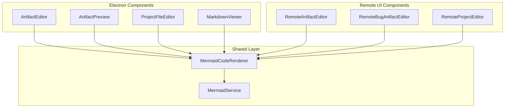
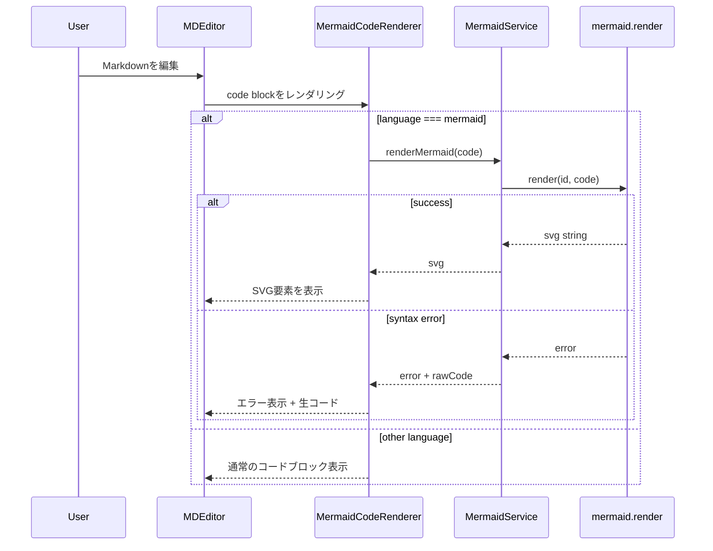
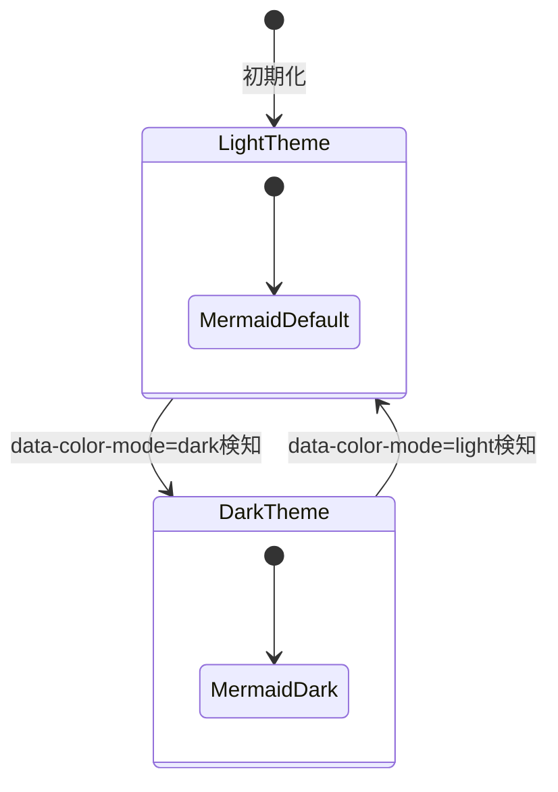

# Design: Markdown Mermaid Preview

## Overview

**Purpose**: SDD OrchestratorのMarkdownプレビュー機能にMermaid図表レンダリングサポートを追加し、design.md等に記述されたフローチャート、シーケンス図、状態遷移図などを視覚的に確認できるようにする。

**Users**: Spec/Bugアーティファクトを閲覧・編集する開発者が、設計ドキュメント内のMermaid図を即座にプレビューできる。

**Impact**: 既存の`@uiw/react-md-editor`を使用するすべてのMarkdownプレビューコンポーネントに、Mermaidレンダリング機能を統一的に追加する。

### Goals
- ```` ```mermaid ```` コードブロックをSVG図としてレンダリングする
- Mermaidがサポートする全種類の図（フローチャート、シーケンス図、ER図等）に対応
- リアルタイムプレビュー（編集中に即座に反映）
- ダークモード対応（アプリのテーマに合わせた図の色調整）
- Electron版とRemote UI版の両方で一貫した動作

### Non-Goals
- Mermaid図のPNG/SVGエクスポート機能
- Mermaidエディタ内シンタックスハイライト・補完
- Mermaid以外の図表記法（PlantUML等）
- Mermaidバージョン選択機能

## Architecture

### Existing Architecture Analysis

現在のMarkdownプレビューは`@uiw/react-md-editor`を使用し、以下のコンポーネントで実装されている:

| コンポーネント | 場所 | 用途 |
|--------------|------|------|
| ArtifactEditor | renderer/components | Spec/Bugアーティファクト編集 |
| ArtifactPreview | renderer/components | アーティファクト一覧展開プレビュー |
| ProjectFileEditor | renderer/components | プロジェクトファイル編集 |
| MarkdownViewer | shared/components/git | Git差分Markdown表示 |
| RemoteArtifactEditor | remote-ui/components | Remote UI版アーティファクト編集 |
| RemoteBugArtifactEditor | remote-ui/components | Remote UI版バグアーティファクト編集 |
| RemoteProjectEditor | remote-ui/components | Remote UI版プロジェクトファイル編集 |

**既存パターン**: すべてのコンポーネントが`MDEditor`または`MDEditor.Markdown`を直接使用しており、カスタムコードレンダラーは未設定。

### Architecture Pattern & Boundary Map



**Key Decisions**:
- **Shared Layer実装**: MermaidレンダリングロジックをElectron/Remote UIで共有
- **カスタムコードレンダラー**: `@uiw/react-md-editor`の`previewOptions.components.code`を使用
- **遅延初期化**: Mermaidライブラリは初回レンダリング時にのみ初期化

### Technology Stack

| Layer | Choice / Version | Role in Feature | Notes |
|-------|------------------|-----------------|-------|
| Frontend | React 19, TypeScript 5.8+ | コンポーネント実装 | 既存スタック |
| Mermaid | mermaid ^11.x | 図表レンダリングエンジン | 新規依存 |
| Markdown Editor | @uiw/react-md-editor 4.x | カスタムコードレンダラー統合 | 既存依存 |

## System Flows

### Mermaidレンダリングフロー



**Key Decisions**:
- 非同期レンダリング: `mermaid.render()`はasync APIのため、状態管理でSVG/エラーを保持
- エラー時は元コードを表示し、デバッグを容易にする
- 言語判定は`className`の`language-mermaid`で行う

### ダークモード切り替えフロー



**Key Decisions**:
- `data-color-mode`属性の監視でテーマを検知
- Mermaidは`theme: 'dark'`または`theme: 'default'`で初期化
- テーマ変更時は再レンダリングが必要（Mermaidの制約）

## Requirements Traceability

| Criterion ID | Summary | Components | Implementation Approach |
|--------------|---------|------------|------------------------|
| 1.1 | Mermaidコードブロックのレンダリング | MermaidCodeRenderer, MermaidService | mermaid.render()によるSVG生成 |
| 1.2 | 全種類の図サポート | MermaidService | Mermaidライブラリ標準機能（設定不要） |
| 1.3 | リアルタイムプレビュー更新 | MermaidCodeRenderer | MDEditorのpreview更新時に自動再レンダリング |
| 2.1 | シンタックスエラー時のエラーメッセージ表示 | MermaidCodeRenderer | try-catchでエラー捕捉、エラーUI表示 |
| 2.2 | エラー時の生コード表示 | MermaidCodeRenderer | エラー状態で`<pre>`タグに元コードを表示 |
| 2.3 | 他コンテンツへの影響なし | MermaidCodeRenderer | 個別のcode blockごとに独立したエラーハンドリング |
| 3.1 | ArtifactEditorでのMermaidレンダリング | ArtifactEditor | previewOptions.components.code設定 |
| 3.2 | ArtifactPreviewでのMermaidレンダリング | ArtifactPreview | MDEditor.Markdownにcomponents.code設定 |
| 3.3 | ProjectFileEditorでのMermaidレンダリング | ProjectFileEditor | previewOptions.components.code設定 |
| 3.4 | MarkdownViewerでのMermaidレンダリング | MarkdownViewer | MDEditor.Markdownにcomponents.code設定 |
| 3.5 | Remote UI版コンポーネントでのMermaidレンダリング | RemoteArtifactEditor, RemoteBugArtifactEditor, RemoteProjectEditor | 同上 |
| 4.1 | エディタ入力操作のブロック回避 | MermaidCodeRenderer | 非同期レンダリング、debounce不要（MDEditor側で処理） |
| 4.2 | 複数Mermaidブロックの適切なレンダリング | MermaidCodeRenderer | 各ブロックに一意のIDを生成 |

### Coverage Validation Checklist

- [x] Every criterion ID from requirements.md appears in the table above
- [x] Each criterion has specific component names (not generic references)
- [x] Implementation approach distinguishes "reuse existing" vs "new implementation"
- [x] User-facing criteria specify concrete UI components

## Components and Interfaces

| Component | Domain/Layer | Intent | Req Coverage | Key Dependencies | Contracts |
|-----------|--------------|--------|--------------|------------------|-----------|
| MermaidService | shared/services | Mermaid初期化とレンダリング実行 | 1.1, 1.2, 2.1 | mermaid (P0) | Service |
| MermaidCodeRenderer | shared/components | コードブロックをMermaid図またはエラーとして表示 | 1.1, 1.3, 2.1, 2.2, 2.3, 4.1, 4.2 | MermaidService (P0) | - |

### Shared Services

#### MermaidService

| Field | Detail |
|-------|--------|
| Intent | Mermaidライブラリの初期化とレンダリングAPIのラッパー |
| Requirements | 1.1, 1.2, 2.1 |

**Responsibilities & Constraints**
- Mermaidライブラリの遅延初期化（初回render呼び出し時）
- ダークモード対応のテーマ設定
- レンダリング結果またはエラーの返却

**Dependencies**
- External: mermaid ^11.x - 図表レンダリング (P0)

**Contracts**: Service [x]

##### Service Interface

```typescript
interface MermaidRenderResult {
  success: true;
  svg: string;
}

interface MermaidRenderError {
  success: false;
  error: string;
  rawCode: string;
}

type MermaidResult = MermaidRenderResult | MermaidRenderError;

interface MermaidServiceInterface {
  /**
   * Mermaid図をレンダリングする
   * @param code - Mermaidコード
   * @param id - 一意のレンダリングID（DOM要素識別用）
   * @param darkMode - ダークモード有効フラグ
   * @returns レンダリング結果またはエラー
   */
  render(code: string, id: string, darkMode: boolean): Promise<MermaidResult>;
}
```

- Preconditions: codeは空でない文字列、idは文書内で一意
- Postconditions: successの場合svgは有効なSVG文字列、失敗時はerrorメッセージとrawCodeを返却
- Invariants: Mermaidライブラリは初回呼び出し時に一度だけ初期化される

### Shared Components

#### MermaidCodeRenderer

| Field | Detail |
|-------|--------|
| Intent | MDEditorのカスタムコードレンダラーとしてMermaidブロックを処理 |
| Requirements | 1.1, 1.3, 2.1, 2.2, 2.3, 4.1, 4.2 |

**Responsibilities & Constraints**
- `language-mermaid`クラスのコードブロックを検出
- MermaidServiceを呼び出してSVGを取得
- 成功時はSVGを表示、失敗時はエラー+生コードを表示
- 非Mermaidコードは標準のコードブロックとしてパススルー

**Dependencies**
- Inbound: MDEditor previewOptions - コードブロックレンダリング委譲 (P0)
- Outbound: MermaidService - レンダリング実行 (P0)

**Contracts**: -

##### Service Interface

```typescript
interface MermaidCodeRendererProps {
  /** コードブロックの言語を示すクラス名（例: "language-mermaid"） */
  className?: string;
  /** コードブロックの内容 */
  children?: React.ReactNode;
}

/**
 * MDEditorのcomponents.codeに渡すReactコンポーネント
 */
declare function MermaidCodeRenderer(props: MermaidCodeRendererProps): React.ReactElement;
```

- Preconditions: MDEditor.MarkdownまたはpreviewOptionsから呼び出される
- Postconditions: Mermaidコードの場合はSVGまたはエラー表示、それ以外は標準`<code>`要素
- Invariants: レンダリングエラーは他のMarkdownコンテンツに影響しない

**Implementation Notes**
- Integration: MDEditorの`previewOptions.components.code`または`MDEditor.Markdown`の`components.code`に設定
- Validation: classNameに`language-mermaid`が含まれるかで判定
- Risks: Mermaidライブラリのバンドルサイズ（約800KB gzip圧縮後）

## Data Models

### Domain Model

本機能は永続データを持たない。レンダリング状態はコンポーネントローカルのReact stateで管理する。

| State | Type | Description |
|-------|------|-------------|
| renderResult | MermaidResult \| null | レンダリング結果またはエラー |
| isRendering | boolean | レンダリング中フラグ |

## Error Handling

### Error Strategy

Mermaidレンダリングエラーは個別のコードブロック単位で処理し、ドキュメント全体のレンダリングには影響を与えない。

### Error Categories and Responses

**User Errors (Mermaid Syntax)**:
- シンタックスエラー -> エラーメッセージ + 生コード表示
- 不正な図タイプ -> エラーメッセージ + 生コード表示

**System Errors**:
- Mermaidライブラリ読み込み失敗 -> フォールバック（コードブロックとして表示）
- レンダリングタイムアウト -> エラーメッセージ表示

### Error UI Pattern

```
+------------------------------------------+
| [!] Mermaid Error                        |
| Invalid syntax at line 3: ...            |
+------------------------------------------+
| ```mermaid                               |
| graph TD                                 |
|     A --> B                              |
|     B ->  C   <-- syntax error here      |
| ```                                      |
+------------------------------------------+
```

## Testing Strategy

### Unit Tests
- MermaidService.render()の正常系テスト（各図タイプ）
- MermaidService.render()のエラー系テスト（不正シンタックス）
- MermaidCodeRendererのMermaid/非Mermaidコード判定

### Integration Tests
- MDEditor内でのMermaidCodeRendererレンダリング確認
- ダークモード切り替え時の再レンダリング確認

### E2E Tests
- ArtifactEditorでMermaid図を含むMarkdownを編集・プレビュー
- Remote UIでのMermaidプレビュー動作確認

## Verification Contract

### User Journey Definition

| Journey ID | Operation Flow | Expected Result | E2E Required |
|------------|---------------|-----------------|--------------|
| UJ-001 | ArtifactEditorでMermaid図を含むdesign.mdを開き、プレビューモードに切り替える | Mermaid図がSVGとしてレンダリングされる | Yes |
| UJ-002 | 編集モードでMermaidコードを変更し、プレビューモードで確認する | 変更がリアルタイムで反映される | Yes |
| UJ-003 | 不正なMermaid構文を入力し、プレビューを確認する | エラーメッセージと生コードが表示される | Yes |
| UJ-004 | 複数のMermaidブロックを含むドキュメントをプレビューする | すべての図が正しくレンダリングされる | No |
| UJ-005 | Remote UI版ArtifactEditorでMermaid図をプレビューする | Electron版と同様にレンダリングされる | Yes |

### Impact Analysis Contract

| Target File | Action | Reason |
|-------------|--------|--------|
| electron-sdd-manager/package.json | UPDATE | mermaid依存追加 |
| src/shared/services/mermaidService.ts | CREATE | Mermaidレンダリングサービス |
| src/shared/components/markdown/MermaidCodeRenderer.tsx | CREATE | カスタムコードレンダラー |
| src/shared/components/markdown/index.ts | CREATE | バレルエクスポート |
| src/renderer/components/ArtifactEditor.tsx | UPDATE | previewOptions.components.code設定追加 |
| src/renderer/components/ArtifactPreview.tsx | UPDATE | MDEditor.Markdownにcomponents.code設定追加 |
| src/renderer/components/ProjectFileEditor.tsx | UPDATE | previewOptions.components.code設定追加 |
| src/shared/components/git/MarkdownViewer.tsx | UPDATE | MDEditor.Markdownにcomponents.code設定追加 |
| src/remote-ui/components/RemoteArtifactEditor.tsx | UPDATE | previewOptions.components.code設定追加 |
| src/remote-ui/components/RemoteBugArtifactEditor.tsx | UPDATE | previewOptions.components.code設定追加 |
| src/remote-ui/components/RemoteProjectEditor.tsx | UPDATE | previewOptions.components.code設定追加 |

## Integration Test Strategy

### Components
- MermaidCodeRenderer
- MermaidService
- MDEditor (preview mode)

### Data Flow
1. MDEditorがMarkdownをパース
2. コードブロック検出時にMermaidCodeRendererを呼び出し
3. MermaidCodeRendererがMermaidServiceにレンダリング依頼
4. MermaidServiceがmermaid.render()を実行
5. SVGまたはエラーをMermaidCodeRendererに返却
6. MermaidCodeRendererがUIを更新

### Mock Boundaries
- **Real implementation**: MermaidService, MermaidCodeRenderer, MDEditor
- **Mock**: なし（純粋なクライアントサイドレンダリング）

### Verification Points
- MermaidCodeRendererがSVG要素を正しくDOMに挿入
- エラー時にエラーメッセージと生コードが表示される
- 非Mermaidコードブロックが影響を受けない

### Robustness Strategy
- `waitFor`パターンでSVGレンダリング完了を待機
- `data-testid`属性でレンダリング状態を識別

### Prerequisites
- テスト用のMermaidコードサンプル（正常系・エラー系）

## Design Decisions

### DD-001: カスタムコードレンダラーによるMermaid統合

| Field | Detail |
|-------|--------|
| Status | Accepted |
| Context | `@uiw/react-md-editor`でMermaidをレンダリングする方法を決定する必要がある |
| Decision | MDEditorの`previewOptions.components.code`を使用してカスタムコードレンダラーを注入する |
| Rationale | 公式ドキュメントで推奨されるパターンであり、既存のMDEditor設定を最小限の変更で拡張できる |
| Alternatives Considered | 1) 独自Markdownパーサー: 複雑すぎる、2) Mermaidプラグイン: 公式プラグインなし |
| Consequences | 各MDEditor使用箇所でpreviewOptions設定が必要、共有コンポーネントで一元管理 |

### DD-002: Shared Layer配置

| Field | Detail |
|-------|--------|
| Status | Accepted |
| Context | MermaidレンダリングロジックをElectron版とRemote UI版で共有する必要がある |
| Decision | `src/shared/services/`と`src/shared/components/markdown/`に配置する |
| Rationale | steering/structure.mdの原則に従い、両環境で使用するコードはsharedに配置する |
| Alternatives Considered | 1) 各環境で重複実装: DRY違反、保守性低下 |
| Consequences | Shared Layerの依存関係がmermaidライブラリを含むようになる |

### DD-003: ダークモード対応方式

| Field | Detail |
|-------|--------|
| Status | Accepted |
| Context | アプリのダークモードに合わせてMermaid図のテーマを切り替える必要がある |
| Decision | `data-color-mode`属性を監視し、Mermaid初期化時に`theme: 'dark'`または`theme: 'default'`を設定する |
| Rationale | 既存のMDEditorが`data-color-mode`を使用しており、一貫したテーマ検知が可能 |
| Alternatives Considered | 1) CSSカスタムプロパティでの動的変更: Mermaidはレンダリング後のテーマ変更不可 |
| Consequences | テーマ変更時にMermaidブロックの再レンダリングが必要 |

### DD-004: エラー表示方式

| Field | Detail |
|-------|--------|
| Status | Accepted |
| Context | Mermaid構文エラー時のユーザーフィードバック方法を決定する必要がある（要件2.1, 2.2） |
| Decision | エラーメッセージと元の生コードの両方を表示する |
| Rationale | requirements.mdのDecision Logで決定済み。ユーザーがエラー内容を把握しつつ、元の記法も確認できデバッグしやすい |
| Alternatives Considered | 1) エラーメッセージのみ: デバッグ困難、2) 生コードのみ: エラー原因不明 |
| Consequences | エラー表示UIが2つの要素（メッセージ + コード）を含む必要がある |

## Supporting References

- [Mermaid Theme Configuration](https://mermaid.js.org/config/theming.html) - ダークモード設定
- [@uiw/react-md-editor GitHub](https://github.com/uiwjs/react-md-editor) - カスタムコードレンダラー設定
- [Mermaid React Integration](https://dev.to/navdeepm20/how-i-rendered-mermaid-diagrams-in-react-and-built-a-library-for-it-c4d) - React統合パターン
