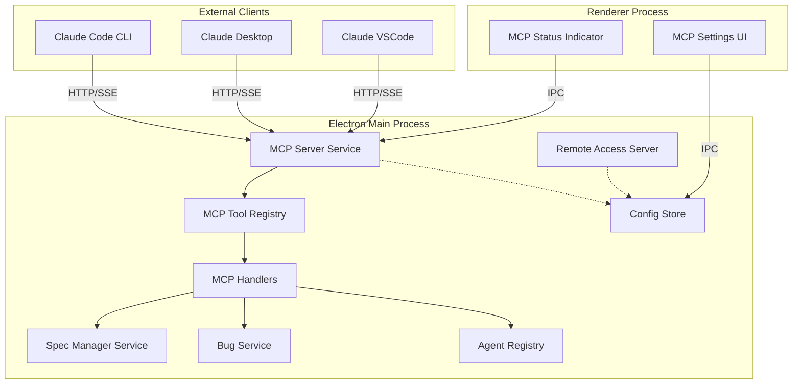
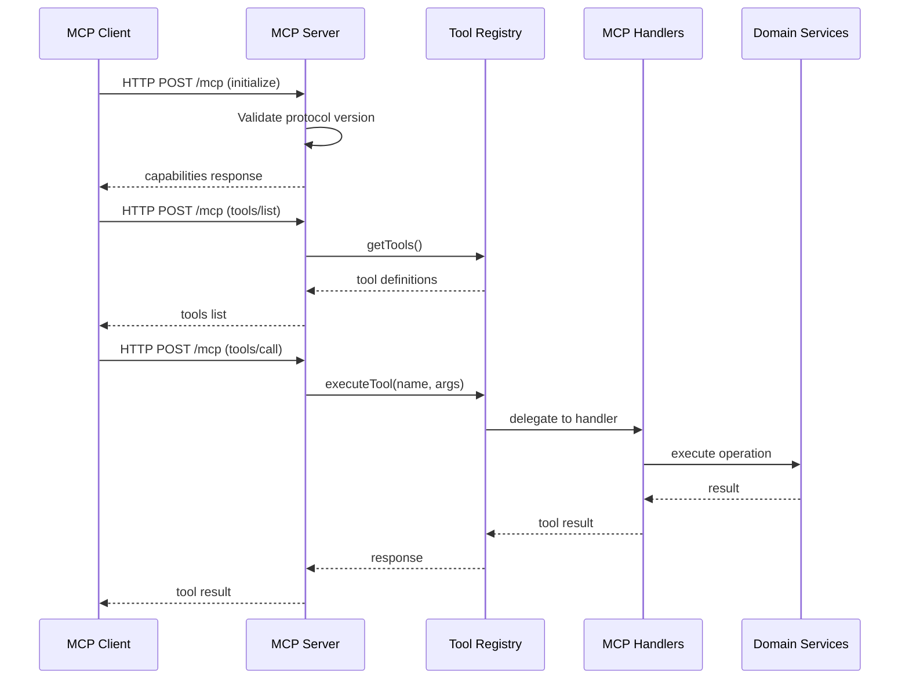
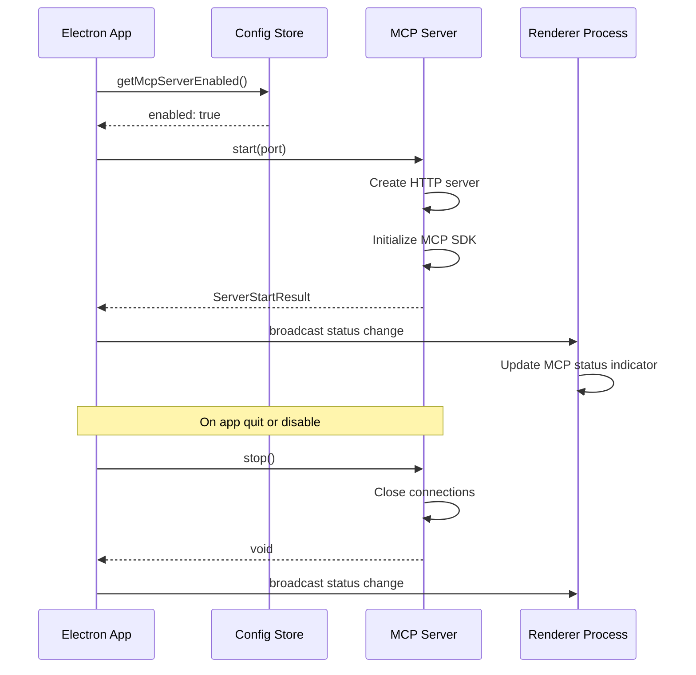
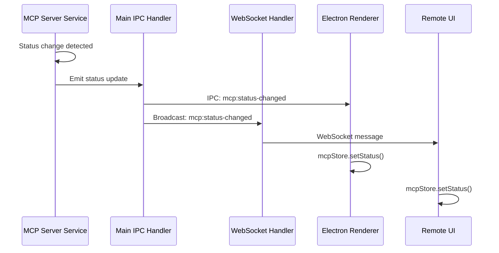
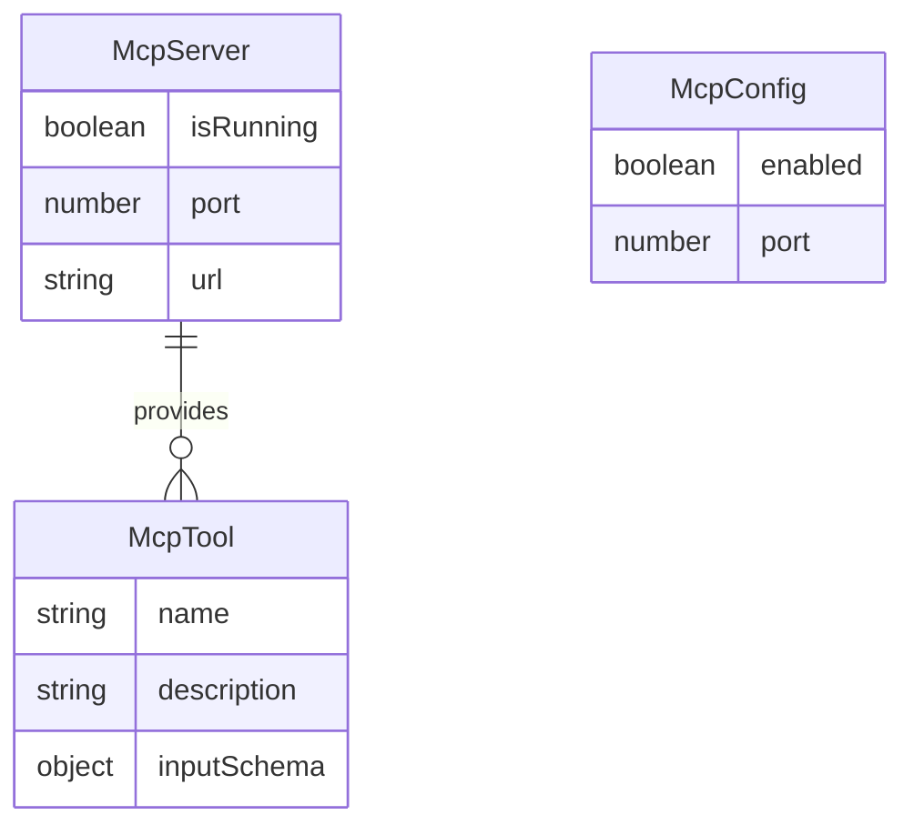

# Design: MCP Server Integration

## Overview

**Purpose**: SDD OrchestratorにMCPサーバー機能を内蔵し、Claude Code（VSCodeプラグイン、CLI）やClaude DesktopなどのMCP対応クライアントから直接Spec/Bug操作を可能にする。

**Users**: AIエージェント（Claude Code等）がスラッシュコマンドを使わずに直接SDD操作を行う。開発者はRemote UIと同様の発想でMCPクライアントからプロジェクト管理を行う。

**Impact**: 既存のRemote Access HTTP/WebSocketサーバーと並行して、MCPプロトコル準拠のHTTP/SSEサーバーを追加。ConfigStoreにMCPサーバー設定を追加し、UIに設定セクションを追加する。

### Goals

- MCPプロトコルに準拠したHTTP/SSEサーバーをElectronアプリ内に組み込む
- プロジェクト・Spec・Bugスコープの操作ツールを提供する
- Remote UIサーバーと同時起動可能にする
- 設定UIからMCPサーバーの有効/無効切り替えとClaude CLI登録コマンドのコピーを可能にする

### Non-Goals

- stdioトランスポート方式のサポート（HTTP/SSEのみ）
- MCPのResources機能（Toolsのみ提供）
- マルチプロジェクト対応（1サーバー = 1プロジェクト）
- MCP経由でのプロジェクト切り替え
- 認証・認可機構（ローカル利用を想定）

## Architecture

### Existing Architecture Analysis

現在のシステムは以下のパターンを採用している：

- **Remote Access Server**: Express/HTTP + WebSocketサーバー（`remoteAccessServer.ts`）
- **WebSocket Handler**: WebSocket経由のIPC-like通信（`webSocketHandler.ts`）
- **ConfigStore**: electron-storeによる永続化設定管理（`configStore.ts`）
- **IPC Pattern**: チャンネル定義 + ハンドラ実装（`channels.ts`, `handlers.ts`）

MCPサーバーはこれらの既存パターンに従い、Remote UIサーバーと同様のアーキテクチャで実装する。

### Architecture Pattern & Boundary Map



**Architecture Integration**:
- **Selected pattern**: Service Layer + Registry Pattern（既存のRemote UIパターンを踏襲）
- **Domain boundaries**: MCPツールはスコープ別（project, spec, bug）に分離し、既存サービスに委譲
- **Existing patterns preserved**: ConfigStore永続化、IPCハンドラパターン、Main Processでのサーバー管理
- **New components rationale**: MCPプロトコル固有の処理を分離するため専用のサーバーとツールレジストリを追加
- **Steering compliance**: Main Processでのサーバー管理、Rendererへの状態ブロードキャスト

### Technology Stack

| Layer | Choice / Version | Role in Feature | Notes |
|-------|------------------|-----------------|-------|
| Backend / Services | @modelcontextprotocol/sdk (latest) | MCP Server実装 | HTTP/SSE transport |
| Backend / Services | Express 4.x | HTTP server middleware | 既存依存 |
| Backend / Services | zod 3.25+ | スキーマバリデーション | MCP SDK peer dependency |
| Data / Storage | electron-store | MCP設定永続化 | 既存configStore拡張 |
| Frontend / UI | React 19 + Tailwind CSS 4 | 設定UIコンポーネント | 既存パターン |

## System Flows

### MCP Client Connection Flow



### MCP Server Lifecycle Flow



## Requirements Traceability

| Criterion ID | Summary | Components | Implementation Approach |
|--------------|---------|------------|------------------------|
| 1.1 | MCPサーバーがHTTP/SSE接続を受け付ける | McpServerService | 新規実装 - MCP SDK使用 |
| 1.2 | MCPハンドシェイク完了 | McpServerService | 新規実装 - MCP SDK initialize処理 |
| 1.3 | プロトコルバージョン互換性検証 | McpServerService | 新規実装 - MCP SDK組み込み機能 |
| 1.4 | プロジェクト未選択時のエラー | McpToolHandlers | 新規実装 - 共通バリデーション |
| 2.1 | project_get_info | ProjectToolHandlers | 新規実装 |
| 2.2 | project_list_specs | ProjectToolHandlers | 既存specManagerService.readSpecs再利用 |
| 2.3 | project_list_specs filter | ProjectToolHandlers | 新規フィルタロジック |
| 2.4 | project_list_bugs | ProjectToolHandlers | 既存bugService.readBugs再利用 |
| 2.5 | project_list_bugs filter | ProjectToolHandlers | 新規フィルタロジック |
| 2.6 | project_list_agents | ProjectToolHandlers | 既存agentRegistry再利用 |
| 3.1 | spec_get | SpecToolHandlers | 既存specManagerService再利用 |
| 3.2 | spec_get存在しない場合エラー | SpecToolHandlers | 新規エラーハンドリング |
| 3.3 | spec_get_artifact | SpecToolHandlers | 既存fileService.readArtifact再利用 |
| 3.4 | artifact種類サポート | SpecToolHandlers | 新規 - ARTIFACT_TYPES定義 |
| 3.5 | artifact存在しない場合エラー | SpecToolHandlers | 新規エラーハンドリング |
| 3.6 | spec_create | SpecToolHandlers | 既存specManagerService.createSpec再利用 |
| 3.7 | spec_create重複エラー | SpecToolHandlers | 新規エラーハンドリング |
| 3.8 | spec_approve | SpecToolHandlers | 既存specManagerService.updateApproval再利用 |
| 3.9 | 全フェーズ承認サポート | SpecToolHandlers | 既存ロジック再利用 |
| 3.10 | spec_start_execution | SpecToolHandlers | 既存autoExecutionCoordinator再利用 |
| 3.11 | spec_stop_execution | SpecToolHandlers | 既存autoExecutionCoordinator再利用 |
| 3.12 | spec_get_execution_status | SpecToolHandlers | 既存autoExecutionCoordinator再利用 |
| 3.13 | spec_agent_stop | SpecToolHandlers | 既存agentRegistry.stopAgent再利用 |
| 3.14 | spec_agent_get_logs | SpecToolHandlers | 既存logFileService再利用 |
| 4.1 | bug_get | BugToolHandlers | 既存bugService.readBugDetail再利用 |
| 4.2 | bug_get存在しない場合エラー | BugToolHandlers | 新規エラーハンドリング |
| 4.3 | bug_get_artifact | BugToolHandlers | 既存fileService.readArtifact再利用 |
| 4.4 | bug artifact種類サポート | BugToolHandlers | 新規 - BUG_ARTIFACT_TYPES定義 |
| 4.5 | bug artifact存在しない場合エラー | BugToolHandlers | 新規エラーハンドリング |
| 4.6 | bug_create | BugToolHandlers | 既存bugService再利用 |
| 4.7 | bug_create重複エラー | BugToolHandlers | 新規エラーハンドリング |
| 4.8 | bug_update_phase | BugToolHandlers | 既存bugWorkflowService再利用 |
| 4.9 | bug_start_execution | BugToolHandlers | 既存bugAutoExecutionCoordinator再利用 |
| 4.10 | bug_stop_execution | BugToolHandlers | 既存bugAutoExecutionCoordinator再利用 |
| 4.11 | bug_get_execution_status | BugToolHandlers | 既存bugAutoExecutionCoordinator再利用 |
| 4.12 | bug_agent_stop | BugToolHandlers | 既存agentRegistry.stopAgent再利用 |
| 4.13 | bug_agent_get_logs | BugToolHandlers | 既存logFileService再利用 |
| 5.1 | MCPとRemote UI同時起動 | McpServerService, RemoteAccessServer | 新規実装 - 独立ポート管理 |
| 5.2 | 同一ポートエラー | McpServerService | 新規エラーハンドリング |
| 5.3 | MCPポート独立設定 | ConfigStore | 新規設定フィールド追加 |
| 6.1 | アプリ起動時のMCP自動起動 | index.ts | 新規起動ロジック |
| 6.2 | 設定画面MCPセクション | McpSettingsPanel | 新規UIコンポーネント |
| 6.3 | MCPサーバー無効化 | McpSettingsPanel, McpServerService | 新規 - IPCハンドラ経由 |
| 6.4 | MCPサーバー有効化 | McpSettingsPanel, McpServerService | 新規 - IPCハンドラ経由 |
| 6.5 | ポート番号設定変更 | McpSettingsPanel | 新規UI |
| 6.6 | claude mcp addコマンド表示 | McpSettingsPanel | 新規UI |
| 6.7 | コマンドにプロジェクトパス含む | McpSettingsPanel | 新規ロジック |
| 6.8 | コピーボタン | McpSettingsPanel | 新規UI |
| 6.9 | ステータスインジケータ | McpStatusIndicator | 新規UIコンポーネント |
| 6.10 | Remote UIでのステータス表示のみ | McpStatusIndicator | PlatformProvider活用 |

### Coverage Validation Checklist

- [x] Every criterion ID from requirements.md appears in the table above
- [x] Each criterion has specific component names (not generic references)
- [x] Implementation approach distinguishes "reuse existing" vs "new implementation"
- [x] User-facing criteria specify concrete UI components (not just "shared components")

## Components and Interfaces

| Component | Domain/Layer | Intent | Req Coverage | Key Dependencies | Contracts |
|-----------|--------------|--------|--------------|------------------|-----------|
| McpServerService | Main/Services | MCP HTTP/SSEサーバー管理 | 1.1-1.4, 5.1-5.3 | MCP SDK, ConfigStore (P0) | Service |
| McpToolRegistry | Main/Services | MCPツール登録・実行管理 | All tool reqs | McpServerService (P0) | Service |
| ProjectToolHandlers | Main/Services | project_*ツール実装 | 2.1-2.6 | SpecManagerService, BugService (P0) | Service |
| SpecToolHandlers | Main/Services | spec_*ツール実装 | 3.1-3.14 | SpecManagerService, FileService (P0) | Service |
| BugToolHandlers | Main/Services | bug_*ツール実装 | 4.1-4.13 | BugService, BugWorkflowService (P0) | Service |
| McpIpcHandlers | Main/IPC | MCP関連IPCハンドラ | 6.1-6.5 | McpServerService, ConfigStore (P0) | API |
| McpSettingsPanel | Renderer/Components | MCP設定UIパネル | 6.2-6.8 | electronAPI (P0) | State |
| McpStatusIndicator | Shared/Components | MCPサーバー状態表示 | 6.9-6.10 | mcpStore (P0) | State |

### Main / Services

#### McpServerService

| Field | Detail |
|-------|--------|
| Intent | MCP準拠HTTP/SSEサーバーのライフサイクル管理 |
| Requirements | 1.1, 1.2, 1.3, 1.4, 5.1, 5.2, 5.3 |

**Responsibilities & Constraints**
- HTTP/SSEサーバーの起動・停止・状態管理
- MCPプロトコルハンドシェイク処理
- ポート競合検出と適切なエラー返却
- プロジェクト選択状態の検証

**Dependencies**
- Inbound: index.ts — アプリ起動時の自動起動 (P0)
- Inbound: McpIpcHandlers — 手動起動/停止制御 (P0)
- Outbound: McpToolRegistry — ツール実行委譲 (P0)
- Outbound: ConfigStore — 設定読み取り (P0)
- External: @modelcontextprotocol/sdk — MCPプロトコル実装 (P0)

**Contracts**: Service [x] / API [ ] / Event [ ] / Batch [ ] / State [ ]

##### Service Interface

```typescript
interface McpServerService {
  /** サーバー起動 */
  start(port?: number): Promise<Result<McpServerStartResult, McpServerError>>;

  /** サーバー停止 */
  stop(): Promise<void>;

  /** 現在の状態取得 */
  getStatus(): McpServerStatus;

  /** 状態変更通知の購読 */
  onStatusChange(callback: (status: McpServerStatus) => void): () => void;
}

interface McpServerStartResult {
  readonly port: number;
  readonly url: string;
}

interface McpServerStatus {
  readonly isRunning: boolean;
  readonly port: number | null;
  readonly url: string | null;
}

type McpServerError =
  | { type: 'NO_AVAILABLE_PORT'; triedPorts: number[] }
  | { type: 'ALREADY_RUNNING'; port: number }
  | { type: 'PORT_IN_USE'; port: number }
  | { type: 'NETWORK_ERROR'; message: string };
```

- Preconditions: ConfigStoreが初期化済み
- Postconditions: サーバー起動後はMCPクライアントから接続可能
- Invariants: 同時に1つのMCPサーバーのみ稼働

**Implementation Notes**
- Integration: MCP SDK の `McpServer` + Express middleware または標準HTTP を使用
- Validation: MCPプロトコルバージョンはSDKが自動検証
- Risks: Remote UIサーバーとのポート競合

#### McpToolRegistry

| Field | Detail |
|-------|--------|
| Intent | MCPツールの登録・検索・実行を管理 |
| Requirements | 2.1-2.6, 3.1-3.14, 4.1-4.13 |

**Responsibilities & Constraints**
- 全ツール定義の一元管理
- ツール実行時のパラメータバリデーション
- 適切なハンドラへの委譲
- プロジェクト未選択時の共通エラー処理

**Dependencies**
- Inbound: McpServerService — ツール実行要求 (P0)
- Outbound: ProjectToolHandlers, SpecToolHandlers, BugToolHandlers — 実行委譲 (P0)
- External: zod — スキーマバリデーション (P0)

**Contracts**: Service [x] / API [ ] / Event [ ] / Batch [ ] / State [ ]

##### Service Interface

```typescript
interface McpToolRegistry {
  /** ツール一覧取得 */
  getTools(): McpToolDefinition[];

  /** ツール実行 */
  executeTool(name: string, args: unknown): Promise<McpToolResult>;

  /** プロジェクトパス設定 */
  setProjectPath(path: string | null): void;
}

interface McpToolDefinition {
  readonly name: string;
  readonly description: string;
  readonly inputSchema: z.ZodType;
}

type McpToolResult =
  | { ok: true; content: McpToolContent[] }
  | { ok: false; error: McpToolError };

interface McpToolContent {
  readonly type: 'text';
  readonly text: string;
}

interface McpToolError {
  readonly code: string;
  readonly message: string;
}
```

- Preconditions: ツールハンドラが登録済み
- Postconditions: 実行結果またはエラーを返却
- Invariants: 未登録ツールへのアクセスはエラー

#### ProjectToolHandlers

| Field | Detail |
|-------|--------|
| Intent | project_*スコープのMCPツール実装 |
| Requirements | 2.1, 2.2, 2.3, 2.4, 2.5, 2.6 |

**Responsibilities & Constraints**
- プロジェクト情報の取得
- Spec/Bug/Agent一覧の取得とフィルタリング
- 既存サービスへの委譲

**Dependencies**
- Inbound: McpToolRegistry — ツール実行要求 (P0)
- Outbound: SpecManagerService — Spec一覧取得 (P0)
- Outbound: BugService — Bug一覧取得 (P0)
- Outbound: AgentRegistry — Agent一覧取得 (P0)

**Contracts**: Service [x] / API [ ] / Event [ ] / Batch [ ] / State [ ]

##### Service Interface

```typescript
interface ProjectToolHandlers {
  /** プロジェクト情報取得 */
  getInfo(projectPath: string): Promise<ProjectInfo>;

  /** Spec一覧取得 */
  listSpecs(projectPath: string, filter?: SpecFilter): Promise<SpecListResult>;

  /** Bug一覧取得 */
  listBugs(projectPath: string, filter?: BugFilter): Promise<BugListResult>;

  /** Agent一覧取得 */
  listAgents(): Promise<AgentListResult>;
}

interface ProjectInfo {
  readonly path: string;
  readonly name: string;
  readonly hasKiroDir: boolean;
  readonly hasSteeringDir: boolean;
  readonly hasSpecsDir: boolean;
  readonly hasBugsDir: boolean;
}

interface SpecFilter {
  readonly phase?: string;
  readonly hasWorktree?: boolean;
}

interface BugFilter {
  readonly phase?: string;
}

interface SpecListResult {
  readonly specs: SpecInfo[];
  readonly total: number;
}

interface BugListResult {
  readonly bugs: BugInfo[];
  readonly total: number;
}

interface AgentListResult {
  readonly agents: AgentInfo[];
  readonly total: number;
}
```

#### SpecToolHandlers

| Field | Detail |
|-------|--------|
| Intent | spec_*スコープのMCPツール実装 |
| Requirements | 3.1-3.14 |

**Responsibilities & Constraints**
- Spec詳細・アーティファクト取得
- Spec作成・承認操作
- 自動実行制御
- Agent操作

**Dependencies**
- Inbound: McpToolRegistry — ツール実行要求 (P0)
- Outbound: SpecManagerService — Spec操作 (P0)
- Outbound: FileService — アーティファクト読み取り (P0)
- Outbound: AutoExecutionCoordinator — 自動実行制御 (P0)
- Outbound: AgentRegistry — Agent操作 (P0)
- Outbound: LogFileService — ログ取得 (P0)

**Contracts**: Service [x] / API [ ] / Event [ ] / Batch [ ] / State [ ]

##### Service Interface

```typescript
interface SpecToolHandlers {
  /** Spec詳細取得 */
  get(projectPath: string, name: string): Promise<Result<SpecDetail, SpecError>>;

  /** アーティファクト取得 */
  getArtifact(projectPath: string, name: string, artifact: SpecArtifactType): Promise<Result<string, SpecError>>;

  /** Spec作成 */
  create(projectPath: string, name: string, description?: string): Promise<Result<void, SpecError>>;

  /** 承認 */
  approve(projectPath: string, name: string, phase: ApprovalPhase): Promise<Result<void, SpecError>>;

  /** 自動実行開始 */
  startExecution(projectPath: string, name: string): Promise<Result<void, SpecError>>;

  /** 自動実行停止 */
  stopExecution(projectPath: string, name: string): Promise<Result<void, SpecError>>;

  /** 自動実行状態取得 */
  getExecutionStatus(projectPath: string, name: string): Promise<ExecutionStatus | null>;

  /** Agent停止 */
  stopAgent(name: string): Promise<Result<void, SpecError>>;

  /** Agentログ取得 */
  getAgentLogs(name: string, lines?: number): Promise<Result<LogEntry[], SpecError>>;
}

type SpecArtifactType = 'requirements' | 'design' | 'tasks' | 'inspection' | 'document-review' | 'reply';

type ApprovalPhase = 'requirements' | 'design' | 'tasks';

type SpecError =
  | { type: 'NOT_FOUND'; name: string }
  | { type: 'ALREADY_EXISTS'; name: string }
  | { type: 'ARTIFACT_NOT_FOUND'; name: string; artifact: string }
  | { type: 'INVALID_PHASE'; phase: string }
  | { type: 'AGENT_NOT_FOUND'; name: string };
```

#### BugToolHandlers

| Field | Detail |
|-------|--------|
| Intent | bug_*スコープのMCPツール実装 |
| Requirements | 4.1-4.13 |

**Responsibilities & Constraints**
- Bug詳細・アーティファクト取得
- Bug作成・フェーズ更新
- 自動実行制御
- Agent操作

**Dependencies**
- Inbound: McpToolRegistry — ツール実行要求 (P0)
- Outbound: BugService — Bug操作 (P0)
- Outbound: BugWorkflowService — ワークフロー制御 (P0)
- Outbound: BugAutoExecutionCoordinator — 自動実行制御 (P0)
- Outbound: AgentRegistry — Agent操作 (P0)
- Outbound: LogFileService — ログ取得 (P0)

**Contracts**: Service [x] / API [ ] / Event [ ] / Batch [ ] / State [ ]

##### Service Interface

```typescript
interface BugToolHandlers {
  /** Bug詳細取得 */
  get(projectPath: string, name: string): Promise<Result<BugDetail, BugError>>;

  /** アーティファクト取得 */
  getArtifact(projectPath: string, name: string, artifact: BugArtifactType): Promise<Result<string, BugError>>;

  /** Bug作成 */
  create(projectPath: string, name: string, description: string): Promise<Result<void, BugError>>;

  /** フェーズ更新 */
  updatePhase(projectPath: string, name: string, phase: BugPhase): Promise<Result<void, BugError>>;

  /** 自動実行開始 */
  startExecution(projectPath: string, name: string): Promise<Result<void, BugError>>;

  /** 自動実行停止 */
  stopExecution(projectPath: string, name: string): Promise<Result<void, BugError>>;

  /** 自動実行状態取得 */
  getExecutionStatus(projectPath: string, name: string): Promise<BugExecutionStatus | null>;

  /** Agent停止 */
  stopAgent(name: string): Promise<Result<void, BugError>>;

  /** Agentログ取得 */
  getAgentLogs(name: string, lines?: number): Promise<Result<LogEntry[], BugError>>;
}

type BugArtifactType = 'bug' | 'analysis' | 'fix' | 'verify';

type BugPhase = 'reported' | 'analyzed' | 'fixed' | 'verified' | 'deployed';

type BugError =
  | { type: 'NOT_FOUND'; name: string }
  | { type: 'ALREADY_EXISTS'; name: string }
  | { type: 'ARTIFACT_NOT_FOUND'; name: string; artifact: string }
  | { type: 'INVALID_PHASE'; phase: string }
  | { type: 'AGENT_NOT_FOUND'; name: string };
```

### Main / IPC

#### McpIpcHandlers

| Field | Detail |
|-------|--------|
| Intent | MCP関連のIPCハンドラ |
| Requirements | 6.1-6.5 |

**Dependencies**
- Inbound: Renderer Process — IPC経由 (P0)
- Outbound: McpServerService — サーバー制御 (P0)
- Outbound: ConfigStore — 設定管理 (P0)

**Contracts**: Service [ ] / API [x] / Event [ ] / Batch [ ] / State [ ]

##### API Contract

| Method | Endpoint | Request | Response | Errors |
|--------|----------|---------|----------|--------|
| invoke | mcp:start | void | McpServerStartResult | PORT_IN_USE |
| invoke | mcp:stop | void | void | - |
| invoke | mcp:get-status | void | McpServerStatus | - |
| invoke | mcp:get-settings | void | McpSettings | - |
| invoke | mcp:set-enabled | boolean | void | - |
| invoke | mcp:set-port | number | void | - |

### Renderer / Components

#### McpSettingsPanel

| Field | Detail |
|-------|--------|
| Intent | MCP設定UIパネル |
| Requirements | 6.2, 6.3, 6.4, 6.5, 6.6, 6.7, 6.8 |

**Responsibilities & Constraints**
- MCPサーバー有効/無効トグル
- ポート番号設定
- `claude mcp add`コマンド生成・コピー機能
- 既存CloudflareSettingsPanelと同様のUI/UXパターン

**Dependencies**
- Inbound: RemoteAccessDialog — 設定UI内に配置 (P1)
- Outbound: electronAPI — IPC経由での設定操作 (P0)
- Outbound: projectStore — プロジェクトパス取得 (P0)

**Contracts**: Service [ ] / API [ ] / Event [ ] / Batch [ ] / State [x]

##### State Management

```typescript
interface McpSettingsPanelState {
  /** MCPサーバー有効フラグ */
  enabled: boolean;
  /** ポート番号 */
  port: number;
  /** 保存中フラグ */
  isSaving: boolean;
  /** 保存成功フラグ */
  saveSuccess: boolean;
}
```

**Implementation Notes**
- Integration: RemoteAccessDialogに追加セクションとして配置
- Validation: ポート番号は1024-65535の範囲
- Risks: ポート変更時はサーバー再起動が必要

#### McpStatusIndicator

| Field | Detail |
|-------|--------|
| Intent | MCPサーバー稼働状態インジケータ |
| Requirements | 6.9, 6.10 |

**Responsibilities & Constraints**
- MCPサーバーの稼働状態をアイコンで表示
- クリックでMCP設定ダイアログを開く（Desktop版のみ）
- Remote UIではステータス表示のみ

**Dependencies**
- Outbound: mcpStore — 状態取得 (P0)
- Outbound: PlatformProvider — プラットフォーム判定 (P1)

**Contracts**: Service [ ] / API [ ] / Event [ ] / Batch [ ] / State [x]

**Implementation Notes**
- Integration: Headerコンポーネント内に配置（既存SSHStatusIndicatorと同様）
- Validation: なし
- Risks: なし

### Shared / Stores

#### mcpStore

| Field | Detail |
|-------|--------|
| Intent | MCPサーバー状態のRenderer側キャッシュ |
| Requirements | 6.9, 6.10 |

**Contracts**: Service [ ] / API [ ] / Event [ ] / Batch [ ] / State [x]

##### State Management

```typescript
interface McpStoreState {
  /** サーバー稼働中フラグ */
  isRunning: boolean;
  /** ポート番号 */
  port: number | null;
  /** サーバーURL */
  url: string | null;
}

interface McpStoreActions {
  /** 状態更新 */
  setStatus(status: McpServerStatus): void;
}
```

##### Remote UI Synchronization Flow

mcpStoreはshared/stores配下に配置され、Electron/Remote UI両環境で共有される。既存のbugAutoExecutionStoreと同様のパターンで状態同期を行う。

**Electron環境**:
- Main ProcessのMcpServerServiceが状態変更を検知
- IPC経由でRenderer Processに通知
- mcpStore.setStatus()で状態更新

**Remote UI環境**:
- Main ProcessがWebSocket経由でMCP状態変更をブロードキャスト
- WebSocketApiClientがメッセージを受信
- mcpStore.setStatus()で状態更新



## Data Models

### Domain Model



### Logical Data Model

**MCP Configuration (ConfigStore Extension)**:

```typescript
interface McpConfig {
  /** MCPサーバー有効フラグ */
  enabled: boolean;
  /** ポート番号（デフォルト: 3001） */
  port: number;
}
```

**MCP Tool Definitions**:

| Tool Name | Description | Input Schema | Output |
|-----------|-------------|--------------|--------|
| project_get_info | プロジェクト情報取得 | none | ProjectInfo |
| project_list_specs | Spec一覧取得 | { filter?: SpecFilter } | SpecListResult |
| project_list_bugs | Bug一覧取得 | { filter?: BugFilter } | BugListResult |
| project_list_agents | Agent一覧取得 | none | AgentListResult |
| spec_get | Spec詳細取得 | { name: string } | SpecDetail |
| spec_get_artifact | アーティファクト取得 | { name: string, artifact: SpecArtifactType } | string |
| spec_create | Spec作成 | { name: string, description?: string } | void |
| spec_approve | 承認 | { name: string, phase: ApprovalPhase } | void |
| spec_start_execution | 自動実行開始 | { name: string } | void |
| spec_stop_execution | 自動実行停止 | { name: string } | void |
| spec_get_execution_status | 自動実行状態取得 | { name: string } | ExecutionStatus |
| spec_agent_stop | Agent停止 | { name: string } | void |
| spec_agent_get_logs | Agentログ取得 | { name: string, lines?: number } | LogEntry[] |
| bug_get | Bug詳細取得 | { name: string } | BugDetail |
| bug_get_artifact | アーティファクト取得 | { name: string, artifact: BugArtifactType } | string |
| bug_create | Bug作成 | { name: string, description: string } | void |
| bug_update_phase | フェーズ更新 | { name: string, phase: BugPhase } | void |
| bug_start_execution | 自動実行開始 | { name: string } | void |
| bug_stop_execution | 自動実行停止 | { name: string } | void |
| bug_get_execution_status | 自動実行状態取得 | { name: string } | BugExecutionStatus |
| bug_agent_stop | Agent停止 | { name: string } | void |
| bug_agent_get_logs | Agentログ取得 | { name: string, lines?: number } | LogEntry[] |

## Error Handling

### Error Strategy

MCPプロトコルに準拠したエラーレスポンスを返却する。エラーはMCPの`isError: true`レスポンス形式で返却。

### Error Categories and Responses

**User Errors (Tool Input)**:
- `INVALID_ARGUMENT`: パラメータバリデーション失敗 → 入力値の説明
- `NOT_FOUND`: Spec/Bug/Artifact未発見 → 存在するリソースの確認を促す

**System Errors (Server)**:
- `NO_PROJECT_SELECTED`: プロジェクト未選択 → プロジェクト選択を促す
- `TOOL_NOT_FOUND`: 未知のツール → 利用可能ツール一覧を返す
- `INTERNAL_ERROR`: 内部エラー → エラーメッセージと再試行ガイダンス

**Business Logic Errors**:
- `ALREADY_EXISTS`: 重複作成 → 既存リソースの確認を促す
- `INVALID_PHASE`: 無効なフェーズ → 有効なフェーズ一覧を返す

## Testing Strategy

### Unit Tests

- McpToolRegistry: ツール登録・検索・実行テスト
- ProjectToolHandlers: 各ツールの正常系・異常系テスト
- SpecToolHandlers: 各ツールの正常系・異常系テスト
- BugToolHandlers: 各ツールの正常系・異常系テスト
- ConfigStore: MCP設定の読み書きテスト

### Integration Tests

- McpServerService + McpToolRegistry: サーバー起動〜ツール実行フロー
- McpServerService + ConfigStore: 設定変更時のサーバー再起動
- Remote UIサーバーとの同時起動テスト

### E2E Tests

- MCPクライアントからの接続・ツール呼び出し
- 設定UIからのMCPサーバー制御
- `claude mcp add`コマンドのコピー・貼り付けフロー

## Design Decisions

### DD-001: HTTP/SSE Transport Selection

| Field | Detail |
|-------|--------|
| Status | Accepted |
| Context | MCPには stdio と HTTP/SSE の2つのトランスポート方式がある。Electronアプリ内に組み込むサーバーの方式を決定する必要がある。 |
| Decision | HTTP/SSE方式を採用する。 |
| Rationale | Electronアプリは常駐しており、Remote UIと同様のHTTPサーバー方式が自然。stdioはプロセス起動型のため、常駐アプリには不向き。 |
| Alternatives Considered | 1. stdio: プロセス起動型、Electronとの統合が複雑 2. Streamable HTTP: MCP推奨だが2025年時点でClaude CodeのSSEサポートが先行 |
| Consequences | MCPクライアントはSSE接続で通知を受け取る。古いプロトコルバージョン（2024-11-05）との互換性を維持。 |

### DD-002: Tools-Only Design

| Field | Detail |
|-------|--------|
| Status | Accepted |
| Context | MCPにはResources（読み取り専用データ、URI形式）とTools（実行可能なアクション）の2つのプリミティブがある。 |
| Decision | Tools中心で設計し、Resourcesは実装しない。 |
| Rationale | AIエージェントは「ツールを呼び出す」パターンに最適化されている。動的に変わるSpec/Bug一覧はToolsの方が適切。 |
| Alternatives Considered | 1. Resources for read-only data: URI設計が複雑化 2. Hybrid: 実装・保守コスト増加 |
| Consequences | 全操作がTools経由となり、一貫したインターフェース。読み取り専用操作も副作用なしのToolsとして実装。 |

### DD-003: Single Project per Server

| Field | Detail |
|-------|--------|
| Status | Accepted |
| Context | SDD Orchestratorは複数プロジェクトに対応しているが、MCP経由でのアクセスをどう設計するか。 |
| Decision | 1サーバー = 1プロジェクト（Remote UIと同じ）とする。 |
| Rationale | シンプルさを優先。MCPクライアント側でプロジェクト切り替えは行わず、Electronアプリ側で選択したプロジェクトに対してのみ操作可能。 |
| Alternatives Considered | 1. マルチプロジェクト: ツール引数にprojectPathを追加 → 複雑化 2. プロジェクト切り替えツール: セッション管理が必要 |
| Consequences | プロジェクト未選択時はツール呼び出しがエラー。ユーザーはElectronアプリでプロジェクトを選択してからMCPを使用。 |

### DD-004: Scope-based Tool Naming

| Field | Detail |
|-------|--------|
| Status | Accepted |
| Context | MCPツールの命名規則とスコープ分離について決定する必要がある。 |
| Decision | スコープ別プレフィックスで統一（`project_*`, `spec_*`, `bug_*`）。 |
| Rationale | 一貫性があり、AIエージェントがツールを発見・選択しやすい。Agent操作もスコープに紐づくため`spec_agent_*`形式が自然。 |
| Alternatives Considered | 1. 独立した`agent_*`プレフィックス: スコープとの関係が不明確 2. フラットな命名: ツール数増加時に混乱 |
| Consequences | ツール名が明確にスコープを示す。将来のスコープ追加も同じパターンで対応可能。 |

### DD-005: Auto-start with Disable Option

| Field | Detail |
|-------|--------|
| Status | Accepted |
| Context | MCPサーバーの起動/停止を手動制御にするか、自動起動にするか。 |
| Decision | 自動起動（設定で無効化可能）とする。 |
| Rationale | MCPの価値は「いつでも使える」こと。手動起動だと接続前に追加ステップが必要になる。不要な場合は設定でオフにできれば十分。 |
| Alternatives Considered | 1. 手動起動のみ: 使い始めのハードルが高い 2. 常時起動（無効化不可）: リソース節約オプションがない |
| Consequences | アプリ起動時にMCPサーバーも起動。ポート使用・リソース消費が発生するが、設定で無効化可能。 |

### DD-006: Independent Port from Remote UI

| Field | Detail |
|-------|--------|
| Status | Accepted |
| Context | MCPサーバーとRemote UIサーバーのポート管理方針を決定する必要がある。 |
| Decision | MCPサーバー用に独立したポート（デフォルト: 3001）を使用する。 |
| Rationale | 2つのサーバーは異なるプロトコル（MCP vs WebSocket）を使用し、同時起動が必要。ポート競合を避けるため独立管理。 |
| Alternatives Considered | 1. 同一ポートでパス分離: Express routingが複雑化 2. 排他的使用: 機能制限 |
| Consequences | 2つのポートが使用される。設定画面で両方のポートを管理可能。 |

## Integration & Deprecation Strategy

### 結合ポイント（既存ファイルの修正が必要）

| File | Modification | Purpose |
|------|--------------|---------|
| `electron-sdd-manager/src/main/index.ts` | MCP自動起動ロジック追加 | アプリ起動時のMCPサーバー起動 |
| `electron-sdd-manager/src/main/services/configStore.ts` | MCP設定フィールド追加 | MCP有効/無効、ポート設定の永続化 |
| `electron-sdd-manager/src/main/ipc/channels.ts` | MCP関連チャンネル定義追加 | IPC通信用 |
| `electron-sdd-manager/src/main/ipc/handlers.ts` | McpIpcHandlers登録 | IPCハンドラ登録 |
| `electron-sdd-manager/src/preload/index.ts` | MCP API追加 | Renderer向けAPI公開 |
| `electron-sdd-manager/src/renderer/components/RemoteAccessDialog.tsx` | McpSettingsPanel追加 | 設定UIセクション追加 |
| `electron-sdd-manager/src/renderer/App.tsx` | McpStatusIndicator追加 | ヘッダーにステータス表示 |
| `electron-sdd-manager/package.json` | MCP SDK依存追加 | @modelcontextprotocol/sdk |

### 新規作成ファイル

| File | Purpose |
|------|---------|
| `electron-sdd-manager/src/main/services/mcpServerService.ts` | MCPサーバー管理 |
| `electron-sdd-manager/src/main/services/mcpToolRegistry.ts` | ツール登録・実行管理 |
| `electron-sdd-manager/src/main/services/mcpHandlers/projectToolHandlers.ts` | project_*ツール実装 |
| `electron-sdd-manager/src/main/services/mcpHandlers/specToolHandlers.ts` | spec_*ツール実装 |
| `electron-sdd-manager/src/main/services/mcpHandlers/bugToolHandlers.ts` | bug_*ツール実装 |
| `electron-sdd-manager/src/main/ipc/mcpHandlers.ts` | MCP関連IPCハンドラ |
| `electron-sdd-manager/src/renderer/components/McpSettingsPanel.tsx` | MCP設定UIパネル |
| `electron-sdd-manager/src/shared/components/McpStatusIndicator.tsx` | MCPステータスインジケータ |
| `electron-sdd-manager/src/shared/stores/mcpStore.ts` | MCPサーバー状態Store |

### 廃止・削除ファイル

該当なし。本機能は純粋な追加機能であり、既存ファイルの削除は不要。
