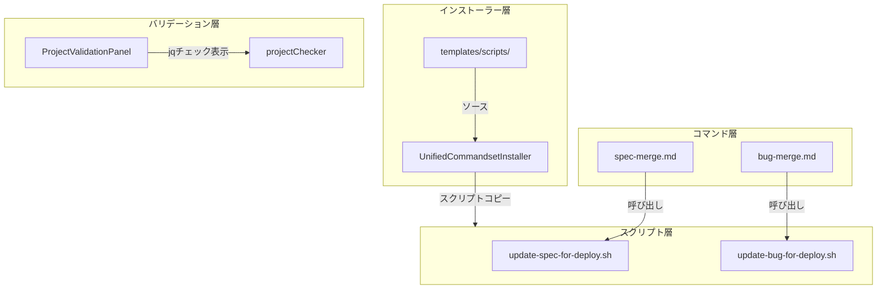
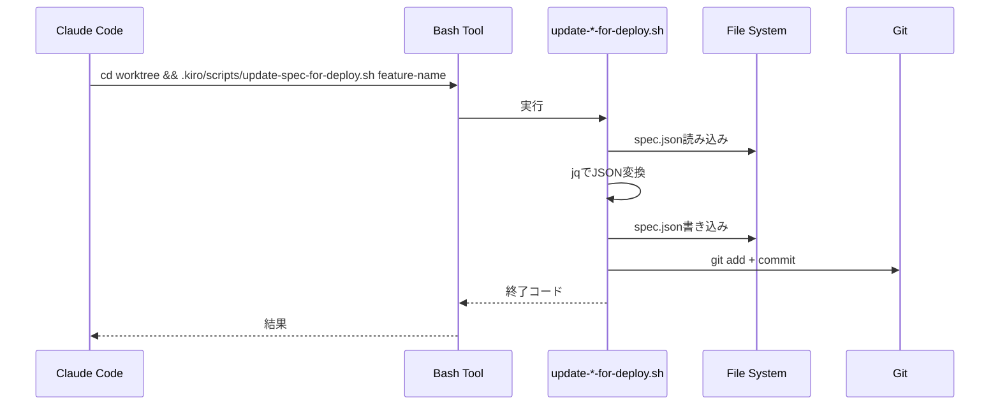
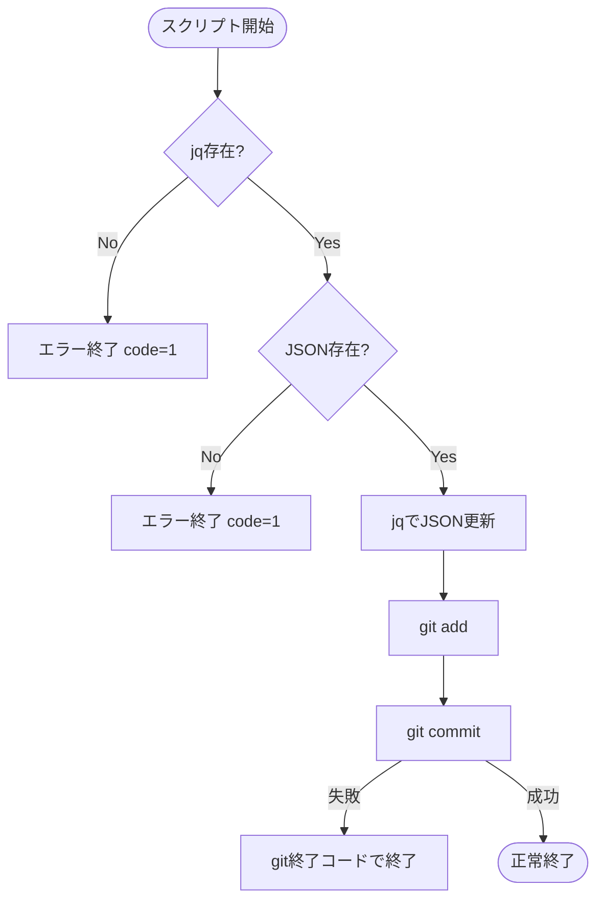

# Design: Merge Helper Scripts

## Overview

**Purpose**: spec-merge/bug-mergeのworktree内でのjson更新+コミット処理をシェルスクリプト化し、AIがcwdを間違えるリスクを排除する。

**Users**: Claude Code/Kiro AI Agentがspec-merge、bug-mergeコマンド実行時に使用する。

**Impact**: 既存のspec-merge.md、bug-merge.mdコマンドの内部実装を変更し、インライン操作をスクリプト呼び出しに置き換える。

### Goals
- spec.json/bug.json更新+コミットをシェルスクリプトで確実にworktree内で実行
- コマンドセットインストール時にスクリプトを自動インストール
- プロジェクトバリデーションでjqコマンドの存在確認

### Non-Goals
- スクリプトのテスト自動化（手動テストで確認）
- jq以外のJSON操作ツールへの対応
- spec-merge/bug-mergeの他のステップのスクリプト化
- Windowsバッチファイル対応

## Architecture

### Existing Architecture Analysis

#### 現在のspec-merge.md Step 2.3の処理
```markdown
1. Read spec.json
2. Apply changes (Read/Editツールで直接編集)
3. Stage and commit (Bashでgit add/commit)
```

この処理はAIがcwdを正しく維持する必要があり、`cd`コマンドの省略や誤解釈でproject rootのspec.jsonを更新してしまう問題が発生している。

#### 現在のbug-merge.mdの処理
```markdown
1. Squash merge to main
2. Cleanup worktree
3. Update bug.json (main側で更新) ← spec-mergeと非対称
```

bug-mergeはmerge後にmain側でbug.jsonを更新する設計だが、spec-mergeのようにworktree内でコミット→mergeに統一することで、squash mergeで全変更がまとまるようになる。

### Architecture Pattern & Boundary Map



**Architecture Integration**:
- Selected pattern: スクリプト抽象化パターン - 複雑なシェル操作をスクリプトにカプセル化
- Domain boundaries: コマンド（AI指示）→ スクリプト（実行ロジック）→ ファイル操作
- Existing patterns preserved: UnifiedCommandsetInstallerの既存のファイルコピー機構を拡張
- New components rationale: スクリプト層を追加することでAIの解釈ミスを排除
- Steering compliance: DRY（重複コード削減）、KISS（単純なbashスクリプト）

### Technology Stack

| Layer | Choice / Version | Role in Feature | Notes |
|-------|------------------|-----------------|-------|
| Scripts | Bash + jq | JSON更新・gitコミット | POSIX互換、jqはJSON操作に最適 |
| Backend / Services | TypeScript (Node.js) | スクリプトインストール | 既存UnifiedCommandsetInstallerを拡張 |
| Frontend | React + TypeScript | jqチェック表示 | 既存ProjectValidationPanelを拡張 |

### Command Prompt Architecture (Claude Code features)

**Execution Model**:
- [x] CLI invocation: External process with file-based data exchange

**Rationale**: スクリプトはBashツールで直接実行される。AIはスクリプトを呼び出すだけで、内部のjq/git操作を意識しない。

**Data Flow**:


## System Flows

### スクリプト実行フロー



**Key Decisions**:
- jqとファイル存在チェックをスクリプト冒頭で実施し、早期エラー検出
- git操作の失敗はそのまま終了コードとして伝播

## Requirements Traceability

| Criterion ID | Summary | Components | Implementation Approach |
|--------------|---------|------------|------------------------|
| 1.1 | update-spec-for-deploy.sh実行時の処理 | `update-spec-for-deploy.sh` | New implementation |
| 1.2 | jq未インストール時のエラー | `update-spec-for-deploy.sh` | New implementation |
| 1.3 | spec.json未存在時のエラー | `update-spec-for-deploy.sh` | New implementation |
| 1.4 | git commit失敗時の終了コード | `update-spec-for-deploy.sh` | New implementation |
| 2.1 | update-bug-for-deploy.sh実行時の処理 | `update-bug-for-deploy.sh` | New implementation |
| 2.2 | jq未インストール時のエラー | `update-bug-for-deploy.sh` | New implementation |
| 2.3 | bug.json未存在時のエラー | `update-bug-for-deploy.sh` | New implementation |
| 2.4 | git commit失敗時の終了コード | `update-bug-for-deploy.sh` | New implementation |
| 3.1 | プロファイルインストール時のスクリプトコピー | `UnifiedCommandsetInstaller`, `CcSddWorkflowInstaller` | Extend existing |
| 3.2 | 実行権限(chmod +x)設定 | `CcSddWorkflowInstaller` | Extend existing |
| 3.3 | .kiro/scripts/ディレクトリ作成 | `CcSddWorkflowInstaller` | Extend existing |
| 3.4 | 既存スクリプト上書き | `CcSddWorkflowInstaller` | Reuse existing pattern |
| 4.1 | spec-merge Step 2.3でスクリプト呼び出し | `spec-merge.md` | Modify existing |
| 4.2 | インラインjqコマンド削除 | `spec-merge.md` | Modify existing |
| 5.1 | bug-merge新ステップ追加 | `bug-merge.md` | Modify existing |
| 5.2 | 既存Step 6削除 | `bug-merge.md` | Modify existing |
| 5.3 | squash mergeにbug.json更新含む | `bug-merge.md` | Modify existing |
| 6.1 | プロジェクトバリデーションでjqチェック | `projectChecker.ts` | Extend existing |
| 6.2 | jq未存在時の警告表示 | `ProjectValidationPanel.tsx` | Extend existing |
| 6.3 | バリデーションパネルでjqチェック表示 | `ProjectValidationPanel.tsx` | Extend existing |

### Coverage Validation Checklist

- [x] Every criterion ID from requirements.md appears in the table above
- [x] Each criterion has specific component names (not generic references)
- [x] Implementation approach distinguishes "reuse existing" vs "new implementation"
- [x] User-facing criteria specify concrete UI components

## Components and Interfaces

| Component | Domain/Layer | Intent | Req Coverage | Key Dependencies | Contracts |
|-----------|--------------|--------|--------------|------------------|-----------|
| `update-spec-for-deploy.sh` | Script | Spec JSON更新+コミット | 1.1-1.4 | jq, git (P0) | - |
| `update-bug-for-deploy.sh` | Script | Bug JSON更新+コミット | 2.1-2.4 | jq, git (P0) | - |
| `CcSddWorkflowInstaller` | Backend | スクリプトインストール | 3.1-3.4 | fs/promises (P0) | Service |
| `spec-merge.md` | Command | Spec merge指示 | 4.1-4.2 | Bash tool (P0) | - |
| `bug-merge.md` | Command | Bug merge指示 | 5.1-5.3 | Bash tool (P0) | - |
| `projectChecker.ts` | Backend | jqコマンド検出 | 6.1 | child_process (P0) | Service |
| `ProjectValidationPanel.tsx` | Frontend | jq警告表示 | 6.2-6.3 | projectStore (P1) | State |

### Script Layer

#### update-spec-for-deploy.sh

| Field | Detail |
|-------|--------|
| Intent | worktree内でspec.jsonをdeploy-complete状態に更新してコミット |
| Requirements | 1.1, 1.2, 1.3, 1.4 |

**Responsibilities & Constraints**
- feature-name引数を受け取り、`.kiro/specs/<feature-name>/spec.json`を更新
- worktree内でのみ実行されることを前提（呼び出し元が保証）
- 冪等性は保証しない（複数回実行すると複数コミットが作成される）

**Script Interface**
```bash
#!/bin/bash
# Usage: update-spec-for-deploy.sh <feature-name>
# Exit codes:
#   0 - Success
#   1 - jq not found / spec.json not found
#   * - git exit code on commit failure

FEATURE_NAME="$1"
SPEC_JSON=".kiro/specs/${FEATURE_NAME}/spec.json"

# Preconditions
command -v jq >/dev/null 2>&1 || { echo "Error: jq is not installed"; exit 1; }
[ -f "$SPEC_JSON" ] || { echo "Error: $SPEC_JSON not found"; exit 1; }

# Transform JSON
TIMESTAMP=$(date -u +"%Y-%m-%dT%H:%M:%SZ")
jq --arg ts "$TIMESTAMP" '
  del(.worktree) |
  .phase = "deploy-complete" |
  .updated_at = $ts
' "$SPEC_JSON" > "${SPEC_JSON}.tmp" && mv "${SPEC_JSON}.tmp" "$SPEC_JSON"

# Commit
git add "$SPEC_JSON"
git commit -m "chore(${FEATURE_NAME}): update spec.json for deploy-complete"
```

**Implementation Notes**
- Integration: spec-merge.md Step 2.3から呼び出される
- Validation: jqとファイル存在を事前チェック
- Risks: jq未インストール環境では失敗（警告で事前通知）

#### update-bug-for-deploy.sh

| Field | Detail |
|-------|--------|
| Intent | worktree内でbug.jsonをdeploy状態に更新してコミット |
| Requirements | 2.1, 2.2, 2.3, 2.4 |

**Responsibilities & Constraints**
- bug-name引数を受け取り、`.kiro/bugs/<bug-name>/bug.json`を更新
- spec版と異なり`phase`フィールドは更新しない（bugにはphaseがない）

**Script Interface**
```bash
#!/bin/bash
# Usage: update-bug-for-deploy.sh <bug-name>
# Exit codes:
#   0 - Success
#   1 - jq not found / bug.json not found
#   * - git exit code on commit failure

BUG_NAME="$1"
BUG_JSON=".kiro/bugs/${BUG_NAME}/bug.json"

# Preconditions
command -v jq >/dev/null 2>&1 || { echo "Error: jq is not installed"; exit 1; }
[ -f "$BUG_JSON" ] || { echo "Error: $BUG_JSON not found"; exit 1; }

# Transform JSON
TIMESTAMP=$(date -u +"%Y-%m-%dT%H:%M:%SZ")
jq --arg ts "$TIMESTAMP" '
  del(.worktree) |
  .updated_at = $ts
' "$BUG_JSON" > "${BUG_JSON}.tmp" && mv "${BUG_JSON}.tmp" "$BUG_JSON"

# Commit
git add "$BUG_JSON"
git commit -m "chore(${BUG_NAME}): update bug.json for deploy-complete"
```

### Backend Layer

#### CcSddWorkflowInstaller (Extension)

| Field | Detail |
|-------|--------|
| Intent | スクリプトファイルを.kiro/scripts/にインストール |
| Requirements | 3.1, 3.2, 3.3, 3.4 |

**Responsibilities & Constraints**
- 既存のinstallSettings/installCommandsと同様のパターンでスクリプトをコピー
- 実行権限（chmod +x）を付与
- 既存ファイルは上書き（force optionに従う）

**Dependencies**
- Inbound: UnifiedCommandsetInstaller.installCommandset - 呼び出し元 (P0)
- External: fs/promises - ファイル操作 (P0)

**Contracts**: Service [x]

##### Service Interface
```typescript
interface CcSddWorkflowInstaller {
  // Existing methods...

  /**
   * Install helper scripts to .kiro/scripts/
   * @param projectPath - Project root path
   * @param options - Install options (force for overwrite)
   * @returns Result with installed/skipped/overwritten files
   */
  installScripts(
    projectPath: string,
    options?: InstallOptions
  ): Promise<Result<InstallResult, InstallError>>;
}

// Script list constant
const HELPER_SCRIPTS = [
  'update-spec-for-deploy.sh',
  'update-bug-for-deploy.sh',
] as const;
```

- Preconditions: templateDir/scripts/ contains script files
- Postconditions: Scripts copied to projectPath/.kiro/scripts/ with executable permission
- Invariants: Scripts are always overwritten when force=true

**Implementation Notes**
- Integration: installCommandsetの各case内で追加呼び出し
- Validation: テンプレートファイル存在確認
- Risks: 実行権限設定がWindows環境で無効（スコープ外）

#### projectChecker.ts (Extension)

| Field | Detail |
|-------|--------|
| Intent | jqコマンドの存在確認を追加 |
| Requirements | 6.1 |

**Service Interface**
```typescript
interface ToolCheck {
  readonly name: string;
  readonly available: boolean;
  readonly version?: string;
  readonly installGuidance?: string;
}

interface ProjectValidation {
  // Existing fields...

  /** Tool availability checks */
  readonly toolChecks?: readonly ToolCheck[];
}

/**
 * Check if jq command is available
 * @returns ToolCheck result for jq
 */
async function checkJqAvailability(): Promise<ToolCheck>;
```

**Implementation Notes**
- `which jq` または `jq --version` で存在確認
- 失敗時はinstallGuidanceにHomebrew/apt等のインストール手順を含める

### Frontend Layer

#### ProjectValidationPanel.tsx (Extension)

| Field | Detail |
|-------|--------|
| Intent | jq未インストール時の警告を表示 |
| Requirements | 6.2, 6.3 |

**Contracts**: State [x]

##### State Management
```typescript
interface ProjectStore {
  // Existing fields...

  /** Tool availability checks */
  toolChecks?: readonly ToolCheck[];
}
```

**Implementation Notes**
- 既存のPermissionsCheckSectionと同様のパターンで警告セクションを追加
- 警告のみ（エラーではない）ため、操作をブロックしない

## Data Models

### Domain Model

#### Script Files Structure
```
templates/scripts/
├── update-spec-for-deploy.sh
└── update-bug-for-deploy.sh

{project}/.kiro/scripts/  (インストール先)
├── update-spec-for-deploy.sh
└── update-bug-for-deploy.sh
```

#### JSON Transformation

**spec.json変換**:
- Input: `{ ..., worktree: {...}, phase: "inspection-complete", updated_at: "..." }`
- Output: `{ ..., phase: "deploy-complete", updated_at: "<current>" }` (worktree削除)

**bug.json変換**:
- Input: `{ ..., worktree: {...}, updated_at: "..." }`
- Output: `{ ..., updated_at: "<current>" }` (worktree削除)

## Error Handling

### Error Categories and Responses

**Script Errors (Exit Codes)**:
| Exit Code | Condition | User Message |
|-----------|-----------|--------------|
| 1 | jq not installed | "Error: jq is not installed. Install with: brew install jq (macOS) or apt install jq (Linux)" |
| 1 | JSON file not found | "Error: {path} not found" |
| non-zero | git commit fails | git's error message propagated |

**Validation Warnings**:
| Condition | Severity | Display |
|-----------|----------|---------|
| jq not available | Warning | バリデーションパネルに警告アイコン + インストール手順 |

## Testing Strategy

### Unit Tests
1. `CcSddWorkflowInstaller.installScripts` - スクリプトファイルコピーと権限設定
2. `projectChecker.checkJqAvailability` - jqコマンド検出ロジック
3. jq変換ロジックの確認（手動またはshellcheck）

### Integration Tests
1. プロファイルインストール後のスクリプト存在確認
2. スクリプト実行権限の確認
3. jqチェック結果のUI反映

### E2E/UI Tests
1. jq未インストール環境でのバリデーションパネル警告表示
2. spec-merge/bug-mergeでのスクリプト呼び出し成功（手動確認）

## Design Decisions

### DD-001: スクリプト化する範囲

| Field | Detail |
|-------|--------|
| Status | Accepted |
| Context | spec-mergeの全ステップをスクリプト化するか、Step 2.3のみにするか |
| Decision | Step 2.3（spec.json更新+コミット）のみをスクリプト化 |
| Rationale | 最小限のスコープでリスクを低減。他のステップ（conflict resolution等）はAIの柔軟な判断が有用 |
| Alternatives Considered | 全ステップのスクリプト化 - 複雑性が増し、AIの強みを活かせない |
| Consequences | AIはスクリプト以外の部分で柔軟に動作可能。将来的に他ステップも必要なら追加スクリプト作成 |

### DD-002: JSON操作ツールの選択

| Field | Detail |
|-------|--------|
| Status | Accepted |
| Context | JSON操作にjq、Node.js、純粋shell（sed/awk）のどれを使うか |
| Decision | jqを使用 |
| Rationale | JSONの構造化操作に最適、広く普及、シンプルなワンライナーで実現可能。Node.jsは依存が重く、sed/awkはJSON操作に不向き |
| Alternatives Considered | Node.js - 確実だが起動コストが高い。sed/awk - JSONパース不可、エスケープ問題 |
| Consequences | jq未インストール環境では警告を表示。Homebrew/apt等で簡単にインストール可能 |

### DD-003: bug-mergeのワークフロー変更

| Field | Detail |
|-------|--------|
| Status | Accepted |
| Context | bug-mergeは現在merge後にmain側でbug.jsonを更新。spec-mergeと統一するか |
| Decision | worktree内でコミット→mergeに統一 |
| Rationale | squash mergeで全変更がまとまる。スクリプトの使い方が統一される。一貫性向上 |
| Alternatives Considered | 現状維持 - 非対称なワークフローが混乱を招く |
| Consequences | bug-merge.mdの手順変更が必要。既存Step 6を削除し、新ステップを追加 |

### DD-004: スクリプト配置場所

| Field | Detail |
|-------|--------|
| Status | Accepted |
| Context | テンプレートをどこに配置し、どこにインストールするか |
| Decision | `templates/scripts/` → `.kiro/scripts/` |
| Rationale | コマンドは`.claude/commands/`、スクリプトは`.kiro/scripts/`と分離。.kiro/はプロジェクト設定の場所として一貫性がある |
| Alternatives Considered | `.claude/scripts/` - Claude専用領域に汎用スクリプトを置くのは不適切 |
| Consequences | 新しいディレクトリ構造を導入。インストーラーでディレクトリ作成が必要 |

### DD-005: スクリプト分割方針

| Field | Detail |
|-------|--------|
| Status | Accepted |
| Context | specとbugで共通スクリプトにするか、別スクリプトにするか |
| Decision | 別スクリプト（`update-spec-for-deploy.sh`, `update-bug-for-deploy.sh`） |
| Rationale | パスが異なる（`.kiro/specs/` vs `.kiro/bugs/`）、ファイル名が異なる（`spec.json` vs `bug.json`）、更新内容も異なる（phaseフィールドの有無）。シンプルに分離した方が保守性が高い |
| Alternatives Considered | 汎用スクリプト+引数 - 条件分岐が複雑になり、可読性が下がる |
| Consequences | 2つのスクリプトを管理。将来的にspec/bug以外のworktreeが出た場合は新スクリプト追加 |

## Integration & Deprecation Strategy

### 修正が必要なファイル（統合ポイント）

| File | Modification |
|------|-------------|
| `electron-sdd-manager/src/main/services/ccSddWorkflowInstaller.ts` | `installScripts`メソッド追加、`installCommandset`から呼び出し |
| `electron-sdd-manager/src/main/services/unifiedCommandsetInstaller.ts` | 各profile（cc-sdd, cc-sdd-agent, spec-manager）でスクリプトインストールを呼び出すよう修正 |
| `electron-sdd-manager/src/main/services/projectChecker.ts` | `checkJqAvailability`関数追加 |
| `electron-sdd-manager/src/renderer/components/ProjectValidationPanel.tsx` | jq警告セクション追加 |
| `electron-sdd-manager/src/renderer/stores/projectStore.ts` | toolChecks state追加 |
| `.claude/commands/kiro/spec-merge.md` | Step 2.3をスクリプト呼び出しに変更 |
| `electron-sdd-manager/resources/templates/commands/bug/bug-merge.md` | 新ステップ追加、既存Step 6削除 |
| `electron-sdd-manager/resources/templates/commands/cc-sdd-agent/spec-merge.md` | Step 2.3をスクリプト呼び出しに変更 |

### 新規作成ファイル

| File | Purpose |
|------|---------|
| `electron-sdd-manager/resources/templates/scripts/update-spec-for-deploy.sh` | Spec deploy準備スクリプト |
| `electron-sdd-manager/resources/templates/scripts/update-bug-for-deploy.sh` | Bug deploy準備スクリプト |

### 削除対象ファイル

なし（既存ファイルの修正のみ）
