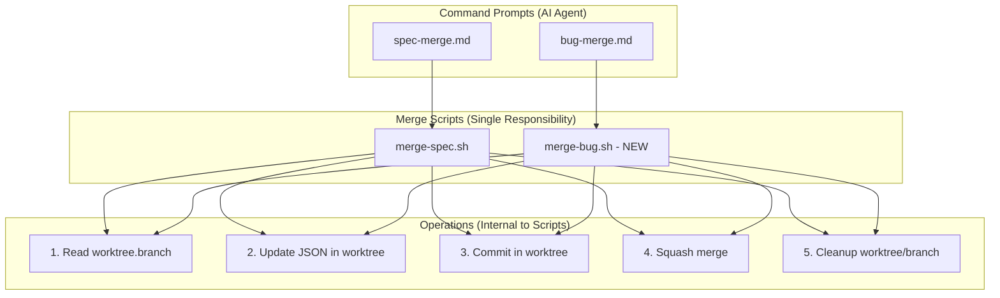
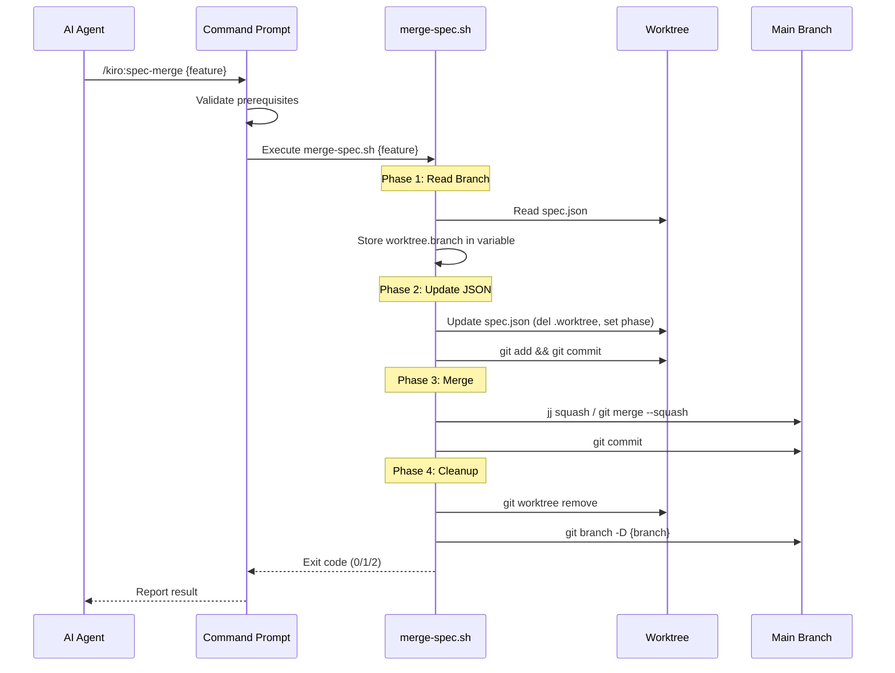

# Design: Merge Script Consolidation

## Overview

**Purpose**: Spec および Bug マージワークフローの責務統合により、タイミング問題を解決し、信頼性の高いマージ処理を実現する。

**Users**: 開発者および AI エージェント (Claude Code) がマージコマンドを実行する際に使用。

**Impact**: 既存の `update-spec-for-deploy.sh` / `update-bug-for-deploy.sh` を削除し、マージ処理の全責務を `merge-spec.sh` および新規 `merge-bug.sh` に統合する。

### Goals

- タイミング問題の根本解決: ブランチ名取得と JSON 更新を単一スクリプト内で正しい順序で実行
- Spec/Bug ワークフローの一貫性: 同一パターンで両方のマージ処理を実装
- エラーハンドリングの統一: 明確な exit code と診断メッセージ

### Non-Goals

- jj/git 選択ロジックの変更（現状維持）
- コンフリクト自動解決機能（コマンドプロンプト側の責務）
- inspection 完了チェック（コマンドプロンプト側の責務）

## Architecture

### Existing Architecture Analysis

現在のマージワークフローは 2 段階に分離されている:

1. **コマンドプロンプト** (`spec-merge.md` / `bug-merge.md`): 前提条件チェック、worktree 内で `update-*-for-deploy.sh` を呼び出し、`merge-*.sh` を呼び出し
2. **ヘルパースクリプト群**:
   - `update-spec-for-deploy.sh`: worktree フィールド削除、phase 更新、コミット
   - `merge-spec.sh`: ブランチ名読み取り、マージ、クリーンアップ

**問題**: `update-spec-for-deploy.sh` が worktree フィールドを削除した後に `merge-spec.sh` が `worktree.branch` を読もうとして失敗する。

### Architecture Pattern & Boundary Map



**Key Decisions**:
- 責務統合: 全処理を単一スクリプトで実行することで順序保証
- ブランチ名の先行読み取り: JSON 更新前にブランチ名を変数に保存
- コマンドプロンプトの簡素化: update スクリプト呼び出しを削除

### Technology Stack

| Layer | Choice / Version | Role in Feature | Notes |
|-------|------------------|-----------------|-------|
| Scripts | Bash | マージ処理の実装 | jq 依存 |
| JSON Processing | jq | spec.json/bug.json の読み書き | 必須依存 |
| Version Control | git / jj | マージ実行 | jj 優先、git フォールバック |
| Command Prompts | Markdown | AI Agent 向け指示定義 | Claude Code 形式 |

## System Flows

### Merge Workflow Sequence



**Key Decisions**:
- ブランチ名を先行読み取りして変数保存することで、JSON 更新後も正しいブランチ名を使用可能
- main/master/dev 以外のブランチでは明示的にエラー終了（暗黙の checkout は行わない）
- クリーンアップ失敗は警告のみで処理継続（非致命的エラー）

## Requirements Traceability

| Criterion ID | Summary | Components | Implementation Approach |
|--------------|---------|------------|------------------------|
| 1.1 | worktree.branch を正しいパスで読み取る | `merge-spec.sh` | 変数に先行保存してから JSON 更新 |
| 1.2 | main/master/dev 以外で exit 2 | `merge-spec.sh` | 現在ブランチチェック、checkout 禁止 |
| 1.3 | worktree 内で spec.json 更新 | `merge-spec.sh` | jq で del(.worktree), phase 設定 |
| 1.4 | worktree 内で変更をコミット | `merge-spec.sh` | git add && git commit |
| 1.5 | jj squash / git merge --squash | `merge-spec.sh` | 既存ロジック活用 |
| 1.6 | main 側でコミット | `merge-spec.sh` | git commit |
| 1.7 | worktree 削除 | `merge-spec.sh` | git worktree remove |
| 1.8 | feature ブランチ削除 | `merge-spec.sh` | git branch -D |
| 2.1 | bug.json から worktree.branch 読み取り | `merge-bug.sh` | 新規作成、merge-spec.sh と同一パターン |
| 2.2 | main/master/dev 以外で exit 2 | `merge-bug.sh` | merge-spec.sh と同一実装 |
| 2.3 | bug.json 更新 | `merge-bug.sh` | jq で del(.worktree), updated_at 設定 |
| 2.4 | worktree 内でコミット | `merge-bug.sh` | git add && git commit |
| 2.5 | jj squash / git merge --squash | `merge-bug.sh` | merge-spec.sh と同一実装 |
| 2.6 | main 側でコミット | `merge-bug.sh` | git commit |
| 2.7 | worktree 削除 | `merge-bug.sh` | git worktree remove |
| 2.8 | bugfix ブランチ削除 | `merge-bug.sh` | git branch -D |
| 3.1 | update-spec-for-deploy.sh 削除 | ファイル削除 | DELETE action |
| 3.2 | update-bug-for-deploy.sh 削除 | ファイル削除 | DELETE action |
| 4.1 | update-spec-for-deploy.sh 呼び出し削除 | `spec-merge.md` | Step 2.3 の削除 |
| 4.2 | merge-spec.sh のみ呼び出し | `spec-merge.md` | Step 3 の簡素化 |
| 4.3 | エラーハンドリング | `spec-merge.md` | exit code に応じた分岐 |
| 5.1 | update-bug-for-deploy.sh 呼び出し削除 | `bug-merge.md` | Step 2.3 の削除 |
| 5.2 | merge-bug.sh 呼び出し | `bug-merge.md` | Step 3 の変更 |
| 5.3 | エラーハンドリング | `bug-merge.md` | exit code に応じた分岐 |
| 6.1 | jq 未インストール時のエラー | `merge-spec.sh`, `merge-bug.sh` | exit 2 + インストール手順 |
| 6.2 | JSON ファイル不在時のエラー | `merge-spec.sh`, `merge-bug.sh` | exit 2 + 期待パス出力 |
| 6.3 | worktree.branch 不在時のエラー | `merge-spec.sh`, `merge-bug.sh` | exit 2 + エラー原因 |
| 6.4 | 非標準ブランチ時のエラー | `merge-spec.sh`, `merge-bug.sh` | exit 2 + 現在ブランチ名 |
| 6.5 | マージコンフリクト時 | `merge-spec.sh`, `merge-bug.sh` | exit 1、クリーンアップなし |
| 6.6 | worktree 削除失敗時 | `merge-spec.sh`, `merge-bug.sh` | 警告出力、処理継続 |
| 6.7 | ブランチ削除失敗時 | `merge-spec.sh`, `merge-bug.sh` | 警告出力、処理継続 |

### Coverage Validation Checklist

- [x] Every criterion ID from requirements.md appears in the table above
- [x] Each criterion has specific component names
- [x] Implementation approach distinguishes "reuse existing" vs "new implementation"
- [x] User-facing criteria specify concrete components

## Components and Interfaces

| Component | Domain/Layer | Intent | Req Coverage | Key Dependencies | Contracts |
|-----------|--------------|--------|--------------|------------------|-----------|
| `merge-spec.sh` | Scripts | Spec マージ処理の全責務 | 1.1-1.8, 6.1-6.7 | jq, git/jj | Shell Script |
| `merge-bug.sh` | Scripts | Bug マージ処理の全責務 | 2.1-2.8, 6.1-6.7 | jq, git/jj | Shell Script (NEW) |
| `spec-merge.md` | Commands | AI Agent 向け Spec マージ指示 | 4.1-4.3 | merge-spec.sh | Command Prompt |
| `bug-merge.md` | Commands | AI Agent 向け Bug マージ指示 | 5.1-5.3 | merge-bug.sh | Command Prompt |

### Scripts Layer

#### merge-spec.sh (Updated)

| Field | Detail |
|-------|--------|
| Intent | worktree ブランチを main にマージし、クリーンアップする |
| Requirements | 1.1-1.8, 6.1-6.7 |

**Responsibilities & Constraints**
- ブランチ名の先行読み取り（JSON 更新前）
- worktree 内での spec.json 更新とコミット
- squash merge の実行（jj 優先、git フォールバック）
- worktree とブランチのクリーンアップ
- 現在ブランチが main/master/dev 以外の場合は早期終了

**Dependencies**
- External: jq - JSON 処理（P0: 必須）
- External: git - バージョン管理（P0: 必須）
- External: jj - バージョン管理（P1: オプション、優先使用）

**Contracts**: Service [x]

##### Service Interface

```bash
# Usage
merge-spec.sh <feature-name>

# Exit Codes
# 0 - Success: マージ完了、worktree 削除、ブランチ削除
# 1 - Conflict: マージコンフリクト、クリーンアップなし
# 2 - Error: 前提条件エラー（jq 不在、JSON 不在、ブランチ不正）

# Preconditions
# - jq がインストールされていること
# - main/master/dev ブランチにいること
# - worktree 内に spec.json が存在すること
# - spec.json に worktree.branch が含まれること

# Postconditions (on exit 0)
# - feature ブランチの変更が main に squash merge されている
# - spec.json から worktree フィールドが削除されている
# - spec.json の phase が deploy-complete になっている
# - worktree ディレクトリが削除されている
# - feature ブランチが削除されている
```

**Implementation Notes**
- 変更点: ブランチ名読み取り → JSON 更新 → コミット → マージ の順序を単一スクリプト内で保証
- Validation: 現在ブランチを先にチェックし、不正なら即座に exit 2
- Risks: jj 使用時のコンフリクト検知が git と異なる可能性

#### merge-bug.sh (New)

| Field | Detail |
|-------|--------|
| Intent | bugfix worktree ブランチを main にマージし、クリーンアップする |
| Requirements | 2.1-2.8, 6.1-6.7 |

**Responsibilities & Constraints**
- merge-spec.sh と同一パターン
- bug.json には phase フィールドがないため、worktree 削除と updated_at 更新のみ
- パス規則: `.kiro/worktrees/bugs/{bug-name}/`

**Dependencies**
- External: jq - JSON 処理（P0: 必須）
- External: git - バージョン管理（P0: 必須）
- External: jj - バージョン管理（P1: オプション、優先使用）

**Contracts**: Service [x]

##### Service Interface

```bash
# Usage
merge-bug.sh <bug-name>

# Exit Codes
# 0 - Success: マージ完了、worktree 削除、ブランチ削除
# 1 - Conflict: マージコンフリクト、クリーンアップなし
# 2 - Error: 前提条件エラー

# Preconditions
# - jq がインストールされていること
# - main/master/dev ブランチにいること
# - worktree 内に bug.json が存在すること
# - bug.json に worktree.branch が含まれること

# Postconditions (on exit 0)
# - bugfix ブランチの変更が main に squash merge されている
# - bug.json から worktree フィールドが削除されている
# - bug.json の updated_at が更新されている
# - worktree ディレクトリが削除されている
# - bugfix ブランチが削除されている
```

### Commands Layer

#### spec-merge.md (Updated)

| Field | Detail |
|-------|--------|
| Intent | AI Agent に Spec マージ手順を指示する |
| Requirements | 4.1-4.3 |

**Responsibilities & Constraints**
- 前提条件の検証（inspection 完了チェック含む）
- `merge-spec.sh` の呼び出し
- exit code に応じたエラーハンドリングとレポート
- Step 2.3 の `update-spec-for-deploy.sh` 呼び出しを削除

**Implementation Notes**
- 変更は Step 2.3 の削除と Step 3 の簡素化のみ
- コンフリクト解決ロジック（Step 4）は変更なし

#### bug-merge.md (Updated)

| Field | Detail |
|-------|--------|
| Intent | AI Agent に Bug マージ手順を指示する |
| Requirements | 5.1-5.3 |

**Responsibilities & Constraints**
- 前提条件の検証
- `merge-bug.sh` の呼び出し（新規）
- exit code に応じたエラーハンドリングとレポート
- Step 2.3 の `update-bug-for-deploy.sh` 呼び出しを削除
- Step 3 で `git merge --squash` 直接呼び出しから `merge-bug.sh` 呼び出しに変更

**Implementation Notes**
- Step 3 のマージロジックを `merge-bug.sh` に委譲
- Step 5 のクリーンアップも `merge-bug.sh` が担当するため簡素化

## Error Handling

### Error Strategy

| Error Type | Exit Code | Recovery | Message Format |
|------------|-----------|----------|----------------|
| jq 未インストール | 2 | インストール手順提示 | `Error: jq is not installed. Install with: brew install jq` |
| JSON ファイル不在 | 2 | パス確認指示 | `Error: {file} not found at {path}` |
| worktree.branch 不在 | 2 | JSON 構造確認指示 | `Error: worktree.branch not found in {file}` |
| 非標準ブランチ | 2 | checkout 指示 | `Error: Must be on main/master/dev branch. Current: {branch}` |
| マージコンフリクト | 1 | 手動解決指示 | `Conflict detected during merge` |
| worktree 削除失敗 | Warning | 手動削除指示 | `Warning: Failed to remove worktree (manual cleanup required)` |
| ブランチ削除失敗 | Warning | 手動削除指示 | `Warning: Failed to delete branch (manual cleanup required)` |

### Error Categories and Responses

**User Errors (Exit 2)**: 前提条件未満足 → 具体的な解決手順を提示

**System Errors (Exit 1)**: マージコンフリクト → クリーンアップせず、手動解決を促す

**Non-Fatal Warnings**: クリーンアップ失敗 → 警告を出力して処理継続

## Testing Strategy

### Unit Tests

- 前提条件チェックのテスト（jq 有無、JSON 存在、ブランチ名）
- exit code の正確性テスト
- JSON 更新処理のテスト（jq コマンド）

### Integration Tests

- worktree 環境でのフルワークフローテスト
- コンフリクト発生時の exit code 1 確認
- クリーンアップ処理の確認

### E2E Tests

- `spec-merge.md` からの `merge-spec.sh` 呼び出しフロー
- `bug-merge.md` からの `merge-bug.sh` 呼び出しフロー

## Verification Contract

### User Journey Definition

| Journey ID | Operation Flow | Expected Result | E2E Required |
|------------|----------------|-----------------|--------------|
| UJ-001 | Spec worktree で実装完了後、`/kiro:spec-merge` を実行 | main に squash merge され、worktree が削除される | No |
| UJ-002 | Bug worktree で修正完了後、`/kiro:bug-merge` を実行 | main に squash merge され、worktree が削除される | No |
| UJ-003 | main/master/dev 以外のブランチで merge 実行 | exit 2 でエラーメッセージが表示される | No |

**E2E Required = No の理由**: シェルスクリプトの動作確認は手動テストまたは統合テストで十分。UI 操作を含まないため E2E テスト不要。

### Impact Analysis Contract

| Target File | Action | Reason |
|-------------|--------|--------|
| `.kiro/scripts/merge-spec.sh` | UPDATE | 責務統合（JSON 更新処理の追加） |
| `.kiro/scripts/merge-bug.sh` | CREATE | Bug マージ用新規スクリプト |
| `.kiro/scripts/update-spec-for-deploy.sh` | DELETE | merge-spec.sh に統合 |
| `.kiro/scripts/update-bug-for-deploy.sh` | DELETE | merge-bug.sh に統合 |
| `.claude/commands/kiro/spec-merge.md` | UPDATE | Step 2.3 削除、Step 3 簡素化 |
| `.claude/commands/kiro/bug-merge.md` | UPDATE | Step 2.3 削除、Step 3 で merge-bug.sh 呼び出し |
| `electron-sdd-manager/resources/templates/scripts/merge-spec.sh` | UPDATE | テンプレート版の同期更新 |
| `electron-sdd-manager/resources/templates/scripts/merge-bug.sh` | CREATE | テンプレート版新規作成 |
| `electron-sdd-manager/resources/templates/scripts/update-spec-for-deploy.sh` | DELETE | テンプレート版削除 |
| `electron-sdd-manager/resources/templates/scripts/update-bug-for-deploy.sh` | DELETE | テンプレート版削除 |
| `electron-sdd-manager/src/main/services/ccSddWorkflowInstaller.ts` | UPDATE | HELPER_SCRIPTS リストの更新 |
| `electron-sdd-manager/src/main/services/ccSddWorkflowInstaller.test.ts` | UPDATE | HELPER_SCRIPTS テストの更新 |

## Design Decisions

### DD-001: 責務統合（merge-spec.sh に全処理を統合）

| Field | Detail |
|-------|--------|
| Status | Accepted |
| Context | `update-spec-for-deploy.sh` と `merge-spec.sh` が分離しているため、worktree フィールド削除後にブランチ名が読めなくなる |
| Decision | `merge-spec.sh` に全処理を統合し、`update-spec-for-deploy.sh` を削除する |
| Rationale | 単一スクリプトで処理順序を保証できる。ブランチ名を先に読み取って変数に保存すれば、後続の JSON 更新に影響されない |
| Alternatives Considered | 1. update スクリプトを merge スクリプトの後に呼ぶ → squash merge に JSON 更新が含まれない 2. merge スクリプトがブランチ名を引数で受け取る → コマンドプロンプト側の複雑化 |
| Consequences | スクリプトファイル数の削減、処理フローの単純化。update スクリプトへの既存参照を全て更新する必要あり |

### DD-002: 非標準ブランチでの早期終了

| Field | Detail |
|-------|--------|
| Status | Accepted |
| Context | main/master/dev 以外のブランチでマージを実行した場合の挙動を決定する必要がある |
| Decision | checkout を行わず、エラーメッセージを出力して exit 2 で終了する |
| Rationale | 暗黙的な状態変更（自動 checkout）は予期せぬ副作用を引き起こす可能性がある。前提条件を満たしていなければ早期失敗が安全 |
| Alternatives Considered | 自動で main に checkout する → 暗黙的な状態変更は避けるべき |
| Consequences | ユーザーは事前に正しいブランチに移動する必要がある。エラーメッセージで明確に指示される |

### DD-003: merge-bug.sh の新規作成

| Field | Detail |
|-------|--------|
| Status | Accepted |
| Context | Bug ワークフローも同じタイミング問題を持つ可能性がある |
| Decision | merge-spec.sh と同じパターンで merge-bug.sh を新規作成する |
| Rationale | Spec と Bug で一貫した設計により保守性が向上。コードの重複はあるが、スクリプトの独立性を優先 |
| Alternatives Considered | 1. 共通スクリプトに引数でタイプを渡す → 条件分岐が複雑化 2. Bug は現状維持 → 一貫性の欠如 |
| Consequences | 2 つのスクリプトを並行して保守する必要があるが、それぞれの責務が明確 |

### DD-004: クリーンアップ失敗時の処理継続

| Field | Detail |
|-------|--------|
| Status | Accepted |
| Context | worktree 削除やブランチ削除が失敗した場合の挙動を決定する必要がある |
| Decision | 警告を出力して処理を継続する（非致命的エラー） |
| Rationale | マージ自体が成功していれば、クリーンアップの失敗は手動で対処可能。全体を失敗させるほど重要ではない |
| Alternatives Considered | 全体を失敗させる → マージ成功後のロールバックは不要 |
| Consequences | ユーザーに手動クリーンアップの手順を提示する必要がある |
