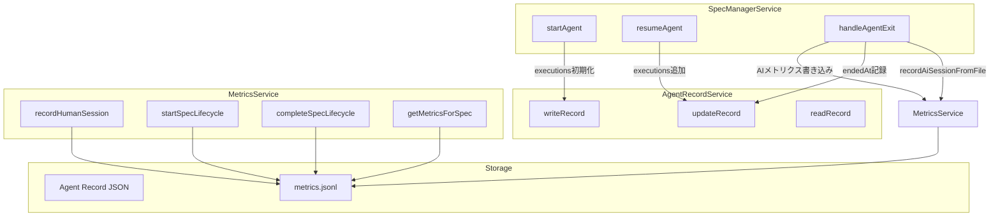
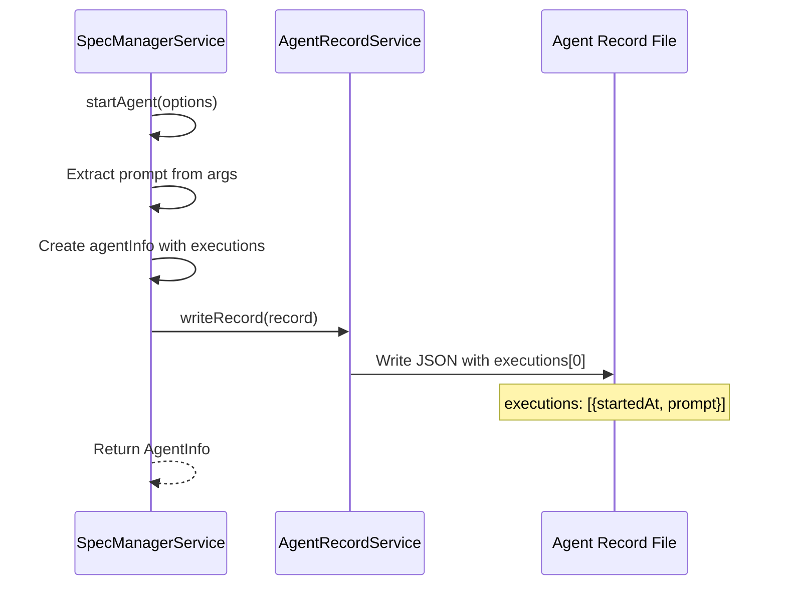
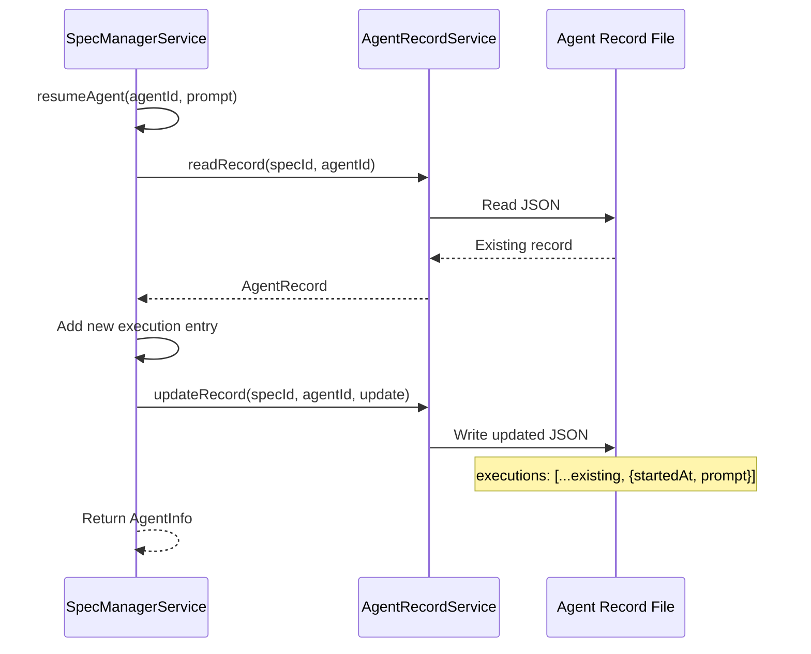
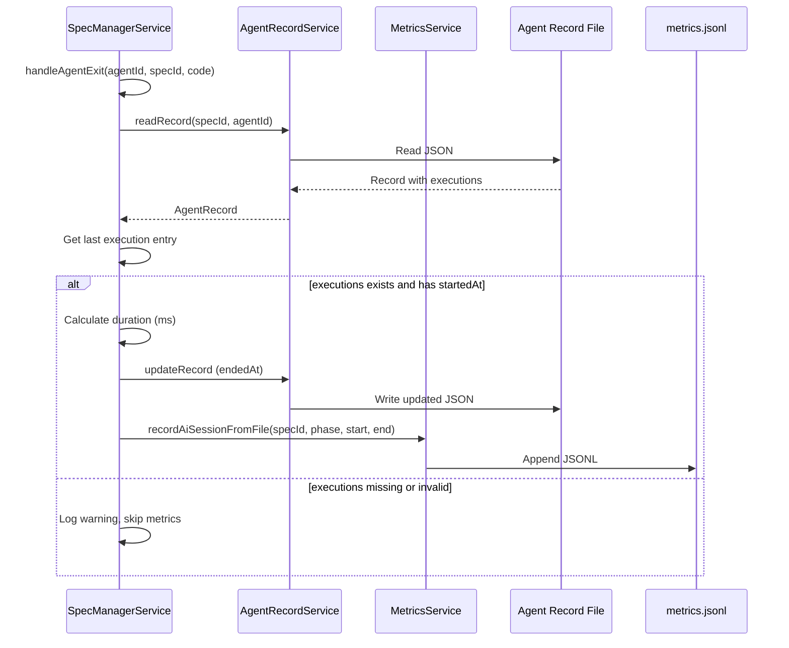
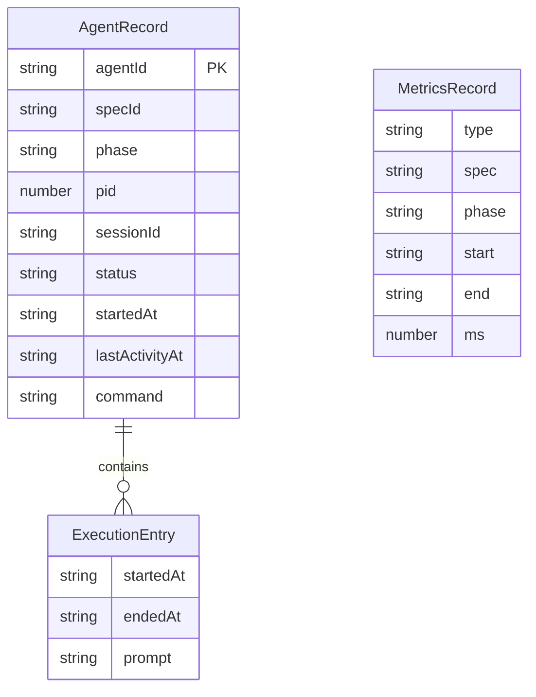

# Design: Metrics File-Based Tracking

## Overview

**Purpose**: 本機能はAI実行時間計測をオンメモリ管理からファイルベース管理に移行し、`setProjectPath()`呼び出しやアプリケーション再起動によるデータ消失を防止する。

**Users**: SDD Orchestratorのメトリクス計測システム（内部システム）。

**Impact**: MetricsServiceのオンメモリセッション管理を廃止し、Agent recordファイルへの`executions`配列追加により永続的な実行履歴を実現する。

### Goals

- Agent recordファイルに実行履歴（`executions`配列）を永続化する
- `handleAgentExit`時にメトリクスを計算・記録する方式に変更する
- MetricsServiceからオンメモリセッション管理を完全に削除する
- 既存の読み取りAPI（`getMetricsForSpec`等）の互換性を維持する

### Non-Goals

- 既存Agent recordの`startedAt`から`executions`へのマイグレーション
- Human時間計測のファイルベース化
- Spec Lifecycle計測のファイルベース化
- `metrics.jsonl`のフォーマット変更
- 読み取りAPI（`getMetricsForSpec`等）の変更

## Architecture

### Existing Architecture Analysis

**現在のメトリクス計測フロー**:

1. `startAgent`呼び出し時に`metricsService.startAiSession(specId, phase)`でオンメモリMapに開始時刻を記録
2. `handleAgentExit`呼び出し時に`metricsService.endAiSession(specId, phase)`で終了時刻を記録し、`metrics.jsonl`に書き込み
3. `setProjectPath()`呼び出し時に`activeAiSessions.clear()`でセッション情報が消失

**問題点**:
- `activeAiSessions` Mapはオンメモリのため、`setProjectPath()`や再起動でデータ消失
- Resume時に新しいセッションが開始されても、前のセッションの情報は保持されない

**変更後のフロー**:
1. `startAgent`呼び出し時にAgent recordの`executions`配列に開始時刻・プロンプトを記録
2. `resumeAgent`呼び出し時に`executions`配列に新しいエントリを追加
3. `handleAgentExit`呼び出し時に最後のエントリに終了時刻を記録し、直接`metrics.jsonl`に書き込み

### Architecture Pattern & Boundary Map



**Architecture Integration**:
- Selected pattern: ファイルベース永続化（既存のAgent record構造を拡張）
- Domain/feature boundaries: specManagerServiceが書き込み責務、MetricsServiceは読み取り・集計のみ
- Existing patterns preserved: Agent recordのJSON形式、metrics.jsonlのJSONL形式
- New components rationale: 新規コンポーネントなし（既存構造の拡張のみ）
- Steering compliance: SSOT原則に従い、Agent recordをexecutions情報の単一真実源とする

### Technology Stack

| Layer | Choice / Version | Role in Feature | Notes |
|-------|------------------|-----------------|-------|
| Backend / Services | Node.js 20+ | ファイル読み書き | 既存のfs/promises使用 |
| Data / Storage | JSON / JSONL | Agent record永続化 | 既存フォーマット拡張 |

## System Flows

### Agent Start Flow



### Agent Resume Flow



### Agent Exit Flow



## Requirements Traceability

| Criterion ID | Summary | Components | Implementation Approach |
|--------------|---------|------------|------------------------|
| 1.1 | Agent recordに`executions`フィールド追加 | AgentRecord, AgentInfo | 型定義拡張（新規実装） |
| 1.2 | `startedAt`から`executions[0].startedAt`への移行 | specManagerService.startAgent | 新規recordのみ対応（新規実装） |
| 1.3 | 型定義に`executions`フィールド含む | AgentRecord, AgentInfo | 型定義拡張（新規実装） |
| 2.1 | startAgent時にexecutions初期化 | specManagerService.startAgent | 既存writeRecord呼び出し修正 |
| 2.2 | startAiSession呼び出し削除 | specManagerService.startAgent | 既存コード削除 |
| 3.1 | handleAgentExit時にendedAt記録 | specManagerService.handleAgentExit | 既存updateRecord呼び出し修正 |
| 3.2 | metrics.jsonl書き込み | specManagerService.handleAgentExit | MetricsFileWriter直接使用（新規実装） |
| 3.3 | executions不在時の警告ログ | specManagerService.handleAgentExit | 新規実装 |
| 3.4 | endAiSession呼び出し削除 | specManagerService.handleAgentExit | 既存コード削除 |
| 4.1 | resumeAgent時にexecutions追加 | specManagerService.resumeAgent | 既存updateRecord呼び出し修正 |
| 4.2 | resumeAgent内startAiSession削除 | specManagerService.resumeAgent | 既存コード削除 |
| 5.1 | MetricsServiceからstartAiSession削除 | MetricsService | 既存コード削除 |
| 5.2 | MetricsServiceからactiveAiSessions削除 | MetricsService | 既存コード削除 |
| 5.3 | setProjectPathからclear()削除 | MetricsService.setProjectPath | 既存コード削除 |
| 5.4 | recordHumanSession等の維持 | MetricsService | 変更なし（確認） |
| 6.1 | writeRecordがexecutions書き込み | AgentRecordService.writeRecord | 変更なし（確認） |
| 6.2 | updateRecordがexecutions更新 | AgentRecordService.updateRecord | 変更なし（確認） |
| 6.3 | readRecordがexecutions読み取り | AgentRecordService.readRecord | 変更なし（確認） |

### Coverage Validation Checklist

- [x] Every criterion ID from requirements.md appears in the table above
- [x] Each criterion has specific component names (not generic references)
- [x] Implementation approach distinguishes "reuse existing" vs "new implementation"
- [x] User-facing criteria specify concrete UI components (not just "shared components")

## Components and Interfaces

| Component | Domain/Layer | Intent | Req Coverage | Key Dependencies | Contracts |
|-----------|--------------|--------|--------------|-----------------|-----------|
| AgentRecordService | Main/Services | Agent recordファイルの読み書き | 6.1, 6.2, 6.3 | fs/promises (P0) | Service |
| specManagerService | Main/Services | Agent起動・終了処理 | 2.1, 2.2, 3.1-3.4, 4.1, 4.2 | AgentRecordService (P0), MetricsFileWriter (P0) | Service |
| MetricsService | Main/Services | メトリクス読み取り・集計 | 5.1-5.4 | MetricsFileReader (P0) | Service |
| AgentRecord | Main/Types | Agent record型定義 | 1.1, 1.2, 1.3 | - | State |

### Main/Types

#### AgentRecord / AgentInfo

| Field | Detail |
|-------|--------|
| Intent | Agent recordの型定義に`executions`フィールドを追加 |
| Requirements | 1.1, 1.2, 1.3 |

**Responsibilities & Constraints**
- `executions`配列による実行履歴の永続化
- 後方互換性のため既存`startedAt`フィールドは残す（新規recordでは使用しない）

**Dependencies**
- Inbound: specManagerService - record読み書き (P0)
- Inbound: AgentRecordService - ファイルI/O (P0)

**Contracts**: State [x]

##### State Management

```typescript
/** 実行履歴エントリ */
interface ExecutionEntry {
  /** 実行開始時刻 (ISO 8601 UTC) */
  startedAt: string;
  /** 実行終了時刻 (ISO 8601 UTC)。未設定の場合は実行中または異常終了 */
  endedAt?: string;
  /** 投入されたプロンプト */
  prompt: string;
}

/** AgentRecord型定義（拡張後） */
interface AgentRecord {
  agentId: string;
  specId: string;
  phase: string;
  pid: number;
  sessionId: string;
  status: AgentStatus;
  startedAt: string;  // レガシー。新規recordでは使用しない
  lastActivityAt: string;
  command: string;
  cwd?: string;
  prompt?: string;
  engineId?: LLMEngineId;
  /** 実行履歴。新規recordではこのフィールドを使用 */
  executions?: ExecutionEntry[];
}
```

- Persistence & consistency: JSONファイルとして永続化
- Concurrency strategy: 既存のAgentMutexによる排他制御を継続使用

**Implementation Notes**
- Integration: 既存のAgentRecord/AgentInfo型を拡張
- Validation: `executions`がundefinedの場合はレガシーrecordとして扱う
- Risks: 型定義変更により既存コードの型エラー発生の可能性

### Main/Services

#### specManagerService.startAgent

| Field | Detail |
|-------|--------|
| Intent | Agent起動時に`executions`配列を初期化 |
| Requirements | 2.1, 2.2 |

**Responsibilities & Constraints**
- `executions`配列の初期化（開始時刻とプロンプトを記録）
- `metricsService.startAiSession()`呼び出しの削除

**Dependencies**
- Outbound: AgentRecordService.writeRecord - record書き込み (P0)

**Contracts**: Service [x]

##### Service Interface

```typescript
// 変更箇所のみ記載
// startAgent内のwriteRecord呼び出しを以下のように変更:

await this.recordService.writeRecord({
  agentId,
  specId,
  phase,
  pid: process.pid,
  sessionId: sessionId || '',
  status: 'running',
  startedAt: now,
  lastActivityAt: now,
  command: `${command} ${effectiveArgs.join(' ')}`,
  cwd: effectiveCwd,
  prompt: effectivePrompt,
  engineId,
  // 新規追加: executions配列
  executions: [{
    startedAt: now,
    prompt: effectivePrompt || '',
  }],
});

// 削除: metricsService.startAiSession(specId, phase);
```

- Preconditions: options.specId, options.phase が必須
- Postconditions: Agent recordに`executions[0]`が記録される
- Invariants: `executions[0].startedAt`はAgent起動時刻と一致

**Implementation Notes**
- Integration: 既存のwriteRecord呼び出しに`executions`フィールドを追加
- Validation: promptが空の場合は空文字列を設定
- Risks: なし

#### specManagerService.resumeAgent

| Field | Detail |
|-------|--------|
| Intent | Agent再開時に`executions`配列に新エントリを追加 |
| Requirements | 4.1, 4.2 |

**Responsibilities & Constraints**
- 既存`executions`配列に新しいエントリを追加
- `metricsService.startAiSession()`呼び出しの削除

**Dependencies**
- Outbound: AgentRecordService.readRecord - record読み取り (P0)
- Outbound: AgentRecordService.updateRecord - record更新 (P0)

**Contracts**: Service [x]

##### Service Interface

```typescript
// 変更箇所のみ記載
// resumeAgent内で以下の処理を追加:

const existingRecord = await this.recordService.readRecord(agent.specId, agentId);
const existingExecutions = existingRecord?.executions || [];

// updateRecord呼び出し時にexecutionsを更新
await this.recordService.updateRecord(agent.specId, agentId, {
  status: 'running',
  pid: process.pid,
  lastActivityAt: now,
  // executions配列に新しいエントリを追加
  // Note: updateRecordの型定義拡張が必要
});

// 削除: metricsService.startAiSession(agent.specId, agent.phase);
```

- Preconditions: 既存Agent recordが存在すること
- Postconditions: `executions`配列に新しいエントリが追加される
- Invariants: 各resumeで新しいexecutionエントリが作成される

**Implementation Notes**
- Integration: 既存recordの`executions`を読み取り、新エントリを追加
- Validation: `executions`がundefinedの場合は空配列として扱う
- Risks: AgentRecordUpdate型に`executions`追加が必要

#### specManagerService.handleAgentExit

| Field | Detail |
|-------|--------|
| Intent | Agent終了時にメトリクスを計算・記録 |
| Requirements | 3.1, 3.2, 3.3, 3.4 |

**Responsibilities & Constraints**
- 最後の`executions`エントリに`endedAt`を記録
- `metrics.jsonl`にAIメトリクスレコードを直接書き込み
- `metricsService.endAiSession()`呼び出しの削除

**Dependencies**
- Outbound: AgentRecordService.readRecord - record読み取り (P0)
- Outbound: AgentRecordService.updateRecord - record更新 (P0)
- Outbound: MetricsFileWriter - メトリクス書き込み (P0)

**Contracts**: Service [x]

##### Service Interface

```typescript
// 変更箇所のみ記載
private handleAgentExit(agentId: string, specId: string, code: number): void {
  this.recordService.clearThrottleState(specId, agentId);
  const isForcedSuccess = this.forcedKillSuccess.has(agentId);

  this.recordService.readRecord(specId, agentId).then(async (currentRecord) => {
    if (currentRecord?.status === 'interrupted') {
      this.cleanupAgentResources(agentId);
      return;
    }

    this.forcedKillSuccess.delete(agentId);
    const newStatus: AgentStatus = (code === 0 || isForcedSuccess) ? 'completed' : 'failed';
    this.statusCallbacks.forEach((cb) => cb(agentId, newStatus));
    this.processes.delete(agentId);
    this.sessionIdParseBuffers.delete(agentId);

    const phase = currentRecord?.phase || 'unknown';
    const now = new Date().toISOString();

    // 新規追加: executions配列からメトリクス計算
    const executions = currentRecord?.executions;
    if (executions && executions.length > 0) {
      const lastExecution = executions[executions.length - 1];
      if (lastExecution.startedAt) {
        // endedAtを記録
        lastExecution.endedAt = now;

        // メトリクス計算
        const startTime = new Date(lastExecution.startedAt).getTime();
        const endTime = new Date(now).getTime();
        const ms = endTime - startTime;

        // metrics.jsonlに書き込み
        const metricsWriter = getDefaultMetricsFileWriter();
        await metricsWriter.appendRecord(this.projectPath, {
          type: 'ai',
          spec: specId,
          phase,
          start: lastExecution.startedAt,
          end: now,
          ms,
        });

        logger.debug('[SpecManagerService] AI metrics recorded', { specId, phase, ms });
      }
    } else {
      // 3.3: executions不在時の警告
      logger.warn('[SpecManagerService] executions missing or empty, skipping metrics', {
        agentId,
        specId,
        phase,
      });
    }

    // 削除: metricsService.endAiSession(specId, phase)

    // ... 既存のイベントログ処理 ...

    // executions更新を含むrecord更新
    return this.recordService.updateRecord(specId, agentId, {
      status: newStatus,
      lastActivityAt: now,
      // executions更新はupdateRecordの型拡張が必要
    });
  }).catch((error) => {
    // ... 既存のエラーハンドリング ...
  });
}
```

- Preconditions: Agent recordが存在すること
- Postconditions: `executions`の最後のエントリに`endedAt`が記録、`metrics.jsonl`に書き込み完了
- Invariants: `executions`が存在しない場合はメトリクス記録をスキップ

**Implementation Notes**
- Integration: MetricsFileWriterを直接使用してmetrics.jsonlに書き込み
- Validation: `executions`配列の存在確認、`startedAt`の存在確認
- Risks: 非同期処理のエラーハンドリング

#### MetricsService

| Field | Detail |
|-------|--------|
| Intent | オンメモリセッション管理を削除し、読み取り・集計機能のみ提供 |
| Requirements | 5.1, 5.2, 5.3, 5.4 |

**Responsibilities & Constraints**
- AI実行時間のオンメモリ管理を完全に削除
- Human時間計測とLifecycle計測は維持
- 読み取り・集計機能は維持

**Dependencies**
- Outbound: MetricsFileReader - メトリクス読み取り (P0)
- Outbound: MetricsFileWriter - Human/Lifecycle書き込み (P0)

**Contracts**: Service [x]

##### Service Interface

```typescript
/**
 * MetricsService（変更後）
 * AI実行時間のオンメモリ管理を削除
 */
export class MetricsService {
  private projectPath: string | null = null;
  private writer: MetricsFileWriter;
  private reader: MetricsFileReader;

  // 削除: private activeAiSessions: Map<string, InternalAiSession> = new Map();
  private activeLifecycles: Map<string, InternalLifecycle> = new Map();

  constructor(writer?: MetricsFileWriter, reader?: MetricsFileReader) {
    this.writer = writer ?? getDefaultMetricsFileWriter();
    this.reader = reader ?? getDefaultMetricsFileReader();
  }

  // 削除: private getSessionKey(specId: string, phase: AgentPhase): string

  /**
   * Set the current project path
   * 変更: activeAiSessions.clear()を削除
   */
  setProjectPath(projectPath: string): void {
    this.projectPath = projectPath;
    // 削除: this.activeAiSessions.clear();
    this.activeLifecycles.clear();
  }

  getProjectPath(): string | null {
    return this.projectPath;
  }

  // 削除: startAiSession(specId: string, phase: AgentPhase): void
  // 削除: async endAiSession(specId: string, phase: AgentPhase): Promise<void>
  // 削除: getActiveAiSession(specId: string, phase: AgentPhase): ActiveAiSession | undefined
  // 削除: getAllActiveAiSessions(): ActiveAiSession[]

  // 維持: recordHumanSession, startSpecLifecycle, completeSpecLifecycle
  // 維持: getMetricsForSpec, getProjectMetrics
}
```

- Preconditions: `setProjectPath()`が呼び出されていること（書き込み操作時）
- Postconditions: オンメモリセッション管理なし
- Invariants: Human/Lifecycleメトリクスは従来通り動作

**Implementation Notes**
- Integration: 既存の読み取り・集計ロジックは変更なし
- Validation: 不要
- Risks: 削除対象メソッドの呼び出し元すべてを更新する必要あり

#### AgentRecordService

| Field | Detail |
|-------|--------|
| Intent | Agent recordファイルの読み書き（executions対応確認） |
| Requirements | 6.1, 6.2, 6.3 |

**Responsibilities & Constraints**
- 既存のwriteRecord/updateRecord/readRecordは変更不要
- TypeScriptの型定義のみ更新

**Dependencies**
- External: fs/promises - ファイルI/O (P0)

**Contracts**: Service [x]

##### Service Interface

```typescript
// AgentRecordUpdate型の拡張が必要
export type AgentRecordUpdate = Partial<Pick<AgentRecord,
  'status' | 'lastActivityAt' | 'pid' | 'sessionId' | 'command' | 'executions'
>>;

// 以下は変更不要（既存実装がそのまま動作）
// writeRecord, updateRecord, readRecordはJSONをそのまま読み書きするため
// executions フィールドは自動的に処理される
```

- Preconditions: なし
- Postconditions: `executions`フィールドが正しく読み書きされる
- Invariants: 既存のmutexによる排他制御は維持

**Implementation Notes**
- Integration: 型定義の拡張のみ
- Validation: Zodスキーマ追加は任意（ランタイムバリデーション）
- Risks: なし

## Data Models

### Domain Model



**Aggregates and transactional boundaries**:
- AgentRecord: Agent単位のトランザクション境界
- ExecutionEntry: AgentRecordに埋め込まれた値オブジェクト

**Business rules & invariants**:
- `executions`配列は時系列順（最新が末尾）
- 各`ExecutionEntry`の`startedAt`は必須
- `endedAt`は正常終了時のみ設定

### Logical Data Model

**ExecutionEntry構造**:

| Attribute | Type | Description | Required |
|-----------|------|-------------|----------|
| startedAt | string | ISO 8601 UTC timestamp | Yes |
| endedAt | string | ISO 8601 UTC timestamp | No |
| prompt | string | 投入されたプロンプト | Yes |

**Consistency & Integrity**:
- Transaction boundaries: ファイル単位（1 Agent = 1 JSON file）
- Cascading rules: Agent record削除時にexecutionsも削除
- Temporal aspects: startedAt/endedAtはUTCタイムスタンプ

## Error Handling

### Error Strategy

| Error Type | Handling | Recovery |
|------------|----------|----------|
| executions未定義 | 警告ログ出力、メトリクス記録スキップ | なし（レガシーrecordとして許容） |
| startedAt未定義 | 警告ログ出力、メトリクス記録スキップ | なし |
| metrics.jsonl書き込み失敗 | エラーログ出力、処理継続 | リトライなし（次回書き込みで回復） |
| Agent record読み取り失敗 | 既存のエラーハンドリング継続 | 既存のフォールバック処理 |

### Error Categories and Responses

**System Errors**:
- ファイルI/Oエラー: ログ出力後、処理継続（メトリクス計測の失敗でAgent処理を止めない）

**Business Logic Errors**:
- executions配列の不整合: 警告ログ出力、メトリクス記録スキップ

## Testing Strategy

### Unit Tests

| Test Case | Target | Description |
|-----------|--------|-------------|
| AgentRecord executions型定義 | types/agentRecordService.ts | ExecutionEntry型が正しく定義されていること |
| startAgent executions初期化 | specManagerService.test.ts | writeRecord呼び出し時にexecutions[0]が含まれること |
| resumeAgent executions追加 | specManagerService.test.ts | updateRecord呼び出し時にexecutionsが追加されること |
| handleAgentExit メトリクス計算 | specManagerService.test.ts | executions存在時にmetrics.jsonlに書き込まれること |
| handleAgentExit executions不在 | specManagerService.test.ts | executions不在時に警告ログが出力されること |
| MetricsService オンメモリ削除 | metricsService.test.ts | startAiSession等が削除されていること |
| MetricsService setProjectPath | metricsService.test.ts | activeAiSessions.clear()が呼ばれないこと |

### Integration Tests

| Test Case | Components | Description |
|-----------|------------|-------------|
| Agent lifecycle with executions | specManagerService, AgentRecordService | startAgent -> handleAgentExitでexecutionsが正しく更新されること |
| Agent resume with executions | specManagerService, AgentRecordService | resumeAgentでexecutionsに新エントリが追加されること |
| Metrics recording flow | specManagerService, MetricsFileWriter | handleAgentExitでmetrics.jsonlに正しいレコードが書き込まれること |

## Design Decisions

### DD-001: Agent Recordへのexecutions配列追加

| Field | Detail |
|-------|--------|
| Status | Accepted |
| Context | 現在のオンメモリMapによる開始時刻管理は、setProjectPath()や再起動でデータ消失する問題がある |
| Decision | Agent recordファイルに`executions`配列を追加し、実行履歴を永続化する |
| Rationale | 既存のAgent recordにはプロセス情報が記録されており、ここに実行履歴を追加することで堅牢なメトリクス計測が可能になる。Resume時に新しい実行が追加されるため、配列構造が適切 |
| Alternatives Considered | 1. 別ファイルで実行履歴を管理 - Agent recordとの二重管理になり複雑化 2. 開始時刻のみ記録 - Resume対応が困難 |
| Consequences | Agent record JSONのサイズ増加（軽微）、型定義の更新が必要 |

### DD-002: metrics.jsonl維持と直接書き込み

| Field | Detail |
|-------|--------|
| Status | Accepted |
| Context | MetricsServiceのオンメモリ管理廃止に伴い、メトリクス書き込み方式を決定する必要がある |
| Decision | metrics.jsonlは維持し、handleAgentExit時にspecManagerServiceから直接MetricsFileWriterを使用して書き込む |
| Rationale | 既存の読み取りAPI（getMetricsForSpec等）を変更せずに済み、Human時間やLifecycleとの統一感も保てる |
| Alternatives Considered | 1. metrics.jsonlを廃止してAgent recordから直接集計 - 読み取りAPIの大幅変更が必要 2. MetricsServiceに新メソッド追加 - オンメモリ廃止の目的に反する |
| Consequences | specManagerServiceがMetricsFileWriterに依存（単一責任原則の軽微な違反だが、実用上問題なし） |

### DD-003: 既存startedAtフィールドの後方互換性維持

| Field | Detail |
|-------|--------|
| Status | Accepted |
| Context | 既存のAgent recordには`startedAt`フィールドがあり、新規recordでは`executions`を使用する |
| Decision | 既存recordは無視し、新規recordのみ`executions`を使用する。マイグレーションは行わない |
| Rationale | Runtime recordは一時的なものであり、マイグレーションの複雑さに見合わない。`executions`がundefinedの場合はレガシーrecordとして扱い、メトリクス記録をスキップする |
| Alternatives Considered | 1. 既存recordをマイグレーション - 複雑さとリスクが高い 2. startedAtとexecutionsを併用 - 二重管理になり複雑化 |
| Consequences | アプリ更新直後の実行中Agentではメトリクスが記録されない可能性（許容範囲） |

### DD-004: MetricsServiceの役割変更

| Field | Detail |
|-------|--------|
| Status | Accepted |
| Context | MetricsServiceがAI時間のオンメモリ管理とメトリクス集計の両方を担っていた |
| Decision | AI時間のオンメモリ管理機能を完全に削除し、読み取り・集計機能のみを残す |
| Rationale | 書き込みはspecManagerServiceが直接行い、MetricsServiceは集計に専念することで責任を明確化。Human時間とLifecycleのオンメモリ管理は維持（別課題） |
| Alternatives Considered | 1. MetricsServiceを完全廃止 - Human/Lifecycle管理もあり廃止は困難 2. ファイルベースのセッション管理をMetricsServiceに追加 - 複雑化 |
| Consequences | `startAiSession`, `endAiSession`, `getActiveAiSession`, `getAllActiveAiSessions`メソッドの削除、呼び出し元の更新が必要 |

## Integration & Deprecation Strategy

### 既存ファイルの修正（Wiring Points）

| File | Modification Type | Description |
|------|------------------|-------------|
| `electron-sdd-manager/src/main/services/agentRecordService.ts` | 型定義拡張 | AgentRecord, AgentInfo, AgentRecordUpdate型にexecutionsフィールド追加 |
| `electron-sdd-manager/src/main/services/specManagerService.ts` | ロジック変更 | startAgent, resumeAgent, handleAgentExitでexecutions処理追加、metricsService呼び出し削除 |
| `electron-sdd-manager/src/main/services/metricsService.ts` | メソッド削除 | startAiSession, endAiSession, getActiveAiSession, getAllActiveAiSessions削除、activeAiSessionsフィールド削除 |

### 削除対象ファイル（Cleanup）

該当なし（ファイル削除は発生しない）

### テストファイルの更新

| File | Modification Type | Description |
|------|------------------|-------------|
| `electron-sdd-manager/src/main/services/agentRecordService.test.ts` | テスト追加 | executions読み書きのテスト追加 |
| `electron-sdd-manager/src/main/services/specManagerService.test.ts` | テスト更新 | startAgent, resumeAgent, handleAgentExitのexecutions関連テスト追加/更新 |
| `electron-sdd-manager/src/main/services/metricsService.test.ts` | テスト削除/更新 | 削除メソッドのテスト削除、setProjectPathテスト更新 |

## Integration Test Strategy

### Components
- specManagerService
- AgentRecordService
- MetricsFileWriter

### Data Flow
```
startAgent -> AgentRecordService.writeRecord -> Agent Record JSON (with executions)
handleAgentExit -> AgentRecordService.readRecord -> AgentRecordService.updateRecord -> MetricsFileWriter.appendRecord -> metrics.jsonl
```

### Mock Boundaries
- **Mock**: ファイルシステム（fs/promises）- テスト高速化のためメモリ内で処理
- **Real**: specManagerService, AgentRecordService, MetricsFileWriter - 実際の連携をテスト

### Verification Points
- `startAgent`後のAgent record JSONに`executions[0]`が含まれること
- `resumeAgent`後のAgent record JSONに`executions`エントリが追加されていること
- `handleAgentExit`後にmetrics.jsonlに正しいAIメトリクスレコードが追加されていること
- `handleAgentExit`後のAgent record JSONの最後の`executions`エントリに`endedAt`が設定されていること

### Robustness Strategy
- **Async timing**: `waitFor`パターンを使用してファイル書き込み完了を待機
- **State transitions**: Agent status変更を監視してテストのタイミングを制御
- **Fixed sleeps回避**: ファイル存在確認とJSON内容検証を組み合わせて状態遷移を検証

### Prerequisites
- 既存のVitest環境を使用
- 新規テストヘルパー不要（既存のモックユーティリティを活用）
