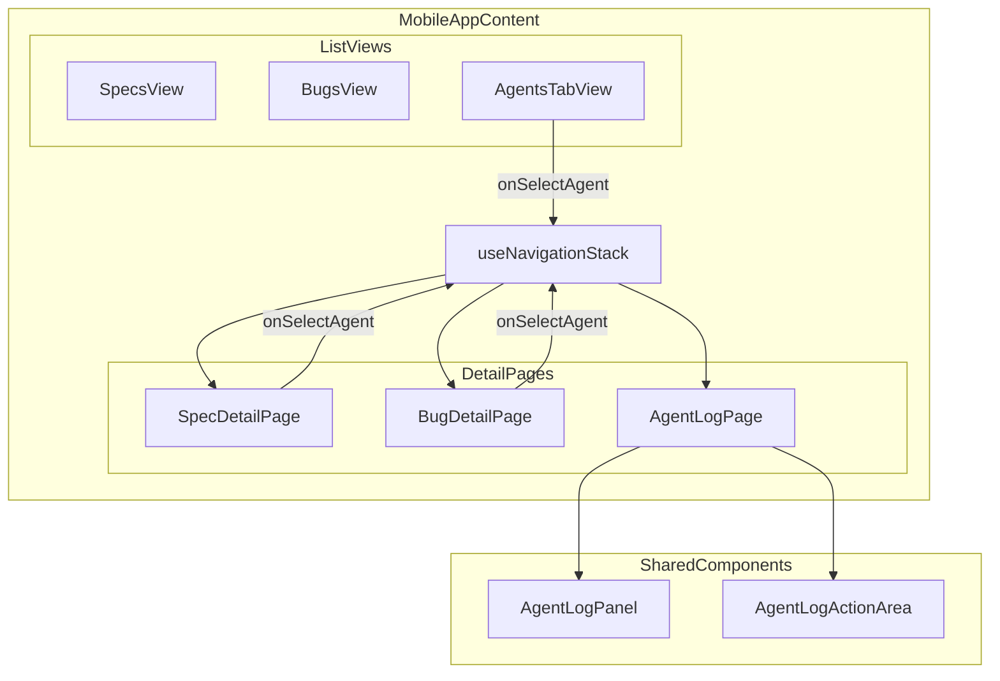
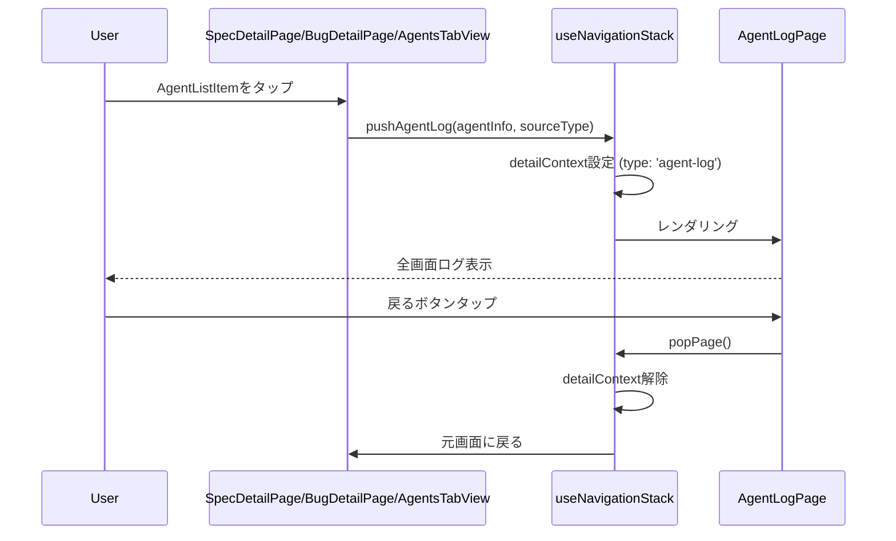

# Design: Mobile Agent Log Fullscreen

## Overview

**Purpose**: スマートフォン版Remote UIにおいて、Agentログ表示をボトムドロワー形式から全画面表示に変更し、ログの視認性と操作性を向上させる。

**Users**: スマートフォンでRemote UIを使用するユーザーが、Agent実行状況の確認と追加指示の送信を行う。

**Impact**: 現在の`AgentDetailDrawer`によるドロワー表示を廃止し、`AgentLogPage`による全画面表示に置き換える。`useNavigationStack`フックを拡張して`AgentLogPage`への遷移をサポートする。

### Goals

- Agentログの全画面表示による視認性向上
- 既存の`AgentLogPanel`コンポーネントの再利用
- SpecDetailPage/BugDetailPage/AgentsTabViewからの統一的な遷移体験

### Non-Goals

- Desktop版のAgentログ表示変更（FooterContentで継続）
- `AgentDetailDrawer`コンポーネントの削除（将来使用の可能性を考慮して保持）
- ログのフィルタリング・検索機能

## Architecture

### Existing Architecture Analysis

現在のモバイル版Agentログ表示は以下の構成:

1. **AgentDetailDrawer**: ボトムからスライドアップするオーバーレイドロワー
2. **useNavigationStack**: Spec/Bug詳細画面へのナビゲーション管理（`detailContext`でspec/bug型をサポート）
3. **遷移元コンポーネント**: SpecDetailPage、BugDetailPage、AgentsTabViewの各コンポーネントで`AgentDetailDrawer`を個別にレンダリング

### Architecture Pattern & Boundary Map



**Key Decisions**:
- `AgentLogPage`は既存の`SpecDetailPage`/`BugDetailPage`と同じパターンで実装
- `useNavigationStack`に`pushAgentLog`と`AgentLogContext`を追加
- アクションエリアのロジックは`AgentDetailDrawer`から抽出して再利用

### Technology Stack

| Layer | Choice / Version | Role in Feature | Notes |
|-------|------------------|-----------------|-------|
| Frontend | React 19 | コンポーネント実装 | 既存パターン踏襲 |
| State | Zustand (agentStore) | Agent/Logs状態管理 | 変更なし |
| Navigation | useNavigationStack | 全画面遷移管理 | 拡張対象 |

## System Flows

### Agent Log Page Navigation Flow



**Key Decisions**:
- `pushAgentLog`で遷移元情報（spec/bug/agents）を保持し、戻り先を正確に復元
- `popPage`は既存実装をそのまま利用（detailContextをnullに設定）

## Requirements Traceability

| Criterion ID | Summary | Components | Implementation Approach |
|--------------|---------|------------|------------------------|
| 1.1 | Agentタップで全画面遷移 | AgentLogPage, useNavigationStack | 新規: AgentLogPage, 拡張: pushAgentLog |
| 1.2 | AgentDetailDrawer廃止 | SpecDetailPage, BugDetailPage, AgentsTabView | 既存: Drawer呼び出し削除 |
| 1.3 | AgentLogPage配置 | remote-ui/components/AgentLogPage.tsx | 新規ファイル作成 |
| 2.1 | ナビバー表示 | AgentLogPage | 新規: ヘッダー実装 |
| 2.2 | 戻るボタン表示 | AgentLogPage | 新規: ArrowLeftアイコン |
| 2.3 | 戻るボタンで遷移元に戻る | AgentLogPage, useNavigationStack | 既存: popPage再利用 |
| 2.4 | 2段構成ヘッダー | AgentLogPage | 新規: ナビバー + AgentLogPanelヘッダー |
| 3.1 | ログエリアのみスクロール | AgentLogPage | 新規: flex-1 overflow-auto |
| 3.2 | ナビバー・アクション固定 | AgentLogPage | 新規: shrink-0 |
| 3.3 | AgentLogPanel再利用 | AgentLogPage | 既存: shared AgentLogPanel |
| 3.4 | 自動スクロール | AgentLogPanel | 既存機能（変更なし） |
| 4.1 | アクションエリア固定 | AgentLogPage, AgentLogActionArea | 新規: AgentLogActionArea抽出 |
| 4.2 | 追加指示入力 | AgentLogActionArea | 既存ロジック抽出 |
| 4.3 | 送信ボタン | AgentLogActionArea | 既存ロジック抽出 |
| 4.4 | 続行ボタン | AgentLogActionArea | 既存ロジック抽出 |
| 4.5 | 実行中の無効化 | AgentLogActionArea | 既存ロジック抽出 |
| 4.6 | sessionId無しの無効化 | AgentLogActionArea | 既存ロジック抽出 |
| 5.1 | SpecDetailPageから遷移 | SpecDetailPage | 既存: onSelectAgent変更 |
| 5.2 | BugDetailPageから遷移 | BugDetailPage | 既存: onSelectAgent変更 |
| 5.3 | AgentsTabViewから遷移 | AgentsTabView | 既存: onSelectAgent変更 |
| 5.4 | useNavigationStack拡張 | useNavigationStack | 拡張: pushAgentLog, AgentLogContext |
| 6.1 | モバイル版でDrawer不使用 | SpecDetailPage, BugDetailPage, AgentsTabView | 既存: Drawer削除 |
| 6.2 | Desktop版影響なし | FooterContent | 変更なし |

### Coverage Validation Checklist

- [x] Every criterion ID from requirements.md appears in the table above
- [x] Each criterion has specific component names (not generic references)
- [x] Implementation approach distinguishes "reuse existing" vs "new implementation"
- [x] User-facing criteria specify concrete UI components

## Components and Interfaces

| Component | Domain/Layer | Intent | Req Coverage | Key Dependencies (P0/P1) | Contracts |
|-----------|--------------|--------|--------------|--------------------------|-----------|
| AgentLogPage | UI/Page | 全画面Agentログ表示 | 1.1, 2.1-2.4, 3.1-3.4 | useNavigationStack (P0), AgentLogPanel (P0), AgentLogActionArea (P0) | State |
| AgentLogActionArea | UI/Component | 指示入力・送信・続行アクション | 4.1-4.6 | ApiClient (P0) | Service |
| useNavigationStack | Hook | Agent遷移サポート追加 | 5.4 | None | State |
| SpecDetailPage | UI/Page | Drawer削除、pushAgentLog呼び出し | 1.2, 5.1 | useNavigationStack (P0) | - |
| BugDetailPage | UI/Page | Drawer削除、pushAgentLog呼び出し | 1.2, 5.2 | useNavigationStack (P0) | - |
| AgentsTabView | UI/Page | Drawer削除、pushAgentLog呼び出し | 5.3 | useNavigationStack (P0) | - |

### UI Layer

#### AgentLogPage

| Field | Detail |
|-------|--------|
| Intent | 全画面でAgentログを表示し、追加指示の送信・続行操作を提供する |
| Requirements | 1.1, 2.1, 2.2, 2.3, 2.4, 3.1, 3.2, 3.3, 3.4 |

**Responsibilities & Constraints**
- 全画面レイアウトの管理（ナビバー固定、ログスクロール、アクション固定）
- 戻るボタンによる`popPage`呼び出し
- `AgentLogPanel`と`AgentLogActionArea`の組み合わせ

**Dependencies**
- Inbound: MobileAppContent - ナビゲーション遷移 (P0)
- Outbound: AgentLogPanel - ログ表示 (P0)
- Outbound: AgentLogActionArea - アクション操作 (P0)
- Outbound: useSharedAgentStore - Agent/Logs取得 (P0)

**Contracts**: State [x]

##### State Management

```typescript
interface AgentLogPageProps {
  /** 表示対象のAgent */
  agent: AgentInfo;
  /** 遷移元の情報（戻り先の特定に使用） */
  sourceType: 'spec' | 'bug' | 'agents';
  /** 遷移元のエンティティID（spec名/bug名、agentsタブはundefined） */
  sourceEntityId?: string;
  /** APIクライアント */
  apiClient: ApiClient;
  /** 戻るボタンコールバック */
  onBack: () => void;
  /** テストID */
  testId?: string;
}
```

- State model: Propsで受け取ったagentを基に、agentStoreからlogsを取得
- Persistence: なし（表示のみ）
- Concurrency: agentStoreのリアクティブ更新に追従

**Implementation Notes**
- Integration: SpecDetailPage/BugDetailPageと同じヘッダーパターン（ArrowLeftアイコン）
- Validation: agent必須、onBack必須
- Risks: なし

#### AgentLogActionArea

| Field | Detail |
|-------|--------|
| Intent | 追加指示入力、送信ボタン、続行ボタンを提供する |
| Requirements | 4.1, 4.2, 4.3, 4.4, 4.5, 4.6 |

**Responsibilities & Constraints**
- 追加指示の入力状態管理
- 送信・続行操作の実行とローディング状態管理
- Agent状態に応じたボタン無効化

**Dependencies**
- Inbound: AgentLogPage - 親コンポーネント (P0)
- Outbound: ApiClient - sendAgentInput, resumeAgent (P0)

**Contracts**: Service [x]

##### Service Interface

```typescript
interface AgentLogActionAreaProps {
  /** 対象Agent */
  agent: AgentInfo;
  /** APIクライアント */
  apiClient: ApiClient;
  /** テストID */
  testId?: string;
}
```

- Preconditions: agent.sessionIdが存在し、statusがrunning/hang以外の場合のみ操作可能
- Postconditions: 送信成功時に入力フィールドをクリア
- Invariants: isSending/isContinuingがtrueの間は重複操作を防止

**Implementation Notes**
- Integration: AgentDetailDrawerからロジックを抽出（コード再利用）
- Validation: 空文字列の送信防止、canInteract判定
- Risks: なし

### Hook Layer

#### useNavigationStack (Extension)

| Field | Detail |
|-------|--------|
| Intent | AgentLogPageへの遷移をサポートするためにdetailContextを拡張 |
| Requirements | 5.4 |

**Responsibilities & Constraints**
- `AgentLogContext`型の追加
- `pushAgentLog`メソッドの追加
- 既存の`popPage`は変更なし

**Dependencies**
- Inbound: MobileAppContent - 状態参照 (P0)
- Inbound: SpecDetailPage/BugDetailPage/AgentsTabView - pushAgentLog呼び出し (P0)

**Contracts**: State [x]

##### State Management

```typescript
/** Agent log detail context */
interface AgentLogContext {
  type: 'agent-log';
  agent: AgentInfo;
  sourceType: 'spec' | 'bug' | 'agents';
  sourceEntityId?: string;
}

/** Extended DetailContext union */
type DetailContext = SpecDetailContext | BugDetailContext | AgentLogContext;

/** Extended hook return */
interface UseNavigationStackReturn {
  // ... existing members ...
  /** Push agent log page onto stack */
  pushAgentLog: (agent: AgentInfo, sourceType: 'spec' | 'bug' | 'agents', sourceEntityId?: string) => void;
}
```

- State model: detailContext拡張（type: 'agent-log'を追加）
- Persistence: なし
- Concurrency: React state管理

**Implementation Notes**
- Integration: 既存のpushSpecDetail/pushBugDetailと同じパターン
- Validation: agent必須、sourceType必須
- Risks: なし

### Existing Components (Summary-Only)

以下のコンポーネントは既存実装の変更のみで、詳細ブロック不要:

| Component | Change | Requirements |
|-----------|--------|--------------|
| SpecDetailPage | AgentDetailDrawer削除、onSelectAgentで`pushAgentLog`呼び出し | 1.2, 5.1 |
| BugDetailPage | AgentDetailDrawer削除、onSelectAgentで`pushAgentLog`呼び出し | 1.2, 5.2 |
| AgentsTabView | AgentDetailDrawer削除、onSelectAgentで`pushAgentLog`呼び出し | 5.3 |
| MobileAppContent | AgentLogContext判定追加、AgentLogPageレンダリング | 1.1 |

## Data Models

### Domain Model

本機能は新規データモデルを導入しない。既存の`AgentInfo`と`ParsedLogEntry`を使用。

### Navigation State Extension

```typescript
// useNavigationStack内部のstate拡張
interface NavigationState {
  activeTab: MobileTab;
  detailContext: SpecDetailContext | BugDetailContext | AgentLogContext | null;
  showTabBar: boolean;
}
```

## Error Handling

### Error Strategy

本機能で発生しうるエラーは既存のパターンで処理:

| Error Type | Handling |
|------------|----------|
| API送信失敗 | console.error + ローディング状態解除 |
| Agent状態不正 | ボタン無効化で防止 |

## Testing Strategy

### Unit Tests

- AgentLogPage: ヘッダー表示、戻るボタン動作、コンポーネント組み合わせ
- AgentLogActionArea: ボタン状態、送信/続行操作、無効化条件
- useNavigationStack: pushAgentLog動作、detailContext設定

### Integration Tests

- SpecDetailPage -> AgentLogPage -> 戻る -> SpecDetailPage
- BugDetailPage -> AgentLogPage -> 戻る -> BugDetailPage
- AgentsTabView -> AgentLogPage -> 戻る -> AgentsTabView

### E2E Tests

- スマートフォンでAgentタップ -> 全画面表示確認 -> 戻るボタン動作
- 追加指示送信フロー
- 続行ボタン操作フロー

## Design Decisions

### DD-001: 全画面表示への切り替え

| Field | Detail |
|-------|--------|
| Status | Accepted |
| Context | スマートフォン版のAgentログはドロワー形式で表示しているが、ログの視認性が低いとのユーザーフィードバック |
| Decision | ドロワー形式を廃止し、全画面の`AgentLogPage`コンポーネントを新規作成する |
| Rationale | 全画面表示によりログ表示領域が最大化され、視認性と操作性が向上する |
| Alternatives Considered | 1) ドロワーの最大高さを100vhに拡張 - 中途半端、ナビゲーション体験が悪い 2) モーダルオーバーレイ - 同様に中途半端 |
| Consequences | ナビゲーションスタックの拡張が必要、3つの遷移元コンポーネントの変更が必要 |

### DD-002: useNavigationStackの拡張

| Field | Detail |
|-------|--------|
| Status | Accepted |
| Context | 既存のuseNavigationStackはspec/bugのdetailContextのみをサポート |
| Decision | `AgentLogContext`型と`pushAgentLog`メソッドを追加してフックを拡張する |
| Rationale | 既存のナビゲーションパターンとの一貫性を維持、popPageは再利用可能 |
| Alternatives Considered | 1) 別のナビゲーションフック作成 - DRY違反、状態分離が複雑 2) React Routerなど導入 - 過剰なオーバーヘッド |
| Consequences | DetailContext unionの拡張、型ガード追加が必要 |

### DD-003: 2段構成ヘッダー

| Field | Detail |
|-------|--------|
| Status | Accepted |
| Context | 全画面版のヘッダー構成をどうするか |
| Decision | 上段にナビゲーションバー（戻るボタン）、下段に既存AgentLogPanelヘッダーの2段構成 |
| Rationale | AgentLogPanelの再利用が可能、一貫したナビゲーション体験を提供 |
| Alternatives Considered | 1) 1段構成（ナビ+ログ情報混在） - ごちゃごちゃして視認性低下 |
| Consequences | AgentLogPanelはヘッダー込みで再利用、AgentLogPageは薄いラッパー |

### DD-004: AgentLogActionAreaの抽出

| Field | Detail |
|-------|--------|
| Status | Accepted |
| Context | AgentDetailDrawerに実装されているアクションエリアのロジックをどう再利用するか |
| Decision | AgentLogActionAreaとして独立コンポーネントに抽出 |
| Rationale | DRY原則、AgentDetailDrawerを将来削除しやすい、テスト容易性向上 |
| Alternatives Considered | 1) AgentDetailDrawerからコピペ - DRY違反 2) AgentDetailDrawer内のコンポーネントとして残す - 依存関係が不自然 |
| Consequences | 新規コンポーネント作成、AgentDetailDrawerはAgentLogActionAreaを使用するよう変更可能（オプション） |

## Integration & Deprecation Strategy

### Files Requiring Modification (Wiring Points)

| File | Change Type | Description |
|------|-------------|-------------|
| `remote-ui/hooks/useNavigationStack.ts` | 拡張 | AgentLogContext型とpushAgentLogメソッド追加 |
| `remote-ui/components/SpecDetailPage.tsx` | 変更 | AgentDetailDrawer削除、pushAgentLog呼び出し |
| `remote-ui/components/BugDetailPage.tsx` | 変更 | AgentDetailDrawer削除、pushAgentLog呼び出し |
| `remote-ui/components/AgentsTabView.tsx` | 変更 | AgentDetailDrawer削除、pushAgentLog呼び出し |
| `remote-ui/App.tsx` | 変更 | MobileAppContent内でAgentLogContextの判定とAgentLogPageレンダリング追加 |
| `remote-ui/components/index.ts` | 変更 | AgentLogPage、AgentLogActionAreaのexport追加 |

### Files To Be Created

| File | Description |
|------|-------------|
| `remote-ui/components/AgentLogPage.tsx` | 全画面Agentログページコンポーネント |
| `remote-ui/components/AgentLogActionArea.tsx` | アクションエリアコンポーネント |

### Files To Be Deleted

なし（AgentDetailDrawerは将来使用の可能性があるため保持）

## Interface Changes & Impact Analysis

### useNavigationStack Hook Extension

**Changed Interface**:
```typescript
// Before
type DetailContext = SpecDetailContext | BugDetailContext;

// After
type DetailContext = SpecDetailContext | BugDetailContext | AgentLogContext;
```

**New Method**:
```typescript
pushAgentLog: (agent: AgentInfo, sourceType: 'spec' | 'bug' | 'agents', sourceEntityId?: string) => void;
```

**Callers Requiring Update**:

| Caller | File | Update Required |
|--------|------|-----------------|
| SpecTabContent | SpecDetailPage.tsx | handleSelectAgent内でpushAgentLog呼び出し |
| BugTabContent | BugDetailPage.tsx | handleSelectAgent内でpushAgentLog呼び出し |
| AgentsTabView | AgentsTabView.tsx | handleSelectAgent内でpushAgentLog呼び出し |
| MobileAppContent | App.tsx | detailContext.type === 'agent-log' の分岐追加 |

**Note**: pushAgentLogは新規メソッドのため、既存コードへの破壊的変更はない。各Callerは順次pushAgentLog呼び出しに変更する。

## Integration Test Strategy

### Components

- useNavigationStack
- SpecDetailPage / BugDetailPage / AgentsTabView
- AgentLogPage
- AgentLogActionArea
- useSharedAgentStore

### Data Flow

```
AgentListItem tap
  -> handleSelectAgent
  -> pushAgentLog(agent, sourceType, entityId)
  -> detailContext updated (type: 'agent-log')
  -> MobileAppContent re-renders AgentLogPage
  -> AgentLogPage displays agent logs and action area
  -> onBack -> popPage() -> detailContext = null -> return to source
```

### Mock Boundaries

- **Mock**: ApiClient (sendAgentInput, resumeAgent)
- **Real**: useNavigationStack, useSharedAgentStore
- **Real**: React component rendering

### Verification Points

1. `pushAgentLog`呼び出し後に`detailContext.type === 'agent-log'`
2. AgentLogPage表示時に正しいagent情報が渡される
3. `popPage`呼び出し後に`detailContext === null`
4. sendAgentInput成功後に入力フィールドがクリアされる

### Robustness Strategy

- `waitFor`パターンを使用してstate更新を待機
- 固定sleepは使用しない
- state transition monitoring: detailContext変更を監視

### Prerequisites

特別なテストインフラは不要。既存のVitest + React Testing Libraryで実施可能。
