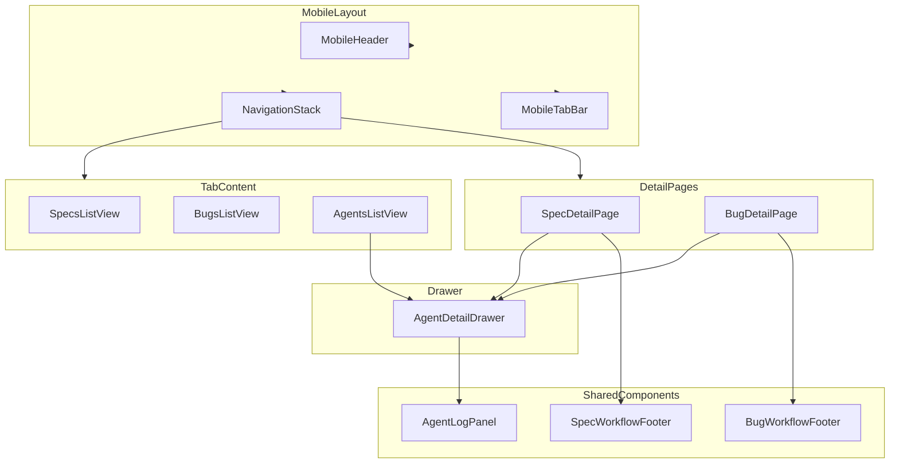
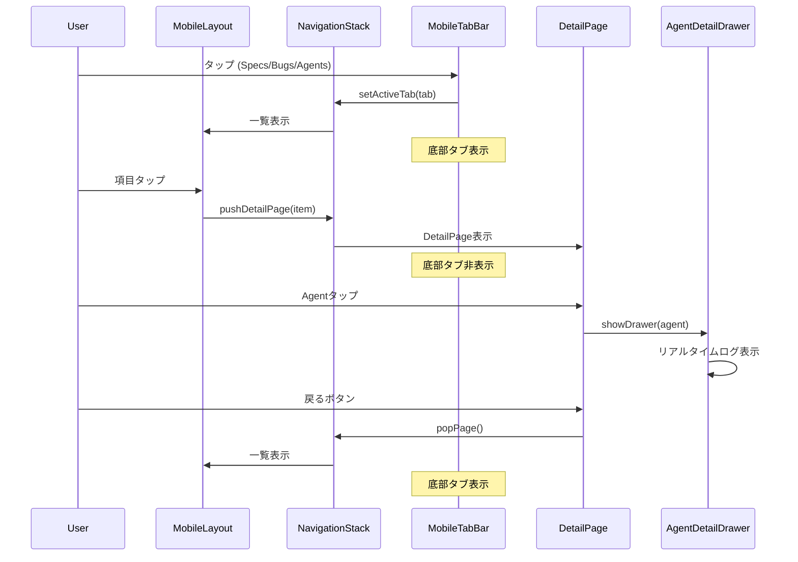
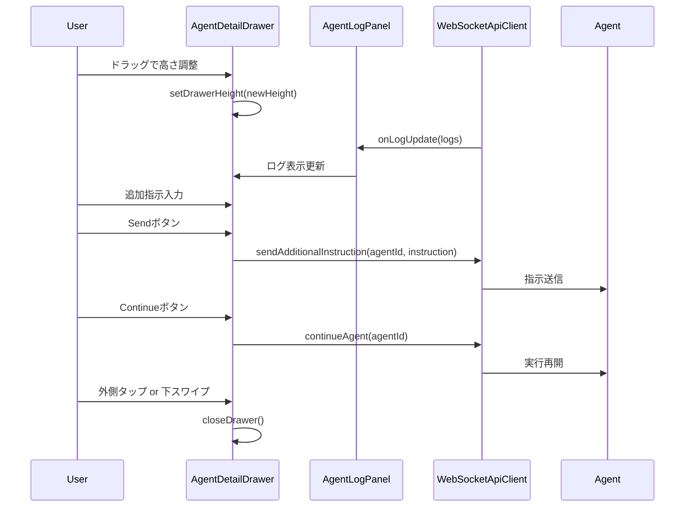

# Design: Mobile Layout Refine

## Overview

**Purpose**: Remote UI（スマートフォン向け）のMobileLayoutを刷新し、モバイルユーザーがSpecs/Bugs/Agentsの各機能に効率的にアクセスし、Agentのリアルタイムログを確認・制御できるようにする。

**Users**: スマートフォンからRemote UIにアクセスするモバイルユーザーが、SDD Orchestratorのワークフロー監視・操作を行う。

**Impact**: 既存のMobileLayoutの2タブ構成（Specs/Bugs）を3タブ構成（Specs/Bugs/Agents）に拡張し、DetailPage表示時のプッシュナビゲーション、AgentDetailDrawerによるログ表示機能を追加する。

### Goals
- 底部タブナビゲーションによるSpecs/Bugs/Agentsへの素早いアクセス
- ネイティブアプリ風のプッシュナビゲーションによる一覧→詳細遷移
- AgentDetailDrawerによるリアルタイムログ表示と追加指示送信
- Desktop Web版とのコンポーネント共用による保守性向上
- BugWorkflowFooterの共通化によるコード重複排除

### Non-Goals
- URL-based routing（React Router導入）
- オフラインサポート / PWA機能
- ジェスチャーベースのナビゲーション（スワイプで戻る）
- Agentログの永続化・履歴閲覧
- 複数Agent選択機能
- 横向き（ランドスケープ）最適化

## Architecture

### Existing Architecture Analysis

**現在のMobileLayout構造**:
- 2タブ構成（Specs/Bugs）、TAB_CONFIG配列で定義
- MobileHeader + MobileTabBar + children構成
- 親コンポーネント（MobileAppContent）がtab stateを管理
- 選択時は同一画面内でリスト→詳細に切り替え（戻るボタン付き）

**既存の共有コンポーネント**:
- `shared/components/agent/`: AgentLogPanel, AgentList, AgentListItem, LogEntryBlock
- `shared/components/workflow/`: SpecWorkflowFooter, PhaseItem, WorkflowViewCore
- `shared/components/bug/`: BugListItem, BugListContainer

**移動対象**:
- `renderer/components/BugWorkflowFooter.tsx` → `shared/components/bug/BugWorkflowFooter.tsx`

### Architecture Pattern & Boundary Map



**Architecture Integration**:
- Selected pattern: State-based Navigation Stack（既存パターンの拡張）
- Domain/feature boundaries: UI層のみ変更、既存のStore/APIは変更なし
- Existing patterns preserved: ApiClient抽象化、Zustand stores、共有コンポーネント
- New components rationale: AgentDetailDrawerはモバイル専用のオーバーレイUI、DetailPageは既存パターンに従った詳細画面
- Steering compliance: DRY原則（BugWorkflowFooter共通化）、KISS原則（React Routerではなく状態ベースナビ）

### Technology Stack

| Layer | Choice / Version | Role in Feature | Notes |
|-------|------------------|-----------------|-------|
| Frontend | React 19 + TypeScript 5.8 | UI実装 | 既存スタック維持 |
| State | React useState + useCallback | ナビゲーション状態管理 | React Router不使用 |
| Styling | Tailwind CSS 4 | モバイル最適化スタイル | 既存スタック維持 |
| Icons | Lucide React | タブアイコン | 既存ライブラリ |
| Communication | WebSocketApiClient | Agent状態取得 | 既存インフラ |

## System Flows

### Navigation Flow



### AgentDetailDrawer Interaction Flow



## Requirements Traceability

| Criterion ID | Summary | Components | Implementation Approach |
|--------------|---------|------------|------------------------|
| 1.1 | 3タブの底部タブバー表示 | MobileTabBar | TAB_CONFIG拡張（Agents追加）、既存コンポーネント修正 |
| 1.2 | タブタップでコンテンツ切替 | MobileLayout, NavigationStack | 既存onTabChangeハンドラ拡張 |
| 1.3 | アクティブタブの視覚的強調 | MobileTabBar | 既存スタイル維持 |
| 1.4 | DetailPage時に底部タブ非表示 | MobileLayout | showTabBar状態追加、条件レンダリング |
| 1.5 | 44x44px以上のタッチターゲット | MobileTabBar | 既存touch-targetクラス維持 |
| 2.1 | Specタップでプッシュ遷移 | MobileAppContent, SpecDetailPage | 新規SpecDetailPageコンポーネント |
| 2.2 | Bugタップでプッシュ遷移 | MobileAppContent, BugDetailPage | 新規BugDetailPageコンポーネント |
| 2.3 | DetailPageに戻るボタン | SpecDetailPage, BugDetailPage | ヘッダー内BackButton実装 |
| 2.4 | 戻るボタンでpop | NavigationStack | popPage関数実装 |
| 2.5 | DetailPage時に底部タブ非表示 | MobileLayout | 1.4と同一実装 |
| 2.6 | React stateでナビ管理 | MobileAppContent | 既存パターン維持、navigationStack状態追加 |
| 3.1 | SpecDetailPage下部にサブタブ | SpecDetailPage, SubTabBar | 新規SubTabBarコンポーネント |
| 3.2 | Specタブ構成 | SpecDetailPage | SpecAgentList + SpecWorkflowArea + WorkflowFooter |
| 3.3 | AgentList固定3項目高さ | SpecAgentList | 固定height + overflow-y-auto |
| 3.4 | AgentタップでDrawer表示 | SpecAgentList, AgentDetailDrawer | onSelectAgent → showDrawer |
| 3.5 | Artifactタブ構成 | SpecArtifactTab | RemoteArtifactEditor再利用 |
| 3.6 | Artifact編集機能共有 | SpecArtifactTab | shared/RemoteArtifactEditor使用 |
| 3.7 | WorkflowFooter表示 | SpecDetailPage | shared/SpecWorkflowFooter使用 |
| 4.1 | BugDetailPage下部にサブタブ | BugDetailPage, SubTabBar | 3.1と同様の実装 |
| 4.2 | Bugタブ構成 | BugDetailPage | BugAgentList + BugWorkflowArea + BugWorkflowFooter |
| 4.3 | AgentList固定3項目高さ | BugAgentList | 3.3と同様の実装 |
| 4.4 | AgentタップでDrawer表示 | BugAgentList, AgentDetailDrawer | 3.4と同様の実装 |
| 4.5 | Artifactタブ構成 | BugArtifactTab | 3.5と同様の実装 |
| 4.6 | BugWorkflowFooter表示 | BugDetailPage | shared/BugWorkflowFooter使用 |
| 5.1 | Agentsタブに一覧表示 | AgentsTabView | ProjectAgentView再構成、AgentList使用 |
| 5.2 | AgentタップでDrawer表示 | AgentsTabView, AgentDetailDrawer | onSelectAgent → showDrawer |
| 5.3 | running Agentカウント表示 | AgentsTabView | ヘッダーバッジまたはカウント表示 |
| 5.4 | Askボタン表示 | AgentsTabView | AskAgentDialog連携 |
| 6.1 | Drawer下からスライドアップ | AgentDetailDrawer | CSS transition + translateY |
| 6.2 | リアルタイムログ表示 | AgentDetailDrawer | shared/AgentLogPanel使用 |
| 6.3 | ドラッグで高さ調整 | AgentDetailDrawer | タッチイベントハンドラ実装 |
| 6.4 | 追加指示入力フィールド | AgentDetailDrawer | AdditionalInstructionInput新規実装 |
| 6.5 | Sendボタン | AgentDetailDrawer | handleSendInstruction実装 |
| 6.6 | Continueボタン | AgentDetailDrawer | handleContinue実装 |
| 6.7 | 外側タップ/下スワイプで閉じる | AgentDetailDrawer | backdrop onClick + swipe検出 |
| 6.8 | Desktop Webと内部レンダリング共有 | AgentDetailDrawer | shared/AgentLogPanel使用 |
| 7.1 | BugWorkflowFooter移動 | BugWorkflowFooter | renderer → shared/components/bug/ |
| 7.2 | 既存機能維持 | BugWorkflowFooter | インタフェース変更なし |
| 7.3 | Electron/RemoteUIで使用可能 | BugWorkflowFooter | platform-agnostic実装 |
| 7.4 | Electronインポートパス更新 | BugWorkflowView | import from shared/components/bug/ |
| 8.1 | Specs一覧共有 | SpecsView | 既存shared/SpecListContainer使用 |
| 8.2 | Bugs一覧共有 | BugsView | 既存shared/BugListContainer使用 |
| 8.3 | フィルタ共有 | SpecsView, BugsView | 既存useSpecListLogic, useBugListLogic使用 |
| 8.4 | 既存実装使用 | SpecsView, BugsView | 現Remote UI実装を継続使用 |

### Coverage Validation Checklist

- [x] Every criterion ID from requirements.md appears in the table above
- [x] Each criterion has specific component names (not generic references)
- [x] Implementation approach distinguishes "reuse existing" vs "new implementation"
- [x] User-facing criteria specify concrete UI components (not just "shared components")

## Components and Interfaces

### Component Summary

| Component | Domain/Layer | Intent | Req Coverage | Key Dependencies | Contracts |
|-----------|--------------|--------|--------------|------------------|-----------|
| MobileLayout | UI/Layout | モバイルレイアウト全体制御 | 1.1-1.5 | MobileTabBar, NavigationStack (P0) | State |
| MobileTabBar | UI/Navigation | 底部タブナビゲーション | 1.1-1.5 | - (P0) | - |
| NavigationStack | UI/State | ナビゲーション状態管理 | 2.1-2.6 | - (P0) | State |
| SpecDetailPage | UI/Detail | Spec詳細表示 | 3.1-3.7 | AgentDetailDrawer, SpecWorkflowFooter (P0) | State |
| BugDetailPage | UI/Detail | Bug詳細表示 | 4.1-4.6 | AgentDetailDrawer, BugWorkflowFooter (P0) | State |
| AgentsTabView | UI/Tab | Agents一覧タブ | 5.1-5.4 | AgentList, AgentDetailDrawer (P0) | State |
| AgentDetailDrawer | UI/Overlay | Agentログ・操作Drawer | 6.1-6.8 | AgentLogPanel (P0), ApiClient (P1) | State, API |
| BugWorkflowFooter | UI/Workflow | Bug自動実行フッター | 7.1-7.4 | - (P0) | - |
| SubTabBar | UI/Navigation | DetailPage内サブタブ | 3.1, 4.1 | - (P0) | - |

### UI Layer

#### NavigationStack (Hook)

| Field | Detail |
|-------|--------|
| Intent | モバイルナビゲーション状態の管理（一覧/詳細の切り替え） |
| Requirements | 2.1, 2.2, 2.3, 2.4, 2.5, 2.6 |

**Responsibilities & Constraints**
- 一覧表示 / DetailPage表示の状態管理
- DetailPage表示時のタブバー非表示フラグ管理
- pushPage / popPage操作の提供

**Dependencies**
- Inbound: MobileAppContent - ナビゲーション操作 (P0)
- Outbound: None

**Contracts**: State [x]

##### State Management

```typescript
interface NavigationState {
  /** 現在のアクティブタブ */
  activeTab: MobileTab;
  /** DetailPage表示中のコンテキスト（null = 一覧表示） */
  detailContext: DetailContext | null;
  /** 底部タブバー表示フラグ */
  showTabBar: boolean;
}

interface DetailContext {
  type: 'spec' | 'bug';
  id: string;
  /** Specの場合のSpecDetail */
  specDetail?: SpecDetail;
  /** Bugの場合のBugDetail */
  bugDetail?: BugDetail;
}

interface UseNavigationStackReturn {
  state: NavigationState;
  setActiveTab: (tab: MobileTab) => void;
  pushSpecDetail: (spec: SpecMetadataWithPath, detail: SpecDetail) => void;
  pushBugDetail: (bug: BugMetadataWithPath, detail: BugDetail) => void;
  popPage: () => void;
  isDetailPage: boolean;
}
```

**Implementation Notes**
- Integration: MobileAppContentで使用し、MobileLayoutに状態を渡す
- Validation: detailContextがnullでない場合のみpopPage可能
- Risks: 状態の同期ずれ（タブ切替時にdetailContextをクリア必須）

---

#### SpecDetailPage

| Field | Detail |
|-------|--------|
| Intent | Spec詳細表示（Spec/Artifactサブタブ、AgentList、WorkflowFooter） |
| Requirements | 3.1, 3.2, 3.3, 3.4, 3.5, 3.6, 3.7 |

**Responsibilities & Constraints**
- Spec/Artifactサブタブの表示切替
- SpecAgent一覧（3項目固定高さ）の表示
- SpecWorkflowArea（ワークフロー進捗）の表示
- SpecWorkflowFooter（自動実行ボタン）の表示
- AgentDetailDrawerの表示制御

**Dependencies**
- Inbound: MobileAppContent - Spec情報 (P0)
- Outbound: AgentDetailDrawer - ログ表示 (P0), SpecWorkflowFooter - 自動実行 (P0), RemoteArtifactEditor - アーティファクト編集 (P1)
- External: ApiClient - Agent情報取得 (P1)

**Contracts**: State [x]

##### Props Interface

```typescript
interface SpecDetailPageProps {
  /** 選択されたSpec */
  spec: SpecMetadataWithPath;
  /** Spec詳細情報 */
  specDetail: SpecDetail;
  /** API Client */
  apiClient: ApiClient;
  /** 戻るボタンクリック */
  onBack: () => void;
  /** 自動実行状態 */
  isAutoExecuting: boolean;
  /** 自動実行開始/停止 */
  onAutoExecution: () => void;
}
```

##### State Management

```typescript
interface SpecDetailPageState {
  /** アクティブサブタブ */
  activeSubTab: 'spec' | 'artifact';
  /** Drawer表示対象Agent */
  selectedAgent: AgentInfo | null;
  /** Drawer表示フラグ */
  showDrawer: boolean;
  /** SpecのAgent一覧 */
  specAgents: AgentInfo[];
}
```

**Implementation Notes**
- Integration: AgentListは固定高さ（h-36相当、3項目分）でoverflow-y-auto
- Validation: specDetailがnullの場合はローディング表示
- Risks: Agent一覧のポーリング頻度による性能影響

---

#### BugDetailPage

| Field | Detail |
|-------|--------|
| Intent | Bug詳細表示（Bug/Artifactサブタブ、AgentList、BugWorkflowFooter） |
| Requirements | 4.1, 4.2, 4.3, 4.4, 4.5, 4.6 |

**Responsibilities & Constraints**
- Bug/Artifactサブタブの表示切替
- BugAgent一覧（3項目固定高さ）の表示
- BugWorkflowArea（ワークフロー進捗）の表示
- BugWorkflowFooter（自動実行ボタン）の表示
- AgentDetailDrawerの表示制御

**Dependencies**
- Inbound: MobileAppContent - Bug情報 (P0)
- Outbound: AgentDetailDrawer - ログ表示 (P0), BugWorkflowFooter - 自動実行 (P0)
- External: ApiClient - Agent情報取得 (P1)

**Contracts**: State [x]

##### Props Interface

```typescript
interface BugDetailPageProps {
  /** 選択されたBug */
  bug: BugMetadataWithPath;
  /** Bug詳細情報 */
  bugDetail: BugDetail;
  /** API Client */
  apiClient: ApiClient;
  /** 戻るボタンクリック */
  onBack: () => void;
}
```

**Implementation Notes**
- Integration: SpecDetailPageと同様の構造、BugWorkflowFooterを使用
- Validation: bugDetailがnullの場合はローディング表示
- Risks: SpecDetailPageとの共通化検討（将来的にBaseDetailPage抽出）

---

#### AgentsTabView

| Field | Detail |
|-------|--------|
| Intent | AgentsタブのプロジェクトレベルAgent一覧表示 |
| Requirements | 5.1, 5.2, 5.3, 5.4 |

**Responsibilities & Constraints**
- プロジェクトレベルAgent一覧の表示
- running Agentカウントの表示
- Askボタン（AskAgentDialog連携）
- AgentDetailDrawerの表示制御

**Dependencies**
- Inbound: MobileAppContent - タブ表示 (P0)
- Outbound: AgentDetailDrawer - ログ表示 (P0), AskAgentDialog - Ask実行 (P1)
- External: ApiClient - Agent情報取得 (P0)

**Contracts**: State [x]

##### Props Interface

```typescript
interface AgentsTabViewProps {
  /** API Client */
  apiClient: ApiClient;
}
```

##### State Management

```typescript
interface AgentsTabViewState {
  /** プロジェクトAgent一覧 */
  projectAgents: AgentInfo[];
  /** running Agentカウント */
  runningCount: number;
  /** 選択中Agent（Drawer表示用） */
  selectedAgent: AgentInfo | null;
  /** Drawer表示フラグ */
  showDrawer: boolean;
  /** AskDialog表示フラグ */
  isAskDialogOpen: boolean;
}
```

**Implementation Notes**
- Integration: 既存ProjectAgentViewのロジックを再利用、AgentListコンポーネント使用
- Validation: Agent一覧が空の場合は空状態表示
- Risks: 多数のAgent実行時のリスト性能

---

#### AgentDetailDrawer

| Field | Detail |
|-------|--------|
| Intent | Agentログのリアルタイム表示と追加指示送信用オーバーレイDrawer |
| Requirements | 6.1, 6.2, 6.3, 6.4, 6.5, 6.6, 6.7, 6.8 |

**Responsibilities & Constraints**
- 下からスライドアップするDrawer表示
- ドラッグによる高さ調整
- リアルタイムログ表示（AgentLogPanel使用）
- 追加指示入力・送信
- Continue（実行再開）機能
- 外側タップ/下スワイプで閉じる

**Dependencies**
- Inbound: SpecDetailPage, BugDetailPage, AgentsTabView - Drawer表示制御 (P0)
- Outbound: AgentLogPanel - ログ表示 (P0)
- External: ApiClient - 指示送信・Continue (P0)

**Contracts**: State [x] / API [x]

##### Props Interface

```typescript
interface AgentDetailDrawerProps {
  /** 表示対象Agent */
  agent: AgentInfo;
  /** ログエントリ */
  logs: LogEntry[];
  /** 表示状態 */
  isOpen: boolean;
  /** 閉じるコールバック */
  onClose: () => void;
  /** 追加指示送信 */
  onSendInstruction: (instruction: string) => Promise<void>;
  /** Continue送信 */
  onContinue: () => Promise<void>;
  /** test-id */
  testId?: string;
}
```

##### State Management

```typescript
interface AgentDetailDrawerState {
  /** Drawer高さ（vh単位） */
  drawerHeight: number;
  /** ドラッグ中フラグ */
  isDragging: boolean;
  /** 追加指示入力値 */
  instructionInput: string;
  /** 送信中フラグ */
  isSending: boolean;
}
```

##### API Contract

| Method | Endpoint/Handler | Request | Response | Errors |
|--------|------------------|---------|----------|--------|
| sendInstruction | apiClient.sendAgentInstruction | agentId, instruction | Result<void, Error> | 400 (Agent not running) |
| continueAgent | apiClient.continueAgent | agentId | Result<void, Error> | 400 (Agent not running) |

**Implementation Notes**
- Integration: AgentLogPanelをそのまま内包、touch eventでドラッグ検出
- Validation: agent.status !== 'running'の場合、Send/Continueボタン無効化
- Risks: ドラッグ検出とスクロールの競合（touchmove時のpreventDefault制御必要）

---

#### SubTabBar

| Field | Detail |
|-------|--------|
| Intent | DetailPage内のサブタブ（Spec/Artifact, Bug/Artifact）表示 |
| Requirements | 3.1, 4.1 |

**Responsibilities & Constraints**
- 2つのサブタブ表示
- アクティブタブの視覚的強調
- タップでタブ切替

**Dependencies**
- Inbound: SpecDetailPage, BugDetailPage - タブ状態 (P0)

**Contracts**: None

##### Props Interface

```typescript
interface SubTabBarProps {
  /** タブ設定 */
  tabs: { id: string; label: string }[];
  /** アクティブタブID */
  activeTab: string;
  /** タブ変更コールバック */
  onTabChange: (tabId: string) => void;
  /** test-id */
  testId?: string;
}
```

**Implementation Notes**
- Integration: DetailPageの下部に固定配置
- Validation: tabs配列は2要素固定

---

#### BugWorkflowFooter (Shared)

| Field | Detail |
|-------|--------|
| Intent | Bug自動実行・Worktree変換ボタンのフッター（共有コンポーネント） |
| Requirements | 7.1, 7.2, 7.3, 7.4 |

**Responsibilities & Constraints**
- 自動実行開始/停止ボタン
- Worktree変換ボタン（条件付き表示）
- Electron版/Remote UI版で共有

**Dependencies**
- Inbound: BugDetailPage, BugWorkflowView (Electron) - 表示 (P0)
- External: None（props経由で操作受け取り）

**Contracts**: None

##### Props Interface

```typescript
/** 既存のBugWorkflowFooterPropsを維持 */
interface BugWorkflowFooterProps {
  isAutoExecuting: boolean;
  hasRunningAgents: boolean;
  onAutoExecution: () => void;
  isOnMain: boolean;
  bugJson: BugJson | null | undefined;
  onConvertToWorktree: () => void;
  isConverting: boolean;
}
```

**Implementation Notes**
- Integration: `renderer/components/BugWorkflowFooter.tsx`を`shared/components/bug/BugWorkflowFooter.tsx`に移動
- Validation: 既存の表示条件ロジック（canShowConvertButton）を維持
- Risks: インポートパス変更による既存コードへの影響（全ファイル更新必要）

## Data Models

### Navigation State Model

```typescript
/** モバイルナビゲーション状態 */
interface MobileNavigationState {
  /** 現在のアクティブタブ */
  activeTab: 'specs' | 'bugs' | 'agents';
  /** DetailPage表示中のコンテキスト */
  detailContext: SpecDetailContext | BugDetailContext | null;
}

interface SpecDetailContext {
  type: 'spec';
  spec: SpecMetadataWithPath;
  specDetail: SpecDetail;
}

interface BugDetailContext {
  type: 'bug';
  bug: BugMetadataWithPath;
  bugDetail: BugDetail;
}
```

### Drawer State Model

```typescript
/** AgentDetailDrawer状態 */
interface DrawerState {
  /** 表示状態 */
  isOpen: boolean;
  /** 表示対象Agent */
  agent: AgentInfo | null;
  /** 高さ（0-100, vh単位）、デフォルト: 50 */
  height: number;
}
```

**初期高さ仕様**: AgentDetailDrawerはデフォルト高さ50vh（画面半分）で表示される。ユーザーはドラッグ操作で高さを調整可能（最小25vh、最大90vh）。

## Error Handling

### Error Strategy
モバイルUIにおけるエラーは、トースト通知またはインライン表示でユーザーに伝達する。

### Error Categories and Responses

**User Errors (4xx)**:
- Agent not running（Send/Continue操作時）→ トースト通知「Agentは実行中ではありません」
- Invalid instruction（空の指示）→ 送信ボタン無効化、入力欄に警告表示

**System Errors (5xx)**:
- WebSocket切断 → ReconnectOverlay表示（既存機能）
- API呼び出し失敗 → トースト通知、リトライボタン表示

**Business Logic Errors**:
- Auto-execution中の手動操作制限 → ボタン無効化、ツールチップで説明

## Testing Strategy

### Unit Tests
- `NavigationStack`: pushPage/popPage動作、タブ切替時のdetailContextクリア
- `AgentDetailDrawer`: 高さ調整ロジック、Send/Continue状態管理
- `SubTabBar`: タブ切替コールバック
- `BugWorkflowFooter`: canShowConvertButton条件判定

### Integration Tests
- MobileLayout → DetailPage遷移時のタブバー非表示
- AgentDetailDrawer表示時のログストリーミング
- BugWorkflowFooter共通化後のElectron/RemoteUI両方での動作

### E2E Tests
- タブ切替 → 一覧表示 → 項目タップ → DetailPage表示 → 戻るボタンフロー
- AgentDetailDrawer表示 → 高さ調整 → 追加指示送信 → 閉じるフロー
- Agentsタブ → Askボタン → AskAgentDialog → 実行フロー

## Design Decisions

### DD-001: State-based Navigation over React Router

| Field | Detail |
|-------|--------|
| Status | Accepted |
| Context | モバイルナビゲーションの実装方式を選択する必要があった |
| Decision | React Routerを導入せず、React state（useState + useCallback）でナビゲーションを管理する |
| Rationale | 既存のMobileLayoutパターンとの一貫性、React Router導入の複雑さ回避、単純なpush/pop操作で十分 |
| Alternatives Considered | React Router導入（URL駆動ナビゲーション） |
| Consequences | ブラウザ履歴との統合なし、ディープリンク不可（Non-Goalsで許容） |

### DD-002: Bottom Tab Hide on DetailPage

| Field | Detail |
|-------|--------|
| Status | Accepted |
| Context | DetailPage表示時の底部タブ表示/非表示を決定する必要があった |
| Decision | DetailPage表示時は底部タブを非表示にする |
| Rationale | モバイル画面スペースの有効活用、ネイティブアプリ風のプッシュナビゲーションUX |
| Alternatives Considered | 常時タブ表示（Instagram風） |
| Consequences | DetailPageから直接タブ切替不可（一度戻る必要あり）、画面スペース最大化 |

### DD-003: AgentDetailDrawer as Overlay

| Field | Detail |
|-------|--------|
| Status | Accepted |
| Context | Agentログ表示方式を決定する必要があった |
| Decision | 下からスライドアップするオーバーレイDrawerで表示する |
| Rationale | DetailPageのコンテキストを維持しながらログ確認可能、モバイルネイティブアプリで一般的なパターン |
| Alternatives Considered | 別画面への遷移、インライン展開 |
| Consequences | Drawer高さ調整のタッチイベント処理が必要、複雑なジェスチャー認識 |

### DD-004: BugWorkflowFooter Shared Component

| Field | Detail |
|-------|--------|
| Status | Accepted |
| Context | BugWorkflowFooterがElectron専用に実装されており、Remote UIでも必要になった |
| Decision | `renderer/components/`から`shared/components/bug/`に移動して共通化する |
| Rationale | DRY原則、Desktop Web/Mobile間でのUI一貫性確保 |
| Alternatives Considered | Remote UI専用の別実装を作成 |
| Consequences | Electron側のインポートパス変更が必要、既存テストの更新 |

### DD-005: Fixed Height Agent List in DetailPage

| Field | Detail |
|-------|--------|
| Status | Accepted |
| Context | DetailPage内のAgent一覧表示方式を決定する必要があった |
| Decision | 固定高さ（3項目分）でスクロール可能なリストを表示する |
| Rationale | ワークフローエリアとのバランス確保、予測可能なレイアウト |
| Alternatives Considered | 可変高さ（Agentが多い場合に拡張）、折りたたみパネル |
| Consequences | 4つ以上のAgentがある場合はスクロール必要 |

### DD-006: Draggable Drawer Height

| Field | Detail |
|-------|--------|
| Status | Accepted |
| Context | AgentDetailDrawerの高さ調整方式を決定する必要があった |
| Decision | ユーザーがドラッグで高さを調整可能にする |
| Rationale | ユーザーの好みに応じた柔軟なUI、ログの可読性とDetailPageコンテンツのバランス調整 |
| Alternatives Considered | 固定高さ、プリセット高さ選択（半分/全画面） |
| Consequences | タッチイベントハンドリングの複雑さ、スクロールとの競合解決必要 |

## Integration & Deprecation Strategy

### Files Requiring Modification (Wiring Points)

| File | Modification Type | Description |
|------|------------------|-------------|
| `remote-ui/layouts/MobileLayout.tsx` | Extend | TAB_CONFIG拡張、showTabBar prop追加 |
| `remote-ui/App.tsx` | Extend | MobileAppContent改修（NavigationStack使用、新DetailPage統合） |
| `remote-ui/layouts/index.ts` | Extend | 新コンポーネントエクスポート追加 |
| `remote-ui/views/index.ts` | Extend | 新コンポーネントエクスポート追加 |
| `renderer/components/BugWorkflowView.tsx` | Update import | BugWorkflowFooterインポートパス変更 |
| `shared/components/bug/index.ts` | Extend | BugWorkflowFooterエクスポート追加 |

### Files to be Moved

| Source | Destination | Description |
|--------|-------------|-------------|
| `renderer/components/BugWorkflowFooter.tsx` | `shared/components/bug/BugWorkflowFooter.tsx` | 共通化 |
| `renderer/components/BugWorkflowFooter.test.tsx` | `shared/components/bug/BugWorkflowFooter.test.tsx` | テスト移動 |

### New Files to be Created

| File | Description |
|------|-------------|
| `remote-ui/components/SpecDetailPage.tsx` | Spec詳細ページ |
| `remote-ui/components/BugDetailPage.tsx` | Bug詳細ページ |
| `remote-ui/components/AgentsTabView.tsx` | Agentsタブビュー |
| `remote-ui/components/AgentDetailDrawer.tsx` | Agentログ表示Drawer |
| `remote-ui/components/SubTabBar.tsx` | サブタブバー |
| `remote-ui/hooks/useNavigationStack.ts` | ナビゲーション状態管理Hook |

### Files to be Deleted

No existing files will be deleted. The BugWorkflowFooter in `renderer/components/` will be moved (not deleted) to `shared/components/bug/`.
