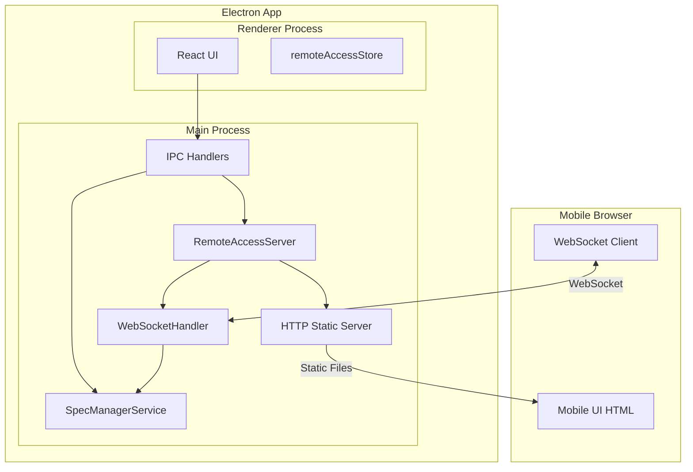
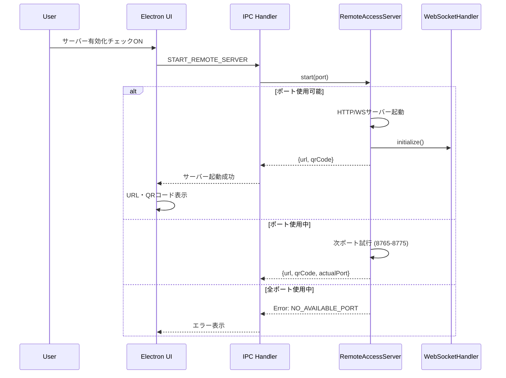
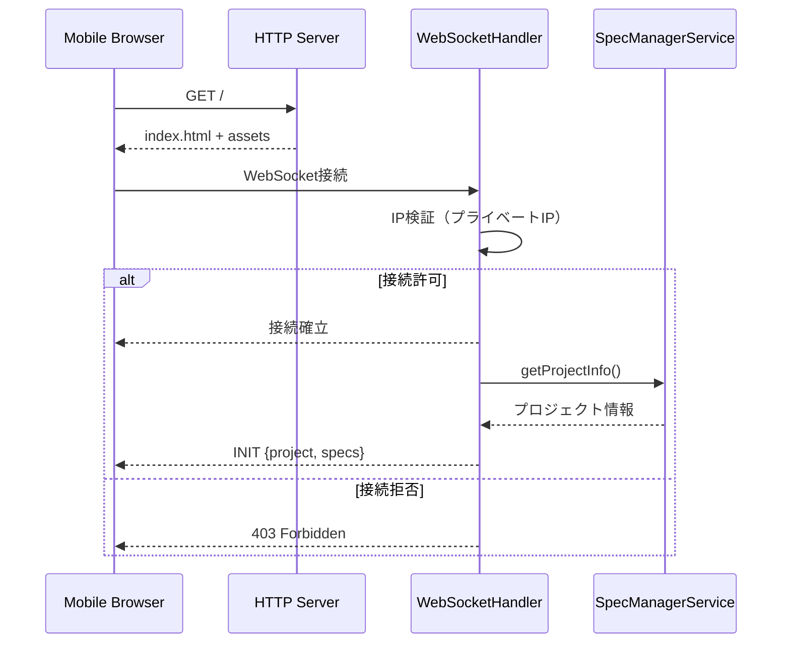
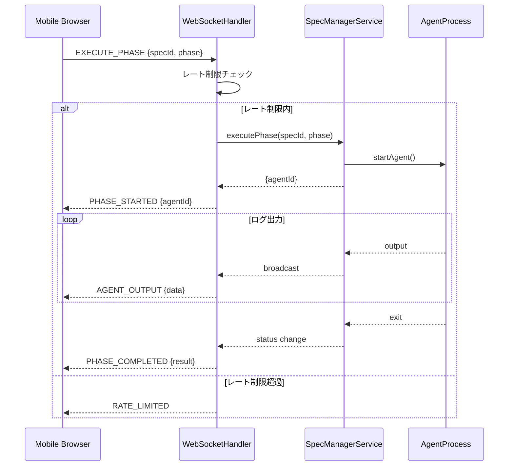
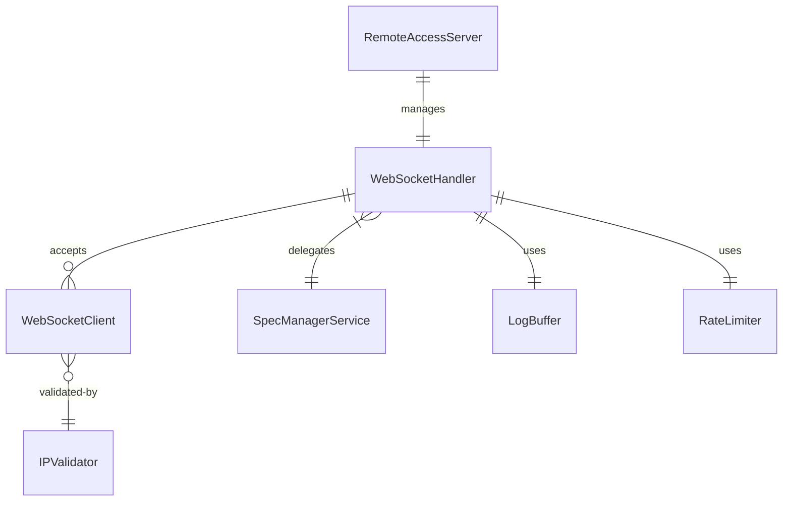

# Technical Design Document

## Overview

**Purpose**: 本機能は、SDD Manager（Electron版）にHTTP/WebSocketサーバーを組み込み、スマートフォンブラウザからのリモートアクセスを可能にする。LAN内運用を前提とし、認証不要でシンプルな操作性を提供する。

**Users**: モバイルデバイスを使用する開発者が、デスクから離れた状態でもSDDワークフローの進捗確認と操作を行う。

**Impact**: Electronメインプロセスに新規サーバーコンポーネントを追加し、既存のワークフロー制御機能をWebSocket経由で公開する。モバイルUIは静的HTMLとしてサーバーから配信される。

### Goals

- Electronアプリ内からHTTP/WebSocketサーバーの起動・停止を制御可能にする
- スマートフォンブラウザからSpec状態の確認とワークフロー操作を実現する
- QRコードによる簡単な接続設定を提供する
- リアルタイムログ表示とワークフロー状態の同期を実現する

### Non-Goals

- インターネット経由でのリモートアクセス（LAN内限定）
- 認証・認可機能（LAN内運用のためセキュリティはネットワークレベルで担保）
- Electronアプリ本体のUIへの大規模変更
- React/Vue等のフレームワークを使用したモバイルUI

## Architecture

### Existing Architecture Analysis

現在のElectronアプリは以下の構造を持つ：
- **メインプロセス**: `src/main/` - IPC ハンドラ、サービス層（agentProcess, specManagerService等）
- **プリロード**: `src/preload/` - contextBridge経由でのAPI公開
- **レンダラー**: `src/renderer/` - React UI、Zustandストア

既存のワークフロー制御は `SpecManagerService` と `workflowStore` で管理されており、IPCハンドラ経由でレンダラーからアクセスされている。

### Architecture Pattern & Boundary Map



**Architecture Integration**:
- **Selected pattern**: サービスレイヤー拡張 - 既存のサービスパターンに従いRemoteAccessServerを追加
- **Domain boundaries**: RemoteAccessServerはワークフロー制御のゲートウェイとして機能し、既存のSpecManagerServiceに委譲
- **Existing patterns preserved**: IPCハンドラ経由でのレンダラー通信、Zustandによる状態管理
- **New components rationale**:
  - RemoteAccessServer: HTTP/WebSocket統合サーバーの管理
  - WebSocketHandler: WebSocket接続とメッセージルーティング
  - remoteAccessStore: サーバー状態のUI表示用
- **Steering compliance**: Electronメインプロセスにサービスを追加するパターンに準拠

### Technology Stack

| Layer | Choice / Version | Role in Feature | Notes |
|-------|------------------|-----------------|-------|
| Backend / Services | ws ^8.x | WebSocketサーバー実装 | Node.js標準的選択 |
| Backend / Services | Node.js http | HTTPサーバー（静的ファイル配信） | 追加依存なし |
| Backend / Services | qrcode ^1.5.x | QRコード生成（Data URL） | シンプルなAPI |
| Backend / Services | rate-limiter-flexible ^5.x | レート制限 | メモリストア使用 |
| Frontend / Mobile | Tailwind CSS v4 CDN | スタイリング | ビルド不要 |
| Frontend / Mobile | Vanilla JS | クライアントロジック | フレームワーク不要 |

## System Flows

### サーバー起動フロー



### モバイルクライアント接続フロー



### ワークフロー操作フロー



## Requirements Traceability

| Requirement | Summary | Components | Interfaces | Flows |
|-------------|---------|------------|------------|-------|
| 1.1-1.6 | サーバー起動・停止制御 | RemoteAccessServer, remoteAccessStore | IRemoteAccessServer, IPC handlers | サーバー起動フロー |
| 2.1-2.3 | 複数インスタンス対応 | RemoteAccessServer | portManager | サーバー起動フロー |
| 3.1-3.3 | プロジェクト・Spec状態取得 | WebSocketHandler | WebSocketMessage | モバイル接続フロー |
| 4.1-4.5 | リアルタイムログ表示 | WebSocketHandler, LogBuffer | WebSocketMessage | ワークフロー操作フロー |
| 5.1-5.8 | ワークフロー操作 | WebSocketHandler, SpecManagerService | WebSocketMessage | ワークフロー操作フロー |
| 6.1-6.4 | Spec選択 | MobileUI, WebSocketHandler | WebSocketMessage | - |
| 7.1-7.6 | モバイルUI実装 | MobileUI（静的HTML） | - | - |
| 8.1-8.5 | 接続管理 | WebSocketHandler, MobileUI | WebSocketMessage | モバイル接続フロー |
| 9.1-9.4 | セキュリティ考慮 | IPValidator, RateLimiter | - | モバイル接続フロー |

## Components and Interfaces

| Component | Domain/Layer | Intent | Req Coverage | Key Dependencies (P0/P1) | Contracts |
|-----------|--------------|--------|--------------|--------------------------|-----------|
| RemoteAccessServer | Main/Service | HTTP/WSサーバーの起動・停止・状態管理 | 1.1-1.6, 2.1-2.3 | ws (P0), qrcode (P0) | Service |
| WebSocketHandler | Main/Service | WS接続管理とメッセージルーティング | 3.1-3.3, 4.1-4.5, 5.1-5.8, 8.1-8.5 | SpecManagerService (P0) | Service, Event |
| IPValidator | Main/Util | プライベートIPアドレス検証 | 9.1 | - | Service |
| RateLimiter | Main/Util | リクエストレート制限 | 9.3-9.4 | rate-limiter-flexible (P1) | Service |
| LogBuffer | Main/Service | ログ履歴の保持と配信 | 4.2 | - | State |
| remoteAccessStore | Renderer/Store | サーバー状態のUI表示管理 | 1.4-1.6, 8.5 | - | State |
| MobileUI | Static/HTML | スマートフォン向けUI | 6.1-6.4, 7.1-7.6 | Tailwind CDN (P1) | - |

### Main Process Services

#### RemoteAccessServer

| Field | Detail |
|-------|--------|
| Intent | HTTP静的ファイル配信とWebSocketサーバーを統合管理 |
| Requirements | 1.1, 1.2, 1.3, 1.4, 1.5, 1.6, 2.1, 2.2, 2.3 |

**Responsibilities & Constraints**
- HTTP/WebSocketサーバーのライフサイクル管理
- ポート自動選択（8765-8775範囲）
- QRコード生成（接続URL）
- ローカルIPアドレス検出
- サーバー状態（起動中/停止中）の管理

**Dependencies**
- Outbound: WebSocketHandler - WebSocket接続の委譲 (P0)
- External: ws - WebSocketサーバー実装 (P0)
- External: qrcode - QRコード生成 (P0)
- External: Node.js http - HTTPサーバー (P0)

**Contracts**: Service [x] / API [ ] / Event [ ] / Batch [ ] / State [ ]

##### Service Interface

```typescript
interface IRemoteAccessServer {
  /**
   * サーバーを起動
   * @param preferredPort 希望ポート（デフォルト: 8765）
   * @returns 起動結果（実際のポート、URL、QRコード）
   */
  start(preferredPort?: number): Promise<Result<ServerStartResult, ServerError>>;

  /**
   * サーバーを停止
   */
  stop(): Promise<void>;

  /**
   * サーバー状態を取得
   */
  getStatus(): ServerStatus;

  /**
   * 接続中のクライアント数を取得
   */
  getClientCount(): number;

  /**
   * サーバー状態変更イベントを購読
   */
  onStatusChange(callback: (status: ServerStatus) => void): () => void;
}

interface ServerStartResult {
  readonly port: number;
  readonly url: string;
  readonly qrCodeDataUrl: string;
  readonly localIp: string;
}

interface ServerStatus {
  readonly isRunning: boolean;
  readonly port: number | null;
  readonly url: string | null;
  readonly clientCount: number;
}

type ServerError =
  | { type: 'NO_AVAILABLE_PORT'; triedPorts: number[] }
  | { type: 'ALREADY_RUNNING'; port: number }
  | { type: 'NETWORK_ERROR'; message: string };
```

- Preconditions: サーバー未起動状態でstart()を呼び出す
- Postconditions: サーバー起動後はgetStatus().isRunning === true
- Invariants: ポート範囲は8765-8775に制限

**Implementation Notes**
- Integration: Electronメインプロセスのサービスとして`src/main/services/remoteAccessServer.ts`に実装
- Validation: ポート利用可能性を`net.createServer()`で事前チェック
- Risks: ファイアウォールによるポートブロック、複数ネットワークインターフェース時のIP選択

#### WebSocketHandler

| Field | Detail |
|-------|--------|
| Intent | WebSocket接続管理とメッセージルーティング |
| Requirements | 3.1, 3.2, 3.3, 4.1, 4.2, 5.1, 5.2, 5.3, 5.4, 5.5, 5.6, 5.7, 5.8, 8.1, 8.2, 8.5 |

**Responsibilities & Constraints**
- WebSocket接続の受け入れとIP検証
- メッセージのパースとルーティング
- SpecManagerServiceへのワークフロー操作委譲
- 全クライアントへのブロードキャスト
- 接続数の追跡

**Dependencies**
- Inbound: RemoteAccessServer - サーバー初期化時に呼び出される (P0)
- Outbound: SpecManagerService - ワークフロー操作の委譲 (P0)
- Outbound: IPValidator - 接続IP検証 (P1)
- Outbound: RateLimiter - リクエスト制限 (P1)
- Outbound: LogBuffer - ログ履歴取得 (P1)

**Contracts**: Service [x] / API [ ] / Event [x] / Batch [ ] / State [ ]

##### Service Interface

```typescript
interface IWebSocketHandler {
  /**
   * WebSocketサーバーを初期化
   */
  initialize(wss: WebSocketServer): void;

  /**
   * 全クライアントにメッセージをブロードキャスト
   */
  broadcast(message: WebSocketMessage): void;

  /**
   * 特定クライアントにメッセージを送信
   */
  send(clientId: string, message: WebSocketMessage): void;

  /**
   * 接続中のクライアント数を取得
   */
  getClientCount(): number;

  /**
   * 全接続を切断
   */
  disconnectAll(): void;
}
```

##### Event Contract

**Published events** (サーバー → クライアント):
| Event Type | Payload | Description |
|------------|---------|-------------|
| `INIT` | `{project, specs, logs}` | 初期接続時の状態送信 |
| `SPECS_UPDATED` | `{specs}` | Spec一覧の更新 |
| `SPEC_CHANGED` | `{specId, spec}` | 個別Specの状態変更 |
| `AGENT_OUTPUT` | `{agentId, stream, data}` | エージェントログ出力 |
| `AGENT_STATUS` | `{agentId, status}` | エージェント状態変更 |
| `PHASE_STARTED` | `{specId, phase, agentId}` | フェーズ開始 |
| `PHASE_COMPLETED` | `{specId, phase, result}` | フェーズ完了 |
| `ERROR` | `{code, message}` | エラー通知 |
| `RATE_LIMITED` | `{retryAfter}` | レート制限通知 |

**Subscribed events** (クライアント → サーバー):
| Event Type | Payload | Description |
|------------|---------|-------------|
| `GET_SPECS` | - | Spec一覧要求 |
| `SELECT_SPEC` | `{specId}` | Spec選択 |
| `EXECUTE_PHASE` | `{specId, phase}` | フェーズ実行 |
| `STOP_WORKFLOW` | `{agentId}` | ワークフロー停止 |
| `RESUME_WORKFLOW` | `{agentId}` | ワークフロー再開 |

- Ordering: メッセージは受信順に処理、ブロードキャストは送信順序保証なし
- Delivery guarantees: At-most-once（WebSocket接続が維持されている間のみ配信）

**Implementation Notes**
- Integration: `src/main/services/webSocketHandler.ts`に実装、SpecManagerServiceのイベントを購読
- Validation: 全メッセージはJSON.parseで検証、不正形式は無視
- Risks: 大量クライアント接続時のブロードキャスト負荷

#### IPValidator

| Field | Detail |
|-------|--------|
| Intent | プライベートIPアドレス範囲の検証 |
| Requirements | 9.1 |

**Responsibilities & Constraints**
- RFC 1918 プライベートIP範囲のチェック
- ループバックアドレス（127.x.x.x）の許可
- リンクローカルアドレス（169.254.x.x）の許可

**Dependencies**
- Inbound: WebSocketHandler - 接続検証時に呼び出し (P1)

**Contracts**: Service [x] / API [ ] / Event [ ] / Batch [ ] / State [ ]

##### Service Interface

```typescript
interface IIPValidator {
  /**
   * IPアドレスがプライベート範囲かどうかを検証
   * @param ip 検証するIPアドレス
   * @returns プライベートIPならtrue
   */
  isPrivateIP(ip: string): boolean;

  /**
   * ローカルネットワークのIPアドレスを取得
   * @returns 最初に見つかった非ループバックIPv4アドレス
   */
  getLocalIP(): string;
}
```

- Preconditions: ipは有効なIPv4アドレス形式
- Postconditions: boolean値を返す（例外をスローしない）

**Implementation Notes**
- Integration: `src/main/utils/ipValidator.ts`にユーティリティ関数として実装
- Validation: 正規表現でIPv4形式を検証後、範囲チェック

#### RateLimiter

| Field | Detail |
|-------|--------|
| Intent | クライアントごとのリクエストレート制限 |
| Requirements | 9.3, 9.4 |

**Responsibilities & Constraints**
- クライアントIPごとに100リクエスト/分の制限
- 制限超過時は429エラーに相当するメッセージを返す
- メモリベースのカウンタ（永続化不要）

**Dependencies**
- Inbound: WebSocketHandler - メッセージ処理前に呼び出し (P1)
- External: rate-limiter-flexible - レート制限実装 (P1)

**Contracts**: Service [x] / API [ ] / Event [ ] / Batch [ ] / State [ ]

##### Service Interface

```typescript
interface IRateLimiter {
  /**
   * リクエストを消費（レート制限チェック）
   * @param clientId クライアント識別子（通常はIPアドレス）
   * @returns 許可されればtrue、制限超過ならfalse
   */
  consume(clientId: string): Promise<boolean>;

  /**
   * クライアントの残りリクエスト数を取得
   */
  getRemainingPoints(clientId: string): Promise<number>;

  /**
   * クライアントのリセットまでの時間（秒）を取得
   */
  getResetTime(clientId: string): Promise<number>;
}
```

- Invariants: 100リクエスト/分/クライアント

**Implementation Notes**
- Integration: `src/main/utils/rateLimiter.ts`に実装
- Validation: clientIdが空の場合はデフォルトキーを使用
- Risks: メモリ使用量（多数のユニークIPからのアクセス時）

#### LogBuffer

| Field | Detail |
|-------|--------|
| Intent | ログ履歴の保持と新規接続時の送信 |
| Requirements | 4.2 |

**Responsibilities & Constraints**
- 直近100件のログメッセージを保持
- FIFO方式で古いログを破棄
- 新規接続時に履歴を一括送信

**Dependencies**
- Inbound: WebSocketHandler - ログ取得時に呼び出し (P1)

**Contracts**: Service [x] / API [ ] / Event [ ] / Batch [ ] / State [x]

##### Service Interface

```typescript
interface ILogBuffer {
  /**
   * ログエントリを追加
   */
  add(entry: LogEntry): void;

  /**
   * 全ログエントリを取得
   */
  getAll(): readonly LogEntry[];

  /**
   * バッファをクリア
   */
  clear(): void;
}

interface LogEntry {
  readonly timestamp: number;
  readonly agentId: string;
  readonly stream: 'stdout' | 'stderr';
  readonly data: string;
  readonly type: 'info' | 'warning' | 'error' | 'agent';
}
```

##### State Management
- State model: 固定サイズのリングバッファ（100件）
- Persistence: なし（メモリのみ）
- Concurrency: シングルスレッド（Node.jsイベントループ）

**Implementation Notes**
- Integration: `src/main/services/logBuffer.ts`に実装
- Validation: エントリのtimestampは必須

### Renderer Process

#### remoteAccessStore

| Field | Detail |
|-------|--------|
| Intent | リモートアクセスサーバーの状態をUIに公開 |
| Requirements | 1.4, 1.5, 1.6, 8.5 |

**Responsibilities & Constraints**
- サーバー状態（起動中/停止中）の保持
- 接続URL・QRコードの保持
- 接続中クライアント数の表示

**Dependencies**
- Outbound: IPC handlers - サーバー操作の委譲 (P0)

**Contracts**: Service [ ] / API [ ] / Event [ ] / Batch [ ] / State [x]

##### State Management

```typescript
interface RemoteAccessState {
  /** サーバー起動中フラグ */
  isRunning: boolean;
  /** サーバーポート */
  port: number | null;
  /** 接続URL */
  url: string | null;
  /** QRコードData URL */
  qrCodeDataUrl: string | null;
  /** 接続中クライアント数 */
  clientCount: number;
  /** エラーメッセージ */
  error: string | null;
  /** ローカルIPアドレス */
  localIp: string | null;
}

interface RemoteAccessActions {
  /** サーバー起動 */
  startServer: (port?: number) => Promise<void>;
  /** サーバー停止 */
  stopServer: () => Promise<void>;
  /** 状態更新（IPC経由） */
  updateStatus: (status: Partial<RemoteAccessState>) => void;
  /** エラークリア */
  clearError: () => void;
}
```

- Persistence: LocalStorage（isRunningのみ、起動時に自動起動するかの設定）
- Concurrency: Zustand によるアトミック更新

**Implementation Notes**
- Integration: `src/renderer/stores/remoteAccessStore.ts`に実装、既存のストアパターンに準拠
- Validation: IPC結果の型チェック

### IPC Channels

新規IPCチャネルを`src/main/ipc/channels.ts`に追加：

```typescript
// Remote Access Server channels
START_REMOTE_SERVER: 'remote-access:start',
STOP_REMOTE_SERVER: 'remote-access:stop',
GET_REMOTE_SERVER_STATUS: 'remote-access:get-status',
REMOTE_SERVER_STATUS_CHANGED: 'remote-access:status-changed',
REMOTE_CLIENT_COUNT_CHANGED: 'remote-access:client-count-changed',
```

### Static Files (Mobile UI)

#### MobileUI

| Field | Detail |
|-------|--------|
| Intent | スマートフォン向けリモート操作UI |
| Requirements | 6.1, 6.2, 6.3, 6.4, 7.1, 7.2, 7.3, 7.4, 7.5, 7.6, 8.1, 8.2, 8.3, 8.4 |

**Responsibilities & Constraints**
- レスポンシブデザイン（モバイルファースト）
- タッチ操作最適化（44x44px以上のタップターゲット）
- ダークモード/ライトモード対応
- WebSocket接続管理（自動再接続）
- トースト通知表示

**Dependencies**
- External: Tailwind CSS v4 CDN - スタイリング (P1)
- Inbound: HTTP Server - 静的ファイル配信 (P0)
- Outbound: WebSocket Server - リアルタイム通信 (P0)

**File Structure**:
```
src/main/remote-ui/
├── index.html          # メインHTML
├── app.js              # アプリケーションロジック
├── websocket.js        # WebSocket接続管理
├── components.js       # UIコンポーネント（Vanilla JS）
└── styles.css          # カスタムスタイル（Tailwind補完）
```

**UI Components** (Vanilla JS):
| Component | Description | Requirements |
|-----------|-------------|--------------|
| ConnectionStatus | 接続状態インジケーター | 8.1, 8.3 |
| SpecList | Spec一覧表示 | 6.1, 6.3, 6.4 |
| SpecDetail | 選択Spec詳細・操作パネル | 6.2, 5.1-5.8 |
| LogViewer | リアルタイムログ表示 | 4.1, 4.3, 4.4, 4.5 |
| Toast | 通知表示 | 7.6 |

**Implementation Notes**
- Integration: `src/main/remote-ui/`ディレクトリに静的ファイルとして配置
- Validation: 入力フィールドはHTML5バリデーション属性を使用
- Risks: 古いモバイルブラウザでのCSS/JS互換性

## Data Models

### Domain Model



**Aggregates**:
- RemoteAccessServer: サーバーライフサイクルの集約ルート
- WebSocketHandler: クライアント接続の集約ルート

**Value Objects**:
- ServerStartResult: サーバー起動結果（不変）
- WebSocketMessage: 通信メッセージ（不変）
- LogEntry: ログエントリ（不変）

### Logical Data Model

**WebSocketMessage Structure**:

```typescript
interface WebSocketMessage {
  /** メッセージタイプ */
  type: string;
  /** ペイロード（タイプに応じた構造） */
  payload?: Record<string, unknown>;
  /** リクエスト-レスポンス対応ID（オプション） */
  requestId?: string;
  /** タイムスタンプ */
  timestamp: number;
}
```

**Relationships**:
- WebSocketClient 1:N WebSocketMessage（送受信）
- LogBuffer 1:N LogEntry（保持）

### Data Contracts & Integration

**WebSocket Message Schema**:

| Field | Type | Required | Description |
|-------|------|----------|-------------|
| type | string | Yes | メッセージタイプ（EXECUTE_PHASE, AGENT_OUTPUT等） |
| payload | object | No | タイプ固有のデータ |
| requestId | string | No | 非同期レスポンス対応用 |
| timestamp | number | Yes | Unix timestamp (ms) |

**Serialization**: JSON (UTF-8)

## Error Handling

### Error Strategy

エラーは発生箇所で捕捉し、WebSocketクライアントには統一されたエラーメッセージ形式で通知する。

### Error Categories and Responses

**Connection Errors**:
| Error | Code | Response | Recovery |
|-------|------|----------|----------|
| 非プライベートIP | 403 | 接続拒否 | LAN内から再接続 |
| レート制限超過 | 429 | RATE_LIMITED メッセージ | retryAfter秒後に再試行 |
| サーバー停止 | 1001 | 正常切断 | 手動再接続 |

**Operation Errors**:
| Error | Code | Response | Recovery |
|-------|------|----------|----------|
| 無効なSpecId | 404 | ERROR メッセージ | 正しいSpecIdで再試行 |
| フェーズ実行失敗 | 500 | ERROR メッセージ | エラー内容確認後再試行 |
| Agent起動失敗 | 500 | ERROR メッセージ | Electronアプリ側で確認 |

### Monitoring

- サーバー起動/停止はElectronアプリのlogger経由で記録
- クライアント接続/切断は接続数変更イベントとしてUIに通知
- エラーはコンソールログ + UIトースト通知

## Testing Strategy

### Unit Tests

| Target | Test Cases |
|--------|------------|
| IPValidator | プライベートIP範囲（10.x, 172.16-31.x, 192.168.x）の正常判定、パブリックIPの拒否、不正形式の処理 |
| RateLimiter | 制限内リクエストの許可、制限超過の拒否、時間経過後のリセット |
| LogBuffer | エントリ追加、100件制限、FIFO動作 |
| WebSocketMessage | JSON シリアライズ/デシリアライズ、型検証 |

### Integration Tests

| Target | Test Cases |
|--------|------------|
| RemoteAccessServer + WebSocketHandler | サーバー起動 → クライアント接続 → メッセージ送受信 → 切断 |
| WebSocketHandler + SpecManagerService | ワークフローコマンド実行、ログブロードキャスト |
| ポート自動選択 | 使用中ポートのスキップ、全ポート使用中エラー |

### E2E Tests

| Target | Test Cases |
|--------|------------|
| モバイルUI → サーバー | QRコードスキャン → 接続 → Spec一覧表示 |
| ワークフロー操作 | フェーズ実行ボタン → ログ表示 → 完了通知 |
| 再接続 | サーバー再起動 → 自動再接続 → 状態復元 |

### Performance Tests

| Target | Test Cases |
|--------|------------|
| 同時接続 | 10クライアント同時接続時のレスポンス時間 |
| ブロードキャスト | 高頻度ログ出力時のメッセージ遅延 |
| メモリ | 長時間運用時のメモリリーク確認 |

## Security Considerations

### Threat Modeling

| Threat | Likelihood | Impact | Mitigation |
|--------|------------|--------|------------|
| LAN外からの不正アクセス | 低 | 高 | IPValidator によるプライベートIP制限 |
| DoS攻撃（大量リクエスト） | 中 | 中 | RateLimiter による制限 |
| WebSocket ハイジャック | 低 | 高 | CORS設定、Origin検証 |
| 中間者攻撃 | 低 | 中 | LAN内運用のため許容（HTTPS非対応） |

### Security Controls

- **Network**: プライベートIPアドレスからの接続のみ許可
- **Rate Limiting**: 100リクエスト/分/クライアント
- **CORS**: 同一オリジン + ローカルネットワークオリジンのみ許可
- **Input Validation**: JSON.parseエラーは無視、不正なメッセージタイプは拒否

## Performance & Scalability

### Target Metrics

| Metric | Target | Rationale |
|--------|--------|-----------|
| 同時接続数 | 最大10クライアント | 個人開発用途のため |
| メッセージ遅延 | < 100ms | リアルタイムログ表示のため |
| サーバー起動時間 | < 1秒 | UX要件 |
| メモリ使用量 | < 50MB 追加 | Electronアプリへの影響最小化 |

### Scaling Approach

- 接続数制限による負荷制御
- ログバッファサイズ制限（100件）
- ブロードキャスト最適化（JSON文字列の再利用）
