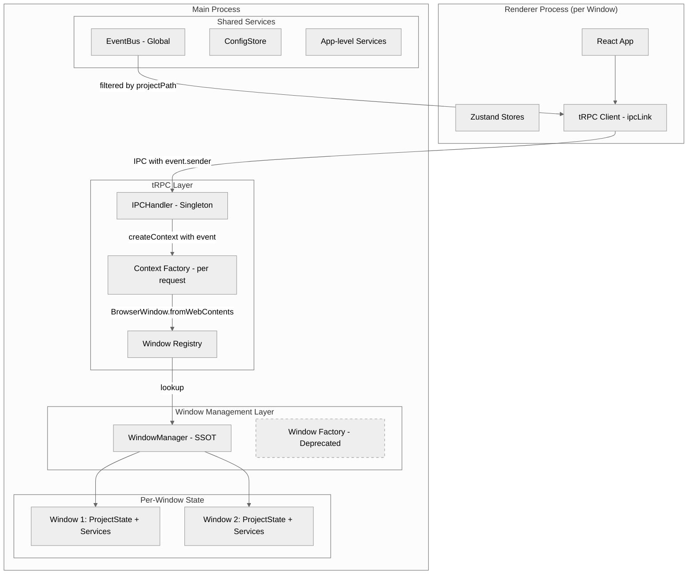
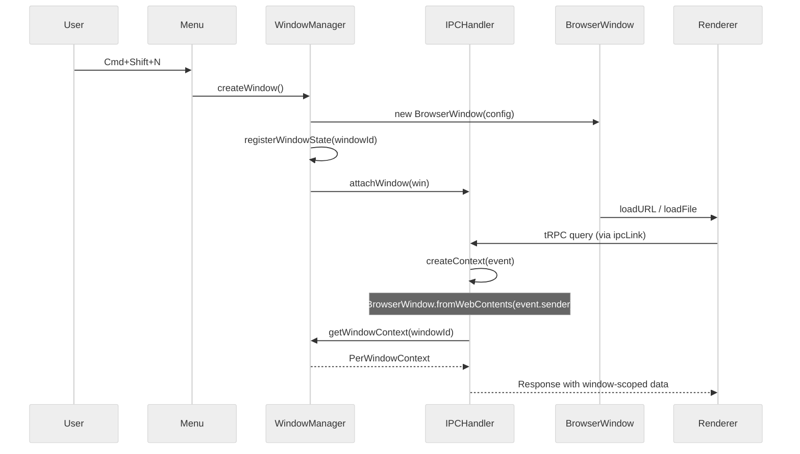
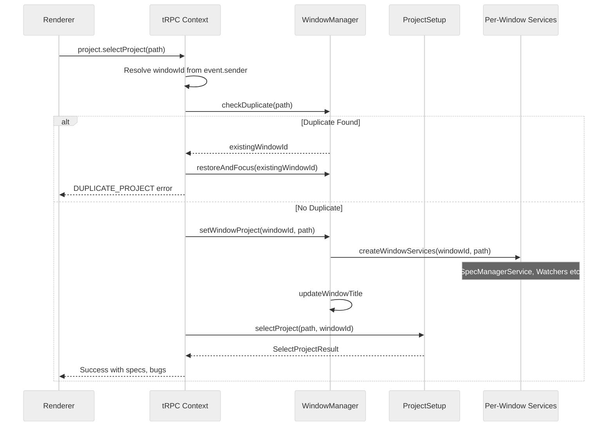
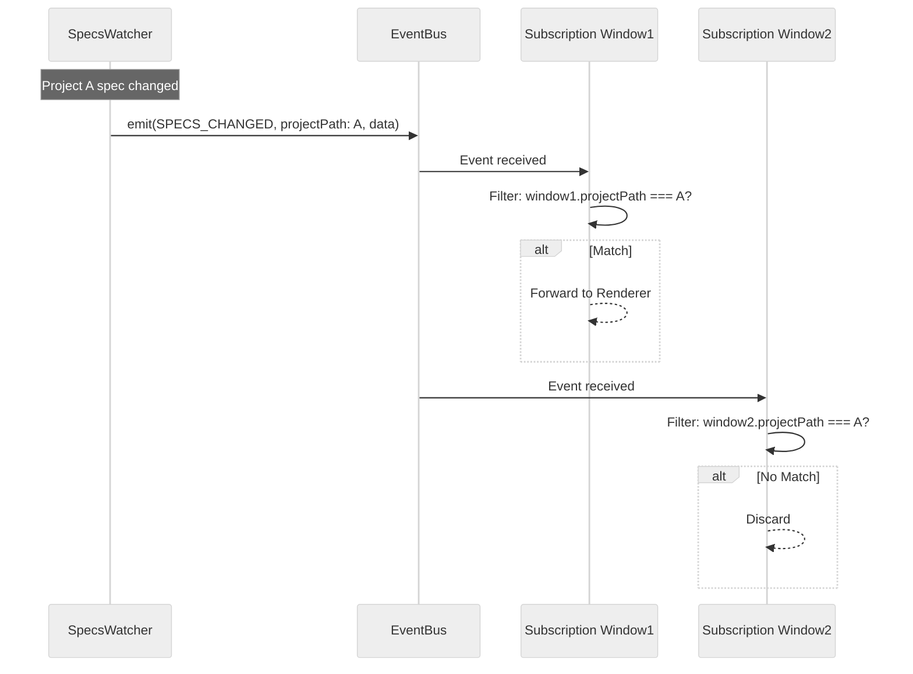
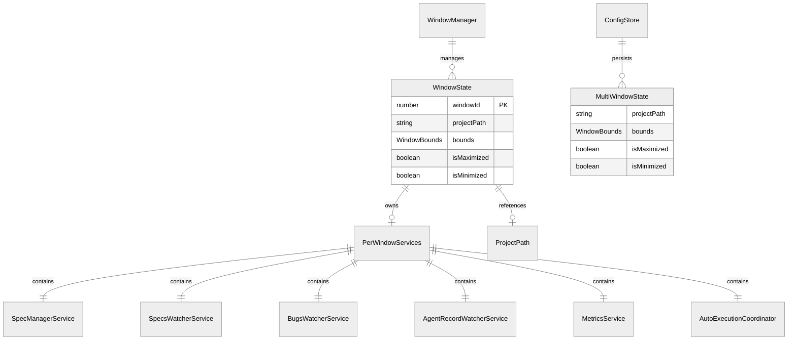

# Design: マルチウィンドウ統合

## Overview

**Purpose**: SDD Orchestratorの既存単一ウィンドウアーキテクチャを、複数の独立したプロジェクトコンテキストで動作するマルチウィンドウアーキテクチャに移行する。

**Users**: SDD Orchestratorのユーザーは、複数プロジェクトを別ウィンドウで同時に開き、プロジェクト切り替えなしで並行作業できる。開発者は、WindowManagerがウィンドウライフサイクルのSSOTとなり、tRPC Context DIがウィンドウ別コンテキストを自動解決するアーキテクチャを得る。

**Impact**: `windowFactory.ts`のグローバル`mainWindow`変数を廃止し、`WindowManager`がウィンドウ管理のSSOTとなる。`projectState.ts`のグローバル変数をウィンドウ別ストレージに置換し、tRPCコンテキスト生成時に`event.sender`からウィンドウを特定してウィンドウ別サービスを注入する。EventBusイベントにプロジェクトパスメタデータを追加し、Subscriptionでフィルタリングする。

### Goals

- 複数BrowserWindowが独立したプロジェクトコンテキストで動作する
- tRPCプロシージャがリクエスト元ウィンドウのコンテキストで実行される
- EventBusイベントが適切なウィンドウにのみルーティングされる
- ウィンドウ状態（位置、サイズ、プロジェクト）がアプリ再起動時に復元される
- 同一プロジェクトの重複オープンが防止される

### Non-Goals

- Remote UIのマルチセッション対応（将来spec）
- ウィンドウ間のデータ共有・同期
- タブ型マルチプロジェクト
- ウィンドウのドッキング・スナップ（OS標準機能に委譲）

## Architecture

### Existing Architecture Analysis

現在のアーキテクチャは単一ウィンドウ前提で以下のグローバル状態に依存している。

- **`windowFactory.ts`**: グローバル`mainWindow`変数で単一ウィンドウを保持
- **`projectState.ts`**: グローバル`let currentProjectPath`で単一プロジェクトパスを保持。`specManagerService`、`autoExecutionCoordinator`、`metricsService`もグローバル変数
- **`handler.ts`の`setupTRPCHandler`**: `createIPCHandler`に単一ウィンドウの`windows: [window]`を渡す。`createContext`は`event`パラメータを使用せず、全リクエストに同一のグローバル状態を返す
- **`EventBus`**: グローバルシングルトン。プロジェクトパスのフィルタリングなし。全イベントが全Subscriptionに配信
- **`menu.ts`**: グローバル`currentProjectPathForMenu`で単一プロジェクトの状態を管理

既存の`WindowManager`クラス（`src/main/services/windowManager.ts`）は旧`multi-window-support` spec時に実装済みだが、tRPC Context DIとは統合されていない。ウィンドウ作成、プロジェクト紐づけ、重複チェック、状態永続化の基本機能は実装されているが、**現在の起動フローでは使用されていない**。

### Architecture Pattern & Boundary Map



**Key Decisions**:
- `createIPCHandler`はアプリケーション全体で1回のみ呼び出し。新しいウィンドウは`attachWindow()`で登録。これにより`ipcMain.on`の重複登録を防止
- `createContext`内で`event.sender`から`BrowserWindow.fromWebContents()`でウィンドウを特定し、WindowManagerからウィンドウ別の状態・サービスを取得
- グローバルな`projectState.ts`変数は`WindowManager`内のper-window状態に移行。既存のグローバル関数は「フォーカスウィンドウのコンテキスト」にフォールバックする互換レイヤーとして残す

**Architecture Integration**:
- Selected pattern: WindowManager中心のper-window DI（各ウィンドウがプロジェクト状態とサービスインスタンスを所有）
- Domain/feature boundaries: WindowManager（ウィンドウライフサイクル）、tRPC Context（リクエスト別DI）、EventBus（イベントルーティング）の3層で分離
- Existing patterns preserved: tRPC Context DI、EventBus、ConfigStore永続化
- New components rationale: `WindowRegistry`（ウィンドウID→状態の高速マッピング）、`WindowContextFactory`（per-request コンテキスト生成）
- Steering compliance: SSOT（WindowManagerがウィンドウ状態の唯一の情報源）、DRY（サービスファクトリの共通化）、関心の分離（ウィンドウ管理とtRPCコンテキストの分離）

### Technology Stack

| Layer | Choice / Version | Role in Feature | Notes |
|-------|------------------|-----------------|-------|
| IPC | electron-trpc 0.7.1 | `createIPCHandler`の`attachWindow/detachWindow` + `createContext`での`event.sender`によるウィンドウ特定 | 既存バージョンで対応可能 |
| Window Management | Electron 35.x BrowserWindow API | ウィンドウ作成・破棄・フォーカス管理 | 既存 |
| State Persistence | electron-store (ConfigStore) | ウィンドウ状態永続化 | `getMultiWindowStates`/`setMultiWindowStates`が既存 |
| Events | Node.js EventEmitter (EventBus) | ウィンドウ別イベントフィルタリング | 既存EventBusを拡張 |

## System Flows

### Flow 1: ウィンドウ作成とtRPCコンテキスト連携



**Key Decisions**:
- `createIPCHandler`はアプリ起動時に1回のみ呼び出し、以後は`attachWindow()`で追加登録
- `createContext`が`event.sender`を使用してウィンドウを特定するため、各リクエストが自動的に正しいウィンドウコンテキストで実行される
- ウィンドウクローズ時に`detachWindow()`が呼ばれ、Subscriptionが自動クリーンアップされる（electron-trpc内蔵機能）

### Flow 2: プロジェクト選択とサービス初期化



**Key Decisions**:
- 重複チェックはパス正規化（末尾スラッシュ除去）後にO(1)ルックアップで実行
- サービスインスタンス（SpecManagerService、各Watcher）はウィンドウごとに独立して作成
- 既存ウィンドウへのフォーカスは最小化状態からの復元も含む

### Flow 3: EventBusウィンドウ別ルーティング



**Key Decisions**:
- フィルタリングはSubscription側（events router）で実行。EventBus自体はブロードキャスト
- アプリ全体イベント（設定変更、Remote UIステータス等）はフィルタリングなしで全ウィンドウに配信
- Subscriptionのunsubscribeはelectron-trpcがウィンドウクローズ時に自動実行

## Requirements Traceability

| Criterion ID | Summary | Components | Implementation Approach |
|--------------|---------|------------|------------------------|
| 1.1 | 新しいウィンドウ作成 | WindowManager.createWindow, menu.ts | 既存WindowManager.createWindowを活用し、attachWindowを追加 |
| 1.2 | tRPCコンテキスト紐づけ | WindowContextFactory, handler.ts | 新規: createContext内でevent.senderからウィンドウ特定 |
| 1.3 | リクエスト元ウィンドウのコンテキスト実行 | WindowContextFactory, WindowManager | 新規: per-window ContextServices生成 |
| 1.4 | プロジェクトコンテキスト独立性 | WindowManager.windowStates | 既存WindowManagerのMap構造で分離保証 |
| 1.5 | ウィンドウクローズ時リソース解放 | WindowManager.handleWindowClose | 既存: Watcher停止、IPCHandler.detachWindow |
| 1.6 | 最後のウィンドウクローズ時の動作 | index.ts app.on('window-all-closed') | 既存: macOS判定ロジックをそのまま活用 |
| 2.1 | windowFactory廃止、WindowManager管理 | WindowManager, index.ts | windowFactory.tsを廃止、起動フローをWindowManager経由に変更 |
| 2.2 | 起動フローでWindowManager使用 | index.ts app.whenReady | WindowManager.createWindowを呼び出すよう変更 |
| 2.3 | app.on('activate')でWindowManager使用 | index.ts | WindowManager.getAllWindowIds()で確認 |
| 2.4 | second-instanceでWindowManager使用 | index.ts | WindowManager.getWindowByProject, restoreAndFocus |
| 2.5 | ウィンドウタイトル表示 | WindowManager.setWindowProject | 既存: タイトル更新ロジック |
| 3.1 | ウィンドウ別コンテキストファクトリ | handler.ts, WindowContextFactory | 新規: createContext内でウィンドウ別サービス注入 |
| 3.2 | getCurrentProjectPathのウィンドウ別化 | WindowManager.getWindowProject | 既存WindowManagerメソッドを活用 |
| 3.3 | getSpecManagerServiceのウィンドウ別化 | WindowManager.getWindowServices | 既存WindowManagerのPerWindowServicesを拡張 |
| 3.4 | グローバル変数のウィンドウ別化 | projectState.ts互換レイヤー | projectState.tsのgetter/setterをWindowManager委譲に変更 |
| 3.5 | selectProjectのウィンドウ別化 | projectSetup.ts | windowIdパラメータ追加、ウィンドウ別サービス初期化 |
| 3.6 | ウィンドウクローズ時コンテキストクリーンアップ | WindowManager.handleWindowClose | 既存: サービス停止とMap削除 |
| 4.1 | EventBusイベントにプロジェクトパスメタデータ | EventBus emit呼び出し箇所 | 既存emit箇所にprojectPath追加 |
| 4.2 | Subscriptionフィルタリング | events.ts router | 新規: observable内でprojectPathフィルタ |
| 4.3 | ウィンドウ別イベント配信 | events.ts router | フィルタリングで実現 |
| 4.4 | アプリ全体イベントのブロードキャスト | events.ts router | イベント種別でフィルタ有無を切り替え |
| 4.5 | ウィンドウクローズ時Subscription解除 | electron-trpc IPCHandler | 既存: detachWindow時の自動クリーンアップ |
| 5.1 | 重複プロジェクトの既存ウィンドウフォーカス | WindowManager.checkDuplicate | 既存 |
| 5.2 | 最小化ウィンドウの復元フォーカス | WindowManager.restoreAndFocus | 既存 |
| 5.3 | パス正規化後の重複チェック | normalizePath関数 | 既存: 末尾スラッシュ除去。シンボリックリンク解決を追加 |
| 5.4 | CLI/second-instanceでの重複チェック | index.ts second-instance handler | WindowManager.checkDuplicate使用に変更 |
| 6.1 | フォーカスウィンドウのメニューコンテキスト更新 | WindowManager.onWindowFocus, menu.ts | 既存callback + setMenuProjectPath |
| 6.2 | 未選択ウィンドウのメニュー無効化 | menu.ts setMenuProjectPath(null) | 既存 |
| 6.3 | 最近のプロジェクトのメニュー操作 | menu.ts buildRecentProjectsSubmenu | 未選択ウィンドウがあればそこで開く、なければ新規ウィンドウ |
| 6.4 | 新しいウィンドウメニュー | menu.ts | WindowManager.createWindow経由に変更 |
| 7.1 | ウィンドウ状態永続化 | WindowManager.saveAllWindowStates | 既存: ConfigStore.setMultiWindowStates |
| 7.2 | ウィンドウ状態復元 | WindowManager.restoreWindows | 既存: ConfigStore.getMultiWindowStates |
| 7.3 | 存在しないプロジェクトのスキップ | WindowManager.restoreWindows | 既存: existsSync チェック |
| 7.4 | 初回起動時デフォルトウィンドウ | WindowManager.restoreWindows | 既存: restored === 0でデフォルトウィンドウ |
| 7.5 | マルチディスプレイ対応 | WindowManager.validateDisplayBounds | 既存: プライマリディスプレイフォールバック |
| 8.1 | マルチウィンドウE2E | E2Eテストスイート | 新規: WebdriverIO複数ウィンドウテスト |
| 8.2 | 重複オープンE2E | E2Eテストスイート | 新規 |
| 8.3 | ウィンドウ別tRPC操作E2E | E2Eテストスイート | 新規 |
| 8.4 | リソース解放E2E | E2Eテストスイート | 新規 |

### Coverage Validation Checklist

- [x] Every criterion ID from requirements.md appears in the table above
- [x] Each criterion has specific component names (not generic references)
- [x] Implementation approach distinguishes "reuse existing" vs "new implementation"
- [x] User-facing criteria specify concrete UI components (not just "shared components")

## Components and Interfaces

| Component | Domain/Layer | Intent | Req Coverage | Key Dependencies | Contracts |
|-----------|--------------|--------|--------------|-----------------|-----------|
| WindowManager | Main/Window | ウィンドウライフサイクルとper-window状態のSSOT | 1.1-1.6, 2.1-2.5, 5.1-5.4, 7.1-7.5 | ConfigStore (P0), BrowserWindow API (P0) | Service, State |
| WindowContextFactory | Main/tRPC | tRPCリクエストごとにウィンドウ別ContextServicesを生成 | 3.1-3.6 | WindowManager (P0), electron-trpc event (P0) | Service |
| EventBusFilter | Main/tRPC | Subscriptionでウィンドウ別イベントフィルタリング | 4.1-4.5 | EventBus (P0), WindowManager (P1) | Event |
| ProjectStateCompat | Main/tRPC | 既存グローバルAPI互換レイヤー | 3.4 | WindowManager (P0) | Service |
| MenuFocusTracker | Main/Menu | フォーカスウィンドウ追従メニュー更新 | 6.1-6.4 | WindowManager (P0), menu.ts (P1) | Event |

### Main / Window Management Layer

#### WindowManager (拡張)

| Field | Detail |
|-------|--------|
| Intent | ウィンドウライフサイクル、per-window状態、サービスインスタンスのSSOT |
| Requirements | 1.1-1.6, 2.1-2.5, 5.1-5.4, 7.1-7.5 |

**Responsibilities & Constraints**
- 全BrowserWindowのライフサイクル管理（作成、クローズ、フォーカス）
- ウィンドウID -> ProjectState + PerWindowServices のマッピング
- プロジェクトパスの重複チェック（O(1) Map lookup）
- ウィンドウ状態のConfigStoreへの永続化・復元

**Dependencies**
- Inbound: index.ts, menu.ts, WindowContextFactory -- ウィンドウ操作 (P0)
- Outbound: ConfigStore -- 状態永続化 (P0)
- Outbound: PerWindowServices -- サービスライフサイクル (P0)
- External: Electron BrowserWindow, screen API (P0)

**Contracts**: Service [x] / State [x]

##### Service Interface

```typescript
interface PerWindowContext {
  windowId: number;
  projectPath: string | null;
  services: PerWindowServices | null;
}

interface PerWindowServices {
  specManagerService: SpecManagerService;
  specsWatcherService: SpecsWatcherService;
  agentRecordWatcherService: AgentRecordWatcherService;
  bugsWatcherService: BugsWatcherService;
  metricsService: MetricsService;
  autoExecutionCoordinator: AutoExecutionCoordinator;
}

interface WindowManager {
  // Window lifecycle
  createWindow(options?: CreateWindowOptions): BrowserWindow;
  closeWindow(windowId: number): void;

  // Context resolution (new)
  getWindowContext(windowId: number): PerWindowContext | null;
  getWindowIdByWebContents(webContentsId: number): number | null;

  // Project management (existing)
  setWindowProject(windowId: number, projectPath: string): Result<void, DuplicateProjectError>;
  getWindowProject(windowId: number): string | null;
  getWindowByProject(projectPath: string): BrowserWindow | null;
  checkDuplicate(projectPath: string): number | null;

  // IPCHandler integration (new)
  getIPCHandler(): IPCHandler | null;
  setIPCHandler(handler: IPCHandler): void;

  // Focus & restore (existing)
  focusWindow(windowId: number): void;
  restoreAndFocus(windowId: number): void;
  getFocusedWindowId(): number | null;

  // State persistence (existing)
  saveAllWindowStates(): void;
  restoreWindows(): { restored: number; skipped: string[] };

  // Callbacks (existing)
  onWindowFocus(callback: (windowId: number) => void): void;
  onWindowClose(callback: (windowId: number) => void): void;
}
```

- Preconditions: `createWindow`呼び出し前にElectron `app.whenReady()`が完了していること
- Postconditions: `createWindow`後、ウィンドウはwindowStatesに登録済み。`handleWindowClose`後、関連サービスは全て停止済み
- Invariants: `projectWindowMap`と`windowStates`内のprojectPathは常に整合。同一projectPathは最大1つのwindowIdにマッピング

##### State Management

- State model: `windowStates: Map<number, WindowState>`, `projectWindowMap: Map<string, number>`, `windowServices: Map<number, PerWindowServices>`, `webContentsToWindowId: Map<number, number>`
- Persistence: ConfigStore.multiWindowStatesに永続化（`app.on('before-quit')`で`saveAllWindowStates`）
- Concurrency: Electron Main processはシングルスレッドのため排他制御不要

**Implementation Notes**
- Integration: 既存WindowManagerクラスに`getWindowContext`、`getWindowIdByWebContents`、IPCHandler保持を追加
- Validation: `setWindowProject`時にパス正規化と重複チェック
- Risks: 既存テスト（26件）との互換性維持が必要

### Main / tRPC Layer

#### WindowContextFactory

| Field | Detail |
|-------|--------|
| Intent | tRPCリクエストごとにevent.senderからウィンドウを特定し、ウィンドウ別ContextServicesを生成 |
| Requirements | 3.1-3.6 |

**Responsibilities & Constraints**
- `createContext({ event })`で`event.sender`からウィンドウIDを解決
- ウィンドウ別の`getCurrentProjectPath`、`getSpecManagerService`等を生成
- ウィンドウが特定できない場合のフォールバック処理

**Dependencies**
- Inbound: electron-trpc createIPCHandler -- コンテキスト生成コールバック (P0)
- Outbound: WindowManager -- ウィンドウ状態・サービス取得 (P0)
- Outbound: productionServices -- 共有サービスの取得 (P0)

**Contracts**: Service [x]

##### Service Interface

```typescript
type WindowContextCreateFn = (opts: { event: IpcMainEvent }) => Promise<Context>;

/**
 * createWindowContextFactory: WindowManager参照を受け取り、
 * electron-trpcのcreateContext関数を返すファクトリ。
 */
function createWindowContextFactory(
  windowManager: WindowManager,
  sharedServices: Partial<ContextServices>,
): WindowContextCreateFn;
```

- Preconditions: WindowManagerが初期化済み。sharedServicesにアプリ全体共通サービスが設定済み
- Postconditions: 返されるContextのservicesは、リクエスト元ウィンドウのprojectPathとサービスインスタンスを反映。ContextServicesに`windowId: number`フィールドが含まれる
- Invariants: 同一ウィンドウからのリクエストは同一のprojectPathを返す（途中でselectProjectしない限り）

**Implementation Notes**
- Integration: `handler.ts`の`setupTRPCHandler`を書き換え、`createWindowContextFactory`を使用
- Validation: `BrowserWindow.fromWebContents`がnullの場合はデフォルトコンテキスト（フォーカスウィンドウ or 空コンテキスト）
- Risks: electron-trpcの`createContext`に渡される`event`が`IpcMainEvent`型であり、`event.sender`にアクセス可能であることをelectron-trpc 0.7.1のソースコードで確認済み
- **Per-windowプロパティのクロージャバインディング**: ContextServicesの`selectProject`等のper-windowプロパティは、WindowContextFactory内でwindowIdバインド済みクロージャとして生成する。例: `selectProject: (path) => selectProject(path, windowId)`。これによりRouter側（`ctx.services.selectProject(input.projectPath)`）のコード変更は不要。同様に`getCurrentProjectPath`、`getSpecManagerService`等もウィンドウ別の値を返すクロージャとして注入する

#### EventBusFilter (events router拡張)

| Field | Detail |
|-------|--------|
| Intent | tRPC Subscriptionでウィンドウ別イベントフィルタリングを実行 |
| Requirements | 4.1-4.5 |

**Responsibilities & Constraints**
- プロジェクトスコープイベント: Subscriptionのコンテキスト（ウィンドウのprojectPath）とイベントのprojectPathを比較し、一致する場合のみ配信
- アプリスコープイベント: フィルタリングなしで全Subscriptionに配信
- ウィンドウクローズ時のSubscription解除はelectron-trpc内蔵機能に委譲

**Dependencies**
- Inbound: EventBus -- イベント受信 (P0)
- Outbound: tRPC Subscription -- フィルタ済みイベント配信 (P0)

**Contracts**: Event [x]

##### Event Contract

- Published events: 既存36イベント（変更なし）
- Subscribed events: 同上。ただしSubscription生成時にウィンドウのprojectPathをキャプチャし、各イベント受信時にフィルタリング
- Event categorization:

| Category | Events | Filtering |
|----------|--------|-----------|
| Project-scoped | SPECS_CHANGED, BUGS_CHANGED, AGENT_*, AUTO_EXECUTION_*, GIT_CHANGES_DETECTED, PROJECT_FILE_CHANGED, METRICS_UPDATED | projectPathで一致フィルタ |
| App-scoped | REMOTE_SERVER_STATUS_CHANGED, REMOTE_CLIENT_COUNT_CHANGED, CLOUDFLARE_TUNNEL_STATUS_CHANGED, SSH_STATUS_CHANGED, MCP_STATUS_CHANGED, SCHEDULE_TASK_STATUS_CHANGED, MENU_* | フィルタなし（全ウィンドウ配信） |

**Implementation Notes**
- Integration: events.tsの各Subscriptionにフィルタロジックを追加。`ctx.services.getCurrentProjectPath()`でウィンドウのprojectPathを取得
- Risks: イベント発火側でprojectPathメタデータが欠落すると、イベントがどのウィンドウにも配信されない。明示的なnullチェックとログ出力で防止

### Main / Compatibility Layer

#### ProjectStateCompat (既存projectState.ts互換)

Summary-only component. 既存の`getCurrentProjectPath()`等のグローバル関数を、WindowManagerのフォーカスウィンドウの状態に委譲するシンプルな互換レイヤー。既存のproductionServices.tsやmenu.ts等のグローバル関数呼び出し元がマルチウィンドウ移行中に段階的にWindowManager直接参照に移行できるようにする。

#### MenuFocusTracker (menu.ts拡張)

Summary-only component. 既存の`setMenuProjectPath`を`WindowManager.onWindowFocus`コールバック内で呼び出すように変更。フォーカスウィンドウのprojectPathをメニュー状態に反映。

## Data Models

### Domain Model



**Business Rules & Invariants**:
- 同一projectPathは最大1つのWindowStateにマッピング（重複禁止）
- WindowStateのprojectPathがnullの状態は許容（プロジェクト未選択ウィンドウ）
- PerWindowServicesはprojectPathが設定されるまでnull

### Logical Data Model

**webContentsToWindowId mapping**: `Map<number, number>` -- `webContents.id` -> `BrowserWindow.id`。`createWindow`時に登録、`handleWindowClose`時に削除。`createContext`内でのO(1)ウィンドウ特定に使用。

**ConfigStore multiWindowStates**: 既存スキーマをそのまま使用。`projectPath`、`bounds`、`isMaximized`、`isMinimized`の配列。

## Error Handling

### Error Strategy

| Error | Category | Response | Recovery |
|-------|----------|----------|----------|
| ウィンドウ特定失敗 | System | フォーカスウィンドウにフォールバック | ログ出力、デフォルトコンテキスト使用 |
| 重複プロジェクト選択 | Business | DUPLICATE_PROJECT エラー返却 | 既存ウィンドウをフォーカス |
| 復元対象プロジェクト不存在 | Business | スキップしてログ記録 | 次のウィンドウの復元を続行 |
| PerWindowServicesの初期化失敗 | System | エラーログ出力 | ウィンドウは開くがサービスなし状態 |
| ディスプレイ範囲外のウィンドウ復元 | Business | プライマリディスプレイに配置 | validateDisplayBoundsで自動補正 |

### Monitoring

- `[WindowManager]`プレフィックスのログで全ウィンドウ操作を記録
- ウィンドウ作成/クローズ/プロジェクト設定/状態保存/復元を`logger.info`で記録
- エラーケース（重複、不存在プロジェクト、ディスプレイ範囲外）を`logger.warn`で記録

## Testing Strategy

### Unit Tests

- **WindowManager**: createWindow、setWindowProject（重複チェック含む）、handleWindowClose（サービスクリーンアップ）、saveAllWindowStates/restoreWindows
- **WindowContextFactory**: event.senderからのウィンドウ特定、ウィンドウ未特定時のフォールバック、per-windowサービスの注入
- **EventBusFilter**: プロジェクトスコープイベントのフィルタリング、アプリスコープイベントのパススルー、projectPath不一致時のイベント破棄
- **ProjectStateCompat**: フォーカスウィンドウへの委譲、ウィンドウなし時のnull返却
- **normalizePath**: 末尾スラッシュ除去、シンボリックリンク解決

### Integration Tests

- **tRPCコンテキスト分離**: 2つのウィンドウから同一tRPCプロシージャを呼び出し、それぞれのプロジェクトコンテキストで実行されることを検証
- **EventBus配信**: ウィンドウAのプロジェクトイベントがウィンドウBに配信されないことを検証
- **プロジェクト選択→サービス初期化→Watcher起動**の一連フロー

### E2E Tests

- **マルチウィンドウ操作**: Cmd+Shift+Nで新規ウィンドウ作成、各ウィンドウで異なるプロジェクトを開く
- **重複防止**: 同じプロジェクトを2つ目のウィンドウで開こうとした際に既存ウィンドウがフォーカスされる
- **ウィンドウクローズ**: ウィンドウクローズ後にWatcherが停止していることの検証

> **Note**: 状態復元（アプリ再起動後のウィンドウ配置復元）はアプリ再起動を伴うためE2Eテストではフラジャイルになりやすい。Task 8.1/8.2のユニットテストでカバーする。

## Integration Test Strategy

### Test 1: tRPCコンテキスト分離

- **Components**: WindowManager, WindowContextFactory, handler.ts, project router
- **Data Flow**: Renderer A -> ipcLink -> IPCHandler -> createContext(event.sender=A) -> WindowManager.getWindowContext(A) -> PerWindowServices A
- **Mock Boundaries**: Mock `BrowserWindow.fromWebContents`、Real WindowManager、Mock PerWindowServices
- **Verification Points**: `ctx.services.getCurrentProjectPath()`がウィンドウAのprojectPathを返すこと。ウィンドウBからの呼び出しでは異なるprojectPathを返すこと
- **Robustness Strategy**: `waitFor`パターンでコンテキスト生成完了を確認。固定sleepは使用しない
- **Prerequisites**: テスト用に`createTestContextWithWindow(windowId)`ヘルパーが必要

### Test 2: EventBusフィルタリング

- **Components**: EventBus, events router, Subscription
- **Data Flow**: EventBus.emit(SPECS_CHANGED, {projectPath: A}) -> Subscription(window A) receives -> Subscription(window B) discards
- **Mock Boundaries**: Real EventBus、Mock tRPC Subscription observer
- **Verification Points**: Window Aの observer.next が呼ばれること。Window Bの observer.next が呼ばれないこと
- **Robustness Strategy**: イベント発火後に短いtickを待ち、observerの呼び出し回数をアサート
- **Prerequisites**: 既存`createTestContext`をwindowId対応に拡張

### Test 3: プロジェクト選択とサービスライフサイクル

- **Components**: WindowManager, projectSetup, SpecManagerService, SpecsWatcherService
- **Data Flow**: selectProject(path, windowId) -> WindowManager.setWindowProject -> createWindowServices -> Watchers start
- **Mock Boundaries**: Mock Electron BrowserWindow、Mock FileService、Real WindowManager
- **Verification Points**: setWindowProject後にPerWindowServicesが生成されていること。closeWindow後にWatcherが停止していること
- **Robustness Strategy**: サービス初期化の完了をPromise解決で確認
- **Prerequisites**: なし（既存テストインフラで対応可能）

## Design Decisions

### DD-001: IPCHandler Singleton + attachWindow パターン

| Field | Detail |
|-------|--------|
| Status | Accepted |
| Context | 複数ウィンドウでtRPC IPCを使用する際、ウィンドウごとに`createIPCHandler`を呼ぶか、1つのIPCHandlerに`attachWindow`で追加するか |
| Decision | `createIPCHandler`はアプリ起動時に1回のみ呼び出し、新しいウィンドウは`attachWindow()`で登録 |
| Rationale | electron-trpcの`createIPCHandler`は内部で`ipcMain.on`を呼ぶため、複数回呼ぶとリスナーが重複する。`attachWindow`/`detachWindow`はサブスクリプションのクリーンアップを適切に行う |
| Alternatives Considered | (A) ウィンドウごとにIPCHandler生成 -- `ipcMain.on`重複でメッセージの二重処理が発生 |
| Consequences | IPCHandlerインスタンスをWindowManagerが保持する必要がある。最初のウィンドウ作成時にIPCHandler生成、以後はattachWindow |

### DD-002: event.senderによるウィンドウ特定

| Field | Detail |
|-------|--------|
| Status | Accepted |
| Context | tRPCプロシージャ実行時にリクエスト元ウィンドウを特定する方法。(A) event.sender.idからのBrowserWindow解決、(B) クライアント側でwindowIdをリクエストに含める |
| Decision | `createContext`内で`BrowserWindow.fromWebContents(event.sender)`を使用してウィンドウを特定 |
| Rationale | electron-trpc 0.7.1のソースコード確認により、`createContext`に`{ event: IpcMainEvent }`が渡され、`event.sender`（WebContents）にアクセス可能であることを確認済み。クライアント側変更不要 |
| Alternatives Considered | (B) クライアント側windowId送信 -- Renderer/shared層に変更が波及し、Remote UIとの互換性に影響 |
| Consequences | `webContentsToWindowId: Map<number, number>`をWindowManagerに追加してO(1)ルックアップを実現 |

### DD-003: グローバル状態の段階的移行（互換レイヤー）

| Field | Detail |
|-------|--------|
| Status | Accepted |
| Context | `projectState.ts`のグローバル変数（`currentProjectPath`等）を即座に全廃止するか、互換レイヤーで段階的に移行するか |
| Decision | グローバル関数（`getCurrentProjectPath`等）をWindowManagerのフォーカスウィンドウに委譲する互換レイヤーとして残す |
| Rationale | productionServices.ts内の70以上のサービスがグローバル関数を参照している。tRPCコンテキスト経由でアクセスする箇所は新方式に移行し、それ以外は互換レイヤーで段階的に移行 |
| Alternatives Considered | (A) 全箇所を即座にwindowId対応 -- 変更範囲が非常に大きく、リグレッションリスクが高い |
| Consequences | tRPCプロシージャ内では`ctx.services`経由でウィンドウ別状態にアクセス。tRPC外（Auto-Execution、menu.ts等）では互換レイヤー経由でフォーカスウィンドウの状態にアクセス |
| Known Limitations | **非フォーカスウィンドウのAuto-Execution**: 互換レイヤー経由の`getCurrentProjectPath()`はフォーカスウィンドウの状態を返すため、非フォーカスウィンドウでAuto-Executionが実行される場合、誤ったプロジェクトコンテキストで動作する可能性がある。ただしAuto-ExecutionコーディネータはPerWindowServicesとしてウィンドウ別に管理されるため、tRPCコンテキスト経由のアクセスでは正しく動作する。tRPC外で`BrowserWindow.getAllWindows()[0]`を直接使用している箇所（projectSetup.ts内2箇所）は本specのTask 6.4で明示的に修正する |

### DD-004: EventBusフィルタリングの実装層

| Field | Detail |
|-------|--------|
| Status | Accepted |
| Context | EventBusイベントのウィンドウ別フィルタリングを (A) EventBus.emit側で実行、(B) Subscription（events router）側で実行 |
| Decision | Subscription（events router）側でフィルタリング |
| Rationale | EventBus自体をシンプルなブロードキャストとして維持。フィルタリングロジックをtRPC Subscriptionに集約することで、テスト容易性と関心の分離を実現。Remote UIのWebSocketハンドラも同様にprojectPathフィルタが必要だが、それは別レイヤーで実装 |
| Alternatives Considered | (A) EventBus.emit側でウィンドウ別にフィルタ -- EventBusがウィンドウ概念を知る必要があり、関心の分離に反する |
| Consequences | events.tsの各Subscriptionに3-5行のフィルタロジック追加。イベント発火側ではprojectPathメタデータの付与が必要。なお、Remote UIのWebSocketハンドラは本specのスコープ外であり、マルチウィンドウ環境では全プロジェクトのイベントをフィルタなしで受信し続ける。Remote UIは単一プロジェクトセッション前提のため、無関係なイベントはRenderer側で無視され実用上影響なし（WebSocket帯域の微小な増加のみ） |

### DD-005: PerWindowServicesの構成

| Field | Detail |
|-------|--------|
| Status | Accepted |
| Context | 既存のグローバルサービス（SpecManagerService、各Watcher、MetricsService、AutoExecutionCoordinator）をどこまでウィンドウ別にするか |
| Decision | プロジェクト固有のサービス（SpecManagerService、SpecsWatcherService、BugsWatcherService、AgentRecordWatcherService、MetricsService、AutoExecutionCoordinator）をウィンドウ別にし、アプリ全体のサービス（FileService、BugService、ConfigStore等）は共有 |
| Rationale | SpecManagerServiceとWatcherはプロジェクトパスに依存し、インスタンスがプロジェクト状態を内部に持つ。FileService等はステートレスまたはアプリ全体設定のみ保持のため共有可能 |
| Alternatives Considered | (A) 全サービスをウィンドウ別 -- メモリ消費増加、FileService等のステートレスサービスには不要 |
| Consequences | 既存WindowManagerのPerWindowServicesにMetricsServiceとAutoExecutionCoordinatorを追加 |

## Integration & Deprecation Strategy

### 既存ファイルの変更（Wiring Points）

| File | Change | Reason |
|------|--------|--------|
| `src/main/index.ts` | 起動フローを`createWindow()`から`WindowManager.createWindow()`に変更。IPCHandler生成を1回に限定。`app.on('activate')`と`second-instance`をWindowManager経由に変更 | 2.2, 2.3, 2.4 |
| `src/main/trpc/handler.ts` | `setupTRPCHandler`を`createWindowContextFactory`ベースに書き換え。`createIPCHandler`呼び出しを初回のみに変更し、IPCHandlerインスタンスを返す | 3.1, DD-001 |
| `src/main/trpc/context.ts` | `createContext`に`event`パラメータを受け取るオーバーロード追加。ContextServicesのgetterをウィンドウ別対応 | 3.1-3.3 |
| `src/main/trpc/helpers/projectState.ts` | グローバル変数のgetter/setterをWindowManager委譲に変更（互換レイヤー） | 3.4, DD-003 |
| `src/main/trpc/helpers/projectSetup.ts` | `selectProject`にwindowIdパラメータ追加。`setProjectPath`をウィンドウ別サービス初期化に変更 | 3.5 |
| `src/main/trpc/productionServices.ts` | `getCurrentProjectPath`等のグローバル関数参照を互換レイヤー経由に変更。ウィンドウ別サービスはContextFactory側で注入するため、一部サービスを分離 | 3.1-3.6 |
| `src/main/trpc/routers/events.ts` | 各SubscriptionにprojectPathフィルタリングロジック追加 | 4.2-4.4 |
| `src/main/trpc/services/eventBus.ts` | イベント発火箇所にprojectPathメタデータ追加（型定義更新） | 4.1 |
| `src/main/trpc/helpers/watcherUtils.ts` | Watcher生成をウィンドウ別に対応。グローバルWatcher変数をWindowManager経由に変更 | 1.5, 3.5 |
| `src/main/menu.ts` | `createWindow()`をWindowManager.createWindow()に変更。フォーカスウィンドウ追従をWindowManager.onWindowFocusで実装 | 6.1-6.4 |
| `src/main/services/windowManager.ts` | `PerWindowServices`にMetricsService、AutoExecutionCoordinator追加。`getWindowContext`、`getWindowIdByWebContents`、IPCHandler保持を追加 | DD-005 |
| `src/main/appLifecycle.ts` | `cleanupOnQuit`でWindowManager.saveAllWindowStates()呼び出し追加 | 7.1 |

### 廃止ファイル

| File | Action | Reason |
|------|--------|--------|
| `src/main/windowFactory.ts` | **削除** | WindowManager.createWindowに完全置換（Requirement 2.1） |

### Migration Notes

- `windowFactory.ts`の`getMainWindow()`を参照している箇所（index.ts、menu.ts）はWindowManager APIに移行
- `createWindow`をインポートしている箇所はWindowManager.createWindowに変更
- `setupTRPCHandler`の呼び出し箇所は1箇所（windowFactory.ts）のみ。移行先のWindowManager.createWindow内で初回のみIPCHandler生成

## Interface Changes & Impact Analysis

### handler.ts: setupTRPCHandler署名変更

**変更**: `setupTRPCHandler(window, serviceOverrides?)` -> `initializeTRPCHandler(windowManager, sharedServices)`

- **既存Callers**: `windowFactory.ts` (1箇所) -- windowFactory.ts自体が廃止されるため、新しい呼び出しはindex.ts内のWindowManager初期化フロー
- **テスト**: `handler-context.test.ts`, `main-integration.test.ts` -- テスト用のsetupTRPCHandler呼び出しを新APIに更新

### projectSetup.ts: selectProject署名変更

**変更**: `selectProject(projectPath)` -> `selectProject(projectPath, windowId?)`

- **windowIdはオプショナル**: 後方互換性のため省略可能。省略時はフォーカスウィンドウを使用
- **既存Callers**: index.ts (1箇所: 起動時のプロジェクト選択)、productionServices.ts (1箇所: tRPCコンテキスト経由)、second-instance handler (1箇所)
- **影響**: tRPCコンテキスト経由の呼び出しはWindowContextFactoryがwindowIdを自動注入するため、Router側のコード変更は不要

### projectState.ts: グローバル関数の互換レイヤー化

**変更**: `getCurrentProjectPath()` -> フォーカスウィンドウのprojectPathに委譲

- **既存Callers**: productionServices.ts (多数のクロージャ内)、projectSetup.ts、watcherUtils.ts
- **影響**: 互換レイヤーにより既存の動作は維持。tRPCプロシージャ内ではctx.services経由で正確なウィンドウ別パスを取得
