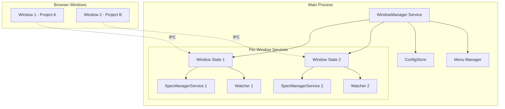
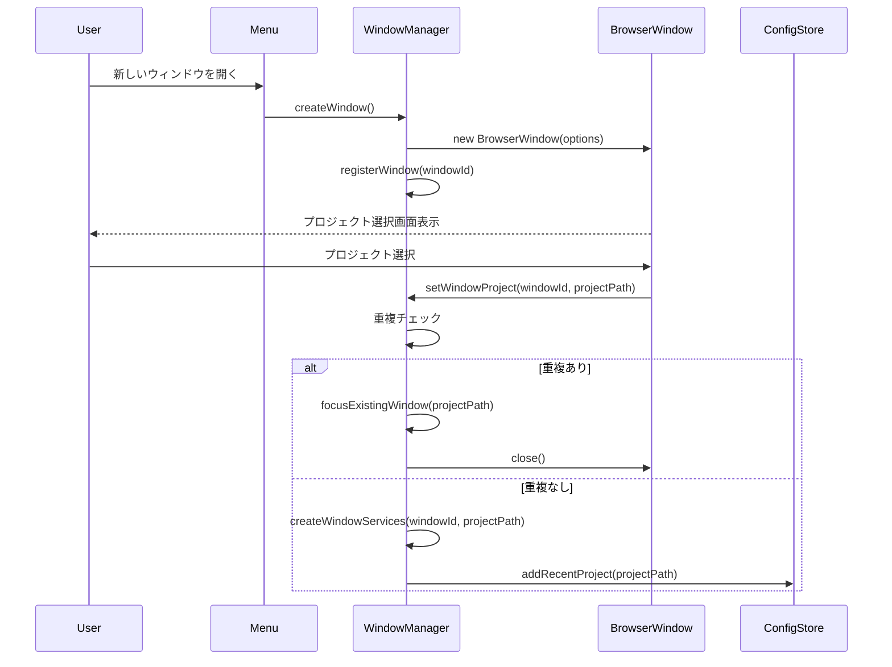
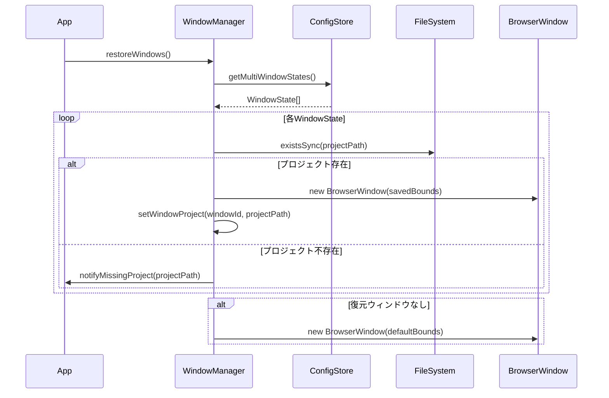
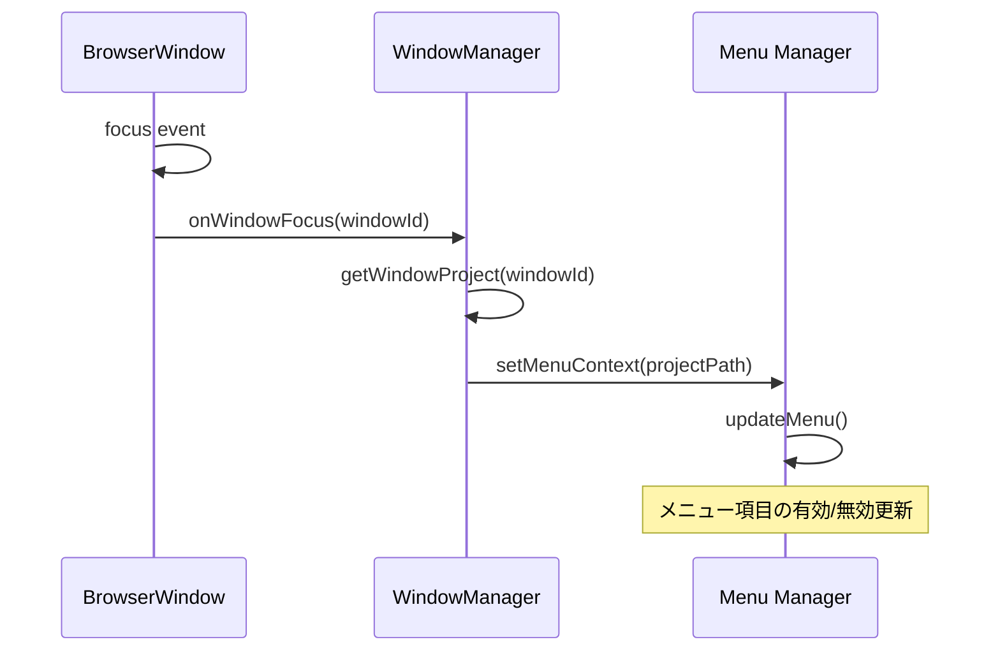
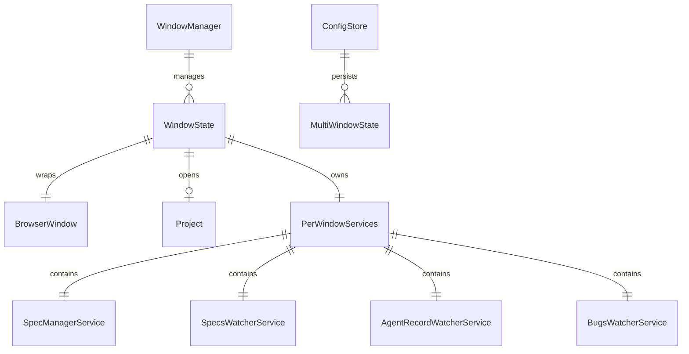

# Design Document: multi-window-support

## Overview

**Purpose**: 本機能はSDD Managerに複数プロジェクトの同時管理機能を提供する。各ウィンドウが独立したプロジェクトを開き、並行作業を可能にする。

**Users**: 複数のプロジェクトを同時に開発・管理する開発者がこの機能を利用する。プロジェクト間の切り替えなしで、各プロジェクトのSpec状態確認やエージェント実行を行う。

**Impact**: 現在の単一ウィンドウ設計からマルチウィンドウ設計へ移行する。main/index.ts、menu.ts、handlers.ts、configStore.tsに変更を加え、新規にWindowManagerサービスを追加する。

### Goals
- 複数プロジェクトを独立したウィンドウで同時に開く
- フォーカスウィンドウに応じたメニューコンテキストの自動切替
- 同一プロジェクトの重複オープン防止
- アプリ再起動時のウィンドウ状態復元
- 各ウィンドウのエージェントプロセス独立管理

### Non-Goals
- ウィンドウ間でのプロジェクトデータ共有・同期
- 単一ウィンドウ内でのタブ型マルチプロジェクト管理
- ウィンドウのドッキング・スナップ機能
- リモートプロジェクトのマルチウィンドウ対応（将来検討）

## Architecture

### Existing Architecture Analysis

現在のアーキテクチャ（単一ウィンドウ設計）:
- `main/index.ts`: 単一の`mainWindow`変数でウィンドウ管理
- `main/menu.ts`: `currentProjectPathForMenu`変数でメニュー状態管理
- `main/ipc/handlers.ts`: 単一の`specManagerService`、`specsWatcherService`インスタンス
- `main/services/configStore.ts`: 単一ウィンドウのbounds保存

**Technical Debt**: グローバル変数による状態管理がマルチウィンドウ化の障壁となっている。

### Architecture Pattern & Boundary Map



**Architecture Integration**:
- Selected pattern: ウィンドウごとのサービスインスタンス分離 + 中央集権的WindowManager
- Domain/feature boundaries: WindowManagerがウィンドウライフサイクルを管理、各ウィンドウが独立したプロジェクトコンテキストを保持
- Existing patterns preserved: IPC通信パターン、サービス層の構造、Zustand状態管理（Renderer）
- New components rationale: WindowManagerは複数ウィンドウの一元管理、重複防止、状態永続化を担当
- Steering compliance: TypeScript strict mode維持、既存のelectron-store活用

### Technology Stack

| Layer | Choice / Version | Role in Feature | Notes |
|-------|------------------|-----------------|-------|
| Desktop Runtime | Electron (既存) | マルチウィンドウ管理、IPC通信 | BrowserWindow API活用 |
| State Persistence | electron-store (既存) | マルチウィンドウ状態永続化 | configStore拡張 |
| Frontend State | Zustand (既存) | ウィンドウ内状態管理 | 変更なし |
| IPC | contextBridge (既存) | ウィンドウ-メインプロセス通信 | 変更なし |

## System Flows

### 新規ウィンドウ作成フロー



**Key Decisions**:
- 重複チェックはプロジェクト選択時に実行（ウィンドウ作成時ではなく）
- 重複時は既存ウィンドウをフォーカスし、新規ウィンドウは閉じる

### アプリ起動時の復元フロー



### メニューコンテキスト切替フロー



## Requirements Traceability

| Requirement | Summary | Components | Interfaces | Flows |
|-------------|---------|------------|------------|-------|
| 1.1 | 新規ウィンドウ作成 | WindowManager, Menu | createWindow() | 新規ウィンドウ作成フロー |
| 1.2 | プロジェクト選択 | WindowManager, Renderer | setWindowProject() | 新規ウィンドウ作成フロー |
| 1.3 | タイトル表示 | WindowManager | updateWindowTitle() | - |
| 1.4 | リソース解放 | WindowManager | closeWindow() | - |
| 1.5 | 最後のウィンドウ終了 | WindowManager, App | handleAllWindowsClosed() | - |
| 2.1 | フォーカス時コンテキスト切替 | WindowManager, Menu | onWindowFocus() | メニューコンテキスト切替フロー |
| 2.2 | メニュー操作のウィンドウ追従 | Menu, IPC | executePhase() | - |
| 2.3 | 未選択時メニュー無効化 | Menu | setMenuContext() | - |
| 2.4 | アクティブプロジェクト表示 | Menu | updateMenu() | - |
| 3.1 | 重複オープン時既存フォーカス | WindowManager | checkDuplicate(), focusWindow() | 新規ウィンドウ作成フロー |
| 3.2 | 最小化ウィンドウ復元 | WindowManager | restoreAndFocus() | - |
| 3.3 | プロジェクトパス管理 | WindowManager | projectWindowMap | - |
| 3.4 | D&D/CLIからの重複チェック | WindowManager | openProject() | - |
| 4.1 | 終了時状態保存 | WindowManager, ConfigStore | saveAllWindowStates() | - |
| 4.2 | 起動時状態復元 | WindowManager, ConfigStore | restoreWindows() | 起動時復元フロー |
| 4.3 | 不存在プロジェクトスキップ | WindowManager | restoreWindows() | 起動時復元フロー |
| 4.4 | 初回起動時デフォルト | WindowManager | restoreWindows() | 起動時復元フロー |
| 4.5 | 最大化/最小化状態復元 | WindowManager, ConfigStore | WindowState.isMaximized | - |
| 4.6 | マルチディスプレイ対応 | WindowManager | validateDisplayBounds() | - |
| 5.1 | 一貫したUI | Renderer | - | 変更なし |
| 5.2 | 設定変更の全ウィンドウ反映 | WindowManager, IPC | broadcastSettingsChange() | - |
| 5.3 | 独立したエージェント管理 | WindowManager, SpecManagerService | PerWindowServices | - |
| 5.4 | エージェント独立監視 | WindowManager, SpecManagerService | getAgents() | - |

## Components and Interfaces

### Summary

| Component | Domain/Layer | Intent | Req Coverage | Key Dependencies | Contracts |
|-----------|--------------|--------|--------------|------------------|-----------|
| WindowManager | Main/Service | ウィンドウライフサイクルと状態の一元管理 | 1.1-1.5, 3.1-3.4, 4.1-4.6, 5.2-5.4 | BrowserWindow (P0), ConfigStore (P0), Menu (P1) | Service, State |
| ConfigStore拡張 | Main/Service | マルチウィンドウ状態の永続化 | 4.1-4.6 | electron-store (P0) | State |
| Menu拡張 | Main/Service | フォーカスウィンドウ追従 | 2.1-2.4 | WindowManager (P0), BrowserWindow (P1) | Service |
| IPC Handlers拡張 | Main/IPC | ウィンドウ別ルーティング | 5.3, 5.4 | WindowManager (P0), SpecManagerService (P1) | Service |

### Main Process Layer

#### WindowManager

| Field | Detail |
|-------|--------|
| Intent | 複数ウィンドウのライフサイクル、プロジェクト割当、状態管理を一元化 |
| Requirements | 1.1, 1.2, 1.3, 1.4, 1.5, 3.1, 3.2, 3.3, 3.4, 4.1, 4.2, 4.3, 4.4, 4.5, 4.6, 5.2, 5.3, 5.4 |

**Responsibilities & Constraints**
- ウィンドウの作成・破棄・状態追跡
- プロジェクトパスとウィンドウIDのマッピング管理
- 重複オープン防止
- ウィンドウごとのサービスインスタンス管理
- アプリ終了時の状態永続化、起動時の復元

**Dependencies**
- Inbound: Menu -- ウィンドウ作成要求 (P0)
- Inbound: IPC Handlers -- ウィンドウ特定、プロジェクト設定 (P0)
- Outbound: BrowserWindow -- ウィンドウ操作 (P0)
- Outbound: ConfigStore -- 状態永続化 (P0)
- Outbound: Menu -- コンテキスト更新通知 (P1)
- Outbound: SpecManagerService -- サービスインスタンス管理 (P1)

**Contracts**: Service [x] / API [ ] / Event [ ] / Batch [ ] / State [x]

##### Service Interface

```typescript
interface WindowState {
  windowId: number;
  projectPath: string | null;
  bounds: WindowBounds;
  isMaximized: boolean;
  isMinimized: boolean;
}

interface PerWindowServices {
  specManagerService: SpecManagerService;
  specsWatcherService: SpecsWatcherService;
  agentRecordWatcherService: AgentRecordWatcherService;
  bugsWatcherService: BugsWatcherService;
}

interface WindowManagerService {
  // ウィンドウ作成・管理
  createWindow(options?: { projectPath?: string }): BrowserWindow;
  closeWindow(windowId: number): void;
  getWindow(windowId: number): BrowserWindow | null;
  getAllWindowIds(): number[];

  // プロジェクト管理
  setWindowProject(windowId: number, projectPath: string): Result<void, DuplicateProjectError>;
  getWindowProject(windowId: number): string | null;
  getWindowByProject(projectPath: string): BrowserWindow | null;

  // 重複チェック・フォーカス
  checkDuplicate(projectPath: string): number | null;
  focusWindow(windowId: number): void;
  restoreAndFocus(windowId: number): void;

  // 状態永続化
  saveAllWindowStates(): void;
  restoreWindows(): void;

  // サービス管理
  getWindowServices(windowId: number): PerWindowServices | null;

  // イベント
  onWindowFocus(callback: (windowId: number) => void): void;
  onWindowClose(callback: (windowId: number) => void): void;
}

type DuplicateProjectError = {
  type: 'DUPLICATE_PROJECT';
  existingWindowId: number;
  projectPath: string;
};
```

- Preconditions: アプリ初期化完了後に呼び出し可能
- Postconditions: createWindow後、ウィンドウはwindowStatesマップに登録される
- Invariants: 同一projectPathを持つウィンドウは1つのみ

##### State Management

```typescript
// 内部状態
interface WindowManagerState {
  windowStates: Map<number, WindowState>;
  projectWindowMap: Map<string, number>; // projectPath -> windowId
  windowServices: Map<number, PerWindowServices>;
}
```

- State model: Main processメモリ上のMap構造
- Persistence: アプリ終了時にConfigStoreへ永続化
- Concurrency: 単一スレッド（Main process）、競合なし

**Implementation Notes**
- Integration: 既存のindex.tsの`createWindow()`関数をWindowManagerに移行
- Validation: projectPathは`path.resolve()`で正規化後に比較
- Risks: ウィンドウ数増加によるメモリ消費（推奨上限: 10ウィンドウ）

---

#### ConfigStore拡張

| Field | Detail |
|-------|--------|
| Intent | マルチウィンドウ状態の永続化と復元 |
| Requirements | 4.1, 4.2, 4.3, 4.4, 4.5, 4.6 |

**Responsibilities & Constraints**
- 複数ウィンドウの状態（位置、サイズ、プロジェクト）を配列として保存
- スキーマバリデーション
- 既存の単一ウィンドウ状態（windowBounds）との後方互換性

**Dependencies**
- External: electron-store -- 永続化 (P0)

**Contracts**: Service [x] / API [ ] / Event [ ] / Batch [ ] / State [x]

##### Service Interface

```typescript
interface MultiWindowState {
  projectPath: string;
  bounds: WindowBounds;
  isMaximized: boolean;
  isMinimized: boolean;
}

interface ConfigStoreExtension {
  // 既存メソッドは維持

  // マルチウィンドウ状態
  getMultiWindowStates(): MultiWindowState[];
  setMultiWindowStates(states: MultiWindowState[]): void;
}
```

##### State Management

```typescript
// electron-store スキーマ拡張
interface AppConfig {
  // 既存
  recentProjects: string[];
  windowBounds: WindowBounds | null;
  hangThreshold: number;
  version: number;

  // 新規追加
  multiWindowStates: MultiWindowState[];
}
```

**Implementation Notes**
- Integration: 既存のconfigStore.tsにメソッド追加
- Validation: スキーマによる自動バリデーション
- Risks: 旧バージョンからのマイグレーション（multiWindowStatesが存在しない場合の初期化）

**Migration Logic (旧バージョンからの移行)**:
```typescript
getMultiWindowStates(): MultiWindowState[] {
  const states = this.store.get('multiWindowStates');
  if (states && states.length > 0) {
    return states;
  }

  // マイグレーション: multiWindowStatesが存在しない場合
  const legacyBounds = this.store.get('windowBounds');
  if (legacyBounds) {
    // 旧windowBoundsから単一ウィンドウ状態を復元（プロジェクトなし）
    return [{
      projectPath: '', // 復元時にプロジェクト選択画面を表示
      bounds: legacyBounds,
      isMaximized: false,
      isMinimized: false
    }];
  }

  // 初回起動または状態ファイルなし: 空配列（デフォルトウィンドウ作成）
  return [];
}
```

---

#### Menu拡張

| Field | Detail |
|-------|--------|
| Intent | フォーカスウィンドウに応じたメニューコンテキスト切替 |
| Requirements | 2.1, 2.2, 2.3, 2.4 |

**Responsibilities & Constraints**
- フォーカス変更時にメニュー状態を更新
- プロジェクト未選択ウィンドウでは操作系メニューを無効化
- 新規ウィンドウ作成メニュー項目の追加

**Dependencies**
- Inbound: WindowManager -- コンテキスト更新通知 (P0)
- Outbound: BrowserWindow -- フォーカスウィンドウ取得 (P1)

**Contracts**: Service [x] / API [ ] / Event [ ] / Batch [ ] / State [ ]

##### Service Interface

```typescript
interface MenuExtension {
  // 既存メソッドは維持

  // 新規ウィンドウメニュー
  addNewWindowMenuItem(): void;

  // コンテキスト更新（既存のsetMenuProjectPathを拡張）
  setMenuContext(windowId: number, projectPath: string | null): void;
}
```

**Implementation Notes**
- Integration: 既存のmenu.tsを拡張
- Validation: windowIdの有効性チェック
- Risks: 高頻度のメニュー再構築によるパフォーマンス（フォーカス切替ごと）
- **Active Project Display (Req 2.4)**: アクティブプロジェクト名の表示はウィンドウタイトルで行う。既存の`updateWindowTitle()`関数を活用し、「SDD Orchestrator - プロジェクト名」形式で表示する。メニューバー自体へのプロジェクト名表示は行わない（macOS/Windowsの一般的なUXパターンに準拠）

---

#### IPC Handlers拡張

| Field | Detail |
|-------|--------|
| Intent | ウィンドウ別のサービスルーティング |
| Requirements | 5.3, 5.4 |

**Responsibilities & Constraints**
- IPC呼び出しの送信元ウィンドウを特定
- ウィンドウに対応するサービスインスタンスにルーティング
- ウィンドウクローズ時のイベントリスナー解除

**Dependencies**
- Inbound: Renderer -- IPC呼び出し (P0)
- Outbound: WindowManager -- サービスインスタンス取得 (P0)

**Contracts**: Service [x] / API [ ] / Event [ ] / Batch [ ] / State [ ]

##### Service Interface

```typescript
// 既存のIPC Handlersを拡張
// 変更点: グローバルサービスインスタンスからウィンドウ別インスタンスへ

// 例: executePhaseハンドラ
ipcMain.handle(IPC_CHANNELS.EXECUTE_PHASE, async (event, specId, phase, featureName, commandPrefix) => {
  const window = BrowserWindow.fromWebContents(event.sender);
  if (!window) throw new Error('Window not found');

  const windowId = window.id;
  const services = windowManager.getWindowServices(windowId);
  if (!services) throw new Error('Services not initialized for this window');

  // 以降は既存ロジック（services.specManagerServiceを使用）
});
```

**Implementation Notes**
- Integration: 既存handlers.tsのグローバル変数をWindowManager経由に置換
- Validation: event.senderからのウィンドウ特定
- Risks: 既存テストへの影響（モック対象の変更）

## Data Models

### Domain Model



**Aggregates**:
- WindowManager: ウィンドウ管理の集約ルート
- WindowState: 個別ウィンドウの状態とサービス

**Invariants**:
- 同一projectPathを持つWindowStateは最大1つ
- PerWindowServicesはprojectPathが設定されたWindowStateにのみ存在

### Logical Data Model

**WindowState Entity**:
| Attribute | Type | Description |
|-----------|------|-------------|
| windowId | number | BrowserWindow.id (PK) |
| projectPath | string | null | 開いているプロジェクトパス |
| bounds | WindowBounds | ウィンドウ位置・サイズ |
| isMaximized | boolean | 最大化状態 |
| isMinimized | boolean | 最小化状態 |

**MultiWindowState (Persisted)**:
| Attribute | Type | Description |
|-----------|------|-------------|
| projectPath | string | プロジェクトパス (復元用識別子) |
| bounds | WindowBounds | ウィンドウ位置・サイズ |
| isMaximized | boolean | 最大化状態 |
| isMinimized | boolean | 最小化状態 |

**Indexing**:
- projectWindowMap: projectPath -> windowId（O(1)重複チェック用）

### Data Contracts & Integration

**IPC Data Transfer**:
- 既存のIPC契約は維持
- 追加チャネル: `NEW_WINDOW_CREATED`, `WINDOW_PROJECT_CHANGED`

## Error Handling

### Error Strategy

エラーは発生箇所でキャッチし、適切なレベルで処理または伝播する。ユーザー操作に起因するエラーは通知で表示し、システムエラーはログ記録後にフォールバック動作を実行する。

### Error Categories and Responses

**User Errors (4xx equivalent)**:
- 重複プロジェクトオープン → 既存ウィンドウをフォーカス、ユーザー通知
- 無効なプロジェクトパス → エラー通知、プロジェクト選択画面に戻す

**System Errors (5xx equivalent)**:
- ウィンドウ作成失敗 → エラーログ、リトライ提案
- 状態復元失敗 → デフォルトウィンドウで起動、警告ログ

**Business Logic Errors (422 equivalent)**:
- プロジェクトディレクトリ不存在（復元時） → スキップ、ユーザー通知

### Monitoring

- ウィンドウ作成/破棄イベントのログ記録
- 状態永続化の成功/失敗ログ
- メモリ使用量の定期的なログ（開発時）

## Testing Strategy

### Unit Tests
- WindowManager.createWindow(): ウィンドウ作成とマップ登録
- WindowManager.checkDuplicate(): 重複検出ロジック
- WindowManager.restoreWindows(): 状態復元とプロジェクト不存在ハンドリング
- ConfigStore.getMultiWindowStates(): 永続化データの読み書き
- Menu.setMenuContext(): コンテキスト切替によるメニュー状態変更

### Integration Tests
- 複数ウィンドウ作成 → 各ウィンドウで独立したプロジェクト操作
- ウィンドウ間フォーカス切替 → メニュー状態の正しい更新
- アプリ終了 → 再起動 → 状態復元確認
- 重複プロジェクトオープン試行 → 既存ウィンドウフォーカス確認

### E2E Tests
- 新規ウィンドウ作成からプロジェクト選択まで
- 複数ウィンドウでの同時エージェント実行
- アプリ再起動後のウィンドウ復元（位置、プロジェクト）

### Performance Tests
- 10ウィンドウ同時オープン時のメモリ使用量
- 高頻度フォーカス切替時のメニュー再構築パフォーマンス

## Optional Sections

### Security Considerations

- 各ウィンドウのpreloadスクリプトは既存と同一（contextIsolation維持）
- ウィンドウ間でのデータ直接共有は行わない（IPCはMain process経由）
- プロジェクトパスのファイルシステムアクセスは既存の権限チェックを維持

### Performance & Scalability

- **Target metrics**: 10ウィンドウまでの快適な動作
- **Memory**: 各ウィンドウあたり約200MB（Chromiumプロセス）
- **Optimization**: 使用されていないウィンドウのサービスインスタンスは遅延初期化を検討（将来）

## Supporting References

詳細な調査結果は`research.md`を参照。

- [Electron BrowserWindow API](https://www.electronjs.org/docs/latest/api/browser-window)
- [electron-store](https://github.com/sindresorhus/electron-store)
- [Multiple Windows in Electron apps](https://blog.bloomca.me/2025/07/21/multi-window-in-electron.html)
