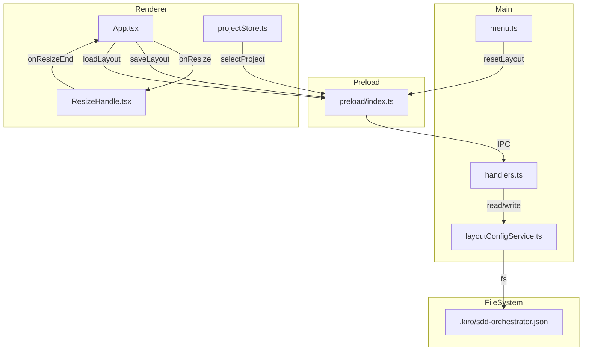
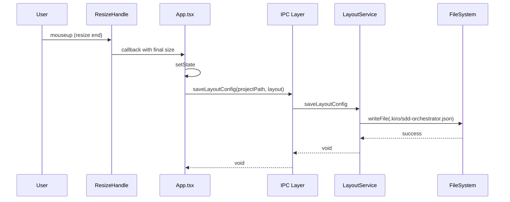
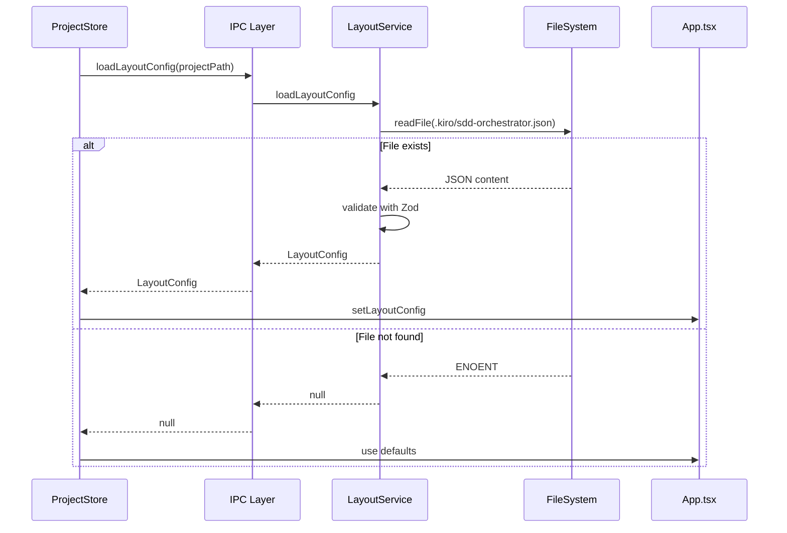

# Design Document

## Overview

**Purpose**: 本機能は、プロジェクト毎のUIレイアウト設定（ペインサイズ）を永続化し、作業環境の継続性を実現する。

**Users**: SDD Orchestratorユーザーは、ペインのリサイズ設定がプロジェクト単位で自動保存・復元されることで、毎回の手動調整から解放される。

**Impact**: 現在のハードコードされた初期値による毎回リセットから、プロジェクト固有の設定ファイル（`.kiro/sdd-orchestrator.json`）による永続化へ変更する。

### Goals

- ペインサイズのプロジェクト単位での自動保存・復元
- メニューからのレイアウトリセット機能
- 拡張可能な設定ファイル構造

### Non-Goals

- アプリ全体設定としての保存（electron-storeへのフォールバック）
- ウィンドウ位置・サイズの保存（既にconfigStoreで実装済み）
- 複数レイアウトプリセットの管理

## Architecture

### Existing Architecture Analysis

**現在の実装**:
- `App.tsx:86-89`: ペインサイズは`useState`でハードコードされた初期値を使用
- `ResizeHandle.tsx`: リサイズ機能自体は動作するが、永続化されない
- `configStore.ts`: アプリ全体の設定（recentProjects, windowBounds, hangThreshold）を保存
- `projectStore.ts`: プロジェクト選択時のバリデーションとspec-managerチェックを実行

**尊重すべきパターン**:
- IPC通信: `channels.ts` + `handlers.ts` + `preload/index.ts`
- サービス層: `*Service.ts` による単一責任原則
- Zustand storeパターン: 状態管理と非同期アクション
- メニュー管理: `menu.ts` での集中管理

### Architecture Pattern & Boundary Map



**Architecture Integration**:
- Selected pattern: サービス層パターン（既存の`fileService.ts`、`configStore.ts`と同様）
- Domain/feature boundaries: layoutConfigService.tsがファイルI/Oを担当し、rendererはIPC経由でのみアクセス
- Existing patterns preserved: IPC通信パターン、Zustand storeパターン
- New components rationale: `layoutConfigService.ts`はファイル操作をカプセル化し、将来の設定拡張を容易にする
- Steering compliance: TypeScript strict mode、Zodバリデーション、単一責任原則

### Technology Stack

| Layer | Choice / Version | Role in Feature | Notes |
|-------|------------------|-----------------|-------|
| Frontend | React 19 + Zustand | 状態管理・UI更新 | 既存パターン継続 |
| Backend | Node.js 20 + Electron 35 | IPC通信・ファイルI/O | 既存パターン継続 |
| Data | JSON file | `.kiro/sdd-orchestrator.json` | プロジェクト内保存 |

## System Flows

### レイアウト保存フロー



### レイアウト復元フロー



## Requirements Traceability

| Requirement | Summary | Components | Interfaces | Flows |
|-------------|---------|------------|------------|-------|
| 1.1, 1.2, 1.3, 1.4 | レイアウト設定の保存 | App, ResizeHandle, layoutConfigService | saveLayoutConfig | 保存フロー |
| 2.1, 2.2, 2.3, 2.4 | レイアウト設定の復元 | projectStore, layoutConfigService | loadLayoutConfig | 復元フロー |
| 3.1, 3.2, 3.3 | レイアウトのリセット機能 | menu, App, layoutConfigService | resetLayoutConfig, onMenuResetLayout | - |
| 4.1, 4.2, 4.3, 4.4 | 設定ファイルの構造 | layoutConfigService | LayoutConfig type | - |
| 5.1, 5.2, 5.3 | デフォルト値の定義 | layoutConfigService, App | DEFAULT_LAYOUT | - |

## Components and Interfaces

| Component | Domain/Layer | Intent | Req Coverage | Key Dependencies | Contracts |
|-----------|--------------|--------|--------------|------------------|-----------|
| layoutConfigService | Main/Service | レイアウト設定のファイルI/O | 1, 2, 3, 4, 5 | fs/promises (P0), Zod (P0) | Service |
| App.tsx (extension) | Renderer/UI | リサイズ完了時の保存・起動時の復元 | 1, 2, 5 | layoutConfigService (P0) | State |
| ResizeHandle (extension) | Renderer/UI | リサイズ完了イベント追加 | 1.1 | - | Event |
| menu.ts (extension) | Main/Menu | レイアウトリセットメニュー項目 | 3.1, 3.3 | - | Event |
| channels.ts (extension) | Main/IPC | IPCチャンネル定義 | 1, 2, 3 | - | - |
| handlers.ts (extension) | Main/IPC | IPCハンドラ | 1, 2, 3 | layoutConfigService (P0) | Service |
| preload/index.ts (extension) | Preload | Renderer向けAPI公開 | 1, 2, 3 | - | API |

### Main / Service

#### layoutConfigService

| Field | Detail |
|-------|--------|
| Intent | プロジェクト固有のレイアウト設定をファイルシステムで管理 |
| Requirements | 1.1-1.4, 2.1-2.4, 3.1-3.2, 4.1-4.4, 5.1-5.3 |

**Responsibilities & Constraints**
- `.kiro/sdd-orchestrator.json`ファイルの読み書き
- Zodスキーマによるバリデーション
- デフォルト値の提供
- エラー発生時のグレースフルデグラデーション

**Dependencies**
- Outbound: fs/promises - ファイル読み書き (P0)
- Outbound: Zod - スキーマバリデーション (P0)

**Contracts**: Service [x] / API [ ] / Event [ ] / Batch [ ] / State [ ]

##### Service Interface

```typescript
import { z } from 'zod';

// スキーマ定義
const LayoutConfigSchema = z.object({
  version: z.literal(1),
  layout: z.object({
    leftPaneWidth: z.number().min(0),
    rightPaneWidth: z.number().min(0),
    bottomPaneHeight: z.number().min(0),
    agentListHeight: z.number().min(0),
  }),
});

type LayoutConfig = z.infer<typeof LayoutConfigSchema>;

interface LayoutValues {
  leftPaneWidth: number;
  rightPaneWidth: number;
  bottomPaneHeight: number;
  agentListHeight: number;
}

// デフォルト値（App.tsxの現在の初期値と同一）
const DEFAULT_LAYOUT: LayoutValues = {
  leftPaneWidth: 288,    // w-72 = 18rem = 288px
  rightPaneWidth: 320,   // w-80 = 20rem = 320px
  bottomPaneHeight: 192, // h-48 = 12rem = 192px
  agentListHeight: 160,  // Agent一覧パネルの高さ
};

interface LayoutConfigService {
  /**
   * レイアウト設定を読み込む
   * @param projectPath プロジェクトルートパス
   * @returns LayoutValues | null（ファイルが存在しない場合）
   */
  loadLayoutConfig(projectPath: string): Promise<LayoutValues | null>;

  /**
   * レイアウト設定を保存する
   * @param projectPath プロジェクトルートパス
   * @param layout 保存するレイアウト値
   */
  saveLayoutConfig(projectPath: string, layout: LayoutValues): Promise<void>;

  /**
   * レイアウト設定をリセットする（デフォルト値で上書き）
   * @param projectPath プロジェクトルートパス
   */
  resetLayoutConfig(projectPath: string): Promise<void>;

  /**
   * デフォルトのレイアウト値を取得
   */
  getDefaultLayout(): LayoutValues;
}
```

- Preconditions: `.kiro/`ディレクトリが存在すること
- Postconditions: 保存後はファイルが存在し、有効なJSONを含む
- Invariants: versionフィールドは常に1

**Implementation Notes**
- Integration: 既存の`FileService`パターンに従い、`fs/promises`を直接使用
- Validation: Zodスキーマで入力を検証し、不正なデータはログ記録してnull返却
- Risks: `.kiro/`が存在しないプロジェクトでは保存不可（要件通り）

### Main / IPC

#### channels.ts (extension)

新規IPCチャンネル定義を追加:

```typescript
// 追加するチャンネル
LOAD_LAYOUT_CONFIG: 'ipc:load-layout-config',
SAVE_LAYOUT_CONFIG: 'ipc:save-layout-config',
RESET_LAYOUT_CONFIG: 'ipc:reset-layout-config',

// メニューイベント
MENU_RESET_LAYOUT: 'menu:reset-layout',
```

#### handlers.ts (extension)

新規IPCハンドラを追加:

```typescript
// LOAD_LAYOUT_CONFIG
ipcMain.handle(IPC_CHANNELS.LOAD_LAYOUT_CONFIG, async (_event, projectPath: string) => {
  return layoutConfigService.loadLayoutConfig(projectPath);
});

// SAVE_LAYOUT_CONFIG
ipcMain.handle(IPC_CHANNELS.SAVE_LAYOUT_CONFIG, async (_event, projectPath: string, layout: LayoutValues) => {
  return layoutConfigService.saveLayoutConfig(projectPath, layout);
});

// RESET_LAYOUT_CONFIG
ipcMain.handle(IPC_CHANNELS.RESET_LAYOUT_CONFIG, async (_event, projectPath: string) => {
  return layoutConfigService.resetLayoutConfig(projectPath);
});
```

### Preload

#### preload/index.ts (extension)

Renderer向けAPI追加:

```typescript
// Layout Config
loadLayoutConfig: (projectPath: string): Promise<LayoutValues | null> =>
  ipcRenderer.invoke(IPC_CHANNELS.LOAD_LAYOUT_CONFIG, projectPath),

saveLayoutConfig: (projectPath: string, layout: LayoutValues): Promise<void> =>
  ipcRenderer.invoke(IPC_CHANNELS.SAVE_LAYOUT_CONFIG, projectPath, layout),

resetLayoutConfig: (projectPath: string): Promise<void> =>
  ipcRenderer.invoke(IPC_CHANNELS.RESET_LAYOUT_CONFIG, projectPath),

// Menu Event
onMenuResetLayout: (callback: () => void): (() => void) => {
  const handler = () => callback();
  ipcRenderer.on(IPC_CHANNELS.MENU_RESET_LAYOUT, handler);
  return () => ipcRenderer.removeListener(IPC_CHANNELS.MENU_RESET_LAYOUT, handler);
},
```

### Renderer / UI

#### App.tsx (extension)

| Field | Detail |
|-------|--------|
| Intent | リサイズ完了時の保存トリガー、プロジェクト選択時の復元 |
| Requirements | 1.1, 2.1, 5.2 |

**変更内容**:

1. **デフォルト値の共有化**: `DEFAULT_LAYOUT`定数を使用

2. **リサイズ完了時の保存**: `ResizeHandle`の`onResizeEnd`コールバックで保存

3. **プロジェクト選択時の復元**: `selectProject`後にレイアウト設定を読み込み

4. **メニューイベントリスナー**: レイアウトリセットメニューへの対応

**Contracts**: Service [ ] / API [ ] / Event [ ] / Batch [ ] / State [x]

##### State Management

```typescript
// ペインサイズの状態（既存）
const [leftPaneWidth, setLeftPaneWidth] = useState(DEFAULT_LAYOUT.leftPaneWidth);
const [rightPaneWidth, setRightPaneWidth] = useState(DEFAULT_LAYOUT.rightPaneWidth);
const [bottomPaneHeight, setBottomPaneHeight] = useState(DEFAULT_LAYOUT.bottomPaneHeight);
const [agentListHeight, setAgentListHeight] = useState(DEFAULT_LAYOUT.agentListHeight);

// レイアウト保存関数
const saveLayout = useCallback(async () => {
  if (!currentProject) return;
  try {
    await window.electronAPI.saveLayoutConfig(currentProject, {
      leftPaneWidth,
      rightPaneWidth,
      bottomPaneHeight,
      agentListHeight,
    });
  } catch (error) {
    console.error('[App] Failed to save layout config:', error);
  }
}, [currentProject, leftPaneWidth, rightPaneWidth, bottomPaneHeight, agentListHeight]);

// レイアウト復元関数
const loadLayout = useCallback(async (projectPath: string) => {
  try {
    const config = await window.electronAPI.loadLayoutConfig(projectPath);
    if (config) {
      setLeftPaneWidth(config.leftPaneWidth);
      setRightPaneWidth(config.rightPaneWidth);
      setBottomPaneHeight(config.bottomPaneHeight);
      setAgentListHeight(config.agentListHeight);
    }
  } catch (error) {
    console.error('[App] Failed to load layout config:', error);
  }
}, []);

// レイアウトリセット関数
const resetLayout = useCallback(async () => {
  setLeftPaneWidth(DEFAULT_LAYOUT.leftPaneWidth);
  setRightPaneWidth(DEFAULT_LAYOUT.rightPaneWidth);
  setBottomPaneHeight(DEFAULT_LAYOUT.bottomPaneHeight);
  setAgentListHeight(DEFAULT_LAYOUT.agentListHeight);

  if (currentProject) {
    try {
      await window.electronAPI.resetLayoutConfig(currentProject);
    } catch (error) {
      console.error('[App] Failed to reset layout config:', error);
    }
  }
}, [currentProject]);
```

#### ResizeHandle.tsx (extension)

| Field | Detail |
|-------|--------|
| Intent | リサイズ完了イベントの追加 |
| Requirements | 1.1 |

**変更内容**:

```typescript
interface ResizeHandleProps {
  onResize: (delta: number) => void;
  onResizeEnd?: () => void;  // 追加
  direction: 'horizontal' | 'vertical';
}

// handleMouseUp内で呼び出し
const handleMouseUp = () => {
  setIsDragging(false);
  onResizeEnd?.();  // 追加
};
```

### Main / Menu

#### menu.ts (extension)

| Field | Detail |
|-------|--------|
| Intent | 「表示」メニューに「レイアウトをリセット」項目を追加 |
| Requirements | 3.1, 3.3 |

**変更内容**:

```typescript
// 「表示」メニューのsubmenu内に追加
{
  label: '表示',
  submenu: [
    // ... 既存項目 ...
    { type: 'separator' as const },
    {
      label: 'レイアウトをリセット',
      enabled: currentProjectPathForMenu !== null,
      click: () => {
        const window = BrowserWindow.getFocusedWindow() || BrowserWindow.getAllWindows()[0];
        if (window) {
          window.webContents.send(IPC_CHANNELS.MENU_RESET_LAYOUT);
        }
      },
    },
  ],
},
```

## Data Models

### Domain Model

**LayoutConfig Aggregate**:

```typescript
interface LayoutConfig {
  version: 1;                    // スキーマバージョン（将来の互換性用）
  layout: {
    leftPaneWidth: number;       // 左ペイン幅（px）
    rightPaneWidth: number;      // 右ペイン幅（px）
    bottomPaneHeight: number;    // 下部ペイン高さ（px）
    agentListHeight: number;     // Agent一覧高さ（px）
  };
}
```

**Business Rules & Invariants**:
- `version`は常に`1`（将来のフォーマット変更時にマイグレーション判断用）
- 各サイズ値は0以上の整数
- ファイルパス: `{projectPath}/.kiro/sdd-orchestrator.json`

### Logical Data Model

**ファイル構造**:

```json
{
  "version": 1,
  "layout": {
    "leftPaneWidth": 320,
    "rightPaneWidth": 400,
    "bottomPaneHeight": 250,
    "agentListHeight": 180
  }
}
```

**Consistency & Integrity**:
- ファイルが存在しない場合はデフォルト値を使用
- バリデーション失敗時はデフォルト値を使用し警告ログ出力
- 保存はリサイズ完了時に即座に実行（debounce不要、mouseupイベントは1回のみ）

## Error Handling

### Error Strategy

**Fail-safe approach**: エラー発生時もUI動作は継続し、ログのみ記録

### Error Categories and Responses

**System Errors**:
- ファイル読み込み失敗 → デフォルト値を使用、ログ記録
- ファイル書き込み失敗 → ログ記録、UIは継続
- JSON パースエラー → デフォルト値を使用、警告ログ

**Business Logic Errors**:
- バリデーション失敗 → デフォルト値を使用、警告ログ
- `.kiro/`ディレクトリ不在 → 保存をスキップ（SDDプロジェクト以外は対象外）

### Monitoring

- `console.error`による開発時のエラー追跡
- 将来的にはElectronのロギングサービスへの統合を検討

## Testing Strategy

### Unit Tests

- `layoutConfigService.ts`: ファイル読み書き、バリデーション、デフォルト値
- Zodスキーマ: 有効/無効なデータのバリデーション

### Integration Tests

- IPC通信: load/save/reset の往復
- プロジェクト選択時の設定復元
- メニューからのリセット動作

### E2E Tests

- ペインリサイズ後のファイル生成確認
- アプリ再起動後の設定復元
- レイアウトリセット後のデフォルト値適用
