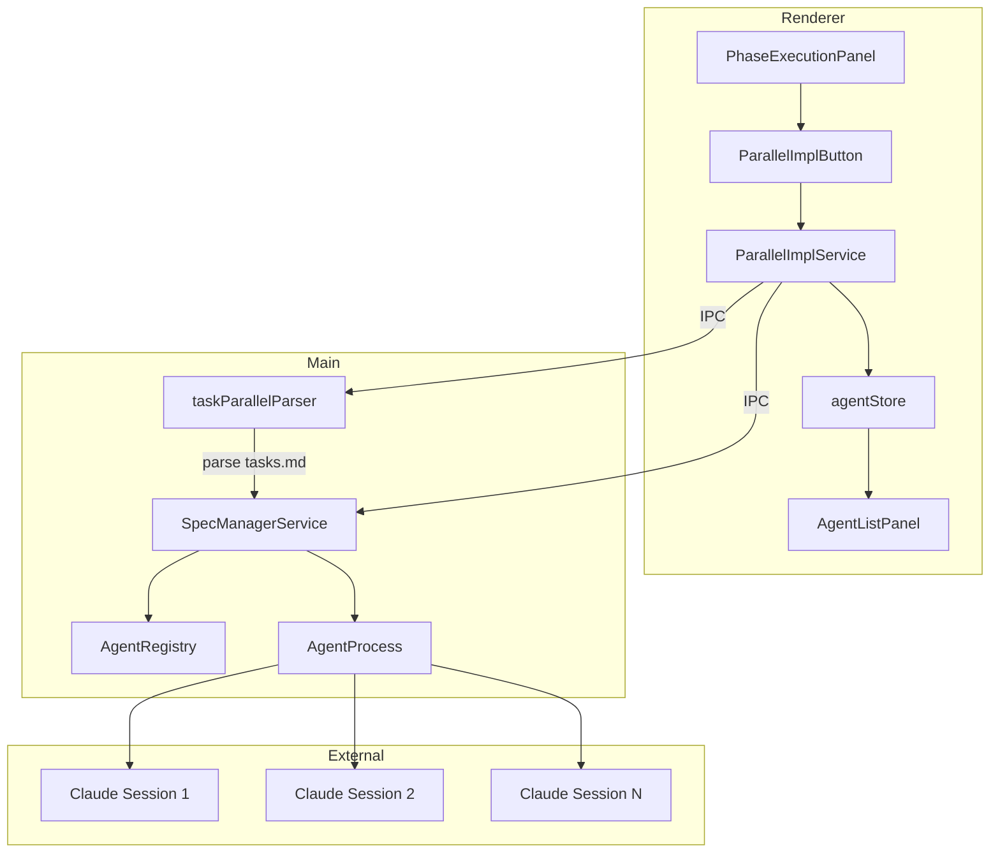
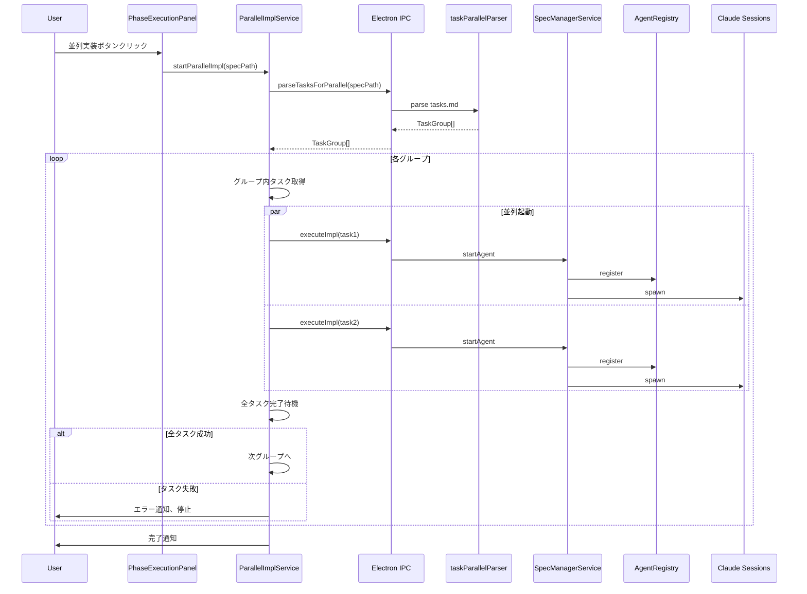

# Design Document: parallel-task-impl

## Overview

**Purpose**: tasks.mdの(P)マークを活用し、並列実行可能なタスクを複数のClaudeセッションで同時に実装する機能を提供する。

**Users**: 開発者がPhaseExecutionPanelから「並列実装」ボタンを使用し、タスクの並列実行により実装時間を短縮する。

**Impact**: 既存の「実装」ボタンと並行して動作し、既存ワークフローを維持しながら並列実行オプションを追加する。

### Goals

- tasks.mdから(P)マーク付きタスクを識別し、グループ化する
- グループ内タスクを並列でClaudeセッション起動し実装する
- グループ間は順次進行し、全タスク完了まで自動継続する
- MAX_CONCURRENT_SPECS=5の制限を適用する

### Non-Goals

- 既存の「実装」ボタンの動作変更
- tasks.mdの(P)マーク生成ロジック（既存のtasks-parallel-analysis.mdで対応済み）
- 並列ビルド・テスト実行（impl内部の処理）
- リモートプロジェクトでの並列実装（将来拡張）
- Remote UI（VS Code Web Extension等）対応: 複数Claudeセッションの同時起動はDesktop専用機能として設計。Remote UI環境での並列実行は複雑性が高いため、将来拡張として別Specで検討する

## Architecture

### Architecture Pattern & Boundary Map



**Architecture Integration**:
- 選択パターン: 既存のAutoExecutionServiceパターンを参考にした並列実行サービス
- ドメイン境界: Renderer側でオーケストレーション、Main側でパース・プロセス管理
- 既存パターン維持: agentStore、AgentRegistry、AgentProcessの既存インターフェースを活用
- 新規コンポーネント: taskParallelParser（Main）、ParallelImplService（Renderer）
- Steering準拠: DRY（既存インフラ活用）、SSOT（agentRegistryが実行状態管理）

### Technology Stack

| Layer | Choice / Version | Role in Feature | Notes |
|-------|------------------|-----------------|-------|
| Frontend | React 19, Zustand | UI状態管理、並列実行オーケストレーション | 既存スタック |
| Backend | Node.js, Electron 35 | tasks.mdパース、Agentプロセス管理 | 既存スタック |
| IPC | Electron IPC | Renderer-Main間通信 | 既存パターン |

## System Flows

### 並列実装フロー



**Key Decisions**:
- グループ間は順次実行（前グループ完了後に次グループ開始）
- 失敗時は新規タスク起動を停止し、実行中タスクは完了まで継続
- MAX_CONCURRENT_SPECS=5の上限を超える場合はキューイング

## Requirements Traceability

| Requirement | Summary | Components | Interfaces | Flows |
|-------------|---------|------------|------------|-------|
| 1.1-1.4 | 並列実装ボタン配置 | PhaseExecutionPanel, ParallelImplButton | なし | UI表示フロー |
| 2.1-2.5 | tasks.mdパーサー | taskParallelParser | parseTasksForParallel（新規IPC） | パース処理 |
| 3.1-3.3 | タスクグループ化 | taskParallelParser | TaskGroup型 | グループ化ロジック |
| 4.1-4.4 | 並列Claudeセッション起動 | ParallelImplService | executeTaskImpl（既存IPC）| 並列起動フロー |
| 5.1-5.3 | グループ間自動進行 | ParallelImplService | onAgentStatusChange（既存） | 自動進行フロー |
| 6.1-6.4 | エラーハンドリング | ParallelImplService | onAgentStatusChange（既存） | エラー処理フロー |
| 7.1-7.4 | 進捗表示 | AgentListPanel, ParallelImplButton | agentStore（既存） | UI更新フロー |
| 8.1-8.3 | 既存機能互換性 | PhaseExecutionPanel | 既存インターフェース維持 | なし |
| 9.1-9.3 | キャンセル機能 | ParallelImplService | stopAgent（既存IPC） | キャンセルフロー |

## Components and Interfaces

| Component | Domain/Layer | Intent | Req Coverage | Key Dependencies | Contracts |
|-----------|--------------|--------|--------------|------------------|-----------|
| taskParallelParser | Main/Service | tasks.mdを解析して(P)マーク付きタスクをグループ化 | 2.1-2.5, 3.1-3.3 | FileService (P0) | Service |
| ParallelImplService | Renderer/Service | 並列実装のオーケストレーション | 4.1-4.4, 5.1-5.3, 6.1-6.4, 9.1-9.3 | agentStore (P0), electronAPI (P0) | Service, State |
| ParallelImplButton | Renderer/UI | 並列実装ボタンUI | 1.1-1.4, 7.3 | ParallelImplService (P0) | なし |
| PhaseExecutionPanel拡張 | Renderer/UI | 並列実装ボタン配置 | 1.1-1.4 | ParallelImplButton (P1) | なし |

### Main/Service

#### taskParallelParser

| Field | Detail |
|-------|--------|
| Intent | tasks.mdを解析して(P)マーク付きタスクを識別・グループ化する |
| Requirements | 2.1, 2.2, 2.3, 2.4, 2.5, 3.1, 3.2, 3.3 |

**Responsibilities & Constraints**
- tasks.mdのMarkdown構造を解析し、タスク項目を抽出
- (P)マークの有無を判定し、並列実行可能フラグを設定
- 連続する(P)マーク付きタスクを同一グループに分類
- 非(P)タスクは単独グループとして扱う

**Dependencies**
- Inbound: SpecManagerService - tasks.md解析要求 (P0)
- Outbound: FileService - ファイル読み込み (P0)

**Contracts**: Service [x]

##### Service Interface

```typescript
interface TaskItem {
  readonly id: string;           // タスクID (例: "1.1", "2.3")
  readonly title: string;        // タスクタイトル
  readonly isParallel: boolean;  // (P)マーク有無
  readonly completed: boolean;   // チェック状態
  readonly parentId: string | null; // 親タスクID（サブタスク時）
}

interface TaskGroup {
  readonly groupIndex: number;   // グループ順序（0始まり）
  readonly tasks: TaskItem[];    // グループ内タスク
  readonly isParallel: boolean;  // グループ全体が並列実行可能か
}

interface ParseResult {
  readonly groups: TaskGroup[];
  readonly totalTasks: number;
  readonly parallelTasks: number;
}

interface TaskParallelParser {
  /**
   * tasks.mdを解析してTaskGroupの配列を返す
   * @param tasksContent - tasks.mdの内容
   * @returns ParseResult
   */
  parse(tasksContent: string): ParseResult;
}
```

- Preconditions: tasksContentはMarkdown形式の文字列
- Postconditions: 全タスクがいずれかのグループに含まれる
- Invariants: グループ順序はtasks.md内のタスク順序に準拠

**Implementation Notes**
- Integration: SpecManagerService.executeParallelImpl()から呼び出し
- Validation: (P)マーク検出は正規表現 `/\(P\)/` を使用
- Risks: 複雑なネスト構造での解析精度

---

#### SpecManagerService拡張

| Field | Detail |
|-------|--------|
| Intent | 並列実装用IPCエンドポイントを提供 |
| Requirements | 4.1, 4.2, 4.3, 4.4 |

**Responsibilities & Constraints**
- tasks.md解析エンドポイント追加
- 指定タスクに対するClaude実装Agent起動
- MAX_CONCURRENT_SPECS制限の適用

**Dependencies**
- Inbound: Renderer IPC - 並列実装要求 (P0)
- Outbound: taskParallelParser - タスク解析 (P0)
- Outbound: AgentRegistry - Agent登録 (P0)
- Outbound: AgentProcess - プロセス起動 (P0)

**Contracts**: API [x]

##### API Contract

| Method | Channel | Request | Response | Errors |
|--------|---------|---------|----------|--------|
| invoke | PARSE_TASKS_FOR_PARALLEL | { specId: string, featureName: string } | ParseResult | PARSE_ERROR, FILE_NOT_FOUND |

**既存APIの活用**:
- `EXECUTE_TASK_IMPL`: 既存チャンネルで個別タスク実装起動（`specId`, `featureName`, `taskId`, `commandPrefix`）
- `STOP_AGENT`: 既存チャンネルでAgentキャンセル（`agentId`）
- `AGENT_STATUS_CHANGE`: 既存イベントでAgent完了検知

**Implementation Notes**
- Integration: 新規IPCは `PARSE_TASKS_FOR_PARALLEL` のみ。タスク実行は既存の `executeTaskImpl` を活用
- Validation: MAX_CONCURRENT_SPECS超過チェックはRenderer側ParallelImplServiceで実施

---

### Renderer/Service

#### ParallelImplService

| Field | Detail |
|-------|--------|
| Intent | 並列実装のオーケストレーションと状態管理 |
| Requirements | 4.1, 4.2, 4.3, 4.4, 5.1, 5.2, 5.3, 6.1, 6.2, 6.3, 6.4, 9.1, 9.2, 9.3 |

**Responsibilities & Constraints**
- タスクグループの順次処理オーケストレーション
- グループ内タスクの並列Agent起動
- 完了・エラーイベントの監視とグループ進行制御
- キャンセル要求の処理

**Dependencies**
- Inbound: ParallelImplButton - 実行開始/キャンセル (P0)
- Outbound: electronAPI - IPC通信 (P0)
- Outbound: agentStore - Agent状態参照 (P0)
- Outbound: specStore - Spec詳細参照 (P1)

**Contracts**: Service [x] / State [x]

##### Service Interface

**コマンドセット判定**: workflowStore.commandPrefixを使用してコマンドセット（`kiro` or `spec-manager`）を判定し、IPC呼び出し時に適切なコマンドを選択する。

```typescript
type ParallelImplStatus =
  | 'idle'
  | 'parsing'
  | 'running'
  | 'paused'
  | 'completed'
  | 'error'
  | 'cancelled';

interface ParallelImplState {
  readonly status: ParallelImplStatus;
  readonly specId: string | null;        // 実行中のSpecID
  readonly featureName: string | null;   // 実行中のFeature名
  readonly currentGroupIndex: number;
  readonly totalGroups: number;
  readonly activeAgentIds: string[];     // 実行中AgentID（既存agentStore連携用）
  readonly completedTasks: string[];     // 完了済みタスクID
  readonly failedTasks: string[];        // 失敗タスクID
  readonly errors: string[];
}

interface ParallelImplServiceInterface {
  /**
   * 並列実装を開始
   * @param specId - Specディレクトリ名（既存APIに合わせた命名）
   * @param featureName - Feature名
   */
  start(specId: string, featureName: string): Promise<boolean>;

  /**
   * 並列実装をキャンセル
   */
  cancel(): Promise<void>;

  /**
   * 現在の状態を取得
   */
  getState(): ParallelImplState;

  /**
   * 特定Specで実行中かどうか
   */
  isRunning(specId: string): boolean;
}
```

- Preconditions: specId/featureNameが有効、tasksフェーズ承認済み
- Postconditions: 全グループ完了または明示的停止
- Invariants: MAX_CONCURRENT_SPECS=5を超えない

**既存API連携**:
- タスク実装起動: `window.electronAPI.executeTaskImpl(specId, featureName, taskId, commandPrefix)`
- Agent状態監視: `window.electronAPI.onAgentStatusChange(callback)`
- Agentキャンセル: `window.electronAPI.stopAgent(agentId)`

##### State Management

```typescript
interface ParallelImplStore {
  // State
  readonly specId: string | null;
  readonly featureName: string | null;
  readonly state: ParallelImplState;
  readonly taskGroups: TaskGroup[];

  // Agent tracking (既存agentStoreと連携)
  readonly taskToAgentMap: Map<string, string>;  // taskId -> agentId

  // Actions
  startParallelImpl: (specId: string, featureName: string) => Promise<boolean>;
  cancelParallelImpl: () => Promise<void>;

  // Internal actions
  setTaskGroups: (groups: TaskGroup[]) => void;
  updateTaskStatus: (taskId: string, agentId: string, status: 'running' | 'completed' | 'failed') => void;
  advanceToNextGroup: () => void;
  setError: (error: string) => void;
}
```

**Implementation Notes**
- Integration: AutoExecutionServiceのパターンを参考にイベント駆動で状態遷移
- Validation: tasksフェーズ承認状態をspecDetail.specJson.approvals.tasks.approvedで確認
- Risks: Agent完了イベントの取りこぼし対策（IPC直接購読とバッファリング）

---

### Renderer/UI

#### ParallelImplButton

| Field | Detail |
|-------|--------|
| Intent | 並列実装の開始/停止ボタンUI |
| Requirements | 1.1, 1.2, 1.3, 1.4, 7.3 |

**Responsibilities & Constraints**
- tasksフェーズ承認状態に応じた有効/無効表示
- 実行中はスピナー表示、キャンセルボタンへ変化
- 既存「実装」ボタンと一貫したデザイン

**Dependencies**
- Inbound: PhaseExecutionPanel - 配置 (P1)
- Outbound: ParallelImplService - 実行制御 (P0)
- Outbound: specStore - 承認状態参照 (P1)

**Contracts**: なし（UIコンポーネント）

**Implementation Notes**
- Integration: PhaseExecutionPanelのgridレイアウト内に配置
- Validation: specDetail.specJson.approvals.tasks.approvedで有効化判定

---

#### PhaseExecutionPanel拡張

| Field | Detail |
|-------|--------|
| Intent | 既存パネルにParallelImplButtonを追加 |
| Requirements | 1.1 |

**Implementation Notes**
- 既存の「実装」ボタンの隣（同じgrid行）にParallelImplButtonを配置
- 既存のボタンレイアウト（grid-cols-2）を維持

---

#### AgentListPanel拡張

| Field | Detail |
|-------|--------|
| Intent | 並列実行中の複数Agentを表示 |
| Requirements | 7.1, 7.2, 7.4 |

**Implementation Notes**
- 既存のAgentListPanelがagentStore経由で全Agentを表示する機能を活用
- 追加実装不要（既存機能で対応可能）

## Data Models

### Domain Model


**Aggregates**:
- `ParseResult`: tasks.md解析結果（トランザクション境界）
- `ParallelImplState`: 並列実装実行状態（Renderer側SSOT）

**Business Rules**:
- 連続する(P)マーク付きタスクは同一グループ
- 非(P)タスクは単独グループ
- グループ順序はtasks.md内の出現順

### Data Contracts & Integration

**IPC Channels追加**:

```typescript
// channels.ts に追加
export const IPC_CHANNELS = {
  // ... 既存チャンネル
  PARSE_TASKS_FOR_PARALLEL: 'ipc:parse-tasks-for-parallel',
} as const;
```

**既存IPCの活用**:
- `EXECUTE_TASK_IMPL`: 既存の `ipc:execute-task-impl` を使用（個別タスク実装起動）
- Agent状態監視: 既存の `AGENT_STATUS_CHANGE` イベントを活用

**Renderer API追加** (preload/index.ts):

```typescript
interface ElectronAPI {
  // ... 既存API

  // 新規追加（タスク解析のみ）
  parseTasksForParallel: (specId: string, featureName: string) => Promise<ParseResult>;

  // 既存APIを活用（変更なし）
  // executeTaskImpl: (specId, featureName, taskId, commandPrefix?) => Promise<AgentInfo>
  // onAgentStatusChange: (callback) => () => void
}
```

**設計方針変更**:
- 既存の `executeTaskImpl` APIを並列実装にも活用（DRY原則）
- 並列実行制御はRenderer側 `ParallelImplService` で管理
- キャンセル処理は既存の `stopAgent` APIを使用
- 新規IPCは `PARSE_TASKS_FOR_PARALLEL` のみ追加

## Error Handling

### Error Strategy

- 失敗タスクを記録し、次グループへの進行を停止
- 実行中のタスク（他のClaude Session）は完了まで継続
- ユーザーへエラー内容と失敗タスクを通知

### Error Categories and Responses

**User Errors (4xx)**:
- タスク未承認: 「tasksフェーズの承認が必要です」→ 承認誘導

**System Errors (5xx)**:
- Agent起動失敗: 失敗タスクを記録、グループ進行停止
- MAX_CONCURRENT超過: 「同時実行上限に達しました」→ キュー待機

**Business Logic Errors (422)**:
- (P)マーク解析エラー: パース継続、警告表示
- 空のtasks.md: 「実装可能なタスクがありません」

### Monitoring

- ProjectLoggerで並列実装開始/完了/エラーをログ出力
- AgentRegistry経由で各Agent状態を追跡

## Testing Strategy

### Unit Tests
- `taskParallelParser.test.ts`: (P)マーク検出、グループ化ロジック、ネスト構造対応
- `ParallelImplService.test.ts`: 状態遷移、グループ進行ロジック、キャンセル処理
- `ParallelImplButton.test.tsx`: 有効/無効状態、実行中表示

### Integration Tests
- IPC経由のtasks.md解析
- 複数Agent起動とステータス同期
- エラー発生時のグループ停止

### E2E Tests
- 並列実装ボタンクリック→複数Agent起動確認
- グループ完了→次グループ自動開始
- キャンセルボタン→新規起動停止確認

### Performance (if applicable)
- MAX_CONCURRENT_SPECS=5での同時起動時間
- 大量タスク（50+）のパース性能

## Optional Sections

### Security Considerations

- Agent起動はspecManagerService経由で既存のセキュリティチェックを通過
- skipPermissionsフラグは既存のagentStoreから参照

### Performance & Scalability

- MAX_CONCURRENT_SPECS=5で同時起動を制限
- グループ内タスク数が上限を超える場合はキューイング
- AgentRegistryでの状態管理は既存実装を活用（追加オーバーヘッドなし）
