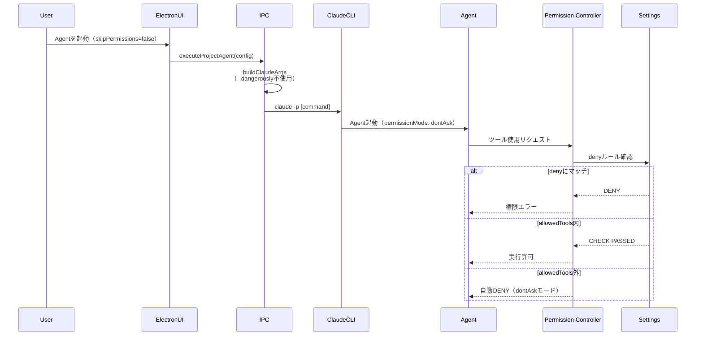
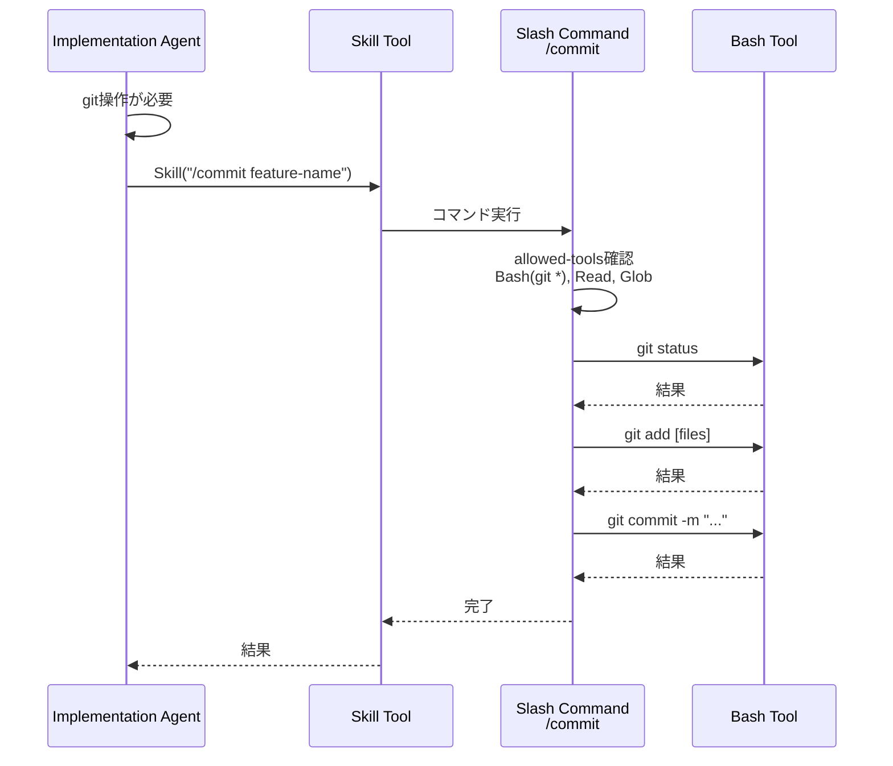

# Design: Permission Control Refactoring

## Overview

本設計は、Claude Codeの`--dangerously-skip-permissions`フラグに依存しない安全なパーミッション制御システムへの移行を実現する。現在、12個のAgentすべてが`bypassPermissions`モードを使用し、Electronアプリも`--dangerously-skip-permissions`フラグを付与しなければ動作しない状態にある。本設計により、`dontAsk` + `tools`フィールドによる明示的制御に移行し、settings.local.jsonの状態に依存しない堅牢な設計を実現する。

**Purpose**: セキュリティリスクを排除し、各Agentに必要最小限のツールアクセスのみを許可することで、全ワークフロー（Requirements/Design/Tasks/Implementation/Inspection/Bug Fix）を安全かつ確実に実行可能にする。

**Users**: SDDワークフローを実行する開発者、QA担当者、システム管理者が対象。

**Impact**: 全Agent定義（12ファイル）、settings.json、Electronアプリ（UIとIPC呼び出し）の変更を伴う。設定後、skipPermissionsフラグなしでの全フェーズ正常動作が保証される。

### Goals

- Agent定義の`permissionMode`を`bypassPermissions`から`dontAsk`に変更し、`tools`フィールドによる明示的制御を実現
- Validation系Agent（validate-design, validate-gap, validate-impl）を読み取り専用に制限
- Requirements/Design/Tasks生成AgentからBashツールを除外
- Implementation/Inspection AgentではBashを直接許可せず、Skillツール経由でSlash Commandsに委譲
- Electronアプリの`Skip Permissions`チェックボックスをデフォルトOFFにし、skipPermissions=falseで全ワークフローが正常動作することを保証
- settings.jsonに最終防衛線としてdenyルールを設定し、危険なコマンド実行をブロック
- settings.local.jsonの状態に依存しない動作を保証

### Non-Goals

- 既存settings.local.jsonの222行のallowルールの削除・書き換え（非依存設計により影響を受けない）
- CLI起動オプションの追加（Agent定義のみで制御）
- Slash Commandsの大幅な再設計（既存のallowed-tools設定を維持）
- Built-in Agent（Explore, Plan等）のカスタマイズ
- MCP Server Modeでの動作保証（CLI直接起動のみが対象）

## Architecture

### Existing Architecture Analysis

**現在のアーキテクチャ**:
- すべてのAgent定義（`.claude/agents/kiro/*.md`）が`permissionMode: bypassPermissions`を使用
- Electronアプリ（`specManagerService.ts`）が`--dangerously-skip-permissions`フラグを`skipPermissions`設定に基づいて付与
- settings.local.jsonに222行のallowルールが存在し、これに依存する動作
- Slash Commands（`.claude/commands/`）は個別に`allowed-tools`を定義しているが、Agentのbypass設定により事実上無効化されている状態

**現在の問題点**:
- Agentが無制限のツールアクセス権を持ち、セキュリティリスクが存在
- settings.local.jsonの状態により動作が不安定
- skipPermissionsフラグOFFでは全フェーズがエラーで停止

**保持すべきパターン**:
- Slash Commandsの`allowed-tools`設定（既に適切に細分化されている）
- IPCハンドラーパターン（`agentHandlers.ts`）
- Agent定義のfrontmatter構造

### Architecture Pattern & Boundary Map

```mermaid
graph TB
    subgraph ElectronApp["Electron App"]
        UI[UI Components]
        IPC[IPC Handlers]
    end

    subgraph AgentLayer["Agent Layer"]
        ValAgents[Validation Agents<br/>Read-only]
        SpecAgents[Spec Gen Agents<br/>No Bash]
        ImplAgents[Impl/Inspect Agents<br/>Skill delegation]
        DebugAgent[Debug Agent<br/>Full access]
    end

    subgraph CommandLayer["Slash Commands Layer"]
        CommitCmd[/commit<br/>Bash git]
        TestFixCmd[/test-fix<br/>Bash npm test]
        SpecInitCmd[/kiro:spec-init<br/>Bash mkdir]
    end

    subgraph ClaudeCLI["Claude CLI"]
        PermissionCtrl[Permission Control<br/>dontAsk mode]
        ToolGate[Tool Gateway]
    end

    subgraph Settings["Settings Layer"]
        SettingsJson[settings.json<br/>deny rules]
        SettingsLocal[settings.local.json<br/>optional]
    end

    UI -->|skipPermissions=false| IPC
    IPC -->|no --dangerously flag| AgentLayer

    ValAgents -->|Read,Grep,Glob only| ToolGate
    SpecAgents -->|Read,Write,Edit,Glob,Web| ToolGate
    ImplAgents -->|Skill tool| CommandLayer
    DebugAgent -->|Bash,MCP tools| ToolGate

    CommandLayer -->|allowed-tools| ToolGate

    ToolGate -->|enforce| PermissionCtrl
    PermissionCtrl -->|check deny first| SettingsJson
    SettingsJson -.->|merge if exists| SettingsLocal
```

**Architecture Integration**:
- **Selected pattern**: Layer-based permission control with defense-in-depth
- **Domain/feature boundaries**:
  - Agent Layer: Agentの種類別にツールアクセス範囲を明確化
  - Command Layer: Slash Commandsが細粒度のツール制御を担当
  - Settings Layer: 最終防衛線としてdenyルール適用
- **Existing patterns preserved**:
  - Agent定義のfrontmatter構造
  - Slash Commandsの`allowed-tools`設定
  - IPCハンドラーパターン
- **New components rationale**:
  - Skill toolによる委譲パターン（Implementation/Inspection AgentがBashを直接使わず、Slash Commands経由で安全に実行）
- **Steering compliance**:
  - DRY: Agent定義の`tools`フィールドで一元管理
  - SSOT: settings.jsonがdenyルールの唯一の真実
  - YAGNI: 既存構造を最大限活用し、不要な新機能を追加しない

### Technology Stack

| Layer | Choice / Version | Role in Feature | Notes |
|-------|------------------|-----------------|-------|
| Agent Definitions | Claude Code Agent Frontmatter | Agent単位のツール制御 | permissionMode: dontAsk + tools指定 |
| Slash Commands | Claude Code Command Frontmatter | コマンド単位のツール制御 | allowed-tools継続使用 |
| Electron App | TypeScript 5.8+ / Electron 35 | UI設定とCLI引数構築 | skipPermissionsフラグ削除 |
| Settings | JSON (settings.json) | 最終防衛線denyルール | deny > ask > allow優先順 |

## System Flows

### Permission Control Flow



**Key Decisions**:
- Electronアプリは`--dangerously-skip-permissions`フラグを付与しない
- Agent定義の`tools`フィールドで許可ツールを明示
- settings.jsonのdenyルールが最優先で適用される
- settings.local.jsonは存在しても無視される（dontAskモードによりallowルール不要）

### Skill Tool Delegation Flow



**Key Decisions**:
- Implementation AgentはBashツールを持たず、Skillツールのみ許可
- Slash Commandsの`allowed-tools`でBash操作を細かく制限（例: `Bash(git *)`）
- Agent自体は安全（Bashアクセスなし）で、必要な操作は制御されたSlash Commands経由で実行

## Requirements Traceability

| Criterion ID | Summary | Components | Implementation Approach |
|--------------|---------|------------|------------------------|
| 1.1 | Agent定義でpermissionMode: dontAsk確認 | 全Agent定義（12ファイル） | 既存bypassPermissionsを全削除・dontAskに変更 |
| 1.2 | toolsフィールドのみ使用可能 | Agent定義frontmatter | 各Agentにtools指定追加 |
| 1.3 | tools外ツール使用時に権限エラー | Claude CLI Permission Controller | Claude Code組み込み機能（実装不要） |
| 1.4 | 全Agent移行完了の検証 | 全Agent定義 | bypassPermissions検索で0件確認 |
| 2.1 | validate-design: Read,Grep,Glob | validate-design.md | tools指定 |
| 2.2 | validate-gap: Read,Grep,Glob,WebSearch,WebFetch | validate-gap.md | tools指定 |
| 2.3 | validate-impl: Read,Grep,Glob,Bash | validate-impl.md | tools指定（Bashはテスト実行に必要） |
| 2.4 | Write/Edit使用時に権限エラー | Permission Controller | dontAskモードで自動deny |
| 3.1 | spec-requirements: Read,Write,Edit,Glob,WebSearch,WebFetch | spec-requirements.md | tools指定（Bashなし） |
| 3.2 | spec-design: Read,Write,Edit,Grep,Glob,WebSearch,WebFetch | spec-design.md | tools指定（Bashなし） |
| 3.3 | spec-tasks: Read,Write,Edit,Glob,Grep | spec-tasks.md | tools指定（Bashなし） |
| 3.4 | Bash使用時に権限エラー | Permission Controller | dontAskモードで自動deny |
| 4.1 | spec-tdd-impl: Read,Write,Edit,MultiEdit,Glob,Grep,Skill | spec-impl.md | tools指定（Bash削除、Skill追加） |
| 4.2 | git操作はSkill経由で/commit実行可能 | /commit.md | 既存allowed-tools: Bash(git *) |
| 4.3 | テスト実行はSkill経由で/test-fix実行可能 | /test-fix.md | 既存allowed-tools: Bash(npm test:*) |
| 4.4 | 直接Bash使用時に権限エラー | Permission Controller | dontAskモードで自動deny |
| 4.5 | Slash Commandのallowed-toolsに従う | Command Permission Controller | Claude Code組み込み機能 |
| 5.1 | spec-inspection: Read,Grep,Glob,Write,Skill,Task | spec-inspection.md | tools指定（Bash削除、Skill/Task追加） |
| 5.2 | ビルド実行はSkill経由 | Skill tool | 新規Slash Command不要（既存で対応可） |
| 5.3 | テスト実行はSkill経由 | Skill tool | /test-fix使用 |
| 5.4 | 直接Bash使用時に権限エラー | Permission Controller | dontAskモードで自動deny |
| 6.1 | steering: Read,Write,Edit,Glob,Grep | steering.md | tools指定（Bashなし） |
| 6.2 | steering-custom: Read,Write,Edit,Glob,Grep | steering-custom.md | tools指定（Bashなし） |
| 6.3 | Bash使用時に権限エラー | Permission Controller | dontAskモードで自動deny |
| 7.1 | debug: Read,Glob,Grep,Bash,MCP tools | debug.md | tools指定（全MCP tool列挙） |
| 7.2 | 許可ツールのみ使用可能 | Permission Controller | dontAskモードで自動制御 |
| 7.3 | 未許可ツール使用時に権限エラー | Permission Controller | dontAskモードで自動deny |
| 8.1 | Slash Commandのallowed-tools維持 | 全Slash Commands（33ファイル） | 変更なし（既存設定を維持） |
| 8.2 | /commit: Bash(git *),Read,Glob | /commit.md | 既存設定維持 |
| 8.3 | /test-fix: Bash(npm test:*),Read,Edit,Glob,Grep,AskUserQuestion | /test-fix.md | 既存設定維持 |
| 8.4 | /kiro:spec-init: Bash(git status),Bash(date:*),Bash(mkdir:*),Read,Write,Glob | /kiro:spec-init.md | 既存設定維持 |
| 8.5 | allowed-tools外使用時に権限エラー | Command Permission Controller | Claude Code組み込み機能 |
| 9.1 | ElectronアプリでSkip Permissions=false（デフォルト） | projectStore.ts, AgentListPanel.tsx | 既存コードでデフォルト値変更 |
| 9.2 | skipPermissions=falseでフラグ不使用 | specManagerService.ts:buildClaudeArgs | 条件分岐修正 |
| 9.3 | skipPermissions=falseで全Phase正常動作 | 全Agent定義 + Electron App | 統合テストで検証 |
| 9.4 | skipPermissions=trueでフラグ付与 | specManagerService.ts:buildClaudeArgs | 後方互換性維持 |
| 10.1 | settings.jsonにdenyルール設定 | .claude/settings.json | permissions.deny配列追加 |
| 10.2 | denyマッチ時に実行ブロック | Permission Controller | Claude Code組み込み機能 |
| 10.3 | deny > ask > allow優先順 | Permission Controller | Claude Code組み込み機能 |
| 11.1 | settings.local.json空で正常動作 | 全Agent定義 | dontAskモードにより不要 |
| 11.2 | settings.local.jsonに222行allowあっても正常動作 | Agent定義のtools優先 | dontAskモードによりallow無視 |
| 11.3 | settings.local.json不存在で正常動作 | Agent定義 + settings.json | dontAskモードにより不要 |
| 11.4 | settings.local.jsonのdenyはマージ | Permission Controller | Claude Code組み込み機能 |
| 12.1 | Requirements生成がskipPermissions=falseで成功 | spec-requirements.md + Electron App | 統合テスト |
| 12.2 | Design生成がskipPermissions=falseで成功 | spec-design.md + Electron App | 統合テスト |
| 12.3 | Tasks生成がskipPermissions=falseで成功 | spec-tasks.md + Electron App | 統合テスト |
| 12.4 | Implementation実行がskipPermissions=falseで成功 | spec-impl.md + Skill tool | 統合テスト |
| 12.5 | Inspection実行がskipPermissions=falseで成功 | spec-inspection.md + Skill tool | 統合テスト |
| 12.6 | 権限エラー時にログ記録と失敗報告 | Agent実行時のエラーハンドリング | 既存ログ機構活用 |

### Coverage Validation Checklist

- [x] Every criterion ID from requirements.md appears in the table above
- [x] Each criterion has specific component names (not generic references)
- [x] Implementation approach distinguishes "reuse existing" vs "new implementation"
- [x] User-facing criteria specify concrete UI components

## Components and Interfaces

| Component | Domain/Layer | Intent | Req Coverage | Key Dependencies (P0/P1) | Contracts |
|-----------|--------------|--------|--------------|--------------------------|-----------|
| Agent Definitions (12 files) | Agent Layer | Agent単位のツール許可制御 | 1.1-1.4, 2.1-2.4, 3.1-3.4, 4.1-4.5, 5.1-5.4, 6.1-6.3, 7.1-7.3 | Claude Code Permission Controller (P0) | Frontmatter |
| Slash Commands (33 files) | Command Layer | コマンド単位のツール許可制御 | 8.1-8.5 | Claude Code Permission Controller (P0) | Frontmatter |
| settings.json | Settings Layer | 最終防衛線denyルール | 10.1-10.3 | Claude Code Permission Controller (P0) | JSON |
| projectStore.ts | Electron Renderer | skipPermissionsデフォルト値管理 | 9.1 | Zustand (P0) | State |
| AgentListPanel.tsx | Electron Renderer | skipPermissionsチェックボックスUI | 9.1 | projectStore (P0) | State |
| specManagerService.ts | Electron Main | Claude CLI引数構築 | 9.2-9.4 | - | Service |

### Agent Layer

#### Agent Definitions (12 files)

| Field | Detail |
|-------|--------|
| Intent | Agent単位でツール使用を制限し、必要最小限のアクセス権のみを付与 |
| Requirements | 1.1, 1.2, 1.3, 1.4, 2.1, 2.2, 2.3, 2.4, 3.1, 3.2, 3.3, 3.4, 4.1, 4.4, 5.1, 5.4, 6.1, 6.2, 6.3, 7.1, 7.2, 7.3 |

**Responsibilities & Constraints**
- Agent定義frontmatterで`permissionMode: dontAsk`を設定
- `tools`フィールドでAgent別に必要なツールを明示
- 各Agentの役割に応じて適切なツールセットを定義
- bypassPermissionsを完全に削除

**Dependencies**
- Outbound: Claude Code Permission Controller - ツール使用許可判定 (P0)

**Contracts**: Frontmatter [x]

##### Frontmatter Structure

```yaml
---
name: agent-name
description: Agent説明
tools: Read, Write, Edit, Glob, Grep  # 許可ツールを列挙
model: inherit
color: purple
permissionMode: dontAsk  # bypassPermissions削除
---
```

**Agent Type Classification and Tool Sets**:

| Agent Type | Agent Names | Tools | Rationale |
|------------|-------------|-------|-----------|
| Validation (Read-only) | validate-design, validate-gap, validate-impl | Read, Grep, Glob, (WebSearch, WebFetch), (Bash) | 検証は読み取り専用。validate-implのみBash許可（テスト実行） |
| Spec Generation (No Bash) | spec-requirements, spec-design, spec-tasks | Read, Write, Edit, Glob, Grep, WebSearch, WebFetch | ドキュメント生成にBash不要 |
| Implementation (Skill delegation) | spec-tdd-impl | Read, Write, Edit, MultiEdit, Glob, Grep, Skill | Bashは直接許可せず、Skill経由でSlash Commands呼び出し |
| Inspection (Skill delegation) | spec-inspection | Read, Grep, Glob, Write, Skill, Task | ビルド・テストはSkill経由 |
| Steering Management (No Bash) | steering, steering-custom | Read, Write, Edit, Glob, Grep | ドキュメント管理にBash不要 |
| Debug (Full access) | debug | Read, Glob, Grep, Bash, mcp__electron__* | デバッグにBashとMCPツールが必要 |

**Implementation Notes**
- Integration: 既存Agent定義のfrontmatterを編集（`.claude/agents/kiro/*.md`）
- Validation: 全Agent定義で`grep -r "bypassPermissions" .claude/agents/kiro/`が0件であることを確認
- Risks: Agent実行中にツール不足が判明する可能性あり（統合テストで事前検証）

### Settings Layer

#### settings.json

| Field | Detail |
|-------|--------|
| Intent | 最終防衛線として危険なコマンド実行をブロック |
| Requirements | 10.1, 10.2, 10.3 |

**Responsibilities & Constraints**
- `permissions.deny`配列に絶対に実行してはいけないコマンドを定義
- deny > ask > allow の優先順位で適用される
- settings.local.jsonのdenyルールとマージされる

**Dependencies**
- Outbound: Claude Code Permission Controller - denyルール適用 (P0)

**Contracts**: JSON [x]

##### JSON Structure

```json
{
  "permissions": {
    "deny": [
      "Bash(rm -rf /)",
      "Bash(rm -rf /*)",
      "Bash(sudo rm:*)",
      "Read(.env)",
      "Read(.env.*)",
      "Write(.env)",
      "Edit(.env)"
    ],
    "additionalDirectories": [
      "/Users/yamamoto/git/sdd-orchestrator/.claude/agents/kiro"
    ]
  }
}
```

**Implementation Notes**
- Integration: `.claude/settings.json`の`permissions.deny`配列を追加
- Validation: Agent実行中にdenyルールが適用されることを手動テストで確認
- Risks: denyルールが過剰だとAgent動作を阻害する可能性（最小限のルールに限定）

### Electron Layer

#### projectStore.ts

| Field | Detail |
|-------|--------|
| Intent | skipPermissionsのデフォルト値をfalseに変更 |
| Requirements | 9.1 |

**Responsibilities & Constraints**
- Zustand storeで`skipPermissions`状態を管理
- デフォルト値をfalseに変更（現在はtrueと推測）
- ユーザーが明示的にONにした場合のみtrueになる

**Dependencies**
- Inbound: AgentListPanel.tsx - チェックボックスUI (P0)
- Outbound: Zustand - 状態管理 (P0)

**Contracts**: State [x]

##### State Management

```typescript
interface ProjectState {
  skipPermissions: boolean; // デフォルト: false
  // ... other state
}

const useProjectStore = create<ProjectState>((set) => ({
  skipPermissions: false, // 変更箇所
  // ... other state
}));
```

**Implementation Notes**
- Integration: `projectStore.ts`のデフォルト値を修正
- Validation: Electronアプリ起動時にチェックボックスがOFFであることを確認
- Risks: 既存ユーザーのローカル設定が上書きされる可能性（electron-storeで永続化されている場合）

#### AgentListPanel.tsx

| Field | Detail |
|-------|--------|
| Intent | Skip PermissionsチェックボックスのUI表示 |
| Requirements | 9.1 |

**Responsibilities & Constraints**
- projectStoreから`skipPermissions`を取得して表示
- ユーザーがチェックボックスを変更したらstoreを更新
- デフォルトOFF状態のUI

**Dependencies**
- Inbound: User interaction - チェックボックス操作 (P0)
- Outbound: projectStore - skipPermissions更新 (P0)

**Contracts**: State [x]

##### State Management

```typescript
const { skipPermissions, setSkipPermissions } = useProjectStore();

<label>
  <input
    type="checkbox"
    checked={skipPermissions}
    onChange={(e) => setSkipPermissions(e.target.checked)}
  />
  Skip Permissions (非推奨)
</label>
```

**Implementation Notes**
- Integration: 既存UIコンポーネントを修正（チェックボックスの初期値がfalseになる）
- Validation: UI表示を目視確認
- Risks: なし（UIのみの変更）

#### specManagerService.ts

| Field | Detail |
|-------|--------|
| Intent | Claude CLI引数構築時に`--dangerously-skip-permissions`フラグの付与を制御 |
| Requirements | 9.2, 9.3, 9.4 |

**Responsibilities & Constraints**
- `buildClaudeArgs`関数で`skipPermissions`オプションに基づいてフラグ付与を決定
- `skipPermissions: false`（デフォルト）の場合、フラグを付与しない
- `skipPermissions: true`の場合のみフラグを付与（後方互換性）

**Dependencies**
- Inbound: IPC Handlers - Agent起動リクエスト (P0)
- Outbound: agentProcess.ts - Claude CLI実行 (P0)

**Contracts**: Service [x]

##### Service Interface

```typescript
interface ClaudeArgsOptions {
  command?: string;
  resumeSessionId?: string;
  resumePrompt?: string;
  allowedTools?: string[];
  skipPermissions?: boolean; // デフォルト: false
}

function buildClaudeArgs(options: ClaudeArgsOptions): string[] {
  const args = [...CLAUDE_CLI_BASE_FLAGS];

  // skipPermissions: trueの場合のみフラグ付与
  if (options.skipPermissions === true) {
    args.push('--dangerously-skip-permissions');
  }

  // ... other arguments

  return args;
}
```

**Implementation Notes**
- Integration: `specManagerService.ts`の`buildClaudeArgs`関数を修正
- Validation:
  - skipPermissions=falseでAgent起動時、`--dangerously-skip-permissions`フラグが含まれないことをログで確認
  - skipPermissions=trueでAgent起動時、フラグが含まれることを確認
- Risks: 既存のskipPermissions=trueに依存する動作がある場合、Agent実行が失敗する可能性（統合テストで事前検証）

## Data Models

本機能はデータモデルの変更を伴わない。既存の設定ファイル（Agent定義、settings.json）とElectronアプリの状態管理（projectStore）の修正のみ。

## Error Handling

### Error Strategy

本機能では、権限エラーがAgent実行時に発生する可能性があるため、エラー検出と報告の仕組みを整備する。

### Error Categories and Responses

**User Errors** (400系相当):
- **ツール使用権限エラー**: Agentが`tools`フィールドに含まれないツールを使用しようとした場合
  - Response: Claude CLIがエラーメッセージを出力し、Agent実行を停止
  - User Guidance: エラーログに「ツール使用が拒否されました」と表示
- **denyルール違反**: settings.jsonのdenyルールにマッチするコマンド実行を試みた場合
  - Response: Claude CLIがエラーメッセージを出力し、実行をブロック
  - User Guidance: エラーログに「このコマンドは禁止されています」と表示

**System Errors** (500系相当):
- **Agent定義読み込みエラー**: frontmatterのYAML構文エラー
  - Response: Claude CLIがAgent起動に失敗
  - Recovery: Agent定義ファイルの構文を修正
- **settings.json読み込みエラー**: JSONパースエラー
  - Response: Claude CLIが設定読み込みに失敗
  - Recovery: settings.jsonの構文を修正

**Recovery Strategy**:
- 権限エラーは設計ミスまたは設定ミスであり、リトライは無意味
- 権限エラー検知時は即座に失敗し、エラー詳細をログに記録
- Agent実行を停止し、ユーザーへエラー通知を表示

**User Notification Strategy**:
- ElectronアプリでAgent実行失敗を検知した場合、Agent実行ログへのリンクを含むエラー通知を表示
- エラー通知には、失敗したツール名と失敗理由を含める
- ユーザーがログファイルを確認できるよう、ログファイルパスを表示

**Log Format**:
- 既存のJSONLフォーマットに準拠し、権限エラーは以下の形式で記録:
  ```json
  {
    "type": "permission_error",
    "tool": "<tool_name>",
    "reason": "<reason>",
    "timestamp": "<ISO 8601 timestamp>"
  }
  ```

**Monitoring**:
- Agent実行ログ（`.kiro/runtime/agents/*/logs/agent-*.log`）に権限エラーを記録
- Electronアプリのログ（`logs/electron-dev.log`）にCLI起動エラーを記録

## Testing Strategy

### Unit Tests

1. **buildClaudeArgs関数のテスト**:
   - `skipPermissions: false`でフラグが含まれないことを確認
   - `skipPermissions: true`でフラグが含まれることを確認
   - `skipPermissions`未指定（undefined）でフラグが含まれないことを確認

2. **projectStoreのデフォルト値テスト**:
   - 初期化時に`skipPermissions`がfalseであることを確認

### Integration Tests

1. **Agent定義の検証**:
   - 全Agent定義ファイルで`permissionMode: dontAsk`が設定されていることを確認
   - 全Agent定義ファイルで`bypassPermissions`が存在しないことを確認
   - 各Agent定義で`tools`フィールドが適切に設定されていることを確認

2. **settings.jsonの検証**:
   - `permissions.deny`配列が存在し、危険なコマンドが含まれていることを確認

3. **Electronアプリの統合テスト**:
   - skipPermissions=falseでAgent起動時、CLIコマンドに`--dangerously-skip-permissions`が含まれないことを確認
   - skipPermissions=trueでAgent起動時、CLIコマンドに`--dangerously-skip-permissions`が含まれることを確認

### E2E Tests

1. **全フェーズの動作確認**:
   - skipPermissions=falseで以下を順次実行し、全て成功することを確認:
     - `/kiro:spec-init "test-permission-control"`
     - `/kiro:spec-requirements test-permission-control`
     - `/kiro:spec-design test-permission-control -y`
     - `/kiro:spec-tasks test-permission-control -y`
     - `/kiro:spec-impl test-permission-control all`（簡易タスク）
     - `/kiro:spec-inspection test-permission-control`

2. **Skill tool委譲の動作確認**:
   - Implementation Agent実行中に`/commit`、`/test-fix`が正常に実行されることを確認
   - Agent自体がBashツールを使用しようとした場合、権限エラーが発生することを確認

3. **denyルールの動作確認**:
   - 手動でdebug agentからdenyルールに該当するコマンド（例: `rm -rf /tmp/test`）を実行し、ブロックされることを確認

## Design Decisions

### DD-001: dontAsk + tools による制御方式の採用

| Field | Detail |
|-------|--------|
| Status | Accepted |
| Context | 現在は全Agentが`bypassPermissions`で無制限アクセス権を持ち、セキュリティリスクとなっている。settings.local.jsonのallowルールに依存する不安定な動作を改善する必要がある。 |
| Decision | Agent定義で`permissionMode: dontAsk` + `tools`フィールドによる明示的制御を採用。 |
| Rationale | - `dontAsk`モードでは`tools`フィールドに含まれないツールは自動的にdenyされる<br/>- settings.local.jsonのallowルールに依存しない（dontAskモードにより不要）<br/>- Agent定義で一元管理可能（DRY原則）<br/>- Claude Codeの標準機能のみで実現可能（追加実装不要） |
| Alternatives Considered | 1. **settings.jsonのallowルールのみで制御**: Agent定義を変更せず、settings.jsonで全パターンを定義<br/>   - 却下理由: 222行のallowルールが必要になり、保守性が極めて低い<br/>2. **CLI起動オプションで制御**: `--allowed-tools`オプションを使用<br/>   - 却下理由: Agent定義とCLI起動オプションの二重管理が発生、一貫性維持が困難<br/>3. **disallowedToolsで制御**: Agent定義で禁止ツールを列挙<br/>   - 却下理由: ホワイトリスト方式（`tools`）の方が安全（デフォルトdeny） |
| Consequences | - メリット: settings.local.jsonの状態に依存しない堅牢な設計<br/>- メリット: Agent定義で一元管理、保守性向上<br/>- デメリット: Agent定義の変更が必要（12ファイル）<br/>- リスク: Agent実行中にツール不足が判明する可能性（統合テストで緩和） |

### DD-002: Implementation/Inspection AgentでのSkill tool委譲

| Field | Detail |
|-------|--------|
| Status | Accepted |
| Context | Implementation AgentとInspection AgentはBash操作（git、npm test、ビルド等）が必要だが、Bashツールを直接許可するとセキュリティリスクが高い。 |
| Decision | これらのAgentには`Bash`ツールを与えず、`Skill`ツールを許可してSlash Commands経由で必要な操作を実行する。 |
| Rationale | - Slash Commandsの`allowed-tools`で細かくBash操作を制限可能（例: `Bash(git *)`）<br/>- Agent自体は安全（Bashアクセスなし）<br/>- 必要な操作は制御されたSlash Commands経由で実行<br/>- 検証により、`tools: Skill`が動作することを確認済み |
| Alternatives Considered | 1. **AgentにBashを許可してLLMに委ねる**: Agent定義で`tools: Bash`を許可し、LLMが適切に使用すると信頼<br/>   - 却下理由: セキュリティリスクが高く、LLMの誤操作を防げない<br/>2. **settings.jsonのdenyで制限**: Bashは許可するが、危険なコマンドをdenyで禁止<br/>   - 却下理由: denyルールが複雑化し、保守性が低下<br/>3. **AgentにBashを与えずSlash Commandsにも委譲しない**: Bash操作を完全に排除<br/>   - 却下理由: git操作やテスト実行が不可能になり、Implementation/Inspectionフェーズが機能しない |
| Consequences | - メリット: Agent自体は安全、Bash操作は制御されたコマンド経由<br/>- メリット: Slash Commandsの既存設計を活用<br/>- デメリット: Skill tool経由の呼び出しがワンクッション入る（パフォーマンス影響は軽微）<br/>- リスク: Slash Commandsが想定外の操作を行う可能性（既存コマンドの品質に依存） |

### DD-003: settings.jsonのdenyルールを最小限に限定

| Field | Detail |
|-------|--------|
| Status | Accepted |
| Context | settings.jsonのdenyルールは最終防衛線として機能するが、過剰に設定するとAgent動作を阻害する可能性がある。 |
| Decision | denyルールは絶対に実行してはいけない危険なコマンドのみに限定する（rm -rf /, sudo rm, .env操作等）。 |
| Rationale | - Agent定義の`tools`フィールドで大部分のツール制限が可能<br/>- denyルールは「最後の砦」として最小限にとどめる<br/>- deny > ask > allowの優先順位により、denyが最優先で適用される<br/>- denyルールが多すぎると保守性が低下 |
| Alternatives Considered | 1. **全危険コマンドを網羅的にdeny**: rm、mv、cp、sudo等、危険性のあるコマンドを全て列挙<br/>   - 却下理由: denyルールが膨大になり、保守不可能<br/>2. **denyルールを設定しない**: Agent定義のみで制御<br/>   - 却下理由: Agent定義のミスや将来の変更によりセキュリティホールが生じる可能性 |
| Consequences | - メリット: 保守性を維持しつつ、最終防衛線を確保<br/>- メリット: Agent動作への影響を最小化<br/>- デメリット: 危険なコマンドを完全に網羅できない可能性<br/>- リスク: Agent定義のミスにより、denyルール外の危険なコマンドが実行される可能性（設計レビューで緩和） |

### DD-004: skipPermissionsフラグの削除ではなくデフォルト変更

| Field | Detail |
|-------|--------|
| Status | Accepted |
| Context | 現在、Electronアプリの「Skip Permissions」チェックボックスがあり、これがOFFだと全ワークフローが動作しない。完全廃止か、デフォルト変更か、判断が必要。 |
| Decision | skipPermissionsフラグ自体は残し、デフォルトをOFFに変更する。 |
| Rationale | - 現状はフラグOFFだと動かない問題があり、改修の目的は「フラグOFFがデフォルトで全ワークフローが正常動作すること」<br/>- 完全廃止すると後方互換性が失われる<br/>- デバッグ目的での一時的な使用を許容（非推奨であることを明示） |
| Alternatives Considered | 1. **skipPermissionsフラグを完全廃止**: UI・IPC・CLIから削除<br/>   - 却下理由: 既存ユーザーが一時的に使用している可能性があり、後方互換性を失う<br/>2. **デバッグ用に残すが、UI非表示**: 内部的には存在するが、UIからは操作不可<br/>   - 却下理由: デバッグ時にUIから切り替えられないと不便 |
| Consequences | - メリット: 後方互換性を維持<br/>- メリット: デバッグ時の一時的な使用を許容<br/>- デメリット: UIに非推奨の設定が残る（ただし、デフォルトOFFで正常動作するため実害なし）<br/>- リスク: ユーザーが誤ってONにする可能性（UIに「非推奨」と明記することで緩和） |

### DD-005: settings.local.json非依存の設計

| Field | Detail |
|-------|--------|
| Status | Accepted |
| Context | 現在、settings.local.jsonに222行のallowルールがあり、これに依存する動作となっている。settings.local.jsonの状態により動作が不安定になる問題を解決する必要がある。 |
| Decision | `dontAsk` + Agent定義の`tools`フィールドで制御することで、settings.local.jsonが空でも、大量のallowがあっても、どちらでも正常動作する設計とする。 |
| Rationale | - `dontAsk`モードでは`tools`フィールドに含まれないツールは自動的にdenyされる（allowルール不要）<br/>- settings.local.jsonのallowルールは無視される（dontAskモードにより）<br/>- settings.local.jsonのdenyルールはsettings.jsonとマージされる（最終防衛線として機能） |
| Alternatives Considered | 1. **settings.local.jsonを削除**: 222行のallowルールを削除<br/>   - 却下理由: 削除しなくても動作に影響しない（非依存設計により）<br/>2. **settings.local.jsonのallowをdenyに書き換え**: allowを全てコメントアウトし、denyルールのみ追加<br/>   - 却下理由: settings.local.jsonを変更しなくても動作するため不要 |
| Consequences | - メリット: settings.local.jsonの状態に関わらず一貫した動作<br/>- メリット: 既存のsettings.local.jsonを削除・変更する必要なし<br/>- デメリット: なし<br/>- リスク: なし |

## Integration & Deprecation Strategy

### Existing Files Requiring Modification (Wiring Points)

以下のファイルを変更して、新しいパーミッション制御を統合する:

| ファイルパス | 変更内容 | 理由 |
|-------------|---------|------|
| `.claude/agents/kiro/spec-requirements.md` | `permissionMode: bypassPermissions`を削除、`dontAsk`に変更。`tools: Read, Write, Edit, Glob, WebSearch, WebFetch`を追加 | 1.1, 3.1 |
| `.claude/agents/kiro/spec-design.md` | 同上。`tools: Read, Write, Edit, Grep, Glob, WebSearch, WebFetch`を追加 | 1.1, 3.2 |
| `.claude/agents/kiro/spec-tasks.md` | 同上。`tools: Read, Write, Edit, Glob, Grep`を追加 | 1.1, 3.3 |
| `.claude/agents/kiro/spec-impl.md` | 同上。`tools: Read, Write, Edit, MultiEdit, Glob, Grep, Skill`を追加（Bash削除） | 1.1, 4.1 |
| `.claude/agents/kiro/spec-inspection.md` | 同上。`tools: Read, Grep, Glob, Write, Skill, Task`を追加（Bash削除） | 1.1, 5.1 |
| `.claude/agents/kiro/validate-design.md` | 同上。`tools: Read, Grep, Glob`を追加 | 1.1, 2.1 |
| `.claude/agents/kiro/validate-gap.md` | 同上。`tools: Read, Grep, Glob, WebSearch, WebFetch`を追加 | 1.1, 2.2 |
| `.claude/agents/kiro/validate-impl.md` | 同上。`tools: Read, Grep, Glob, Bash`を追加 | 1.1, 2.3 |
| `.claude/agents/kiro/steering.md` | 同上。`tools: Read, Write, Edit, Glob, Grep`を追加 | 1.1, 6.1 |
| `.claude/agents/kiro/steering-custom.md` | 同上。`tools: Read, Write, Edit, Glob, Grep`を追加 | 1.1, 6.2 |
| `.claude/agents/kiro/steering-verification.md` | 同上。tools指定追加（内容は実際のAgent役割に応じて決定） | 1.1 |
| `.claude/agents/debug.md` | 同上。`tools: Read, Glob, Grep, Bash, mcp__electron__get_electron_window_info, mcp__electron__take_screenshot, mcp__electron__send_command_to_electron, mcp__electron__read_electron_logs`を追加 | 1.1, 7.1 |
| `.claude/settings.json` | `permissions.deny`配列を追加（危険なコマンドを列挙） | 10.1 |
| `electron-sdd-manager/src/renderer/stores/projectStore.ts` | `skipPermissions`のデフォルト値をfalseに変更 | 9.1 |
| `electron-sdd-manager/src/renderer/components/AgentListPanel.tsx` | Skip Permissionsチェックボックスのラベルに「(非推奨)」を追加 | 9.1 |
| `electron-sdd-manager/src/main/services/specManagerService.ts` | `buildClaudeArgs`関数で`skipPermissions: false`の場合にフラグを付与しないように変更 | 9.2, 9.3, 9.4 |

### Existing Files to be Deleted (Cleanup)

**削除対象ファイル: なし**

本機能は既存ファイルの修正のみで実現可能。削除が必要なファイルは存在しない。

### Replacement vs. Parallel Creation

**置き換え方式**:
- Agent定義ファイル（12ファイル）: 既存ファイルを直接編集（frontmatterのみ変更、本文は変更なし）
- settings.json: 既存ファイルに`permissions.deny`配列を追加
- projectStore.ts: 既存ファイルのデフォルト値を変更
- AgentListPanel.tsx: 既存ファイルのUIラベルを変更
- specManagerService.ts: 既存ファイルの条件分岐を変更

**並行作成: なし**

すべて既存ファイルの編集であり、新規ファイルの作成は不要。

## Interface Changes & Impact Analysis

本機能では、既存のpublicインターフェース（関数のシグネチャ、API）に変更はない。以下の内部実装のみが変更される:

### Internal Implementation Changes

| Component | Change Type | Modification | Impact |
|-----------|-------------|--------------|--------|
| `buildClaudeArgs` | Implementation | `skipPermissions: false`の場合にフラグを付与しない条件分岐を追加 | **Callersへの影響なし**（デフォルト動作が変わるが、シグネチャは不変） |
| `projectStore` | State default value | `skipPermissions`のデフォルト値をfalseに変更 | **Callersへの影響なし**（UIがデフォルト値を読み取るだけ） |
| `AgentListPanel` | UI label | チェックボックスラベルに「(非推奨)」を追加 | **Callersへの影響なし**（表示のみの変更） |

### No Public Interface Changes

- `buildClaudeArgs`の関数シグネチャは不変（`ClaudeArgsOptions`の型定義も変更なし）
- IPCハンドラーのインターフェースは不変
- Agent定義のfrontmatter構造は既存の仕様に準拠（`tools`フィールドは既存機能）

**結論**: 既存のCaller（呼び出し側）への影響はなく、インターフェース変更に伴うタスクは不要。

## Integration Test Strategy

本機能は複数のレイヤー（Agent定義、Electron App、Claude CLI）にまたがるため、統合テストで以下を検証する。

**Components**: Agent Layer, Electron Main Process, Claude CLI, Settings Layer

**Data Flow**:
1. Electronアプリから`skipPermissions=false`でAgent起動リクエスト
2. IPCハンドラーが`buildClaudeArgs`を呼び出し、CLI引数を構築（`--dangerously-skip-permissions`フラグなし）
3. Claude CLIがAgent定義を読み込み、`permissionMode: dontAsk` + `tools`フィールドを適用
4. Agentがツール使用時、Permission Controllerが`tools`フィールドとsettings.jsonのdenyルールを確認
5. 許可されたツールのみ実行可能、それ以外は自動deny

**Mock Boundaries**:
- **Mock対象**: なし（実際のElectronアプリとClaude CLIを使用）
- **Real Implementation**: 全レイヤーで実機動作を検証

**Verification Points**:
- `buildClaudeArgs`から返されるCLI引数配列に`--dangerously-skip-permissions`が含まれないこと
- Agent実行ログに権限エラーが記録されないこと
- 全フェーズ（Requirements/Design/Tasks/Implementation/Inspection）が正常完了すること
- Skill tool経由でSlash Commandsが正常実行されること（`/commit`, `/test-fix`）

**Robustness Strategy**:
- **Agent実行の非同期性**: Agent実行完了を`waitFor`パターンで待機（固定sleepは使用しない）
- **ログ監視**: Agent実行中にリアルタイムでログを監視し、権限エラーの有無を確認
- **Retry不要**: Agent実行は決定的（同じ入力で同じ結果）、リトライ不要

**Prerequisites**:
- Electronアプリがバックグラウンドで起動していること（`task electron:start`）
- テスト用Specが存在すること（`/kiro:spec-init "test-permission-control"`）
- Agent実行ログが`.kiro/runtime/agents/`に保存されること

## Supporting References

なし（全ての設計情報は本ドキュメントに記載）
