# Technical Design: handlers.ts ドメイン分割リファクタリング

## Overview

**Purpose**: `handlers.ts`（3,300行超）をドメイン別ファイルに分割し、コードベースの保守性・可読性・テスタビリティを向上させる。

**Users**: 開発者がIPCハンドラーを追加・修正・テストする際の作業効率が向上する。

**Impact**: 既存の`handlers.ts`を7つのドメインハンドラーファイルに分割し、オーケストレーターとして再構成する。既存の`*Handlers.ts`パターン（`scheduleTaskHandlers.ts`, `mcpHandlers.ts`等）を踏襲する。

### Goals

- `handlers.ts`の95個のIPCハンドラーを機能ドメイン別に分割
- 既存パターンに準拠した`register*Handlers(dependencies)`形式の採用
- 後方互換性を維持した公開関数のre-export
- 段階的移行によるデグレリスク最小化

### Non-Goals

- `index.test.ts`のテスト分割（本Specの範囲外、後続Specで対応）
- `channels.ts`のドメイン別分割（現状のグループ化コメントで十分）
- Remote UI側（`webSocketHandler.ts`）の変更
- 新機能の追加（純粋なリファクタリングのみ）

## Architecture

### Existing Architecture Analysis

**Current State**:
- `handlers.ts`は95個のIPCハンドラーと複数のヘルパー関数を含む巨大ファイル
- 既に分割済みのハンドラー: `autoExecutionHandlers.ts`, `bugAutoExecutionHandlers.ts`, `cloudflareHandlers.ts`, `mcpHandlers.ts`, `metricsHandlers.ts`, `scheduleTaskHandlers.ts`, `sshHandlers.ts`, `worktreeHandlers.ts`等
- サービスインスタンスは`handlers.ts`のモジュールスコープで生成
- 公開関数（`getCurrentProjectPath`, `selectProject`等）は他モジュールから参照される

**Existing Patterns to Follow**:
- `register*Handlers(dependencies)`: 依存サービスを引数で受け取る登録関数
- モジュールスコープの状態変数とシングルトンサービス
- `ipcMain.handle()`による非同期ハンドラー登録
- テストファイルの同ディレクトリ配置（co-location）

### Architecture Pattern & Boundary Map

```mermaid
graph TB
    subgraph Main["handlers.ts (Orchestrator)"]
        Services[Service Instances]
        GlobalState[Global State]
        RegisterAll[registerIpcHandlers]
    end

    subgraph Handlers["Domain Handlers"]
        ConfigH[configHandlers.ts]
        InstallH[installHandlers.ts]
        FileH[fileHandlers.ts]
        ProjectH[projectHandlers.ts]
        SpecH[specHandlers.ts]
        BugH[bugHandlers.ts]
        AgentH[agentHandlers.ts]
    end

    subgraph Existing["Existing Split Handlers"]
        AutoExec[autoExecutionHandlers.ts]
        BugAutoExec[bugAutoExecutionHandlers.ts]
        CloudflareH[cloudflareHandlers.ts]
        McpH[mcpHandlers.ts]
        MetricsH[metricsHandlers.ts]
        ScheduleH[scheduleTaskHandlers.ts]
        SshH[sshHandlers.ts]
        WorktreeH[worktreeHandlers.ts]
    end

    RegisterAll --> ConfigH
    RegisterAll --> InstallH
    RegisterAll --> FileH
    RegisterAll --> ProjectH
    RegisterAll --> SpecH
    RegisterAll --> BugH
    RegisterAll --> AgentH
    RegisterAll --> AutoExec
    RegisterAll --> BugAutoExec
    RegisterAll --> CloudflareH
    RegisterAll --> McpH
    RegisterAll --> MetricsH
    RegisterAll --> ScheduleH
    RegisterAll --> SshH
    RegisterAll --> WorktreeH

    Services --> ConfigH
    Services --> InstallH
    Services --> FileH
    Services --> ProjectH
    Services --> SpecH
    Services --> BugH
    Services --> AgentH
```



**Architecture Integration**:
- **Selected pattern**: Domain-based handler separation with DI
- **Domain boundaries**: 各ドメインハンドラーは単一責任を持ち、必要なサービスのみを依存として受け取る
- **Existing patterns preserved**: `register*Handlers`パターン、co-location、モジュールスコープ状態
- **Steering compliance**: DRY, KISS, 関心の分離原則を遵守

### Technology Stack

| Layer | Choice / Version | Role in Feature | Notes |
|-------|------------------|-----------------|-------|
| Backend / Services | TypeScript 5.8+ / Electron 35 | IPCハンドラー実装 | 既存スタックを継続使用 |
| Testing | Vitest | ユニットテスト | 既存テストパターンを踏襲 |

## Requirements Traceability

| Criterion ID | Summary | Components | Implementation Approach |
|--------------|---------|------------|------------------------|
| 1.1 | Config関連ハンドラー分離 | configHandlers.ts | 新規作成、handlers.tsから移行 |
| 1.2 | Install関連ハンドラー分離 | installHandlers.ts | 新規作成、handlers.tsから移行 |
| 1.3 | File関連ハンドラー分離 | fileHandlers.ts | 新規作成、handlers.tsから移行 |
| 1.4 | Project関連ハンドラー分離 | projectHandlers.ts | 新規作成、handlers.tsから移行 |
| 1.5 | Spec関連ハンドラー分離 | specHandlers.ts | 新規作成、handlers.tsから移行 |
| 1.6 | Bug関連ハンドラー分離 | bugHandlers.ts | 新規作成、handlers.tsから移行 |
| 1.7 | Agent関連ハンドラー分離 | agentHandlers.ts | 新規作成、handlers.tsから移行 |
| 2.1 | register*Handlers形式での依存注入 | 全ドメインハンドラー | 既存パターン踏襲 |
| 2.2 | サービス引数受け取り | 全ドメインハンドラー | DI pattern |
| 2.3 | モックサービス注入可能 | 全ドメインハンドラー | テスト容易性確保 |
| 3.1 | handlers.tsのオーケストレーター化 | handlers.ts | 既存コード変更 |
| 3.2 | registerIpcHandlers内での全ハンドラー登録 | handlers.ts | register関数呼び出し集約 |
| 3.3 | 新ドメインハンドラー統合容易性 | handlers.ts | import + 呼び出しのみ |
| 4.1 | 既存ファイル命名規則準拠 | 全新規ファイル | *Handlers.ts形式 |
| 4.2 | register関数シグネチャ統一 | 全ドメインハンドラー | 既存パターン参照 |
| 4.3 | テストファイル命名規則 | 全テストファイル | *Handlers.test.ts形式 |
| 5.1 | 段階的移行順序 | 全ドメインハンドラー | config→install→file→project→spec→bug→agent |
| 5.2 | 既存テスト通過確認 | 全フェーズ | 各ドメイン移行後に検証 |
| 5.3 | ビルド・型チェック成功 | 移行完了時 | npm run build && npm run typecheck |
| 6.1 | 公開関数のre-export維持 | handlers.ts | 後方互換性確保 |
| 6.2 | 関数移動時のre-export | handlers.ts, projectHandlers.ts | 呼び出し元影響なし |

## Components and Interfaces

| Component | Domain/Layer | Intent | Req Coverage | Key Dependencies | Contracts |
|-----------|--------------|--------|--------------|------------------|-----------|
| handlers.ts | IPC/Orchestrator | ドメインハンドラーの登録とDI管理 | 3.1, 3.2, 3.3, 6.1, 6.2 | All services | Service |
| configHandlers.ts | IPC/Config | 設定関連IPCハンドラー | 1.1, 2.1, 2.2, 2.3, 4.1, 4.2 | ConfigStore, LayoutConfigService | Service |
| installHandlers.ts | IPC/Install | インストール関連IPCハンドラー | 1.2, 2.1, 2.2, 2.3, 4.1, 4.2 | CommandInstallerService, ProjectChecker | Service |
| fileHandlers.ts | IPC/File | ファイル操作関連IPCハンドラー | 1.3, 2.1, 2.2, 2.3, 4.1, 4.2 | FileService | Service |
| projectHandlers.ts | IPC/Project | プロジェクト管理関連IPCハンドラー | 1.4, 2.1, 2.2, 2.3, 4.1, 4.2, 6.2 | FileService, ConfigStore, BugService | Service |
| specHandlers.ts | IPC/Spec | Spec関連IPCハンドラー | 1.5, 2.1, 2.2, 2.3, 4.1, 4.2 | FileService, SpecManagerService, DocumentReviewService | Service |
| bugHandlers.ts | IPC/Bug | Bug関連IPCハンドラー | 1.6, 2.1, 2.2, 2.3, 4.1, 4.2 | BugService, FileService | Service |
| agentHandlers.ts | IPC/Agent | Agent関連IPCハンドラー | 1.7, 2.1, 2.2, 2.3, 4.1, 4.2 | SpecManagerService, LogFileService, AgentRecordService | Service |

### IPC Orchestrator Layer

#### handlers.ts (Refactored)

| Field | Detail |
|-------|--------|
| Intent | 全ドメインハンドラーの登録オーケストレーションとグローバル状態管理 |
| Requirements | 3.1, 3.2, 3.3, 6.1, 6.2 |

**Responsibilities & Constraints**
- サービスインスタンスの生成（DI）
- 各`register*Handlers()`関数の呼び出し
- グローバル状態の管理（`currentProjectPath`, `specManagerService`等）
- 公開関数のre-export（後方互換性維持）

**Dependencies**
- Inbound: main.ts (P0)
- Outbound: All domain handlers, All services (P0)

**Contracts**: Service [x]

##### Service Interface
```typescript
// 公開関数（後方互換性維持のためre-export）
export function getCurrentProjectPath(): string | null;
export function getAutoExecutionCoordinator(): AutoExecutionCoordinator;
export function selectProject(projectPath: string): Promise<SelectProjectResult>;
export function setProjectPath(projectPath: string): Promise<void>;
export function setInitialProjectPath(path: string | null): void;
export function getInitialProjectPath(): string | null;
export function getBugAgentEffectiveCwd(phase: BugWorkflowPhase, worktreeCwd: string, projectPath: string): string;
export function isProjectSelectionInProgress(): boolean;
export function validateProjectPath(projectPath: string): Promise<Result<string, SelectProjectError>>;

// 登録関数
export function registerIpcHandlers(): void;
```

**Implementation Notes**
- 移行後のhandlers.tsは約200-300行に縮小
- 各ドメインハンドラーへの依存サービス注入ロジックを集約
- イベントコールバック登録ロジックは維持（agents向け）

### Domain Handler Layer

#### configHandlers.ts

| Field | Detail |
|-------|--------|
| Intent | 設定関連（hang threshold, layout, skip permissions, project defaults, profile）のIPCハンドラー |
| Requirements | 1.1, 2.1, 2.2, 2.3, 4.1, 4.2 |

**Responsibilities & Constraints**
- GET_HANG_THRESHOLD, SET_HANG_THRESHOLD
- LOAD_LAYOUT_CONFIG, SAVE_LAYOUT_CONFIG, RESET_LAYOUT_CONFIG
- LOAD_SKIP_PERMISSIONS, SAVE_SKIP_PERMISSIONS
- LOAD_PROJECT_DEFAULTS, SAVE_PROJECT_DEFAULTS
- LOAD_PROFILE

**Dependencies**
- Inbound: handlers.ts (P0)
- Outbound: ConfigStore (P0), LayoutConfigService (P0)

**Contracts**: Service [x]

##### Service Interface
```typescript
interface ConfigHandlersDependencies {
  configStore: ConfigStore;
  layoutConfigService: LayoutConfigService;
}

export function registerConfigHandlers(deps: ConfigHandlersDependencies): void;
```

---

#### installHandlers.ts

| Field | Detail |
|-------|--------|
| Intent | インストール関連（spec-manager, CLAUDE.md, cc-sdd workflow, commandset, experimental tools, CLI）のIPCハンドラー |
| Requirements | 1.2, 2.1, 2.2, 2.3, 4.1, 4.2 |

**Responsibilities & Constraints**
- CHECK_SPEC_MANAGER_FILES, INSTALL_SPEC_MANAGER_*
- CHECK_CLAUDE_MD_EXISTS, INSTALL_CLAUDE_MD
- CHECK_CC_SDD_WORKFLOW_STATUS, INSTALL_CC_SDD_WORKFLOW
- CHECK_COMMANDSET_STATUS, INSTALL_COMMANDSET_BY_PROFILE
- CHECK_AGENT_FOLDER_EXISTS, DELETE_AGENT_FOLDER
- INSTALL_EXPERIMENTAL_*, CHECK_EXPERIMENTAL_*
- GET_CLI_INSTALL_STATUS, INSTALL_CLI_COMMAND
- CHECK_COMMANDSET_VERSIONS, CONFIRM_COMMON_COMMANDS

**Dependencies**
- Inbound: handlers.ts (P0)
- Outbound: CommandInstallerService, ProjectChecker, CcSddWorkflowInstaller, UnifiedCommandsetInstaller, ExperimentalToolsInstallerService, CommandsetVersionService (P0)

**Contracts**: Service [x]

##### Service Interface
```typescript
interface InstallHandlersDependencies {
  commandInstallerService: CommandInstallerService;
  projectChecker: ProjectChecker;
  ccSddWorkflowInstaller: CcSddWorkflowInstaller;
  unifiedCommandsetInstaller: UnifiedCommandsetInstaller;
  experimentalToolsInstaller: ExperimentalToolsInstallerService;
  commandsetVersionService: CommandsetVersionService;
}

export function registerInstallHandlers(deps: InstallHandlersDependencies): void;
```

---

#### fileHandlers.ts

| Field | Detail |
|-------|--------|
| Intent | ファイル操作関連（ダイアログ、読み書き、VSCode連携）のIPCハンドラー |
| Requirements | 1.3, 2.1, 2.2, 2.3, 4.1, 4.2 |

**Responsibilities & Constraints**
- SHOW_OPEN_DIALOG
- READ_ARTIFACT, WRITE_ARTIFACT, WRITE_FILE
- OPEN_IN_VSCODE

**Dependencies**
- Inbound: handlers.ts (P0)
- Outbound: FileService (P0), dialog (Electron API) (P0)

**Contracts**: Service [x]

##### Service Interface
```typescript
interface FileHandlersDependencies {
  fileService: FileService;
  getCurrentProjectPath: () => string | null;
}

export function registerFileHandlers(deps: FileHandlersDependencies): void;
```

---

#### projectHandlers.ts

| Field | Detail |
|-------|--------|
| Intent | プロジェクト管理関連（選択、検証、パス操作、アプリ情報）のIPCハンドラー |
| Requirements | 1.4, 2.1, 2.2, 2.3, 4.1, 4.2, 6.2 |

**Responsibilities & Constraints**
- VALIDATE_KIRO_DIRECTORY, SET_PROJECT_PATH
- SELECT_PROJECT, GET_RECENT_PROJECTS, ADD_RECENT_PROJECT
- GET_APP_VERSION, GET_PLATFORM, GET_INITIAL_PROJECT_PATH
- CREATE_NEW_WINDOW, GET_WINDOW_PROJECT, SET_WINDOW_PROJECT
- GET_IS_E2E_TEST, SET_MOCK_ENV
- GET_PROJECT_LOG_PATH, OPEN_LOG_IN_BROWSER
- ADD_SHELL_PERMISSIONS, ADD_MISSING_PERMISSIONS, CHECK_REQUIRED_PERMISSIONS

**Dependencies**
- Inbound: handlers.ts (P0)
- Outbound: FileService (P0), ConfigStore (P0), ProjectLogger (P0), PermissionsService (P1)

**Contracts**: Service [x]

##### Service Interface
```typescript
interface ProjectHandlersDependencies {
  fileService: FileService;
  configStore: ConfigStore;
  getCurrentProjectPath: () => string | null;
  setProjectPath: (path: string) => Promise<void>;
  selectProject: (path: string) => Promise<SelectProjectResult>;
  getInitialProjectPath: () => string | null;
}

// 移動される関数（handlers.tsからre-export維持）
export function validateProjectPath(projectPath: string): Promise<Result<string, SelectProjectError>>;
export function isProjectSelectionInProgress(): boolean;

export function registerProjectHandlers(deps: ProjectHandlersDependencies): void;
```

---

#### specHandlers.ts

| Field | Detail |
|-------|--------|
| Intent | Spec関連（CRUD、フェーズ実行、ドキュメントレビュー、Inspection、Watcher）のIPCハンドラー |
| Requirements | 1.5, 2.1, 2.2, 2.3, 4.1, 4.2 |

**Responsibilities & Constraints**
- READ_SPECS, READ_SPEC_JSON, CREATE_SPEC
- UPDATE_APPROVAL, UPDATE_SPEC_JSON, SYNC_SPEC_PHASE
- START_SPECS_WATCHER, STOP_SPECS_WATCHER
- EXECUTE_SPEC_INIT, EXECUTE_SPEC_PLAN, EXECUTE
- EXECUTE_DOCUMENT_REVIEW*, APPROVE_DOCUMENT_REVIEW, SKIP_DOCUMENT_REVIEW
- EXECUTE_INSPECTION*, SET_INSPECTION_AUTO_EXECUTION_FLAG
- EXECUTE_ASK_PROJECT, EXECUTE_ASK_SPEC
- EXECUTE_SPEC_MERGE
- WORKTREE_IMPL_START, NORMAL_MODE_IMPL_START, START_IMPL
- SYNC_DOCUMENT_REVIEW
- EVENT_LOG_GET, PARSE_TASKS_FOR_PARALLEL

**Dependencies**
- Inbound: handlers.ts (P0)
- Outbound: FileService (P0), SpecManagerService (P0), DocumentReviewService (P1), SpecsWatcherService (P1), MetricsService (P1), EventLogService (P1)

**Contracts**: Service [x]

##### Service Interface
```typescript
interface SpecHandlersDependencies {
  fileService: FileService;
  getSpecManagerService: () => SpecManagerService;
  getCurrentProjectPath: () => string | null;
  getEventCallbacksRegistered: () => boolean;
  setEventCallbacksRegistered: (value: boolean) => void;
  registerEventCallbacks: (service: SpecManagerService, window: BrowserWindow) => void;
}

export function registerSpecHandlers(deps: SpecHandlersDependencies): void;

// Watcher関連（状態管理が必要なため別関数）
export function startSpecsWatcher(window: BrowserWindow): Promise<void>;
export function stopSpecsWatcher(): Promise<void>;
```

---

#### bugHandlers.ts

| Field | Detail |
|-------|--------|
| Intent | Bug関連（一覧、詳細、Watcher、フェーズ更新）のIPCハンドラー |
| Requirements | 1.6, 2.1, 2.2, 2.3, 4.1, 4.2 |

**Responsibilities & Constraints**
- READ_BUGS, READ_BUG_DETAIL
- START_BUGS_WATCHER, STOP_BUGS_WATCHER
- EXECUTE_BUG_CREATE
- BUG_PHASE_UPDATE

**Dependencies**
- Inbound: handlers.ts (P0)
- Outbound: BugService (P0), FileService (P0), BugsWatcherService (P1)

**Contracts**: Service [x]

##### Service Interface
```typescript
interface BugHandlersDependencies {
  bugService: BugService;
  fileService: FileService;
  getCurrentProjectPath: () => string | null;
  getSpecManagerService: () => SpecManagerService;
  registerEventCallbacks: (service: SpecManagerService, window: BrowserWindow) => void;
  getEventCallbacksRegistered: () => boolean;
  setEventCallbacksRegistered: (value: boolean) => void;
}

export function registerBugHandlers(deps: BugHandlersDependencies): void;

// Watcher関連
export function startBugsWatcher(window: BrowserWindow): Promise<void>;
export function stopBugsWatcher(): Promise<void>;
```

---

#### agentHandlers.ts

| Field | Detail |
|-------|--------|
| Intent | Agent関連（起動、停止、再開、削除、ログ取得）のIPCハンドラー |
| Requirements | 1.7, 2.1, 2.2, 2.3, 4.1, 4.2 |

**Responsibilities & Constraints**
- START_AGENT, STOP_AGENT, RESUME_AGENT, DELETE_AGENT
- GET_AGENTS, GET_ALL_AGENTS
- SEND_AGENT_INPUT, GET_AGENT_LOGS
- SWITCH_AGENT_WATCH_SCOPE, GET_RUNNING_AGENT_COUNTS

**Dependencies**
- Inbound: handlers.ts (P0)
- Outbound: SpecManagerService (P0), LogFileService (P0), AgentRecordService (P0), AgentRecordWatcherService (P1)

**Contracts**: Service [x]

##### Service Interface
```typescript
interface AgentHandlersDependencies {
  getSpecManagerService: () => SpecManagerService;
  getEventCallbacksRegistered: () => boolean;
  setEventCallbacksRegistered: (value: boolean) => void;
  registerEventCallbacks: (service: SpecManagerService, window: BrowserWindow) => void;
}

export function registerAgentHandlers(deps: AgentHandlersDependencies): void;

// Watcher関連
export function startAgentRecordWatcher(window: BrowserWindow): void;
export function stopAgentRecordWatcher(): Promise<void>;
```

## Data Models

### Domain Model

本リファクタリングはデータモデルの変更を伴わない。既存の型定義（`SpecInfo`, `BugInfo`, `AgentInfo`等）をそのまま使用する。

### Logical Data Model

**Dependencies Interface Pattern**:

各ドメインハンドラーは`*HandlersDependencies`インターフェースで依存を明示する。

```typescript
// 共通パターン
interface [Domain]HandlersDependencies {
  // 必須サービス
  requiredService: ServiceType;
  // 状態アクセス関数
  getState: () => StateType;
  setState: (value: StateType) => void;
}
```

## Error Handling

### Error Strategy

既存のエラーハンドリングパターンを継続使用：
- IPCハンドラー内での`try-catch`
- Result型（`{ ok: true; value: T } | { ok: false; error: E }`）
- `getErrorMessage()`によるユーザーフレンドリーなエラーメッセージ変換

### Monitoring

- 既存の`logger`を継続使用
- ハンドラー呼び出し時のログ出力パターンを維持

## Testing Strategy

### Unit Tests

- `configHandlers.test.ts`: 設定読み書きのモック検証
- `installHandlers.test.ts`: インストール処理のモック検証
- `fileHandlers.test.ts`: ファイル操作のモック検証
- `projectHandlers.test.ts`: プロジェクト選択・検証のモック検証
- `specHandlers.test.ts`: Spec操作のモック検証
- `bugHandlers.test.ts`: Bug操作のモック検証
- `agentHandlers.test.ts`: Agent操作のモック検証

### Integration Tests

- 各ドメイン移行後の既存E2Eテスト通過確認
- `npm run build && npm run typecheck`による型安全性検証

## Design Decisions

### DD-001: ドメインハンドラーの分割粒度

| Field | Detail |
|-------|--------|
| Status | Accepted |
| Context | handlers.tsの3,300行を分割する際、どの粒度で分割するか |
| Decision | 7つのドメイン（Config, Install, File, Project, Spec, Bug, Agent）に分割 |
| Rationale | requirements.mdのDecision Logで決定済み。既存の`mcpHandlers.ts`等と同程度の粒度を維持しつつ、論理的なドメイン境界で分割 |
| Alternatives Considered | 1) より細かい分割（例: specExecutionHandlers.ts）、2) より粗い分割（3-4ファイル） |
| Consequences | specHandlers.tsとbugHandlers.tsは比較的大きくなる可能性があるが、さらなる分割は後続Specで検討可能 |

### DD-002: 依存注入パターンの採用

| Field | Detail |
|-------|--------|
| Status | Accepted |
| Context | 各ハンドラーファイルがサービスをどのように取得するか |
| Decision | `register*Handlers(dependencies)`形式で依存サービスを引数で受け取る |
| Rationale | 既存の`scheduleTaskHandlers.ts`がこのパターンを採用しており、テスタビリティ向上と結合度低減に有効 |
| Alternatives Considered | 1) 各ファイルで直接import、2) グローバルサービスレジストリ |
| Consequences | handlers.tsがDI管理の責務を持つが、各ドメインハンドラーは単体テストが容易になる |

### DD-003: グローバル状態の管理場所

| Field | Detail |
|-------|--------|
| Status | Accepted |
| Context | `currentProjectPath`, `specManagerService`等のグローバル状態をどこで管理するか |
| Decision | handlers.ts（オーケストレーター）で管理し、getter/setter関数経由でアクセス |
| Rationale | 状態管理を一箇所に集約することで、複数ウィンドウ/Remote UI間での整合性を維持。Electron Process Boundary Rulesに準拠 |
| Alternatives Considered | 1) 各ドメインハンドラーで分散管理、2) 専用StateManagerクラス |
| Consequences | handlers.tsの責務は「状態管理」と「ハンドラー登録オーケストレーション」の2つに限定される |

### DD-004: 段階的移行アプローチ

| Field | Detail |
|-------|--------|
| Status | Accepted |
| Context | Big Bang（一度に全分割）vs Incremental（段階的） |
| Decision | Incremental - 依存少ないドメインから順次移行 |
| Rationale | デグレリスク最小化。移行順序: config→install→file→project→spec→bug→agent |
| Alternatives Considered | Big Bang（全ファイル同時作成） |
| Consequences | 移行期間中は一時的にhandlers.tsと新ファイルが共存するが、各段階でテスト検証可能 |

### DD-005: 公開関数の後方互換性維持

| Field | Detail |
|-------|--------|
| Status | Accepted |
| Context | `getCurrentProjectPath()`等の公開関数を別ファイルに移動するか |
| Decision | 関数の実装場所を変更する場合も、handlers.tsからre-exportして後方互換性を維持 |
| Rationale | 既存の呼び出し元（main.ts, 他のハンドラーファイル）への影響を最小化 |
| Alternatives Considered | 全呼び出し元を更新して直接importに変更 |
| Consequences | handlers.tsに若干のre-export文が残るが、呼び出し元の変更不要 |

## Integration & Deprecation Strategy

### 既存ファイルの修正（Wiring Points）

| File | Modification | Reason |
|------|--------------|--------|
| `electron-sdd-manager/src/main/ipc/handlers.ts` | オーケストレーターに変更 | register関数呼び出しに集約、ハンドラー実装を削除 |
| `electron-sdd-manager/src/main/ipc/index.ts` | export追加（任意） | 新ドメインハンドラーのexport追加 |

### 新規作成ファイル

| File | Purpose |
|------|---------|
| `electron-sdd-manager/src/main/ipc/configHandlers.ts` | Config関連ハンドラー |
| `electron-sdd-manager/src/main/ipc/installHandlers.ts` | Install関連ハンドラー |
| `electron-sdd-manager/src/main/ipc/fileHandlers.ts` | File関連ハンドラー |
| `electron-sdd-manager/src/main/ipc/projectHandlers.ts` | Project関連ハンドラー |
| `electron-sdd-manager/src/main/ipc/specHandlers.ts` | Spec関連ハンドラー |
| `electron-sdd-manager/src/main/ipc/bugHandlers.ts` | Bug関連ハンドラー |
| `electron-sdd-manager/src/main/ipc/agentHandlers.ts` | Agent関連ハンドラー |

### 削除対象ファイル

なし（handlers.tsの内容は新ファイルに移行され、handlers.ts自体はオーケストレーターとして残る）

### 移行戦略

1. **Phase 1 (config)**: configHandlers.tsを作成、handlers.tsから該当コードを移動、テスト確認
2. **Phase 2 (install)**: installHandlers.tsを作成、同様に移行
3. **Phase 3 (file)**: fileHandlers.tsを作成、同様に移行
4. **Phase 4 (project)**: projectHandlers.tsを作成、公開関数のre-export設定
5. **Phase 5 (spec)**: specHandlers.tsを作成（最大ファイル）
6. **Phase 6 (bug)**: bugHandlers.tsを作成
7. **Phase 7 (agent)**: agentHandlers.tsを作成
8. **Phase 8 (cleanup)**: handlers.tsの最終整理、不要コード削除

各Phaseで`npm run build && npm run typecheck`を実行して検証する。
