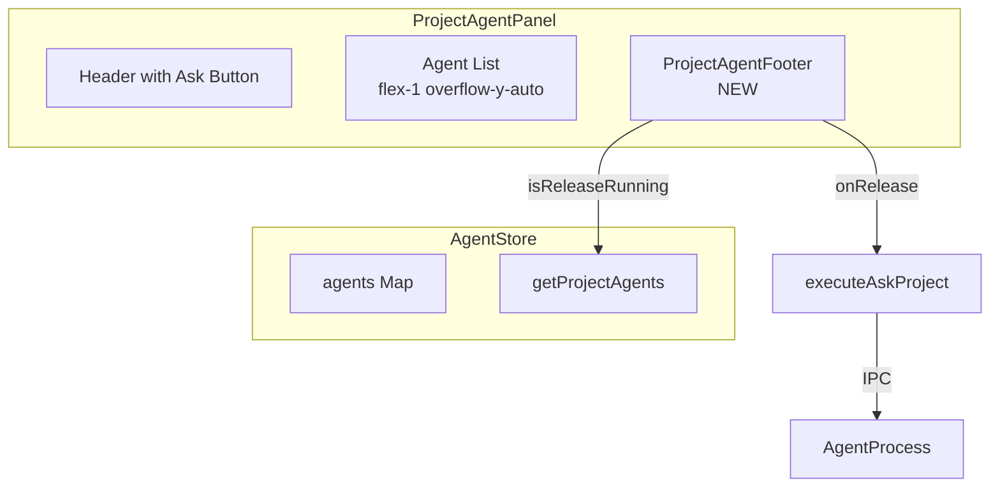
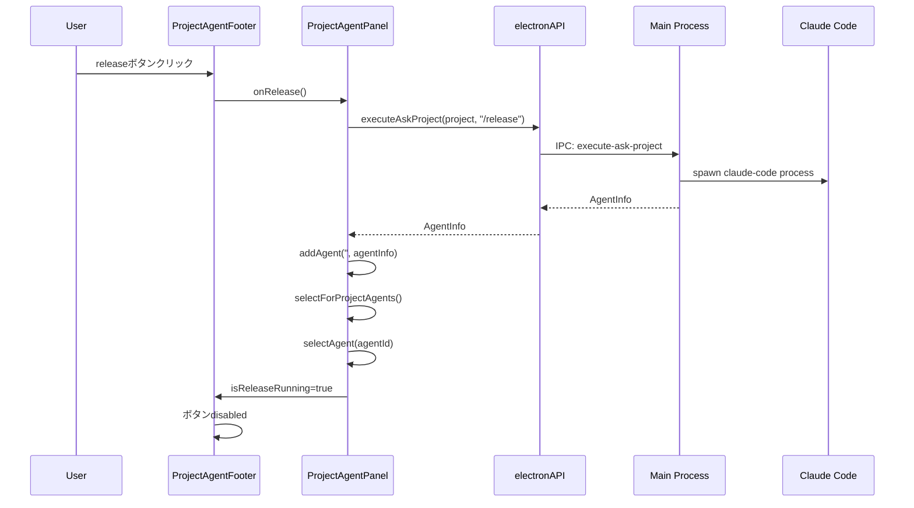
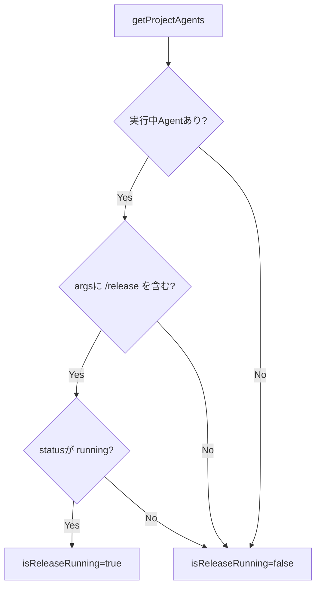

# Design: Project Agent Release Footer

## Overview

**Purpose**: この機能は、ProjectAgentPanelにフッターエリアを追加し、「release」ボタンを配置することで、プロジェクトのリリース操作へのアクセスを容易にする。

**Users**: 開発者がProjectAgentPanelからリリースAgentを起動し、プロジェクトのリリース操作を実行する。

**Impact**: ProjectAgentPanelの構造を変更し、Agent List下部に固定フッターを追加する。

### Goals

- ProjectAgentPanelにフッターエリアを追加する
- releaseボタンをフッターに配置し、`/release`コマンドでAgentを起動する
- release Agent実行中は重複起動を防止する

### Non-Goals

- release.mdの存在チェックや自動生成機能
- 複数プロジェクト間でのrelease操作
- releaseボタンの表示/非表示の設定機能
- フッターへの追加ボタン（将来の拡張として検討可能）

## Architecture

### Existing Architecture Analysis

**現在のProjectAgentPanel構成**:
- Header: `Bot`アイコン、タイトル、カウント、Askボタン
- Agent List: `AgentList`コンポーネント（`flex-1 overflow-y-auto`でスクロール可能）
- 削除確認ダイアログ
- AskAgentDialog

**既存のWorkflowFooterパターン**:
- `SpecWorkflowFooter`: `p-4 border-t`スタイル、自動実行ボタン、Worktree変換ボタン
- `BugWorkflowFooter`: 同様のスタイル、自動実行ボタン、Worktree変換ボタン

**Agent起動パターン**:
- `executeAskProject` IPC API: プロジェクト全体に対するAsk Agent起動
- `addAgent('', agentInfo)`: specId空文字でProject Agentとして追加
- `selectForProjectAgents()`: Project Agent選択状態に切り替え

### Architecture Pattern & Boundary Map



**Architecture Integration**:
- Selected pattern: コンポーネント分離パターン（既存WorkflowFooterと同様）
- Domain/feature boundaries: ProjectAgentFooterはUI表示のみを担当、ビジネスロジックは親コンポーネントに委譲
- Existing patterns preserved: WorkflowFooterのスタイル・構造パターンを踏襲
- New components rationale: ProjectAgentFooterを新規作成し、フッター機能を分離
- Steering compliance: DRY（既存パターン再利用）、関心の分離（UI/ロジック分離）

### Technology Stack

| Layer | Choice / Version | Role in Feature | Notes |
|-------|------------------|-----------------|-------|
| Frontend | React 19, TypeScript 5.8+ | UIコンポーネント実装 | 既存スタック |
| UI Library | lucide-react | Botアイコン表示 | 既存依存 |
| State | Zustand | Agent状態管理 | 既存agentStore使用 |
| IPC | electronAPI | Agent起動 | 既存executeAskProject使用 |

## System Flows

### Release Agent起動フロー



### Release実行中判定フロー



## Requirements Traceability

| Criterion ID | Summary | Components | Implementation Approach |
|--------------|---------|------------|------------------------|
| 1.1 | ProjectAgentFooter.tsxコンポーネント作成 | ProjectAgentFooter | 新規実装 |
| 1.2 | onRelease, isReleaseRunning props | ProjectAgentFooter | 新規実装 |
| 1.3 | p-4 border-tスタイル | ProjectAgentFooter | 新規実装、既存パターン流用 |
| 1.4 | WorkflowFooterと同様のデザイン | ProjectAgentFooter | 既存パターン流用 |
| 2.1 | Botアイコンとreleaseテキスト | ProjectAgentFooter | 新規実装 |
| 2.2 | flex-1スタイル | ProjectAgentFooter | 新規実装 |
| 2.3 | onReleaseハンドラ呼び出し | ProjectAgentFooter | 新規実装 |
| 2.4 | lucide-react Botアイコン | ProjectAgentFooter | 既存ライブラリ使用 |
| 3.1 | isReleaseRunning時のdisabled | ProjectAgentFooter | 新規実装 |
| 3.2 | ツールチップで「release実行中」表示 | ProjectAgentFooter | title属性使用 |
| 3.3 | disabled視覚スタイル | ProjectAgentFooter | 既存パターン流用 |
| 4.1 | ProjectAgentPanelへのフッター配置 | ProjectAgentPanel | 既存修正 |
| 4.2 | 固定位置フッター | ProjectAgentPanel | flex構造で実現 |
| 4.3 | flex構造によるレイアウト分割 | ProjectAgentPanel | 既存修正 |
| 5.1 | handleReleaseハンドラ追加 | ProjectAgentPanel | 既存修正 |
| 5.2 | /releaseプロンプトでAsk Agent起動 | ProjectAgentPanel | 既存executeAskProject使用 |
| 5.3 | 既存Project Ask方式での起動 | ProjectAgentPanel | 既存パターン流用 |
| 5.4 | Agent ListへのAgent表示 | ProjectAgentPanel | 既存機能 |
| 6.1 | 実行中Agentリストからrelease検出 | ProjectAgentPanel | 新規実装 |
| 6.2 | /releaseプロンプトAgentでisReleaseRunning=true | ProjectAgentPanel | 新規実装 |
| 6.3 | Agent List状態参照 | ProjectAgentPanel | 既存agentStore使用 |

### Coverage Validation Checklist

- [x] Every criterion ID from requirements.md appears in the table above
- [x] Each criterion has specific component names (not generic references)
- [x] Implementation approach distinguishes "reuse existing" vs "new implementation"
- [x] User-facing criteria specify concrete UI components (not just "shared components")

## Components and Interfaces

### Component Summary

| Component | Domain/Layer | Intent | Req Coverage | Key Dependencies | Contracts |
|-----------|--------------|--------|--------------|------------------|-----------|
| ProjectAgentFooter | UI/renderer | フッターエリアにreleaseボタンを表示 | 1.1-1.4, 2.1-2.4, 3.1-3.3 | lucide-react (P0) | State |
| ProjectAgentPanel | UI/renderer | フッター統合、releaseハンドラ | 4.1-4.3, 5.1-5.4, 6.1-6.3 | ProjectAgentFooter (P0), agentStore (P0), electronAPI (P0) | State |

### UI Layer

#### ProjectAgentFooter

| Field | Detail |
|-------|--------|
| Intent | ProjectAgentPanelのフッターエリアにreleaseボタンを配置し、クリック時にハンドラを呼び出す |
| Requirements | 1.1, 1.2, 1.3, 1.4, 2.1, 2.2, 2.3, 2.4, 3.1, 3.2, 3.3 |

**Responsibilities & Constraints**
- releaseボタンの表示とクリックイベントの伝播
- disabled状態の視覚的フィードバック
- ツールチップによる状態説明

**Dependencies**
- Inbound: ProjectAgentPanel - props経由でハンドラと状態を受け取る (P0)
- External: lucide-react - Botアイコン (P0)

**Contracts**: State [x]

##### State Management

```typescript
interface ProjectAgentFooterProps {
  /** releaseボタンのクリックハンドラ */
  onRelease: () => void;
  /** release Agentが実行中かどうか */
  isReleaseRunning: boolean;
}
```

**Implementation Notes**
- Integration: ProjectAgentPanelのAgent List下部に固定配置
- Validation: propsはTypeScriptで型チェック
- Risks: なし

#### ProjectAgentPanel (既存修正)

| Field | Detail |
|-------|--------|
| Intent | ProjectAgentFooterを統合し、releaseボタンのハンドラとAgent実行状態判定を提供 |
| Requirements | 4.1, 4.2, 4.3, 5.1, 5.2, 5.3, 5.4, 6.1, 6.2, 6.3 |

**Responsibilities & Constraints**
- ProjectAgentFooterの配置とレイアウト管理
- handleReleaseハンドラの実装
- isReleaseRunning状態の算出

**Dependencies**
- Inbound: App.tsx - レイアウト内で使用 (P0)
- Outbound: ProjectAgentFooter - フッターUI (P0)
- Outbound: agentStore - Agent状態取得 (P0)
- External: electronAPI.executeAskProject - Agent起動 (P0)

**Contracts**: State [x]

##### State Management

```typescript
// isReleaseRunning算出ロジック
// Note: executeAskProjectはphase='ask'でハードコードされているため、
// args文字列に'/release'が含まれるかで判定する
function isReleaseRunning(projectAgents: AgentInfo[]): boolean {
  return projectAgents.some(
    (agent) => agent.status === 'running' && agent.args?.includes('/release')
  );
}

// handleReleaseハンドラ
async function handleRelease(): Promise<void> {
  if (!currentProject) return;

  const agentInfo = await window.electronAPI.executeAskProject(
    currentProject,
    '/release'
  );
  addAgent('', agentInfo);
  selectForProjectAgents();
  selectAgent(agentInfo.agentId);
  notify.success('releaseを開始しました');
}
```

**Implementation Notes**
- Integration: flex構造でHeader/AgentList/Footerを配置
- Validation: currentProjectがnullの場合はreleaseを実行しない
- Risks: なし（args内容での判定は既存API互換）

## Data Models

### Domain Model

この機能では新規のデータモデルは追加しない。既存のAgentInfo型を使用する。

**既存AgentInfo型の関連フィールド**:
- `agentId: string` - Agent識別子
- `phase: string` - フェーズ名（Project Agentは`'ask'`）
- `args: string` - 起動時の引数文字列（`/release`を含むかで判定）
- `status: AgentStatus` - 実行状態（`'running'` | `'stopped'` | `'error'`）

### Logical Data Model

**release Agent判定ロジック**:

| 条件 | 値 | 説明 |
|------|-----|------|
| specId | `''` (空文字) | Project Agentとして分類 |
| args | `/release`を含む | executeAskProject実行時の引数で判定 |
| status | `'running'` | 実行中判定 |

## Error Handling

### Error Strategy

| エラータイプ | 対応 | ユーザーフィードバック |
|-------------|------|----------------------|
| currentProject未選択 | ボタンdisabled | 操作不可（クリック不能） |
| Agent起動失敗 | try-catchでキャッチ | notify.error表示 |
| IPC通信エラー | Promiseリジェクト | notify.error表示 |

### Error Categories and Responses

**User Errors (4xx)**:
- プロジェクト未選択: releaseボタンがdisabled状態となり操作不可

**System Errors (5xx)**:
- Agent起動失敗: 既存のhandleAskExecuteと同様のエラーハンドリング

## Testing Strategy

### Unit Tests

| テスト対象 | テスト内容 |
|-----------|----------|
| ProjectAgentFooter | propsに応じたボタン状態（enabled/disabled） |
| ProjectAgentFooter | onReleaseハンドラ呼び出し |
| ProjectAgentFooter | disabled時のツールチップ表示 |
| isReleaseRunning | release Agent実行中の判定ロジック |

### Integration Tests

| テスト対象 | テスト内容 |
|-----------|----------|
| ProjectAgentPanel | releaseボタンクリックからAgent追加までのフロー |
| ProjectAgentPanel | release Agent実行中のボタンdisabled状態 |

### E2E Tests

| テスト対象 | テスト内容 |
|-----------|----------|
| release操作 | releaseボタンクリック後、Agent Listにreleaseが表示される |

## Design Decisions

### DD-001: Project Ask方式の流用

| Field | Detail |
|-------|--------|
| Status | Accepted |
| Context | releaseボタンクリック時のAgent起動方法を決定する必要がある |
| Decision | 専用IPC APIを追加せず、既存の`executeAskProject`を`/release`プロンプトで呼び出す |
| Rationale | 既存のAsk Agent機能を再利用することで実装がシンプルになり、Agent管理（実行状態、ログ）も統一される |
| Alternatives Considered | 1) 専用IPC API `executeRelease`を追加: 追加のIPC定義・ハンドラ実装が必要、利点少ない |
| Consequences | `/release`コマンドがClaude Code側で適切に処理されることが前提となる |

### DD-002: フッターの配置方式

| Field | Detail |
|-------|--------|
| Status | Accepted |
| Context | フッターをAgent Listの下に固定するか、パネル全体の最下部（スクロール追従）にするか |
| Decision | Agent Listの下に固定（リストがスクロールしてもフッターは固定位置） |
| Rationale | 常にアクセス可能な位置にボタンを配置することで、長いAgent Listでもスクロールせずに操作できる |
| Alternatives Considered | 1) スクロール追従: Agent List長いと見えなくなる 2) Headerに配置: Askボタンと競合、視認性低下 |
| Consequences | Agent Listに`flex-1 overflow-y-auto`、フッターに`shrink-0`のflex構造が必要 |

### DD-003: ツールチップ実装方式

| Field | Detail |
|-------|--------|
| Status | Accepted |
| Context | disabled時に「release実行中」を表示するツールチップの実装方法 |
| Decision | HTML標準の`title`属性を使用する |
| Rationale | プロジェクト内で既にこのパターンが使用されており（SpecWorkflowFooter等）、追加依存なしで実装可能 |
| Alternatives Considered | 1) カスタムTooltipコンポーネント作成: オーバーエンジニアリング 2) ライブラリ追加: 不要な依存 |
| Consequences | ブラウザ標準のツールチップ表示となり、カスタマイズ性は限定的 |

### DD-004: release Agent判定ロジック

| Field | Detail |
|-------|--------|
| Status | Accepted |
| Context | release Agentが実行中かどうかを判定する方法 |
| Decision | `projectAgents.some(agent => agent.status === 'running' && agent.args?.includes('/release'))` |
| Rationale | `executeAskProject`は`phase: 'ask'`がハードコードされているため、`args`文字列に`/release`が含まれるかで判定する |
| Alternatives Considered | 1) `phase === 'release'`で判定: 既存API実装により不可能 2) IPC API拡張: オーバーエンジニアリング |
| Consequences | `args`フィールドがAgent情報に含まれている必要がある（既存実装で対応済み） |

## Integration & Deprecation Strategy

### 既存ファイルの修正（Wiring Points）

| ファイルパス | 修正内容 |
|------------|---------|
| `electron-sdd-manager/src/renderer/components/ProjectAgentPanel.tsx` | ProjectAgentFooterのimport追加、handleRelease実装、isReleaseRunning算出、フッター配置 |
| `electron-sdd-manager/src/renderer/components/index.ts` | ProjectAgentFooterのexport追加（オプション） |

### 新規ファイル

| ファイルパス | 内容 |
|------------|------|
| `electron-sdd-manager/src/renderer/components/ProjectAgentFooter.tsx` | フッターコンポーネント |
| `electron-sdd-manager/src/renderer/components/ProjectAgentFooter.test.tsx` | ユニットテスト |

### 削除ファイル

なし

## Open Questions Resolution

### Q1: release Agent実行中の判定ロジックの詳細

**Resolution**: `agent.args?.includes('/release')`で判定する。`executeAskProject`は`phase: 'ask'`がハードコードされており変更不可のため、代わりにAgent起動時の`args`文字列に`/release`が含まれるかで判定する。

**Implementation Note**: AgentInfoには`args`フィールドが含まれており、`executeAskProject`呼び出し時に渡したプロンプト情報がこのフィールドに格納される。この方式は既存APIを変更せずに実装可能。

### Q2: ツールチップの実装方法

**Resolution**: HTML標準の`title`属性を使用する。既存のSpecWorkflowFooterで同様のパターンが使用されている。
