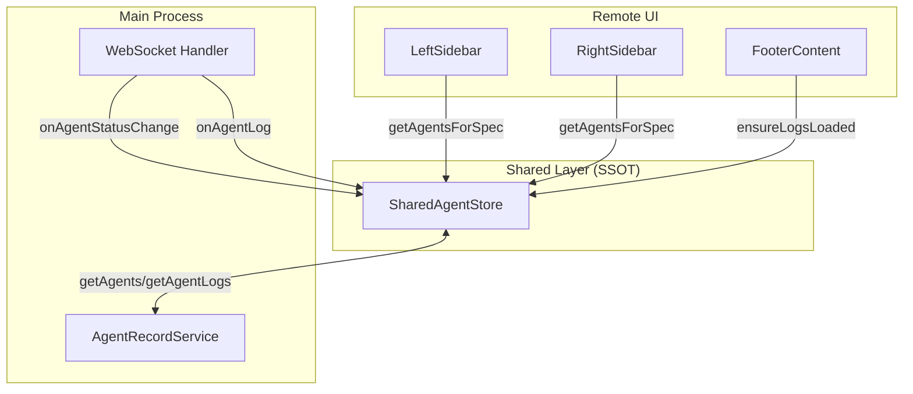
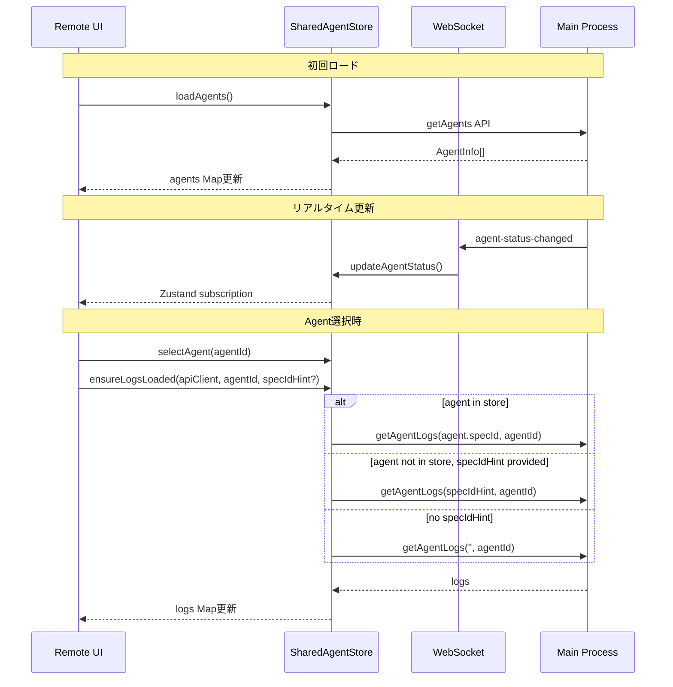

# Design: Project Agent Store Unification

## Overview

**Purpose**: Remote UIのProjectAgentデータ管理をSharedAgentStoreに一元化し、SSOT原則を徹底する。

**Users**: Remote UIおよびElectron版を利用する開発者。

**Impact**: Remote UI App.tsxのローカルstate（`projectAgents`）を削除し、3秒ポーリングを廃止。WebSocketイベントのみによるリアルタイム更新に移行。

### Goals

- ProjectAgentのデータソースをSharedAgentStoreに統一（SSOT）
- ポーリングを廃止し、WebSocketイベント駆動による更新に完全移行
- `ensureLogsLoaded`のシグネチャを変更し、agentの存在に依存しない設計に改善
- Electron版とRemote UI版のコード一貫性向上

### Non-Goals

- Agent一覧のUIデザイン変更
- WebSocket通信プロトコルの変更
- Agent起動・停止ロジックの変更
- MobileLayoutの変更（DesktopLayoutのみ対象）

## Architecture

### Existing Architecture Analysis

**現状の問題点**:

```
LeftSidebar (Remote UI)
├── useState<AgentInfo[]>(projectAgents) ← ローカルstate（問題）
├── useEffect → 3秒ポーリング → setProjectAgents ← 冗長
├── onAgentStatusChange → setProjectAgents ← 部分的更新
└── handleSelectAgent → addAgent(store) + selectAgent ← ワークアラウンド
```

1. **SSOT違反**: `projectAgents` ローカルstateと `SharedAgentStore.agents` が同じデータを重複管理
2. **冗長なポーリング**: SharedAgentStoreは既にWebSocketで更新されるため、3秒ポーリングは不要
3. **タイミング問題**: `ensureLogsLoaded`がagentの存在を前提としており、store反映前にログ取得が失敗する場合がある

**Electron版の正しいパターン**:

```
ProjectAgentPanel (Electron)
├── getProjectAgents() → shared store から取得
├── agents.size === 0 時に loadAgents() ← 初回のみ
└── handleSelectAgent → selectAgent(agentId) のみ
```

### Architecture Pattern & Boundary Map



**Key Decisions**:

- SharedAgentStoreを単一のデータソースとし、ローカルstate管理を廃止
- WebSocketイベント（`onAgentStatusChange`）による更新のみに依存
- `ensureLogsLoaded`に`specIdHint`パラメータを追加し、agentの存在に依存しない設計に

### Technology Stack

| Layer | Choice / Version | Role in Feature | Notes |
|-------|------------------|-----------------|-------|
| Frontend | React 19 + Zustand | State管理とUI | 既存パターン踏襲 |
| Messaging | WebSocket (ws) | リアルタイム更新 | 既存インフラ活用 |

## System Flows

### Agent Data Flow (After Refactoring)



**Key Decisions**:

- ポーリングを完全廃止し、WebSocketイベントのみで更新
- `ensureLogsLoaded`はagentがstoreに存在しない場合でも`specIdHint`を使用してAPI呼び出し可能

## Requirements Traceability

| Criterion ID | Summary | Components | Implementation Approach |
|--------------|---------|------------|------------------------|
| 1.1 | `projectAgents` useState削除 | LeftSidebar | ローカルstate宣言を削除 |
| 1.2 | `setProjectAgents`使用のuseEffect削除 | LeftSidebar | ポーリング・状態更新useEffectを削除 |
| 1.3 | 3秒ポーリング削除 | LeftSidebar | setInterval呼び出しを削除 |
| 1.4 | `getAgentsForSpec('')`使用 | LeftSidebar | SharedAgentStoreのセレクタを使用 |
| 1.5 | running優先・startedAt降順ソート | LeftSidebar | useMemoでソートロジック適用 |
| 2.1 | `specIdHint`パラメータ追加 | SharedAgentStore.ensureLogsLoaded | オプショナルパラメータ追加 |
| 2.2 | agent未発見時にspecIdHint使用 | SharedAgentStore.ensureLogsLoaded | フォールバックロジック追加 |
| 2.3 | specIdHint未指定時に空文字使用 | SharedAgentStore.ensureLogsLoaded | デフォルト値として`''`を使用 |
| 2.4 | 既存呼び出し元の後方互換性 | SharedAgentStore.ensureLogsLoaded | オプショナルパラメータで互換維持 |
| 2.5 | FooterContent依存配列から`selectedAgent`削除 | FooterContent | useEffect依存配列を簡素化 |
| 3.1 | `addAgent`呼び出し削除 | handleSelectAgent | ワークアラウンドコード削除 |
| 3.2 | `selectAgent(agentId)`のみに簡素化 | handleSelectAgent | 単一呼び出しに簡素化 |
| 3.3 | SharedAgentStore前提の設計 | LeftSidebar, RightSidebar | store経由でのデータ取得 |
| 4.1 | Electron版のローカルstate確認・削除 | ProjectAgentPanel | 調査結果：既にSSOT準拠 |
| 4.2 | 同一のuseSharedAgentStore使用 | 両環境 | 既存設計の確認 |
| 4.3 | 同等の動作保証 | 両環境 | 既存テストで検証 |
| 5.1 | ensureLogsLoaded新シグネチャテスト | agentStore.test.ts | 新テストケース追加 |
| 5.2 | App.tsx関連テスト更新 | Remote UI tests | ローカルstate参照を削除 |
| 5.3 | ユニットテスト通過 | 全テスト | 既存テストの更新 |

### Coverage Validation Checklist

- [x] Every criterion ID from requirements.md appears in the table above
- [x] Each criterion has specific component names (not generic references)
- [x] Implementation approach distinguishes "reuse existing" vs "new implementation"
- [x] User-facing criteria specify concrete UI components

## Components and Interfaces

| Component | Domain/Layer | Intent | Req Coverage | Key Dependencies | Contracts |
|-----------|--------------|--------|--------------|------------------|-----------|
| SharedAgentStore | Shared/State | Agent状態のSSSOT | 2.1-2.4 | ApiClient (P0) | State |
| LeftSidebar | Remote UI | Spec/Bug一覧とProjectAgent表示 | 1.1-1.5, 3.1-3.3 | SharedAgentStore (P0) | - |
| RightSidebar | Remote UI | SpecAgent一覧とワークフロー | 3.3 | SharedAgentStore (P0) | - |
| FooterContent | Remote UI | Agentログ表示 | 2.5 | SharedAgentStore (P0) | - |

### Shared Layer

#### SharedAgentStore.ensureLogsLoaded

| Field | Detail |
|-------|--------|
| Intent | Agent選択時にログをロードする。agentがstoreに存在しなくてもログ取得を可能にする |
| Requirements | 2.1, 2.2, 2.3, 2.4 |

**Responsibilities & Constraints**

- agentがstoreに存在する場合は`agent.specId`を使用してAPI呼び出し
- agentが存在しない場合は`specIdHint`を使用（提供されていれば）
- `specIdHint`も未指定の場合は`''`（空文字）をspecIdとして使用
- 既存の呼び出し元（specIdHint未指定）は動作に影響がない（後方互換性）

**Dependencies**

- Inbound: FooterContent, AgentLogPanel, AgentLogPage - ログ取得 (P0)
- Outbound: ApiClient.getAgentLogs - API呼び出し (P0)

**Contracts**: State [x]

##### Service Interface

```typescript
interface SharedAgentActions {
  /**
   * Ensure logs are loaded for an agent.
   * @param apiClient - API client for fetching logs
   * @param agentId - Target agent ID
   * @param specIdHint - Optional specId to use when agent is not in store.
   *                     Defaults to '' (empty string) if not provided.
   */
  ensureLogsLoaded: (
    apiClient: ApiClient,
    agentId: string,
    specIdHint?: string
  ) => Promise<void>;
}
```

- Preconditions: apiClient must be valid, agentId must be non-empty string
- Postconditions: logs for agentId are available in store (if API call succeeds)
- Invariants: existing logs are preserved via ID-based deduplication

### Remote UI Layer

#### LeftSidebar (Summary + Notes)

| Field | Detail |
|-------|--------|
| Intent | Spec/Bug一覧とProjectAgent表示。ローカルstate廃止後のSSSOT準拠実装 |
| Requirements | 1.1-1.5, 3.1-3.3 |

**Implementation Notes**

- `useState<AgentInfo[]>(projectAgents)` を削除
- `useSharedAgentStore((state) => state.getAgentsForSpec(''))` でProjectAgentを取得
- `useMemo`でrunning優先・startedAt降順ソートを適用
- `handleSelectAgent`から`addAgent`呼び出しを削除し、`selectAgent(agentId)`のみに

#### RightSidebar (Summary Only)

既存の`specAgents`ローカルstateは本feature対象外（Spec単位のAgent）。`handleSelectAgent`の`addAgent`呼び出し削除のみ対応。

#### FooterContent (Summary + Notes)

| Field | Detail |
|-------|--------|
| Intent | Agent選択時のログ表示 |
| Requirements | 2.5 |

**Implementation Notes**

- useEffect依存配列から`selectedAgent`を削除
- `ensureLogsLoaded`は`selectedAgentId`変更時のみ呼び出し

## Data Models

### State Model Changes

**Before (LeftSidebar)**:
```typescript
const [projectAgents, setProjectAgents] = useState<AgentInfo[]>([]);
```

**After (LeftSidebar)**:
```typescript
// ローカルstate廃止、SharedAgentStore経由で取得
const projectAgents = useSharedAgentStore(
  (state) => state.getAgentsForSpec('')
);
```

### API Contract

`ensureLogsLoaded`のシグネチャ変更:

| Parameter | Type | Required | Description |
|-----------|------|----------|-------------|
| apiClient | ApiClient | Yes | API呼び出し用クライアント |
| agentId | string | Yes | 対象Agent ID |
| specIdHint | string | No | agentがstore未存在時に使用するspecId。デフォルト: `''` |

## Testing Strategy

### Unit Tests

1. **ensureLogsLoaded specIdHint parameter**: agentがstoreに存在しない場合にspecIdHintが使用されることを検証
2. **ensureLogsLoaded default specIdHint**: specIdHint未指定時に空文字が使用されることを検証
3. **ensureLogsLoaded backward compatibility**: 既存の呼び出しパターン（specIdHint未指定）が正常動作することを検証
4. **getAgentsForSpec('')**: ProjectAgentが正しく取得されることを検証（既存テスト確認）

### Integration Tests

1. **LeftSidebar store integration**: SharedAgentStoreからProjectAgentが取得・表示されることを検証
2. **WebSocket event propagation**: onAgentStatusChangeイベントでUIが更新されることを検証

## Verification Contract

### User Journey Definition

| Journey ID | Operation Flow | Expected Result | E2E Required |
|------------|---------------|-----------------|--------------|
| UJ-001 | Remote UI Desktop版でProjectAgentパネルを確認 | SharedAgentStoreからProjectAgentが表示される | No |
| UJ-002 | Agent起動後、ProjectAgentパネルに新Agentが表示 | WebSocketイベントでリアルタイム更新 | No |
| UJ-003 | ProjectAgentを選択してログを表示 | ensureLogsLoadedでログが取得・表示される | No |

**Note**: 本featureは内部リファクタリングであり、ユーザー視点の動作変更はないため、E2Eテストは不要。既存のUnit/Integrationテストで検証。

### Impact Analysis Contract

| Target File | Action | Reason |
|-------------|--------|--------|
| `src/remote-ui/App.tsx` | UPDATE | LeftSidebar: projectAgents useState削除、ポーリング削除、handleSelectAgent簡素化 |
| `src/remote-ui/App.tsx` | UPDATE | RightSidebar: handleSelectAgent簡素化（addAgent削除） |
| `src/remote-ui/App.tsx` | UPDATE | FooterContent: useEffect依存配列からselectedAgent削除 |
| `src/shared/stores/agentStore.ts` | UPDATE | ensureLogsLoaded: specIdHintパラメータ追加 |
| `src/shared/stores/agentStore.test.ts` | UPDATE | ensureLogsLoaded新シグネチャのテストケース追加 |

## Design Decisions

### DD-001: SharedAgentStoreをProjectAgentのSSOTとする

| Field | Detail |
|-------|--------|
| Status | Accepted |
| Context | Remote UIのLeftSidebarが`projectAgents`ローカルstateを持ち、SharedAgentStoreと同じデータを重複管理していた |
| Decision | ローカルstateを廃止し、SharedAgentStoreの`getAgentsForSpec('')`を使用する |
| Rationale | `.kiro/steering/structure.md`の「Domain State (SSOT)は`src/shared/stores/`に配置、重複禁止」に準拠。Electron版の`ProjectAgentPanel`も同様の実装パターン |
| Alternatives Considered | 1) ローカルstate維持（却下：SSOT違反継続）、2) 新規storeを作成（却下：既存SharedAgentStoreで十分） |
| Consequences | コードの簡素化、データ整合性の向上、Electron版との一貫性向上 |

### DD-002: ポーリング廃止とWebSocketイベント駆動への完全移行

| Field | Detail |
|-------|--------|
| Status | Accepted |
| Context | LeftSidebarが3秒ポーリングでProjectAgentを更新していたが、SharedAgentStoreは既にWebSocketで更新される |
| Decision | ポーリングを完全に削除し、WebSocketイベント（`onAgentStatusChange`）のみで更新する |
| Rationale | SharedAgentStoreは`useAgentStoreInit`フック経由でWebSocketイベントを購読済み。ポーリングは冗長でネットワーク負荷の原因 |
| Alternatives Considered | 1) ポーリング頻度を下げる（却下：根本解決にならない）、2) ハイブリッド（却下：複雑性増加） |
| Consequences | ネットワーク負荷軽減、リアルタイム性向上、コード簡素化 |

### DD-003: ensureLogsLoadedにspecIdHintパラメータを追加

| Field | Detail |
|-------|--------|
| Status | Accepted |
| Context | `ensureLogsLoaded`はagentがstoreに存在することを前提としていたが、タイミング問題でagentがstore反映前にログ取得が失敗するケースがあった |
| Decision | `specIdHint`オプショナルパラメータを追加し、agentが見つからない場合のフォールバックとする |
| Rationale | agentの存在に依存しない設計にすることで、タイミング問題を根本的に解消。ProjectAgentの場合は`specIdHint=''`で対応可能 |
| Alternatives Considered | 1) agent存在を保証するように呼び出し側を修正（却下：タイミング制御困難）、2) storeへのagent追加を待機（却下：UX劣化） |
| Consequences | 後方互換性維持（パラメータはオプショナル）、タイミング問題解消、コードの堅牢性向上 |

### DD-004: handleSelectAgentからaddAgent呼び出しを削除

| Field | Detail |
|-------|--------|
| Status | Accepted |
| Context | `handleSelectAgent`内で`addAgent`を呼び出すワークアラウンドが存在していた（ensureLogsLoadedがagentの存在を前提としていたため） |
| Decision | DD-003の`specIdHint`導入により、`addAgent`呼び出しを削除して`selectAgent(agentId)`のみに簡素化 |
| Rationale | SharedAgentStoreは`loadAgents`と`onAgentStatusChange`でProjectAgentを管理しており、選択時に手動追加する必要がない |
| Alternatives Considered | 1) addAgent呼び出しを維持（却下：冗長なコード、SSOT違反のリスク） |
| Consequences | コードの簡素化、SharedAgentStoreの責務明確化 |
