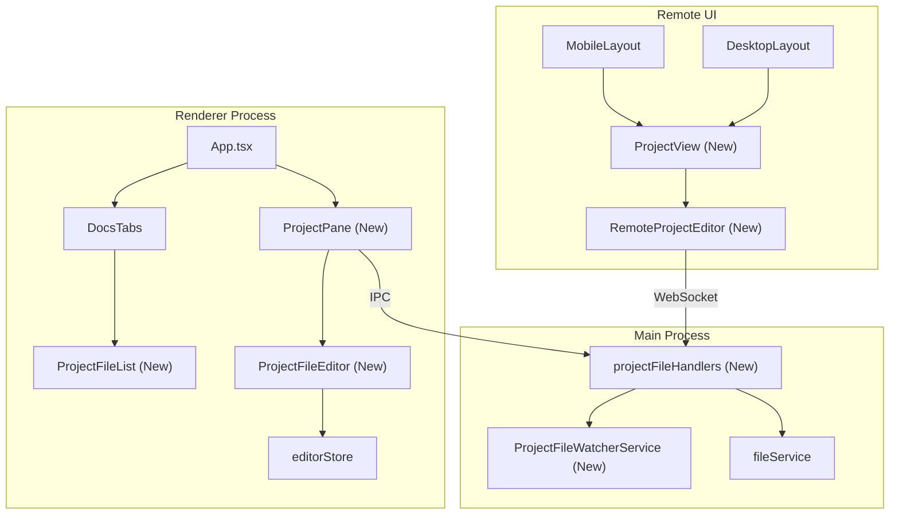
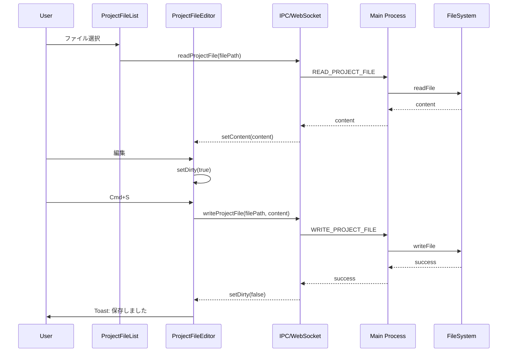
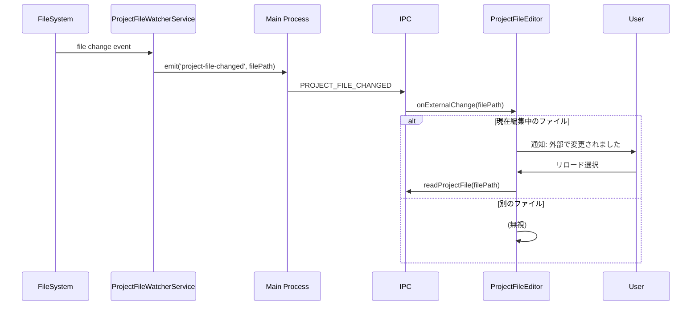

# Design: Project Config Editor

## Overview

**Purpose**: 本機能は、SDD OrchestratorのUIに「Project」タブを追加し、プロジェクト設定ファイル（CLAUDE.md、Steeringファイル）の表示・編集機能を提供する。

**Users**: 開発者がSpecs/Bugs以外のプロジェクトレベルの設定をUI内で一元管理できるようになる。

**Impact**: 既存の左サイドバーにProjectタブを追加し、メインパネルでMarkdownエディタを表示。既存のSpecs/Bugsタブのパターンを踏襲。

### Goals

- 左サイドバーに「Project」タブを追加し、Specs/Bugsと並列に配置
- CLAUDE.mdおよび`.kiro/steering/*.md`ファイルの一覧表示
- 選択したファイルのMarkdown編集機能（ArtifactEditorパターンを再利用）
- 外部変更検知と通知機能
- Desktop/Mobile両対応

### Non-Goals

- 新規Steeringファイルの作成機能
- ファイルの削除・リネーム機能
- `.kiro/steering/`以外のサブディレクトリ内ファイル対応
- Git連携（変更履歴表示等）
- ファイル差分表示（diff view）

## Architecture

### Existing Architecture Analysis

**現行パターン**:
- `DocsTabs`コンポーネントで`specs`/`bugs`タブを管理
- タブ状態は`App.tsx`で管理し、条件分岐でペイン（`SpecPane`/`BugPane`）を表示
- Remote UIの`MobileLayout`は3タブ構成（specs/bugs/agents）
- ファイル監視は`SpecsWatcherService`パターン（chokidar使用）
- エディタは`ArtifactEditor`（Electron版）/ `RemoteArtifactEditor`（Remote UI版）を使用

**Integration Points**:
- `DocsTabs`: `DocsTab`型に`'project'`を追加
- `App.tsx`: `activeTab === 'project'`の分岐追加
- `MobileLayout`: `TAB_CONFIG`に`project`タブ追加
- `IPC_CHANNELS`: Projectファイル一覧取得用チャンネル追加
- `WebSocketApiClient`: Remote UI用API追加

### Architecture Pattern & Boundary Map



**Key Decisions**:
- 既存の`ArtifactEditor`パターンを継承し、Project用に`ProjectFileEditor`を新規作成（タブ構成が異なるため）
- ファイル監視は`SpecsWatcherService`と同様のパターンで`ProjectFileWatcherService`を新規作成
- 右サイドバーはProjectビュー選択時に非表示（Requirements 3.3）

### Technology Stack

| Layer | Choice / Version | Role in Feature | Notes |
|-------|------------------|-----------------|-------|
| Frontend | React 19 + TypeScript | UI Components | 既存スタック継続 |
| State | Zustand | projectEditorStore | 編集状態管理 |
| Editor | @uiw/react-md-editor | Markdown編集 | 既存ArtifactEditorと同一 |
| File Watch | chokidar | 外部変更検知 | 既存パターン継続 |
| IPC | Electron IPC | Main-Renderer通信 | 既存パターン継続 |

## System Flows

### ファイル選択から編集・保存フロー



**Key Decisions**:
- 保存は明示的操作（Cmd+S）のみ、自動保存なし（Requirements 4.1）
- 未保存インジケーターはファイル名横のドット表示（Requirements 4.4）

### 外部変更検知フロー



**Key Decisions**:
- 通知は現在編集中のファイルのみ（Requirements 5.2）
- 自動リロードはしない、ユーザー選択制（Requirements 5.3, 5.4, 5.5）

## Requirements Traceability

| Criterion ID | Summary | Components | Implementation Approach |
|--------------|---------|------------|------------------------|
| 1.1 | 左サイドバーに3タブ表示 | DocsTabs | 既存コンポーネント拡張 |
| 1.2 | Projectタブクリックで切り替え | DocsTabs, App.tsx | 既存タブパターン拡張 |
| 1.3 | アクティブ状態の視覚表示 | DocsTabs | 既存スタイル適用 |
| 2.1 | ファイル一覧表示 | ProjectFileList (新規) | 新規実装 |
| 2.2 | 2グループ表示 | ProjectFileList | CLAUDE.md / Steering Files セクション |
| 2.3 | ファイル名表示 | ProjectFileList | 新規実装 |
| 2.4 | CLAUDE.md不在時の表示 | ProjectFileList | 条件付きセクション非表示 |
| 2.5 | Steeringファイル不在時の表示 | ProjectFileList | 「ファイルなし」表示 |
| 3.1 | ファイル選択でエディタ表示 | ProjectPane, ProjectFileEditor | ArtifactEditorパターン継承 |
| 3.2 | 選択ファイルのハイライト | ProjectFileList | 既存リストパターン適用 |
| 3.3 | 右パネル非表示 | App.tsx | activeTab条件分岐 |
| 3.4 | エディタで編集可能 | ProjectFileEditor | MDEditor再利用 |
| 4.1 | Cmd+S保存 | ProjectFileEditor, useKeyboardSave | キーボードショートカット実装 |
| 4.2 | 保存成功トースト | ProjectFileEditor, notify | 既存通知パターン |
| 4.3 | 保存失敗エラー表示 | ProjectFileEditor | エラー状態表示 |
| 4.4 | 未保存インジケーター | ProjectFileEditor | ドット表示 |
| 5.1 | 外部変更監視 | ProjectFileWatcherService | chokidar使用 |
| 5.2 | 外部変更通知 | ProjectFileEditor | 通知コンポーネント |
| 5.3 | リロード/無視選択 | ExternalChangeDialog | 新規ダイアログ |
| 5.4 | リロード時の再読み込み | ProjectFileEditor | ファイル再取得 |
| 5.5 | 無視時の現状維持 | ProjectFileEditor | 変更なし |
| 6.1 | Mobile版タブ追加 | MobileLayout | TAB_CONFIG拡張 |
| 6.2 | Mobileファイル一覧 | ProjectView | 新規実装 |
| 6.3 | Mobile詳細ページ | ProjectDetailPage | 新規実装 |
| 6.4 | Mobile戻るボタン | ProjectDetailPage | 既存ナビパターン |

### Coverage Validation Checklist

- [x] Every criterion ID from requirements.md appears in the table above
- [x] Each criterion has specific component names (not generic references)
- [x] Implementation approach distinguishes "reuse existing" vs "new implementation"
- [x] User-facing criteria specify concrete UI components

## Components and Interfaces

| Component | Domain/Layer | Intent | Req Coverage | Key Dependencies | Contracts |
|-----------|--------------|--------|--------------|------------------|-----------|
| DocsTabs | UI/Electron | タブ切り替えUI | 1.1-1.3 | ProjectFileList (P0) | - |
| ProjectFileList | UI/Shared | ファイル一覧表示 | 2.1-2.5 | useProjectFiles (P0) | State |
| ProjectPane | UI/Electron | Projectビューコンテナ | 3.1-3.4 | ProjectFileEditor (P0) | - |
| ProjectFileEditor | UI/Shared | ファイル編集 | 3.1, 3.4, 4.1-4.4, 5.2-5.5 | projectEditorStore (P0), MDEditor (P0) | State |
| projectEditorStore | State/Shared | 編集状態管理 | 4.1, 4.4 | - | State |
| ProjectFileWatcherService | Service/Main | 外部変更監視 | 5.1 | chokidar (P0) | Event |
| projectFileHandlers | IPC/Main | ファイル操作 | 3.1, 4.1, 5.4 | fileService (P0) | Service |
| ProjectView | UI/RemoteUI | Remote UIファイル一覧 | 6.2 | WebSocketApiClient (P0) | - |
| ProjectDetailPage | UI/RemoteUI | Mobile詳細ページ | 6.3, 6.4 | RemoteProjectEditor (P0) | - |
| RemoteProjectEditor | UI/RemoteUI | Remote UIエディタ | 6.2-6.4 | WebSocketApiClient (P0) | - |

### State Layer

#### projectEditorStore

| Field | Detail |
|-------|--------|
| Intent | Projectファイル編集状態を管理するZustand store |
| Requirements | 4.1, 4.4 |

**Responsibilities & Constraints**
- 編集中ファイルパス、コンテンツ、dirty状態の管理
- 外部変更通知状態の管理
- エディタモード（edit/preview）管理

**Dependencies**
- Outbound: IPC/WebSocket API - ファイル読み書き (P0)

**Contracts**: State [x]

##### State Management

```typescript
interface ProjectEditorState {
  // Current file
  currentFilePath: string | null;
  currentFileName: string | null;
  content: string;
  originalContent: string;

  // Edit state
  isDirty: boolean;
  isSaving: boolean;
  error: string | null;
  mode: 'edit' | 'preview';

  // External change notification
  externalChangeDetected: boolean;

  // Actions
  loadFile: (filePath: string, fileName: string) => Promise<void>;
  setContent: (content: string) => void;
  save: () => Promise<void>;
  setMode: (mode: 'edit' | 'preview') => void;
  handleExternalChange: (reload: boolean) => Promise<void>;
  clearEditor: () => void;
}
```

- Preconditions: `loadFile`呼び出し前にprojectPathが設定されていること
- Postconditions: `save`成功後、`isDirty === false`
- Invariants: `isDirty === (content !== originalContent)`

### Service Layer

#### ProjectFileWatcherService

| Field | Detail |
|-------|--------|
| Intent | `.kiro/steering/`およびCLAUDE.mdの外部変更を監視 |
| Requirements | 5.1 |

**Responsibilities & Constraints**
- chokidarでファイル変更を監視
- 変更検知時にRendererへイベント通知
- プロジェクト切り替え時の監視リセット

**Dependencies**
- External: chokidar - ファイル監視 (P0)
- Outbound: IPC - 変更通知 (P0)

**Contracts**: Event [x]

##### Service Interface

```typescript
interface ProjectFileWatcherService {
  start(projectPath: string): Promise<void>;
  stop(): Promise<void>;
  onChange(callback: (filePath: string) => void): void;
  isRunning(): boolean;
}
```

- Preconditions: `start`時にprojectPathが有効なディレクトリであること
- Postconditions: `start`成功後、`isRunning() === true`
- Invariants: 同時に複数のwatcherは存在しない

##### Event Contract
- Published events: `project-file-changed` (filePath: string)
- Delivery guarantees: at-most-once (debounced 300ms)

### IPC Layer

#### projectFileHandlers

| Field | Detail |
|-------|--------|
| Intent | Projectファイル操作のIPCハンドラ |
| Requirements | 3.1, 4.1, 5.4 |

**Responsibilities & Constraints**
- ファイル一覧取得
- ファイル読み書き
- 外部変更イベント転送

**Dependencies**
- Inbound: Renderer IPC calls - ファイル操作リクエスト (P0)
- Outbound: FileService - 実ファイル操作 (P0)

**Contracts**: Service [x] / Event [x]

##### Service Interface

```typescript
// IPC Channels
const PROJECT_FILE_CHANNELS = {
  LIST_PROJECT_FILES: 'ipc:list-project-files',
  READ_PROJECT_FILE: 'ipc:read-project-file',
  WRITE_PROJECT_FILE: 'ipc:write-project-file',
  PROJECT_FILE_CHANGED: 'ipc:project-file-changed',
} as const;

// Handler signatures
type ListProjectFilesHandler = () => Promise<ProjectFileInfo[]>;
type ReadProjectFileHandler = (filePath: string) => Promise<string>;
type WriteProjectFileHandler = (filePath: string, content: string) => Promise<void>;
```

- Preconditions: プロジェクトが選択されていること
- Postconditions: ファイル操作が完了すること

##### Event Contract
- Published events: `PROJECT_FILE_CHANGED` (filePath: string)
- Ordering: per-file debouncing (300ms)

### UI Components (Summary Only)

以下のUIコンポーネントは既存パターンの適用であり、インターフェースは既存コンポーネントと同等。

**DocsTabs拡張**: 既存`DocsTab`型に`'project'`を追加。タブボタンを3つに増加。

**ProjectFileList**: `SpecList`と同等のパターン。2セクション（CLAUDE.md / Steering Files）のグループ表示。

**ProjectPane**: `SpecPane`と同等のパターン。`ProjectFileEditor`をラップ。

**ProjectFileEditor**: `ArtifactEditor`と同等のパターン。タブ無し、単一ファイル編集。

**ProjectView (Remote UI)**: `SpecsView`と同等のパターン。

**ProjectDetailPage (Remote UI)**: `SpecDetailPage`と同等のパターン。戻るボタン付き。

**RemoteProjectEditor**: `RemoteArtifactEditor`と同等のパターン。

## Data Models

### Domain Model

```typescript
/** Projectファイル情報 */
interface ProjectFileInfo {
  /** ファイルパス（プロジェクトルートからの相対パス） */
  relativePath: string;
  /** ファイル名 */
  fileName: string;
  /** ファイルグループ */
  group: 'claude' | 'steering';
  /** ファイル存在フラグ */
  exists: boolean;
}

/** Projectファイル一覧 */
interface ProjectFilesState {
  claudeMd: ProjectFileInfo | null;
  steeringFiles: ProjectFileInfo[];
  isLoading: boolean;
  error: string | null;
}
```

## Error Handling

### Error Categories and Responses

**User Errors**:
- ファイル選択なしで保存 -> 保存ボタン無効化で防止
- 未保存で別ファイル選択 -> 確認ダイアログ表示

**System Errors**:
- ファイル読み込み失敗 -> エラーメッセージ表示、リトライ可能
- ファイル書き込み失敗 -> エラートースト表示、内容保持

**Business Logic Errors**:
- CLAUDE.md不在 -> セクション非表示（エラーではない）
- Steeringディレクトリ不在 -> 「ファイルなし」表示

## Testing Strategy

### Unit Tests

- `projectEditorStore.test.ts`: loadFile, save, setContent, dirty状態遷移
- `ProjectFileList.test.tsx`: グループ表示、空状態表示、選択ハイライト
- `ProjectFileWatcherService.test.ts`: start/stop、変更検知、debounce

### Integration Tests

- `projectFileHandlers.integration.test.ts`: IPC経由のファイル操作フロー
- `ProjectPane.integration.test.tsx`: 選択→読み込み→編集→保存フロー

### E2E Tests

- Projectタブ表示・切り替え
- ファイル選択とエディタ表示
- 保存操作（Cmd+S）
- Mobile版タブ切り替えと詳細表示

### Integration Test Strategy

**Components**: projectFileHandlers, FileService, ProjectFileWatcherService

**Data Flow**: IPC → projectFileHandlers → FileService → FileSystem → ProjectFileWatcherService → IPC Event

**Mock Boundaries**:
- FileSystem: 実ファイルシステム使用（一時ディレクトリ）
- IPC: モック（ipcMain.handle/emit）

**Verification Points**:
- ファイル読み込み後のstoreコンテンツ一致
- 保存後のファイルシステム内容確認
- 外部変更イベントの伝播

**Robustness Strategy**:
- ファイル監視テストは`waitFor`パターン使用
- debounce待機は明示的なタイマー制御

## Verification Contract

### User Journey Definition

| Journey ID | Operation Flow | Expected Result | E2E Required |
|------------|---------------|-----------------|--------------|
| UJ-001 | Projectタブ選択 → ファイル一覧表示 | CLAUDE.md/Steeringセクションが表示される | Yes |
| UJ-002 | ファイル選択 → エディタ表示 → 編集 → Cmd+S | 保存成功トースト表示、dirty解除 | Yes |
| UJ-003 | Mobile: Projectタブ → ファイル選択 → 戻る | 詳細ページ表示後、一覧に戻る | Yes |
| UJ-004 | 外部変更 → 通知 → リロード選択 | 最新内容がエディタに反映 | No |

### Impact Analysis Contract

| Target File | Action | Reason |
|-------------|--------|--------|
| `src/renderer/components/DocsTabs.tsx` | UPDATE | DocsTab型にproject追加、タブボタン追加 |
| `src/renderer/App.tsx` | UPDATE | activeTab === 'project'の条件分岐追加 |
| `src/remote-ui/layouts/MobileLayout.tsx` | UPDATE | TAB_CONFIGにprojectタブ追加 |
| `src/remote-ui/App.tsx` | UPDATE | projectタブ時のコンテンツ切り替え追加 |
| `src/main/ipc/channels.ts` | UPDATE | PROJECT_FILE系チャンネル追加 |
| `src/shared/api/types.ts` | UPDATE | ProjectFileInfo型追加 |
| `src/shared/api/WebSocketApiClient.ts` | UPDATE | projectFile系メソッド追加 |
| `src/renderer/components/ProjectPane.tsx` | CREATE | Projectビューコンテナ |
| `src/renderer/components/ProjectFileList.tsx` | CREATE | ファイル一覧コンポーネント |
| `src/renderer/components/ProjectFileEditor.tsx` | CREATE | ファイル編集コンポーネント |
| `src/shared/stores/projectEditorStore.ts` | CREATE | 編集状態管理store |
| `src/main/services/ProjectFileWatcherService.ts` | CREATE | ファイル監視サービス |
| `src/main/ipc/projectFileHandlers.ts` | CREATE | IPCハンドラ |
| `src/remote-ui/views/ProjectView.tsx` | CREATE | Remote UI一覧コンポーネント |
| `src/remote-ui/components/ProjectDetailPage.tsx` | CREATE | Mobile詳細ページ |
| `src/remote-ui/components/RemoteProjectEditor.tsx` | CREATE | Remote UIエディタ |

## Design Decisions

### DD-001: 専用Store vs editorStore共有

| Field | Detail |
|-------|--------|
| Status | Accepted |
| Context | Projectファイル編集の状態管理をどこで行うか |
| Decision | 専用の`projectEditorStore`を新規作成 |
| Rationale | editorStoreはSpec/Bug用に最適化されており、タブ管理やartifactType概念が前提。Projectは単一ファイル編集で概念が異なる |
| Alternatives Considered | editorStore拡張 - 既存ロジックとの混在で複雑化するリスク |
| Consequences | 新規storeのボイラープレート増加。ただし関心分離が明確 |

### DD-002: 右サイドバーの扱い

| Field | Detail |
|-------|--------|
| Status | Accepted |
| Context | Projectビュー選択時に右サイドバー（ワークフロー、Agent一覧）をどうするか |
| Decision | 右サイドバーを非表示にする |
| Rationale | Requirements 3.3の明示的要件。Steeringファイル編集にワークフロー表示は不要 |
| Alternatives Considered | 空のプレースホルダー表示 - 画面スペースの無駄 |
| Consequences | App.tsxでactiveTab条件分岐が複雑化するが、UIはシンプル |

### DD-003: ファイル監視の実装方式

| Field | Detail |
|-------|--------|
| Status | Accepted |
| Context | Requirements Open Question: 既存chokidar watcherを拡張するか新規watcherを追加するか |
| Decision | 新規`ProjectFileWatcherService`を作成 |
| Rationale | SpecsWatcherServiceは`.kiro/specs/`用に最適化。監視対象が異なるため分離が適切 |
| Alternatives Considered | SpecsWatcherService拡張 - 責務が混在、テスト困難化 |
| Consequences | 新規サービス追加。ただしstart/stopが明確に分離され保守性向上 |

### DD-004: ArtifactEditor再利用 vs 専用エディタ

| Field | Detail |
|-------|--------|
| Status | Accepted |
| Context | Requirements Open Question: 既存ArtifactEditorをそのまま使用できるか |
| Decision | 専用の`ProjectFileEditor`を新規作成（MDEditorは共有） |
| Rationale | ArtifactEditorはタブ切り替え、artifact存在チェック、検索機能等がSpec/Bug前提。Projectは単一ファイル編集で要件が単純 |
| Alternatives Considered | ArtifactEditor props拡張 - 条件分岐が複雑化、テスト困難 |
| Consequences | UIコード重複あり。ただしMDEditor自体は共有されるため、コアロジックの重複は最小限 |

### DD-005: Mobile版の画面遷移パターン

| Field | Detail |
|-------|--------|
| Status | Accepted |
| Context | Mobile版でProjectファイルをどう表示するか |
| Decision | 既存のnavigationStackパターンを使用（pushProjectDetail/popPage） |
| Rationale | Spec/Bugと同一のUXを提供。既存の`useNavigationStack`フック再利用 |
| Alternatives Considered | インライン展開 - モバイルでは画面が狭く不適切 |
| Consequences | navigationStackの型定義に`project`コンテキスト追加が必要 |

### DD-006: projectEditorStoreの配置先

| Field | Detail |
|-------|--------|
| Status | Accepted |
| Context | projectEditorStoreはUI State（renderer/stores）とDomain State（shared/stores）のどちらに配置すべきか |
| Decision | `shared/stores/projectEditorStore.ts`に配置 |
| Rationale | 1) Remote UIでも同一のエディタ状態管理が必要（WebSocket経由でファイル操作を行う）。2) editorStoreはSpec/Bug編集専用でartifactType/activeTab等の概念が異なり共有不可。3) steering/structure.mdの「Remote UIとの共有が必要なステートはshared/に配置」原則に従う |
| Alternatives Considered | renderer/stores/に配置しRemote UI側で別実装 - コード重複、状態管理ロジックの乖離リスク |
| Consequences | shared/stores/にUI State的な性質を持つstoreが追加されるが、Remote UIとの共有という明確な理由がある例外ケース |
